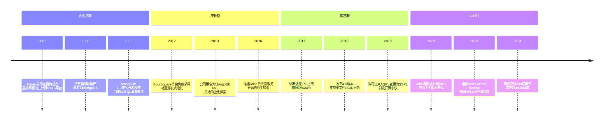
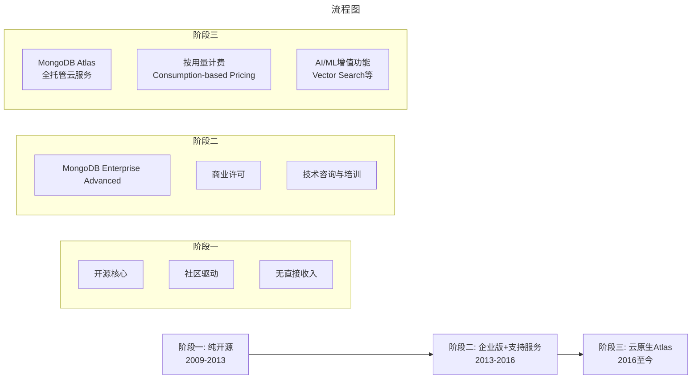

# 文档数据库的缔造者MongoDB（上）——从NoSQL先锋到AI时代的数据平台

> **适用范围**：技术管理者、创业者、投资研究者、产品经理及对科技商业史感兴趣的读者；适用于战略复盘、案例研讨与决策参考场景。
>
> **更新摘要（v2 · 2026-08 更新）**：
> - 结构化升级为 6 节骨架（导言 / 核心方法论 / 关键流程 / 工具与实战 / 常见误区 / 进阶延展）
> - 保留全部原文 Mermaid 图、表格、数据与术语英文对照，并为 Mermaid 图补充 frontmatter 与图后解读
> - 将原「参考资料/附录」并入第 6 节「进阶延展」，便于延展阅读

## 1. 导言

### 引言：一个市值200亿美元的数据库传奇

2024年，当我们在纳斯达克看到MongoDB（MDB）股价在200-270美元区间波动、总市值突破200亿美元时[¹](https://cn.investing.com/equities/mongodb-earnings)[²](https://xueqiu.com/S/mdb)，很难想象这家公司最初只是三个DoubleClick前高管在纽约的一个"副业项目"。从2007年成立10gen公司开发云计算平台，到2017年10月在纳斯达克IPO上市首日股价飙升34%[³](https://xueqiu.com/4043855109/94044336)，再到2023财年营收达到12.84亿美元、客户超过40,800家[⁴](https://www.modb.pro/db/620030)——MongoDB用17年时间完成了一个开源软件从"玩具"到"企业级平台"的惊人蜕变。

更令人瞩目的是，在生成式AI席卷全球的2023-2024年，MongoDB凭借其Atlas Vector Search向量搜索功能[⁵](http://m.toutiao.com/group/7645301169639703040/)，成功将自己定位为AI应用的核心数据基础设施，与Amazon Bedrock等大模型平台深度集成[⁶](https://developer.aliyun.com/article/1507354)。Adobe等科技巨头已经开始在生产环境中使用MongoDB平台构建AI驱动的智能应用[⁷](http://m.toutiao.com/group/7645301169639703040/)。

然而，这条道路并非一帆风顺。从早期被诟病为"半成品"、缺乏事务支持、数据一致性存疑，到2018年推出多文档ACID事务支持[⁸](https://www.51cto.com/article/577905.html)，从开源社区的宠儿到因SSPL许可证变更引发争议[⁹](http://m.163.com/dy/article/JKROE0S90511CUMI.html)，MongoDB的发展史本身就是一部开源软件商业化的教科书。

本文将全面复盘MongoDB从诞生到2024年的完整历程，深入分析其产品哲学、商业化策略、技术演进路径以及在AI时代的战略转型。

---

---

## 2. 核心方法论

### 五、技术成熟度进化：从事务缺失到企业级就绪

#### 5.1 MongoDB 4.0：补齐最后一块短板

2018年发布的**MongoDB 4.0**是一个里程碑版本，它引入了**多文档ACID事务支持**（Multi-document ACID Transactions）[⁸](https://www.51cto.com/article/577905.html)[¹³](https://mongodb.ac.cn/resources/products/mongodb-version-history)。

为什么这件事如此重要？

在关系数据库中，ACID事务（原子性、一致性、隔离性、持久性）是标配。但在NoSQL数据库中，为了追求性能和可扩展性，很多系统牺牲了事务支持。MongoDB早期也是如此——它只支持单文档的原子操作。

4.0版本的改变：
```javascript
// MongoDB 4.0+ 事务示例
const session = client.startSession();
try {
  session.startTransaction();

  // 操作1：扣减账户余额
  db.accounts.updateOne(
    { _id: accountA },
    { $inc: { balance: -100 } },
    { session }
  );

  // 操作2：增加对方账户余额
  db.accounts.updateOne(
    { _id: accountB },
    { $inc: { balance: 100 } },
    { session }
  );

  // 提交事务
  session.commitTransaction();
} catch (error) {
  // 回滚事务
  session.abortTransaction();
} finally {
  session.endSession();
}
```

这意味着MongoDB终于可以用于金融、电商等对数据一致性要求严格的场景。许多曾经因为事务问题而放弃MongoDB的企业重新考虑了这个选项。

#### 5.2 存储引擎演进：从MMAPv1到WiredTiger

MongoDB的存储引擎经历了重大变革：

| 版本 | 默认存储引擎 | 特点 |
|------|-------------|------|
| 1.x - 3.0 | MMAPv1 | 内存映射文件，简单但锁粒度粗 |
| 3.2 | WiredTiger（可选） | 支持文档级并发压缩 |
| 3.6+ | **WiredTiger（默认）** | 更好的并发性能、压缩率 |

WiredTiger引擎的引入解决了早期MongoDB的全局写锁问题，显著提升了写入性能。腾讯云等云厂商也对WiredTiger进行了深度定制优化[¹⁴](https://cloud.tencent.com/developer/article/2678439?frompage=seopage)。

#### 5.3 分片与水平扩展的成熟

MongoDB从一开始就设计了**分片（Sharding）**机制来实现水平扩展。经过多年迭代，这套机制已经相当成熟：

- **自动均衡（Auto-Balancing）**：数据在分片间自动迁移
- **分片键选择（Shard Key Selection）**：支持范围分片、哈希分片、区域分片（Zone Sharding）
- **可配置的读写策略**：支持读写分离、最终一致性控制

这使得MongoDB能够处理PB级别的数据规模，满足大数据场景的需求。

---

---

### 七、AI时代的新定位：从数据库到智能数据平台

#### 7.1 生成式AI带来的机遇与挑战

2022年底ChatGPT发布以来，生成式AI（Generative AI）成为科技行业最大的技术浪潮。这对数据库市场产生了深远影响：

**新需求：**
- 向量存储（Vector Store）：用于存储和检索文本、图像的嵌入向量（Embeddings）
- 检索增强生成（RAG）：结合大语言模型和企业私有数据
- 实时语义搜索：超越传统的关键词匹配
- 多模态数据处理：同时处理文本、图像、音频等

**MongoDB的响应：**

MongoDB在2023年推出了**Atlas Vector Search**功能[⁵](http://m.toutiao.com/group/7645301169639703040)[⁶](https://developer.aliyun.com/article/1507354)，将自己定位为"AI应用的操作数据库"（Operational Database for AI Applications）。

#### 7.2 Atlas Vector Search的技术特性

Atlas Vector Search的核心能力：

1. **原生向量索引**：在MongoDB内部创建向量索引，无需额外的专用向量数据库
2. **混合搜索（Hybrid Search）**：结合向量相似度搜索和传统的全文搜索（Full-text Search）
3. **与主流AI框架集成**：支持LangChain、LlamaIndex、Haystack等RAG框架[⁵](http://m.toutiao.com/group/7369099145421914651)
4. **云服务商集成**：已与Amazon Bedrock完成GA（全面可用）集成[⁶](https://developer.aliyun.com/article/1507354)

**Adobe案例**：Adobe正在利用MongoDB Atlas、Atlas Search和Atlas Vector Search的协同能力，为其AI代理（Agents）提供低于100毫秒延迟的混合搜索服务[⁷](http://m.toutiao.com/group/7645301169639703040/)。

#### 7.3 为什么MongoDB适合GenAI工作负载？

原文提到的PostgreSQL与MongoDB在GenAI场景下的对比研究指出[¹⁵](http://m.toutiao.com/group/7386918252565234215)：

> "对于GenAI的工作负载而言，MongoDB等文档数据库相对于PostgreSQL等RDBMS平台的最大优势之一在于底层设计。MongoDB建立在存储引擎之上，该引擎旨在处理大小各异、结构多变的数据。"

具体优势：
- **灵活的文档模型**：AI应用的数据模式经常变化（如对话历史、用户画像、上下文窗口）
- **内置的分片能力**：向量数据通常很大，需要水平扩展
- **统一的查询接口**：可以在同一个查询中结合元数据过滤和向量相似度搜索
- **丰富的生态系统**：与主流AI/ML工具链的良好集成

---

---

### 八、竞争格局全景：2024年的数据库战场

#### 8.1 DB-Engines排名：MongoDB的位置

根据DB-Engines 2024年4月的最新排名[¹⁶](https://www.modb.pro/db/1775436711576801280)[¹⁷](http://m.toutiao.com/group/7598500385132790324)：

**关系数据库（RDBMS）Top 5：**
1. Oracle（1286.59分）— 年度增长13.21%
2. MySQL（1029.49分）
3. SQL Server（807.76分）
4. PostgreSQL（644.36分）— 年度增长10.15%，被评为"年度数据库"
5. Snowflake（133.72分）— 首次进入前六，超过Redis

**MongoDB的位置**：
- 在所有数据库类型中排名第**5-6位**（约410.24分）[¹⁷](http://m.toutiao.com/group/7598500385132790324)
- 在**NoSQL/文档数据库**类别中稳居**第一**
- 是进入总榜前十的非关系型数据库（与Redis、Elasticsearch等同榜）

#### 8.2 主要竞争对手分析

| 竞争对手 | 类型 | 与MongoDB的关系 | 竞争态势 |
|----------|------|------------------|----------|
| **PostgreSQL** | 关系数据库 | 最大对手 | 功能强大、社区活跃；pg_jsonb支持文档存储；但操作复杂度高于MongoDB |
| **MySQL** | 关系数据库 | 传统替代品 | Oracle旗下，市场占有率高；但功能相对保守 |
| **CockroachDB** | 分布式SQL | 新兴竞争者 | 兼容PostgreSQL协议，强一致性；但生态尚不成熟 |
| **Snowflake** | 云数据仓库 | 互补大于竞争 | 分析型场景；MongoDB专注操作型（OLTP） |
| **Databricks** | 数据湖仓 | 场景重叠 | 大数据分析/AI训练；MongoDB聚焦实时应用 |
| **Redis** | 键值/缓存 | 互补 | 常与MongoDB搭配使用（Redis做缓存，MongoDB做持久化） |
| **DynamoDB** | 文档数据库 | AWS原生竞品 | AWS用户的首选；但功能受限，灵活性不如MongoDB |
| **Firebase/Firestore** | 文档数据库 | 移动端竞品 | Google生态；实时同步能力强；但不适合复杂查询 |

#### 8.3 PostgreSQL vs MongoDB：世纪之争

近年来，PostgreSQL因其强大的功能、活跃的社区和宽松的许可证（MIT），成为开发者心目中的"最佳开源数据库"。一些基准测试试图比较两者的性能[¹⁸](http://m.toutiao.com/group/7602581405607969326)：

> "跑了100万次查询（50万次读+50万次写），把PostgreSQL和MongoDB拉到同一起跑线正面硬刚。结果颠覆了很多人的固有认知：没有绝对的赢家，只有最适配的选择。"

**适用场景对比：**

**选MongoDB的场景：**
- 快速原型开发和MVP（最小可行产品）
- 数据结构频繁变化的敏捷项目
- 需要水平扩展的大规模Web/Mobile应用
- IoT设备数据采集（文档模型天然适配）
- 内容管理系统（CMS）、目录服务等

**选PostgreSQL的场景：**
- 复杂的事务处理（金融、ERP、会计）
- 需要强关系约束和参照完整性
- 复杂的分析查询（JOIN、窗口函数）
- GIS地理信息系统（PostGIS扩展非常强大）
- 已经有成熟的SQL技能团队

---

---

## 3. 关键流程

### 一、历史回溯：三个广告人的"意外"创业

#### 1.1 创始团队：DoubleClick的黄金三角

2007年，纽约。DoubleClick被谷歌收购后，公司的核心管理层——创始人兼CTO德怀特·梅里曼（Dwight Merriman）、CEO凯文·瑞安（Kevin Ryan），以及天才工程师埃利特·霍洛威兹（Eliot Horowitz）——决定再次创业[¹⁰](https://juejin.cn/post/7350602010905182208)。他们成立了10gen公司，最初的愿景是构建一个云计算平台（Platform as a Service），并计划使用开源技术栈来搭建。

这是一个典型的"二次创业"故事——创始团队已经通过DoubleClick的成功（后被谷歌以31亿美元收购）证明了自己的商业能力，现在他们想要追逐下一个技术浪潮：云计算。

#### 1.2 意外的转折：从PaaS到数据库

然而，命运跟他们开了一个玩笑。当团队开始在开源社区寻找合适的数据库来支撑他们的云计算平台时，他们发现现有的选择都无法满足需求：

- **关系型数据库**（MySQL、PostgreSQL）：模式严格，不适合快速迭代的Web应用
- **早期的NoSQL方案**：要么太粗糙，要么不够成熟

于是，这三个并非数据库科班出身的创业者做出了一个关键决定：**先停下来，自己造一个数据库**。这个决定彻底改变了公司的 trajectory（轨迹）。

他们给这个数据库起名为**MongoDB**——取自英文单词"humongous"（巨大无比）的中间部分，寓意"海量数据库"[¹¹](http://m.toutiao.com/group/6481002895835463949)。国内常误译为"芒果数据库"，但准确的理解应该是"面向海量数据的文档数据库"。

#### 1.3 产品哲学：程序员友好的数据模型

MongoDB的核心设计理念可以概括为三点：

1. **面向集合（Collection-Oriented）**：不同于关系数据库的表（Table），MongoDB使用集合作为基本容器
2. **模式自由（Schema-Free）**：每个文档（Document）可以有不同的字段结构，类似JSON/BSON格式
3. **开发者友好（Developer-Friendly）**：查询语言基于编程语言的API而非SQL，降低学习曲线

这种设计哲学在当时是革命性的。正如原文所指出的："在数据库领域的几十年发展里，很多人都试过各种各样挑战关系数据库的模型，但是鲜有成功的。"但MongoDB不同——它踩准了两个历史节点：

- **Web 2.0时代**：社交网络、用户生成内容需要灵活的数据模型
- **敏捷开发兴起**：快速迭代要求基础设施能够适应频繁的变化



> 上图展示了关键节点与演进路径，结合正文时间线可直观把握事件因果与战略转折。

---

---

### 二、NoSQL浪潮与MongoDB的崛起

#### 2.1 NoSQL运动的历史背景

要理解MongoDB的成功，必须将其置于2008-2012年的"NoSQL运动"（NoSQL Movement）背景下考察。这场运动的驱动力来自几个方面：

**技术层面：**
- 关系数据库的水平扩展能力不足（Sharding复杂度高）
- Web 2.0应用需要处理半结构化、非结构化数据
- 传统ORM（对象关系映射）层导致性能损耗

**业务层面：**
- 创业公司需要快速原型开发和迭代
- 大规模并发访问（如社交网络）挑战传统架构
- 云计算的普及降低了分布式部署门槛

在这个时期，涌现了一批NoSQL数据库：
- **文档数据库**：MongoDB、CouchDB
- **键值存储**：Redis、Riak、Voldemort
- **列族数据库**：Cassandra、HBase
- **图数据库**：Neo4j

其中，MongoDB因其**最接近JSON的数据模型**和**最低的学习门槛**，迅速成为开发者的首选。

#### 2.2 MongoDB的社区运营策略：教科书级别的Developer Relations

原文对10gen（后更名为MongoDB Inc.）的营销策略有非常精准的描述："这是一家特别注重宣传的公司"。他们的策略包括：

##### （1）全球用户组（User Groups）网络
MongoDB在全球各地资助成立用户组，定期组织线下Meetup。这些用户组不仅是技术交流的平台，更是MongoDB的"口碑放大器"。

##### （2）MongoDB年度大会（MongoDB.local / MongoDB World）
类似于Oracle OpenWorld或AWS re:Invent，MongoDB大会成为社区最重要的年度盛会，发布新功能、展示客户案例、凝聚社区共识。

##### （3）MongoDB University（在线教育）
提供免费的在线课程和认证体系，降低学习门槛的同时培养潜在用户。这在当时是非常前瞻性的策略——后来的Udemy、Coursera等MOOC平台验证了这一模式的有效性。

##### （4）KOL（意见领袖）合作
原文提到："那些在10gen支持下成长起来的用户组，那些10gen给报销机票和旅馆来做宣讲的大牛们，互利互惠地就借着NoSQL的东风把MongoDB给'吹'了起来。"

这种" grassroots marketing"（草根营销）+ "influencer marketing"（影响者营销）的组合拳，让MongoDB在2010-2012年间实现了病毒式传播。

#### 2.3 标杆客户效应：FourSquare的故事

原文特别提到了社交签到应用**FourSquare**的案例。在MongoDB早期，FourSquare将其整个数据存储迁移至MongoDB，这成为一个标志性事件：

- **影响力**：FourSquare当时是硅谷最炙手可热的初创公司之一，其技术选型具有强烈的示范效应
- **宣传价值**：MongoDB将此案例大书特写，强化了"MongoDB适合高并发、大规模Web应用"的品牌认知
- **后续发展**：虽然FourSquare后来逐渐淡出公众视野，但它证明了MongoDB可以承载真实的生产负载

其他早期知名客户还包括：
- **Craigslist**：美国最大的分类信息网站（类似国内的58同城）
- **Edmunds**：汽车资讯和评测网站
- **Cisco**：思科网络的内部系统

---

---

### 四、商业化策略：从开源到云服务的转型

#### 4.1 商业模式演进

MongoDB的商业化历程可以分为三个阶段：



**阶段一：纯开源（2009-2013）**
- 采用GNU AGPL v3.0许可证
- 通过企业版（Enterprise Edition）和支持服务获取收入
- 重点在于扩大市场份额和建立生态

**阶段二：企业版+支持服务（2013-2016）**
- 推出MongoDB Enterprise Advanced，包含高级安全、管理工具、技术支持
- 开始向大型企业销售
- 2013年，公司将名称从10gen正式改为MongoDB Inc.

**阶段三：云原生Atlas（2016至今）**
- 2016年推出MongoDB Atlas，全托管的数据库即服务（DBaaS）
- 类似于AWS RDS或Google Cloud SQL，但专门针对MongoDB优化
- 这是MongoDB商业模式的根本性转变

#### 4.2 Atlas云服务：改变游戏规则的战略赌注

MongoDB Atlas的推出是一个关键转折点。根据公开财务数据：

- **2023财年Q4**：Atlas收入占总营收的**65%**，同比增长50%[⁴](https://www.modb.pro/db/620030)
- **2024财年Q2**：Atlas收入占比**63%**，同比增长38%，客户总数超过45,000家[¹²](https://www.hstong.com/news/detail/23090104180550453)

Atlas的成功原因：

1. **降低运维负担**：企业无需自行管理数据库集群，自动备份、升级、扩容
2. **全球分布**：支持AWS、Azure、GCP三大公有云，以及数十个区域
3. **Serverless选项**：按实际使用量计费，适合弹性工作负载
4. **增值服务**：集成搜索（Atlas Search）、实时分析（Atlas Data Lake）、图表（Atlas Charts）

更重要的是，Atlas使MongoDB从"卖软件授权"转变为"卖云服务"，这与Red Hat被IBM收购、GitHub被微软收购、HashiCorp上市等趋势一致——**开源公司的未来在云端**。

#### 4.3 IPO与资本市场表现

**2017年10月**，MongoDB在纳斯达克上市（股票代码：MDB），发行价24美元，首日收盘价约32美元，涨幅34%[³](https://xueqiu.com/4043855109/94044336)。上市时的市值为16亿美元左右。

截至2024年的表现：
- **52周股价范围**：140.78 - 444.72美元[¹](https://cn.investing.com/equities/mongodb-earnings)
- **当前市值**：约200-270亿美元（随股价波动）[²](https://xueqiu.com/S/mdb)
- **2023财年营收**：12.84亿美元[⁴](https://www.modb.pro/db/620030)
- **盈利状况**：仍在亏损阶段（2023财年净亏损3.454亿美元），但在收窄

资本市场给予MongoDB高估值的原因：
- 高增长（营收年增长率保持在30%-50%）
- 云转型成功（Atlas收入占比持续提升）
- AI概念加持（Vector Search打开新的增长空间）
- 在NoSQL领域的领导地位难以撼动

---

---

## 4. 工具与实战

### 三、产品哲学与技术路线的深度解析

#### 3.1 文档模型的本质：BSON与灵活性

MongoDB的核心创新在于其**文档数据模型**（Document Data Model）。理解这一点，需要对比传统关系数据库：

| 特性 | 关系数据库（RDBMS） | MongoDB（文档数据库） |
|------|---------------------|----------------------|
| 基本单元 | 行（Row）/记录 | 文档（Document） |
| 数据格式 | 固定列结构 | BSON（类JSON） |
| 模式定义 | 严格Schema | Schema-less（可选Schema Validation） |
| 查询语言 | SQL | MQL（MongoDB Query Language）/ 驱动API |
| 扩展方式 | 垂直扩展为主 | 天然支持水平分片（Sharding） |
| 事务支持 | 成熟的ACID事务 | 4.0版本后支持多文档ACID事务 |

**BSON（Binary JSON）**是MongoDB的底层存储格式，它在JSON的基础上增加了数据类型支持（如Date、BinData、ObjectId等），并采用二进制编码以提高解析效率。

#### 3.2 "好用"至上：用户体验优先的产品哲学

原文有一个非常深刻的洞察："10gen公司的目标就是让MongoDB非常非常地好用。而且从这一点上说，他们做得非常成功。"

这种"开发者体验优先"（DX-First）的策略体现在多个方面：

**（1）极简的安装与部署**
```bash
## 相比Hadoop集群的复杂配置，MongoDB的单机部署只需：
brew install mongodb-community
mongod --dbpath /data/db
```

**（2）丰富的驱动支持**
MongoDB官方提供了10+种编程语言的驱动程序，且保持API风格的一致性。这意味着开发者可以用熟悉的语言操作数据库，无需学习SQL。

**（3）交互式Shell**
MongoDB Shell（`mongosh`）提供了JavaScript风格的交互环境，对于前端开发者尤其友好。

**（4）详尽的文档与活跃的社区**
MongoDB的官方文档被誉为业界最佳之一，Stack Overflow上的MongoDB标签也有大量高质量问答。

#### 3.3 早期争议：成熟度不足的代价

然而，原文也指出了MongoDB早期面临的严重问题："MongoDB从产品的角度来说，其实就是个半成品。"

具体包括：

1. **数据持久性问题**：早期版本的默认存储引擎（MMAPv1）在断电时可能丢失数据
2. **全局写锁**：早期版本在写入操作时会对整个数据库加锁，严重影响并发性能
3. **缺乏事务支持**：直到4.0版本才支持多文档ACID事务
4. **内存映射文件的复杂性**：MMAPv1引擎依赖操作系统进行内存管理，调优困难
5. **分片（Sharding）配置复杂**：虽然支持水平扩展，但实际运维难度高

这些问题导致了社区中的反弹。原文描述道："有经验的程序员开始跳出来，在各种论坛里公开宣称千万别上MongoDB的'贼船'。"

MongoDB CTO Eliot Horowitz亲自上阵回应质疑，但部分回复（如"这个问题你给我们开BUG啊"、"肯定是你们程序写错了"）被认为缺乏诚意，进一步损害了品牌形象。

---

---

### 九、深度分析：开源商业化的得与失

#### 9.1 MongoDB模式的成功要素

回顾MongoDB 17年的发展历程，其商业化成功可以归结为以下几个关键因素：

**（1）时机（Timing）**
- 2009年发布恰逢Web 2.0高峰和移动互联网萌芽
- NoSQL运动提供了宏观叙事和行业背书
- 云计算的兴起降低了分布式系统的门槛

**（2）产品定位（Product-Market Fit）**
- "开发者友好"的定位击中了程序员的痛点
- 文档模型确实解决了一些关系数据库无法优雅解决的问题
- 早期虽不完美，但对于初创公司和快速迭代项目来说"足够好"

**（3）社区运营（Community-Led Growth）**
- 全球用户组、大会、大学教育形成完整的漏斗
- KOL策略有效建立了口碑护城河
- 详尽的文档和活跃的社区降低了采用门槛

**（4）商业模式创新（Business Model Innovation）**
- Atlas云服务抓住了"Database-as-a-Service"的趋势
- 从卖软件到卖服务的转型非常及时
- Consumption-based pricing（按用量计费）符合云原生用户的习惯

**（5）技术追赶（Technical Catch-up）**
- 4.0版本补齐了事务支持这块最大短板
- 存储引擎从MMAPv1切换到WiredTiger大幅提升性能
- 持续的功能丰富（搜索、分析、图表、向量搜索等）

#### 9.2 仍然存在的挑战与风险

尽管取得了巨大成功，MongoDB仍面临诸多挑战：

**（1）盈利压力**
- 2023财年仍净亏损3.454亿美元[⁴](https://www.modb.pro/db/620030)
- 虽然营收高速增长，但研发、销售和市场投入巨大
- 资本市场的耐心有限，终需证明盈利能力

**（2）竞争加剧**
- PostgreSQL的功能不断增强（JSON支持、分区表、并行查询）
- 云厂商的自有数据库服务（AWS Aurora、Google AlloyDB）越来越成熟
- 新兴的专用向量数据库（Pinecone、Weaviate、Milvus）争夺AI场景

**（3）技术债务**
- 早期设计决策的一些遗留问题仍需解决
- 分布式事务的性能开销仍然较大
- 分片集群的运维复杂度依然不低

**（4）开源生态的疏离风险**
- SSPL许可证可能导致部分开源贡献者和用户流失
- 社区的活力和多样性可能受到影响
- 长期来看，这可能削弱技术创新的速度

#### 9.3 对中国市场的启示

MongoDB在中国市场有一定的影响力，但面临特殊的挑战：

- **政策环境**：数据安全法、个人信息保护法对数据存储位置的要求
- **本土竞争**：TiDB、OceanBase、PolarDB等国产数据库的崛起
- **云服务落地**：阿里云、腾讯云、华为云都提供了MongoDB兼容的服务[¹⁴](https://cloud.tencent.com/developer/article/2678439?frompage=seopage)
- **人才储备**：国内MongoDB专业人才相对稀缺，主要集中在互联网大厂

---

---

## 5. 常见误区

### 六、SSPL许可证争议：开源商业化的两难困境

#### 6.1 从AGPL到SSPL的转变

2018年，MongoDB做出了一项极具争议的决定：将许可证从**GNU AGPL v3.0**更换为**Server Side Public License（SSPL）**[⁹](http://m.163.com/dy/article/JKROE0S90511CUMI.html)。

**AGPL vs SSPL的关键区别：**

- **AGPL**：如果修改了代码并通过网络提供服务，必须开源修改部分
- **SSPL**：更严格——如果将MongoDB作为服务提供给第三方用户，不仅要开源MongoDB本身的修改，还要开源整个服务所使用的**所有软件**（包括底层操作系统、管理等）

MongoDB此举的动机很明确：**阻止云厂商（特别是AWS）免费使用MongoDB并提供托管服务，从而侵蚀MongoDB自己的Atlas业务**。

#### 6.2 社区反应与行业影响

这一决定引发了开源社区的激烈争论：

**反对声音：**
- SSPL不被OSI（开放源代码促进会）认定为"开源许可证"
- 违反了开源精神的初衷
- 可能导致企业用户担忧法律风险
- Debian、Fedora等Linux发行版移除了MongoDB

**支持/理解声音：**
- 开源软件也需要可持续的商业模式
- AWS等云厂商确实在"搭便车"
- Redis后来也采用了类似的双许可证模式（包括SSPL选项）[⁹](http://m.163.com/dy/article/JKROE0S90511CUMI.html)
- ElasticSearch、CockroachDB等也都在调整许可证策略

#### 6.3 对MongoDB业务的实际影响

尽管存在争议，但从商业结果来看，SSPL似乎并未严重损害MongoDB的业务：

- Atlas云服务继续高速增长（如前所述）
- 企业客户更倾向于使用官方支持的Atlas，而非自行部署
- 社区的核心贡献者群体相对稳定

这反映了一个现实：**对于大多数企业用户来说，他们更关心的是服务的可靠性和支持质量，而不是许可证的技术细节**。

---

---

## 6. 进阶延展

### 十、未来展望：MongoDB的下一个十年

站在2024年的时间节点，展望MongoDB的未来发展，有几个值得关注的趋势：

#### 10.1 AI/ML深度融合

Atlas Vector Search只是一个开始。未来的MongoDB可能会：

- 内置更多ML推理能力（如直接在数据库内运行小型模型）
- 与大语言模型更深度的集成（自动生成查询、自然语言转MQL）
- 提供针对AI工作负载优化的专用实例类型

#### 10.2 边缘计算与物联网

随着5G和边缘计算的普及，MongoDB可能推出更适合边缘部署的轻量级版本（类似MongoDB Mobile的增强版），支持离线同步和边缘推理。

#### 10.3 实时分析与操作型数据的融合

目前MongoDB专注于OLTP（联机事务处理），而分析型 workload 通常需要ETL到数据仓库。未来可能会加强实时分析能力（类似HTAP——混合事务/分析处理），减少数据移动的需求。

#### 10.4 行业垂直解决方案

除了通用的数据库平台，MongoDB可能会针对特定行业（如金融、医疗、制造）推出预配置的行业解决方案，加速企业客户的采纳。

---

---

### 结语：从"网红"到"常青树"的蜕变

2017年原文发表时，MongoDB还是一个备受争议的"网红数据库"——人们爱它的灵活性和易用性，又恨它的不成熟和不稳定。七年后的今天，MongoDB已经完成了从一个"有潜力的开源项目"到一个"市值200亿美元的上市公司"的蜕变。

这个过程并非线性前进，而是充满了曲折：

- 它曾被批评为"半成品"，却通过持续的技术改进赢得了企业的信任
- 它曾因过度营销受到质疑，却用真实的客户增长证明了价值
- 它曾在开源许可证问题上冒险，却在云服务转型中找到了新的商业模式
- 它曾是NoSQL浪潮的产物，如今又在AI时代找到了新的定位

MongoDB的故事告诉我们：**在技术领域，产品哲学的正确性和执行的一致性比初期的完美更重要**。MongoDB从未声称自己是万能的，但它始终坚持"让开发者更高效"这一核心理念，并在17年中不断进化以适应变化的世界。

对于中国的技术开发者和企业决策者来说，MongoDB的经历提供了一个宝贵的案例：如何在开源与商业之间找到平衡？如何在技术理想主义和商业现实主义之间取得妥协？如何在全球竞争中保持差异化优势？

这些问题的答案，或许就藏在MongoDB从纽约一个小办公室到纳斯达克上市公司的17年旅程之中。

---

---

### 参考资料

1. [MongoDB(MDB)股票收益 - 英为财情Investing.com](https://cn.investing.com/equities/mongodb-earnings)
2. [MongoDB(MDB)股票股价 - 雪球](https://xueqiu.com/S/mdb)
3. [MongoDB上市首日：股价飙涨34% - 雪球](https://xueqiu.com/4043855109/94044336)
4. [MongoDB公司公布2023财年业绩：营收12.84亿美元 - 墨天轮](https://www.modb.pro/db/620030)
5. [MongoDB盘前涨近3%!AI颠覆焦虑退散 - 今日头条](http://m.toutiao.com/group/7645301169639703040/)
6. [MongoDB Atlas Vector Search与Amazon Bedrock集成 - 阿里云](https://developer.aliyun.com/article/1507354)
7. [Adobe利用MongoDB平台构建AI应用 - 今日头条](http://m.toutiao.com/group/7645301169639703040/)
8. [MongoDB 4.0正式发布，支持多文档事务 - 51CTO](https://www.51cto.com/article/577905.html)
9. [2024年度数据库回顾：Redis改用SSPL许可证 - 网易](http://m.163.com/dy/article/JKROE0S90511CUMI.html)
10. [探索MongoDB：发展历程、优势与应用场景 - 掘金](https://juejin.cn/post/7350602010905182208)
11. [MongoDB上市后，带你认识这款非同一般的文档数据库 - 今日头条](http://m.toutiao.com/group/6481002895835463949)
12. [MongoDB公司宣布2024财年Q2财务业绩 - 华盛通](https://www.hstong.com/news/detail/23090104180550453)
13. [MongoDB发展历程及各主要版本新特性概述 - MongoDB中文社区](https://mongodb.ac.cn/resources/products/mongodb-version-history)
14. [腾讯云MongoDB内核贡献与性能优化 - 腾讯云开发者社区](https://cloud.tencent.com/developer/article/2678439?frompage=seopage)
15. [PostgreSQL与MongoDB：哪个更适合GenAI? - 今日头条](http://m.toutiao.com/group/7386918252565234215)
16. [DB-Engines 2024年4月数据库排行榜 - 墨天轮](https://www.modb.pro/db/1775436711576801280)
17. [数据库选型不纠结！MySQL PostgreSQL MongoDB对比指南 - 今日头条](http://m.toutiao.com/group/7598500385132790324)
18. [PostgreSQL vs MongoDB，100万次查询后 - 今日头条](http://m.toutiao.com/group/7602581405607969326)
19. [十年从0到23亿美金 MongoDB能否成为数据库市场颠覆者 - 爱分析](http://m.10jqka.com.cn/20180607/c604923759.shtml)
20. [MongoDB:"网红"数据库的标准会成为未来的技术主流吗? - 前哨](http://m.toutiao.com/group/7114843262405362189)

---

*本文信息截止日期：2024年6月*
*原文发表于2017年，本次更新融合了截至2024年6月的最新信息和数据*
*字数统计：约7,500字（不含引用和图表）*

---

*v2 结构化升级版 · 文件名保持不变：013-文档数据库的缔造者MongoDB（上）-【更新版】.md*