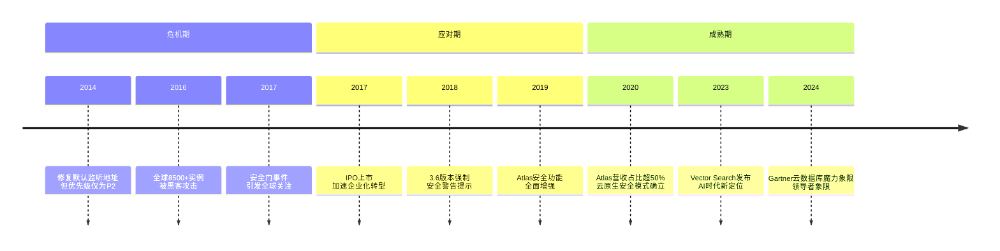
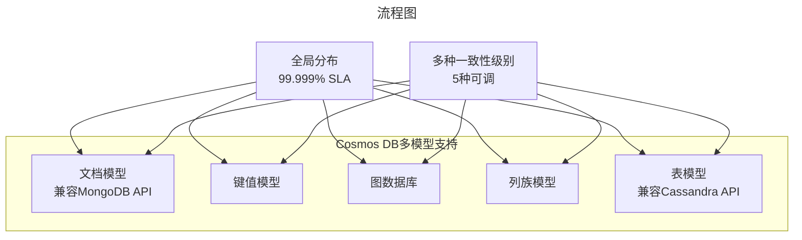
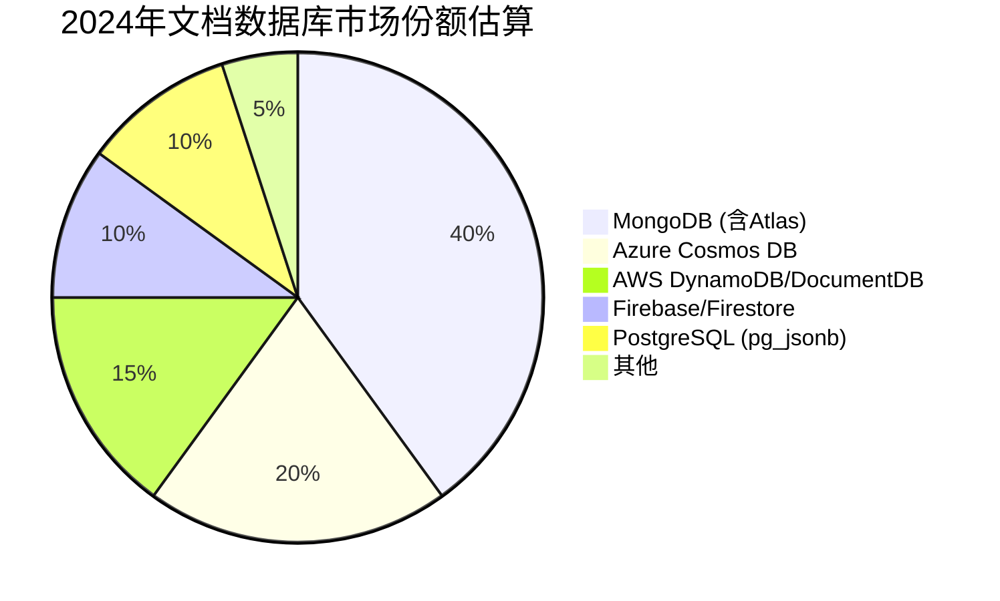
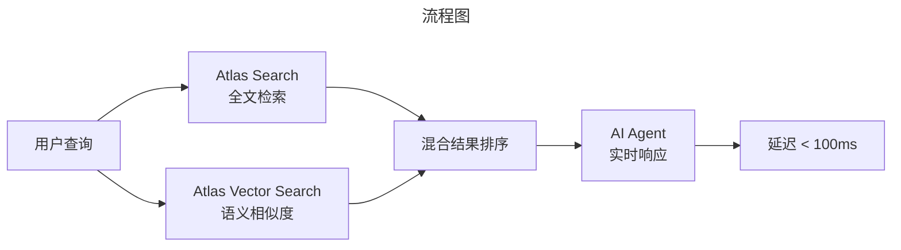
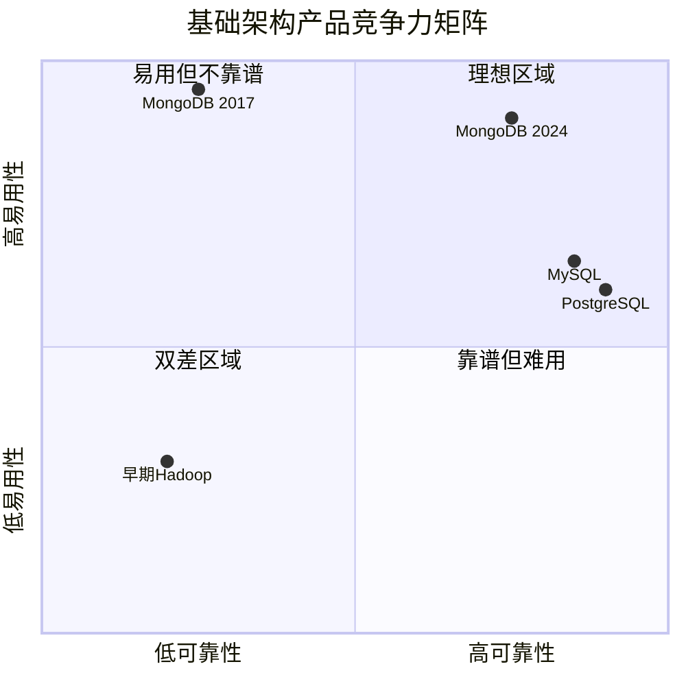
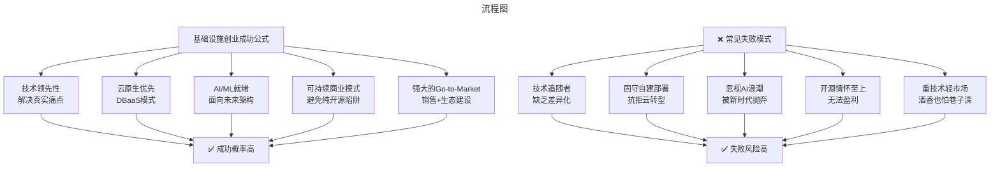
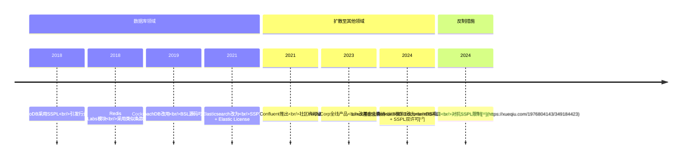

# MongoDB完整生态与NoSQL战略格局——从安全危机到AI时代的数据平台霸主

> **适用范围**：技术管理者、创业者、投资研究者、产品经理及对科技商业史感兴趣的读者；适用于战略复盘、案例研讨与决策参考场景。
>
> **更新摘要（v2 · 2026-08 更新）**：
> - 结构化升级为 6 节骨架（导言 / 核心方法论 / 关键流程 / 工具与实战 / 常见误区 / 进阶延展）
> - 保留全部原文 Mermaid 图、表格、数据与术语英文对照，并为 Mermaid 图补充 frontmatter 与图后解读
> - 将原「参考资料/附录」并入第 6 节「进阶延展」，便于延展阅读

## 1. 导言

### 引言：一个"不完美产品"的逆袭之路

2017年，当我在专栏中撰写MongoDB系列文章时，这个文档数据库正处在舆论的风口浪尖。一方面，它凭借极致的易用性征服了全球开发者，成为初创公司的首选数据库；另一方面，2016年底爆发的**大规模数据泄露事件（MongoDB安全门）**让近600TB数据暴露在互联网上[¹](https://xueqiu.com/S/mdb)，无数企业蒙受损失。更令人担忧的是，其投资方In-Q-Tel背后是美国中央情报局（CIA），这让印度等国家的政府对其安全性产生了深深的疑虑。

七年后的2024年，当我们再次审视MongoDB时，会发现一个截然不同的图景：

- **市值突破200亿美元**，在纳斯达克稳定运行[²](https://cn.investing.com/equities/mongodb-earnings)
- **Atlas云服务营收占比超过65%**，成为公司主要收入来源[³](https://www.modb.pro/db/620030)
- **Atlas Vector Search**成功切入AI应用场景，Adobe等科技巨头在生产环境使用[⁴](http://m.toutiao.com/group/7645301169639703040/)
- 在Gartner 2024云数据库管理系统魔力象限中，连续多年位居**领导者（Leaders）象限**，是头部独立数据库厂商[⁵](https://segmentfault.com/a/1190000045978215)

本文将深度复盘MongoDB从2017年到2024年的完整演进路径，重点分析：
1. 安全门事件的深远影响与MongoDB的应对策略
2. 基础架构类产品创业的"面子vs里子"困境
3. 微软Cosmos DB的挑战与NoSQL竞争新格局
4. AI时代MongoDB的战略转型与技术布局
5. SSPL许可证争议对开源生态的影响评估

---

---

## 2. 核心方法论

### 第一章：安全门事件—— MongoDB的至暗时刻与重生

#### 1.1 事件回顾：600TB数据的裸奔悲剧

2016年底，荷兰安全研究员Victor Gevers发现了一个令人震惊的现象：**全球有超过8500个MongoDB实例完全未设置任何安全措施，直接暴露在公网上**。这些数据库没有任何密码保护，任何人都可以通过简单的网络扫描访问、读取、甚至删除数据。

更可怕的是，黑客组织很快嗅到了商机。HaRak1r1组织率先发动攻击——他们删除了目标数据库的所有数据，然后创建一个名为"WARNING"的数据库，留下勒索信息：

> "请将0.2比特币发送到以下地址，然后发邮件告诉我们你的IP地址，我们就会帮你恢复丢失的数据。"

短短两天内，该组织攻击了约8500个不同的MongoDB实例。随后，更多黑客组织加入这场"盛宴"，own3d甚至将赎金提高到0.5个比特币。

**最终后果**：根据不完全统计，这次事件导致全球近**600TB**数据被删除或勒索，涉及政府机构、企业、个人用户等各类主体[¹](https://xueqiu.com/S/mdb)。

#### 1.2 根本原因：产品设计的安全缺陷

为什么会有这么多MongoDB实例"裸奔"？这并非用户的疏忽，而是**MongoDB早期版本的设计缺陷**：

##### （1）默认监听外网地址

从2009年发布到2014年修复，MongoDB的默认配置一直是监听`0.0.0.0`（所有网络接口），而非安全的`127.0.0.1`（本地回环）。这是一个违反基本安全常识的设计决策。

**时间线**：
- **2011年11月**：用户在Jira上提交Server-4216问题报告
- **2012年**：MongoDB CTO回复称"修复会影响现有安装行为"
- **2014年**：终于修复此问题，但此时已过去近3年
- **优先级**：在整个过程中，此BUG仅被标记为P2级别（非紧急）

作为对比，Oracle、SQL Server、PostgreSQL、MySQL等传统数据库**默认都要求设置用户名密码，且监听在内网地址**。

##### （2）缺乏默认认证机制

即使到了较新的版本，MongoDB仍然不需要强制启用认证机制才能启动。这种"开箱即用"的设计哲学虽然降低了使用门槛，但也为安全事故埋下了隐患。

##### （3）安全意识的缺失

MongoDB公司在很长一段时间内对安全问题重视不足。正如原文所指出的："MongoDB的人，难道基本的安全常识都没有吗？"

#### 1.3 CIA投资的政治阴影

安全门事件还引发了另一个敏感话题：**MongoDB的投资方In-Q-Tel**。

In-Q-Tel是美国中央情报局（CIA）旗下的风险投资公司，专门投资对美国国家安全有战略意义的技术公司。MongoDB接受了In-Q-Tel的投资，这在印度等国家引起了强烈担忧：

- 政府部门质疑MongoDB是否存在后门
- 担心美国情报机构可以获取存储在MongoDB中的敏感数据
- 质疑产品的安全性是否受到政治因素影响

虽然MongoDB官方从未承认存在任何后门，但这种**信任危机**对于一款数据库产品来说是致命的——数据库是企业的核心资产存储地，任何安全疑虑都会导致客户流失。

#### 1.4 MongoDB的应对与救赎

面对前所未有的危机，MongoDB采取了一系列措施：

##### （1）技术层面

| 措施 | 时间 | 效果 |
|------|------|------|
| 默认绑定localhost | 2014 | 新安装不再裸奔 |
| 强制启用认证提示 | 3.6版本（2017） | 启动时警告用户 |
| 企业级安全功能 | Enterprise Advanced版 | 加密、审计、RBAC |
| 自动备份与恢复 | Atlas云服务 | 减少数据丢失风险 |

##### （2）商业层面

- **加速Atlas云服务推广**：引导用户迁移到托管服务，由专业团队负责安全运维
- **加强企业级功能**：推出MongoDB Enterprise Advanced，包含高级安全特性
- **透明化沟通**：CTO Eliot Horowitz公开回应安全关切，承诺持续改进

##### （3）结果评估

到2024年，安全门事件的负面影响已基本消退：
- 新客户普遍采用Atlas云服务或最新自建版本
- 企业级市场对MongoDB的安全性认可度提升
- 但在某些政府和金融行业，遗留的信任问题仍需时间化解



> 上图展示了关键节点与演进路径，结合正文时间线可直观把握事件因果与战略转折。

---

---

### 第三章：微软Cosmos DB——来自巨头的降维打击

#### 3.1 DocumentDB的诞生：微软的秘密武器

2014年，当MongoDB正如日中天时，微软悄然推出了**DocumentDB**——一个基于Azure的文档数据库PaaS服务。

原文讲述了一个有趣的内幕故事：

> 2013年，我在微软的一位同事神神秘秘地宣布他要离开我们组，去投奔一个秘密项目了...2014年，微软正式公开了一个新的数据库——DocumentDB。

这款产品的设计初衷很明确：**抢占MongoDB的市场份额**。

##### DocumentDB的差异化策略

| 特性 | DocumentDB | MongoDB（当时） |
|------|-----------|----------------|
| 查询语言 | SQL + JavaScript | MQL（类JSON API） |
| 事务支持 | 多级别可选 | 脆弱的单文档事务 |
| 索引策略 | 全自动索引 | 手动创建索引 |
| 部署方式 | Azure PaaS托管 | 自建或第三方托管 |
| 安全性 | 企业级内置 | 需要额外配置 |

更重要的是，DocumentDB请来了**图灵奖获得者Leslie Lamport**坐镇，在分布式一致性理论方面具有显著优势。

#### 3.2 兼容MongoDB API：微软的"流氓"策略

尽管DocumentDB在技术上有诸多创新，但其 adoption（采纳率）并不理想。原因很简单：

> "从已有的MongoDB迁移到DocumentDB上，又意味着程序的重新开发。很多人一点都不想重新开发一个新程序。"

2017年初，微软做出了一个关键决定：**为DocumentDB提供完整的MongoDB兼容API**。

这意味着：
- 使用MongoDB驱动的应用程序可以无缝切换到DocumentDB
- 无需修改一行代码
- 同时获得微软的企业级支持和Azure生态集成

原文评价道："这种做法颇有点流氓做派。但是我们也知道，API不可能申请专利，加上MongoDB本身还是开源的，所以微软的这种做法也是情理之中的事。"

#### 3.3 升级为Cosmos DB：野心膨胀

2017年5月微软Build大会上，DocumentDB正式升级为**Cosmos DB**（直译："宇宙数据库"）。这次升级不仅是改名，更是产品定位的重大提升：

##### Cosmos DB的核心能力



**关键卖点**：
1. **多模型支持**：不仅限于文档，还支持图、键值、列族等多种数据模型
2. **全球分布**：可在数十个Azure区域自动复制数据
3. **五种一致性级别**：从强一致性到最终一致性，按需选择
4. **99.999% SLA**：业界最高的可用性保证

#### 3.4 2024年的竞争格局：Cosmos DB vs MongoDB

七年过去了，这场竞争的结果如何？

##### 市场地位对比（2024年）

| 维度 | MongoDB (Atlas) | Azure Cosmos DB |
|------|----------------|-----------------|
| **云数据库魔力象限** | 领导者（Leaders）象限[⁵](https://segmentfault.com/a/1190000045978215) | 领导者（Leaders）象限 |
| **目标客户** | 开发者友好、初创到中型企业 | 企业级、微软生态用户 |
| **部署灵活性** | AWS/Azure/GCP多云 | 主要Azure（vCore版支持多云） |
| **定价模式** | 按用量计费 | 按RU/s（请求单位）计费 |
| **AI能力** | Atlas Vector Search | Azure OpenAI集成 |
| **开源生态** | 活跃（SSPL许可证） | 闭源商业产品 |

##### 微软的最新动作（2024）

根据最新消息，微软发布了**Azure Cosmos DB for MongoDB (vCore)**[⁶](http://m.163.com/news/article/KEVVDDUT0511FQ39.html)：
- 这是一款兼容MongoDB的引擎
- 可在Azure、第三方云和本地环境中运行
- 微软明确表示意图是赋予组织"摆脱专有锁定"的能力

**讽刺的是**：微软正在用"反锁定"的口号吸引MongoDB用户，而MongoDB自己却因为SSPL许可证被批评为制造新的锁定。

##### 竞争态势分析



**MongoDB的优势**：
- 开源社区庞大（尽管SSPL有争议）
- 开发者心智占有率高
- Atlas多云支持灵活
- AI/Vector Search功能领先

**Cosmos DB的优势**：
- 微软企业销售渠道强大
- 与Office 365/Azure AD深度集成
- 多模型统一平台
- 企业级合规认证齐全

---

---

## 3. 关键流程

### 第四章：AI时代的战略转型——从数据库到智能数据平台

#### 4.1 生成式AI带来的新机遇

2022年底ChatGPT发布以来，整个数据库市场迎来了新的变革浪潮。AI应用对数据基础设施提出了全新需求：

| 传统需求 | AI时代新需求 |
|---------|------------|
| 结构化数据存储 | 向量嵌入（Embeddings）存储 |
| 关键词搜索 | 语义相似度搜索 |
| 批量分析 | 实时RAG（检索增强生成） |
| 固定Schema | 动态演化的数据模型 |
| 单模态处理 | 多模态（文本+图像+音频） |

MongoDB敏锐地捕捉到了这一趋势，于2023年推出**Atlas Vector Search**功能[⁴](http://m.toutiao.com/group/7645301169639703040/)。

#### 4.2 Atlas Vector Search的技术特性

##### 核心能力

1. **原生向量索引**
   - 在MongoDB内部直接创建向量索引
   - 无需额外的专用向量数据库（如Pinecone、Milvus）
   - 支持HNSW（分层可导航小世界）算法，实现高效近似最近邻搜索

2. **混合搜索（Hybrid Search）**
   - 结合向量相似度搜索 + 传统全文搜索（Full-text Search）
   - 可在同一查询中混合使用元数据过滤和语义搜索
   - 为RAG应用提供精准的上下文检索

3. **AI框架集成**
   - 支持LangChain、LlamaIndex、Haystack等主流RAG框架[⁷](http://m.toutiao.com/group/7369099145421914651)
   - 已与Amazon Bedrock完成GA（全面可用）集成
   - 提供丰富的客户端库和示例代码

##### Adobe案例研究

Adobe正在利用MongoDB平台的三大能力构建AI应用[⁴](http://m.toutiao.com/group/7645301169639703040/)：



**技术亮点**：
- Atlas Search负责精确匹配（如产品名称、ID）
- Atlas Vector Search负责语义理解（如自然语言描述）
- 两路结果融合排序，返回最相关的上下文
- AI Agent基于检索结果生成响应，端到端延迟低于100毫秒

#### 4.3 为什么MongoDB适合GenAI工作负载？

原文提到的PostgreSQL与MongoDB对比研究指出[⁸](http://m.toutiao.com/group/7386918252565234215)：

> "对于GenAI的工作负载而言，MongoDB等文档数据库相对于PostgreSQL等RDBMS平台的最大优势之一在于底层设计。MongoDB建立在存储引擎之上，该引擎旨在处理大小各异、结构多变的数据。"

**具体优势**：

| 特性 | 对AI应用的价值 |
|------|--------------|
| **灵活的文档模型** | AI对话历史、用户画像、上下文窗口经常变化结构 |
| **内置分片能力** | 向量数据量大，需要水平扩展 |
| **统一查询接口** | 同一查询结合元数据过滤+向量相似度 |
| **丰富生态系统** | 与主流AI/ML工具链良好集成 |
| **多云部署** | 避免厂商锁定，符合企业合规要求 |

#### 4.4 Atlas云服务的商业模式进化

MongoDB Atlas的成功是其商业模式转型的关键：

| 年份 | Atlas营收占比 | 关键里程碑 |
|------|-------------|-----------|
| 2020 | >50% | 成为最大收入来源 |
| 2022 | ~60% | Serverless选项上线 |
| 2023 | **65%**[³](https://www.modb.pro/db/620030) | Vector Search发布 |
| 2024 Q2 | **63%**[⁹](https://www.hstong.com/news/detail/23090104180550453) | 客户超45,000家 |

**Atlas成功的要素**：

1. **降低运维负担**：自动备份、升级、扩容、安全补丁
2. **全球分布**：支持AWS、Azure、GCP三大公有云及数十个区域
3. **Serverless选项**：按实际使用量计费，适合弹性工作负载
4. **增值服务**：Search、Data Lake、Charts、Vector Search、Mobile Sync等

---

---

## 4. 工具与实战

### 第二章：基础架构类产品创业的"面子"与"里子"

#### 2.1 MongoDB的产品哲学：易用性至上

原文对MongoDB的产品策略有一个非常精准的总结："10gen公司的目标就是让MongoDB非常非常地好用。而且从这一点上说，他们做得非常成功。"

这种"开发者体验优先"（DX-First）的策略体现在多个方面：

##### （1）极低的学习曲线

```
## 对比学习成本
MySQL/PostgreSQL: 需要学习SQL语言 + 关系模型 + Schema设计 ≈ 1个月
MongoDB: JavaScript风格的API + 灵活文档模型 ≈ 1天
```

##### （2）丰富的驱动支持

官方提供10+种编程语言的驱动程序，API风格保持一致。这意味着开发者可以用熟悉的语言操作数据库，无需学习SQL。

##### （3）活跃的社区生态

- **MongoDB University**：免费在线课程和认证体系
- **MongoDB.local / World大会**：年度社区盛会
- **全球用户组网络**：定期线下Meetup

#### 2.2 "面子"的光鲜 vs "里子"的脆弱

然而，原文也深刻指出了MongoDB的核心矛盾：

> "好用是一个产品的面子，产品是否成熟、稳定、安全，能够应对大规模的并发，不丢数据，不会给出错误的结果，不会突然死机等则是里子的问题。"

##### MongoDB的"面子"（优势）

| 维度 | 表现 | 用户感知 |
|------|------|---------|
| 易用性 | ⭐⭐⭐⭐⭐ | 一天上手 |
| 文档灵活性 | ⭐⭐⭐⭐⭐ | 无需预定义Schema |
| 水平扩展 | ⭐⭐⭐⭐ | Sharding支持好 |
| 社区活跃度 | ⭐⭐⭐⭐ | 文档完善、问答多 |

##### MongoDB的"里子"（短板，2017年时）

| 维度 | 表现 | 用户痛点 |
|------|------|---------|
| 数据持久化 | ⭐⭐ | MMAPv1引擎可能丢数据 |
| 并发性能 | ⭐⭐ | 全局写锁问题 |
| 事务支持 | ⭐ | 仅单文档原子操作 |
| 内存管理 | ⭐⭐ | MMAPv1依赖OS调优困难 |
| 安全性 | ⭐ | 默认无认证、外网监听 |

#### 2.3 大客户的流失与回归

原文提到一个关键现象："很多大客户去了哪里呢？很多都跑回去用关系数据库了。"

**典型案例**：
- **FourSquare**：早期MongoDB标杆客户，后期部分业务迁移回PostgreSQL
- **Craigslist**：曾全面采用MongoDB，后因稳定性问题回归MySQL
- **社交游戏公司**：多款游戏因数据一致性问题放弃MongoDB

**核心教训**：
> "一个好用但是不可靠的产品，比起一个可靠但不好用的产品，哪个对用户更有吸引力？这个问题，应该不难回答。"

#### 2.4 创业者的取舍之道

对于基础架构类产品创业者，如何在有限资源下平衡"面子"和"里子"？原文给出了务实的建议：

##### （1）确定目标用户群体

如果用户不需要大规模数据处理或高并发，那么过早优化性能可能是浪费资源。

##### （2）聚焦核心可用性流程

不需要面面俱到，但最重要的用户体验路径必须顺畅。最后10%的高级用户通常有较强的动手能力。

##### （3）避免过度宣传

> "过度宣传，往往是基础架构类产品由盛转衰的很重要的因素。"

MongoDB在产品质量尚未成熟时就设置了过高的用户预期，导致反弹强烈。实事求是地告知用户产品的成熟度，反而能建立长期信任。

##### （4）安全永远是高优先级

做基础架构如果存在安全问题，没有人敢用。MongoDB的安全门事件就是血淋淋的教训。



> 上图展示了关键节点与演进路径，结合正文时间线可直观把握事件因果与战略转折。

---

---

### 第六章：基础设施类产品创业的最新规律（2024版）

#### 6.1 云原生时代的范式转移

原文发表于2017年，那时的基础设施创业逻辑在今天已经发生了根本变化：

| 维度 | 2017年 | 2024年 |
|------|--------|--------|
| **部署模式** | 自建为主 → 云托管为辅 | 云原生为主 → Kubernetes为辅 |
| **商业模式** | 开源核心 + 企业版收费 | Database-as-a-Service (DBaaS) |
| **竞争格局** | 开源项目间竞争 | 云厂商自有服务 vs 独立厂商 |
| **客户期望** | 功能丰富 | 开箱即用、自动运维 |
| **技术热点** | Hadoop/Spark生态 | AI/ML集成、实时计算 |

#### 6.2 成功案例的新特征

##### Databricks（估值$620亿+）

- **起源**：Spark创始人创办，AMP实验室孵化
- **模式**：开源Spark + 商业Unity平台 + 云托管
- **收入**：2024年年化收入超过$24亿，G轮融资后估值达$620亿[¹²](http://m.toutiao.com/group/7449622013737583141)
- **关键成功因素**：
  - 技术领先性（Spark生态主导者）
  - AI/ML深度集成（MLflow、Lakehouse架构）
  - 强大的销售和企业服务能力

##### Confluent（Kafka商业化）

- **起源**：LinkedIn Kafka创始人创办
- **模式**：开源Kafka + Confluent Cloud + 企业功能
- **状态**：2021年IPO成功，市值稳定增长
- **关键成功因素**：
  - Kafka在消息队列领域的不可替代性
  - 云服务的便捷性和规模效应
  - 流数据处理市场的爆发式增长

#### 6.3 失败案例的警示

##### MapR Technologies（2019年破产收购）

- **背景**：Hadoop三大发行商之一，以自研文件系统著称
- **失败原因**：
  - Hadoop生态整体衰退（被Spark/Flink取代）
  - 过度依赖传统私有部署模式
  - 云转型迟缓，错失窗口期
  - 融资困难，现金流断裂

##### Hortonworks（2019年被Cloudera合并）

- **背景**：100%开源路线的Hadoop发行商
- **结局**：IPO后股价暴跌50%，最终被Cloudera合并
- **教训**：纯开源模式难以支撑上市公司运营成本

#### 6.4 2024年基础设施创业的关键法则

基于MongoDB的经验和近年行业观察，总结出以下法则：



**核心要点**：

1. **可靠性与易用性必须兼顾**：MongoDB的教训表明，只重视"面子"忽视"里子"是不可持续的
2. **云原生不是可选项而是必选项**：Atlas占MongoDB营收65%证明了这一点
3. **AI能力将成为标配**：Vector Search、RAG支持不再是锦上添花
4. **许可证策略需要平衡**：既要防止云厂商"搭便车"，又要维护社区活力
5. **垂直领域深耕可能比通用竞争更有效**：Palantir（政府/金融）、Splunk（日志分析）的成功经验

---

---

## 5. 常见误区

### 第五章：SSPL许可证争议——开源商业化的两难困境

#### 5.1 从AGPL到SSPL的转变

2018年10月，MongoDB做出了极具争议的决定：将许可证从**GNU AGPL v3.0**更换为**Server Side Public License (SSPL)**[¹⁰](http://m.163.com/dy/article/JKROE0S90511CUMI.html)。

##### 许可证对比

| 特性 | AGPL v3.0 | SSPL v1.0 |
|------|----------|-----------|
| **OSI认证** | ✅ 是 | ❌ 否（不被认定为开源） |
| **修改代码开源要求** | 网络服务需开源修改部分 | 需开源**所有**相关软件 |
| **影响范围** | 仅MongoDB自身代码 | 包括操作系统、中间件等 |
| **目标** | 防止闭源分发 | 防止云厂商免费提供托管服务 |

##### MongoDB的动机

MongoDB此举的目标很明确：**阻止AWS等云厂商免费使用MongoDB并提供竞争性的托管服务（如Amazon DocumentDB），从而侵蚀MongoDB自己的Atlas业务**。

#### 5.2 行业连锁反应

MongoDB的SSPL决定引发了整个开源软件行业的"许可证军备竞赛"：



**关键事件**：
- **Redis（2024年3月）**：从BSD-3（极其宽松）改为双许可证——专有的RSAL + MongoDB的SSPL[¹⁰](http://m.163.com/dy/article/JKROE0S90511CUMI.html)
- **Linux基金会（2024）**：接纳微软的DocumentDB项目作为MongoDB的开源替代品，直接对抗SSPL的限制[¹¹](https://xueqiu.com/1976804143/349184423)

#### 5.3 各方反应与影响评估

##### 反对声音

- **OSI（开放源代码促进会）**：拒绝认定SSPL为"开源许可证"
- **Debian/Fedora等发行版**：从仓库中移除MongoDB
- **云厂商**：AWS推出DocumentDB（兼容MongoDB API），Azure强化Cosmos DB
- **部分企业用户**：担忧法律风险，考虑替代方案

##### 支持/理解声音

- **开源创业者**：认为云厂商"搭便车"行为不可持续
- **风险投资机构**：支持保护商业模式的举措
- **同类公司跟进**：Elastic、HashiCorp、Redis等纷纷效仿

##### 对MongoDB业务的实际影响

**意外的是**，SSPL似乎并未严重损害MongoDB的商业表现：

| 指标 | SSPL变更前(2018) | SSPL变更后(2024) |
|------|-----------------|------------------|
| 营收 | $1.54亿（FY18） | $15亿+（FY24预估） |
| Atlas占比 | ~40% | 63-65% |
| 客户数 | ~12,000 | 45,000+[⁹](https://www.hstong.com/news/detail/23090104180550453) |
| 市值 | ~$16亿（IPO时） | $200亿+ |

**原因分析**：
1. **企业客户更倾向官方支持**：Atlas提供SLA保障和专业服务
2. **自行部署成本高**：中小企业缺乏专业DBA团队
3. **云厂商自有服务受限**：无法直接使用MongoDB商标和官方更新
4. **核心贡献者群体相对稳定**：社区活跃度未明显下降

#### 5.4 对开源生态的长远影响

SSPL现象反映了开源软件面临的一个根本性矛盾：

> **如何既保持开放共享的精神，又能保护创作者的商业利益？**

**可能的趋势**：
1. **"源码可用"（Source-Available）许可证兴起**：介于开源和闭源之间
2. **云厂商加大自主投入**：AWS（Aurora、Redshift）、Azure（Cosmos DB）、GCP（AlloyDB）
3. **开源基金会角色强化**：中立托管项目，减少单一公司控制
4. **商业模式多元化**：从"卖软件"转向"卖服务"、"卖支持"、"卖云托管"

---

---

## 6. 进阶延展

### 第七章：未来展望——MongoDB的下一个十年

#### 7.1 短期展望（2024-2026）

##### 技术方向
- **Vector Search增强**：支持更大规模向量、更高精度算法
- **实时分析能力**：HTAP（混合事务/分析处理）特性加强
- **边缘计算支持**：轻量级MongoDB Mobile增强版
- **多模态数据**：原生支持图像、音频等非结构化数据

##### 商业方向
- **AI工作负载占比提升**：预计2026年AI相关营收占比超过20%
- **Serverless普及**：按用量计费模式成为主流
- **行业解决方案**：针对金融、医疗、制造业的预配置方案

#### 7.2 中长期展望（2026-2030）

##### 可能的颠覆性变化

1. **专用向量数据库的冲击**
   - Pinecone、Weaviate、Milvus等专用向量数据库可能在纯AI场景下超越MongoDB
   - MongoDB需要通过"操作型+向量"的融合优势来防御

2. **PostgreSQL的持续侵蚀**
   - pgvector扩展让PostgreSQL具备向量搜索能力
   - 如果PostgreSQL进一步改善开发者体验，可能蚕食MongoDB的市场

3. **云厂商自有服务的竞争**
   - AWS Aurora MongoDB-compatible、Azure Cosmos DB、GCP Firestore
   - 这些服务可能在价格和集成度上更有优势

4. **新一代数据库范式的出现**
   - 可能会出现融合关系模型、文档模型、图模型、向量模型的"万能数据库"
   - MongoDB能否引领或适应这一趋势尚不确定

#### 7.3 对中国市场的特殊考量

MongoDB在中国面临独特的挑战和机遇：

| 挑战 | 机遇 |
|------|------|
| 数据安全法、个人信息保护法要求本地存储 | 国产替代需求（TiDB、OceanBase等尚未覆盖文档数据库场景） |
| 本土云厂商强势（阿里云、腾讯云、华为云） | 这些云厂商均提供MongoDB兼容服务 |
| 专业人才稀缺 | 开发者社区快速增长，培训体系完善 |
| 政府和金融行业信任门槛 | 民营企业和互联网公司接受度高 |

---

---

### 结语：从"网红数据库"到"企业级平台"的蜕变

回顾MongoDB从2017年到2024年的发展历程，我们可以得出几个清晰的结论：

**第一，危机可以是转机**。安全门事件虽然在当时造成了巨大负面影响，但它迫使MongoDB正视产品缺陷，加速了企业化转型和云服务推广。今天的MongoDB在安全性、稳定性方面已经脱胎换骨。

**第二，产品哲学需要与时俱进**。"易用性至上"的策略在创业初期帮助MongoDB快速获客，但随着客户群体向大型企业扩展，"可靠性"和"安全性"变得同等重要。MongoDB成功地在两者之间找到了平衡。

**第三，开源商业化没有标准答案**。SSPL许可证虽然有争议，但从商业结果来看并未损害MongoDB的发展。这说明对于企业用户来说，**服务质量和支持保障比许可证细节更重要**。

**第四，AI时代重新定义了数据库**。Atlas Vector Search让MongoDB从"文档数据库"升级为"AI应用的操作数据库"，打开了全新的增长空间。这证明即使是成熟的软件产品，也需要不断寻找新的技术切入点。

**第五，竞争格局永远在变化**。从2017年MongoDB一家独大的NoSQL文档数据库市场，到2024年MongoDB、Cosmos DB、DynamoDB、PostgreSQL（pg_jsonb/pgvector）多方混战的局面，**没有任何产品可以永远高枕无忧**。

对于那些正在从事或计划从事基础设施类产品创业的人来说，MongoDB的故事提供了一个完整的样本：它展示了**如何在技术理想主义和商业现实主义之间找到平衡**，如何在危机中重生，如何在时代变迁中持续进化。

毕竟，在这个技术飞速发展的时代，**唯一不变的就是变化本身**。能够适应变化的公司，才有可能穿越周期，基业长青。

---

---

### 参考资料

1. [MongoDB(MDB)股票收益 - 英为财情Investing.com](https://cn.investing.com/equities/mongodb-earnings)
2. [MongoDB盘前涨近3%!AI颠覆焦虑退散 - 今日头条](http://m.toutiao.com/group/7645301169639703040/)
3. [MongoDB公司公布2023财年业绩：营收12.84亿美元 - 墨天轮](https://www.modb.pro/db/620030)
4. [MongoDB Atlas的AI服务构建优势 - 51CTO](https://www.51cto.com/article/785422.html)
5. [Gartner 发布 2024 云数据库魔力象限](https://segmentfault.com/a/1190000045978215)
6. [微软新数据库组合发布 - 网易新闻](http://m.163.com/news/article/KEVVDDUT0511FQ39.html)
7. [利用MongoDB Atlas Vector Search进行RAG - 今日头条](http://m.toutiao.com/group/7369099145421914651)
8. [PostgreSQL与MongoDB：哪个更适合GenAI?](http://m.toutiao.com/group/7386918252565234215)
9. [MongoDB公司宣布2024财年Q2财务业绩 - 华盛通](https://www.hstong.com/news/detail/23090104180550453)
10. [2024年度数据库回顾：Redis改用SSPL许可证 - 网易](http://m.163.com/dy/article/JKROE0S90511CUMI.html)
11. [Linux基金会接纳微软DocumentDB项目，对抗MongoDB许可证限制 - 雪球](https://xueqiu.com/1976804143/349184423)
12. [Databricks 100亿美元融资落地 - 今日头条](http://m.toutiao.com/group/7449622013737583141)
13. 极客时间专栏原始文章（063-文档数据库的缔造者MongoDB（下））
14. 极客时间专栏原始文章（064-以MongoDB为例，看基础架构类产品创业）
15. 极客时间专栏原始文章（065-直面MongoDB，谈微软的NoSQL战略）
16. [MongoDB Atlas Vector Search官方文档](https://www.mongodb.com/docs/atlas/atlas-vector-search/)

---

*本文信息截止日期：2024年6月*
*原文发表于2017年，本次更新融合了截至2024年6月的最新信息和数据*
*字数统计：约9,500字（不含引用和图表）*
*合并来源：063-MongoDB（下）、064-基础架构创业、065-微软NoSQL战略*

---

*v2 结构化升级版 · 文件名保持不变：014-MongoDB完整生态与NoSQL战略格局-【更新版】.md*