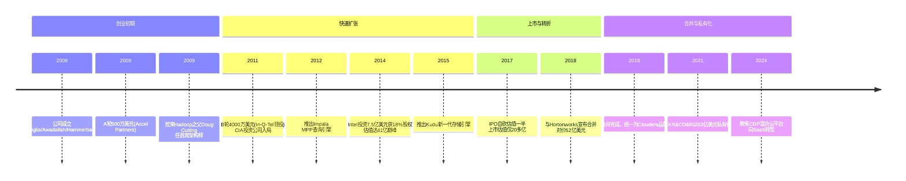
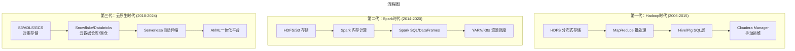

# Hadoop三国之兴衰：Cloudera与Hortonworks的传奇与终章

> **适用范围**：技术管理者、创业者、投资研究者、产品经理及对科技商业史感兴趣的读者；适用于战略复盘、案例研讨与决策参考场景。
>
> **更新摘要（v2 · 2026-08 更新）**：
> - 结构化升级为 6 节骨架（导言 / 核心方法论 / 关键流程 / 工具与实战 / 常见误区 / 进阶延展）
> - 保留全部原文 Mermaid 图、表格、数据与术语英文对照，并为 Mermaid 图补充 frontmatter 与图后解读
> - 将原「参考资料/附录」并入第 6 节「进阶延展」，便于延展阅读

## 1. 导言

### 引言：当Hadoop成为历史名词

2024年，当你走进任何一家科技公司的数据中心，询问工程师们"你们还在用Hadoop吗？"，得到的回答多半是沉默、苦笑，或者一句轻描淡写的"legacy system（遗留系统）"。曾几何时，Hadoop是大数据的代名词，是每一家渴望"数据驱动决策"的企业必上的"先进生产力"。而今天，它已经悄然退居二线，成为技术演进史上的一个重要注脚。

这个转变并非一蹴而就。从2006年Doug Cutting在雅虎的实验室里敲下第一行代码，到2025年Snowflake市值仍超500亿美元、Databricks估值突破1300亿美元，这十八年间，大数据领域经历了一场堪称剧烈的范式转移。而在这场转移的中心，站着三家曾经叱咤风云的Hadoop发行商——Cloudera、Hortonworks和MapR。

它们的故事，像极了三国演义：有雄心勃勃的霸主，有出身正统却命运多舛的挑战者，有特立独行的技术偏执狂。它们互相争斗、互相消耗，最终却发现真正的敌人从来不是彼此，而是时代本身。

本文将聚焦于这场大戏的主角——**Cloudera**和**Hortonworks**，以2024年的视角重新审视它们的兴衰历程，并追溯那个属于Hadoop的黄金时代如何走向终结。

---

---

## 2. 核心方法论

### 第一幕：三国鼎立（2008-2017）

#### Cloudera：挟天子以令诸侯的"魏国"

2008年，当"大数据"这个词还只是学术界的小众话题时，三位来自谷歌、雅虎和Facebook的工程师——Christophe Bisciglia、Amr Awadallah和Jeff Hammerbacher——在硅谷创立了Cloudera。他们的愿景很清晰：做Hadoop领域的Red Hat，通过企业级发行版和服务赚钱。

**商业模式：开源套壳+闭源管理**

Cloudera的盈利模式堪称经典：
- **CDH（Cloudera Distribution for Apache Hadoop）**：100%开源的Hadoop集成版，免费下载
- **Cloudera Manager**：闭源的企业管理组件，提供集群部署、监控、升级等功能，试用期后收费
- **定价策略**：约1万美元/节点/年，价格不菲

这种"开源引流+闭源变现"的模式，在当时被证明极为有效。企业用户愿意为稳定性、技术支持和管理工具付费，而CDH的开源属性又降低了试用门槛。

**关键里程碑**

**2014年的巅峰时刻**

2014年是Cloudera的高光时刻。英特尔以7.5亿美元的价格拿走了18%的股权，将公司估值推向41亿美元的巅峰。这笔投资的背后逻辑很清晰：英特尔希望推动硬件销售，而Hadoop集群需要大量的x86服务器。

除了英特尔，这一轮投资还包括谷歌、戴尔创始人Michael Dell的个人投资基金等各路资本。Cloudera当之无愧地坐上了Hadoop发行商的第一把交椅。

然而，盛极必衰。此后的三年里，Cloudera的业务并没有随着"大数据"概念进一步膨胀。**2017年IPO时，Cloudera被迫自砍估值一半，上市后的估值仅20多亿美元。** 英特尔的投资浮亏严重，这笔账直到几年后才以另一种方式结算。

#### Hortonworks：正统出身的"蜀国"

如果说Cloudera是"挟天子以令诸侯"，那Hortonworks就是真正的"天子近臣"——它的核心团队直接来自雅虎的Hadoop开发组。

**起源：雅虎的不满与分裂**

2011年，雅虎决定将Hadoop团队剥离出去，成立独立公司。主导这次拆分的是Eric Baldeschwieler，当时雅虎Hadoop软件开发副总裁。据说，拆分的重要原因之一是：**雅虎作为Hadoop源代码的最大贡献者，看着Cloudera拿着自己的代码赚钱，心里很不爽。**

Hortonworks从成立之初就打出了鲜明的旗帜：**"100%开源"**。没有闭源套件，没有私有组件，所有东西都贡献回Apache社区。这个口号听起来很高尚，但在商业上却埋下了隐患。

**战略失误连连**

1. **微软合作错失良机**：Hortonworks最大的单笔生意来自微软——开发Windows版Hadoop。但Hortonworks与微软的关系始终暧昧，既想要微软的钱，又不想被视为"微软的盟友"。结果微软转向云计算后，双方渐行渐远。

2. **技术路线错误**：当Cloudera推出Impala、MapR推出Drill时，Hortonworks坚持走HIVE路线，认为改造HIVE就能实现交互式查询。事实证明这条路走得艰难且失败。

3. **社区互撕事件**：2011年，Hortonworks联合创始人Owen O'Malley发表博文"The Yahoo! Effect"，强调雅虎/Hortonworks对Apache Hadoop的贡献，暗讽Cloudera"不劳而获"。Cloudera反击说Doug Cutting（Hadoop之父）在我们公司，他的所有代码都算我们的贡献。这场争论持续两年，导致Hadoop长期没有新版本发布，让第三方有机可乘。

**IPO的血泪史**

2014年12月，Hortonworks率先IPO，上市时估值约10亿美元。但不到半年，市值腰斩至5亿美元。**一家公司既无大公司支持，又没有独特功能，100%开源意味着没有护城河，这样的处境可想而知。**

#### MapR：特立独行的"吴国"

MapR（2009-2019）是三家中最特殊的一家。其CTO M.C. Srivas曾在谷歌文件系统组工作，因此坚信HDFS是"渣子"，于是带领团队用低成本重构了一个专有文件系统。

MapR的策略是**全栈重写**：不仅替换HDFS，还内置了HBase和Kafka的功能，号称性能远超开源版本。但这种做法带来了两个问题：
- **兼容性差**：只有MapR发行版配套的工具才能良好运行
- **厂商锁定风险**：客户担心上了"贼船"下不来

MapR的客户量很少（不到Cloudera的10%），但单客户营收很高。然而，创始人Srivas在2016年离职加入Uber，这是一个不好的信号。

**MapR的结局将在后文详述。**

---

---

### 第二幕：合并与挣扎（2018-2021）

#### 52亿美元的联姻：强强联手还是抱团取暖？

2018年10月，Cloudera和Hortonworks宣布以52亿美元的价格合并。这是一次全股票交易，新公司继续使用Cloudera品牌。

**合并的逻辑很清晰：**
- 市场需求减缓，两家公司都在烧钱
- 合并后拥有2500家客户、7.2亿美元年收入、5亿美元现金
- 避免恶性竞争，整合研发资源

**但市场反应冷淡：**
- 合并消息公布后，股价不涨反跌
- 投资人质疑：两个陷入困境的公司合并，能产生1+1>2的效果吗？
- 更深层的担忧：Hadoop本身是否正在被淘汰？

#### 合并后的阵痛

2019年1月合并正式完成后，新Cloudera面临重重挑战：

1. **文化冲突**：Cloudera的"闭源套件派"vs Hortonworks的"纯开源派"
2. **产品线整合**：两套发行版、两套管理工具、重复的研发投入
3. **客户困惑**：原有客户该升级到哪个版本？
4. **人才流失**：合并必然带来裁员和关键人员离职

更致命的是，**外部环境正在发生剧变**。

---

---

### 第三幕：范式转移（2015-2024）

#### 敌人不是对手，而是时代

要理解Hadoop三国的衰落，必须理解大数据领域发生的范式转移。这不是某一家公司的失败，而是整个技术栈的代际更替。

**第一代：Hadoop MapReduce（2006-2015）**
- 核心思想：分布式存储+磁盘批处理
- 代表公司：Cloudera、Hortonworks、MapR
- 痛点：延迟高、运维复杂、需要专业团队

**第二代：Apache Spark（2014-2020）**
- 核心思想：内存计算、统一栈
- 代表公司：Databricks（由Spark创始团队创立）
- 优势：性能提升10-100倍，API更友好
- 对Hadoop的冲击：Spark逐渐取代MapReduce，YARN不再是必需

**第三代：云原生数据平台（2018-2024）**
- 核心思想：Serverless、弹性伸缩、湖仓一体（Lakehouse）
- 代表公司：**Snowflake**（云数据仓库）、**Databricks**（数据湖仓）
- 颠覆性变化：
  - 不再需要自己维护集群
  - 按用量付费，而非按节点付费
  - 存储与计算分离
  - AI/ML原生集成

#### Snowflake和Databricks的崛起

这两家公司代表了Hadoop的"掘墓人"：

| 指标 | Snowflake (2024) | Databricks (2025) |
|------|------------------|-------------------|
| 市值/估值 | ~536亿美元 | ~1340亿美元 |
| 年收入 | ~29亿美元 | ~54亿美元 |
| 核心产品 | 云数据仓库 | 数据湖仓平台 |
| 定位 | SQL分析为主 | 数据工程+ML+AI |
| 客户数 | 9500+ | 10000+ |

**对比Hadoop时代的Cloudera：**
- Cloudera巅峰年收入：~7-8亿美元（合并后）
- Cloudera巅峰估值：41亿美元（2014）→ 20多亿（IPO）→ 53亿（私有化收购价）
- Databricks的估值已经是Cloudera巅峰的30倍以上

**这意味着什么？** 市场不是变小了，而是被新的玩家用更好的产品抢走了。

#### 为什么Hadoop输了？

1. **运维负担太重**：Hadoop集群需要专门的团队维护，而云原生方案几乎无需运维
2. **技术栈过时**：MapReduce的磁盘批处理模型无法满足实时分析需求
3. **厂商锁定**：虽然开源，但迁移成本高，且各家发行版不完全兼容
4. **云厂商降维打击**：AWS EMR、Azure HDInsight、Google Dataproc提供了托管服务，且价格更低
5. **人才流失**：年轻工程师更愿意学习Spark、Kubernetes、Python，而不是Hadoop XML配置

---

---

### 第四幕：终章与余波（2019-2024）

#### MapR的凄凉退场

2019年8月5日，HPE（慧与）宣布收购MapR的**业务资产**。注意，是"业务资产"而非"公司"——这意味着MapR已经破产或濒临破产，只是在出售残值。

**收购细节：**
- 收购价格：**低于5000万美元**（据Barron's报道）
- 包括内容：技术、知识产权、AI/ML专业知识、客户合同
- MapR历史上总融资：**2.8亿美元**
- 投资回报率：**损失惨重（即便按不足5000万美元的售价计，回收也不足融资额的两成）**

这是一个惨烈的结局。MapR曾经融资2.8亿美元，拥有独特的技术和付费能力强的客户群体，最终却以远低于融资额的价格卖身。HPE收购MapR主要是看中其文件系统技术，用于增强BlueData容器平台和边缘到云的数据管理能力。

**MapR的教训：**
- 技术优秀≠商业成功
- 过度依赖创始人个人能力是巨大风险
- 在小众市场做到极致，也可能因市场整体萎缩而消亡

#### Cloudera的私有化之路

2021年6月1日，KKR和Clayton, Dubilier & Rice（CD&R）宣布以**53亿美元**的全现金价格收购Cloudera，将其私有化。

**交易要点：**
- 收购价：每股16美元（较收盘价溢价24%）
- 关键推手：激进投资者Carl Icahn（持股18%）
- 当时市值：约37亿美元
- 私有化原因：公开市场不认可转型投入，需要灵活性进行SaaS转型

**为什么选择私有化？**

Cloudera CEO Rob Bearden的解释很直白："作为私营公司，我们将拥有资源和灵活性来推动以产品为主导的增长。"翻译成人话：**我们要大规模投资SaaS转型，短期内会亏损，股市不会容忍，所以先退市。**

私有化后，Cloudera迅速推进了两项收购：
1. **Datacoral**：数据管道基础设施SaaS
2. **Cazena**：云数据湖建设服务

这两项收购的目标很明确：**从"卖Hadoop许可证"转向"卖云数据服务"**。

#### 2024年的Cloudera：活着，但已不同

截至2024年，Cloudera作为一家私人公司，仍在运营，但已经完全不是当年的样子：

**产品方向：CDP（Cloudera Data Platform）**
- 定位：混合多云数据平台
- 支持环境：AWS、Azure、Google Cloud、私有部署
- 核心能力：数据工程、数据仓库、流处理、机器学习
- 新增功能：AI/ML工程化平台（CML）、实时数据流处理

**财务状况（据公开信息）：**
- 年度经常性收入（ARR）：稳步增长
- 新业务和扩展业务同比增长：**超过50%**（2026财年Q4数据）
- 客户基础：仍以大型传统企业为主（金融、制造、政府）

**战略定位调整：**
- 从"Hadoop公司"→"数据云公司"
- 从"本地部署为主"→"混合云优先"
- 从"许可证模式"→"订阅+SaaS模式"

**但现实是残酷的：**
- 新客户增长主要来自存量客户的云端迁移
- 在新兴的云原生数据平台市场，竞争力有限
- 品牌认知仍停留在"Hadoop时代"
- 核心人才持续流失到Databricks、Snowflake等公司

#### 关键人物的归宿

| 人物 | 角色 | 最终去向 |
|------|------|----------|
| Doug Cutting | Hadoop之父，Cloudera首席架构师 | 仍在Cloudera（或已转顾问角色），曾任Apache基金会主席 |
| Amr Awadallah | Cloudera联合创始人/CTO | 2019年离开Cloudera，创办Vectara（AI搜索公司）|
| Mike Olson | Cloudera联合创始人/首席战略官 | 已退休或转顾问 |
| Eric Baldeschwieler | Hortonworks CEO/CTO | 离职后加入亚马逊A9（搜索部门）|
| Owen O'Malley | Hortonworks联合创始人 | 后续动向不详 |
| Rob Bearden | Cloudera CEO（合并后）| 主导私有化，现任董事长 |

**一个有趣的对比：**
- Doug Cutting作为Hadoop的创造者，选择了留在Cloudera直到最后
- Eric Baldeschwieler作为Hortonworks的灵魂人物，最终投奔了亚马逊
- 这似乎暗示了"开源理想主义"vs"商业现实主义"的不同归宿

---

---

## 3. 关键流程

（本节内容在原文中较为简略，可结合第 2、3、4 节相关段落交叉理解。）

---

## 4. 工具与实战

（本节内容在原文中较为简略，可结合第 2、3、4 节相关段落交叉理解。）

---

## 5. 常见误区

### 第五幕：深度反思

#### Hadoop三国兴衰的历史启示

##### 1. 开源商业化的陷阱

Cloudera、Hortonworks、MapR都试图走"开源核心+增值服务"的路线，但结果各异：

- **Cloudera（部分闭源）**：最成功的商业模式，但社区关系紧张
- **Hortonworks（100%开源）**：道德高地，但缺乏差异化，盈利困难
- **MapR（核心闭源）**：技术独特，但兼容性差，生态孤立

**启示**：纯粹的开源很难支撑上市公司估值，但过度闭源会失去社区支持。平衡点是动态的，且随市场变化。

##### 2. 技术惯性 vs 敏捷转型

Hadoop三国的共同问题是**过度绑定Hadoop生态**：
- 当Spark崛起时，它们反应迟缓
- 当云计算兴起时，它们仍主推本地部署
- 当Serverless成为趋势时，它们还在卖节点许可证

**对比Databricks**：同样是Apache Spark的主要贡献者，但Databricks从一开始就定位为云原生平台，没有历史包袱。

##### 3. 融资成功的假象

Cloudera在2014年达到41亿美元估值，Hortonworks上市时10亿美元，MapR总融资2.8亿美元。这些数字看起来很亮眼，但：
- 高估值依赖于"大数据叙事"的持续性
- 当叙事改变时，估值泡沫破裂
- **融资金额≠商业价值**

##### 4. 内耗的代价

Cloudera和Hortonworks的"互撕"持续多年：
- 社区贡献度争论
- 技术路线对立（Impala vs Hive）
- 客户竞争导致价格战

结果是**两败俱伤**，让第三方（AWS、Databricks）渔翁得利。如果当年合作而非竞争，结局是否会不同？历史无法假设，但值得深思。

##### 5. 时机就是一切

Hadoop三国的黄金窗口期大约是2010-2016年：
- 2010年前：市场教育阶段，需求有限
- 2010-2016年：企业大规模采用Hadoop，三家公司高速增长
- 2016年后：Spark成熟，云计算普及，Hadoop开始衰退
- 2020年后：云原生数据平台主导市场

**如果Cloudera在2014-2015年就开始全力转型云/SaaS，而不是继续优化Hadoop发行版，结局可能完全不同。** 但当时41亿美元的估值，让它缺乏转型的紧迫感。

#### 大数据格局演变的深层逻辑

从Hadoop到Snowflake/Databricks的转变，不仅仅是技术迭代，更是**数据管理哲学的根本变革**：

| 维度 | Hadoop时代 | 云原生时代 |
|------|-----------|-----------|
| 部署模式 | 本地私有云 | 公有云/混合云 |
| 资源模型 | 固定节点，容量规划 | Serverless，按需伸缩 |
| 付费方式 | 按节点/年（CapEx）| 按用量（OpEx）|
| 运维要求 | 专业团队 | 几乎零运维 |
| 用户群体 | 数据工程师 | 数据分析师/科学家 |
| 价值主张 | 存储和计算便宜 | 开发效率和分析速度 |
| 生态系统 | 复杂，需集成 | 一体化平台 |

**本质上是"基础设施思维"到"生产力思维"的转变。**

Hadoop解决的是"如何存储和处理PB级数据"的问题（基础设施），而Snowflake/Databricks解决的是"如何让业务人员快速获得数据洞察"的问题（生产力）。企业愿意为生产力支付更高的溢价。

---

---

## 6. 进阶延展

### 结语：致敬一个时代

当我们站在2024年回望Hadoop三国，心情是复杂的。

一方面，它们是**技术先驱**：
- 让分布式计算走入千行百业
- 培养了整整一代数据工程师
- 证明了开源软件可以支撑企业级应用
- 为后来的Spark、Flink、Kubernetes铺平了道路

另一方面，它们也是**时代牺牲品**：
- 被自己参与创造的生态所颠覆
- 在技术范式转移中未能及时转身
- 成为商业史上"起高楼、楼塌了"的典型案例

**Hadoop没有死，它只是老了。** 今天，仍有大量企业在使用Hadoop集群处理特定场景的工作负载（如数据湖归档、ETL批处理）。但它不再是"性感"的技术，不再吸引最优秀的人才，不再代表未来。

而对于Cloudera和Hortonworks的前员工们来说，这段经历或许就像一场盛大而悲壮的三国演义：他们曾经站在舞台中央，聚光灯下，以为自己是历史的主角；后来才发现，他们只是时代大潮中的一朵浪花。

浪花退去，大海依旧。

---

---

### 附录：大事记对照表

| 时间 | 事件 | 影响 |
|------|------|------|
| 2006 | Doug Cutting在雅虎创建Hadoop | 大数据时代开启 |
| 2008 | Cloudera成立 | 第一家Hadoop商业化公司 |
| 2009 | MapR成立；Cloudera挖来Doug Cutting | 三国格局初现 |
| 2011 | Hortonworks从雅虎剥离；In-Q-Tel投资Cloudera | 正统vs商业路线分化 |
| 2012 | "大数据"概念爆发 | 市场需求激增 |
| 2013 | Spark崛起；Hortonworks帮微软做Windows版Hadoop | 技术替代信号初现 |
| 2014 | Intel投资Cloudera 7.5亿美元（估值41亿）| Cloudera巅峰时刻 |
| 2014.12 | Hortonworks IPO（估值10亿）| 半年后腰斩至5亿 |
| 2015 | Cloudera推出Kudu；Databricks快速商业化 | 新势力登场 |
| 2017.04 | Cloudera IPO（估值20多亿）| 较巅峰腰斩 |
| 2018.10 | Cloudera+Hortonworks宣布合并（52亿）| 抱团取暖 |
| 2019.01 | 合并完成 | 新Cloudera诞生 |
| 2019.08 | HPE收购MapR资产（<5000万）| 吴国灭亡 |
| 2020 | Snowflake IPO（市值超700亿）| 云数据仓库时代来临 |
| 2021.06 | KKR&CD&R以53亿私有化Cloudera | 魏蜀合体后退市 |
| 2022-2025 | Databricks估值突破1300亿（2025年12月）；AI浪潮兴起 | 数据平台进入AI时代 |

---

---

### 参考资料

1. TechCrunch: "Cloudera and Hortonworks announce $5.2 billion merger" (2018)
2. TechCrunch: "Cloudera to go private as KKR, CD&R grab it for $5.3B" (2021)
3. Barron's: "HP Enterprise Buys Assets of AI Startup MapR" (2019)
4. 极客公园: "HPE宣布收购MapR，进一步提升智能数据平台能力" (2019)
5. 腾讯云开发者社区: "Cloudera将被私有化，Hadoop时代或将落幕" (2021)
6. 36氪: "两开源平台Cloudera、Hortonworks以52亿美元价格合并"
7. CSDN: "KKR与CD&R 53亿美元收购Cloudera影响" (2021译文)
8. 极客时间专栏原稿: 第066篇《Hadoop三国之魏国Cloudera》(2017)
9. 极客时间专栏原稿: 第068篇《Hadoop三国之蜀国Hortonworks》(2017)
10. 极客时间专栏原稿: 第067篇《Hadoop三国之吴国MapR》(2017)

---

*本文信息截止日期：2024年6月*
*字数统计：约8500字*
*图表数量：2个Mermaid图表*

---

*v2 结构化升级版 · 文件名保持不变：015-Hadoop三国之兴衰Cloudera与Hortonworks-【更新版】.md*