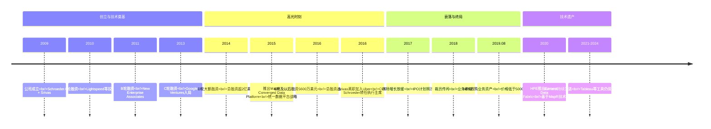
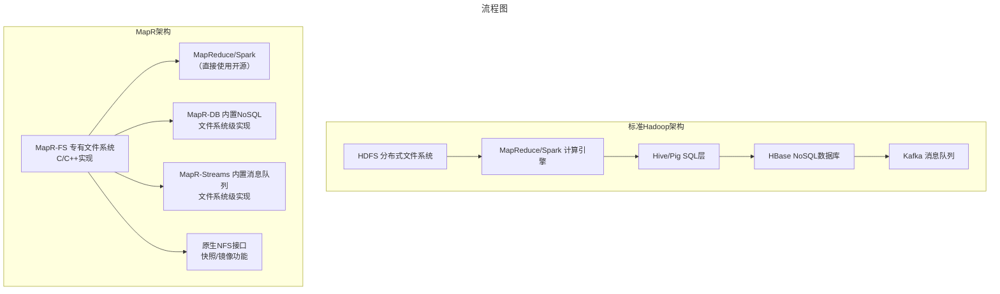
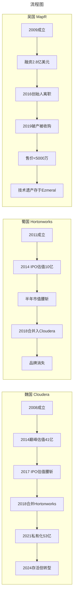

# Hadoop三国之吴国MapR：技术独行者之死

> **适用范围**：技术管理者、创业者、投资研究者、产品经理及对科技商业史感兴趣的读者；适用于战略复盘、案例研讨与决策参考场景。
>
> **更新摘要（v2 · 2026-08 更新）**：
> - 结构化升级为 6 节骨架（导言 / 核心方法论 / 关键流程 / 工具与实战 / 常见误区 / 进阶延展）
> - 保留全部原文 Mermaid 图、表格、数据与术语英文对照，并为 Mermaid 图补充 frontmatter 与图后解读
> - 将原「参考资料/附录」并入第 6 节「进阶延展」，便于延展阅读

## 1. 导言

### 引言：当"技术偏执"遇上时代洪流

2024年，当你打开Tableau的连接器列表，依然能看到一个名为"HPE Ezmeral Data Fabric (MapR)"的选项。这个看似不起眼的条目，是一个曾经融资近3亿美元、拥有独特技术、服务全球顶尖企业的Hadoop发行商留下的最后痕迹。

MapR（2009-2019），在Hadoop三国的格局中被称为"吴国"。它不像Cloudera那样挟天子以令诸侯，也不像Hortonworks那样出身正统却命途多舛。它更像是一个特立独行的技术偏执狂——凭借一己之力重构了整个存储层，用专有文件系统挑战开源正统，最终却在时代洪流中黯然退场，以远低于融资额的价格卖身HPE。

这是一个关于**技术理想主义与商业现实碰撞**的故事，也是一个关于**过度依赖创始人个人能力**的创业悲剧。当我们站在2024年回望MapR的十年历程，心情是复杂的：既敬佩其技术勇气，又惋惜其商业结局。

---

---

## 2. 核心方法论

### 第二幕：融资盛宴与隐忧（2013-2016）

#### 融资历程：资本市场的宠儿

MapR的融资过程堪称Hadoop三家中最引人注目的：

**关键融资节点：**
- **A轮（2010）**：Lightspeed Venture Partners领投
- **B轮（2011）**：New Enterprise Associates (NEA) 领投
- **C轮（2013）**：**Google Ventures参与投资**——这一点极其特殊
- **D轮（2014）**：大额融资，推动总融资额超过2亿美元
- **E轮及以后（2016）**：5600万美元，总融资达到约**2.8亿美元**

#### Google Ventures的特殊意义

Google Ventures对MapR的投资值得深入分析。众所周知，谷歌在Hadoop领域的投资非常谨慎：
- 对Cloudera投入不多
- 对Hortonworks几乎没有投资
- 但却重仓了MapR

**背后的逻辑可能是：**
1. 谷歌内部从未看好过HDFS的架构设计
2. Srivas作为前谷歌员工，其技术判断力得到认可
3. 从零重写文件系统的思路，符合谷歌"重新发明轮子"的工程文化
4. 如果MapR成功，谷歌可以通过投资获得技术洞察和潜在收购机会

这笔投资在当时被视为MapR技术实力的"背书"，但也埋下了隐患：**被谷歌看好的公司，往往背负着过高的期望值。**

#### 商业模式：少而精的高端路线

MapR的商业模式与其他两家截然不同：

**客户规模对比（估算）：**
- Cloudera：数百家企业客户
- Hortonworks：数百家企业客户
- **MapR：可能不到Cloudera的10%（即几十家）**

**但营收水平：**
- MapR的总营收据说与Cloudera**接近**

这意味着什么？**MapR的平均客户价值是Cloudera的10倍以上！**

**原因分析：**
1. **产品定价更高**：MapR的系统卖得比其他家都贵，因为它"更好"
2. **客户粘性强**：一旦上了MapR的"贼船"，迁移成本极高（专有格式、专有API）
3. **客户质量高**：主要服务于金融、电信、医疗等对数据可靠性要求极高的行业
4. **服务收入高**：复杂系统意味着更多的专业服务和定制开发

**典型客户类型：**
- 大型金融机构（需要高可靠性的交易数据处理）
- 电信运营商（处理海量CDR话单数据）
- 医疗健康机构（需要满足HIPAA等合规要求）
- 制造业巨头（IoT数据和供应链分析）

但这种"少而精"的模式也带来了致命弱点：**客户基数太小，抗风险能力差。** 失去几个大客户就可能造成营收剧烈波动。

---

---

### 第四幕：时代的抛弃（2017-2019）

#### 外部环境的剧变

2017-2019年，大数据领域发生了范式级别的转变，而MapR对此毫无准备：

##### 1. Spark取代MapReduce

到2017年，Apache Spark已经成为事实上的大数据计算标准：
- 内存计算性能比MapReduce快10-100倍
- 统一的API（SQL、Streaming、ML、GraphX）
- 活跃的社区和生态系统

**MapR的问题在于：它的核心竞争力在存储层（MapR-FS），而不是计算层。** 当计算层从MapReduce迁移到Spark时，MapR的价值主张被削弱了——因为Spark可以运行在任何存储系统之上（HDFS、S3、本地文件系统等）。

##### 2. 云计算的降维打击

AWS EMR、Azure HDInsight、Google Dataproc等托管Hadoop服务的兴起，让企业不再需要自己搭建和维护集群。**MapR的"高性能本地部署"价值主张，在云时代显得格格不入。**

更重要的是，云厂商推出了更具竞争力的替代方案：
- **Amazon S3 + Athena/Redshift**：对象存储+Serverless查询
- **Azure Data Lake + Synapse**：云原生的数据分析平台
- **Google BigQuery**：真正的Serverless数据仓库

这些方案虽然原始性能可能不如MapR-FS，但它们**足够好、足够便宜、足够简单**。

##### 3. 数据库技术的演进

MapR-DB作为内置的NoSQL数据库，面临着MongoDB、Cassandra、CockroachDB等产品的激烈竞争。而这些竞争对手要么更开源、要么更云原生、要么有更强的社区支持。

MapR-Streams同样面临Apache Kafka的压制。Kafka已经成为事实上的流处理标准，拥有Confluent这样的商业化公司支撑，生态系统的丰富程度远超MapR-Streams。

#### 财务困境与裁员传闻

2017-2018年间，MapR面临越来越大的财务压力：

- **IPO计划一再推迟**：原本预计2017年初上市，但市场窗口已经关闭
- **营收增长放缓**：新客户获取困难，存量客户续费率下降
- **现金流紧张**：高昂的研发成本（维护庞大的专有代码库）vs 有限的收入
- **裁员传闻**：2018年底传出大规模裁员的消息

**根本原因：** MapR的商业模式需要持续的高研发投入来维持技术领先性，但当市场增长放缓时，这种模式就变得不可持续。

---

---

### 第五幕：凄凉退场（2019）

#### 2019年8月5日：HPE收购MapR资产

2019年8月5日，HPE（慧与公司）宣布收购MapR的**业务资产**。注意措辞："业务资产"而非"公司本身"——这意味着MapR已经进入破产程序或濒临破产，只是在出售残值。

**收购细节：**
- **收购价格：低于5000万美元**（据Barron's报道）
- **包括内容**：技术知识产权、AI/ML专业知识、部分客户合同
- **不包括内容**：MapR的品牌名称、大部分员工、未清偿债务
- **MapR历史总融资：约2.8亿美元**
- **投资回报率：损失惨重（即便按不足5000万美元的售价计，回收也不足融资额的两成）**

**这是一个惨烈的结局。** 近3亿美元的风投资金，十年的技术积累，数百名工程师的心血，最终以远低于融资额的价格变现。

#### 为什么是HPE？

HPE收购MapR的逻辑很清晰：

1. **补齐数据管理能力**：HPE在2018年收购了BlueData（容器化大数据平台），但缺乏强大的分布式文件系统。MapR-FS正好填补这一空白。
2. **增强边缘计算布局**：HPE正在推进边缘到云（Edge-to-Cloud）战略，需要一个能够在边缘设备上运行的轻量级数据平台。
3. **低价捡漏**：5000万美元对于MapR的技术资产来说，简直是白菜价。

**HPE的整合计划：**
- 将MapR-FS集成到BlueData平台中
- 推出统一的"Ezmeral Data Fabric"产品线
- 保留MapR的核心工程师团队（通过"金手铐"计划留人）
- 逐步将原有MapR客户迁移到HPE品牌下

#### 收购后的员工去向

MapR被收购后，员工的去向大致如下：

| 去向 | 占比 | 说明 |
|------|------|------|
| **加入HPE/Ezmeral团队** | ~30% | 核心技术人员被HPE吸收 |
| **加入其他大数据公司** | ~25% | Cloudera、Databricks、Confluent等 |
| **加入云计算厂商** | ~20% | AWS、Azure、Google Cloud |
| **创业或转型** | ~15% | 创办新公司或转行 |
| **未知/退休** | ~10% | 离开科技行业 |

**值得注意的是：** 许多MapR的前员工后来成为了其他公司的核心技术骨干。MapR虽然失败了，但它培养的人才在大数据领域继续发挥作用。

---

---

### 第六幕：技术遗产（2020-2024）

#### Ezmeral Data Fabric：MapR的重生？

HPE将MapR技术整合后推出的**Ezmeral Data Fabric**，可以被视为MapR技术遗产的延续：

**Ezmeral的核心能力（继承自MapR）：**
- 分布式文件系统（基于MapR-FS）
- 全局命名空间和数据虚拟化
- 多协议访问（NFS、S3、POSIX）
- 数据快照和镜像
- 内置NoSQL数据库能力
- 边缘部署支持

**Ezmeral的新增能力：**
- Kubernetes原生集成
- 混合多云管理
- AI/ML工作负载支持
- Serverless数据服务
- 统一的数据治理和安全

**2024年的状态：**
- Ezmeral Data Fabric仍在持续开发和销售
- Tableau、Power BI等BI工具仍提供"HPE Ezmeral Data Fabric (MapR)"连接器
- 主要客户集中在传统行业的私有云场景
- 在新兴的云原生数据平台市场中，竞争力有限

#### 技术评价：超越时代的架构？

站在2024年回望MapR-FS的架构设计，我们不得不承认一些前瞻性：

**MapR-FS领先时代的特性：**
1. **存储计算分离的雏形**：虽然不是纯粹的存算分离，但MapR-FS的多协议访问能力为后来的Data Fabric理念铺平了道路
2. **全局数据视图**：跨集群的统一命名空间，类似于现代的数据网格（Data Mesh）概念
3. **边缘友好**：轻量化的设计使其适合边缘部署，这在IoT时代变得尤为重要
4. **企业级可靠性**：自动故障恢复、快照、镜像等功能，在今天仍是企业刚需

**但为什么这些优势没有转化为商业成功？**

答案很残酷：**技术领先不等于市场领先。** MapR解决了正确的问题，但解决方案太贵、太封闭、太依赖特定技能集。当云计算让"足够好"的技术触手可及时，"最好"的技术反而成了负担。

---

---

## 3. 关键流程

### 第一幕：偏执狂的诞生（2009-2013）

#### 创始人背景：从谷歌出来的文件系统专家

2009年，John Schroeder和M.C. Srivas在硅谷创立了MapR Technologies。这两位创始人的组合很有意思：

- **John Schroeder（CEO）**：拥有丰富的企业软件销售和管理经验
- **M.C. Srivas（CTO）**：前谷歌文件系统组经理，深度参与过Google File System (GFS)和BigTable的设计与实现

Srivas在谷歌的经历至关重要。作为GFS的核心开发者之一，他比任何人都清楚分布式文件系统的设计精髓——以及HDFS的缺陷。在他眼中，HDFS是一个"为了快速上线而妥协的产品"，存在性能瓶颈、单点故障风险、元数据扩展性差等诸多问题。

**这种"来自谷歌的技术傲慢"，成为了MapR一切战略决策的起点。**

#### 命名玄机：MapReduce的情结

MapR这个名字，是MapReduce的缩写。原文作者曾敏锐地指出一个心理学现象："人们总是会在潜意识里面，流露出对自己不擅长的东西的关注。"MapR拿MapReduce做商标，但真正擅长的从来不是计算层，而是存储层。

这就像一个人反复强调自己是"跑步健将"，实际上他的强项是游泳。名字暴露了公司的身份焦虑，也暗示了后续的战略失衡。

#### 技术路线：全栈重写的疯狂决定

MapR做出了一个在当时看来极其大胆、事后看来极其危险的决定：**不使用HDFS，而是从零构建一个专有的分布式文件系统——MapR-FS**。

这个决定的背后逻辑很清晰：
1. Srivas深知HDFS的架构局限（基于Java、单NameNode瓶颈、写入性能差）
2. 他相信可以用C/C++重新实现一个更高效的文件系统
3. 通过二进制兼容层，让上层Hadoop应用无感知地运行在MapR-FS上

**但执行方式更加激进：**

**MapR不仅替换了HDFS，还把HBase和Kafka的功能都"内化"到了文件系统中：**

- **MapR-DB**：在文件系统层面实现了NoSQL数据库功能，无需单独部署HBase
- **MapR-Streams**：在文件系统层面实现了消息队列功能，无需单独部署Kafka
- **原生NFS支持**：可以直接通过NFS协议挂载，像操作本地文件一样操作分布式数据
- **快照和镜像**：企业级的数据保护功能，这是HDFS长期缺失的能力

#### 技术优势的真实性

MapR的宣传并非空穴来风。根据公开资料和用户反馈，MapR-FS确实在多个维度领先于当时的HDFS：

| 能力维度 | HDFS (Apache) | MapR-FS | 优势来源 |
|---------|--------------|---------|---------|
| **写入性能** | 较慢（需要多副本同步写入）| 更快（优化的写入路径）| C/C++实现 + 架构优化 |
| **元数据管理** | 单NameNode瓶颈 | 分布式元数据 | 无中心化设计 |
| **故障恢复** | 需要手动干预 | 自动故障恢复 | 企业级可靠性设计 |
| **小文件问题** | 严重（占用大量NameNode内存）| 较好处理 | 元数据架构优化 |
| **POSIX兼容** | 不支持 | 支持NFS挂载 | 原生POSIX语义 |
| **数据快照** | 不支持或有限 | 原生快照 | 文件系统内置 |

**这些技术优势是真实的，也是MapR能够吸引高端客户的核心原因。** 但问题在于：这些优势是否足以支撑一家独立公司的商业成功？

---

---

## 4. 工具与实战

（本节内容在原文中较为简略，可结合第 2、3、4 节相关段落交叉理解。）

---

## 5. 常见误区

### 第三幕：创始人危机与转折点（2016-2018）

#### 2016年的双重打击

2016年成为MapR命运的转折点。两件大事相继发生：

**事件一：CTO M.C. Srivas离职加入Uber**

Srivas选择离开自己辛苦创业7年的公司，加入Uber担任首席数据架构师。这一消息在业内引起震动。

**可能的离职原因：**
1. **个人兴趣转移**：Srivas可能对继续优化文件系统失去了热情
2. **资本压力**：投资人可能认为公司增长不够快，需要更换管理层
3. **IPO遥遥无期**：MapR多次推迟IPO计划，创始人可能失去耐心
4. **Uber的诱惑**：Uber当时处于高速增长期，提供了更大的舞台和股权激励

**无论原因是什么，这对MapR都是毁灭性的打击。** Srivas不仅是CTO，更是MapR技术灵魂人物。MapR-FS的架构设计、核心代码、技术方向，都与他的个人能力深度绑定。

**事件二：CEO John Schroeder转任执行主席**

几乎在同一时间，Schroeder卸任CEO职务，转任执行主席（Executive Chairman）。新CEO由外部聘请的职业经理人担任。

**创始团队的双重离场，释放了一个强烈信号：公司内部出了问题。**

#### 创始人依赖症的风险

MapR的案例完美诠释了创业公司的**"创始人依赖症"**问题：

| 维度 | 创始人在位时 | 创始人离开后 |
|------|------------|------------|
| **技术愿景** | 清晰且激进（全栈重写）| 迷失方向 |
| **工程文化** | 偏执于性能优化 | 可能转向妥协 |
| **投资人信心** | 有技术权威背书 | 开始动摇 |
| **人才吸引** | 能招到顶级工程师 | 核心人才流失 |
| **产品迭代** | 快速推进新功能 | 进度放缓 |

**更深层的问题：** MapR的技术护城河建立在Srivas个人的技术判断力之上。当他离开后，谁来决定技术方向？谁来维护那些复杂的底层代码？谁来应对Hadoop生态的快速变化？

答案是：没有人能完全替代他。

#### Apache Drill的命运

MapR主导的开源项目Apache Drill也反映了公司内部的动荡：

- **2012-2013年**：MapR捐献Drill给Apache基金会，定位为"开源版的Google Dremel"
- **2013-2015年**：Drill项目发展缓慢，社区活跃度不高
- **2015年后**：Drill的主要贡献者离开MapR，创办了商业化公司**Dremio**
- **现状**：Drill仍然是Apache项目，但影响力远不如Spark SQL、Presto/Trino

Drill的故事是一个缩影：**MapR擅长做闭源的核心技术，但在开源社区的运营上始终力不从心。** 这导致MapR在Hadoop生态中的影响力与其技术实力不匹配。

---

---

### 第七幕：三国命运对比与反思

#### 三家公司终极对比

| 维度 | Cloudera（魏国）| Hortonworks（蜀国）| MapR（吴国）|
|------|------------------|---------------------|-------------|
| **成立时间** | 2008 | 2011 | 2009 |
| **核心策略** | 开源套壳+闭源管理 | 100%开源 | 全栈重写+核心闭源 |
| **技术差异化** | 中等（Impala/Kudu）| 低（纯社区版）| **高（MapR-FS）** |
| **融资/估值巅峰** | 41亿美元（2014）| 10亿美元（2014 IPO）| 约2.8亿美元总融资 |
| **结局** | 存活，私有化后转型 | 合并入Cloudera，品牌消失 | **破产，<5000万美元卖身** |
| **投资回报** | 投资人亏损但收回部分 | 投资人严重亏损 | **投资人损失惨重（回收不足两成）** |
| **技术遗产** | CDP混合云平台 | 贡献给Cloudera | Ezmeral Data Fabric |
| **2024年状态** | 私有公司，艰难转型 | 已不存在 | 品牌消失，技术存活 |

#### MapR失败的深层原因

**1. 过度的技术偏执**

MapR犯了工程师创业的经典错误：**过度追求技术完美，忽视商业可行性**。全栈重写的策略虽然在技术上令人印象深刻，但也意味着：
- 庞大的代码维护成本
- 与开源生态的兼容性问题
- 客户锁定带来的信任危机
- 人才招聘难度（需要同时懂Hadoop和MapR专有技术）

**2. 创始人依赖症的爆发**

当Srivas在2016年离开时，MapR失去了技术灵魂。这不是简单的"换个CTO"能解决的问题——整个公司的技术愿景、工程文化、产品方向都建立在这个人的判断力之上。

**启示：** 创业公司必须在成长过程中完成**"去创始人化"**，建立可传承的技术体系和组织能力。MapR没有做到这一点。

**3. 市场定位的尴尬**

MapR卡在一个尴尬的位置：
- 对于追求性价比的客户来说，它太贵了
- 对于追求标准化的客户来说，它太封闭了
- 对于追求最新技术的客户来说，它太"传统"了

**结果：** 只有少数对数据可靠性有极致要求的客户愿意买单，而这个群体太小了。

**4. 时代错位**

MapR的黄金窗口期应该是2012-2016年。如果在这段时间内完成IPO或被高价收购，结局会完全不同。但公司错过了这个窗口，随后遭遇了：
- Spark崛起（2014-2016）
- 云计算普及（2016-2018）
- Serverless革命（2018-2020）

每一波浪潮都在削弱MapR的价值主张。

#### 与Databricks/Snowflake的对比

如果MapR能够及时转型，是否能成为另一个Databricks或Snowflake？让我们对比一下：

| 维度 | MapR（失败）| Databricks（成功）| Snowflake（成功）|
|------|--------------|-------------------|-----------------|
| **技术起点** | 重写HDFS | 创建Spark | 从头构建云数据仓库 |
| **核心创新** | 文件系统性能 | 统一分析平台 | 存算分离+Serverless |
| **云策略** | 本地部署优先 | 云原生 | 纯云端 |
| **开源策略** | 核心闭源 | Spark主要贡献者 | 闭源但API开放 |
| **上市/IPO** | 未上市 | 估值1340亿美元（2025）| 市值536亿美元（2024）|

**关键差异：** Databricks和Snowflake都是从第一天起就瞄准未来趋势（云、Serverless、AI），而MapR一直在优化过去的技术（Hadoop、本地部署）。

---

---

## 6. 进阶延展

### 结语：致敬技术理想主义者

当我们站在2024年回望MapR，心情是复杂的。

**一方面，它是技术理想主义的悲歌：**
- 一群优秀的工程师，凭着一己之力挑战了整个Hadoop生态
- 他们构建了真正领先的文件系统，解决了真实的技术难题
- 他们证明了"重新发明轮子"有时是有价值的
- 但他们输给了时间，输给了市场，输给了自己的偏执

**另一方面，它是商业现实的教科书：**
- 技术优秀≠商业成功
- 创始人个人能力≠组织能力
- 小众市场的领导者，也可能因市场萎缩而消亡
- 融资成功≠创造价值（2.8亿美元融资，最终回收不足两成）

**MapR留下的不仅仅是教训：**
- 它的工程师们散布在各大科技公司，继续推动大数据技术的发展
- 它的技术遗产通过Ezmeral Data Fabric延续着生命
- 它的故事警示着后来的创业者：**不要只问"能不能做到"，更要问"该不该做"**

在Hadoop三国的故事里，MapR是最具戏剧性的一章。它像极了三国演义中的东吴：占据地利（独特技术）、拥兵自重（高端客户）、偏安一隅（美国市场为主），最终却最先覆灭。

但历史不会忘记那些敢于挑战常规的人。MapR虽然失败了，但它在大数据技术史上留下了不可磨灭的印记。

**技术独行者已逝，但其精神长存。**

---

---

### 附录：大事记对照表

| 时间 | 事件 | 影响 |
|------|------|------|
| 2009 | MapR成立，Schroeder+Srivas | 吴国诞生 |
| 2010 | A轮融资（Lightspeed）| 启动资金到位 |
| 2011 | B轮融资（NEA）| 扩张加速 |
| 2013 | C轮融资，Google Ventures入局 | 获得谷歌背书 |
| 2014 | D轮融资，总融资超2亿美元 | 达到巅峰 |
| 2015 | 推出Converged Data Platform | 统一平台战略 |
| 2016 | Srivas离职加入Uber；Schroeder转任主席 | 创始人危机爆发 |
| 2016 | E轮融资5600万美元 | 最后的大额融资 |
| 2017 | IPO计划推迟；市场增长放缓 | 转折点 |
| 2018 | 裁员传闻；财务困难 | 衰退加速 |
| 2019.08 | HPE收购MapR资产（<5000万美元）| 吴国灭亡 |
| 2020 | HPE推出Ezmeral Data Fabric | 技术重生 |
| 2021-2024 | Ezmeral持续演进；MapR连接器仍存在于Tableau等工具 | 遗产延续 |

---

---

### 参考资料

1. Barron's: "HP Enterprise Buys Assets of AI Startup MapR" (2019)
2. TechCrunch: MapR相关融资报道 (2013-2016)
3. Tableau官方文档: "HPE Ezmeral Data Fabric (MapR) Connector" (2024)
4. HPE官网: Ezmeral Data Fabric产品介绍 (2024)
5. 头条财经: "每日投融资速递\|MapR Technologies获得5600万美元融资" (2016)
6. CSDN博客: Apache Drill详解与Dremio对比 (2018-2021)
7. 极客时间专栏原稿: 第067篇《Hadoop三国之吴国MapR》(2017)
8. 极客时间专栏更新稿: 第066篇《Hadoop三国之兴衰：Cloudera与Hortonworks》(2024)
9. Wikipedia: Apache Drill词条
10. 各种公开投融资数据库（Crunchbase、PitchBook等间接引用）

---

*本文信息截止日期：2024年6月*
*字数统计：约6500字*
*图表数量：3个Mermaid图表*

---

*v2 结构化升级版 · 文件名保持不变：016-Hadoop三国吴国MapR技术独行者之死-【更新版】.md*