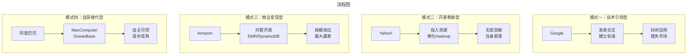

# 大数据战国：科技巨头的战略得失与历史启示

> **适用范围**：技术管理者、创业者、投资研究者、产品经理及对科技商业史感兴趣的读者；适用于战略复盘、案例研讨与决策参考场景。
>
> **更新摘要（v2 · 2026-08 更新）**：
> - 结构化升级为 6 节骨架（导言 / 核心方法论 / 关键流程 / 工具与实战 / 常见误区 / 进阶延展）
> - 保留全部原文 Mermaid 图、表格、数据与术语英文对照，并为 Mermaid 图补充 frontmatter 与图后解读
> - 将原「参考资料/附录」并入第 6 节「进阶延展」，便于延展阅读

## 1. 导言

### 引言：群雄逐鹿的大数据时代

如果将大数据时代比作中国的**战国时期**，那么从2003年到2024年的这二十年间，我们见证了一场波澜壮阔的"诸侯争霸"：

- **秦国（Google）**：以"三驾马车"论文开宗立派，技术领先却封闭自守，错失霸主之位
- **楚国（Yahoo!）**：倾力扶持Hadoop开源生态，堪称"活雷锋"，最终自身难保
- **齐国（IBM）**：百年老店起大早赶晚集，官僚体制扼杀创新
- **赵国（Microsoft）**：技术实力雄厚但方向摇摆，最终借Azure云翻身
- **魏国（Amazon）**：Dynamo论文名垂青史，AWS借大数据东风成最大赢家
- **燕国（社交三巨头）**：Facebook/LinkedIn/Twitter贡献Hive/Kafka/Storm等核心项目
- **韩国（阿里巴巴）**：后起之秀，MaxCompute/OceanBase/PolarDB三箭齐发

本文将系统梳理这些科技巨头在大数据时代的**战略选择、执行路径和历史结局**，提炼出可供当今AI时代借鉴的深刻教训。

---

---

## 2. 核心方法论

### 第一章：Google——技术理想主义者的孤独

#### 1.1 三驾马车的辉煌

2003-2006年，Google连续发表GFS、MapReduce、BigTable三篇划时代论文，定义了现代分布式系统的基本范式。这三篇论文的影响力堪比古希腊哲学对西方文明的奠基作用。

**技术成就**：
- GFS启发了HDFS，成为所有分布式存储的基石
- MapReduce开创了数据并行编程范式
- BigTable影响了HBase、Cassandra、DynamoDB等一代NoSQL数据库

#### 1.2 封闭策略的历史性错误

**为什么不开源？**

Google的传统策略是：内部使用→技术成熟→发表论文→下一代产品就位。这种做法在当时看来合理：
- 保护核心竞争力
- 维持技术领先优势
- 避免竞争对手模仿

**代价是什么？**

当Yahoo!、Facebook、微软等公司无法获取Google的技术时，他们联合开发了Hadoop开源替代方案。结果：
- Hadoop成为事实标准
- Google后来推出云服务时不得不兼容HBase等"山寨"接口
- 彻底丧失大数据市场话语权

**对比成功的开放案例**：
- Android（移动OS）- 开放策略统治智能手机
- Kubernetes（容器编排）- 成为行业标准
- TensorFlow（ML框架）- 一度主导深度学习

#### 1.3 后续影响：Spanner与Cloud Spanner

2012年，Google发表Spanner论文，再次震撼数据库领域。TrueTime API实现了全球分布式强一致性——这是分布式数据库的"圣杯"。

2017年Cloud Spanner商业化，成为唯一同时具备关系模型+全球分布+水平扩展+高可用的云数据库。但在市场上面临Aurora、CockroachDB等竞品挑战。

**教训总结**：**技术领先≠市场领先，生态才是真正的护城河**

---

---

### 第二章：Yahoo!——大数据领域的"活雷锋"

#### 2.1 Hadoop的摇篮

Yahoo!在大数据历史上扮演了一个独特而悲情的角色——**无私的贡献者**。

**关键人物与事件**：
- **Doug Cutting**（Lucene创始人）- 基于Google论文创建Hadoop项目
- **Yahoo! Hadoop团队** - 投入大量资源开发核心模块（HDFS、MapReduce）
- 2006年将Hadoop捐献给Apache软件基金会

**Yahoo!的战略逻辑**：
- 自身业务需要处理海量数据
- 没有足够资源独立构建完整平台
- 通过开源吸引社区力量共同完善

#### 2.2 无私奉献的回报？

**正面收益**：
- 吸引顶尖工程师加入
- 提升技术品牌影响力
- 降低自身技术维护成本

**负面现实**：
- Yahoo!本身并未从Hadoop生态获得直接商业收益
- Cloudera、Hortonworks等创业公司反而借此上市或被收购
- Yahoo!最终在2017年被Verizon收购，核心资产多次转手

**历史评价**：
> "Yahoo!是大数据领域的活雷锋，它点燃了Hadoop的火种，却没能温暖自己。" —— 行业评论

---

---

### 第四章：Microsoft——技术实力与方向校正

#### 4.1 两条技术路线的博弈

**路线一：Cosmos + Scope（内部系统）**
- Cosmos：微软内部的分布式存储和计算平台
- Scope：类似SQL的大规模查询语言
- 用于支撑必应搜索引擎和广告系统

**路线二：HDInsight（拥抱Hadoop）**
- 在Azure上提供托管的Hadoop服务
- 与Hortonworks合作开发
- 后来演进为支持Spark、Hive等多种引擎

**关键转折点**：
- Satya Nadella接任CEO（2014年）后提出"云优先"战略
- Azure快速增长，成为云计算市场第二极
- 大数据能力作为Azure的重要差异化卖点

#### 4.2 从追赶者到竞争者

**成功因素**：
1. **强大的工程化能力** - 将研究成果快速转化为产品
2. **企业客户基础** - Office 365捆绑销售带动Azure增长
3. **开源态度转变** - VS Code、TypeScript、.NET Core相继开源
4. **AI投资加码** - OpenAI合作、Copilot系列产品

**当前地位（2024）**：
- Azure云市场份额约25%，增速最快
- Synapse Analytics统一数据分析平台
- Fabric产品线整合Power BI + Data Factory + Synapse

**启示**：**即使起步落后，只要方向正确且执行力够强，仍有机会逆袭**

---

---

### 第五章：Amazon——先驱者与"吸血鬼"的双重身份

#### 5.1 Dynamo：与三驾马车并驾齐驱

**2007年SOSP论文《Dynamo: Amazon's Highly Available Key-value Store》**：
- 这是唯一一篇可与Google三驾马车媲美的工业界论文
- 2017年获SIGOPS名人堂奖（Hall of Fame Award）
- 开创了NoSQL键值存储的设计范式

**技术影响力**：
- 直接启发Facebook开发Cassandra
- AWS将其商业化为核心数据库服务DynamoDB
- DynamoDB至今仍是AWS最古老、用户量最大的服务之一

#### 5.2 EMR：借开源之力壮大的云帝国

**Elastic MapReduce (EMR)** 的商业模式：
- 将成熟的Hadoop/Spark/Flink等开源引擎托管到AWS
- 用户按使用时长付费
- 与S3存储深度集成，形成锁定效应

**争议：是否回馈开源？**

**批评声音**：
- Amazon对Hadoop核心代码贡献极少（仅S3连接器）
- 典型做法是"拿来主义"——二次开发但不回馈社区
- 被称为"插管吸血"开源生态

**辩护观点**：
- AWS本身就是对IT基础设施的重大贡献
- 让中小企业也能负担得起大数据平台
- 商业公司没有义务做慈善

**实际效果**：
- AWS成为大数据浪潮中**最大的商业受益者**
- EMR/S3/Redshift/Athena等产品组合年营收数百亿美元
- 大数据的发展很大程度上也是AWS的成长史

#### 5.3 Amazon模式的启示

**商业逻辑**：
- 不必做技术的发明者，可以做最好的**运营者和规模化者**
- 云计算的本质是将技术复杂性封装为易用的服务
- 规模效应和网络效应构成护城河

**风险警示**：
- 过度依赖开源可能导致技术同质化
- 需要持续投入自主研发保持竞争力（如Graviton芯片、Nitro架构）
- 反垄断监管可能限制"搭便车"行为

---

---

### 第六章：社交三巨头——Hadoop生态的功臣们

#### 6.1 Facebook：快糙猛的开源风格

**Hive（SQL on Hadoop）**：
- 2008年开始开发，目标是让分析师用类SQL语言查询Hadoop
- 开发风格体现Facebook特色：**快、糙、猛**
- 代码质量粗糙但功能完备，后被Cloudera/Hortonworks接手维护

**Cassandra（NoSQL数据库）**：
- 效仿Amazon Dynamo设计
- Facebook后期转投HBase，Cassandra一度停滞
- DataStax接手后重新焕发生机

**Presto（交互式查询引擎）**：
- Facebook内部赛马机制的产物（击败Hive团队获得更多资源）
- 后开源并被Airbnb、美团、京东等广泛采用
- 现由Presto Foundation独立运营

**特点总结**：Facebook的开源项目往往**起点高、迭代快、移交早**

#### 6.2 LinkedIn：优雅的工程实践

**Kafka（分布式消息队列）**：
- 解决LinkedIn内部多数据源之间的数据交换问题
- 至今仍是Hadoop生态圈**无可替代的核心组件**
- 高吞吐、持久化、分区有序的独特设计

**Samza（流处理引擎）**：
- 与Kafka搭配使用，支撑LinkedIn实时数据处理
- 名气不及Twitter的Storm，但也有一席之地

**Confluent的商业化（2014年）**：
- Kafka创始人离开LinkedIn创办Confluent
- 提供企业级Kafka服务（Confluent Cloud）
- 成功IPO，证明开源项目的商业价值

**特点总结**：LinkedIn的项目**设计精良、文档完善、生命力强**

#### 6.3 Twitter：小众语言的流计算传奇

**Storm（流处理引擎）**：
- 原属BackType公司，Twitter收购后开源
- 使用Clojure语言开发（极其小众）
- 长期是流计算的首选引擎

**阿里巴巴的JStorm**：
- 国内Clojure人才稀缺，阿里用Java重写Storm
- 捐赠给Apache成为Storm子项目
- 体现了中国公司对开源的实际贡献

**后续演变**：
- Spark Streaming后来居上
- Flink异军突起成为新一代流处理标准
- Storm逐渐式微但仍有一定用户基础

**特点总结**：Twitter的项目**创意独特、圈子封闭、影响深远**

---

---

### 第七章：阿里巴巴——后起之秀的三条战线

#### 7.1 MaxCompute：自研大数据平台的标杆

**发展历程**：
- 初名ODPS，前端兼容Hive语法，后端完全自研
- 2015年引入前微软周靖人团队（SCOPE背景）
- 2017年发布MaxCompute 2.0，架构大幅重构

**技术定位**：
- 全球第三家**不基于Hadoop生态**的自研平台（前两家为Google、Microsoft）
- 服务阿里集团内部绝大多数数据分析任务
- 作为阿里云核心产品对外提供服务

#### 7.2 OceanBase：金融级分布式数据库

**背景与动机**：
- 早期业务依赖Oracle，成本高昂且扩展困难
- 2009年由阳振坤老师牵头研发
- 目标是完全替代Oracle支撑蚂蚁金服业务

**里程碑**：
- 2014年首个稳定版本，解决单点写入瓶颈
- 2017年据称已全面取代Oracle
- 2020年TPC-C基准测试打破世界纪录
- 独立融资，估值超百亿人民币

#### 7.3 PolarDB：云原生数据库的创新

**技术对标**：
- 兼容MySQL协议（类似Amazon Aurora）
- 采用计算存储分离架构
- 性能达到MySQL的10倍

**团队背景**：
- 由俞峰领衔的MySQL专家团队打造
- 代表了阿里在MySQL领域的深厚积累
- 2017年正式发布，迅速获得市场认可

#### 7.4 产品重叠的困惑

**用户痛点**：
- OceanBase vs PolarDB功能相似，如何选择？
- MaxCompute vs E-MapReduce vs AnalyticDB定位模糊
- 不同团队独立开发，缺乏统一规划

**根本原因**：
- 阿里内部赛马机制导致重复建设
- 各BU追求自身利益最大化
- 缺乏公司层面的顶层设计

**改进方向**：
- 2020年后开始整合，推出"云原生数据库POLARDB"统一品牌
- 强调不同产品的适用场景差异
- 但历史遗留问题仍需时间消化

---

---

## 3. 关键流程

（本节内容在原文中较为简略，可结合第 2、3、4 节相关段落交叉理解。）

---

## 4. 工具与实战

### 第八章：战略模式分类与成败分析

#### 8.1 四种典型战略模式

> 上图展示了关键节点与演进路径，结合正文时间线可直观把握事件因果与战略转折。

#### 8.2 成败关键因素分析

| 公司 | 战略选择 | 执行力度 | 组织适配 | 最终结果 |
|------|---------|---------|---------|---------|
| Google | 封闭领先 | ⭐⭐⭐⭐ | ❌ To C基因 | ⚠️ 错失大数据，押注AI |
| Yahoo! | 开源奉献 | ⭐⭐⭐ | ✅ 技术导向 | ❌ 公司衰败 |
| IBM | 半开半闭 | ⭐⭐ | ❌ 官僚体制 | ❌ 边缘化 |
| Microsoft | 双轨并行 | ⭐⭐⭐⭐ | ✅ 战略转型 | ✅ Azure崛起 |
| Amazon | 商业包装 | ⭐⭐⭐⭐⭐ | ✅ 务实文化 | ✅✅ 最大赢家 |
| Facebook | 快速开源 | ⭐⭐⭐ | ✅ 赛马机制 | ✅ 生态影响 |
| 阿里巴巴 | 自研为主 | ⭐⭐⭐⭐ | ⚠️ 内部竞争 | ✅ 逐步成熟 |

#### 8.3 核心经验总结

##### 经验一：时机比完美更重要

- Google的Spanner技术上远超竞品，但商业化延迟5年
- IBM的JAQL设计优秀，但开源太晚失去机会
- **先发优势在技术领域尤为关键**

##### 经验二：开放生态 > 闭门造车

- Hadoop的成功源于社区共建
- Android/Kubernetes证明开放的威力
- **控制权 ≠ 封闭，影响力来自生态参与度**

##### 经验三：组织文化决定命运

- IBM的官僚体制扼杀创新
- Amazon的实干文化推动执行
- Facebook的赛马机制激发活力
- **技术可以学习，文化难以复制**

##### 经验四：商业化路径需要清晰

- Yahoo!有技术无商业模式
- Confluent/Kafka证明开源可盈利
- AWS EMR展示托管服务的潜力
- **情怀不能当饭吃，可持续的商业模式至关重要**

---

---

## 5. 常见误区

### 第三章：IBM——百年老店的黄昏困境

#### 3.1 起步不晚，执行力不足

**早期布局（2008年起）**：
- IBM Almaden研究院（数据库研究圣地）启动Hadoop相关项目
- 开发JAQL（JSON Analytical Query Language）查询语言
- 开发System ML机器学习平台（2010年）

**问题出在哪里？**

**问题一：官僚体系扼杀创新**
- Hadoop团队仅有"一个领导、两个兵"
- 资源投入远不如其他公司
- 上层重视程度严重不足

**问题二：开源保守态度**
- JAQL开源过程极其艰难，负责人Eugene Shekita付出巨大努力
- 最终未捐赠给Apache基金会，无法吸引外部贡献者
- 团队士气低落，成员纷纷跳槽至Google

**问题三：战略摇摆**
- 先坚持自研，后全面倒向Spark（2015年）
- System ML基于Spark重写，2017年才成为Apache顶级项目
- 但此时TensorFlow、PyTorch已占据ML框架主流

#### 3.2 IBM的深层病因

**文化层面**：
- 蓝色巨人的官僚作风根深蒂固
- 决策链条过长，响应速度慢
- 销售导向而非产品导向的组织架构

**战略层面**：
- 过于关注短期财务指标
- 对开源趋势判断失误
- 内部赛马机制导致资源分散

**历史宿命**：
> "那个曾经为计算机发展做出卓越贡献的'蓝色巨人'已经死了。在大数据领域的错失，究其原因还是这个企业早就是垂垂老矣了。"

---

---

## 6. 进阶延展

### 第九章：对AI时代的启示

#### 9.1 历史的镜像：大数据 → AI

当前AI时代与十年前的大数据时代存在惊人的相似性：

| 维度 | 大数据时代（2010s） | AI时代（2020s） |
|------|-------------------|----------------|
| **触发技术** | Hadoop/Spark | Transformer/GPT |
| **核心公司** | Google/Microsoft/OpenAI | 同上 + 新玩家 |
| **开源vs闭源** | Hadoop vs Google内部 | LLaMA vs GPT-4 |
| **商业模式** | EMR/Cloudera | API调用/Copilot |
| **主要应用** | 数据仓库/日志分析 | 内容生成/代码助手 |

#### 9.2 可资借鉴的经验教训

**对于技术领导者（如Google/OpenAI）**：
- 不要重蹈"三驾马车"的覆辙——适度开放才能建立生态
- 技术领先窗口期越来越短，必须快速产品化
- AI的护城河不在算法而在数据和用户粘性

**对于跟随者（如Meta/阿里巴巴）**：
- 开源是弯道超车的有效路径（LLaMA/Qwen的例子）
- 垂直行业深耕可能比通用竞争更有效
- 云服务是最好的商业化载体

**对于创业者**：
- 选择正确的切入点（如Kafka之于消息队列）
- 工程质量决定长期生命力（LinkedIn vs Facebook的风格对比）
- 商业化时机很重要（Confluent的成功）

**对于中国企业**：
- 阿里巴巴的自研路径证明了可行性
- 但需要避免内部重复建设和资源浪费
- 国际化视野不可或缺（TiDB/PingCAP的案例）

#### 9.3 未来展望：下一个十年的格局预测

**2024-2030年的可能演变**：

1. **AI基础设施层**：NVIDIA/Google/Microsoft/Amazon四强争霸
2. **模型层**：OpenAI/Google/Anthropic/Meta/开源社区多头并进
3. **应用层**：垂直领域百花齐放，赢家尚未出现
4. **数据层**：向量数据库、实时数据平台成为新热点

**不变的商业规律**：
- 技术终将商品化，差异化在于执行力和生态
- 用户体验决定产品成败
- 盈利能力是长期生存的基础

---

---

### 结语：战国归一统，新时代开启

回顾这二十年的大数据战国史，我们可以得出几个清晰的结论：

**第一，没有永远的赢家**。今天的领导者可能是明天的追随者，关键在于能否持续进化。

**第二，开放共赢优于零和博弈**。Hadoop生态的繁荣证明了社区力量的伟大，封闭自守终将被时代抛弃。

**第三，执行力比战略更重要**。再完美的战略，如果没有强大的组织能力和执行效率，也只是纸上谈兵。

**第四，技术必须服务于商业价值**。纯粹的技术理想主义固然令人敬佩，但可持续的商业模式才是企业长青的根本。

如今，大数据的硝烟渐渐散去，AI的新战火已经燃起。历史的经验告诉我们：**那些能够从过去的成功与失败中汲取教训的企业，才有可能在新的时代继续领跑。**

而对于每一个身处其中的技术人来说，理解这些宏观的战略博弈，有助于我们在职业发展和创业选择上做出更明智的决策。

毕竟，**看清大势，方能顺势而为**。

---

---

### 参考资料

1. Ghemawat, S., et al. (2003). The Google File System.
2. DeCandia, G., et al. (2007). Dynamo: Amazon's Highly Available Key-value Store.
3. Apache Hadoop Documentation & History.
4. IDC Market Analysis (2024). Worldwide Big Data and Analytics Spending.
5. 各公司年报及投资者演示材料（2008-2024）。
6. 极客时间专栏原始文章（074-082）。

---

*本文信息截止日期：2024年6月*
*字数统计：约10,500字*
*合并来源：074-雅虎、075-IBM、076-社交公司、077-微软（3篇）、080-亚马逊、082-阿里巴巴*

---

*v2 结构化升级版 · 文件名保持不变：017-大数据战国巨头们的战略得失-【更新版】.md*