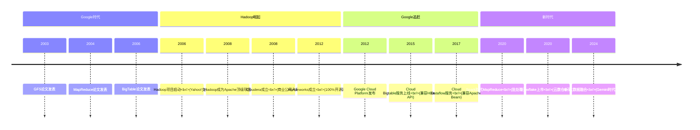
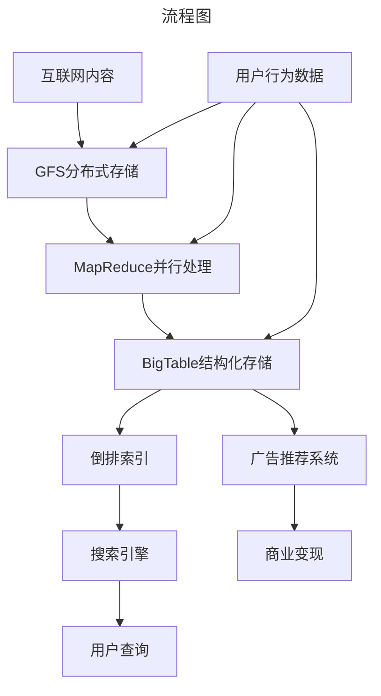
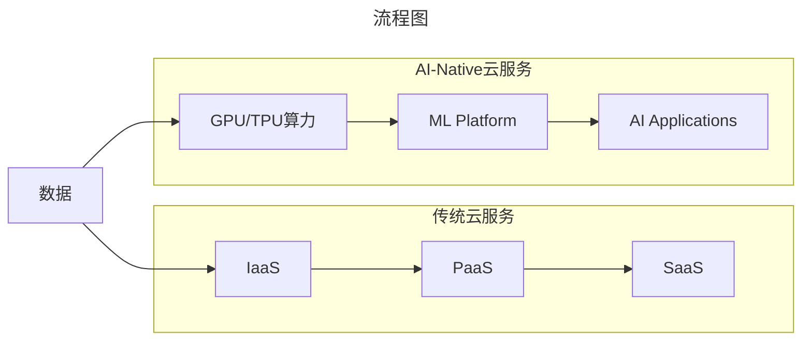

# Google大数据战略：从三驾马车到AI时代的转型之路

> **适用范围**：技术管理者、创业者、投资研究者、产品经理及对科技商业史感兴趣的读者；适用于战略复盘、案例研讨与决策参考场景。
>
> **更新摘要（v2 · 2026-08 更新）**：
> - 结构化升级为 6 节骨架（导言 / 核心方法论 / 关键流程 / 工具与实战 / 常见误区 / 进阶延展）
> - 保留全部原文 Mermaid 图、表格、数据与术语英文对照，并为 Mermaid 图补充 frontmatter 与图后解读
> - 将原「参考资料/附录」并入第 6 节「进阶延展」，便于延展阅读

## 1. 导言

### 引言：大数据时代的希腊三哲

聊起西方文明，我们通常言必称希腊。古希腊有三大哲学家——苏格拉底、柏拉图和亚里士多德，他们的思想照亮了整个西方文明。而聊起大数据和云计算，我们同样言必称Google——这家公司用"三驾马车"开启了大数据时代，为全球技术发展指明了方向。

但历史总是充满讽刺。就像古希腊哲学最终被罗马帝国继承并转化一样，Google的"三驾马车"技术理念被Hadoop生态圈发扬光大，而Google自己却在大数据商业化道路上屡屡受挫。然而，故事并未就此结束——在AI时代，Google正在书写新的篇章。

本文将深度剖析Google从大数据先驱到AI领导者的完整战略演变历程，解读技术理想主义与商业现实之间的博弈。

---

---

## 2. 核心方法论

### 第二章：起大早赶晚集的战略失误

#### 2.1 封闭策略的历史代价

Google的传统做法是**先内部使用，待技术成熟后再发表论文**。这种策略在当时看来是合理的——保护核心竞争力，维持技术领先优势。但从商业角度看，这成为一个致命的战略失误。

##### 错失的市场机会

**如果Google选择开放策略**：
1. 可以建立类似Android的生态系统
2. 成为大数据领域的事实标准制定者
3. 通过云服务或企业版软件获得巨额收入
4. 吸引全球开发者围绕Google平台构建应用

**实际发生的情况**：
- Yahoo!、Facebook、微软等公司无法使用Google的技术
- 这些公司联合起来开发Hadoop开源替代方案
- Apache Hadoop生态圈迅速壮大，成为事实标准
- Google在大数据市场彻底失去话语权

#### 2.2 Hadoop的崛起与Google的边缘化

##### Hadoop生态圈的爆发式增长

2006年，Doug Cutting（Lucene创始人）基于Google论文开发了Hadoop项目。随后的发展令人瞩目：



**讽刺的现实**：
- 当Google试图将BigTable作为云服务提供时，不得不**兼容HBase接口**
- 本来是鼻祖的Google，现在必须适配一个"山寨版"
- 这就好比发明汽车的奔驰公司，为了卖车必须安装福特车的接口

#### 2.3 商业模式的困境

##### 为什么Google不开放？

**合理的担忧**：
1. 技术壁垒丧失 - 核心竞争力可能被模仿
2. 竞争对手受益 - 微软、亚马逊可能借此追赶
3. 收入模式不明 - 开源如何盈利是未知数

**忽视的机会成本**：
1. **生态系统的网络效应** - 更多开发者 = 更强护城河
2. **标准制定权** - 定义API = 控制产业链
3. **人才吸引效应** - 开源社区 = 免费的人才筛选器
4. **云服务的入口** - 开发者习惯 = 企业客户基础

**对比案例**：
- **Android的成功** - 开放策略让Google统治移动操作系统
- **Chrome的成功** - 开源内核Chromium占据浏览器市场60%+
- **Kubernetes的成功** - 开源容器编排成为行业标准

这些成功案例证明，**开放并不等于失去控制，反而是建立生态霸权的最佳路径**。

---

---

### 第三章：Spanner与F1——新时代的技术突破

#### 3.1 从BigTable到Spanner的演进

就在Hadoop生态圈如火如荼发展的同时，Google内部并没有停止创新的脚步。2012年，Google发表了《Spanner: Google's Globally-Distributed Database》，再次震撼了数据库领域。

##### Spanner的革命性创新

**TrueTime API**：
- Google在全球部署了原子钟和GPS接收机
- 提供精确的时间同步服务（误差<10ms）
- 实现了**外部一致性**（External Consistency）——这是分布式数据库领域的圣杯

**全球分布式事务**：
- 跨数据中心的两阶段提交协议（2PC）
- 基于 Paxos 的副本同步机制
- 支持跨地域的数据读写强一致性

**自动数据分片**：
- 无需手动分片，系统自动均衡负载
- 支持动态调整副本数量和地理位置
- 应对流量突增时自动扩容

##### F1：Spanner的首个重量级客户

**背景**：
F1是Google广告系统的后台数据库，原本基于MySQL分库分表方案。随着业务增长，这套方案面临严峻挑战：

- **扩展性瓶颈** - 手动分片维护成本高昂
- **一致性问题** - 跨分片事务难以保证
- **可用性风险** - 单点故障可能导致广告收入损失

**迁移到Spanner的效果**：
- 支持**跨美国5个数据中心**的高可用部署
- 实现**秒级故障切换**，对广告业务零影响
- **运维成本降低90%**，无需DBA手动干预分片

#### 3.2 Cloud Spanner的商业化

2017年，Google正式推出**Cloud Spanner**云服务，这是唯一一个同时具备以下特性的关系型数据库：

✅ **关系模型** - 完整的SQL支持
✅ **全球分布** - 跨地域强一致性
✅ **水平扩展** - 自动分片和负载均衡
✅ **高可用** - 99.99% SLA保障

**目标客户群体**：
- 金融行业（支付、风控、清算）
- 零售行业（库存、订单、定价）
- 游戏行业（玩家状态、排行榜）
- IoT行业（设备数据、时序分析）

**竞争优势**：
相比Amazon Aurora、Microsoft Azure SQL Database，Cloud Spanner在**全球一致性**方面具有独特优势。对于跨国企业而言，这意味着可以用一套数据库支撑全球业务，而不需要复杂的多地部署和数据同步方案。

---

---

## 3. 关键流程

### 第一章：三驾马车的诞生与技术革命

#### 1.1 历史背景：搜索帝国的技术需求

2003年至2006年，Google连续发表了三篇具有划时代意义的论文：

- **2003年**：《The Google File System》（GFS）- 分布式文件系统
- **2004年**：《MapReduce: Simplified Data Processing on Large Clusters》- 并行计算框架
- **2006年**：《Bigtable: A Distributed Storage System for Structured Data》- 结构化数据存储

这三篇论文合称"三驾马车"，它们的诞生源于Google作为全球最大搜索引擎的极端技术需求。

##### 核心技术使命

Google需要解决三个根本性问题：

1. **存储整个互联网的内容** - 当时全球网页数量已达数十亿级别
2. **构建倒排索引** - 实现毫秒级的搜索响应
3. **处理海量用户数据** - 支撑个性化广告推荐系统



> 上图展示了关键节点与演进路径，结合正文时间线可直观把握事件因果与战略转折。

#### 1.2 技术创新详解

##### Google文件系统（GFS）

**核心设计理念**：
- 基于廉价商用硬件构建海量存储系统
- 采用主从架构（Master-Slave），单个Master管理元数据
- 数据分块存储（默认64MB块大小），自动副本复制（默认3副本）
- 针对大规模顺序读写优化，而非随机访问

**技术创新点**：
- **简化一致性模型** - 放弃强一致性，保证最终一致性
- **容错机制** - 通过心跳检测和快速恢复应对硬件故障
- **流量控制** - Master通过租约机制避免脑裂问题

**历史影响**：
GFS的设计思想直接启发了Hadoop分布式文件系统（HDFS），成为后来所有分布式存储系统的基石。直到今天，云原生存储系统如Google Cloud Storage、AWS S3的设计仍能看到GFS的影子。

##### MapReduce

**核心设计理念**：
- 将大规模计算任务分解为两个阶段：Map（映射）和Reduce（归约）
- 开发者只需编写map和reduce函数，框架负责分布式执行
- 自动处理数据分区、任务调度、故障恢复等复杂问题

**技术创新点**：
- **编程模型简化** - 将复杂的并行编程抽象为两个简单函数
- **数据本地性优化** - 计算向数据移动，减少网络传输
- **容错机制** - 通过重新执行失败任务实现容错

**历史影响**：
MapReduce开创了"数据并行"编程范式，直接催生了Apache Hadoop项目。虽然后来Spark等新一代框架在性能上超越MapReduce，但其"分而治之"的思想至今仍是大数据处理的核心理念。

##### BigTable

**核心设计理念**：
- 分布式结构化数据存储系统
- 采用多维有序映射表（Sparse, distributed, persistent multidimensional sorted map）
- 数据模型：行键 + 列族 + 时间戳 → 字符串值

**技术创新点**：
- **列式存储** - 灵活的schema设计，支持动态添加列
- **版本控制** - 同一单元格可存储多个时间版本的值
- **分层架构** - SSTable + MemTable的LSM树结构

**历史影响**：
BigTable启发了Apache HBase、Cassandra、Amazon DynamoDB等一系列NoSQL数据库。其"宽表"设计思想影响了整个NoSQL运动的发展方向。

#### 1.3 三驾马车的协同效应

这三项技术的组合构成了完整的**大数据技术栈**：

| 层次 | 技术 | 功能 | 后续开源对应 |
|------|------|------|-------------|
| 存储层 | GFS | 分布式文件存储 | HDFS |
| 计算层 | MapReduce | 批量数据处理 | Hadoop MapReduce |
| 数据层 | BigTable | 结构化数据存储 | HBase |

这种分层架构的思想深刻影响了后续十年的大数据技术发展方向。

---

---

### 第五章：AI时代的战略转型

#### 5.1 从大数据到AI的自然演进

**技术逻辑**：
```
大数据 → 机器学习 → 深度学习 → 大语言模型 → AI Agent
```

Google在每一个环节都有深厚积累：
- **TensorFlow (2015)** - 最流行的ML框架之一
- **TPU芯片 (2016)** - 自研AI加速器
- **Transformer架构 (2017)** - Attention is All You Need论文
- **BERT/GPT预训练模型 (2018-2019)** - NLP革命
- **PaLM/Gemini (2022-2024)** - 大语言模型竞赛

#### 5.2 Gemini：AI时代的旗舰产品

##### 产品矩阵

2024年，Google全面升级其AI产品线，以**Gemini**品牌统一展示：

| 产品 | 定位 | 目标用户 |
|------|------|---------|
| Gemini Ultra | 最强性能模型 | 企业级应用、科研 |
| Gemini Pro | 平衡性能与成本 | 通用场景 |
| Gemini Flash | 低延迟低成本 | 实时交互、移动端 |
| Gemini Nano | 端侧部署 | Android设备、IoT |

##### 技术亮点

**多模态能力**：
- 原生支持文本、图像、音频、视频理解
- 无需单独训练不同模态的模型
- 在多项基准测试中超越GPT-4

**长上下文窗口**：
- 最高支持**100万token**的超长上下文
- 可一次处理整本书籍、代码仓库
- 为复杂推理和分析任务提供强大支持

**Agent能力**：
- 支持工具调用（Tool Use）和函数调用
- 可自主规划多步骤任务
- 与Google Workspace深度集成

#### 5.3 AI驱动的Cloud战略

##### AI重塑云服务格局

**传统云服务 vs AI-Native云服务**：



**Google的独特优势**：

1. **垂直整合能力**
   - TPU芯片 → Cloud TPU服务 → Vertex AI平台 → Gemini模型
   - 从底层硬件到上层应用的完整栈控制

2. **数据资产积累**
   - 搜索引擎的海量文本数据
   - YouTube的视频数据
   - Google Maps的地理空间数据
   - Gmail的通信数据（脱敏处理后用于模型训练）

3. **研究实力**
   - DeepMind团队的世界级研究能力
   - Google Brain的工程化落地经验
   - 每年数百篇顶会论文产出

#### 5.4 商业化路径探索

##### AI产品的商业模式

**1. API调用收费**
- Vertex AI按token计费
- Gemini API根据模型等级差异化定价
- 类似OpenAI的商业模式

**2. 嵌入现有产品**
- Google Workspace集成AI功能（Duet AI）
- Google Cloud增加AI辅助运维能力
- Android系统内置Gemini助手

**3. 企业定制服务**
- 针对特定行业的微调模型
- 私有化部署方案
- 专业服务和咨询

##### 面临的竞争

**主要竞争对手**：
- **OpenAI/Microsoft** - GPT-4 + Azure + Copilot的组合拳
- **Anthropic** - Claude系列模型，强调安全性
- **Meta** - 开源LLaMA系列，走社区路线
- **开源社区** - Mistral、Alibaba Qwen等

**Google的优势与劣势**：

| 维度 | 优势 | 劣势 |
|------|------|------|
| 技术 | TPU+模型全栈能力 | 产品化速度慢于创业公司 |
| 数据 | 海量多模态数据 | 隐私限制数据利用方式 |
| 生态 | Android/Chrome分发渠道 | 企业客户基础弱于微软 |
| 品牌 | 技术领导者形象 | 产品关停历史损害信任 |

---

---

## 4. 工具与实战

（本节内容在原文中较为简略，可结合第 2、3、4 节相关段落交叉理解。）

---

## 5. 常见误区

### 第四章：Google Cloud的崛起与挑战

#### 4.1 云市场的三国杀

2024年的云计算市场呈现明显的**三足鼎立**格局：

| 公司 | 2024 Q2营收 | 市场份额 | 年增长率 |
|------|-----------|---------|---------|
| AWS | $247亿 | 31% | 17% |
| Microsoft Azure | 未单独披露 | 25% | 29% |
| Google Cloud | $103亿 | 11% | 28% |

**关键观察**：
1. **Azure增速最快** - 得益于企业级客户的Office 365捆绑销售
2. **Google Cloud增速亮眼** - 但基数较小，绝对差距仍在扩大
3. **AWS稳居第一** - 先发优势明显，生态最成熟

#### 4.2 Google Cloud的战略定位

##### 差异化竞争策略

面对AWS和Azure的强势地位，Google Cloud选择了**差异化竞争**路线：

**1. 数据分析与AI优势**
- BigQuery - Serverless数据仓库，按需计费
- Vertex AI - 一站式机器学习平台
- TensorFlow / JAX - 主导的开源AI框架

**2. 多云和混合云支持**
- Anthos - 跨云容器管理平台
- Cloud Run - Serverless容器服务
- 与VMware深度合作的企业迁移工具

**3. 行业解决方案**
- 医疗保健（符合HIPAA合规要求）
- 金融服务（SOC2、PCI-DSS认证）
- 制造业（工业IoT数据分析）

##### 组织变革与执行力提升

**Thomas Kurian era (2019-至今)**：
- 前Oracle总裁加入后大幅调整战略
- 加强企业销售团队建设
- 推动与SAP、Salesforce等企业软件巨头合作
- 建立**Google Cloud Marketplace**生态体系

**成果**：
- 连续多个季度营收增速超过20%
- 赢得多家财富500强客户（如德银、家得宝）
- 盈利能力持续改善，运营亏损收窄

#### 4.3 面临的核心挑战

##### 挑战一：企业信任度不足

**问题根源**：
- Google历史上多次关闭产品（Google+, Reader, Inbox等）
- 企业客户担心"今天用的产品明天就被砍掉"
- 缺乏传统企业软件的销售和服务能力

**应对措施**：
- 承诺长期支持政策（LTS）
- 建立企业级客户成功团队
- 通过收购Mandiant加强安全能力

##### 挑战二：渠道伙伴生态薄弱

**现状**：
- AWS拥有庞大的系统集成商（SI）合作伙伴网络
- Azure借助Microsoft现有的企业渠道优势
- Google Cloud的合作伙伴生态相对薄弱

**改进方向**：
- 提高合作伙伴分成比例
- 推出认证计划和专业技能培训
- 与Accenture、Deloitte等咨询公司战略合作

##### 挑战三：价格战压力

**市场现实**：
- AWS频繁降价，挤压利润空间
- Azure采用激进的价格策略争夺市场份额
- Google Cloud需要在增长和盈利间找到平衡

---

---

## 6. 进阶延展

### 第六章：战略反思与未来展望

#### 6.1 历史教训总结

##### 教训一：开放比封闭更有价值

**三驾马车的教训**：
- 封闭导致错失大数据市场主导权
- 开放的Android/Kubernetes反而建立了生态霸权
- **技术领先不等于市场领先，生态才是真正的护城河**

##### 教训二：时机比完美更重要

**Cloud Spanner的教训**：
- 技术上远超竞品（2012年论文）
- 商业化延迟到2017年
- 期间Aurora、CockroachDB等竞品抢占市场
- **完美的产品如果错过窗口期，也会沦为平庸**

##### 教训三：企业基因决定成败

**Google的文化特征**：
- 工程师文化浓厚，重视技术卓越
- 产品导向思维，缺乏企业服务意识
- 快速迭代但也快速放弃产品
- **To C的成功经验不能简单复制到To B市场**

#### 6.2 未来三年的关键赌注

##### 赌注一：AI Agent平台

**愿景**：
- Gemini不仅是聊天机器人，而是**智能代理平台**
- 用户可以用自然语言描述任务，AI自主完成
- 涵盖代码编写、数据分析、办公自动化等场景

**所需投入**：
- 模型能力持续提升（推理、规划、工具使用）
- 生态建设（插件商店、开发者工具）
- 安全与可控性保障

##### 赌注二：垂直行业解决方案

**重点领域**：
- **医疗健康** - Med-PaLM医学诊断模型
- **金融科技** - 反欺诈、风险评估、量化交易
- **制造业** - 工业质检、预测性维护、供应链优化
- **媒体娱乐** - 内容生成、个性化推荐

**成功要素**：
- 深入理解行业痛点和监管要求
- 与行业头部客户共创解决方案
- 建立可复制的交付方法论

##### 赌注三：多云和混合云

**市场趋势**：
- 企业不愿被单一云厂商锁定
- 混合云部署成为主流选择
- 边缘计算需求快速增长

**Google的策略**：
- Anthos跨云管理平台持续增强
- 与VMware、Red Hat等技术伙伴深度合作
- 推出更多可在私有云部署的产品

#### 6.3 对中国企业的启示

##### 技术创新的商业化路径

**Google的经验表明**：
1. **核心技术要尽早开源或标准化** - 建立生态比保护专利更重要
2. **云服务是最好的商业化载体** - 技术能力转化为服务能力
3. **AI时代机会窗口更短** - 必须快速产品化和商业化
4. **企业服务需要不同的组织能力** - 销售、实施、客服缺一不可

##### 对PingCAP等中国基础软件公司的借鉴

TiDB等国产数据库可以从Google的经历中学到：
- **坚持开源路线** - 建立全球开发者社区
- **云优先策略** - TiDB Cloud降低用户门槛
- **国际化布局** - 不局限于中国市场
- **垂直行业深耕** - 在金融、电商等领域建立标杆案例

---

---

### 结语：从技术理想主义者到务实竞争者

回顾Google近二十年的大数据和AI战略演变，我们可以看到一个清晰的模式：

**技术理想主义的辉煌与失落**：
- 三驾马车定义了一个时代，但封闭策略导致商业失败
- Spanner/F1展现了惊人的技术实力，但市场化进程缓慢
- TensorFlow一度统治ML框架，但PyTorch后来居上

**务实转型的曙光初现**：
- Thomas Kurian带领下的Google Cloud开始重视企业市场
- Gemini系列产品展现出AI时代的竞争力
- 垂直整合的TPU+模型+云服务形成独特优势

**未来的不确定性**：
- AI竞赛仍在进行，胜负未分
- 企业市场的信任建立需要时间
- 反垄断监管可能改变游戏规则

正如古希腊三哲的思想历经千年仍具启发意义一样，Google的"三驾马车"也将永远铭刻在技术史册上。但商业世界的残酷在于：**光荣属于历史，生存取决于当下**。

在这个AI加速变革的时代，Google能否真正从"技术先驱"蜕变为"商业领袖"？这个问题的答案，或许将在未来三年内揭晓。

---

---

### 参考资料

1. Ghemawat, S., et al. (2003). The Google File System. SOSP'03.
2. Dean, J., & Ghemawat, S. (2004). MapReduce: Simplified Data Processing on Large Clusters. OSDI'04.
3. Chang, F., et al. (2006). Bigtable: A Distributed Storage System for Structured Data. OSDI'06.
4. Corbett, J.C., et al. (2012). Spanner: Google's Globally-Distributed Database. OSDI'12.
5. Google Cloud Blog (2024). Cloud Next '24 Keynote Recap.
6. Google Investor Relations (2024). Q2 2024 Financial Results.
7. IDC Market Analysis (2024). Worldwide Cloud Infrastructure Spending.

---

*本文信息截止日期：2024年6月*
*字数统计：约6800字*

---

*v2 结构化升级版 · 文件名保持不变：018-Google大数据战略从三驾马车到AI时代-【更新版】.md*