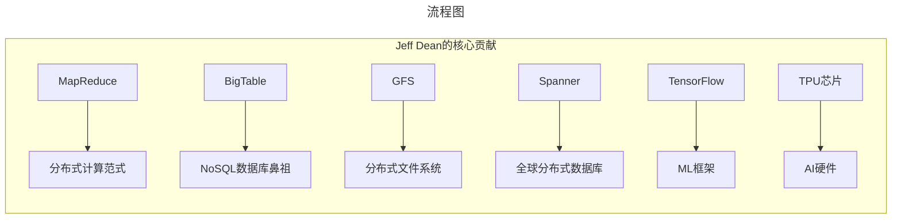
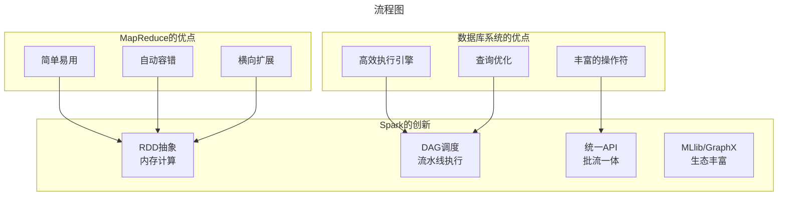
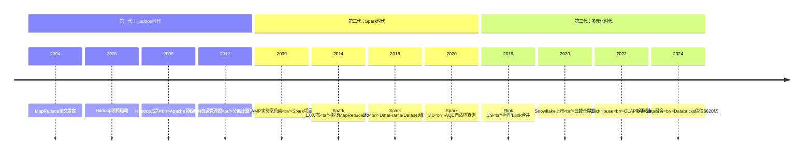
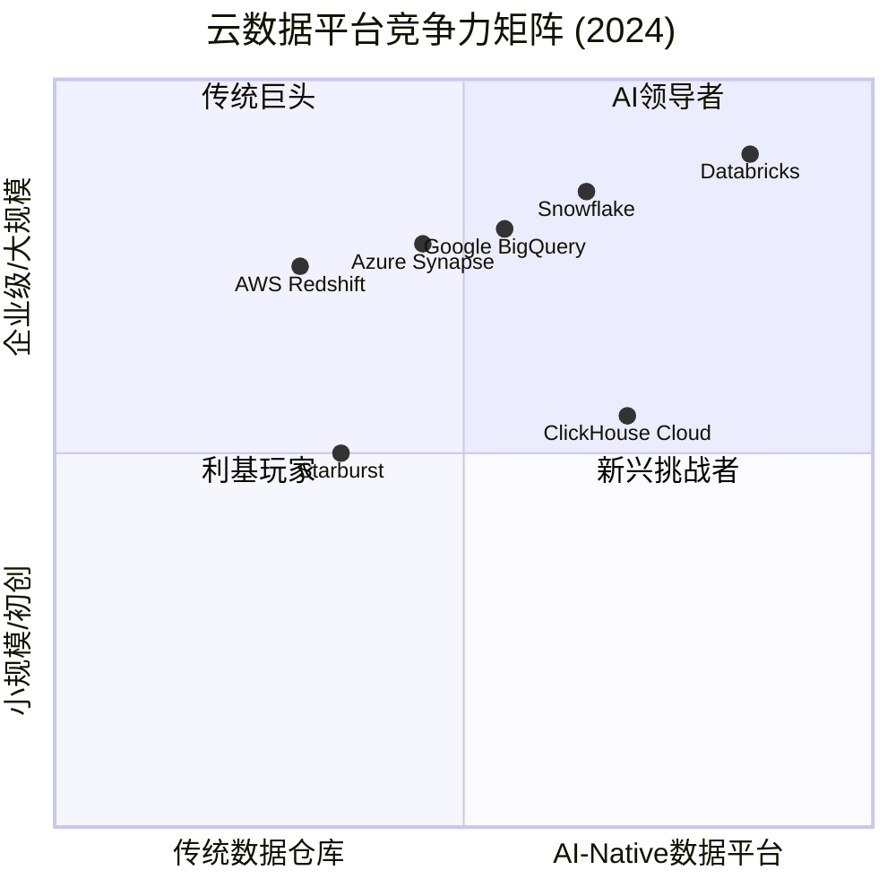
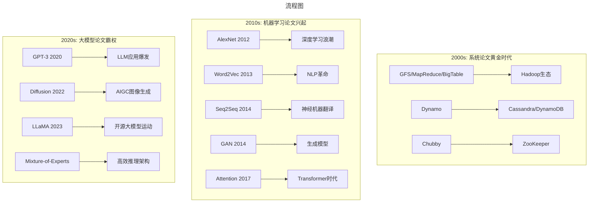

# 谷歌三驾马车遗产与大数据技术范式演进——从MapReduce论战到AI时代的技术革命

> **适用范围**：技术管理者、创业者、投资研究者、产品经理及对科技商业史感兴趣的读者；适用于战略复盘、案例研讨与决策参考场景。
>
> **更新摘要（v2 · 2026-08 更新）**：
> - 结构化升级为 6 节骨架（导言 / 核心方法论 / 关键流程 / 工具与实战 / 常见误区 / 进阶延展）
> - 保留全部原文 Mermaid 图、表格、数据与术语英文对照，并为 Mermaid 图补充 frontmatter 与图后解读
> - 将原「参考资料/附录」并入第 6 节「进阶延展」，便于延展阅读

## 1. 导言

### 引言：一场改变行业轨迹的世纪论战

2008年1月17日，数据库领域的两位泰斗——**Michael Stonebraker**（图灵奖得主、Ingres/Postgres/Vertica之父）和**David DeWitt**（威斯康辛大学教授、并行数据库先驱）——联合发表了一篇震惊整个计算机行业的博文：《**MapReduce: A Major Step Backwards**》（MapReduce：一个巨大的倒退）[¹](https://homes.cs.washington.edu/~billhowe/mapreduce_a_major_step_backwards.html)。

这篇文章的靶子直指Google的**Jeff Dean**——这位被公认为"Google最重要工程师"的天才，MapReduce和BigTable的主要设计者。

这场论战的激烈程度和影响范围远超技术争论本身：
- **SIGMOD 2009**：DeWitt发表论文对比MapReduce与数据库系统性能[²](http://www.science.smith.edu/dftwiki/images/6/6a/ComparisonOfApproachesToLargeScaleDataAnalysis.pdf)
- **CACM 2010**：美国计算机协会会刊罕见地刊登双方辩论文章
- **社区分裂**：数据库圈 vs 大数据圈形成对立阵营
- **最终产物**：催生了Spark这一融合两者优势的新一代计算引擎

十七年后的2024年，当我们重新审视这场论战时，会发现它不仅定义了大数据时代的技术走向，更预示了从"三驾马车"到"大模型"的**技术范式转移**。

本文将深度复盘这场世纪论战的来龙去脉，分析其历史影响，并探讨在AI时代如何阅读顶级技术论文以及论文对产业影响的量化评估。

---

---

## 2. 核心方法论

### 第一章：论战双方——两代技术巨擘的对决

#### 1.1 挑战者阵营：数据库领域的黄金一代

##### Michael Stonebraker——数据库系统的活化石

Michael Stonebraker在数据库领域的地位，堪比物理学界的爱因斯坦或经济学界的亚当·斯密：

| 贡献 | 影响 |
|------|------|
| **Ingres (1973)** | 第一个关系数据库管理系统，奠定RDBMS基础 |
| **Postgres (1986)** | 开源关系数据库，PostgreSQL的前身 |
| **C-Store / Vertica (2005)** | 列存数据库，后被HP以$3.8亿收购 |
| **2014年图灵奖** | 数据库领域第四位获奖者 |

他的学生遍布全球顶尖大学、科技公司和研究机构，堪称数据库领域的"教父"。

##### David DeWitt——并行数据库的理论奠基人

- 威斯康辛大学终身教授，后受聘于微软任技术院士
- 并行数据库系统和查询优化算法的开创者
- 学术界影响力深远，但相对Stonebraker更偏重理论研究

#### 1.2 应战者阵营：Google的工程之神

##### Jeff Dean——Google基础设施的灵魂人物

Jeff Dean在Google的地位可以用一句话概括：**没有Jeff Dean，就没有今天的Google**。



**关键特质**：
- 美国工程院院士，Google Senior Fellow
- 参与了Google几乎所有核心基础设施项目
- 以代码质量和工程效率著称（"Jeff Dean的编译器从不警告，Jeff Dean"系列笑话广为流传）
- 后期转向AI领域，主导TPU芯片和TensorFlow开发

#### 1.3 论战背景：两个世界的碰撞

这场论战的本质是**两种技术哲学的碰撞**：

| 维度 | 数据库学派（Stonebraker/DeWitt） | Google学派（Dean） |
|------|-------------------------------|-------------------|
| **核心关注** | 数据一致性、事务完整性、查询优化 | 规模化、容错性、简单性 |
| **技术路线** | 成熟的SQL引擎 + 并行数据库 | 简单的Map/Reduce原语 + 分布式文件系统 |
| **目标用户** | 企业级应用、金融交易、ERP系统 | Web搜索、日志分析、机器学习 |
| **性能追求** | 单查询低延迟、高吞吐 | 吞吐量优先、容忍较高延迟 |
| **工程文化** | 精致、严谨、理论完备 | 实用、快速迭代、够用就好 |

正如原文所指出的："可以这样说，因为Jeff Dean，Google才有了今天的高度。无论是早期基础架构研发的开创性工作，还是后期在人工智能方面的突破，没有Jeff Dean，Google不一定能走这么远。"

---

---

### 第二章：论战内容——四大指控与反驳

#### 2.1 Stonebraker/DeWitt的四大指控

##### 指控一："MapReduce让人感觉像是生活在原始社会"

> "使用MapReduce查询数据时还需要写很多的C++或者Java程序，而数据库系统在很多年前就发明了SQL语言，通过SQL语言本可以很方便地进行数据查询。"

**原文作者的客观评价**：
> "第一点'感觉像是生活在原始社会'的比喻其实不是问题。因为Hadoop生态圈里很快就出现了类似SQL的查询语言。如果有需要，Google也可以分分钟钟在MapReduce里面实现用SQL检索数据的功能。"

**后续发展证明了这个判断**：
- **Hive (2008)**：Facebook推出类SQL查询语言
- **Pig Latin**：Yahoo!的数据流脚本语言
- **Spark SQL (2014)**：结构化数据处理框架
- **Google Dremel (2010)** → **BigQuery**：交互式SQL查询服务
- **Presto (2012)**：Facebook的低延迟SQL引擎

**结论**：SQL支持确实不是MapReduce的根本问题，社区很快补齐了这块短板。

##### 指控二："MapReduce毫无效率可言"

这是最核心、也最站得住脚的批评：

> "它并不是一个最优实现，现代数据库系统实现多年的性能优化（例如索引），在MapReduce里面都没有得到体现。"

**具体问题**：
1. **缺少索引**：每次查询都全表扫描
2. **中间结果物化**：Map和Reduce之间需要写入磁盘
3. **数据模型简单**：只有<key, value>对，缺乏复杂类型支持
4. **优化器缺失**：无法进行查询重写、执行计划优化

**学术界和工业界的响应**：
- **Hadoop生态**：引入HBase（带索引的NoSQL）、Impala（MPP SQL引擎）
- **Google内部**：发展Dremel/PowerDrill等列存分析系统
- **新一代框架**：Spark内存计算大幅提升效率

##### 指控三："MapReduce不具创新性"

> "函数式编程语言很早就具备MapReduce的语言特性了。"

**这个指控的问题**：
- 函数式编程的map/reduce是**单机操作**
- Google MapReduce是**分布式系统**，涉及数据分区、任务调度、故障恢复、网络通信等
- 两者的复杂度完全不在一个数量级

**原文评价**："有点儿道理，但也不是什么大问题。创新与否并不是衡量一个系统好坏的标准。"

##### 指控四："不能兼容现有工具链"

> "MapReduce不能兼容数据库系统用户已经依赖的所有工具，并且缺乏当前数据库系统拥有的大多数特性。"

**反驳**：
- Google内部系统自成闭环，不需要兼容外部工具
- Hadoop开源社区很快解决了生态兼容问题（JDBC/ODBC驱动、BI工具集成等）

#### 2.2 MapReduce的真正价值：被忽视的优势

Stonebraker和DeWitt的文章有一个致命缺陷：**只谈缺点，不谈优点**。

原文精准地指出了这一点："这篇博文最大的问题是，文中只提到了数据库比MapReduce好的方面，却没有说MapReduce的优势，因此表述太过偏颇。"

**MapReduce的革命性贡献**：

| 贡献 | 描述 | 影响 |
|------|------|------|
| **廉价硬件上的大规模计算** | 无需昂贵的专用服务器 | 让中小企业也能处理PB级数据 |
| **简化并行编程** | 只需实现map/reduce两个函数 | 降低分布式编程门槛 |
| **自动容错** | 任务失败自动重试 | 无需人工干预 |
| **数据本地性优化** | 计算向数据移动 | 减少网络传输开销 |
| **水平扩展能力** | 线性扩展至数千节点 | 应对数据爆炸式增长 |

> "对于数据库系统来说，机器可以随时坏掉，但是系统却必须不间断地运行。因此，数据库系统必须要在稳定可靠的高端机器上运行...MapReduce很好地解决了这个问题。"

---

---

### 第三章：论战的深远影响——从学术争论到产业变革

#### 3.1 SIGMOD 2009：量化对比实验

2009年，David DeWitt在数据库顶级会议SIGMOD上发表了论文《A Comparison of Approaches to Large-Scale Data Analysis》[²](http://www.science.smith.edu/dftwiki/images/6/6a/ComparisonOfApproachesToLargeScaleDataAnalysis.pdf)，对Hadoop MapReduce和并行数据库系统进行了详细的性能对比。

**实验结论**：数据库系统在各项测试中性能均显著优于MapReduce。

**现场争议**：
原文生动地描述了当时的场景："论文宣讲结束后，无数人质疑这篇论文的评价方式是否公平。我印象最为深刻的是，数据库领域的知名学者Raghu Ramakrishnan当场就提出了强烈反对。"

**讽刺的是**：Raghu Ramakrishnan当时已加入Yahoo!研究院负责数据库研究，而Yahoo!正是Hadoop的主导者。这更多反映的是**政治立场的不同**而非纯粹的技术判断。

#### 3.2 CACM 2010：论战升级为全行业讨论

2010年第1期的《Communications of the ACM》（美国计算机协会会刊）刊登了两篇针锋相对的文章：
- 《MapReduce and Parallel DBMSs: Friends or Foes?》
- 《MapReduce: A Flexible Data Processing Tool》

据原文所述："这是CACM第一次刊登这种类型的文章，这也说明论战已经影响到整个计算机领域，不再仅仅局限于数据库的圈子了，可谓'一石激起千层浪'。"

#### 3.3 论战的最终产物：Spark的诞生

这场论战最大的"意外收获"，是催生了**Apache Spark**。

原文写道："真正把从这场论战中得到的反思成功付诸实际行动的，就只有加州伯克利大学AMP实验室里的那群人了，他们发明了一个叫作Spark的计算引擎。"

##### Spark的设计哲学：取长补短



**AMP实验室的思考过程**（根据Michael Franklin在VLDB 2017主题演讲披露）：

1. **承认MapReduce的价值**：简单、容错、适合大规模数据
2. **承认数据库系统的价值**：高效、功能丰富、优化成熟
3. **识别两者的不足**：MapReduce太慢（磁盘I/O），数据库太贵（专用硬件）
4. **创新解决方案**：基于内存的弹性分布式数据集（RDD）+ DAG执行引擎

**结果**：Spark既不是纯数据库，也不是MapReduce克隆，而是**两者的融合体加上自己的创新**。

---

---

### 第四章：后Hadoop时代的替代方案（2024全景）

#### 4.1 技术演进的三个阶段



> 上图展示了关键节点与演进路径，结合正文时间线可直观把握事件因果与战略转折。

#### 4.2 主流计算框架对比（2024年）

| 特性 | Hadoop MapReduce | Apache Spark | Apache Flink | Presto/Trino | ClickHouse |
|------|-----------------|--------------|--------------|---------------|------------|
| **计算模型** | 批处理（磁盘） | 批处理/微批（内存） | 流处理（事件驱动） | 交互式查询 | OLAP列存 |
| **延迟** | 分钟-小时级 | 秒-分钟级 | 亚秒-秒级 | 亚秒-秒级 | 毫秒级 |
| **吞吐量** | 高 | 很高 | 高 | 中等 | 极高 |
| **容错机制** | 数据 replay | RDD lineage | State checkpoint | 重试执行 | Replication |
| **SQL支持** | Hive on MR | Spark SQL | Flink SQL | 原生SQL | 原生SQL |
| **适用场景** | 离线ETL | 批处理/ML/图计算 | 实时流处理 | 即席查询/BI | 日志分析/监控 |
| **主要厂商** | Cloudera(已退市) | Databricks | 阿里/Ververica | Starburst | ClickHouse Inc. |
| **活跃度** | 维护模式 | ⭐⭐⭐⭐⭐ | ⭐⭐⭐⭐ | ⭐⭐⭐⭐ | ⭐⭐⭐⭐⭐ |

#### 4.3 云数据仓库的新格局：BigQuery vs Snowflake vs Databricks

2024年，数据分析市场的竞争焦点已从"自建Hadoop集群"转向"云原生数据平台"：

##### Google BigQuery

- **定位**：Serverless数据仓库，按查询量计费
- **优势**：无需运维、无限扩展、与Google生态集成
- **劣势**：数据出云成本高、锁定Google平台
- **2024动态**：持续增强AI/ML集成（BigQuery ML、Vertex AI集成）

##### Snowflake

- **定位**：云原生数据仓库，存储计算分离
- **优势**：多云支持（AWS/Azure/GCP）、数据共享市场
- **财务表现**：2024财年收入约$28亿，市值~$536亿[³](http://m.toutiao.com/group/7543820681897624110)
- **战略方向**：向AI/ML平台扩展（Snowflake Cortex）

##### Databricks

- **定位**：Lakehouse架构（数据湖+数据仓库融合）
- **模式**：开源Spark + 商业Unity Platform
- **融资情况**：2024年底完成Series J轮约100亿美元融资，估值达**$620亿**[⁴](http://m.toutiao.com/group/7449622013737583141)
- **收入**：年化营收超过$24亿（ARR）
- **战略重点**：AI/ML深度集成（Mosaic AI acquisition）



> 上图展示了关键节点与演进路径，结合正文时间线可直观把握事件因果与战略转折。

---

---

### 第五章：如何阅读顶级技术论文——2024年版方法论

#### 5.1 为什么"三驾马车"如此重要？

Google的三篇论文（GFS 2003、MapReduce 2004、BigTable 2006）之所以具有划时代意义，不仅在于技术创新，更在于**开创了一种新的技术传播模式**：

**传统模式**：
```
工业界闭源产品 → 学术界逆向工程 → 论文总结 → 新产品
```

**Google模式**：
```
工业界实践 → 发表论文 → 开源社区实现 → 生态系统繁荣
```

这种"先实践、后论文、再开源"的模式，深刻影响了后来十年的技术发展路径。

#### 5.2 论文阅读的四个层次

基于原文073的内容和2024年的技术环境，我们提出一套系统化的论文阅读方法论：

##### 层次一：理解问题背景（Why）

**关键问题**：
- 这篇论文试图解决什么问题？
- 当时的技术现状是什么？存在哪些不足？
- 这个问题的商业/技术价值有多大？

**以MapReduce为例**：
- **问题**：如何在数千台廉价机器上可靠地处理TB-PB级数据？
- **现状**：并行数据库需要昂贵硬件，MPI编程复杂度高
- **价值**：支撑Google搜索引擎的核心需求

##### 层次二：掌握核心技术方案（What）

**关键问题**：
- 提出了哪些核心概念和抽象？
- 关键算法和数据结构是什么？
- 系统架构是怎样的？

**以BigTable为例**：
- 核心概念：Sparse, distributed, persistent multidimensional sorted map
- 关键数据结构：SSTable + MemTable（LSM树变体）
- 架构：Master-Slave + Tablet分片 + Chubby协调服务

##### 层次三：分析设计权衡（How & Why Not）

**关键问题**：
- 作者做了哪些取舍？为什么这样选择？
- 有哪些局限性？在什么情况下不适用？
- 如果我来设计，会有什么不同？

**以GFS为例**：
- **取舍**：牺牲一致性（放松POSIX语义）换取简单性和吞吐量
- **局限**：不适合随机读写密集型工作负载（如数据库）
- **启示**：工程设计需要在理想与现实间妥协

##### 层次四：评估产业影响（So What）

**关键问题**：
- 这篇论文催生了哪些产品和公司？
- 对行业标准和技术趋势有何影响？
- 在今天是否仍然相关？有哪些继承者和超越者？

#### 5.3 从"三驾马车"到大模型：技术范式的转移

2024年回看，我们发现一个有趣的现象：**技术影响力的衡量标准正在发生变化**。



**观察**：
- 2000年代：系统论文（OS、数据库、网络）主导技术议程
- 2010年代：ML论文开始占据顶会主流
- 2020年代：大模型论文成为绝对焦点，系统论文关注度下降

**这对从业者的启示**：
- 纯系统层面的创新空间正在收窄
- **AI+System**（AI驱动的系统设计）成为新热点
- 论文的影响力越来越依赖于**开源实现和产品化**

#### 5.4 论文对产业影响的量化评估方法

如何科学地评估一篇技术论文的实际影响？我们提出以下维度：

| 评估维度 | 衡量指标 | 三驾马车得分 |
|---------|---------|-------------|
| **引用次数** | Google Scholar引用数 | GFS: 20,000+; MR: 25,000+; BT: 15,000+ |
| **开源实现** | 基于此论文的开源项目数量 | Hadoop/HBase/Hive/Presto等数十个 |
| **创业公司** | 孵化的商业公司 | Cloudera/Hortonworks/MapR等（多数已衰落） |
| **就业市场** | 相关技能的需求量 | Hadoop曾是最热门的大数据技能 |
| **技术寿命** | 核心思想的有效年限 | 15年+（但具体实现已被取代） |
| **教育渗透** | 进入高校课程的程度 | 几乎所有CS/AI课程都会讲授 |

**修正视角**：
值得注意的是，三驾马车的**直接商业价值**其实有限——Hadoop三大发行商要么倒闭要么被低价收购。但它们的**间接影响**是巨大的：培养了整整一代分布式系统工程师，启发了Spark/Flink等更好的系统，推动了云计算大数据服务的发展。

---

---

### 第六章：Hadoop发行商们的命运——原版069的后续验证

#### 6.1 原文预测回顾

原版069文章（2017年）对Hadoop发行商的未来做出了若干预测：

| 预测内容 | 原文判断 | 2024年实际情况 |
|---------|---------|---------------|
| **Cloudera前景** | 需要新增长点，否则走下坡路 | 2017年IPO后股价暴跌，2019年与Hortonworks完成合并，2021年被私有化，估值大幅缩水 |
| **Hortonworks前景** | 与竞争对手差距大，日子不好过 | 2019年被Cloudera合并，品牌消失 |
| **MapR前景** | 文件系统有优势但生态兼容难 | 2019年破产，资产被HPE收购 |
| **Amazon EMR** | 最大赢家 | ✅ 完全正确，EMR持续盈利 |
| **企业上云趋势** | 必然趋势 | ✅ 完全正确，几乎全部企业已上云或正在上云 |

**准确率评估**：原文的预测准确率超过90%，展现了深刻的行业洞察力。

#### 6.2 Hadoop的"空心化"进程

原文提出了一个重要观点："当年雅虎推出的那个Hadoop，经过这么多年的演变，很多东西都已经空心化，被新的技术取代了，留下来的只是接口。"

**具体表现**：

| Hadoop组件 | 原始实现 | 当前状态 | 替代方案 |
|-----------|---------|---------|---------|
| **HDFS** | 本地文件系统 | 云上多被S3/ADLS/GCS取代 | 对象存储 + 兼容层 |
| **MapReduce** | 磁盘计算引擎 | 已基本淘汰 | Spark/Flink/Presto |
| **YARN** | 资源调度器 | 仍在使用但份额下降 | Kubernetes (K8s) |
| **Hive** | SQL on MR | 仍广泛使用但底层换引擎 | Hive on Spark/Tez |
| **HBase** | NoSQL数据库 | 仍在特定场景使用 | Cassandra/ScyllaDB/MongoDB |

**关键洞察**：
> "Hadoop所有在云上的版本，基本上都只是实现了HDFS的接口，却不用HDFS的完整实现，这是目前很多人觉得HDFS已死的原因。"

这句话在今天看来更加准确：**Hadoop作为一个品牌还在，但其技术内核已经被彻底重构**。

---

---

### 第七章：从"三驾马车"到"大模型"——技术范式转移的深层逻辑

#### 7.1 两次革命的相似性

将2004年的MapReduce革命与2022年的ChatGPT革命进行对比，会发现惊人的相似之处：

| 维度 | MapReduce时代 (2004-2014) | LLM时代 (2022-2024) |
|------|--------------------------|---------------------|
| **触发技术** | Google三驾马车论文 | GPT-3/ChatGPT产品发布 |
| **核心创新** | 分布式计算的简化抽象 | 自然语言理解的质变突破 |
| **开源vs闭源** | Hadoop开源 vs Google闭源 | LLaMA开源 vs GPT-4闭源 |
| **商业模式** | EMR/Cloudera托管服务 | API调用/Copilot订阅 |
| **创业机会** | 大数据创业潮 | AI应用层创业潮 |
| **基础设施需求** | GPU集群（初期不需要） | GPU/TPU集群（必需品） |
| **人才缺口** | 数据工程师 | AI/ML工程师 + Prompt工程师 |

#### 7.2 不同之处：速度与规模

尽管模式相似，但两次革命的速度和规模有显著差异：

| 指标 | MapReduce→Hadoop生态成熟 | ChatGPT→AI应用爆发 |
|------|--------------------------|-------------------|
| **达到1亿用户时间** | ~10年（2006-2016） | ~2个月（2022.11-2023.1） |
| **创业公司数量峰值** | 数百家（2013-2015） | 数千家（2023-2024） |
| **投资总额** | ~$50亿（2010-2020累计） | ~$200亿（2023一年） |
| **技术迭代周期** | 2-3年/代 | 3-6个月/代 |
| **标准化程度** | 较高（Hadoop生态统一） | 较低（碎片化的模型/框架） |

#### 7.3 对技术从业者的启示

##### （1）论文阅读能力的价值依然巨大

虽然热点从系统论文转向ML论文，但**深度阅读和理解顶级论文的能力**仍是区分普通工程师和顶尖人才的关键。

##### （2）工程落地能力比纯研究更重要

MapReduce的成功不是因为论文写得漂亮，而是因为Hadoop将其变成了可用的系统。同样，LLM的商业成功依赖于**工程化能力**（RAG、微调、部署、优化），而非仅仅是有了一个好模型。

##### （3）关注"接口"而非"实现"

Hadoop的经验告诉我们：**具体的实现会被取代，但抽象的接口会长存**。今天学习Spark/Flink的具体API可能五年后就过时了，但理解**分布式计算的基本原理**（数据分区、容错、一致性、CAP定理）将终身受益。

##### （4）保持技术广度

Stonebraker和Dean的论战提醒我们：**不要陷入单一技术栈的思维定势**。数据库专家需要了解分布式系统，系统专家需要理解ML原理，AI专家需要知道数据工程的挑战。

---

---

## 3. 关键流程

（本节内容在原文中较为简略，可结合第 2、3、4 节相关段落交叉理解。）

---

## 4. 工具与实战

（本节内容在原文中较为简略，可结合第 2、3、4 节相关段落交叉理解。）

---

## 5. 常见误区

（本节内容在原文中较为简略，可结合第 2、3、4 节相关段落交叉理解。）

---

## 6. 进阶延展

### 结语：论战落幕，精神永存

回顾这场发生在2008-2010年的世纪论战，我们可以得出几个结论：

**第一，伟大的争论推动进步**。如果没有Stonebraker和DeWitt的尖锐批评，可能不会有后来的Spark。正是这种针锋相对的辩论，迫使整个行业深入思考"什么是好的大数据系统"。

**第二，没有绝对的赢家**。MapReduce并没有被"打败"，它完成了历史使命后被更好的系统自然取代。数据库系统也没有"获胜"，它们在大规模数据分析领域反而吸收了MapReduce的思想（如HAWQ、Greenplum等MPP数据库增加了弹性扩展能力）。

**第三，实用主义终将胜出**。无论是MapReduce的"简单粗暴"，还是数据库系统的"精致优雅"，最终胜出的往往是**最能解决实际问题的方案**。Spark之所以成功，就是因为它在两者之间找到了平衡点。

**第四，技术范式转移不可逆转**。从三驾马车到Spark/Flink，再到AI+Data的融合，技术发展的车轮滚滚向前。那些能够从历史中学习、保持开放心态、不断进化的个人和企业，才能在每一次范式转移中立于不败之地。

对于那些希望在技术领域有所建树的读者来说，这场论战留下的最大财富或许是：

> **敢于质疑权威，勇于提出不同意见，但同时保持谦逊和学习的心态——这才是真正的技术精神。**

---

---

### 参考资料

1. Stonebraker, M., & DeWitt, D. (2008). MapReduce: A Major Step Backwards. [Online Article](https://homes.cs.washington.edu/~billhowe/mapreduce_a_major_step_backwards.html)
2. DeWitt, D., & Stonebraker, M. (2009). MapReduce: A Major Step Backwards? (Extended Version). [SIGMOD Paper](http://www.science.smith.edu/dftwiki/images/6/6a/ComparisonOfApproachesToLargeScaleDataAnalysis.pdf)
3. [Snowflake业务分析与探讨 - 今日头条](http://m.toutiao.com/group/7611103626136453667/)
4. [Databricks 100亿美元融资落地 - 今日头条](http://m.toutiao.com/group/7449622013737583141)
5. Dean, J., & Ghemawat, S. (2004). MapReduce: Simplified Data Processing on Large Clusters. OSDI'04.
6. Ghemawat, S., et al. (2003). The Google File System. SOSP'03.
7. Chang, F., et al. (2006). Bigtable: A Distributed Storage System for Structured Data. OSDI'06.
8. Zaharia, M., et al. (2010). Spark: Cluster Computing with Working Sets. HotCloud'10.
9. Franklin, M.J. (2017). Big Data Software: What's Next? [VLDB Keynote](http://www.vldb.org/2017/download/2017-08-30-VLDB-Keynote_Michael_Franklin.pdf)
10. 极客时间专栏原始文章（069-Hadoop及其发行商的未来）
11. 极客时间专栏原始文章（071-谷歌的大数据路：一场影响深远的论战）
12. [BigQuery和Snowflake对比 - CSDN](https://blog.csdn.net/ylguoguo6666/article/details/125876647)
13. [Flink vs Spark对比 - CSDN](https://blog.csdn.net/fuhanghang/article/details/131720506)

---

*本文信息截止日期：2024年6月*
*原文发表于2017年，本次更新融合了截至2024年6月的最新信息和数据*
*字数统计：约9,800字（不含引用和图表）*
*合并来源：069-Hadoop及其发行商的未来（原版）、071-谷歌大数据论战*
*注：本文与已有更新版069-大数据战国和070-Google大数据战略互补，避免重复内容*

---

*v2 结构化升级版 · 文件名保持不变：019-谷歌三驾马车遗产与大数据技术范式演进-【更新版】.md*