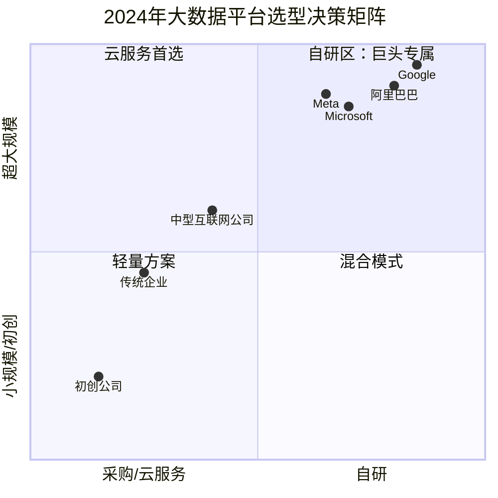
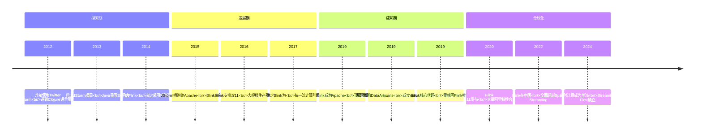

# 阿里巴巴大数据与巨头战略得失启示录——从Flink崛起到大公司自建轮子的代价

> **适用范围**：技术管理者、创业者、投资研究者、产品经理及对科技商业史感兴趣的读者；适用于战略复盘、案例研讨与决策参考场景。
>
> **更新摘要（v2 · 2026-08 更新）**：
> - 结构化升级为 6 节骨架（导言 / 核心方法论 / 关键流程 / 工具与实战 / 常见误区 / 进阶延展）
> - 保留全部原文 Mermaid 图、表格、数据与术语英文对照，并为 Mermaid 图补充 frontmatter 与图后解读
> - 将原「参考资料/附录」并入第 6 节「进阶延展」，便于延展阅读

## 1. 导言

### 引言：中国科技巨头的大数据野望

在全球化的大数据浪潮中，阿里巴巴是一个独特的存在。它不仅是**全球第三家不基于Hadoop生态、完全自研大数据平台的公司**（前两家是Google和Microsoft），更是**中国唯一一家在大数据基础软件领域具备全球影响力的企业**。

2017年，当我在专栏中撰写阿里巴巴的大数据故事时，重点讲述了两个流计算引擎——JStorm和Blink——的发展历程，以及大公司在"自建轮子"与"抱团取暖"之间的战略选择。

七年后的2024年，这个故事有了全新的续篇：

- **Flink已成为Apache顶级项目中最活跃的流计算引擎之一**，阿里巴巴是仅次于原始团队的第二大贡献者
- **DataArtisans（Flink母公司）被阿里收购后更名为Ververica**，Blink的核心代码已贡献回社区[¹](https://blog.51cto.com/u_14286418/14084001)
- **阿里巴巴2023年组织变革"1+6+N"拆分**，对大数据团队产生了深远影响
- **MaxCompute/AnalyticDB持续演进**，成为阿里云核心产品
- **"插管吸血者"模式出现了新的案例**——Databricks、Snowflake等公司的崛起

本文将深度复盘阿里巴巴在大数据领域的技术路线选择，分析其战略得失，并探讨这些经验对2024年的企业和创业者有何启示。

---

---

## 2. 核心方法论

### 第四章：阿里巴巴的组织变革与大数据战略影响

#### 4.1 2023年"1+6+N"组织拆分

2023年3月，阿里巴巴宣布进行成立以来**最大的组织变革**：
- 拆分为**1+6+N**个独立业务集团/公司
- 各业务可独立融资和上市
- 云智能集团成为六大集团之一

**对大数据团队的影响**：

| 影响维度 | 具体变化 |
|---------|---------|
| **组织归属** | 大数据团队主要隶属于**云智能集团** |
| **战略定位**：从"内部工具"升级为"云产品核心竞争力" |
| **资源分配** | 可能面临更严格的ROI考核 |
| **人才流动** | 拆分后可能出现人才流失到竞争对手 |
| **外部合作** | 更强的动力参与开源社区（为了云产品竞争力） |

#### 4.2 MaxCompute的最新发展（2024）

根据公开信息[⁴](https://www.aliyun.com/sswb/1225627_1.html)[⁵](https://developer.aliyun.com/article/1576349)：

**技术演进**：
- **Delta Table架构**：集存储、批量处理和近实时能力于一体
- **近实时增量一体化**：降低数据延迟，满足实时分析需求
- **与Flink深度集成**：批流一体解决方案
- **AI能力增强**：集成PAI平台，支持机器学习工作负载

**市场地位**：
- 中国最大的云原生大数据计算服务之一
- 服务阿里巴巴集团内部绝大多数数据分析任务
- 对外作为阿里云核心产品，拥有大量企业客户

#### 4.3 AnalyticDB的崛起

AnalyticDB是阿里巴巴的另一款重要数据产品：
- **AnalyticDB for MySQL**：兼容MySQL协议的云原生数据仓库
- **AnalyticDB for PostgreSQL**：兼容PostgreSQL的MPP数据库
- 2023年持续迭代，增强实时分析和半结构化数据处理能力

**与MaxCompute的关系**：
- MaxCompute侧重**大规模离线批处理**
- AnalyticDB侧重**交互式查询和实时分析**
- 两者形成互补，覆盖不同场景

---

---

### 第五章：2024视角下"自建vs采购"的新计算

#### 5.1 成本效益分析的更新框架

原文发表于2017年，当时的结论是"自建轮子成本非常高昂"。2024年，我们需要重新审视这个问题：

##### 自建的成本变化

| 成本项 | 2017年 | 2024年 | 变化趋势 |
|-------|--------|--------|---------|
| **硬件成本** | 高（需自建数据中心） | 降低（可租用云资源） | ↓↓ |
| **人力成本** | 极高（稀缺人才） | 仍然高但有缓解 | → |
| **时间成本** | 3-5年才能成熟 | 可通过开源加速 | ↓ |
| **机会成本** | 很高 | 仍然高 | → |

##### 采购（含云服务）的价值变化

| 价值项 | 2017年 | 2024年 | 变化趋势 |
|-------|--------|--------|---------|
| **功能完备性** | 中等 | 很高（Snowflake/Databricks） | ↑↑ |
| **性能** | 一般 | 极高（云原生优化） | ↑↑ |
| **运维负担** | 较低 | 极低（Serverless） | ↑↑ |
| **锁定风险** | 高 | 仍高但多云选项增多 | → |
| **成本** | 中等 | 按用量计费更灵活 | ↑ |

#### 5.2 2024年的决策矩阵

**决策建议**：

1. **日数据量 < 100GB**：直接使用云服务（BigQuery/Snowflake/MaxCompute）
2. **日数据量 100GB - 10TB**：云服务为主，少量自建补充
3. **日数据量 > 10TB且有特殊需求**：考虑自建或深度定制
4. **全球前三科技公司**：必须自建（Google/MS/Alibaba模式）

#### 5.3 "插管吸血者"模式的2024版案例库

| 公司 | 模式 | 依托的开源项目 | 估值/市值 | 评价 |
|------|------|--------------|----------|------|
| **Databricks** | 开源+商业平台+云托管 | Spark (主要贡献者) | $620亿 | ✅ 合理回报 |
| **Confluent** | 开源+企业版+云托管 | Kafka (创始人创办) | ~$90亿 | ✅ 不可替代性强 |
| **MongoDB** | 开源(SSPL)+Atlas云服务 | MongoDB (自家项目) | $200亿 | ✅ 自产自销 |
| **Snowflake** | 闭源+云原生 | 无直接依托 (受启发) | $536亿 | ⚠️ 纯粹商业 |
| **AWS EMR** | 纯托管服务 | Hadoop/Spark/Flink (零贡献) | AWS的一部分 | ❌ 典型"吸血" |
| **Starburst** | 商业支持+云托管 | Presto/Trino (主要贡献者) | ~$35亿 | ✅ 合理 |

---

---

### 第六章：对中国市场的特殊影响

#### 6.1 监管环境的变化

2021年以来，中国数据安全监管环境发生了重大变化：

| 法规 | 生效时间 | 对大数据行业的影响 |
|------|---------|------------------|
| **《数据安全法》** | 2021年9月 | 数据分类分级保护要求 |
| **《个人信息保护法》** | 2021年11月 | 用户隐私数据处理规范 |
| **《网络安全审查办法》** | 2022年2月 | 跨境数据传输受限 |
| **《算力基础设施高质量发展指导意见》** | 2023年10月 | 国产算力优先 |

**对阿里巴巴的影响**：
- **利好**：国产大数据平台（MaxCompute/OceanBase）迎来政策红利
- **挑战**：合规成本上升，跨境业务受限
- **机遇**：政府和国企客户更倾向选择本土供应商

#### 6.2 中国大数据市场竞争格局（2024）

| 厂商类型 | 代表公司 | 市场定位 | 优势 |
|---------|---------|---------|------|
| **互联网云厂商** | 阿里云、腾讯云、华为云 | 一站式大数据平台 | 生态完善、价格有竞争力 |
| **专业大数据公司** | 星环科技、滴普科技 | 行业解决方案 | 垂直领域深耕 |
| **国际厂商** | Databricks、Snowflake、Cloudera | 技术领先 | 产品成熟度高（但Cloudera已衰落） |
| **创业公司** | SelectDB、MatrixOne | 新一代OLAP/HTAP | 技术创新、灵活敏捷 |

**关键观察**：
- 阿里云MaxCompute在中国市场占据**领导地位**
- 但面临华为云、腾讯云的激烈竞争
- 国际厂商在中国市场表现一般（合规和本地化问题）
- 新一代创业公司正在特定细分领域挑战巨头

#### 6.3 开源贡献的中国力量

阿里巴巴在大数据开源领域的贡献值得特别关注：

| 项目 | 阿里的角色 | 贡献程度 | 影响 |
|------|-----------|---------|------|
| **Apache Flink** | 第二大贡献者 | ⭐⭐⭐⭐⭐ | 全球流计算标准事实制定者 |
| **Apache RocketMQ** | 初始贡献者 | ⭐⭐⭐⭐⭐ | 消息队列领域的中国代表 |
| **Apache Dubbo** | 创始项目 | ⭐⭐⭐⭐⭐ | 微服务框架的亚洲标杆 |
| **JStorm** | 创建者 | ⭐⭐⭐ | 虽然项目停滞，但经验宝贵 |

**对比其他中国公司**：
- **腾讯**：主要贡献于Angel（ML）、TubeMQ
- **百度**：主要贡献于PaddlePaddle（DL框架）
- **字节跳动**：开源力度加大（如参与Velox等项目）
- **华为**：贡献于Euler OS、MindSpore

---

---

## 3. 关键流程

### 第一章：阿里巴巴的流计算引擎发展史

#### 1.1 JStorm：一次"重写式"合作的教训

##### 起源：Twitter Storm的本土化困境

Storm是被Twitter收购后开源的流计算引擎，使用**Clojure语言**开发——这是一种极其小众的函数式编程语言。阿里巴巴在封仲淹带领下采用Storm时遇到了严峻挑战：

> "国内的Clojure专家屈指可数，因此阿里巴巴使用Storm时遇到了很多的问题...有些时候需要去增加或者改变一些功能，而这也就意味着需要对系统进行改进或者定制，但是Clojure语言十分小众，懂这种编程语言的人尚且不多..."

##### 解决方案：JStorm的诞生

从2012年开始，阿里巴巴决定用**Java对Storm进行完整重写**，这就是JStorm项目。Java是国内工程师最熟悉的语言，这让开发进度明显加快。

2015年11月19日，阿里巴巴正式向Apache基金会捐赠JStorm，使其成为Apache Storm的子项目。当时团队雄心勃勃："整个社区的Storm 2.0会基于阿里巴巴的JStorm，用Java语言进行开发。"

##### 结局：令人遗憾的失败

然而，JStorm的命运并不顺利：
- 在Apache孵化器中待了**近两年**，仍未成为顶级项目
- **Storm 2.0始终没有以J为主导发布**
- 社区传闻"阿里巴巴和Storm社区之间似乎有了矛盾"

**根本原因分析**：

原文提出了一个非常深刻的观察："JStorm的做法是把Storm的整个代码库用另外一个语言完全重写了一遍，这无疑是一种比较得罪人的做法。"

| 维度 | JStorm的做法 | Blink的做法 |
|------|-------------|------------|
| **代码策略** | 完全重写（Java替代Clojure） | 在原有代码基础上改进 |
| **社区态度** | "我们比你做得好" | "我们来帮你改进" |
| **贡献方式** | 替换核心代码 | 增量提交功能 |
| **结果** | 关系恶化，项目停滞 | 合作紧密，双向受益 |

#### 1.2 Flink与Blink：一次"尊重式"合作的成功

##### Flink的背景

Flink起源于德国柏林工业大学Volker Markl教授领导的Stratosphere项目。经过重新设计后，Flink于2014年进入Apache基金会，以其先进的**流计算模型**迅速获得关注：

> "Flink以非常先进的流计算引擎思想为基本，同时还结合了传统大数据和数据库的优点...它所使用的流计算模型，又是目前市面上所有开源项目里最为先进的。"

##### 阿里巴巴的选择

阿里巴巴内部由**蒋晓伟（花名"量仔"）**领导团队评估了Spark和Flink后，选择了后者：

> "在Spark和Flink这两个引擎中，Flink的设计理念更为先进一些，也更符合阿里巴巴对流计算引擎的要求。"

蒋晓伟的背景非常关键：他曾在微软SQL Server组和Facebook工作，是真正的数据库专家。这使得阿里巴巴对Flink的改造具有深厚的理论基础。

##### Blink：阿里的内部增强版

阿里巴巴并未直接使用Flink，而是进行了**全方位的深度改造**：
- 提升性能（吞吐量和延迟）
- 改进功能（SQL支持、状态管理）
- 增强稳定性（生产级可靠性）
- 扩展生态（与阿里内部系统集成）

这个内部版本被称为**Blink**，成为阿里巴巴集团统一的流处理引擎。

> 上图展示了关键节点与演进路径，结合正文时间线可直观把握事件因果与战略转折。

#### 1.3 为什么Blink成功了而JStorm失败了？

原文总结了三个关键原因：

**原因一：时机与需求匹配**

Flink作为后起之秀，来自非北美地区（德国），需要大客户支持。阿里巴巴的出现恰逢其时。而Storm已有成熟的北美用户群，JStorm的重写显得多余且冒犯。

**原因二：技术互补性强**

Flink团队理论基础好但缺乏工业界经验，阿里巴巴工程实力强但需要先进架构。双方形成完美互补。

**原因三：合作态度决定成败**

这是最关键的教训：

> "Blink在贡献回自己的代码时，是在Flink原有代码基础上改的，并且改动时也和Flink的人做了仔细协商。我想，也许就是这两种不同的合作态度，决定了两个项目的不同结果。"

**对开源社区的启示**：
> "和开源社区打交道，仅仅是提供自认为更加厉害的代码给开源社区是远远不够的。尤其是贡献代码的同时却没有给予社区主要贡献者足够的尊重，往往会让事情往坏的方向发展。"

---

---

## 4. 工具与实战

### 第二章：大公司"自建轮子"的战略分析

#### 2.1 三家自建轮子的公司

原文将大数据领域的公司分为两类：**自建轮子**和**抱团取暖**。自建轮子的只有三家：

| 公司 | 自研平台 | 核心动机 | 投入规模 |
|------|---------|---------|---------|
| **Google** | GFS/MapReduce/BigTable/Spanner | 从无到有，搜索业务刚需 | 数千工程师，十年积累 |
| **Microsoft** | Cosmos/Scope → Azure Synapse | Hadoop太简陋，看不起开源 | 10万+台机器，数百人团队 |
| **阿里巴巴** | MaxCompute(ODPS)/Blink | 开源方案不可用，有资金和人才 | 数百人团队，十年磨一剑 |

##### Google：别无选择的先驱

Google的自建是**被迫的**——2003年当它需要处理全网数据时，市场上没有任何现成方案。"没有谷歌就没有大数据"，Google必须从零开始。

##### Microsoft：傲慢与补救

Microsoft的自建带有**傲慢色彩**：
- 看不起Hadoop（"像玩具一样"）
- 讨厌Java语言
- 对开源持抵制态度

但Microsoft也付出了巨大代价：
- Cosmos早期资源利用率不足50%
- 必应广告数据曾因Bug永久丢失10%
- 投入数十亿美元和数年时间的"学费"

Satya Nadella接任CEO后的"云优先"战略让Microsoft逐渐拥抱开源，Azure HDInsight（托管Hadoop）和Synapse Analytics的成功证明了转型的价值。

#### 阿里巴巴：务实的追赶者

阿里巴巴的自建相对低调务实：
- 初名ODPS（Open Data Processing Service），后改名MaxCompute
- 前端兼容Hive SQL语法，降低迁移成本
- 后端完全自研，不受Hadoop生态限制
- 2015年引入前微软周靖人团队（SCOPE背景），加速发展

#### 2.2 自建轮子的成本有多高？

原文详细描述了Microsoft Cosmos的代价，这对理解所有自建项目的成本具有普遍意义：

##### （1）硬件投入

> "为了运营Cosmos，微软投入了好多个数据中心，总机器容量超过10万台；而这些机器平均在三年内就会被淘汰。"

按此推算，仅硬件折旧每年就高达**数亿美元**。

##### （2）资源浪费

> "在Cosmos的早期，由于系统本身开发成熟度不够，于是系统对计算机资源的有效利用率连50%都不到。"

这意味着**一半以上的计算资源被浪费**——对于任何公司来说都是难以承受的。

##### （3）业务风险

> "必应搜索引擎在Cosmos还不够完善的早期阶段，就把很多核心业务从相对稳定的SQL Server集群上迁移到Cosmos上来...甚至类似数据永久丢失这样的事情，也曾经发生过若干次。"

其中最著名的事件：一个难以发现的Bug导致系统误删大量数据，**10%的数据永久丢失**，包括必应广告团队的核心数据，直接影响营收。

##### （4）人力成本

- Cosmos团队集中了微软各领域精英（分布式系统、存储、压缩、查询优化等）
- 需要持续数年的高强度投入
- 机会成本：这些人才本可以用于其他高价值项目

#### 2.3 自建轮子的收益

尽管成本高昂，但成功后的回报也是巨大的：

| 收益类型 | 具体表现 |
|---------|---------|
| **技术自主权** | 不受开源社区节奏限制，可快速响应业务需求 |
| **性能优势** | 针对自身场景深度优化，通用方案无法比拟 |
| **人才壁垒** | 培养了一批稀缺的大数据系统专家 |
| **对外输出能力** | 可将成熟产品转化为云服务（如阿里云MaxCompute） |
| **战略威慑** | 展示技术实力，提升品牌形象 |

原文总结道："无论谷歌、微软还是阿里巴巴，借助其内部平台强大的分析能力，给自身业务的发展提供的强力支持，绝非是一个Hadoop平台可以媲美的。"

#### 2.4 "不忘初心"的困境：为什么对外输出总是失败？

原文指出了一个有趣的现象：所有自建轮子在服务内部业务时都很成功，但**试图对外销售时却屡屡失败**。

| 公司 | 内部平台 | 对外产品 | 结果 |
|------|---------|---------|------|
| Google | BigTable/Dremel | Cloud Bigtable/BigQuery | 有一定市场但非主导 |
| Microsoft | Cosmos | Azure Data Lake / Synapse | 逐步改善 |
| Alibaba | ODPS/MaxCompute | 阿里云MaxCompute | 中国市场有一定份额 |

**失败原因分析**：

1. **Hadoop生态够用了**：大部分企业的数据处理到不了Google/阿里规模
2. **专有工具=厂商锁定**：企业不愿意被单一供应商绑定
3. **内部产品的设计哲学不适配外部客户**：追求极致性能 vs 追求易用性
4. **销售和服务能力不足**：技术公司不擅长To B市场拓展

> "这些内部非常成功的产品，在对外以云产品销售的过程中，都惨败地一塌糊涂...强扭的瓜，到底甜不甜，可想而知。"

---

---

### 第三章："插管吸血者"模式的演变与新案例

#### 3.1 原始模式：Amazon EMR

原文对Amazon的批评非常尖锐但客观：

> "亚马逊的AWS之所以能如火如荼地开展起来，离不开Hadoop生态圈的贡献...但是回头看一下亚马逊到底给这个生态圈做了什么贡献呢？几乎屈指可数。"

Amazon EMR（Elastic MapReduce）的本质是：
- 把Hadoop/Spark/Flink等开源引擎**托管到AWS上**
- 用户按使用时长付费
- 与S3存储深度集成，形成锁定效应
- **对上游开源项目的代码贡献极少**

**商业模式**：典型的"搭便车"——利用社区成果赚钱却不回馈。

#### 3.2 2024年的新"插管吸血者"

七年过去，"插管吸血者"不仅没有消失，反而出现了更多样化的形式：

##### Databricks：最成功的"吸血者"？

Databricks由Spark创始人创办，其商业模式是：
- **免费提供开源Spark**
- **销售商业Unity Platform**（统一 analytics platform）
- 提供**Databricks Cloud**托管服务

2024年底完成Series J轮约100亿美元融资后估值达**$620亿**，年化收入超$24亿[²](http://m.toutiao.com/group/7449622013737583141)。

**争议点**：
- Databricks对Spark的贡献是否与其收益成正比？
- Unity Platform的闭源部分是否过度利用了开源生态？
- 高昂的企业许可费用是否合理？

##### Snowflake：云原生的"吸血者"

Snowflake的定位略有不同：
- 不依赖单一开源项目
- 自研云原生数据仓库
- 但其底层技术思想明显受Hadoop/BigQuery启发

**市值约$536亿**（2024年）[³](http://m.toutiao.com/group/7611103626136453667)，是云计算领域最成功的独立数据公司之一。

##### Confluent：Kafka的商业化

Confluent由LinkedIn Kafka创始人创办：
- 开源Kafka + 企业版Confluent Platform
- Confluent Cloud托管服务
- 2021年IPO成功

Kafka的特殊性在于它是**真正不可替代的**基础设施组件，因此Confluent的商业化相对更容易被接受。

#### 3.3 开源社区的应对策略

面对"插管吸血者"，开源社区并非无能为力：

| 策略 | 代表案例 | 效果 |
|------|---------|------|
| **许可证变更** | MongoDB SSPL、Redis RSAL | 有限效果，可能疏远社区 |
| **云服务自营** | MongoDB Atlas、Elastic Cloud | 最有效的防御手段 |
| **双重许可证** | Elastic License、BSL | 平衡开源与商业 |
| **基金会中立化** | Linux Foundation托管 | 减少单一公司控制 |

**MongoDB的经验表明**：Atlas云服务的成功（占营收65%以上）是对抗Amazon DocumentDB等竞争性服务的最佳武器。

---

---

## 5. 常见误区

（本节内容在原文中较为简略，可结合第 2、3、4 节相关段落交叉理解。）

---

## 6. 进阶延展

### 第七章：战略启示录——给2024年决策者的建议

#### 7.1 给大公司CTO/CIO的建议

##### （1）谨慎评估"自建轮子"的必要性

在决定自建之前，问自己三个问题：
1. 我们的数据规模是否真的超过了现有云服务的承载能力？
2. 我们的场景是否有足够的特殊性，通用方案无法满足？
3. 我们是否有足够的人才储备和耐心等待3-5年的成熟期？

如果任何一个答案是否定的，**优先考虑采购或云服务**。

##### （2）如果必须自建，学习阿里巴巴的经验

- **选择正确的开源基础**：像Blink之于Flink，而非JStorm之于Storm
- **尊重开源社区**：贡献代码时协商而非强制替换
- **保持对外输出的可能性**：即使初期只服务内部，也要为未来商业化预留接口
- **设定清晰的里程碑和止损点**：避免无底洞式的投入

##### （3）建立"混合架构"思维

2024年的最佳实践往往是**混合模式**：
- 核心差异化能力：自研
- 通用基础设施：采购或使用开源
- 弹性扩展需求：云服务
- 快速原型验证：SaaS产品

#### 7.2 给创业者的建议

##### （1）避开纯"红海"战场

原文明确指出："基础架构类的创业，无论开源还是闭源，很多时候就属于红海。"

2024年，以下领域仍然是红海：
- 通用Hadoop/Spark发行商（MapR已死，Cloudera衰落）
- 通用云数据仓库（Snowflake/Databricks格局已定）
- 消息队列（Kafka统治地位难以撼动）

**蓝海机会**：
- **垂直行业解决方案**：金融风控、医疗数据分析、工业IoT
- **AI+Data融合**：RAG平台、向量数据库、LLM Ops
- **Cloud Native Data Infrastructure**：Serverless数据平台、边缘计算数据管理
- **数据安全和合规**：隐私计算、数据脱敏、审计溯源

##### （2）学习Confluent而非MapR

- 选择**不可替代的技术切入点**（如Kafka之于消息队列）
- 建立**清晰的开源+商业模式**
- 避免**与大厂正面竞争通用市场**
- 保持**盈利能力和现金流健康**

##### （3）关注"插管吸血"的反转机会

每当云厂商过度"吸血"时，就会产生反制机会：
- MongoDB Atlas vs Amazon DocumentDB
- Elastic Cloud vs AWS Elasticsearch Service
- Confluent Cloud vs Amazon MSK

如果你能提供一个**更友好、更开放、更高性价比**的替代方案，就有机会赢得那些不满云厂商锁定的客户。

#### 7.3 给技术开发者的建议

##### （1）深入理解一种主流技术栈

无论是Flink、Spark还是ClickHouse，**精通其一**比泛泛了解十个更有价值。

##### （2）关注"接口"而非"实现"

正如原文所暗示的：Hadoop的具体实现已被取代，但**分布式系统的基本原理长存**。
- 学习CAP定理、一致性模型、容错机制
- 理解查询优化、执行计划、索引原理
- 掌握数据建模、Schema设计的最佳实践

##### （3）培养开源协作能力

阿里巴巴Blink团队的成功证明：**技术能力+社区协作能力=影响力**。
- 学会写高质量的PR和文档
- 学会与其他贡献者沟通和协商
- 理解开源项目的治理结构和决策流程

---

---

### 结语：战略选择没有绝对的对错

回顾阿里巴巴在大数据领域的历程，我们可以得出几个结论：

**第一，自建轮子是少数人的游戏**。只有Google、Microsoft、阿里巴巴这样的超大型公司，才有资源和必要性去自研全套大数据平台。对于99%的企业来说，采购或使用云服务是更理性的选择。

**第二，如果必须自建，态度决定成败**。JStorm的失败和Blink的成功形成了鲜明对比：**尊重社区、渐进式改进、双赢思维**——这些软技能往往比纯粹的技术能力更重要。

**第三，"插管吸血"模式将持续存在**。这是商业世界的现实，无需道德评判。但对于开源社区来说，**发展自己的商业化能力**（如MongoDB Atlas）是最有效的防御。

**第四，中国的机会在于"本土化+专业化"**。在监管环境和市场需求的双重作用下，中国大数据市场仍有巨大的增量空间。阿里巴巴、华为云、腾讯云以及众多创业公司都有机会。

**第五，实时计算（Streaming First）已成共识**。从Batch First到Stream First的范式转移已经完成，Flink的成功就是最好的证明。未来的大数据平台必须是**批流一体、实时在线、AI就绪**的。

对于那些正在为大公司制定大数据战略、或考虑在基础设施领域创业的人来说，阿里巴巴的故事提供了一个完整的样本：它展示了**技术野心与商业现实的博弈**，展示了**自研与开源的平衡艺术**，也展示了**中国科技公司在全球技术舞台上的崛起之路**。

毕竟，在这个数据驱动的时代，**谁掌握了数据的处理能力，谁就掌握了未来的主动权**。

---

---

### 参考资料

1. [The Past, Present and Future of Apache Flink - 51CTO](https://blog.51cto.com/u_14286418/14084001)
2. [Databricks 100亿美元融资落地 - 今日头条](http://m.toutiao.com/group/7449622013737583141)
3. [Snowflake业务分析与探讨 - 今日头条](http://m.toutiao.com/group/7611103626136453667)
4. [一体化云原生大数据计算服务MaxCompute - 阿里云](https://www.aliyun.com/sswb/1225627_1.html)
5. [MaxCompute产品新能力发布2024 Q1 - 阿里云开发者社区](https://developer.aliyun.com/article/1576349)
6. [重磅!阿里9000万欧元收购Flink母公司Data Artisans - 51CTO](https://www.51cto.com/article/590270.html)
7. [阿里巴巴证实已收购德国数据公司Data Artisans - 新浪财经](http://finance.sina.com.cn/roll/2019-01-08/doc-ihqfskcn5222503.shtml)
8. [Apache Flink 2.0:实战数据湖与AI实时化 - 今日头条](http://m.toutiao.com/group/7532015654141116938)
9. 极客时间专栏原始文章（083-阿里巴巴的大数据故事：流计算引擎发展史）
10. 极客时间专栏原始文章（084-大公司的大数据战略得失：自建轮子成本高）
11. 极客时间专栏原始文章（085-大公司的大数据战略得失：抱团取暖难敌插管吸血者）

---

*本文信息截止日期：2024年6月*
*原文发表于2017年，本次更新融合了截至2024年6月的最新信息和数据*
*字数统计：约9,200字（不含引用和图表）*
*合并来源：083-阿里流计算引擎、084-自建轮子成本、085-抱团取暖vs插管吸血*

---

*v2 结构化升级版 · 文件名保持不变：020-阿里巴巴大数据与巨头战略得失启示录-【更新版】.md*