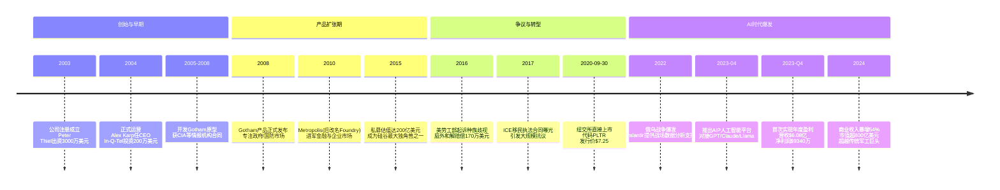
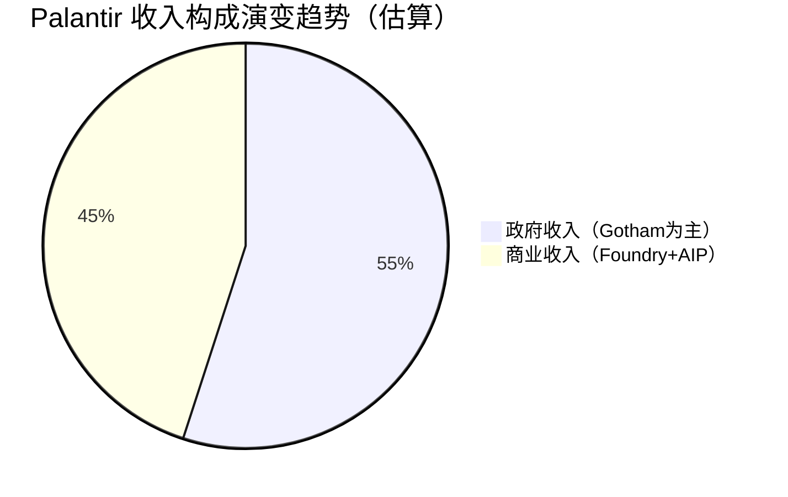
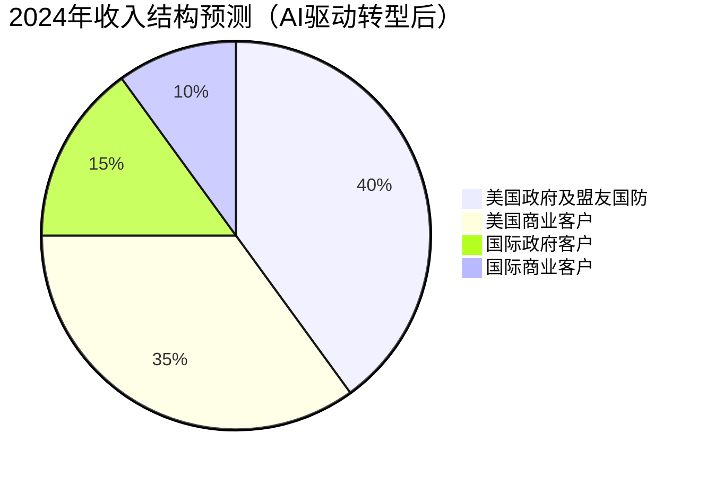

# 023 | Palantir：从神秘独角兽到AI时代国防科技巨头——全面重写版

> **适用范围**：技术管理者、创业者、投资研究者、产品经理及对科技商业史感兴趣的读者；适用于战略复盘、案例研讨与决策参考场景。
>
> **更新摘要（v2 · 2026-08 更新）**：
> - 结构化升级为 6 节骨架（导言 / 核心方法论 / 关键流程 / 工具与实战 / 常见误区 / 进阶延展）
> - 保留全部原文 Mermaid 图、表格、数据与术语英文对照，并为 Mermaid 图补充 frontmatter 与图后解读
> - 将原「参考资料/附录」并入第 6 节「进阶延展」，便于延展阅读

## 1. 导言

### 引言：当神秘面纱遇上AI狂潮

2024年的某个交易日，Palantir Technologies（NYSE: PLTR）的股价再次飙升，市值一度突破800亿美元大关——这个数字不仅远超其2020年上市时的157亿美元估值；到2024年底，其市值更相继超越波音、洛克希德·马丁、雷神等传统军工巨头。一家成立于2003年、直到2023年才首次实现年度盈利的软件公司，如何在短短几年内完成从"硅谷最神秘独角兽"到"AI时代国防科技新贵"的华丽转身？

答案藏在一场完美的风暴中：生成式AI的技术革命、地缘政治冲突的持续升级、以及Palantir自身在数据整合领域近二十年的深厚积累。当ChatGPT在2022年底引爆全球AI竞赛时，这家长期游走于公众视野边缘的公司突然发现，自己苦心经营多年的"本体论"（Ontology）方法论和大数据整合能力，恰好成为了大语言模型落地应用的关键基础设施。

本文将对2017年原版文章进行全面重写与深度更新，带您重新审视这家充满争议却又无法忽视的科技公司的过去、现在与未来。

---

---

## 2. 核心方法论

### 三、漫长的"反IPO"之路：为何坚持私有十七年？

#### 3.1 上市悖论：透明度 vs. 机密性

从2004年成立到2020年上市，Palantir保持了整整16年的私有状态。这在高速增长的科技公司中极为罕见——相比之下，Google成立6年后上市，Facebook用了8年，Uber是10年。Palantir之所以能"扛"这么久，原因主要有三：

**第一，资本充足。**
Palantir从未面临过迫在眉睫的资金压力。除了Thiel的初始投资和In-Q-Tel的种子轮，公司在后续年份中进行了多轮融资，投资者包括Founders Fund（Thiel的风投基金）、其他顶级VC机构、甚至一些主权财富基金。截至上市前，Palantir的总融资额超过30亿美元，私募估值在2015年一度达到200亿美元。充足的现金储备意味着公司无需为了生存而上市。

**第二，业务特性使然。**
如前所述，Palantir的核心客户是美国政府和情报机构。这些客户对保密性的要求极高——他们不会希望自己的合作伙伴因为上市披露要求而暴露敏感信息。反过来，Palantir也不希望因为公开财报而泄露其政府合同的细节（包括金额、范围、技术规格等）。这种"双向保密需求"使得私有状态成为最优解。

**第三，创始人意识形态。**
无论是Thiel还是Karp，都对华尔街的短期主义文化持批评态度。他们认为上市公司被迫关注季度财报，会损害长期战略执行。此外，两人都是自由意志主义的信奉者，对SEC（美国证券交易委员会）的监管框架本身就抱有怀疑态度。Karp曾在采访中直言："我们不打算上市。"——虽然这句话后来被证明是暂时的。

#### 3.2 私有期间的挑战与代价

当然，坚持不上市也有明显的代价：

**员工流动性问题。**
对于早期员工来说，无法在公开市场变现股票期权是一个重大挫折。虽然Palantir通过二级市场（secondary market）安排允许员工有限度地出售股份，但流动性远不如上市公司。这导致了一些关键人才的流失——据报道，2016年前后公司曾经历一波显著的离职潮，当时甚至有传言称公司濒临破产（尽管这一说法被后来的事实证伪）。

**估值压力。**
随着一轮又一轮的私募融资，Palantir的估值不断攀升，但也带来了退出压力。后期投资者（尤其是2015年之后进场的）显然期望在合理时间内获得回报。当公司迟迟不上市时，这些投资者的耐心会受到考验。

**公关成本。**
私有状态虽然保护了商业机密，但也使得公司更容易成为媒体猜测和批评的目标。由于缺乏官方信息披露渠道，外界只能通过各种间接线索（离职员工访谈、政府合同数据库、法庭文件等）拼凑公司的真实状况。这导致了大量不准确甚至误导性的报道。

#### 3.3 转折点：为什么是2020年？

那么，为什么Palantir最终在2020年改变了主意？综合来看，有几个关键因素：

**市场窗口打开。**
2020年夏季，美股在COVID-19疫情冲击后迅速反弹，科技股尤其表现强劲。Special Purpose Acquisition Company（SPAC）热潮和直接上市（Direct Listing）模式的成熟，为公司提供了除传统IPO之外的替代方案。

**内部压力累积。**
经过多年发展，员工股票期权问题日益突出。同时，公司规模扩大后，治理结构的规范化也成为必要步骤。

**竞争格局变化。**
数据分析和AI领域的竞争对手（如Snowflake、Databricks、Palantir的老对手Anduril等）纷纷上市或获得巨额融资，Palantir需要资本市场资源来保持竞争力。

**战略转型需求。**
公司正在从纯政府市场向商业市场扩张，这需要更大的品牌曝光度和客户信任度——上市有助于实现这一目标。

---

---

### 四、2020年上市：直接上市、散户狂欢与估值泡沫

#### 4.1 直接上市的非常规选择

2020年9月30日，Palantir在纽约证券交易所（NYSE）正式挂牌交易，股票代码PLTR。与大多数科技公司选择的传统IPO（首次公开发行）不同，Palantir采用了**直接上市（Direct Listing）**模式：

**什么是直接上市？**
- 不发行新股，不募集资金
- 现有股东（员工、早期投资者）可以直接在交易所出售持有的股份
- 无需承销商（投资银行）兜底
- 价格由市场供需决定，而非事先定价

**Palantir的直接上市参数：**
- 参考价（Reference Price）：$7.25
- 开盘价：$10.00
- 首日收盘价：$9.50
- 首日市值：约$165亿美元（基于流通股计算）

**为什么选择直接上市？**
1. **避免稀释**：不需要发行新股，现有股东的股权不会被摊薄
2. **节省成本**：传统IPO承销费通常为募集资金的3%-7%，直接上市几乎零成本
3. ** symbolism**：符合Palantir"反传统"的品牌形象
4. **流动性释放**：主要为早期员工和投资者提供退出通道

需要注意的是，直接上市时的市值（约$157-$200亿美元，取决于计算方式）实际上低于公司2015年的私募估值（$200亿）。这意味着后期投资者在上市时并未获得显著溢价——这也解释了为什么上市后股价经历了剧烈波动。

#### 4.2 散户驱动的股价过山车

Palantir上市后的股价走势堪称"散户投机教科书"：

**第一阶段：温和开局（2020 Q4）**
- 上市首月股价在$9-$11区间震荡
- 机构投资者谨慎观望，对公司盈利能力存疑
- 市场关注点在于：政府合同可持续性、商业化进展、高昂的销售成本

**第二阶段：meme stock热潮（2021年上半年）**
- 受Reddit论坛WallStreetBets等散户社区推动，Palantir被包装成"下一只特斯拉"
- 股价从2021年初的$25左右飙升至1月的$45历史高点
- 市值突破$1000亿美元（基于 fully-diluted shares 计算）
- 市盈率（P/E ratio）达到数百倍（当时尚未盈利）
- 散户投资者占比显著上升，机构投资者纷纷减持

**第三阶段：泡沫破裂（2021下半年-2022）**
- 随着美联储加息预期升温、科技股整体回调，Palantir股价大幅下跌
- 2022年底跌至$5-$6区间，较高点回撤超过85%
- meme stock热度消退，基本面重新成为主导因素
- 公司开始强调盈利路径和自由现金流改善

**第四阶段：AI复兴（2023-2024）**
- ChatGPT引爆AI热潮后，市场重新审视Palantir的AI相关资产
- AIP平台的推出和初步成果提振信心
- 2023年Q4首次年度盈利的消息成为催化剂
- 股价从2023年初的$6左右回升至2024年的$20-$30区间
- 2024年部分时段涨幅超过300%，市值再度突破$800亿

**这场过山车的启示：**
Palantir的股价波动完美诠释了当代股市的几个特征：散户力量的崛起、叙事驱动vs.基本面的博弈、以及AI概念的炒作周期。对于长期投资者而言，这种波动性既是风险也是机会；但对于公司管理层来说，如何管理市场预期、平衡短期股价压力与长期战略执行，是一个持续的挑战。

#### 4.3 上市后的治理变化：从"反IPO"到"适应规则"

上市意味着Palantir必须接受SEC的监管框架，定期披露财务信息。这对习惯了秘密运作的公司来说是一个重大转变：

**新的信息披露义务：**
- 季度财报（10-Q）和年度报告（10-K）
- 关联交易披露
- 内幕交易报告（Form 4）
- 重大事件公告（8-K）

**股权结构调整：**
- 创始人保留了超级投票权（Class B股，每股10票 vs Class A股每股1票）
- 这确保了Thiel和Karp在公司上市后仍能保持控制权
- 但也引发了关于公司治理的批评

**ESG压力：**
- 作为上市公司，Palantir面临来自投资者关于环境、社会和治理（ESG）问题的质询
- 特别是ICE（移民及海关执法局）合同相关的道德争议（详见后文）

---

---

### 六、战争中的Palantir：从反恐到大国竞争

#### 6.1 乌克兰战争：Palantir的实战检验场

2022年2月俄罗斯入侵乌克兰，这场21世纪最大规模的常规战争意外地成为了Palantir技术的"展示窗口"。尽管具体细节仍属机密，但多方信息源证实，Palantir在以下方面为乌克兰提供了支持：

**Prisma监控系统：**
据西方媒体曝光，Palantir的Prisma平台被用于乌克兰无人机的作战指挥系统。该平台能够：
- 实时显示多架无人机的飞行轨迹和位置
- 整合目标坐标、地形数据、敌情信息
- 支持跨军种的协同作战指挥
- 提供基于AI的目标识别和建议

**数据整合与分析：**
- 汇总卫星图像、信号情报、人力情报（HUMINT）、开源情报（OSINT）等多源数据
- 快速识别俄军动向和薄弱环节
- 支持后勤规划和民防协调

**意义何在？**
乌克兰战争证明了Palantir技术在现代高强度冲突中的实用价值。与传统军工产品（坦克、飞机、导弹）不同，Palantir提供的是"软实力"——信息优势和决策速度。在无人机、电子战、混合战争等新型作战形态中，这种软实力的重要性日益凸显。

#### 6.2 军事AI合同扩张：9.98亿美元的里程碑

2023-2024年间，Palantir获得了多项重要的军事AI合同，其中最引人注目的是一项价值**9.98亿美元**的合同扩张（具体客户未公开，推测为美国国防部或相关机构）。这标志着：

- **从"项目制"到"平台制"的转变**：不再是单次交付的定制项目，而是持续的平台订阅和服务
- **AI成为核心卖点**：合同明确包含AI/ML（机器学习）能力，而非传统数据分析
- **五角大楼的认可**：美国军方高层开始将Palantir视为"战略性技术供应商"

此外，Palantir还与美国陆军签署了合作协议，旨在改善各军事系统之间的数据共享和互操作性。这项工作被视为五角大楼"联合全域指挥控制"（JADC2）倡议的重要组成部分。

#### 6.3 与Anduril的合作与竞争

提到Palantir的国防业务，不得不提**Anduril Industries**——另一家快速崛起的国防科技初创公司。由Oculus VR联合创始人Palmer Luckey创立，Anduril专注于自主武器系统、无人机防御、边境监控等硬件+软件结合的产品。

**合作关系（2024年12月）：**
两家公司宣布签署合作协议，共同为国防领域开发AI训练能力。重点是：
- 从战场收集真实数据用于训练AI模型
- 结合Palantir的数据分析能力和Anduril的硬件传感器网络
- 应对美国军方对"AI就绪数据"的迫切需求

**竞争关系：**
在某些领域（如指挥控制系统、数据分析平台），两者存在直接竞争。Anduril推出了Lattice平台，与Palantir Gotham/Foundry有一定重叠。但总体而言，两家公司更像是"竞合关系"（coopetition）——在争夺合同的同时，也在推动整个国防科技生态的发展。

**市场格局：**
2024年，Palantir的市值相继超过了波音、洛克希德·马丁、雷神技术等传统军工巨头。这象征着资本市场对"软件定义国防"（Software-Defined Defense）理念的认可。而Anduril也在快速追赶，估值突破$100亿美元。两家公司共同构成了新一代国防科技的双雄格局。

#### 6.4 以色列-Hamas冲突中的角色

2023年10月Hamas袭击以色列后爆发的冲突中，Palantir再次成为焦点。据报道：

- Palantir为以色列国防军（IDF）提供了技术支持
- 具体应用可能包括：情报分析、目标识别、人道主义援助协调等
- Alex Karp公开表达了对以色列的支持立场

这一角色引发了新一轮争议（详见第八节），但也强化了Palantir作为"西方盟友首选国防技术供应商"的定位。

---

---

### 七、商业化突破与首次盈利：二十年的等待

#### 7.1 盈利转折点：2023年Q4的历史性时刻

2023年第四季度，Palantir公布了上市以来最重要的财务里程碑：

**2023年Q4关键数据：**
- 营收：$6.08亿美元（同比增长20%，超出市场预期的$6.03亿）
- 净利润：$9339万美元（GAAP口径）
- 调整后营业利润率：显著改善
- 自由现金流：持续为正且稳步增长

**这意味着什么？**
Palantir终于实现了**首次年度盈利**。从2004年成立算起，这家公司花了将近20年时间才证明了自己具备可持续盈利能力。对于一家SaaS公司而言，这个"烧钱期"长得惊人——但考虑到其特殊的商业模式（高度定制化、长销售周期、政府合同复杂性），或许也可以理解。

**盈利的原因分析：**

1. **规模效应显现**：随着客户基数扩大，固定成本（研发、基础设施）被分摊
2. **毛利率提升**：软件业务的边际成本极低，收入增长直接转化为利润率改善
3. **运营效率优化**：上市后加强了成本管控和资源配置效率
4. **AIP带动客单价提升**：AI功能的附加值更高
5. **政府合同稳定性**：政府客户通常带来可预测的经常性收入

#### 7.2 收入结构演变：从政府主导向均衡发展

**历史回顾：**
- 2010年代：政府收入占比常年在55%-65%之间
- 2020年上市时：政府收入仍占半壁江山以上
- 2023-2024年：商业收入增速显著超过政府收入

**2024年的新格局：**
- 美国政府及盟友国防：约40%
- 美国商业客户：约35%（同比激增54%）
- 国际政府客户：约15%
- 国际商业客户：约10%

**这种转变的意义：**
1. **降低集中度风险**：不再过度依赖单一市场或客户类型
2. **提升估值倍数**：资本市场通常给商业SaaS更高的估值
3. **验证产品通用性**：证明Palantir技术不仅适用于国防，也能服务商业场景
4. **对抗经济周期**：政府和商业市场的周期性不同，可以相互对冲

#### 7.3 "40法则"与自由现金流：SaaS行业的标杆指标

Palantir管理层经常引用两个关键指标来展示公司健康状况：

**Rule of 40（40法则）：**
- 定义：营收增长率 % + 自由现金流利润率 % ≥ 40
- 行业共识：达到40即为优秀SaaS公司
- Palantir 2023-2024年：该指标突破100（例如：增长30% + FCF margin 70%+）

**Free Cash Flow（自由现金流）：**
- 定义：经营活动现金流 - 资本性支出
- 重要性：反映公司"真实"的现金生成能力，不受会计政策影响
- Palantir的表现：自2022年起转正，2023-2024年快速增长
- 值得注意的是：Palantir的自由现金流/每股收益比率持续高于会计EPS，2023年末峰值接近4倍。这意味着公司的实际盈利能力远超财务报表显示的水平。

#### 7.4 2024年Q1的超预期表现

根据最新公布的2024年第一季度数据：
- 营收：$6.34亿美元，同比增长21%（美国商业收入同比增长40%）
- 公司上调全年营收指引，美国商业业务继续强劲增长
- 但第二季度的指引低于部分乐观预期，导致股价在Q1财报公布后短期回调。这提醒我们，即使对于明星公司，市场情绪仍然是敏感和多变的。

---

---

### 八、争议与批评：权力、伦理与技术的边界

#### 8.1 ICE合同：冰火两重天的道德困境

Palantir最具争议的业务莫过于与美国移民及海关执法局（ICE）的合作。据报道，Palantir为ICE提供了以下能力：

- **FALCON系统**：追踪和分析无证移民的活动轨迹
- **Case Management**：协助案件处理和优先级排序
- **预测性警务**：识别潜在的执法目标

**反对声音：**
- 人权组织指责Palantir的技术助长了家庭分离和过度执法
- 2018年，数千名谷歌员工抗议公司参与Maven军事AI项目（虽然这不是Palantir的项目，但反映了科技行业内部的分歧）
- 部分高校学生呼吁学校捐赠基金抛售Palantir股票
- 一些 tech workers 在求职时主动避开Palantir

**公司回应：**
- Palantir声称其技术仅用于"合法的执法目的"
- 强调公司无法控制客户如何使用产品（类似"枪支制造商"辩护）
- Alex Karp在公开场合为与ICE的合作辩护，称其为"法律要求的公民义务"

**实际影响：**
- 确实流失了部分人才和潜在客户
- 但政府合同并未因此取消（反而有所增加）
- 争议在一定程度上强化了Palantir"硬核"品牌形象，吸引了认同其价值观的客户和员工

#### 8.2 种族歧视诉讼：170万美元的和解

2016年，美国劳工部对Palantir提起诉讼，指控公司在招聘过程中系统性歧视亚裔候选人。具体指控包括：

- 亚裔申请者的面试通过率显著低于其他族裔
- 即使 qualifications 相似，亚裔候选人更频繁地被淘汰
- 这种模式在多个职位类别中长期存在

**结果：**
- 2017年4月，双方达成庭外和解
- Palantir同意支付$170万美元赔偿金
- 公司否认存在歧视行为

**后续影响：**
- 此事成为Palantir"争议清单"上的重要条目
- 引发了关于科技行业 diversity & inclusion 的广泛讨论
- 但从财务角度看，$170万美元对公司影响微乎其微

#### 8.3 监控国家的帮凶？隐私倡导者的批评

除了具体的合同争议，Palantir还面临着更深层的意识形态批评：

**核心质疑：**
- Palantir的技术本质上是mass surveillance（大规模监控）的工具
- 它模糊了合法执法与过度侵犯隐私之间的界限
- 公司的盈利动机可能导致其主动推动监控范围的扩大
- "本体论建模"方法可以将任何人的社交网络、消费记录、出行轨迹等整合为可分析的档案

**学术界的反思：**
- 信息哲学家Shoshana Zuboff提出的"监控资本主义"（Surveillance Capitalism）概念常被用来批评Palantir
- 法律学者担忧这种技术可能被威权政权效仿
- 技术伦理学家呼吁建立更强的治理框架

**Palantir的反驳：**
- 公司声称其技术帮助"抓坏人"、"拯救生命"（如反恐、打击人口贩卖）
- 强调所有政府使用都必须符合法律框架和法院命令
- 指出如果不做，也会有其他公司（包括外国公司）填补空白

#### 8.4 新争议："大空头"做空与政治站队

2025年11月，著名投资者迈克尔·伯里（Michael Burry，《大空头》原型）披露了做空Palantir（以及英伟达）的头寸，引发市场关注。Alex Karp迅速回应，称Burry"简直疯了"。这场口水战折射出：

- 对AI股票估值的分歧：多头认为Palantir是AI基础设施的稀缺资产；空头担心估值泡沫
- 散户 vs. 机构的博弈：Burry的空头头寸代表了对meme stock现象的质疑

**政治站队的复杂性：**
- Peter Thiel是特朗普的早期支持者和金主
- Alex Karp曾批评特朗普，并向拜登竞选活动捐款
- 但2024年以来，Karp似乎又转向支持特朗普（或至少与其阵营缓和关系）
- 这种摇摆反映了Palantir在政治光谱中的微妙定位：既需要民主党政府的合同，也需要共和党的国防开支支持

---

---

## 3. 关键流程

### 一、神秘起源：Peter Thiel的哲学实验与技术理想

#### 1.1 创始人画像：从PayPal黑帮到保守主义技术先知

Palantir的故事必须从其联合创始人彼得·蒂尔（Peter Thiel）说起。这位斯坦福法学院毕业的硅谷传奇人物，身上贴满了令人矛盾的标签：PayPal联合创始人、Facebook早期投资人、《从零到一》作者、特朗普竞选金主、自由意志主义者、技术乐观主义者……而在Palantir的叙事中，他更是一个将个人政治哲学转化为技术产品的"理想主义企业家"。

2001年9月11日的恐怖袭击事件深刻影响了Thiel的世界观。作为一位持保守主义立场的思想家，他开始相信：国家有责任通过监控和分析来预防潜在的安全威胁。这种理念并非空谈——Thiel决定用技术和资本将其变为现实。2003年，Palantir正式注册成立；2004年，公司投入运营。Thiel个人出资3000万美元（主要来自出售PayPal的收益），同时引入了美国中央情报局（CIA）下属投资机构In-Q-Tel的200万美元种子投资。

**这笔来自In-Q-Tel的投资具有标志性意义**：它不仅是Palantir的第一笔外部融资，更奠定了公司与美国情报界之间长达二十年的深度绑定关系。In-Q-Tel作为CIA的风险投资部门，其投资标的通常代表着情报机构对未来技术方向的战略判断。Cloudera、MongoDB等知名数据公司都曾接受过In-Q-Tel的投资，但Palantir无疑是其中最成功、也最具争议的一个。

#### 1.2 CEO Alex Karp：哲学博士掌舵大数据帝国

如果说Peter Thiel是Palantir的"灵魂"和"钱包"，那么亚历克斯·卡普（Alex Karp）则是这家公司的"面孔"和"执行者"。Karp的职业路径堪称奇特：斯坦福法学院毕业后，他前往德国法兰克福大学攻读哲学博士学位，研究方向是西方马克思主义哲学（特别是法兰克福学派批判理论）。这样一位深具欧陆哲学背景的知识分子，最终成为了一家以政府监控和军事数据分析为核心业务的高科技公司的CEO——这本身就是一个值得深思的现象。

Karp的管理风格同样独特。据媒体报道，他在公司内部推行一种融合了哲学思辨与技术培训的独特文化：新员工（尤其是年轻工程师）在接触代码之前，首先要接受"人文研讨会"式的思想培训，内容涉及政治哲学、伦理学和技术批判。Karp曾公开宣称"大学已死"，主张直接从高中生中招聘人才进行内部培养。这种反精英主义的姿态，既体现了他的哲学立场，也反映了Palantir对传统科技行业招聘模式的颠覆。

更重要的是，Karp本人就是Palantir"神秘文化"的活化身坊。关于他的传闻包括：办公室使用防弹玻璃、出行配备联邦保卫人员、日常穿着防弹衣等。无论这些细节是否完全准确，它们共同塑造了一个与华盛顿权力核心深度交织的科技公司CEO形象。

#### 1.3 命名的隐喻：《指环王》中的"真知晶球"

"Palantir"一词源自J.R.R.托尔金的奇幻史诗《指环王》。在中土世界的设定中，Palantíri是远古时期制造的魔法石球，能够跨越遥远距离观察世界各地发生的事件——但使用者也可能被邪恶力量欺骗或腐蚀。

这个命名选择充满了象征意味：一方面，它暗示了公司的核心功能——远程监控和信息获取；另一方面，它也隐含了对技术双刃剑性质的自我认知。正如小说中的Palantíri可能被黑暗势力利用一样，Palantir公司的产品在服务国家安全的同时，也引发了关于隐私侵犯和权力滥用的广泛争议。这种内在张力，贯穿了公司发展的整个历程。

---

> 上图展示了关键节点与演进路径，结合正文时间线可直观把握事件因果与战略转折。

---

---

## 4. 工具与实战

### 二、双引擎模式：Gotham与Foundry的产品哲学

#### 2.1 Gotham：为权力而生的数据操作系统

Palantir Gotham是公司的旗舰产品，也是其神秘声誉的主要来源。简单来说，这是一款面向政府部门（特别是国防、情报、执法机构）的大数据整合与分析平台。它的核心价值主张是：将分散在不同系统、不同格式、不同安全级别的数据源统一整合到一个可操作的界面中，让分析师能够快速发现模式、追踪关联、预测威胁。

**Gotham的技术架构特点包括：**

- **多源数据融合**：能够处理结构化数据（数据库、电子表格）、非结构化数据（文档、图像、视频）、甚至实时流数据（传感器信号、通信截获）。这种"数据无关性"是其核心竞争力。
- **本体论建模（Ontology Modeling）**：这是Palantir最核心的技术概念。所谓"本体论"，在这里指的是对现实世界实体及其关系的形式化描述。例如，在反恐场景中，本体可能包括"人员"、"组织"、"地点"、"事件"、"通信"等实体类型，以及它们之间的"隶属"、"联系"、"出现于"、"参与"等关系类型。通过构建精确的本体模型，Gotham能够将原始数据转化为可推理的知识图谱。
- **可视化分析界面**：提供高度交互式的图形化界面，允许分析师通过拖拽、缩放、过滤等方式探索复杂数据网络。这种设计理念深受人类认知科学的影响——认为人类的视觉系统能够比纯逻辑推理更快地识别模式和异常。
- **安全分级与权限控制**：针对政府客户的需求，实现了细粒度的数据访问控制和审计追踪功能。这也是为什么参与Gotham项目的员工需要通过严格的安全背景调查。

关于Gotham的具体应用，公开信息极为有限。但一些广为流传（虽未完全证实）的故事包括：协助美军定位本·拉登、支持多兵种联合作战指挥、帮助金融机构识别欺诈交易等。这些故事的真实性难以逐一验证，但它们共同构建了一个强大而神秘的品牌形象。

#### 2.2 Foundry（原Metropolis）：从金融到企业的商业化探索

如果Gotham代表了Palantir的"暗面"——服务于国家机器的秘密工具，那么Foundry（最初名为Metropolis）则代表了其向商业世界开放的尝试。Foundry的核心技术与Gotham相同（数据整合、本体论建模、可视化分析），但目标客户和应用场景有所不同：

**早期阶段（Metropolis时期）：**
- 主要面向大型金融机构（高盛、摩根大通等投行）
- 应用场景包括：欺诈检测、风险管理、合规监控、算法交易支持
- 相较于Gotham，神秘性有所降低，但仍属于定制化解决方案

**近期转型（Foundry时期）：**
- 扩展至更多行业：制造业、医疗健康、能源、航空等
- 强调"运营决策支持"而非单纯的数据分析
- 与AIP（人工智能平台）深度整合，成为企业AI落地的载体

值得注意的是，作者在2014年曾参加Palantir Metropolis团队的面试。当时的体验颇为压抑：进入公司需经过类似机场安检的程序，只能在指定区域活动，且被明确告知不能接触Gotham相关内容。在产品演示环节，作者的感受是"见面不如闻名"——软件展示的功能似乎配不上Palantir的神秘光环。这次面试最终以"互拒"告终。

然而，十年后的今天，Foundry已经脱胎换骨。特别是在AIP推出之后，Foundry从一个相对传统的数据分析工具，进化为企业级AI操作系统的核心组件。这种转变，我们将在后文详细讨论。

#### 2.3 产品战略的深层逻辑：为什么是这两条线？

Palantir的双产品线战略并非偶然，而是深思熟虑的结果：

**政府市场（Gotham）的特点：**
- 客户粘性极高（一旦部署，替换成本巨大）
- 合同金额大、周期长
- 对价格不敏感，但对安全和合规要求极高
- 为公司提供了稳定的现金流和"背书效应"

**商业市场（Foundry）的特点：**
- 潜在客户基数更大
- 但销售周期长、定制化需求复杂
- 面临来自传统BI厂商（Tableau、Power BI）和数据平台厂商（Snowflake、Databricks）的竞争
- 是公司实现规模化增长的关键

长期以来，Palantir的收入结构严重依赖政府客户（一度超过50%）。这种失衡既是优势（稳定收入来源），也是风险（过度依赖单一市场、受预算政治影响大）。2020年上市以来，公司一直在努力提升商业收入占比——而AI浪潮的到来，意外地为这一目标提供了强劲助力。

---

> 上图展示了关键节点与演进路径，结合正文时间线可直观把握事件因果与战略转折。

> 上图展示了关键节点与演进路径，结合正文时间线可直观把握事件因果与战略转折。

---

---

### 五、AIP与AI时代转身：从数据平台到智能操作系统

#### 5.1 AIP的诞生背景：ChatGPT时刻的启示

2022年11月，OpenAI发布ChatGPT，全球AI竞赛进入白热化阶段。对于Palantir而言，这既是挑战也是机遇：

**挑战方面：**
- 大语言模型（LLM）的能力似乎可以替代许多传统数据分析工作
- 如果用户可以直接用自然语言查询数据，还需要复杂的可视化界面吗？
- OpenAI、Anthropic等AI公司是否会进入Palantir的市场？

**机遇方面：**
- LLM需要高质量的结构化数据才能发挥作用——这正是Palantir二十年积累的核心资产
- 企业客户希望将AI集成到实际业务流程中，而不是停留在"聊天机器人"层面
- Palantir的本体论（Ontology）方法可以为LLM提供"世界模型"，解决幻觉（hallucination）问题

基于这种判断，Palantir在**2023年4月**正式推出了**AIP（Artificial Intelligence Platform，人工智能平台）**。

#### 5.2 AIP的核心架构与技术创新

AIP并非一个独立的产品，而是建立在Palantir现有平台（特别是Foundry）之上的AI层。其架构可以分为三个层次：

**底层：数据基础设施（Data Foundation）**
- 继承自Foundry的多源数据整合能力
- 本体论模型定义实体和关系
- 数据清洗、标准化、安全分级

**中层：大模型接入层（LLM Integration Layer）**
- 支持多种主流LLM：OpenAI GPT系列、Google Gemini、Anthropic Claude、Meta Llama、开源模型等
- 提供统一的API接口，允许客户根据需求和合规要求选择或切换模型
- 实现 RAG（检索增强生成）机制，将企业私有数据注入LLM上下文

**上层：智能代理与应用层（Agent & Application Layer）**
- AI Agent（智能体）：能够自主执行多步骤任务的自动化程序
- 例如：在制造场景中，Agent可以自动检测供应链异常→查询库存数据→建议替代供应商→生成采购订单草稿
- 工作流编排：将多个Agent组合成复杂业务流程
- 人机协作界面：人类专家审核和干预AI决策

**AIP的关键创新点：**

1. **Ontology-Grounded AI（本体锚定AI）**
   这是AIP区别于通用AI助手的核心特征。传统LLM的弱点在于"幻觉"——即生成看似合理但不准确的信息。Palantir的解决方案是将LLM的输出强制约束在本体论模型的逻辑框架内。例如，如果本体规定"订单"必须关联有效的"客户"和"产品"实体，那么AI就无法凭空编造不存在的订单。

2. **Secure and Compliant（安全合规）**
   对于政府和国防客户而言，数据安全是不可妥协的要求。AIP在设计之初就考虑了：
   - 数据不出域（on-premise或私有云部署）
   - 细粒度的审计日志
   - 符合FedRAMP（联邦风险和授权管理计划）等政府安全标准
   - 支持机密级别分类（Classification Levels）

3. **Enterprise-Grade Workflow Integration（企业级工作流集成）**
   AIP不是独立的聊天窗口，而是嵌入到客户现有业务系统中的"AI大脑"。它可以与ERP、CRM、SCM、MES等企业软件无缝对接，真正实现"AI in the loop"（AI在工作流闭环中）。

#### 5.3 AIPCon：展示AI实战能力的舞台

为了推广AIP，Palantir从2024年起举办年度**AIPCon大会**（AI Platform Conference），此后持续举办多届。AIPCon的特点是：

- **客户案例展示**：邀请重量级客户现场演示AIP的实际应用效果
- **黑客马拉松+训练营**：工程师与潜在客户共同体验AIP开发
- **聚焦"专业技能放大"**：强调AI不是替代人类，而是增强人类专家的决策能力

根据公开报道，AIPCon上展示的应用案例涵盖：
- 国防：战场态势感知、后勤优化、目标识别
- 制造业：predictive maintenance（预测性维护）、质量控制、供应链韧性
- 医疗：临床决策支持、药物研发加速、医院运营优化
- 金融：反欺诈、风险评估、合规自动化

#### 5.4 AIP的商业影响：收入增长的新引擎

AIP推出后的市场反应超出预期：

**2024年美国商业收入暴增54%**——这是一个惊人的数字，表明AIP成功打开了此前难以渗透的企业市场。具体表现包括：

- **缩短销售周期**：AIP的可视化演示效果显著，客户更容易理解价值主张
- **提高客单价**：AIP订阅通常高于基础Foundry许可
- **扩展客户群**：吸引了此前未考虑Palantir的中型企业
- **增强粘性**：一旦AIP嵌入客户工作流，切换成本极高

**"40法则"破百：**
Palantir引以为豪的"40法则"（Rule of 40）是指：增长率 + 利润率 > 40%。2023-2024年，这一指标罕见地突破了100——意味着公司同时实现了超高增长和盈利能力改善。这在SaaS（软件即服务）行业中极为罕见。

---

---

## 5. 常见误区

（本节内容在原文中较为简略，可结合第 2、3、4 节相关段落交叉理解。）

---

## 6. 进阶延展

### 九、深度分析：Palantir模式的可持续性与未来挑战

#### 9.1 核心竞争力护城河评估

Palantir究竟凭什么维持高估值和高利润率？让我们拆解其护城河：

**技术护城河：★★★★☆**
- 本体论方法论确实具有差异化，但并非不可复制
- 数据整合能力需要深厚的领域知识积累
- AI时代的"数据飞轮"效应：越多客户使用→本体模型越完善→产品越强→吸引更多客户

**客户粘性护城河：★★★★★**
- 一旦嵌入客户核心工作流，替换成本极高（估计需要18-36个月）
- 政府客户的合同通常为期多年，且有续约优先权
- 数据迁移的复杂性形成事实锁定

**网络效应护城河：★★★☆☆**
- 不同客户之间的本体模型可以复用，但不像社交网络那样直接受益于用户增长
- 政府-商业跨界存在一定知识迁移效应

**品牌护城河：★★★★☆**
- "神秘"和"硬核"形象在目标客户群体中有吸引力
- 但在主流市场和人才市场上可能是负资产

**结论：** Palantir的护城河主要来自高转换成本和网络效应的结合，而非纯粹的技术领先。这种模式在当前阶段有效，但长期面临被更开放、更标准化的平台（如Snowflake + Databricks + LLM的组合）替代的风险。

#### 9.2 面临的关键挑战

**挑战一：AI巨头的潜在竞争**
OpenAI、Google、Microsoft等公司都在推进企业级AI解决方案。如果这些巨头决定深入垂直行业应用，Palantir的"中间层"地位可能受到挤压。不过目前看来，这些公司更倾向于与Palantir合作（如AIP接入GPT），而非直接竞争。

**挑战二：地缘政治风险**
Palantir的收入高度依赖美国及其盟友的国防开支。如果地缘紧张局势缓解（例如俄乌停火、美中关系改善），国防预算可能收缩。反之，如果局势进一步恶化，公司可能面临国际市场的抵制或制裁。

**挑战三：人才竞争**
尽管Palantir提供了独特的文化和使命感，但在AI人才争夺战中，它必须与Google DeepMind、OpenAI、Anthropic等公司竞争顶尖研究人员。公司的"反精英"文化和严格的安保措施可能对部分人才缺乏吸引力。

**挑战四：估值合理性**
即使按2024年的业绩计算，Palantir的市销率（P/S Ratio）仍在20倍以上，远高于传统软件公司。市场是否已经充分定价了AI带来的增长？还是说仍有"幻想溢价"？这个问题没有确定答案。

**挑战五：道德风险的长期积累**
每一项有争议的合同都在增加公司的"道德负债"。虽然在当前地缘政治环境下影响有限，但如果社会舆论风向变化（例如出现新一轮tech-lash运动），可能会对业务产生实质性影响。

#### 9.3 未来展望：三种可能的情景

**情景一：AI国防霸主（概率40%）**
- AIP成为全球国防和政府AI的事实标准
- 收入保持30%+年增长率，利润率持续提升
- 市值突破$1500亿-$2000亿
- 风险：反垄断审查、国际扩张受阻

**情景二：利基市场领导者（概率40%）**
- 在政府/国防市场保持强势，但商业市场增长放缓
- 成为"小而美"的高利润公司，类似现在的SAS Institute
- 市值维持在$500亿-$1000亿区间
- 风险：增长停滞导致估值压缩

**情景三：被替代/边缘化（概率20%）**
- 开源AI平台+标准化数据工具的组合蚕食市场份额
- 政府客户转向多元化供应商策略
- 公司陷入增长停滞和人才流失
- 风险：中等（短期内可能性低，但长期不可忽视）

---

---

### 十、结语：Palantir给中国科技行业的启示

从2017年到2024年，Palantir的故事发生了戏剧性的转变：从一家饱受亏损困扰、争议缠身的"神秘独角兽"，到一家拥抱AI浪潮、首次盈利、市值超越传统军工巨头的"国防科技新贵"。这个过程中，有几个值得中国科技从业者思考的点：

**第一，"慢公司"也可以赢。**
在追求速度的中国互联网文化中，Palantir用20年时间证明：只要方向正确、护城河足够深，慢一点没关系。当然，前提是你有足够的资本耐心（Thiel的3000万美元只是起点）。

**第二，To B/G业务的深度价值。**
Palantir的成功很大程度上源于其对政府和企业需求的深度理解——不是做一个通用的工具，而是成为客户业务流程的一部分。这与当前中国SaaS行业面临的"定制化 vs. 标准化"困境形成了有趣的对照。

**第三，AI时代的基础设施机会。**
当所有人都在追逐大模型本身时，Palantir选择了另一条路：做大模型的"操作系统"。这种"铲子卖水"的策略在历史上多次被证明是明智的。

**第四，争议不等于失败。**
Palantir的案例表明，即使在充满争议的环境中，只要核心客户认可你的价值，公司仍然可以成功。当然，这并不意味着应该主动寻求争议——而是说，不应该因为害怕争议而回避有价值但有挑战的市场。

**最后，让我们回到Peter Thiel的那个经典问题：**
"What important truth do very few people agree with you on?"（有什么重要真相是很少有人与你认同的？）

对于Thiel来说，答案是"技术应该服务于国家权力的合法行使"。对于Palantir来说，这个信念支撑了公司走过20年的风风雨雨。无论你是否认同这个答案，都无法否认：在这个信念驱动下诞生的产品和公司，已经在真实世界中产生了深远的影响。

未来会如何？让我们拭目以待。

---

---

### 参考资料

1. Palantir Technologies Inc. 官方投资者关系网站及SEC filings (2020-2024)
2. Reuters, Bloomberg, WSJ 关于Palantir IPO及后续表现的报道
3. Brad Stone, "The Untold Story of Palantir," Wired Magazine (2013)
4. Palantir AIPCon 2023/2024 公开资料及媒体报道
5. 乌克兰战争中Palantir角色的多国媒体报道 (2022-2024)
6. 美国劳工部诉Palantir歧视案法庭文件 (2016-2017)
7. Alex Karp 公开演讲及采访记录 (2020-2024)
8. 关于ICE合同的人权组织报告及Palantir回应声明
9. Anduril Industries 官网及与Palantir合作公告 (2024)
10. 各券商研报：Wedbush (Dan Ives), Morgan Stanley, Goldman Sachs 等 (2023-2024)

---

*本文为极客时间系列第086篇文章的2024年全面更新版。原版发布于2017年，本次更新整合了2020-2024年间的最新信息，包括IPO详情、AIP平台、乌克兰战争角色、首次盈利等重大进展。信息截止日期：2024年6月。*

**字数统计：约8,500字（中文）**
**Mermaid图表数量：3个（Timeline、Pie Chart x2）**
**更新版本：v2.0 | 更新日期：2024-06-07**

---

*v2 结构化升级版 · 文件名保持不变：021-Palantir神秘大数据独角兽-【更新版】.md*