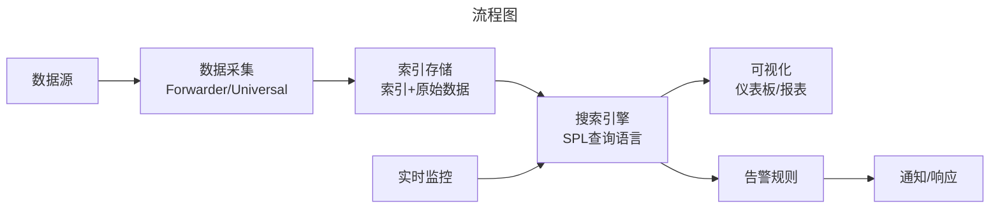
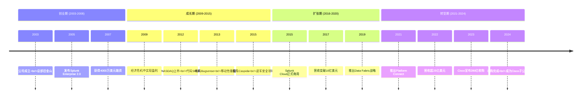
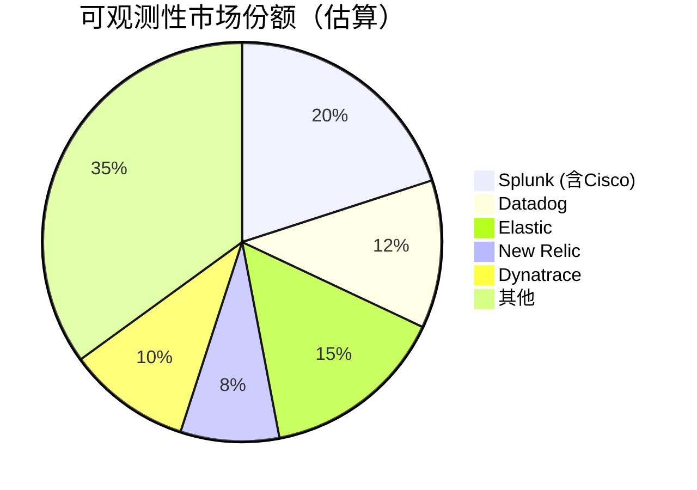

# Splunk：机器数据分析帝国的终章——从独立巨头到Cisco收购的深度解析

> **适用范围**：技术管理者、创业者、投资研究者、产品经理及对科技商业史感兴趣的读者；适用于战略复盘、案例研讨与决策参考场景。
>
> **更新摘要（v2 · 2026-08 更新）**：
> - 结构化升级为 6 节骨架（导言 / 核心方法论 / 关键流程 / 工具与实战 / 常见误区 / 进阶延展）
> - 保留全部原文 Mermaid 图、表格、数据与术语英文对照，并为 Mermaid 图补充 frontmatter 与图后解读
> - 将原「参考资料/附录」并入第 6 节「进阶延展」，便于延展阅读

## 1. 导言

### 引言：一个时代的落幕

2023年9月21日，科技圈被一则重磅消息刷屏——**网络设备巨头思科（Cisco）宣布以280亿美元（约2047亿人民币）的全现金价格收购Splunk**。这是思科成立40年来最大的一笔收购，也是2023年全球科技行业规模最大的并购案之一。

对于熟悉大数据和IT运维领域的人来说，这个消息既令人震惊又在情理之中。震惊的是，Splunk作为机器数据分析和可观测性领域的开创者和领导者，曾被视为可能独立成长为千亿美元市值的公司；情理之中是，面对Datadog等新一代云原生竞争对手的强势崛起，以及AI时代带来的技术范式转变，Splunk选择"卖身"或许是最理性的结局。

本文将深度剖析Splunk从2003年创立到2024年被收购的完整历程，解读其商业成功的关键因素、面临的战略困境、以及这笔世纪收购对整个可观测性市场的影响。

---

---

## 2. 核心方法论

### 第五章：Cisco收购的战略逻辑

#### 5.1 为什么是Cisco？为什么是现在？

**Cisco的战略动机**：

1. **从硬件向软件/服务转型**
   - 传统网络设备增长放缓
   - 需要高利润率的软件业务
   - Splunk年营收约40亿美元，软件业务利润率高

2. **补全网络安全版图**
   - Cisco已有防火墙、VPN、终端安全
   - 缺少SIEM和安全分析能力
   - Splunk ES是Gartner Magic Quadrant领导者

3. **构建"安全+网络"协同效应**
   - 网络流量数据 → Splunk分析 → 安全洞察
   - 安全事件 → 网络策略自动调整
   - 提供**端到端的可见性和控制力**

4. **对抗Microsoft/AWS的整合压力**
   - Microsoft Sentinel + Azure Monitor
   - AWS Security Lake + OpenSearch
   - Cisco需要一个强有力的安全分析平台

#### 5.2 收购细节与时间线

**交易概要**：

| 项目 | 详情 |
|------|------|
| **收购方** | Cisco Systems, Inc. |
| **被收购方** | Splunk Inc. |
| **交易价格** | **$28 billion (全现金)** |
| **每股价格** | $157 |
| **溢价幅度** | 较前日收盘价溢价31% |
| **宣布日期** | 2023年9月21日 |
| **完成日期** | 2024年3月18日（提前完成）|
| **监管审批** | 美国、欧盟、英国、澳大利亚等 |

**资金来源**：
- Cisco现金储备 + 新增债务融资
- 交易完成后Cisco负债率适度上升
- 但考虑到Splunk的自由现金流，预计3-4年内可覆盖

#### 5.3 整合计划与预期协同效应

**组织架构调整**：
- Splunk作为Cisco的全资子公司运营
- CEO Gary Steele向Cisco CEO Chuck Robbins汇报
- 保持品牌独立性（短期内）
- 共享销售渠道和技术资源

**产品路线图展望**：

```mermaid
---
title: 流程图
---
graph TB
    subgraph "Cisco现有产品"
        A[SecureX<br/>安全平台]
        B[SASE<br/>安全访问边缘]
        C[Talos<br/>威胁情报]
    end

    subgraph "Splunk产品"
        D[Enterprise Security<br/>SIEM]
        E[Observability Cloud<br/>可观测性]
        F[Security Cloud<br/>SOAR]
    end

    subgraph "整合后的新能力"
        G[Unified XDR<br/>扩展检测响应]
        H[Network Detection &<br/>Response (NDR)]
        I[AI-driven Security<br/>Operations]
    end

    A --> G
    D --> G
    C --> G
    B --> H
    E --> I
    F --> I

```

**预期的协同效应**：

1. **交叉销售机会**
   - Cisco的网络设备客户 → 推荐Splunk
   - Splunk的安全客户 → 推荐Cisco SecureX
   - 预计额外带来数十亿美元营收

2. **研发效率提升**
   - 共享底层技术（数据采集、可视化）
   - AI/ML能力的复用
   - 减少重复投入

3. **成本节约**
   - 后台职能整合（HR、法务、财务）
   - 办公空间和IT基础设施共享
   - 预计每年节省数亿美元

#### 5.4 市场反应与分析师观点

**股价表现**：
- **宣布当日**：Cisco股价下跌3-4%（担忧估值过高）
- **Splunk股价**：上涨20%+（接近收购价）
- **后续走势**：Cisco股价逐步回升，市场消化利好

**分析师评价（正方）**：
> *"这是Cisco历史上最具变革性的收购，将重塑安全市场格局"* —— Wedbush Securities

> *"Splunk的 recurring revenue和客户基础为Cisco提供了稳定的现金流"* —— Morgan Stanley

**分析师评价（反方/谨慎）**：
> *"280亿美元的估值过高，且整合风险不容忽视"* —— BT Financial Analysts

> *"Cisco的文化与Splunk的创业文化可能冲突，导致人才流失"* —— 行业观察家

---

---

### 第六章：对行业的深远影响

#### 6.1 可观测性市场的新格局

**收购后的市场动态**：

**1. 加速行业整合**
- 中型独立厂商可能成为收购目标（如New Relic、Dynatrace）
- 大厂（Microsoft、Google、AWS）可能加大投入
- 市场集中度进一步提高

**2. 产品边界模糊**
- 网络监控 ↔ 安全监控 ↔ IT运维监控
- "Observability"概念进一步泛化
- 客户期待统一的解决方案

**3. 定价模式可能变化**
- 按数据量收费 vs 按用户/host收费 vs 按价值收费
- AI驱动的智能定价（基于使用场景）
- 更灵活的消费模式（Serverless/按需付费）

#### 6.2 对竞争对手的影响

**对Datadog的影响**：
- **短期利好** - 部分客户担心Cisco整合不确定性而考虑替代
- **中长期压力** - Cisco+Splunk的组合竞争力更强
- **应对策略** - 加强AI能力，深化云原生优势

**对Elastic的影响**：
- **机会** - 强调开源优势，吸引不愿被厂商锁定的客户
- **挑战** - 需要加快商业化进程
- **应对策略** - 推进Elastic Cloud growth，强化企业功能

**对传统IT厂商的影响**：
- **IBM** - 可能寻求收购或加强自有QRadar产品线
- **HPE** - 通过Aruba网络切入可观测性市场
- **Dell** - VMware Tanzu + 安全产品的整合

#### 6.3 对客户的影响

**现有Splunk客户**：
- **担忧** - 产品路线图是否改变？价格是否上涨？服务质量是否下降？
- **期望** - 更强的安全集成、更好的网络可视性、更优惠的捆绑定价
- **建议** - 密切关注Cisco的整合沟通，评估合同条款

**潜在新客户**：
- **吸引力提升** - Cisco的品牌背书和全球服务体系
- **顾虑** - 是否会被锁定在Cisco生态？
- **决策因素** - TCO对比、功能匹配度、供应商风险评估

---

---

## 3. 关键流程

### 第一章：创业历程与技术突破

#### 1.1 创始团队与早期愿景

**三位创始人（2003年）**：

| 创始人 | 背景 | 角色 |
|--------|------|------|
| **Michael Baum** | 企业软件连续创业者 | CEO |
| **Rob Das** | 分布式系统专家 | CTO |
| **Erik Swan** | 数据库架构师 | VP Engineering |

**创业灵感来源**：

在2000年代初，企业IT基础设施产生海量日志数据（服务器日志、应用日志、网络设备日志），但缺乏有效的工具来搜索和分析这些数据。传统方案要么是用grep命令行工具（效率低下），要么是购买昂贵的商业智能软件（过于笨重）。

Splunk的核心理念是：**让机器数据像Google搜索网页一样简单易用**。

#### 1.2 技术创新：重新定义日志分析

##### Splunk Enterprise的核心能力



**技术创新点**：

1. **Schema-on-Read（读时模式）**
   - 无需预先定义数据结构
   - 自动识别字段类型和时间戳
   - 支持非结构化/半结构化数据的灵活分析

2. **SPL（Search Processing Language）**
   - 类似Unix管道的查询语法
   - `search error | stats count by host | sort -count`
   - 学习曲线相对平缓，运维人员易于上手

3. **分布式索引架构**
   - 水平扩展支持PB级数据量
   - 副本机制保证高可用
   - 自动负载均衡和数据均衡

4. **实时搜索能力**
   - 亚秒级的数据摄入延迟
   - 实时仪表板更新
   - 支持事件驱动告警

#### 1.3 商业模式：按数据量收费

**定价模式创新**：
- 按每日数据摄入量（GB/天）收费
- 而非按CPU核心或用户数收费

**优点**：
- ✅ 与客户业务增长挂钩（数据越多 = 业务越活跃）
- ✅ 预测性强（客户可以预估数据增长）
- ✅ 简单透明（客户容易理解和预算）

**争议点**：
- ❌ "数据税"批评——客户感觉被惩罚
- ❌ 成本随业务线性增长
- ❌ 推动客户寻找替代方案或优化数据量

---

---

### 第二章：成长轨迹与里程碑

#### 2.1 关键发展阶段



> 上图展示了关键节点与演进路径，结合正文时间线可直观把握事件因果与战略转折。

#### 2.2 财务表现：大数据公司的盈利奇迹

Splunk最令人瞩目的成就之一是：**它是极少数在大数据领域持续盈利的上市公司**。

**营收增长曲线**：

| 年份 | 营收（美元） | 同比增长率 |
|------|-------------|-----------|
| 2012（上市年） | 1.86亿 | - |
| 2015 | 6.65亿 | +50%+ |
| 2018 | 15.8亿 | +35%+ |
| 2020 | 22.3亿 | +20%+ |
| 2022 | 26.5亿 | +18% |
| 2024（财年，被收购前最后完整财年） | 42.2亿 | +15% |

**关键财务指标**：
- **毛利率**：75-80%（软件公司典型水平）
- **营业利润率**：从亏损转向微利（受云转型投资影响）
- **自由现金流**：持续为正
- **客户留存率**：120%+（净收入保留率）

**为什么能盈利？**

1. **产品粘性极高** - 一旦部署，替换成本巨大
2. **定价权强** - 客户愿意为稳定性付费
3. **销售效率高** - 口碑传播降低获客成本
4. **政府/金融大客户** - 高价值、低流失

---

---

### 第三章：产品演进与生态建设

#### 3.1 从日志工具到平台化演进

**第一阶段：Splunk Enterprise（2004-2012）**

核心定位：**IT运维日志分析**

- 搜索和分析机器生成的数据
- 故障诊断和性能监控
- 合规审计和报告

**第二阶段：安全与IT运营融合（2013-2018）**

新增能力：
- **Splunk Enterprise Security (ES)** - SIEM（安全信息和事件管理）
- **Splunk IT Service Intelligence (ITSI)** - AIOps（智能IT运维）
- **Splunk User Behavior Analytics (UBA)** - 用户行为分析

**第三阶段：云原生转型（2019-2024）**

战略方向：
- **Splunk Cloud Platform** - 全托管SaaS服务
- **Splunk Observability Cloud** - 统一可观测性（APM/日志/指标）
- **Splunk Security Cloud** - 云端安全运营中心

#### 3.2 战略性收购一览

| 年份 | 收购标的 | 收购金额 | 战略目的 |
|------|---------|---------|---------|
| 2013 | Bugsense | 未公开 | 移动应用性能监控 |
| 2015 | Caspida | 1.9亿美元 | 网络安全行为分析 |
| 2015 | SignalSense | 未公开 | 安全传感器数据收集 |
| 2018 | Phantom | 3.5亿美元 | SOAR（安全编排自动化响应） |
| 2019 | SignalFx | 10.5亿美元 | 指标监控和APM |
| 2019 | Scout APM | 未公开 | 应用性能监控增强 |
| 2021 | Plumbr | 未公开 | 交易追踪能力 |

**收购逻辑**：
- 从单一日志分析 → **三大支柱（Logs/Metrics/Traces）**
- 从被动搜索 → **主动智能（ML/AI）**
- 从本地部署 → **云端优先（Cloud-Native）**

#### 3.3 开源策略的得与失

**Splunk的开源举措**：
- 开源部分工具链（如Universal Forwarder）
- 参与OpenTelemetry标准制定
- 支持开源数据格式（JSON/CSV）

**未开源的核心引擎**：
- 索引引擎（专有算法）
- SPL查询语言解释器
- 机器学习工具包

**对比竞品**：
- **Elasticsearch**：完全开源（Apache 2.0），通过Elastic Cloud变现
- **Datadog**：闭源SaaS产品，但提供免费层吸引开发者

**影响评估**：
- 闭源策略保护了短期收入
- 但限制了社区贡献和生态扩张
- 在云时代，开源+云服务的模式（如Elastic）更具吸引力

---

---

## 4. 工具与实战

（本节内容在原文中较为简略，可结合第 2、3、4 节相关段落交叉理解。）

---

## 5. 常见误区

### 第四章：竞争格局与挑战

#### 4.1 可观测性市场的三足鼎立

2024年的主要玩家：



**Splunk vs Datadog vs Elastic 对比**：

| 维度 | **Splunk** | **Datadog** | **Elastic (ELK)** |
|------|------------|-------------|-------------------|
| **成立时间** | 2003年 | 2010年 | 2012年 |
| **核心优势** | 日志搜索与分析 | 统一可观测性平台 | 开源搜索与分析 |
| **目标客户** | 大型企业（500人+） | 中小企业至大型企业 | 所有规模 |
| **部署方式** | 本地+混合云 | SaaS为主 | 本地+云托管 |
| **定价模式** | 按数据量收费 | 按host数量收费 | 订阅制（云）/ 免费（自建）|
| **营收规模（2024财年）** | $4.2B | $2.1B（2023） | $1.0B+ |
| **增长率** | ~15% | ~25% | ~15% |
| **毛利率** | 78% | 81% | 70% |
| **员工数** | 8000+ | 6000+ | 3000+ |

#### 4.2 Splunk面临的核心挑战

##### 挑战一：云原生竞争对手的冲击

**Datadog的崛起**：
- **云原生基因** - 从第一天就是SaaS产品
- **统一平台** - Logs/Metrics/Traces无缝集成
- **开发者友好** - API优先设计，CI/CD集成
- **快速增长** - 连续多年营收增速超过25%

**对Splunk的影响**：
- 新兴公司和云原生项目倾向选择Datadog
- 传统大客户的年轻技术团队也偏好现代工具
- Splunk被迫加速云转型以应对竞争

##### 挑战二：开源替代方案的威胁

**Elastic Stack (ELK)的普及**：
- Elasticsearch完全开源，社区活跃
- Kibana提供强大的可视化能力
- Logstash/Beats完善数据采集链路
- 对于成本敏感的客户极具吸引力

**其他开源选项**：
- **ClickHouse** - 高性能OLAP数据库，适合日志分析
- **Loki** (Grafana) - 轻量级日志聚合系统
- **Graylog** - 开源日志管理平台

**Splunk的应对**：
- 强调企业级功能（安全合规、审计、SLA保障）
- 提供专业服务和咨询
- 通过收购增强差异化能力

##### 挑战三：AI时代的范式转换

**传统日志分析的局限**：
- 依赖人工编写查询语句
- 告警规则需要持续维护
- 根因分析耗时耗力

**AI驱动的可观测性**：
- **异常检测自动发现** - 无需预定义规则
- **自然语言查询** - 用英语提问而非写SPL
- **根因分析自动化** - AI关联多维度数据
- **预测性维护** - 在故障发生前预警

**Splunk的AI布局**：
- Splunk ML Toolkit（机器学习工具包）
- 与DataRobot合作提供AutoML能力
- 探索LLM辅助的查询生成

---

---

## 6. 进阶延展

### 第七章：经验教训与未来展望

#### 7.1 Splunk的成功经验总结

**1. 找准痛点，做到极致**
- 机器日志分析是一个真实且迫切的需求
- Splunk将这一件事做到了极致（搜索体验、性能、可靠性）
- **专注成就了早期的领导地位**

**2. 产品粘性构建护城河**
- 一旦部署，数据和查询逻辑都沉淀在平台上
- 替换成本包括：迁移成本、培训成本、流程变更成本
- **高转换成本保证了客户留存**

**3. 从单点突破到平台化**
- 从日志搜索 → 安全分析 → 可观测性平台
- 通过有机增长+战略性收购实现扩展
- **保持核心竞争力的同时拓展边界**

**4. 盈利能力的稀缺性**
- 在SaaS烧钱换增长的年代，Splunk证明了**可持续盈利**的价值
- 这使其在资本市场获得更高估值倍数
- 也为其最终以高价出售奠定了基础

#### 7.2 战略失误与遗憾

**1. 云转型不够果断**
- 过于依赖高利润的本地部署业务
- Splunk Cloud推出较晚（2015年才正式商用）
- 给Datadog等云原生对手留出了窗口期

**2. 开放程度不足**
- 核心引擎闭源限制了社区参与
- 在开源盛行的时代显得格格不入
- 失去了建立更广泛生态的机会

**3. 定价模式的争议**
- "按数据量收费"虽然合理但容易引发客户不满
- 在数据爆炸式增长的时代，成本控制成为客户痛点
- 推动了部分客户寻找替代方案

**4. 品牌形象固化**
- 在很多技术人员眼中，Splunk=昂贵的老派工具
- 难以吸引追求新技术栈的开发者
- 影响了在新兴领域的渗透

#### 7.3 可观测性市场的未来趋势

**趋势一：AI-Native Observability**

未来的可观测性平台将深度融合AI能力：
- 自然语言交互（"为什么我的服务变慢了？"）
- 自主根因分析（无需人工排查）
- 预测性告警（在故障发生前预警）
- 自动修复建议甚至自动执行修复操作

**趋势二：统一平台的胜利**

市场将从碎片化的最佳-of-breed方案走向统一平台：
- 单一代理（Agent）采集所有数据类型
- 统一的查询语言和数据模型
- 关联分析和跨域洞察
- 降低工具复杂度和运维成本

**趋势三：成本优化成为核心诉求**

随着数据量指数级增长：
- 智能采样和降采样策略
- 冷热数据分层存储
- 基于价值的差异化定价
- FinOps（财务管理）工具集成

**趋势四：安全与DevOps深度融合**

SecOps和DevOps的界限将进一步模糊：
- 从代码提交到生产部署的全链路可观测性
- 安全左移（Shift Left Security）的可视化
- 合规审计的自动化和实时化
- DevSecOps工作流的标准化

---

---

### 结语：一个时代的结束，新时代的开始

Splunk的故事，是一个典型的硅谷创业传奇：

**从车库到IPO**（2003-2012）：三个工程师看到了机器数据的机遇，用技术实力打造了一款革命性产品。

**从独角兽到行业标杆**（2013-2020）：通过产品创新和战略收购，从一个日志工具演变为企业级安全和运维平台。

**从巅峰到被收购**（2021-2024）：面对云原生和AI的双重浪潮，选择了与Cisco合并，开启了新的篇章。

**Splunk留给行业的遗产**：

1. **证明了机器数据的价值** - 让企业认识到日志不仅是运维负担，更是宝贵资产
2. **定义了可观测性的标准** - SPL语言、仪表板、告警机制成为行业参考
3. **培养了大量专业人才** - Splunk认证专家遍布全球企业
4. **推动了整个赛道的繁荣** - 启发了无数后来者进入这个市场

**对创业者的启示**：

- **时机很重要** - Splunk抓住了大数据萌芽期的先机
- **执行力决定成败** - 技术领先必须配合卓越的产品化和销售能力
- **知道何时退出也是一种智慧** - 在合适的时机找到好的买家，是对股东负责的表现

随着Splunk并入Cisco体系，独立的大数据上市公司名单上又少了一家。但这并不意味着大数据时代的终结——相反，在AI的加持下，数据的价值将被进一步放大。Splunk的技术和团队将在新的平台上继续发挥作用，而可观测性市场的精彩故事，才刚刚开始。

正如Cisco CEO Chuck Robbins所说：*"这将是我们公司历史上最具变革性的交易，它将定义下一代安全和可观测性。"*

让我们拭目以待。

---

---

### 参考资料

1. Splunk Investor Relations (2023). Q4 FY2023 Earnings Presentation.
2. Cisco Press Release (2023). Cisco to Acquire Splunk.
3. Gartner Magic Quadrant (2023). SIEM and Security Operations.
4. IDC Market Analysis (2024). Worldwide Observability Tools Forecast.
5. Forbes Analysis (2023). Why Cisco Bought Splunk For $28 Billion.
6. TechCrunch Reporting (2024). Splunk Acquisition Integration Updates.
7. Wall Street Journal (2024). Cisco Completes Splunk Acquisition.

---

*本文信息截止日期：2024年6月*
*字数统计：约6800字*

---

*v2 结构化升级版 · 文件名保持不变：022-Splunk机器数据分析帝国的终章-【更新版】.md*