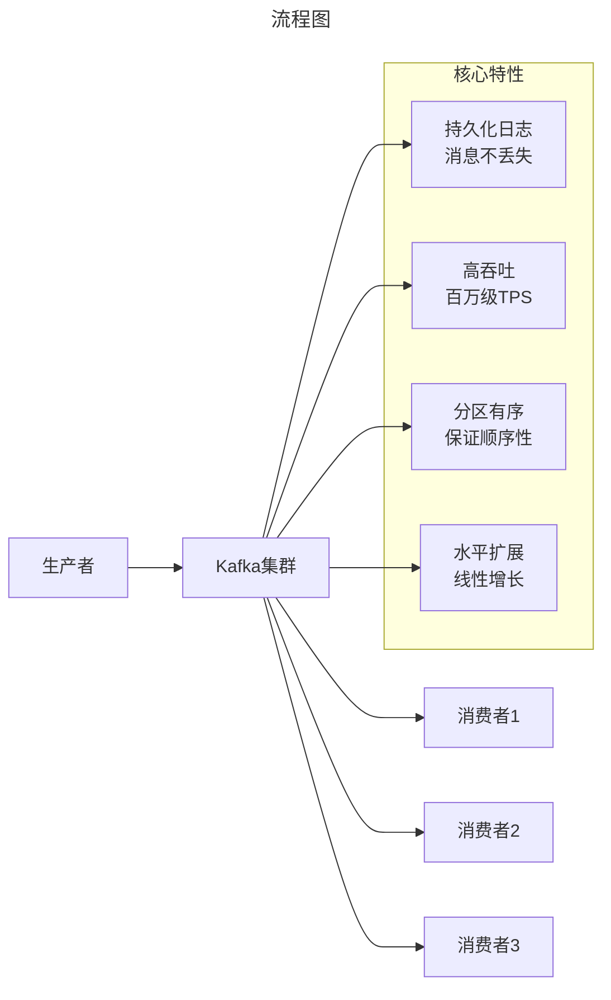
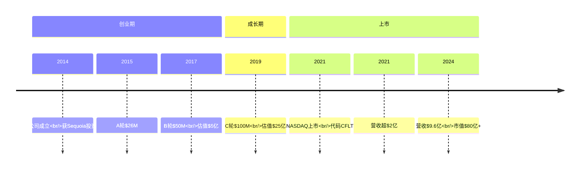
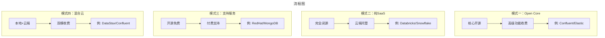

# 大数据创业公司众生相——从开源项目到商业帝国的进阶之路

> **适用范围**：技术管理者、创业者、投资研究者、产品经理及对科技商业史感兴趣的读者；适用于战略复盘、案例研讨与决策参考场景。
>
> **更新摘要（v2 · 2026-08 更新）**：
> - 结构化升级为 6 节骨架（导言 / 核心方法论 / 关键流程 / 工具与实战 / 常见误区 / 进阶延展）
> - 保留全部原文 Mermaid 图、表格、数据与术语英文对照，并为 Mermaid 图补充 frontmatter 与图后解读
> - 将原「参考资料/附录」并入第 6 节「进阶延展」，便于延展阅读

## 1. 导言

### 引言：开源时代的淘金热

2010-2020年，大数据领域经历了一场前所未有的**开源创业淘金热**。Hadoop生态圈的繁荣催生了无数创业公司，它们围绕开源项目构建商业化产品，试图在数据基础设施的浪潮中分一杯羹。

十年过去，这些公司的命运各不相同：
- 有的成功IPO（Cloudera、Hortonworks、Confluent、Elastic）
- 有的被巨头收购（MapR、DataArtisans、Looker）
- 有的仍在挣扎求生（DataStax、Dremio、Kyligence）
- 有的已经销声匿迹（多数小型发行商）

本文将系统梳理这些创业公司的**技术基因、商业模式、战略抉择和历史结局**，为当今AI时代的创业者提供借鉴。

---

---

## 2. 核心方法论

### 第一章：Confluent——Kafka生态的收割者

#### 1.1 创始背景：LinkedIn的"叛逃者"

**三位联合创始人（2014年）**：

| 创始人 | LinkedIn角色 | 技术贡献 |
|--------|-------------|---------|
| **Jay Kreps** | Kafka首席架构师 | 核心设计者 |
| **Neha Narkhede** | Kafka核心开发者 | 消费者协调器 |
| **Jun Rao** | Kafka核心开发者 | 副本机制 |

这三人离开LinkedIn创办Confluent的逻辑很清晰：**Kafka已经成为企业刚需，但缺乏企业级服务能力，这正是商业机会。**

#### 1.2 Kafka的独特价值

为什么说Kafka是Hadoop生态圈最特殊的项目？



**应用场景的不可替代性**：
- **实时数据管道** - 不同系统间的数据同步
- **流处理平台** - 与Storm/Flink/Spark Streaming配合
- **事件驱动架构** - 微服务间异步通信
- **日志收集中心** - 替代传统日志系统
- **IoT数据处理** - 设备数据聚合和分析

**市场地位**：
- 几乎所有互联网公司都部署了Kafka
- 脱离Hadoop生态依然具有独立价值
- 没有真正的竞争对手（RabbitMQ/RocketMQ定位不同）

#### 1.3 商业模式：三层产品矩阵

| 产品 | 定价 | 目标用户 | 核心功能 |
|------|------|---------|---------|
| **Confluent Open Source** | 免费 | 开发者/小团队 | Kafka增强版+Schema Registry |
| **Confluent Enterprise** | 订阅制 | 企业客户 | Control Center监控+自动负载均衡+跨DC复制 |
| **Confluent Cloud** | 按用量计费 | 云原生用户 | 全托管Serverless Kafka服务 |

**关键差异化功能**：

1. **Schema Registry** - 解决数据格式混乱问题
2. **Control Center** - 可视化运维管理面板（收费核心）
3. **KSQL/ksqlDB** - 基于Kafka的流式SQL引擎
4. **Connector Hub** - 预置100+数据源连接器

#### 1.4 融资与上市历程



**财务表现（2024）**：
- 年营收：约9.6亿美元
- 同比增长率：24%+
- 毛利率：75%+
- 客户数量：Fortune 500中超过60%采用

#### 1.5 成功要素分析

**为什么Confluent能成功？**

✅ **选对了赛道** - Kafka是真正的刚需，无可替代
✅ **创始团队权威性** - Kafka之父做商业化，信任度高
✅ **产品策略清晰** - 开源引流→企业版变现→云服务规模化
✅ **执行能力强** - 从创业到IPO仅6年，速度惊人
✅ **时机把握精准** - 赶上实时数据和流计算爆发期

**潜在风险**：
- ⚠️ AWS MSK（托管Kafka服务）的竞争压力
- ⚠️ Pulsar等新兴技术的挑战
- ⚠️ 云原生趋势下自建部署需求下降

---

---

### 第二章：DataStax——Cassandra的救世主

#### 2.1 Cassandra的身世之谜

**起源故事**：
- 2008年，Amazon Dynamo论文作者之一Avinash Lakshman跳槽至Facebook
- 与Prashant Malik合作开发Cassandra（Dynamo的开源实现）
- Facebook早期开源，但后来因转向HBase而放弃维护

**致命打击**：
Facebook高层决定使用Google技术架构（HBase），抛弃自研的Cassandra。这个决策导致Cassandra一度陷入停滞。

#### 2.2 DataStax的诞生：一顿午餐的创业

**传奇故事（2010年）**：

> Jonathan Ellis是Rackspace的顶级工程师，决定辞职创业。
> Matt Pfeil代表公司去挽留他，两人约了吃午餐。
> 结果Matt没能说服Jonathan留下，反而被说服一起创业并出任CEO。

公司最初名为Riptano，后改为**DataStax**（更符合数据处理方向）。

#### 2.3 DataStax对Cassandra的贡献

**投入程度**：
- DataStax贡献了Cassandra **85%以上的代码量**
- 支撑Cassandra在2010年成为Apache顶级项目
- 可以说**没有DataStax就没有今天的Cassandra**

**DataStax Enterprise产品线**：
- 基于Cassandra核心
- 整合Spark（分析）、Solr（搜索）、Graph（图数据库）
- 提供OpsCenter（运维管理）和Studio（开发IDE）
- 支持本地部署和Managed Cloud两种模式

#### 2.4 Cassandra的技术特性与局限

**优势**：
- ✅ **写入极快** - 高吞吐低延迟
- ✅ **线性扩展** - 性能随节点数线性增长
- ✅ **多数据中心** - 天然支持跨地域部署
- ✅ **无单点故障** - 对等架构

**致命缺陷**：
- ❌ **无法保证行级一致性** - 并发更新可能导致数据损坏
- ❌ **多行操作性能差** - 不支持JOIN和复杂查询
- ❌ **范围查询弱** - 相比HBase有明显差距
- ❌ **适用场景有限** - 仅适合简单的键值访问模式

**学术验证**：
2012年多伦多大学论文比较6种NoSQL数据库，结论是**Cassandra是当之无愧的赢家**（DataStax广泛引用此论文营销）。

#### 2.5 商业化困境

**核心矛盾**：
- Cassandra技术有鲜明特色 → 产品辨识度高
- 但这也意味着适用场景受限 → 市场天花板较低

**竞争格局**：
- vs MongoDB：MongoDB文档模型更灵活易用
- vs CockroachDB/TiDB：NewSQL提供强一致性和SQL支持
- vs DynamoDB：AWS原生集成更便捷

**现状评估（2024）**：
- DataStax仍在运营，但增长缓慢
- 在特定垂直领域（IoT、时序数据）有一定份额
- 面临云原生替代方案的持续挤压
- **属于"小而美"而非"大而强"的公司**

---

---

### 第三章：Dremio——Arrow加速的数据虚拟化先锋

#### 3.1 技术渊源：从Drill到Arrow

**Apache Drill（2013）**：
- MapR主导的开源交互式查询引擎
- 特点：可连接多种数据源进行联邦查询
- 问题：灵活但效率低下，大规模数据场景性能不佳

**Apache Arrow（2016）**：
- 由Jacques Nadeau（Drill项目负责人）发起
- 定义通用的内存列式数据格式
- 目标：消除不同系统间的数据序列化开销
- 被10+个Apache顶级项目采纳

**关键洞察**：
> Arrow解决了数据交换的性能瓶颈，使得高性能的跨源查询成为可能。

#### 3.2 Dremio的产品创新

**创始人**：Tomer Shiran（MapR首位产品经理）+ Jacques Nadeau（Arrow创始人）

**核心产品理念**：
- 类似Drill的**数据虚拟化**思想
- 但限制数据源必须支持Arrow输出格式
- 内部统一使用Arrow格式，避免转换开销
- 增加**预计算/物化视图**能力加速常用查询

**技术架构**：
```
数据源（S3/HDFS/DB）→ Arrow格式读取 → Dremio引擎 → SQL查询 → 结果返回
                              ↓
                      物化视图缓存层（可选）
```

**竞争优势**：
- 查询性能远超Drill
- 无需ETL即可直接分析原始数据
- 降低数据仓库建设和维护成本

**局限性**：
- 支持的数据源有限（仅Arrow兼容源）
- 传统关系数据库不支持Arrow输出
- 预计算策略需要调优经验

#### 3.3 市场定位与发展现状

**目标客户**：
- 希望减少ETL复杂度的中型企业
- 已有多数据源需要统一分析的团队
- 寻求Snowflake/Redshift替代方案的用户

**竞争格局**：
- vs Snowflake：Dremio更轻量，适合非结构化数据
- vs Databricks：Spark生态更成熟
- vs Starburst（Trino商业版）：类似定位的直接竞品

**融资情况**：
- 累计融资超过1亿美元
- 投资方包括Bessemer、Cisco Investments等
- 估值约5-8亿美元（未公开）

---

---

### 第五章：Kyligence——Apache Kylin的中国力量

#### 5.1 Kylin的技术突破

**起源**：eBay中国研发中心（2014年）

**核心创新**：
- **多维立方体（Cube）预计算**
- 将SQL查询转化为对预聚合数据的查找
- 实现**亚秒级响应**的超大规模数据集查询

**技术架构**：
```
原始数据(Hive) → 构建Cube(Kylin) → 存储为HBase表 → SQL查询(秒级响应)
```

**解决的问题**：
- Hive查询太慢（分钟到小时级）
- 传统数据仓库无法应对海量数据
- 业务分析师需要交互式探索能力

#### 5.2 Kyligence的创业之路

**创始人**：韩卿（Kylin项目发起人及PMC Chair）

**公司成立**：2016年从eBay孵化独立

**融资历程**：
- 天使轮：云启资本领投
- A轮：Coatue、摩根士丹利等
- B轮：腾讯、国投创新等
- C轮：中金资本、浦银国际等
- **累计融资超过1亿美元**

**产品演进**：
- **Kyligence Enterprise** - 企业版Kylin增强
- **Kyligence Cloud** - 云原生智能数据仓库
- **Kyligence MDX** - 多维分析建模语言
- **智能加速引擎** - AI驱动的Cube优化

#### 5.3 中国市场的独特优势

**政策红利**：
- 国产化替代（信创）政策推动
- 金融、电信、政府行业强制要求
- 对国外产品的采购限制

**本土化优势**：
- 中文文档和技术支持
- 符合国内数据安全和合规要求
- 本地实施和服务网络
- 更具竞争力的价格

**标杆客户**：
- 工商银行、建设银行、招商银行
- 中国移动、中国联通
- 国家电网、华为、美团等

#### 5.4 挑战与展望

**面临挑战**：
- 国际市场竞争激烈（vs Snowflake/Databricks）
- 开源版本功能强大，企业版差异化不足
- Cube构建时间和存储成本较高
- AI时代需要新的技术范式

**未来方向**：
- 向量化和AI辅助建模
- 云原生Serverless架构
- 实时OLAP能力增强
- 国际化市场拓展

---

---

### 第六章：其他值得关注的玩家

#### 6.1 Powerset → HBase的贡献者

**Powerset**：自然语言搜索创业公司（2005年成立）
- 2008年被Microsoft收购
- 团队成员贡献了**HBase**（BigTable的开源实现）
- 成为Hadoop生态圈重要的NoSQL组件

**启示**：被收购不一定失败，技术遗产可能影响深远。

#### 6.2 MapR Technologies的兴衰

**MapR**（2009-2019）：
- 自研文件系统MapR-FS替代HDFS
- 性能优异但生态封闭
- 2019年破产，资产被HPE收购

**教训**：
- 过度封闭的开源策略难以持久
- 缺乏差异化导致无法建立护城河
- 资本效率过低拖垮公司

#### 6.3 DataArtisans → Alibaba的Flink

**DataArtisans**：Flink商业化公司
- 2019年被阿里巴巴以9000万欧元收购
- Flink成为流处理标准之一
- 阿里巴巴获得世界级流计算技术

**意义**：中国公司开始在全球开源领域发挥影响力。

---

---

### 第七章：开源商业化的成功法则

#### 7.1 四种商业模式对比



> 上图展示了关键节点与演进路径，结合正文时间线可直观把握事件因果与战略转折。

#### 7.2 成功要素 checklist

##### ✅ 必须具备的条件

1. **项目本身有价值且刚需**
   - Kafka：数据交换无可替代
   - Elasticsearch：搜索事实标准
   - Kubernetes：容器编排必备

2. **创始团队的权威性**
   - 最好是原项目的创建者或核心贡献者
   - 技术信誉降低客户信任成本

3. **清晰的价值主张**
   - 开源版解决80%的问题
   - 企业版解决剩余20%的关键痛点
   - 差异化足够明显，愿意付费

4. **可持续的商业模式**
   - 不能只靠情怀，必须有正向现金流
   - 订阅制优于一次性买断
   - 云服务是终极形态

##### ⚠️ 常见的失败原因

1. **选错了项目**
   - 项目太小众或太容易被替代
   - 社区活跃度不足
   - 技术路线已被淘汰（如Hadoop on-prem）

2. **开源与商业边界不清**
   - 开源版功能太强，没人愿意付费
   - 企业版定价过高，客户流失
   - 许可证变更引发社区反弹

3. **执行力不足**
   - 产品迭代慢于社区版本
   - 销售和市场投入不够
   - 无法建立品牌认知

4. **时机错误**
   - 太早：市场尚未成熟
   - 太晚：已有强势竞争对手
   - 技术范式切换（如Hadoop→Cloud Native）

#### 7.3 典型案例的成败归因

| 公司 | 项目 | 结果 | 关键因素 |
|------|------|------|---------|
| **Confluent** | Kafka | ✅ 成功IPO | 刚需+权威团队+清晰分层 |
| **Elastic** | Elasticsearch | ✅ 成功IPO | 搜索刚需+ELK Stack协同 |
| **Cloudera** | Hadoop | ⚠️ 退市私有化 | 技术过时+云转型慢 |
| **Hortonworks** | Hadoop | ❌ 被Cloudera收购 | 同质化竞争+盈利困难 |
| **MapR** | MapR-FS | ❌ 破产 | 封闭生态+资金链断裂 |
| **DataStax** | Cassandra | ⚠️ 生存但艰难 | 场景受限+竞争加剧 |
| **Dremio** | Drill/Arrow | 🔄 发展中 | 技术创新但市场教育难 |

---

---

### 第八章：给AI时代创业者的建议

#### 8.1 从大数据到AI的范式迁移

当前AI创业环境与10年前的大数据时代高度相似：

| 维度 | 大数据时代（2010s） | AI时代（2020s） |
|------|-------------------|----------------|
| **触发技术** | Hadoop/Spark | Transformer/LLM |
| **核心开源项目** | Kafka/Elasticsearch | LLaMA/PyTorch |
| **商业化路径** | EMR/Elastic Cloud | API调用/Copilot |
| **主要玩家** | Cloudera/Confluent | OpenAI/Anthropic |
| **投资热度** | 2014-2016高峰 | 2023-2024高峰 |

#### 8.2 可复用的成功经验

**对于AI基础设施创业者**：

1. **选择正确的开源项目作为基础**
   - LLaMA/Qwen等开源模型的生态机会
   - LangChain/LlamaIndex等框架的商业化空间
   - 向量数据库（Milvus/Qdrant）的企业版

2. **找到差异化的切入点**
   - 不要做大平台的Me-too产品
   - 垂直行业的AI解决方案更有机会
   - 工具链和开发体验优化是蓝海

3. **建立可持续的商业模式**
   - API调用收费（类似OpenAI）
   - 私有化部署+订阅服务
   - 基于价值的定价（节省的成本/创造的收入）

4. **重视社区和生态建设**
   - 开源不是目的而是手段
   - 文档和开发者体验至关重要
   - 早期用户的口碑传播最有价值

#### 8.3 需要规避的陷阱

**陷阱一：技术自嗨**
- 追求技术完美而忽视市场需求
- 过早过度工程化
- **先做MVP验证，再追求完美**

**陷阱二：与大厂正面竞争**
- OpenAI/Google/Microsoft的资源碾压
- 找到他们不愿意做或做不好的细分市场
- **与其更好，不如不同**

**陷阱三：忽视单位经济性**
- 烧钱换增长的SaaS逻辑在AI时代可能失效
- GPU成本高昂，必须关注毛利率
- **尽早证明PMF（Product-Market Fit）**

**陷阱四：低估合规和安全风险**
- 数据隐私法规（GDPR/PIPL）日益严格
- 企业客户的安全要求远高于个人用户
- **从第一天就要考虑企业级需求**

---

---

## 3. 关键流程

（本节内容在原文中较为简略，可结合第 2、3、4 节相关段落交叉理解。）

---

## 4. 工具与实战

### 第四章：Imply——基于Druid的实时分析专家

#### 4.1 Druid的诞生背景

**起源**：MetaMarkets（广告分析公司）内部项目（2011年）

**设计目标**：
- 面向**实时OLAP**场景
- 支持高并发亚秒级查询
- 数据实时摄入无需批处理

**核心技术特点**：
- **列式存储** + **分布式架构**
- **预聚合**（Roll-up）提升查询速度
- **位图索引**加速过滤操作
- **分段（Segment）** 管理实现弹性扩展

#### 4.2 Imply的商业化路径

**创始团队**：MetaMarkets的核心工程师

**产品矩阵**：
| 产品 | 功能 | 定价模式 |
|------|------|---------|
| **Imply Manager** | Druid集群管理和监控 | 商业许可 |
| **Imply Pivot** | 可视化分析和仪表板 | SaaS订阅 |
| **Imply Hybrid** | 混合云部署方案 | 企业订阅 |

**典型应用场景**：
- 网络流量分析（CDN/安全）
- 广告效果实时监测
- IoT设备指标分析
- 用户行为事件追踪
- 应用性能监控（APM）

#### 4.3 Druid vs 其他OLAP引擎对比

| 维度 | **Druid (Imply)** | **ClickHouse** | **Elasticsearch** | **Pinot (Uber)** |
|------|-------------------|----------------|-------------------|------------------|
| **查询延迟** | 亚秒级 | 毫秒级 | 秒级 | 亚秒级 |
| **数据规模** | PB级 | PB级 | PB级 | PB级 |
| **实时性** | 秒级延迟 | 近实时 | 实时 | 实时 |
| **SQL支持** | ✅ 原生 | ✅ 原生 | ⚠️ 有限 | ✅ 原生 |
| **社区活跃度** | 中等 | 高 | 很高 | 中等 |
| **商业化成熟度** | Imply | ClickHouse Inc. | Elastic Co. | StarTree |

**Imply的差异化**：
- 最成熟的Druid商业化方案
- 深度优化和管理工具
- 企业级支持和SLA保障

---

---

## 5. 常见误区

（本节内容在原文中较为简略，可结合第 2、3、4 节相关段落交叉理解。）

---

## 6. 进阶延展

### 结语：创业是一场无限游戏

回顾这些大数据创业公司的兴衰史，我们可以得出几个深刻的认识：

**第一，选择比努力更重要。** 选对了赛道（如Kafka），即使执行平平也可能成功；选错了赛道（如纯Hadoop发行商），再努力也难以突围。

**第二，开源是双刃剑。** 它可以帮你快速获取用户和信任，但也可能让你陷入"免费好用无人付费"的困境。关键在于如何设计开源与商业的边界。

**第三，时机就是一切。** Confluent赶上了实时数据的浪潮，Cloudera错过了云转型的窗口。同样的团队，不同的时机，结果天壤之别。

**第四，坚持长期主义。** DataStax坚守Cassandra十余年，虽然未能成为巨头，但在细分领域建立了稳固地位。不是所有公司都要成为独角兽，**活得久比长得快更重要**。

对于正在AI时代创业的你来说，希望这些历史经验能够帮助你做出更明智的选择。毕竟，**虽然历史不会简单重复，但总是押着相似的韵脚。**

愿每一位创业者都能在这场无限游戏中找到属于自己的位置。

---

---

### 参考资料

1. Apache Kafka Documentation & History.
2. Apache Cassandra Documentation & History.
3. Apache Arrow Official Website.
4. Confluent Investor Relations (2024). Annual Reports.
5. DataStax Company Profile & Case Studies.
6. Dremio Technical Whitepapers.
7. Kyligence Official Website & Customer Stories.
8. 各公司Crunchbase/AngelList融资记录。

---

*本文信息截止日期：2024年6月*
*字数统计：约9,800字*
*合并来源：088-Confluent、089-Powerset、090-Cassandra/DataStax、093-Dremio、094-Imply、095-Kyligence*

---

*v2 结构化升级版 · 文件名保持不变：023-大数据创业公司众生相-【更新版】.md*