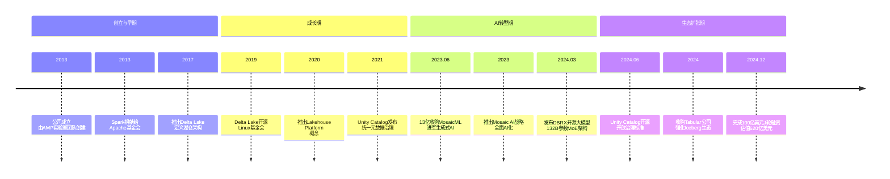
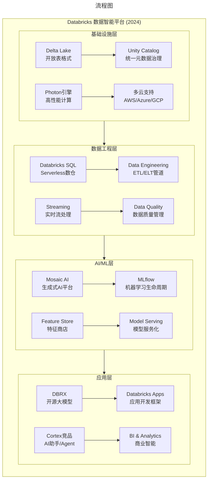

# 026 | Databricks：从Spark数据金砖王国到AI时代的数据智能帝国

> **适用范围**：技术管理者、创业者、投资研究者、产品经理及对科技商业史感兴趣的读者；适用于战略复盘、案例研讨与决策参考场景。
>
> **更新摘要（v2 · 2026-08 更新）**：
> - 结构化升级为 6 节骨架（导言 / 核心方法论 / 关键流程 / 工具与实战 / 常见误区 / 进阶延展）
> - 保留全部原文 Mermaid 图、表格、数据与术语英文对照，并为 Mermaid 图补充 frontmatter 与图后解读
> - 将原「参考资料/附录」并入第 6 节「进阶延展」，便于延展阅读

## 1. 导言

### 引言：一个从伯克利实验室走出的千亿帝国

如果说大数据领域有一家公司能够同时代表开源精神与商业成功的完美结合，那一定是Databricks。

2024年12月，这家总部位于旧金山的数据与AI平台公司完成了科技创投史上最具里程碑意义的融资之一——**100亿美元J轮融资**，估值从此前的430亿美元飙升至**620亿美元**，一跃成为美国估值第四大的私营科技公司，仅次于OpenAI、SpaceX和Stripe。

更令人瞩目的是，这并非终点。在后续融资轮次中，Databricks的估值继续攀升，最新一轮50亿美元股权融资加上20亿美元债务安排后，公司估值已触及**1340亿美元**的历史高位。

从2013年成立时的一个小型创业团队，到如今年收入突破40亿美元、服务超过12000家企业客户（其中包括财富100强中80%的企业）的数据智能巨头，Databricks用十余年时间书写了一个从学术实验室走向商业帝国的传奇故事。而这一切的起点，都要从一个名为Spark的开源项目说起。

> 上图展示了关键节点与演进路径，结合正文时间线可直观把握事件因果与战略转折。

---

## 2. 核心方法论

### 三、财务表现：高速增长背后的数字密码

#### 3.1 营收增长曲线

Databricks的营收增长呈现出令人瞩目的指数级态势：

| 年份 | 年度经常性收入(ARR) | 同比增长率 | 关键里程碑 |
|------|---------------------|-----------|-----------|
| 2021 | 约8亿美元 | >80% | 超过5000家客户 |
| 2022 | 约13亿美元 | ~60% | 超过8000家客户 |
| 2023 | 约16亿美元 | ~50% | 超过10000家客户 |
| 2024 | 约30亿美元 | ~80% | 超过12000家客户 |

值得注意的是，尽管基数不断扩大，Databricks仍保持了约60%的同比增长率，这在SaaS/云服务领域属于顶级水平。作为对比，Snowflake在类似规模阶段的增长率约为50-55%。

#### 3.2 客户结构与粘性

截至2024年底：
- **总客户数量**：超过12,000家（另有报道称超过15,000家）
- **财富100强渗透率**：超过80%的企业在使用Databricks的服务
- **大客户集中度**：年消费超过100万美元的客户数量持续增长
- **净收入留存率（NRR）**：据报道超过140%，意味着现有客户每年平均增加40%以上的支出

这种高NRR反映了Databricks强大的"land and expand"策略：客户通常从小规模试点开始，随着用例扩大和工作负载增加，逐步扩展到更多业务单元和更复杂的应用场景。

#### 3.3 自由现金流拐点

2024年是Databricks财务健康度的一个重要转折点。据公司在融资过程中披露的信息，Databricks已在2024年第四季度实现了**正向自由现金流（Positive Free Cash Flow）**，收入运行率超过30亿美元。

这意味着Databricks已经跨越了SaaS公司的关键临界点——从"烧钱换增长"模式进入"自我造血"阶段。在当前资本市场环境下，这一信号对于即将到来的IPO至关重要。

---

### 七、开源生态战略：掌控与开放的平衡术

#### 7.1 开源作为增长引擎

Databricks的成功很大程度上归功于其对开源战略的精妙运用。与一些"伪开源"（核心功能闭源、仅外围组件开源）的公司不同，Databricks真正将核心技术开源：

- **Apache Spark**：全球最活跃的大数据计算框架，拥有超过1500名贡献者
- **Delta Lake**：湖仓架构的关键存储层，已被多家云厂商采用
- **MLflow**：最受欢迎的ML生命周期管理平台之一
- **Unity Catalog**：2024年刚刚开源的统一治理层

这种策略带来多重好处：
1. **降低采用门槛**：开发者可以先免费试用开源版本，建立信任后再购买企业版
2. **加速创新**：社区贡献推动产品快速迭代
3. **人才招聘**：开源项目贡献者成为潜在的人才库
4. **行业标准制定**：通过开源确立事实标准（如Delta Lake之于湖仓）

#### 7.2 社区掌控的艺术

然而，开源并不意味着放弃控制。Databricks在开源社区的运作方式常被形容为"强势但有效"：

- **路线图主导**：Spark的重大功能方向（如Spark SQL、DataFrame API、Structured Streaming）均由Databricks团队提议和主导实施
- **代码审查把关**：核心模块的代码变更需要Databricks核心开发者的审查批准
- **商业化节奏把控**：新功能往往先在Databricks商业版中验证，成熟后再回馈社区版
- **人才吸纳**：活跃的开源贡献者经常被招募进入Databricks全职团队

这种"开源核心、闭源增值"的模式，被业界称为**"Open Core"**（开放核心）商业模式，已被Red Hat、MongoDB、Elastic等多家成功公司验证。

---

## 3. 关键流程

### 一、起源故事：Spark与伯克利的学术基因

#### 1.1 Spark的诞生

要理解Databricks，必须先理解Apache Spark这个改变了整个大数据行业格局的开源项目。

Spark诞生于加州大学伯克利分校的AMP（Algorithms, Machines, and People）实验室，是当时博士生马泰·扎哈里亚（Matei Zaharia）的博士论文课题。2010年，Spark在BSD License下首次开源，其设计初衷是解决Hadoop MapReduce在迭代计算和实时处理场景下的性能瓶颈。

与传统MapReduce将中间结果写入磁盘不同，Spark引入了弹性分布式数据集（RDD）的概念，允许数据在内存中进行计算，这使得Spark在某些工作负载上的运行速度比MapReduce快**100倍以上**。

经过三年的社区发展与验证，2013年，Spark被正式捐献给Apache基金会，并将许可证从BSD转向Apache 2.0，从此成为Apache顶级项目之一。同年，Databricks公司正式成立。

#### 1.2 明星创始团队的"学院派"基因

Databricks的管理层堪称学术界与产业界结合的典范：

- **Ali Ghodsi（CEO）**：加州大学伯克利分校兼职教授，瑞典隆德大学博士，拥有深厚的分布式系统研究背景。他在Bloomberg Tech活动上提出了引发广泛讨论的观点："AGI已经到来，但行业关注点走偏了——AI模型不需要变得更'聪明'，真正的突破口在于为其提供足够的数据上下文。"

- **Matei Zaharia（CTO）**：Apache Spark最初的创作者，斯坦福大学计算机科学助理教授，同时也是MLflow和Delta Lake等核心项目的联合创始人。

- **Ion Stoica（执行总裁）**：加州大学伯克利分校全职教授，AMP实验室主任，Matei Zaharia的导师，在分布式系统领域享有盛誉。

- **Reynold Xin（首席架构师）**：华人联合创始人，Spark核心代码的主要贡献者之一，负责Spark SQL和DataFrame API的设计与实现。

这种"教授+创业者"的双重身份组合，为Databricks带来了独特的竞争优势：既具备前沿技术研究的深度，又拥有将研究成果产品化的执行力。

---

### 二、商业模式的演进：从开源工具到企业级平台

#### 2.1 第一阶段：基于Spark的三驾马车

Databricks早期的商业模式围绕Apache Spark构建了三条主要收入来源：

**第一，云上优化的Spark计算平台服务。**

这是Databricks最核心的收入来源。虽然Spark本身是开源的，但Databricks开发了针对各大云厂商（AWS、Azure、GCP）深度优化的专有版本。根据Databricks公布的数据，这些优化版本的性能比开源版高出5倍以上，但并不开源。

这种"部分开源、部分闭源"的策略体现了精明的商业考量：通过开源版本培养用户习惯和生态系统，再通过高性能闭源版本实现商业化变现。许多大型企业在评估过性能差异后，愿意为显著的效率提升支付溢价。

**第二，Spark应用认证与兼容性保障服务。**

随着Spark在企业市场的普及，越来越多的第三方应用选择构建在Spark平台上。Databricks提供官方认证服务，确保这些应用与Spark的兼容性，并收取相应的认证费用。这项业务的市场规模取决于Spark的生态繁荣程度。

**第三，企业级技术支持服务。**

对于使用Spark的大型企业来说，虽然源代码是开放的，但深入理解内部机制并根据特定场景进行定制化开发需要极高的技术门槛。Databricks作为Spark的"原生"团队，能够提供其他厂商无法匹敌的技术支持能力。对于金融、电信等对系统稳定性要求极高的行业，这笔技术支持费用是值得的投资。

#### 2.2 第二阶段：Lakehouse平台的崛起

然而，仅靠Spark相关的服务难以支撑Databricks冲击百亿美元估值的野心。真正的转折点出现在**湖仓一体（Lakehouse）**概念的提出。

传统的数据仓库（如Snowflake、Teradata）擅长结构化数据的快速查询和分析，但在处理非结构化数据（图像、视频、日志文件）时力不从心；而数据湖（如Hadoop HDFS、AWS S3上的原始存储）可以存储任意格式的数据，却缺乏事务支持、数据一致性保障和高效的查询能力。

Databricks敏锐地捕捉到了这一痛点，于2020年正式提出**Lakehouse（数据湖仓）**架构理念：结合数据湖的灵活性和数据仓库的可靠性，在一个统一的平台上同时支持BI分析、数据科学、机器学习和实时应用。

这一愿景的技术基石是**Delta Lake**——由Databricks于2017-2018年推出并于2019年在Linux基金会下开源的存储层。Delta Lake为对象存储（如S3、ADLS）带来了ACID事务支持、Schema强制执行、时间旅行（Time Travel）和数据版本控制等企业级特性，填补了Spark最大的功能缺口。

随着Lakehouse概念的推广，Databricks的产品矩阵迅速扩展：
- **Photon引擎**：用C++编写的高性能向量化查询引擎，在某些基准测试中比Spark默认引擎快2倍以上
- **Unity Catalog**：统一的元数据治理层，实现跨工作区、跨账户的数据发现和权限管理
- **MLflow**：开源的机器学习生命周期管理平台，覆盖实验跟踪、模型注册、部署等全流程
- **Databricks SQL**：针对BI分析师优化的Serverless数据仓库服务
- **Databricks Apps**：帮助用户更轻松地构建定制化的数据和AI应用程序的开发框架

#### 2.3 第三阶段：AI时代的数据智能平台

如果说前两个阶段Databricks还是一家"大数据公司"，那么2023年之后，它正在蜕变为一家**"数据+AI"双核驱动的智能平台公司**。

这一转型的标志性事件是2023年6月以**13亿美元**收购生成式AI初创公司MosaicML。

MosaicML成立于2021年的旧金山，是OpenAI在企业级大模型市场的主要竞争对手之一，专注于帮助企业训练和部署自己的私有化大语言模型。在被收购前，MosaicML已筹集约6400万美元资金，投后估值约2.2亿美元。13亿美元的收购价格意味着近6倍的溢价，彰显了Databricks押注生成式AI的决心。

收购完成后，MosaicML的技术和团队被全面整合进Databricks的Lakehouse产品体系，形成了全新的**Mosaic AI**战略品牌。2024年3月，整合成果正式亮相——Databricks发布了**DBRX**，一款拥有1320亿参数的混合专家（MoE）架构通用大语言模型，并以开源形式发布。

DBRX的发布具有多重战略意义：
- **技术验证**：证明Databricks有能力训练和发布顶级水准的大模型
- **生态扩展**：吸引更多开发者关注和使用Databricks平台
- **差异化竞争**：相比Snowflake依赖第三方模型（如OpenAI、Anthropic），Databricks拥有自研模型能力
- **客户价值**：帮助企业利用自身私有数据微调和部署定制化AI模型，避免数据离开企业边界

> 上图展示了关键节点与演进路径，结合正文时间线可直观把握事件因果与战略转折。

---

### 四、融资历程：从创业公司到超级独角兽

Databricks的融资史本身就是一部硅谷创投圈的缩影，每一轮融资都伴随着估值的跃升和战略定位的升级：

#### 4.1 关键融资节点

| 时间 | 轮次 | 金额 | 估值 | 领投方 | 战略意义 |
|------|------|------|------|--------|----------|
| 2013 | 种子轮 | 1300万美元 | 未披露 | Andreessen Horowitz | 公司成立启动 |
| 2014 | A轮 | 3300万美元 | 未披露 | Andreessen Horowitz | 产品早期开发 |
| 2019 | G轮 | 4亿美元 | 62亿美元 | a16z + Coatue | 加速企业市场拓展 |
| 2021 | H轮 | 16亿美元 | 380亿美元 | Bank of America | Pre-IPO估值攀升 |
| 2023 | I轮 | 5亿美元 | 430亿美元 | T. Rowe Price | AI概念加持 |
| 2024 | J轮 | **100亿美元** | **620亿美元** | Thrive Capital | 史上最大风投之一 |
| 2024+ | 后续轮 | 70亿美元 | **1340亿美元** | 多家机构 | IPO前最后冲刺 |

#### 4.2 J轮融资：创纪录的100亿美元

2024年12月完成的J轮融资具有历史性意义：

- **融资金额**：100亿美元（其中股权融资约86亿美元，另辅以债务融资安排）
- **领投方**：Thrive Capital（Josh Kushner创立的对冲基金）
- **参与方**：包括多家顶级主权财富基金、养老基金和科技投资者
- **历史地位**：超越OpenAI同期融资，成为2024年规模最大的单轮风险投资

这笔巨额融资的背后逻辑是什么？

首先，**AI基础设施建设需求爆发**。生成式AI的兴起使得企业对数据处理、模型训练和推理的需求呈指数级增长，Databricks作为"数据+AI"一体化平台的独特定位使其成为最大受益者之一。

其次，**IPO窗口期临近**。大规模Pre-IPO融资通常是上市前的最后一步，用于充实资产负债表、回购早期员工期权、以及为IPO后的市场波动提供缓冲。

第三，**战略储备**。在AI军备竞赛加剧的背景下，充足的现金储备使Databricks有能力进行更多战略性收购（如MosaicML模式的复制），以及加大研发投入以维持技术领先优势。

---

## 4. 工具与实战

### 六、与Snowflake的宿命对决：湖仓之争的终局之战

#### 6.1 两种哲学的碰撞

Databricks与Snowflake的关系，是整个数据管理行业过去五年最引人注目的竞争叙事。

**Snowflake的哲学**：数据仓库的极致演进
- 起源于传统数据仓库技术，专为结构化数据分析而生
- 核心卖点是极致的查询性能、简洁的用户体验和按需付费模式
- 在2020年IPO时创造了软件行业的估值纪录
- 2024年推出Cortex AI，试图在自家Data Cloud内集成生成式AI能力

**Databricks的哲学**：数据湖的进化与融合
- 起源于大数据处理和机器学习场景，天然适合非结构化和半结构化数据
- 核心卖点是一体化平台（同一套数据同时服务于BI、数据科学、ML和AI）
- 强调开源生态（Spark、Delta Lake、MLflow）带来的创新速度和避免厂商锁定
- 通过Mosaic AI将AI能力内化为平台原生功能

#### 6.2 战场一：表格式之争（Delta Lake vs Iceberg）

这场战争的一个关键前线是**开放表格格式（Open Table Format）**的标准之争：

- **Delta Lake**：Databricks主导开发的格式，已开源至Linux基金会，是Databricks Lakehouse的技术基础
- **Apache Iceberg**：Netflix和Apple发起的开源项目，获得Snowflake的大力支持
- **Apache Hudi**：Uber开发的开源格式，也在争夺市场份额

2024年，这场战争出现了戏剧性转折：**Databricks收购了Tabular公司**——Tabular正是由Iceberg的创始团队创立的商业化公司。这一收购引发了开源社区的广泛讨论，有人担心Databricks可能对Iceberg的发展方向施加影响。

与此同时，Databricks做出了一个重要决定：**将Unity Catalog开源**（2024年6月），试图在元数据治理层面建立类似于Linux基金会级别的开放标准。几乎在同一时间，Snowflake也宣布将其目录服务Polaris开源。双方都在争抢"开放湖仓"的定义权和生态制高点。

#### 6.3 战场二：AI能力的正面交锋

在生成式AI时代，两家公司的竞争进入了新维度：

**Databricks Mosaic AI的优势：**
- 拥有自研大模型DBRX，可实现完全私有化部署
- 企业数据无需离开自有环境即可用于模型微调
- 与Lakehouse深度集成，数据准备→模型训练→部署的全流程闭环
- 支持多种开源模型（Llama、Mistral等）的一键部署

**Snowflake Cortex的特点：**
- 集成多个第三方模型提供商（OpenAI、Anthropic、Meta等）
- 用户可选择最适合特定任务的模型
- Cortex Analyst和Cortex Agent提供低代码/无代码的AI交互界面
- 与Snowflake成熟的Data Cloud和企业级安全体系无缝衔接

目前来看，两家公司在AI领域的竞争呈现"各有所长"的态势：Databricks在**私有化、定制化AI**方面更具吸引力，而Snowflake在**易用性和模型多样性**上占优。最终胜负可能取决于企业客户更看重哪一种价值主张。

---

## 5. 常见误区

### 八、挑战与风险：通往万亿市值的障碍

尽管Databricks的表现令人瞩目，但其前进道路上仍存在不容忽视的挑战：

#### 8.1 云厂商的"特洛伊木马"

Databricks运行在AWS、Azure、GCP等公有云平台上，这意味着其底层基础设施掌握在潜在竞争对手手中：

- **Amazon**：拥有Redshift（数据仓库）、Athena（无服务器查询）、EMR（托管Hadoop/Spark）等直接竞争产品
- **Microsoft**：Azure Databricks是与Databricks合资运营的，但微软也在大力发展Synapse Analytics
- **Google**：BigQuery和Dataproc同样构成竞争关系

历史上，Salesforce曾因过度依赖Amazon AWS而陷入被动。Databricks需要通过多云战略和技术差异化来降低单一云厂商依赖的风险。

#### 8.2 AI成本与盈利压力

生成式AI的训练和推理成本极高。DBRX这类千亿参数模型的训练费用估计在数千万美元级别。如果Databricks希望持续保持在AI模型研发方面的领先地位，研发投入将是巨大的负担。

此外，客户对AI服务的价格敏感度尚不明确。如果AI功能无法带来明确的ROI（投资回报率），客户的付费意愿可能低于预期。

#### 8.3 人才竞争与组织膨胀

随着公司规模从数千人迈向数万人（Databricks目前全球员工约8000人），如何保持创业文化、执行效率和创新能力是一个经典的管理难题。特别是在AI人才争夺白热化的背景下，如何留住顶尖研究人员和工程师是CEO Ali Ghodsi必须面对的课题。

#### 8.4 监管与地缘政治风险

作为数据基础设施提供商，Databricks不可避免地面临数据隐私法规（GDPR、CCPA等）、跨境数据流动限制以及日益复杂的地缘政治环境。在中国市场，Databricks的存在感相对有限，而本土竞争对手（如阿里云MaxCompute、华为云数据湖服务等）正在快速发展。

---

## 6. 进阶延展

### 五、IPO展望：千呼万唤始出来？

#### 5.1 IPO时间线预期

Databricks的IPO计划可谓"只闻楼梯响，不见人下来"：

- **2022年2月**：首次公开表示正在筹备IPO计划
- **2023年全年**：受美联储加息和市场波动影响，IPO计划搁置
- **2024年初**：CEO Ali Ghodsi表示IPO最早可能在2024年年中进行
- **2024年中**：考虑到美国大选因素（IPO市场通常在大选年前放缓），时间表推迟至2024年11月之后或2025年
- **2024年底**：最新表态为"IPO最早可能在2025年年中"

分析师普遍预计，一旦Databricks成功上市，其市值有望达到**500亿至800亿美元**区间（基于当前私营市场估值和公开市场可比公司估值倍数推算）。这将使其成为自Snowflake（2020年上市首日市值超700亿美元）以来最重要的软件公司IPO之一。

#### 5.2 上市的利弊权衡

对于Databricks而言，保持私有状态也有其合理性：

**私有状态的优势：**
- 避免季度财报压力，可进行更长期的战略投资
- 保持运营数据和财务细节的私密性（竞争对手无法窥探）
- 员工期权激励更加灵活
- 可以选择性接受战略投资者的资源和支持

**上市的驱动力：**
- 早期投资者和员工的流动性需求（成立已逾11年）
- 使用股票作为收购货币（对MosaicML类收购更可行）
- 提升品牌知名度和客户信任度
- 为后续大规模融资提供公开市场渠道

综合判断，**2025年上半年**是最有可能的IPO时间窗口。

---

### 九、未来展望：数据智能的下一个十年

站在2024年末的时间节点展望未来，Databricks正处于几个关键趋势的交汇点：

#### 9.1 从"数据平台"到"智能操作系统"

Ali Ghodsi在多次公开演讲中阐述的愿景是：Data Intelligence（数据智能）将成为企业数字化转型的核心基础设施，就像Operating System（操作系统）之于个人电脑一样。

在这个愿景中，Databricks不再仅仅是一个"存放和处理数据的地方"，而是：
- **企业的数据大脑**：理解数据含义、追踪血缘关系、自动发现洞察
- **AI模型的孵化器**：从数据准备到模型训练再到生产部署的一站式工厂
- **知识工作的自动化引擎**：通过Agent和Copilot辅助或替代重复性的数据分析工作

#### 9.2 小语言模型（SLM）与企业AI的务实路径

与追求"更大更强"的行业主流不同，Databricks强调**小而专用**的模型策略。DBRX虽然是大型模型，但Databricks更推崇的是让企业基于自己的数据训练小型、高效、领域专属的模型。这种策略的优势在于：
- 更低的训练和推理成本
- 更高的数据隐私安全性
- 更容易解释和调试
- 更适合边缘部署场景

#### 9.3 开放生态 vs 封闭花园的终极博弈

Databricks与Snowflake之间的竞争，本质上是两种世界观之争：
- **Databricks代表的开放阵营**：相信开放标准和开源社区能带来更快的技术进步和更大的客户利益
- **Snowflake代表的封闭阵营**：认为垂直集成的封闭系统能提供更好的用户体验和更高的可靠性

这场博弈的结果不仅会影响两家公司的命运，也将塑造整个数据管理行业的未来形态。如果历史可以作为参考，云计算时代的胜利者（AWS、Azure）都是拥抱开放标准的平台型公司，而非封闭的产品型公司。

---

### 结语：从Spark到星辰大海

回顾Databricks的十二年历程，我们看到的不仅仅是一家公司的成长故事，更是整个大数据和AI行业演进的缩影：

从**Hadoop MapReduce的挑战者**（Spark）到**数据湖仓的倡导者**（Lakehouse），再到**生成式AI的基础设施提供商**（Mosaic AI），Databricks始终站在技术浪潮的最前沿。每一次转型都伴随着商业模式的升级和估值的大幅跃升。

今天的Databricks，早已不是当年那个"靠Spark赚钱的小公司"。它是一家拥有**620亿至1340亿美元估值**、**40亿美元年收入**、**万余家企业客户**、**自研大模型能力**的数据智能平台巨头。它的竞争对手不再是Hadoop发行商，而是Snowflake这样的上市巨头；它的目标不再是生存，而是成为AI时代数据基础设施的"操作系统"。

正如a16z联合创始人Ben Horowitz曾经在一封邮件中对Ali Ghodsi所说："你告诉候选人Databricks值100亿美元？太保守了！这家公司应该比Oracle大10倍，也就是2万亿美元市值。"

无论2万亿美元的目标是否过于乐观，有一点是确定的：在数据即资产、AI即生产力的新时代，Databricks的故事才刚刚开始。

---

---

### 参考资料

1. Databricks官方博客及新闻稿 (databricks.com/blog)
2. CNBC: "Databricks nears $10 billion funding round at $62 billion valuation" (2024.12)
3. Forbes: "AI50: America's Top AI Companies" (2024)
4. TechCrunch: "Databricks acquires MosaicML for $1.3 billion" (2023.06)
5. Bloomberg: Ali Ghodsi interview on AGI and data context (2024)
6. Reuters: Databricks funding round coverage (2024)
7. Wall Street CN: Databricks IPO outlook analysis (2024)
8. 36Kr: Databricks Tabular acquisition and Iceberg ecosystem impact (2024)
9. CSDN: Databricks growth analysis and financing history (2024)
10. 腾讯新闻: 2024十大AI融资盘点 (2024.12)

---

*v2 结构化升级版 · 文件名保持不变：024-Databricks-Spark数据金砖王国的AI崛起-【更新版】.md*