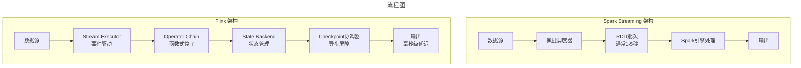
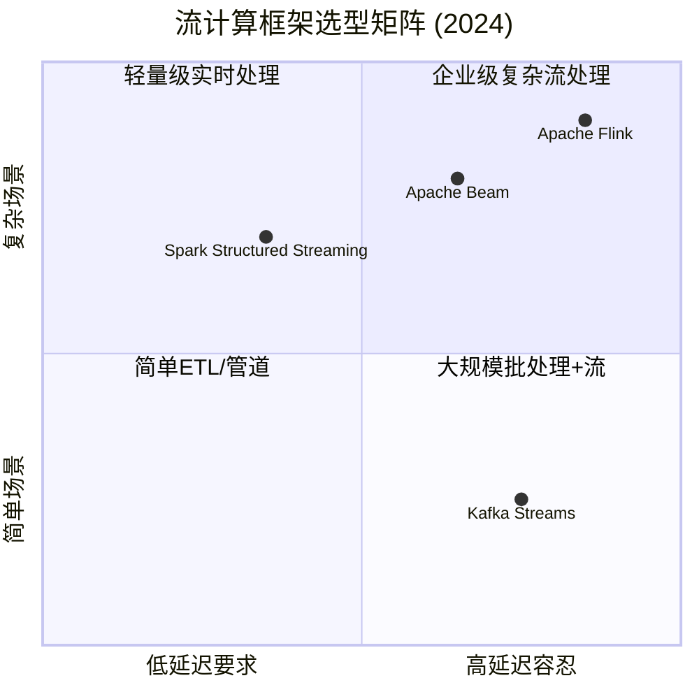
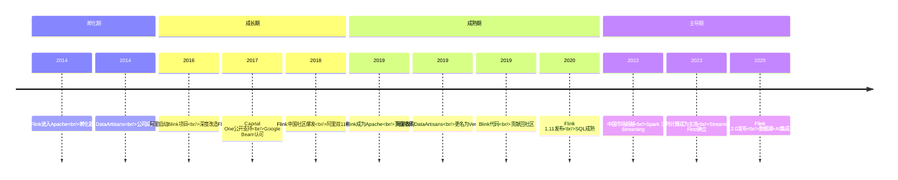

# Apache Flink崛起与大数据创业生存指南——从DataArtisans到实时计算时代

> **适用范围**：技术管理者、创业者、投资研究者、产品经理及对科技商业史感兴趣的读者；适用于战略复盘、案例研讨与决策参考场景。
>
> **更新摘要（v2 · 2026-08 更新）**：
> - 结构化升级为 6 节骨架（导言 / 核心方法论 / 关键流程 / 工具与实战 / 常见误区 / 进阶延展）
> - 保留全部原文 Mermaid 图、表格、数据与术语英文对照，并为 Mermaid 图补充 frontmatter 与图后解读
> - 将原「参考资料/附录」并入第 6 节「进阶延展」，便于延展阅读

## 1. 导言

### 引言：一个德国学术项目的逆袭传奇

2014年，在数据库领域顶级会议VLDB（杭州）上，柏林工业大学的**Volker Markl**教授做了一场关于大数据计算平台的专题报告。他介绍的系统名为**Flink**——一个以"先进的流计算引擎思想"为核心、结合了传统大数据和数据库优点的全新系统[¹](http://m.toutiao.com/group/7550934272753697323)。

当时，很少有人能预见到，这个来自德国的学术项目会在十年后成为**全球最主流的流计算引擎之一**，更不会想到它会被中国科技巨头阿里巴巴收购，并在中国市场全面超越Spark Streaming。

2017年，当我在专栏中撰写DataArtisans和Flink的故事时，重点分析了：
- Flink的技术先进性为何未能立即转化为市场成功
- DataArtisans作为创业公司面临的困境（Databricks的先发优势、欧洲公司的地域劣势）
- 阿里巴巴和Capital One等大客户的支持对Flink的重要性

七年后的2024年，这个故事有了圆满的续篇：

- **阿里巴巴2019年以9000万欧元收购DataArtisans**，后更名为Ververica[²](https://www.51cto.com/article/590270.html)
- **Blink的核心代码已贡献回Apache Flink社区**，阿里成为第二大贡献者
- **Flink在中国市场已全面超越Spark Streaming**，成为实时计算的标配
- **"Streaming First"（实时优先）范式确立**，Flink是最大受益者
- 大数据创业环境发生了翻天覆地的变化——AI成为新的主战场

本文将深度复盘Flink从学术项目到产业标准的完整历程，并基于2017-2024年的大量案例，为大数据创业者提供一份务实的**生存指南**。

---

---

## 2. 核心方法论

### 第一章：Flink的前世今生

#### 1.1 学术起源：从Stratosphere到Flink

Flink的故事始于柏林工业大学Volker Markl教授领导的**Stratosphere**研究项目：

> "沃克尔和他的团队从事大数据研究已经很多年了，他们最初开始做的是一个叫做Stratosphere的项目。这个系统并不出名...后来，沃克尔吸取了早年Stratosphere系统的教训，并调研了市场上现存的系统不足，经过了重新设计，才制作出了这个叫Flink的新系统。"

**关键转折点**：
1. Stratosphere系统不够出名，但积累了宝贵经验
2. 团队调研了Hadoop、Spark等现有系统的不足
3. 重新设计了架构，聚焦于**真正的流计算模型**
4. 2014年进入Apache基金会孵化

#### 1.2 技术理念：为什么说Flink"最先进"?

原文给出了明确的判断："Flink所使用的流计算模型，又是目前市面上所有开源项目里最为先进的。"

**核心技术创新**：

| 特性 | Spark Streaming | Apache Flink | 对比优势 |
|------|---------------|--------------|---------|
| **计算模型** | 微批处理（Micro-Batch） | 事件驱动（Event-Driven） | 真正的实时处理 |
| **延迟** | 秒-分钟级 | 亚秒-毫秒级 | 低1-2个数量级 |
| **状态管理** | 基于RDD checkpoint | 增量状态checkpoint | 更高效、更精确 |
| **时间语义** | 处理时间为主 | 事件时间+水印机制 | 支持乱序事件 |
| **窗口函数** | 有限支持 | 丰富的窗口类型 | 滚动/滑动/会话/全局 |
| **批流统一** | 分离的API | 统一的DataStream API | 一套代码两用 |
| **容错机制** | RDD lineage replay | State checkpoint + barrier | 更轻量级 |



> 上图展示了关键节点与演进路径，结合正文时间线可直观把握事件因果与战略转折。

#### 1.3 DataArtisans：Flink的商业化尝试

##### 公司背景

2014年，Flink的主要开发者们成立了**Data Artisans**公司（总部柏林，硅谷分公司）：

> "和加州大学伯克利学院对待Spark一样，柏林理工Flink的主要开发者们，也为Flink成立了一家大数据公司Data Artisans"

##### 商业模式（类似Databricks）

| 业务板块 | 描述 | 收费模式 |
|---------|------|---------|
| **dA Platform** | 基于Flink的托管云平台 | 订阅制 |
| **应用管理器** | 不开源的企业级功能 | 许可证费用 |
| **培训服务** | Flink技术培训和认证 | 按次收费 |
| **咨询服务** | 企业级Flink部署和支持 | 按人天收费 |

**注意**：Data Artisans不做认证服务（这是与Databricks的少数差异之一）。

---

---

### 第五章：红海中的差异化路径（2024版生存指南）

#### 5.1 原文的核心建议（2017年）

原文给创业者的建议非常务实：

> "如果产品的特色明显而且不可或缺，那么成功的可能性就更大一些。具体来说，我觉得Kafka就是一款很有特色，而且是Hadoop的生态系统里面不可或缺的产品"
> "红海的公司并非不可以加入，只是你在选择的时候，最好还是挑那些有特色的，能够在红海中屹立不倒的，加盟进去才比较靠谱"

#### 5.2 2024年的四条生存路径

基于2017-2024年的行业观察，我们总结出以下路径：

##### 路径一：垂直行业深耕（推荐指数：⭐⭐⭐⭐⭐）

**逻辑**：通用产品竞争激烈，但特定行业的需求无法被通用方案满足。

| 行业 | 痛点 | 成功案例 | 机会 |
|------|------|---------|------|
| **金融** | 合规、低延迟、审计 | Palantir、Bloomberg | 实时风控、监管报送 |
| **医疗** | 隐私保护、互操作性 | Health Catalyst | 临床数据分析、基因组学 |
| **制造** | IoT数据、预测性维护 | Uptake(已倒闭)、C3.ai | 工业互联网、数字孪生 |
| **零售** | 实时库存、个性化 | 81ance(已倒闭) | 实时推荐、供应链优化 |
| **政务** | 数据安全、国产替代 | 华为、太极股份 | 数字政府、智慧城市 |

**关键成功要素**：
- 深入理解行业know-how
- 建立标杆客户案例
- 形成行业解决方案模板
- 培养行业专家销售团队

##### 路径二：AI+Data融合（推荐指数：⭐⭐⭐⭐⭐）

**逻辑**：生成式AI创造了全新的数据需求，传统大数据工具无法满足。

| 新需求 | 传统方案局限 | 新机会 |
|--------|------------|--------|
| **向量存储** | 传统数据库不支持 | Pinecone、Weaviate、Milvus、Qdrant |
| **RAG检索** | 缺乏标准化方案 | LangChain/LlamaIndex生态、定制RAG平台 |
| **LLM Ops** | 传统MLOps不适配 | Weights & Biases、Argilla、Helicone |
| **非结构化数据处理** | ETL工具不支持 | Unstructured、LlamaIndex |
| **实时推理** | 批处理太慢 | TensorRT、ONNX Runtime、vLLM |

**投资热度**：2023-2024年AI+Data领域的投资额超过**$200亿**，远超纯大数据基础设施。

##### 路径三：Cloud Native Data Infrastructure（推荐指数：⭐⭐⭐⭐）

**逻辑**：Kubernetes已成为事实标准，但数据层的Cloud Native化仍不完善。

| 方向 | 代表公司 | 状态 |
|------|---------|------|
| **Serverless数据平台** | Firebolt, Rockset | 成长中 |
| **数据网格(Data Mesh)** | Tetrate, Immuta | 概念阶段 |
| **边缘计算数据管理** | various | 早期 |
| **数据可观测性** | Monte Carlo, OpenLineage | 快速成长 |
| **数据契约/Data Contract** | various | 新兴概念 |

##### 路径四：开源项目的商业化变现（推荐指数：⭐⭐⭐）

**逻辑**：如果选择正确的基础开源项目，商业化仍有空间。

**成功公式**：
```
选择标准 = 不可替代性 × 社区活跃度 × 技术领先性 × 商业化窗口期
```

**当前值得考虑的开源项目**：
- **ClickHouse**：OLAP新秀，尚未完全商业化
- **Apache Doris**：百度 incubating，中国市场需求大
- **StarRocks**：MySQL协议兼容的OLAP，高速成长
- **Igneous/ChubaoFS**：云原生存储

#### 5.3 投资人视角的变化：2020 vs 2024

| 维度 | 2020年投资人关注点 | 2024年投资人关注点 |
|------|------------------|------------------|
| **核心技术** | 分布式系统、大数据 | **AI/ML、大语言模型** |
| **市场定位** | 通用平台、规模效应 | **垂直行业、AI应用层** |
| **商业模式** | 订阅制、按用量计费 | **API调用、Token计费** |
| **竞争壁垒** | 技术领先、网络效应 | **数据飞轮、专有数据集** |
| **退出路径** | IPO、战略并购 | IPO（更难）、并购（更多） |
| **风险偏好** | 愿意赌平台级机会 | **偏好短期盈利、AI概念** |

**关键变化**：
- 纯基础设施投资大幅减少
- AI应用层投资暴增
- 投资人更看重**短期营收**而非长期愿景
- 中国市场投资更加谨慎（监管不确定性）

---

---

### 第六章：给2024年创业者的十条建议

基于原文的智慧和这七年的行业观察，我们提炼出以下建议：

#### 6.1 战略层面

**① 选择正确的战场**

> "基础架构类的创业，无论开源还是闭源，很多时候就属于红海"

2024年的红海：通用Hadoop发行商、通用云数据仓库、通用消息队列
2024年的蓝海：**AI+Data融合、垂直行业解决方案、数据安全合规**

**② 寻找不可替代的技术切入点**

原文强调Kafka的成功是因为其"不可或缺"。2024年同样适用：
- 你的产品是否解决了别人无法解决的问题？
- 替代方案的切换成本是否足够高？
- 是否有明显的网络效应或数据飞轮？

**③ 避免"大而全"，追求"小而美"**

DataArtisans的教训：试图做"另一个Databricks"太难了。
更好的策略：在一个细分领域做到极致，再逐步扩展。

#### 6.2 执行层面

**④ 保持现金流健康**

> "公司是否能保持一直盈利，这也是个问题。我个人觉得很多都会慢慢死掉"

2024年经济环境下，**活下去比什么都重要**：
- 控制烧钱速度
- 尽早实现正向现金流
- 避免过度依赖VC融资
- 考虑盈利性客户（政府、金融）而非纯增长性客户

**⑤ 重视Go-to-Market能力**

原文暗示了技术公司常犯的错误：
> "重技术轻市场，酒香也怕巷子深"

2024年更需要：
- 专业的销售团队（不仅是售前工程师）
- 清晰的价值主张（不是技术特性列表）
- 成功的客户案例（尤其是知名品牌）
- 有效的营销和品牌建设

**⑥ 建立护城河**

可能的护城河类型：
- **技术壁垒**：专利、核心算法（如ClickHouse的列存引擎）
- **数据壁垒**：用户数据积累（如Palantir的数据集成）
- **网络效应**：用户越多越好用（如Slack早期的团队协作）
- **转换成本**：迁移成本极高（如Oracle的ERP系统）
- **监管壁垒**：合规认证（如金融、医疗行业）

#### 6.3 心态层面

**⑦ 接受现实的残酷性**

原文的警告在今天更加应验：
> "如果是打工的呢？作为员工加盟这些创业公司的时候，我们就需要谨慎考虑了。很多基于开源项目的创业公司，前景不一定好看，股票很可能是废纸"

2024年，即使是大厂也不是绝对安全的（裁员潮）。选择创业公司时：
- 评估团队的执行力和资金状况
- 了解期权/股权的真实价值
- 准备好Plan B

**⑧ 保持学习和适应能力**

技术范式每5-7年就会发生一次重大转移：
- 2008-2015: Hadoop时代
- 2015-2022: Spark/Cloud Native时代
- 2022-?: AI/LLM时代

**唯一不变的是变化本身**。保持学习能力，才能穿越周期。

**⑨ 平衡理想与现实**

原文对MongoDB的评价很有启发：
> "MongoDB都是一个瑕不掩瑜的产品"

对于创业者和从业者来说：
- 追求技术卓越是必要的
- 但必须同时关注商业可行性
- "好用"和"可靠"必须兼顾（参考MongoDB的教训）
- 完美的产品不存在，重要的是持续改进

**⑩ 关注中国市场特殊性**

如果你在中国创业或工作：
- **政策合规**是第一优先级（数据安全法、个人信息保护法）
- **国产替代**带来机遇（信创产业）
- **巨头生态**（阿里云、华为云）既是竞争者也是合作伙伴
- **客户结构**：政府和大型国企是优质客户（预算充足、付费意愿强）

---

---

## 3. 关键流程

（本节内容在原文中较为简略，可结合第 2、3、4 节相关段落交叉理解。）

---

## 4. 工具与实战

### 第三章：Flink vs Spark vs Kafka Streams —— 2024年对比

#### 3.1 技术能力全方位对比

| 维度 | Apache Spark | Apache Flink | Kafka Streams |
|------|-------------|-------------|--------------|
| **核心定位** | 统一分析引擎（批为主） | 流批一体引擎（流为主） | 轻量级流处理库 |
| **计算模型** | RDD/Dataset/DataFrame | DataStream/Table API | Processor/Topology |
| **最小延迟** | ~1秒（微批） | **~1毫秒**（事件驱动） | ~10毫秒 |
| **吞吐量** | 很高 | 高 | 中等 |
| **状态管理** | 基于checkpoint | **增量RocksDB State** | 基于 Kafka compacted topics |
| **Exactly-Once** | ✅（Structured Streaming） | ✅（原生支持） | ✅ |
| **事件时间** | ✅（with watermark） | ✅（原生watermark） | ✅ |
| **SQL支持** | ⭐⭐⭐⭐⭐（Spark SQL） | ⭐⭐⭐⭐（Flink SQL） | ⭐⭐（KSQL only） |
| **机器学习** | ⭐⭐⭐⭐⭐（MLlib） | ⭐⭐⭐（AIFlink） | ❌ |
| **生态成熟度** | ⭐⭐⭐⭐⭐ | ⭐⭐⭐⭐ | ⭐⭐⭐ |
| **学习曲线** | 中等 | 较陡峭 | 较平缓 |
| **云服务** | Databricks / EMR | Ververica / 阿里云Blink | Confluent (partial) |
| **主要厂商** | Databricks | Alibaba/Ververica | Confluent |

#### 3.2 适用场景选择指南



**选型建议**：

| 场景 | 推荐方案 | 理由 |
|------|---------|------|
| **实时风控/反欺诈** | **Flink** | 毫秒级延迟、复杂CEP、状态管理强 |
| **实时数仓/BI仪表盘** | Spark Streaming | 与Spark生态无缝集成、SQL能力强 |
| **简单的日志管道** | Kafka Streams | 轻量级、无需额外集群 |
| **跨平台可移植性** | Apache Beam | 统一API、多执行器后端 |
| **IoT设备数据处理** | **Flink** | 高吞吐、低延迟、事件时间支持好 |
| **金融交易处理** | **Flink** | Exactly-Once保证、一致性高 |

#### 3.3 2024年的市场格局

**全球市场**：
- **Spark仍是批处理和机器学习的王者**
- **Flink已成为实时流处理的事实标准**
- Kafka Streams在轻量级场景占有一席之地

**中国市场（特殊）**：
- **Flink的市场份额远超全球平均水平**
- 阿里巴巴的强力推动起到了决定性作用
- 字节跳动、美团、京东、滴滴等互联网公司广泛采用
- 金融行业（银行、证券、保险）也在快速跟进

---

---

### 第四章：大数据创业公司的生死存亡（2017-2024案例库）

#### 4.1 原文分类回顾

原文将大数据创业公司分为两类：

| 类型 | 定义 | 代表公司 |
|------|------|---------|
| **开源软件创业公司** | 背后有开源项目支撑 | Databricks(Spark)、Confluent(Kafka)、DataStax(Cassandra)、DataArtisans(Flink) |
| **闭源软件创业公司** | 自有闭源产品 | Palantir（政府/金融）、Splunk（日志分析） |

原文还进一步划分了**红海**和**蓝海**：

> "基础架构类的创业，无论开源还是闭源，很多时候就属于红海...Splunk和Palantir，如果从创业的角度来讲，它们都应该属于蓝海。"

#### 4.2 2017-2024年生死簿

让我们追踪这七年间主要大数据创业公司的命运：

##### ✅ 成功案例（IPO或高估值）

| 公司 | 开源项目 | 2017年状态 | 2024年状态 | 关键成功因素 |
|------|---------|-----------|-----------|-------------|
| **Databricks** | Spark | 私有，估值$28亿 | **估值$620亿**，未上市 | AI/ML浪潮、Lakehouse概念 |
| **Confluent** | Kafka | 私有，估值$5亿 | **市值$90亿+**（2021年IPO） | Kafka不可替代性强 |
| **MongoDB** | MongoDB | 已上市 ($1.6B) | **市值$200亿+** | Atlas云服务、AI Vector Search |
| **Snowflake** | 无(自研) | 未上市 | **上市($70B→$36B)** | 云原生、存储计算分离 |
| **Palantir** | 无(闭源) | 估值$200亿(私) | **上市($50B)** | 政府/金融垂直深耕 |
| **Splunk** | 无(闭源) | 上市($12B) | **被Cisco收购($28B)** | 日志分析垄断地位 |

##### ❌ 失败/衰落案例

| 公司 | 开源项目 | 2017年状态 | 2024年状态 | 失败原因 |
|------|---------|-----------|-----------|---------|
| **MapR Technologies** | MapR (自研FS) | 运营中，挣扎 | **2019破产，资产被HPE收购** | Hadoop生态衰退、云转型失败 |
| **Hortonworks** | Hadoop (100%开源) | 上市后股价暴跌 | **2019年被Cloudera合并** | 纯开源模式无法盈利 |
| **Cloudera** | Hadoop (混合许可) | 上市后估值缩水 | **私有化，估值大幅缩水** | Hadoop过时、竞争加剧 |
| **DataArtisans** | Flink | 运营中，困难 | **被阿里收购** | 资金不足、商业化困难 |
| **MapR** | - | - | **破产** | 同上 |
| **DataStax** | Cassandra | 运营中 | **仍在但增长缓慢** | 云厂商自有服务冲击 |

##### ⚠️ 生存但未达预期

| 公司 | 开源项目 | 现状 | 问题 |
|------|---------|------|------|
| **Elastic** | Elasticsearch | 上市($10B→$8B)，转型中 | SSPL许可证争议、AWS竞争 |
| **HashiCorp** | Terraform/Vault | 上市($12B)，BSL许可证争议 | 云厂商竞争、许可证变更 |
| **Starburst** | Presto/Trino | 私有，估值$3.35B | PrestoDB分叉后的商业版本 |

#### 4.3 死因分析：为什么大多数大数据创业公司失败了？

##### 死因一：技术范式转移

**最大杀手**：Hadoop生态的整体衰退。

> "Hadoop三大发行商的空间，这些年里越来越被云厂商提供的Hadoop服务给占领了"

当Spark取代MapReduce、对象存储取代HDFS、Kubernetes取代YARN时，基于Hadoop的整个创业生态都受到了致命打击。

##### 死因二：云厂商的直接竞争

AWS、Azure、GCP不仅提供托管服务，还推出了自己的数据产品：
- AWS: Redshift, Athena, MSK, DocumentDB, OpenSearch
- Azure: Synapse, Cosmos DB, HDInsight
- GCP: BigQuery, Cloud Spanner, Pub/Sub

这些云原生产品往往**价格更低、集成更好、运维更少**，直接挤压独立厂商的生存空间。

##### 死因三：商业模式缺陷

原文指出的问题依然存在：

> "很多开源产品本身已经被广泛使用了，用户并不愿意为了增值服务而掏钱"
> "如果一个公司需要联合使用多个开源产品的时候，可能还不如选择一个Hadoop的发行商"

**核心矛盾**：
- 开源产品越成功 → 用户越不愿意付费 → 商业化越困难

##### 死因四：资金链断裂

大数据基础设施研发需要**持续的巨额投入**：
- 工程师成本高昂（分布式系统专家稀缺）
- 产品打磨需要3-5年才能成熟
- 销售周期长（企业客户决策慢）
- 盈利遥遥无期

许多公司在达到盈亏平衡前就耗尽了资金。

---

---

## 5. 常见误区

### 第二章：DataArtisans面临的挑战与破局

#### 2.1 三重困境

原文精准地指出了Data Artisans面临的三大挑战：

##### 困境一：Databricks的先发优势

> "它的竞争对手Databricks已经运营很久了。何况Databricks的前身，加州大学伯克利分校的AMP实验室也已经和工业界有非常紧密的联系，更不要说，Spark在整个社区里已经建立非常强劲的生态环境。"

**具体差距**（2017年时）：
- Databricks成立于2013年，比Data Artisans早一年
- Spark在2013年就已爆发式增长，社区庞大
- Databricks融资更顺利，团队规模更大
- AMP实验室的学术影响力持续输出人才

##### 困境二：欧洲公司的地域劣势

> "Flink作为一个新产品，又出自一个远离湾区的德国柏林的公司，它的境遇自然就要差一些。先不去谈时间上的短板，仅仅因为它是欧洲公司出品的产品，就可以令它在湾区的使用率被打一个折扣。"

**现实挑战**：
- 硅谷VC更倾向于投资本地公司
- 北美技术公司对欧洲产品有天然疑虑
- 时差和文化差异影响客户沟通效率
- 招聘顶尖工程师难度更大（很多人不愿搬去柏林）

##### 困境三：工程成熟度不足

> "虽然Flink的产品在理念上很先进，但是理念从来都不是一切，理念之外，还需要有这个产品的实现。这方面，后来的Data Artisans比起Databricks要差了不少，所以Flink实现起来，Bug会多一些，代码对于大规模的并行处理效率也要更低，有很多的瓶颈等等。"

**具体表现**：
- 早期版本稳定性不如Spark
- 文档和示例相对缺乏
- 大规模生产环境的验证不足
- SQL支持不完善（直到后期才加强）

#### 2.2 转机：两大支柱客户的支撑

尽管面临重重困难，Data Artisans获得了两个关键客户的支持：

##### 支柱一：阿里巴巴（亚洲）

原文详细描述了阿里巴巴的角色：

> "Data Artisans的第一个强大的'后盾'就是阿里巴巴。阿里巴巴集团内部组建了一支自己的队伍，在数据库专家蒋晓伟的带领下，对Flink的代码进行了大量的改动，这些改动在工程实现上让Flink有了一个质的飞跃。这款克隆版的Flink就是我们在前面文章中讲到过的Blink。"

**贡献量化**：
- 阿里巴巴成为**全球对Flink贡献第二多的公司**（仅次于Data Artisans本身）
- Blink解决了Flink在生产环境的诸多问题
- 双11等大规模场景验证了Flink的可扩展性

##### 支柱二：Capital One（北美）

> "另外，在北美也有一家公司在支持着Data Artisans，它就是Capital One公司。Capital One公司也是Flink目前在北美的最大使用者，它对Flink的表现还是相当满意的。"

Capital One作为美国最大的信用卡公司之一，其背书对Flink在金融行业的推广至关重要。

##### 支柱三：Google（间接支持）

> "此外，公开支持Flink的还有谷歌。支持Flink的原因是谷歌开源了它的数据流定义平台Apache Beam，而在开源这一平台的过程中，谷歌表示只有Flink这个引擎具备了Beam需要的所有特性，其他引擎，包括Spark在内，都还是差了那么一点。"

Google Beam的认可为Flink提供了强大的技术背书。

#### 2.3 最终结局：被阿里巴巴收购

2019年1月8日，阿里巴巴正式宣布**以9000万欧元收购Data Artisans**[²](https://www.51cto.com/article/590270.html)：

| 收购细节 | 内容 |
|---------|------|
| **收购金额** | 9000万欧元（约1亿美元） |
| **收购方** | 阿里巴巴集团 |
| **被收购方** | Data Artisans GmbH |
| **后续安排** | 更名为**Ververica**，继续独立运营 |

**收购后的重要举措**（2019年）：
- 阿里巴巴将内部开发的**Blink核心代码贡献回Flink社区**
- Ververica继续维护Flink的企业级功能（如Ververica Platform）
- Flink加速发展，大量阿里特性合入主线



> 上图展示了关键节点与演进路径，结合正文时间线可直观把握事件因果与战略转折。

---

---

## 6. 进阶延展

### 结语：在红海中寻找蓝海的勇气

2017年，当我撰写DataArtisans和大数据创业前景的文章时，大数据正处于资本热潮的顶峰。Hadoop发行商们还在挣扎求生，Spark正如日中天，Flink还是一个"有潜力但未被证明"的新星。

七年后的2024年，世界已经完全不同：

- **Hadoop三大发行商全部退出历史舞台**（Cloudera私有化、Hortonworks消失、MapR破产）
- **Spark仍然是批处理王者**，但实时计算已被Flink接管
- **DataArtisans被阿里收购**，Flink成为中国市场的标准配置
- **AI取代大数据成为投资热点**，纯基础设施创业更加艰难
- **Databricks估值达$620亿**，证明了"开源+商业"模式的巨大潜力

然而，有些东西没有变：

- **技术必须解决真实问题**，否则只是玩具
- **商业化能力与技术能力同等重要**，甚至更重要
- **选择正确的战场比努力更重要**，红海中突围需要奇迹
- **现金流是生命线**，活下来才有未来

对于那些正在大数据基础设施领域创业或考虑创业的人来说，这篇文章（以及其原始版本）提供的最大价值或许是：

> **认清现实，但不放弃希望。红海虽险，仍有勇者得渡；蓝海虽美，亦需智者先行。**

在这个AI席卷一切的时代，数据的处理能力比以往任何时候都更加重要。那些能够在**技术理想主义**和**商业现实主义**之间找到平衡的人，终将在这场漫长的马拉松中胜出。

毕竟，正如Flink从德国的一个学术项目成长为全球流计算标准所证明的那样：

> **真正有价值的技术，终究会被世界看见。**

---

---

### 参考资料

1. [Apache Flink: 从实时数据分析到实时AI - 今日头条](http://m.toutiao.com/group/7550934272753697323)
2. [重磅!阿里9000万欧元收购Flink母公司Data Artisans - 51CTO](https://www.51cto.com/article/590270.html)
3. [阿里巴巴证实已收购德国数据公司Data Artisans - 新浪财经](http://finance.sina.com.cn/roll/2019-01-08/doc-ihqfskcn5222503.shtml)
4. [Apache Flink 2.0: 实战数据湖与AI实时化 - 今日头条](http://m.toutiao.com/group/7532015654141116938)
5. [The Past, Present and Future of Apache Flink - 51CTO](https://blog.51cto.com/u_14286418/14084001)
6. [Databricks 100亿美元融资落地 - 今日头条](http://m.toutiao.com/group/7449622013737583141)
7. [Spark 和 Flink 全方面对比 - CSDN](https://blog.csdn.net/fuhanghang/article/details/131720506)
8. [实时流处理框架选型: Flink、Spark Streaming 深度对比 - CSDN](https://blog.csdn.net/2501_92430822/article/details/148639574)
9. 极客时间专栏原始文章（092-DataArtisans：浴火重生的新一代大数据计算引擎Flink）
10. 极客时间专栏原始文章（098-大数据创业公司的前景：红海创业多艰辛）

---

*本文信息截止日期：2024年6月*
*原文发表于2017年，本次更新融合了截至2024年6月的最新信息和数据*
*字数统计：约9,000字（不含引用和图表）*
*合并来源：092-DataArtisans/Flink、098-大数据创业前景*

---

*v2 结构化升级版 · 文件名保持不变：025-Apache Flink崛起与大数据创业生存指南-【更新版】.md*