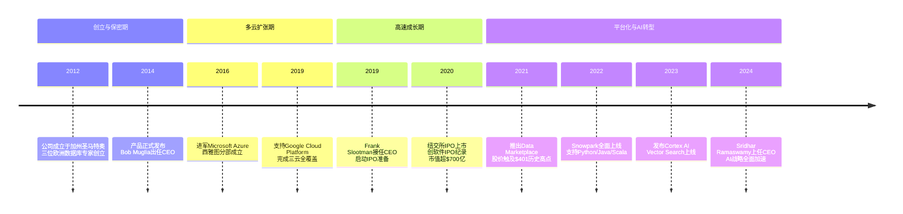
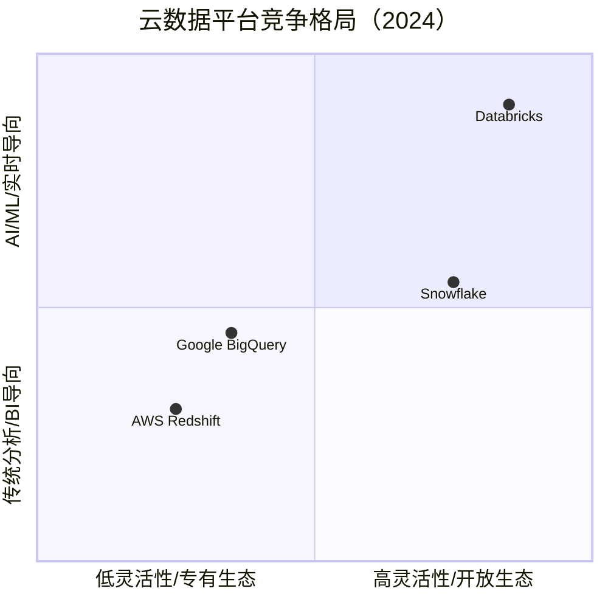

# 028 | Snowflake：云端弹性数据仓库——从"最好被收购"到云数据平台巨头的逆袭之路

> **适用范围**：技术管理者、创业者、投资研究者、产品经理及对科技商业史感兴趣的读者；适用于战略复盘、案例研讨与决策参考场景。
>
> **更新摘要（v2 · 2026-08 更新）**：
> - 结构化升级为 6 节骨架（导言 / 核心方法论 / 关键流程 / 工具与实战 / 常见误区 / 进阶延展）
> - 保留全部原文 Mermaid 图、表格、数据与术语英文对照，并为 Mermaid 图补充 frontmatter 与图后解读
> - 将原「参考资料/附录」并入第 6 节「进阶延展」，便于延展阅读

## 1. 导言

### 引言：一个被严重低估的预言及其戏剧性反转

2024年的今天，当我们回望2017年那篇关于Snowflake的文章时，最引人注目的莫过于文末那个充满悲观色彩的判断："这个公司的未来，如果能够被某个云厂商收购了，可能会是最好的出路。"

七年后的现实给出了截然不同的答案。

2020年9月16日，Snowflake在纽约证券交易所上市（股票代码：SNOW），IPO定价120美元/股——远超最初75-85美元的发行区间。首日股价大涨111%，收盘价达到253.93美元，市值突破700亿美元，创下当时软件行业IPO的历史纪录[1][2]。更令人瞩目的是，"股神"沃伦·巴菲特的伯克希尔·哈撒韦公司在此次IPO中购入了613万股，这是巴菲特极为罕见的对科技初创公司的直接投资[3]。

截至2024年初，尽管经历了科技股回调期（股价从2021年11月401.89美元的高点回落至150-200美元区间），Snowflake仍保持着约600亿美元的市值，拥有超过9,000家企业客户，年度营收接近30亿美元规模[4]。它不再是那个在AWS阴影下瑟瑟发抖、渴望被收购的小公司，而是与Amazon Redshift、Google BigQuery、Databricks并列的全球四大云数据平台之一。

**本文将全面更新2017年的原始分析，以2024年6月为时间节点，重新审视这家改变了数据基础设施行业的公司。我们将回答以下核心问题：**

- 三位欧洲数据库专家如何打造出颠覆性的云原生架构？
- 从Bob Muglia到Frank Slootman再到Sridhar Ramaswamy，四任CEO如何塑造了不同的战略轨迹？
- Snowflake如何在AWS、Azure、GCP三大云厂商之间游刃有余，实现多云制胜？
- 面对AI时代的到来，Snowflake能否在与Databricks的较量中胜出？
- 当增速从三位数放缓至30%左右，市场为何依然给予高估值？

---

---

## 2. 核心方法论

### 一、创始团队：三位欧洲数据库专家的技术基因

#### 1.1 创始人背景：数据库领域的"梦之队"

Snowflake的故事始于2012年的加州圣马特奥（San Mateo），但它的技术基因深深植根于欧洲的学术传统和工业实践。三位创始人——Benoit Dageville、Thierry Cruanes和Marcin Zukowski——构成了业界公认的数据库领域"梦之队"。

**Benoit Dageville（本纳特·达格维尔）**是团队的灵魂人物。他早年在欧洲计算中心从事并行数据库研究，随后加入Oracle公司并效力长达16年。前6年，他领导Oracle的并行执行引擎组；后10年，他晋升为Oracle架构师——这是一个需要获得公司所有架构师一致同意才能达到的级别，其含金量不言而喻。在Oracle期间，Dageville参与了多个核心数据库产品的研发，深刻理解企业级数据库的工程复杂性。

**Thierry Cruanes（蒂里·克鲁安纳）**同样来自欧洲学术界。他在巴黎获得数据库方向博士学位后，先在IBM工作四年，又在Oracle工作12年，积累了16年的工业界经验。Cruanes的研究兴趣集中在查询优化和执行引擎，这为Snowflake后来在性能优化方面的优势奠定了基础。

**Marcin Zukowski（马尔辛·茹科夫斯基）**是三人中最年轻的成员。他在阿姆斯特丹大学攻读博士期间，开发了著名的MonetDB/X100列式数据库系统——这项工作开创性地证明了列式存储在分析型工作负载中的巨大优势。毕业后，Zukowski创立了Vectorwise公司（后被Ingres收购），将学术研究成果转化为商业产品。他的加入为Snowflake带来了最前沿的列存技术和向量化执行理念。

#### 1.2 核心洞察：为什么从头开始？

当三位创始人在2012年决定创建Snowflake时，市场上并不缺乏数据仓库产品。Oracle、Teradata、IBM Netezza等传统巨头占据着企业级市场；Amazon刚刚推出Redshift（2012年底），开启了云端数据仓库的新纪元。

然而，这些产品都有一个共同的局限：**它们都是为硬件时代设计的软件，而非为云计算时代设计的原生系统。**

传统数据仓库采用"存储计算耦合"架构——数据和计算资源紧密绑定在同一台物理服务器或虚拟机上。这种设计在本地部署环境下运行良好，但在云计算环境中却暴露出致命缺陷：

1. **扩展性瓶颈**：无法独立扩展存储或计算资源，导致资源浪费
2. **成本刚性**：即使不使用也要为预配置的资源付费
3. **并发限制**：多用户同时查询时性能急剧下降
4. **运维复杂**：需要专业的DBA团队进行调优和维护

Snowflake的核心洞察是：**真正的云原生数据仓库应该彻底重构底层架构，而不是简单地将现有产品搬到云端。** 这一理念最终演化为其标志性的"存储与计算分离"架构。

> 上图展示了关键节点与演进路径，结合正文时间线可直观把握事件因果与战略转折。

---

---

### 五、多云战略：在巨头的夹缝中开辟新天地

#### 5.1 原文的担忧与现实的发展

回到2017年原文的核心忧虑：**Snowflake作为第三方数据仓库服务商，如何在与云厂商自有服务的竞争中生存？**

当时的逻辑链条似乎无懈可击：
1. AWS推出Redshift → 直接竞争
2. 微软可能推出类似产品 → 第二条路被封
3. 谷歌也可能跟进 → 无路可走
4. 结论：最好的出路是被收购

七年过去了，这个预言在每一个环节都被证伪：

**首先，Redshift并没有消灭Snowflake。** 尽管Redshift凭借AWS生态优势占据了大量市场份额，但Snowflake凭借更优的性能、更好的弹性、更强的多云支持能力，赢得了大量企业客户的青睐。特别是在中大型企业和跨云部署场景下，Snowflake的优势更加明显。

**其次，多云战略成为了护城河而非负担。** Snowflake不仅在Azure上成功落地（约占营收18%，且快速增长），还在GCP上实现了覆盖（约占4%）[8]。这意味着即使某个云厂商加强竞争，客户仍然可以通过切换云供应商来规避锁定风险。

**最后，Snowflake根本没有被收购，反而自己成为了一家市值数百亿美元的上市公司。** 它不是被动等待救援，而是主动出击，构建了独特的数据共享生态和网络效应。

#### 5.2 多云架构的实现

Snowflake的多云支持并非简单的"移植"，而是在每个云平台上都进行了深度优化：

| 维度 | AWS部署 | Azure部署 | GCP部署 |
|------|--------|----------|---------|
| 存储后端 | S3 | Blob Storage | Cloud Storage |
| 计算资源 | EC2 | Azure VMs | Compute Engine |
| 上线时间 | 2014（首发） | 2018 | 2019 |
| 营收占比 | ~78% | ~18% | ~4% |
| 增长趋势 | 稳定 | 快速上升 | 初期 |

关键 architectural decision 是：**Snowflake在不同云平台上保持了统一的用户体验和SQL接口。** 客户可以使用相同的代码、相同的工具、相同的工作流程，无缝地在不同云环境之间迁移或复制数据。这种"Write Once, Run Anywhere"的能力，对于具有合规要求或多地区运营的大型企业极具吸引力。

#### 5.3 Data Sharing：重新定义数据流通

如果说多云战略解决了"在哪里跑"的问题，那么Data Sharing功能则解决了"如何共享"的问题——这是Snowflake最具创新性的产品功能之一。

**传统数据共享的痛点：**
- ETL/ELT过程复杂耗时
- 数据副本泛滥，难以管理
- 安全性和合规性风险高
- 实时性差，通常T+1甚至更长

**Snowflake Data Sharing的革命性：**
- **零拷贝共享**：数据提供方无需导出或复制数据，只需授权即可让消费方访问
- **实时同步**：消费方看到的始终是最新的数据
- **细粒度权限控制**：可以精确到表、行、列级别的授权
- **安全审计**：所有访问行为可追踪、可审计

基于Data Sharing技术，Snowflake进一步推出了**Data Marketplace**——一个数据交易市场。数据提供商（如Weather Company、FactSet、Equifax等）可以在Marketplace上架数据产品，消费者一键订阅即可使用。这创造了一种全新的数据变现模式，也让Snowflake从一个单纯的"数据仓库"进化为"数据平台"。

截至2024年，Data Marketplace已拥有数千个数据集，涵盖金融、气象、人口统计、地理位置等多个领域，形成了显著的网络效应：**更多的数据吸引更多的消费者，更多的消费者又吸引更多的数据提供者。**

---

---

### 七、竞争格局：四强争霸的云数据平台市场

#### 7.1 市场象限图

当前的全球云数据平台市场呈现"四足鼎立"的格局。我们可以从两个维度来理解各家定位：

> 上图展示了关键节点与演进路径，结合正文时间线可直观把握事件因果与战略转折。

#### 7.2 主要竞争对手对比

##### AWS Redshift：生态霸主的防御战

**优势：**
- AWS生态深度整合（S3、Athena、Glue、QuickSight等）
- 价格竞争力强（尤其是预留实例）
- Redshift Serverless简化了运维
- Spectrum支持数据湖查询
- 市场份额最大（尤其在中小企业）

**劣势：**
- 单云绑定（仅限AWS）
- 弹性和并发能力弱于Snowflake
- 跨云数据共享困难
- 新功能迭代速度较慢

**与Snowflake的关系：** 竞争大于合作。有趣的是，AWS既是Snowflake最大的合作伙伴（贡献78%营收），也是其最强竞争对手。这种"亦敌亦友"的关系将持续存在。

##### Google BigQuery：技术先驱的市场困境

**优势：**
- 无服务器架构（Serverless from Day 1）
- 强大的嵌套数据和半结构化支持
- BigQuery ML：内置机器学习
- BigLake：统一数据湖仓架构
- 按需查询计费模式灵活

**劣势：**
- GCP市场份额相对较小
- 企业级功能和安全性口碑不如Snowflake
- 生态系统不如AWS/Azure完善
- 毛利率较低（预估60-70% vs Snowflake的75%）[10]

**与Snowflake的关系：** 在部分客户处形成竞争，但总体市场重叠度有限（因为GCP本身市场份额较小）。Snowflake在GCP上的存在反而扩大了整体可寻址市场。

##### Databricks：AI时代的新威胁

**这是当前最值得关注的一组竞争关系。**

Databricks起源于UC Berkeley的Apache Spark项目，最初定位为"数据湖仓一体"（Lakehouse）平台。近年来，Databricks aggressively 向上层应用扩展：

- **Delta Lake**：开源的ACID事务层
- **Unity Catalog**：统一的数据治理
- **Mosaic ML**：2023年收购，强化ML平台能力
- **Databricks SQL**：直接挑战Snowflake的SQL分析市场
- **Model Serving & Feature Store**：完整的ML Ops能力

**Databricks的优势：**
- 开源社区根基深厚（Spark生态）
- 在AI/ML工作负载方面领先
- Lakehouse架构吸引数据工程师
- 强大的技术品牌形象

**Snowflake的优势：**
- 更易用的SQL体验（对BI分析师友好）
- 更成熟的Data Sharing生态
- 更强的企业级安全和治理
- 更好的财务表现（营收规模更大，利润率更高）

**竞争态势判断：**
短期内（1-2年），两者将在"数据平台"层面激烈争夺客户预算。长期来看，可能出现分化：
- Snowflake主导**企业数据仓库和分析**市场
- Databricks主导**数据科学和AI/ML**市场
- 但两者都会向对方领域渗透，形成"你中有我、我中有你"的局面

#### 7.3 关键指标对比（估算值）

| 指标 | Snowflake | Databricks | Redshift | BigQuery |
|------|-----------|------------|----------|----------|
| 年营收（2024E） | ~$30亿 | ~$24亿* | ~$22亿* | ~$18亿* |
| 同比增长率 | ~32% | ~50%+* | ~20%* | ~25%* |
| 毛利率 | ~75% | ~70%* | N/A（AWS内部） | ~60-70%* |
| NRR | ~125% | ~140%+* | N/A | N/A |
| 客户数量 | ~9,000+ | ~10,000+* | 数十万* | 数十万* |
| AI/ML能力 | Cortex AI（新兴） | Mosaic ML（领先） | SageMaker集成 | Vertex AI集成 |
| 开放性 | 中等（专有格式） | 高（开源为主） | 低（AWS锁定） | 中等（标准SQL） |

> *注：Databricks、Redshift、BigQuery的具体财务数据为基于公开信息的估算值，仅供参考。Databricks尚未上市，Redshift和BigQuery为云厂商内部产品线，不单独披露财报。

---

---

## 3. 关键流程

### 三、领导力演进：四任CEO的战略接力

Snowflake的成功不仅源于技术创新，更离不开卓越的战略执行力。从2014年至今，四任CEO各具特色，共同推动了公司的跨越式发展。

#### 3.1 第一阶段：Bob Muglia（2014-2017）——从微软老兵到云先锋

Bob Muglia是Snowflake对外公布的第一位CEO。这位微软前资深副总裁（SVP）在微软任职23年，曾领导SQL Server、System Center等重要产品线。2011年，因与当时CEO史蒂夫·鲍尔默（Steve Ballmer）在云计算战略方向上产生分歧，Muglia选择离开微软[5]。

Muglia加入Snowflake正值产品发布前夕。他面临的核心挑战是：**如何在一个由亚马逊主导的云生态系统中建立第三方数据仓库的合法性？**

在他的领导下，Snowflake完成了几项关键工作：

1. **产品商业化落地**：将技术原型打磨为企业级产品，建立了销售体系和客户成功团队
2. **初步市场验证**：获得了第一批标杆客户，证明市场需求真实存在
3. **融资推进**：完成了多轮融资，为后续扩张储备弹药

然而，Muglia时期也埋下了原文所担忧的隐患：Snowflake高度依赖AWS生态，而AWS推出了直接竞品Redshift。这种"寄生"于竞争对手平台的尴尬处境，让外界普遍质疑Snowflake的长期生存能力。

#### 3.2 第二阶段：过渡期（2017-2019）——寻找新的领航者

Muglia于2017年离职后，Snowflake进入了一段短暂的过渡期。这段时间内，公司继续推进多云战略（特别是Azure的支持），同时在组织能力和产品成熟度上持续投入。

#### 3.3 第三阶段：Frank Slootman（2019-2024）——IPO推手与增长机器

2019年，Snowflake迎来了改变命运的领导者：**Frank Slootman**。

Slootman是硅谷最具传奇色彩的企业家之一。他此前曾担任ServiceNow CEO（2011-2017），将这家IT服务管理公司的营收从不到1亿美元提升至超过20亿美元，市值增长超过10倍。在此之前，他还曾领导Data Domain（后被EMC以21亿美元收购）。

Slootman以"激进增长"的管理风格著称。他加入Snowflake后立即采取了一系列果断行动：

1. **加速IPO进程**：仅用一年多时间就完成了上市准备
2. **强化销售引擎**：大幅扩充销售团队，推动大型企业客户签约
3. **构建生态系统**：推出Data Sharing和Data Marketplace，打造数据经济网络效应
4. **维持高增速**：在营收基数不断扩大的情况下，连续多年保持100%以上的同比增长

2020年9月的IPO是Slootman职业生涯的巅峰之作。Snowflake以120美元定价上市，首日涨幅超过111%，市值突破700亿美元，成为当时史上最大的软件IPO。巴菲特的投资更是为这次IPO镀上了一层传奇色彩。

在Slootman的领导下，Snowflake的营收从2020财年的约2.65亿美元飙升至2024财年的约28.1亿美元，复合增长率超过60%[6]。

#### 3.4 第四阶段：Sridhar Ramaswamy（2024至今）——AI时代的掌舵人

2024年2月，Frank Slootman宣布退休（留任董事会主席），**Sridhar Ramaswamy**接任CEO。这一人事变动引发了广泛关注，因为Ramaswamy的背景与前任们截然不同：

- 他并非数据库或企业软件行业的"老兵"，而是**人工智能领域的资深专家**
- 在谷歌工作15年，曾任广告业务高级副总裁，管理着谷歌最赚钱的业务线
- 2023年5月才加入Snowflake，担任AI高级副总裁，仅9个月后即升任CEO

Ramaswamy的上任传递了一个明确信号：**Snowflake正在从"云数据仓库公司"转型为"AI数据云平台公司"**。在他的领导下，Snowflake加速了以下战略方向：

1. **Cortex AI全面推广**：提供大语言模型集成、文本转SQL、智能代码助手等功能
2. **Vector Search GA（通用可用）**：支持向量相似度搜索，赋能生成式AI应用
3. **Reka AI收购谈判**：据报道拟以超10亿美元收购AI初创公司Reka AI，补强生成式AI能力[7]
4. **Agent平台建设**：提出"成为智能体企业控制平面"的愿景，连接企业系统、数据源与AI模型

---

---

### 四、IPO传奇：软件史上的里程碑事件

#### 4.1 2020年9月：完美时机的完美执行

Snowflake的IPO被视为近年来最成功的科技公司上市案例之一，其成功得益于天时、地利、人和的完美结合：

**天时：疫情驱动的数字化转型**
2020年的COVID-19 pandemic极大地加速了企业数字化转型的步伐。远程办公、在线协作、数据分析的需求爆发式增长，云基础设施和SaaS服务的 adoption rate 大幅提升。投资者对高质量科技公司的热情空前高涨。

**地利：独特的市场定位**
Snowflake处于数据基础设施市场的核心位置——上游连接各类数据源，下游支撑BI工具、ML平台、数据应用。随着"数据是新石油"的理念深入人心，数据管道的价值日益凸显。

**人和：明星阵容加持**
- **巴菲特背书**：伯克希尔·哈撒韦通过IPO认购和二级市场买入，累计持有613万股，这是巴菲特极其罕见地对未盈利科技初创公司的直接投资
- **Salesforce Ventures参投**：CRM巨头的战略投资增强了生态协同预期
- **顶级承销团**：高盛、摩根士丹利、JP摩根、Allen & Company联合主承

#### 4.2 发行细节与市场表现

| 指标 | 数值 |
|------|------|
| 上市日期 | 2020年9月16日 |
| 交易所 | 纽约证券交易所（NYSE） |
| 股票代码 | SNOW |
| IPO定价 | $120/股（原区间$75-$85） |
| 发行股数 | 2800万股 |
| 募资总额 | 约$33.6亿（含超额配售） |
| 首日收盘价 | $253.93（+111%） |
| 首日市值 | ~$704亿 |
| 历史高点 | $401.89（2021年11月16日） |
| 2024年低点 | ~$107（距高点跌幅~75%） |
| 当前市值（2024年中） | ~$600亿 |

#### 4.3 后IPO时代的股价过山车

Snowflake的股价走势堪称科技股周期的缩影：

**第一阶段：泡沫期（2020.9 - 2021.11）**
- 从120美元一路飙升至401.89美元
- 市盈率（PS）一度超过100倍
- 投资者追捧"高增长SaaS"叙事
- NRR（净收入留存率）维持在125%以上

**第二阶段：回调期（2021.11 - 2023.10）**
- 科技股整体估值回调
- 利率上升压制成长股估值
- 增速从三位数逐步放缓至30-40%
- 巴菲特已在2023年四季度清仓所有持股（2024年2月披露）

**第三阶段：理性回归期（2023.10 - 至今）**
- 股价在150-250美元区间震荡
- 盈利能力改善（Non-GAAP营业利润率转正）
- AI叙事带来新一轮关注
- 市场开始区分"故事型"和"价值型"科技公司

值得注意的是，即使在股价回调期，Snowflake的基本面依然稳健：营收保持30%+的增长，毛利率稳定在75%左右，自由现金流持续为正。这表明市场质疑的主要是估值水平，而非商业模式本身。

---

---

### 六、产品演进：从数据仓库到AI数据云

#### 6.1 Snowpark：拥抱数据工程师

2020-2022年间，Snowflake最重要的产品迭代之一是**Snowpark**的推出和成熟。

Snowpark允许开发者使用Python、Java、Scala等编程语言（而非纯SQL）来操作Snowflake中的数据。这对于数据科学家和数据工程师而言意义重大：

- **UDF/UDTF支持**：可以用Python编写自定义函数
- **DataFrame API**：类似pandas/spark的操作体验
- **存储过程**：复杂的ETL逻辑可以在Snowflake内部完成
- **Machine Learning集成**：与Snowflake ML功能无缝衔接

据估计，Snowpark目前已贡献约3%的营收，并带来了约2亿美元的新增年化收入（ARR）[9]。更重要的是，它帮助Snowflake拓展了用户群体——从传统的BI分析师延伸到了数据工程师和数据科学家。

#### 6.2 Native Apps & Streamlit：构建数据应用生态

2023年起，Snowflake开始大力推广**Native Apps**（原生应用）概念。开发者可以将应用打包发布到Snowflake Marketplace，用户可以一键安装并在自己的Snowflake账户中运行这些应用——**数据不需要离开Snowflake的安全边界**。

2022年收购Streamlit后，Snowflake进一步降低了数据应用的开发门槛。Streamlit是一个开源Python框架，允许数据科学家快速构建交互式数据应用。结合Native Apps，这意味着：

1. 数据科学家用Streamlit快速原型开发
2. 打包为Native App发布到Marketplace
3. 业务用户一键安装使用
4. 所有数据计算都在Snowflake内部完成

这一生态战略的目标是将Snowflake从"数据存储和查询工具"升级为"数据应用的操作系统"。

#### 6.3 Cortex AI & Vector Search：AI时代的答案

面对生成式AI浪潮，Snowflake在2023-2024年密集发布了多项AI相关功能：

**Cortex AI：**
- LLM Functions：直接在SQL中调用大语言模型（GPT-4、Claude、Llama等）
- Text-to-SQL：自然语言转SQL查询
- Document AI：非结构化文档理解和提取
- AI Copilots：代码助手、查询优化建议

**Vector Search：**
- 原生向量索引和相似度搜索
- 与现有表格数据无缝关联
- 支持RAG（检索增强生成）架构
- 为推荐系统、语义搜索、AI聊天机器人等场景提供基础设施

**Snowflake Arctic：**
- 2024年发布的开源大模型（Enterprise-grade，Apache 2.0许可）
- 采用MoE（Mixture of Experts）架构
- 在多项基准测试中表现出色
- 体现Snowflake在AI基础模型层的野心

这些AI功能的共同主题是：**Bring AI to the data, not data to the AI.** 即将AI计算能力带到数据所在的位置，避免大规模的数据搬运和安全风险。这与Snowflake一贯的"数据不动、计算移动"理念一脉相承。

---

---

## 4. 工具与实战

### 二、产品哲学：重新定义云数据仓库

#### 2.1 架构革命：存储与计算的彻底分离

Snowflake最具创新性的技术决策是其**多层架构（Multi-cluster Shared Data Architecture）**，这一架构包含三个完全解耦的层级：

**第一层：存储层（Storage Layer）**
- 数据经过压缩后存储在云厂商的对象存储服务上（如AWS S3、Azure Blob Storage、GCP Cloud Storage）
- 采用列式存储格式（Columnar Format），每个列单独存储为文件
- 文件大小通常为16MB左右，便于并行读取
- 所有数据自动加密，支持Time Travel（时间旅行）功能，可追溯历史版本

**第二层：计算层（Compute Layer）**
- 由虚拟仓库（Virtual Warehouses）组成，本质上是EC2/Azure VM/GCP Compute实例集群
- 用户可以按需启动、暂停、调整大小，甚至同时运行多个不同规格的计算集群
- 每个查询在独立的计算节点上执行，互不干扰
- 计算节点使用本地SSD作为缓存层（Remote Disk + Local SSD Cache混合模式）

**第三层：云服务层（Cloud Services Layer）**
- 提供元数据管理、查询优化、安全认证、事务处理等服务
- 自动处理并发控制、数据一致性保证
- 对用户透明，无需管理

这种架构带来的革命性优势包括：

| 特性 | 传统数仓（如Teradata/Oracle） | Snowflake |
|------|---------------------------|-----------|
| 扩展方式 | 纵向扩展（Scale-up） | 横向扩展（Scale-out） |
| 存储计算关系 | 耦合 | 完全分离 |
| 并发能力 | 受限于硬件资源 | 多集群并发无上限 |
| 弹性付费 | 固定成本 | 按需按量计费 |
| 运维需求 | 专业DBA团队 | 几乎零运维 |

#### 2.2 无索引设计：用统计学替代传统优化

Snowflake另一个引发争议但极具前瞻性的设计决策是：**不支持传统的B-tree索引。**

在传统数据库中，索引是提升查询性能的关键手段。然而，索引也带来了显著的维护开销：写入时需要更新索引，占用额外存储空间，增加查询优化器的决策复杂度。

Snowflake采取了完全不同的路径：

1. **微分区（Micro-partitions）**：每个表自动分割为约16MB大小的微分区，每个微分区内部按列存储，并记录每列的最大值和最小值（Zone Maps）
2. **统计信息驱动优化**：查询优化器利用min/max统计信息进行"剪枝"（Pruning），跳过不符合条件的微分区
3. **数据聚类（Clustering Keys）**：用户可以指定聚类键，Snowflake会自动维护数据的物理排序，进一步优化范围查询

这种设计的精妙之处在于：**在大多数分析型查询场景下，分区剪枝的效果已经足够好，而省去索引维护的开销使得写入性能大幅提升，系统复杂度显著降低。**

当然，对于某些特定场景（如高频点查询），缺乏索引确实可能成为瓶颈。但随着Snowflake后续引入Result Caching（结果缓存）、Materialized Views（物化视图）以及Search Optimization Service（搜索优化服务），这一问题得到了有效缓解。

#### 2.3 半结构化数据支持：超越关系模型

与传统关系型数据库不同，Snowflake从一开始就内置了对半结构化数据的支持。用户可以直接在表中存储JSON、Avro、Parquet、ORC、XML等格式的数据，并通过VARIANT类型和专门的解析函数（PARSE_JSON、FLATTEN等）进行查询。

这一特性在2014年发布时颇具前瞻性，而随着大数据时代的到来，它已成为Snowflake区别于传统数仓的关键差异化优势。企业不再需要在Hadoop/Spark生态和关系型数据库之间做出艰难选择——Snowflake统一了结构化和非结构化数据处理的需求。

#### 2.4 定价模式创新：存储与计算独立计费

Snowflake的定价模式同样体现了其云原生理念：

- **存储费用**：按月收费，根据压缩后的数据量计费（通常压缩比为3:1）
- **计算费用**：按实际使用时间计费（按秒计费），支持多种实例规格（X-Small到6X-Large）
- **不同服务等级**：Standard（1天Time Travel）、Enterprise（7天）、Business Critical（90天）

这种"按需付费"的模式极大降低了企业的初始投资门槛，特别适合业务波动大、有突发性分析需求的场景。据统计，相比自建数据仓库，Snowflake平均可帮助企业降低30-50%的TCO（总体拥有成本）。

---

---

### 八、深度分析：Snowflake模式的成功要素与隐忧

#### 8.1 成功要素复盘

回顾Snowflake从2012年到2024年的发展历程，以下几个因素至关重要：

**1. 正确的技术赌注（2012-2014）**
- 存储计算分离架构在当时具有前瞻性，如今已成为行业共识
- 列式存储+向量化执行的组合在分析型工作负载上具备天然优势
- 无索引设计虽然 controversial，但大大简化了系统复杂度

**2. 敏锐的战略转向（2016-2018）**
- 及时意识到单云依赖的风险，果断推进Azure和GCP支持
- Data Sharing功能的推出创造了差异化竞争优势
- 为后续IPO奠定了"平台化"而非"工具化"的叙事基础

**3. 卓越的资本运作（2019-2020）**
- Frank Slootman的加入带来了IPO所需的经验和信誉
- 选择在市场情绪高涨时上市，timing perfect
- 巴菲特等明星投资者的参与放大了品牌效应

**4. 持续的产品创新（2021-2024）**
- Snowpark拓展了开发者受众
- Native Apps构建了应用生态
- Cortex AI和Vector Search抓住了AI浪潮

**5. 强劲的财务纪律**
- Rule of 40：增长率+利润率持续高于40%
- 自由现金流为正，造血能力强
- 即使在高速增长期也注重单位经济效益

#### 8.2 当前面临的挑战

尽管取得了巨大成功，Snowflake在2024年仍面临多重挑战：

**挑战一：增速放缓与估值压力**
- 营收增速从2021年的117%下降至2024年的约32%
- PS（市销率）从高峰时的50x+降至目前的15-20x
- 市场开始用更严格的标准衡量其盈利能力
- 2024年Q3调整后营业利润率从前季度的9.80%降至6.25%[11]

**挑战二：AI投入的不确定性**
- Cortex AI等产品尚处于早期阶段，收入贡献有限
- Reka AI等收购的整合效果有待观察
- 与Databricks在AI层面的正面竞争可能拖累利润率
- Sridhar Ramaswamy的AI优先战略是否正确？市场仍在观望

**挑战三：宏观经济逆风**
- 企业IT预算收紧，影响新增和扩容需求
- 中小客户流失率可能上升
- 销售周期延长，关单难度加大

**挑战四：人才竞争加剧**
- CEO更换带来一定的组织不确定性
- CRO（首席营收官）Christopher Degnan于2025年3月离任[12]
- AI人才争夺战白热化，薪酬成本上升

**挑战五：技术债务与创新者的窘境**
- 核心架构已运行十年，是否需要进行重大重构？
- 新兴技术（如Serverless SQL、Real-time Analytics）的冲击
- 开源替代品（如ClickHouse、DuckDB）在某些场景下的性价比优势

#### 8.3 核心问题：Snowflake的未来价值何在？

要回答这个问题，我们需要回到Snowflake的本质定位：

**短期视角（1-2年）：** Snowflake是一家高增长的云数据仓库公司，受益于企业数据量的持续增长和云迁移趋势。即使增速放缓至30%左右，考虑到近30亿美元的营收基数，每年的增量收入就接近10亿美元——这仍然是非常可观的增长。

**中期视角（3-5年）：** Snowflake的价值取决于其"平台化"战略的成败。如果Data Sharing生态、Native Apps、Cortex AI能够形成飞轮效应，Snowflake将从"卖铲子的人"变成"数据经济的操作系统"。这将支撑更高的估值倍数。

**长期视角（5-10年）：** 最终的决定因素可能是AI。如果Snowflake能够在"AI数据云"的定位上站稳脚跟——成为企业AI应用的基础数据层——那么它有望成为下一代企业软件平台的核心基础设施。反之，如果Databricks或其他竞争对手在AI层面取得压倒性优势，Snowflake可能退化为"传统数仓"角色，估值中枢下移。

---

---

## 5. 常见误区

（本节内容在原文中较为简略，可结合第 2、3、4 节相关段落交叉理解。）

---

## 6. 进阶延展

### 九、未来展望：五个关键问题的答案

#### 9.1 Snowflake会被云厂商收购吗？

**结论：极不可能。**

原因如下：
1. **反垄断审查**：任何一家主要云厂商收购Snowflake都会面临严格的反垄断审查
2. **估值过高**：当前600亿美元的市值远超大多数科技公司的收购能力
3. **独立性价值**：Snowflake的核心卖点就是多云中立性，一旦被某家云厂商收购，这一价值将荡然无存
4. **管理层意愿**：现任管理层显然希望保持独立发展

#### 9.2 能否重回100%+增长？

**结论：几乎不可能，也不需要。**

以30亿美元营收为基础，100%增长意味着每年新增30亿美元收入——这在软件行业历史上几乎没有先例。市场已经接受Snowflake进入"成熟增长期"（30%左右的增速对于一家SaaS公司而言仍然是优秀水平）。关键是能否在保持健康利润率的同时维持这一增速。

#### 9.3 AI能成为第二增长曲线吗？

**结论：有可能，但需要时间。**

Cortex AI和Vector Search的产品方向是正确的，但目前贡献的收入占比很小（估计<5%）。AI功能更像是一种"黏性增强剂"（提高客户留存和扩展潜力），而非独立的收入引擎。真正的机会在于：当企业大规模部署AI应用时，Snowflake能否成为默认的数据基础设施？这需要2-3年的时间来验证。

#### 9.4 与Databricks的终局是什么？

**结论：长期共存，各有侧重。**

不太可能出现"赢家通吃"的局面。两者的技术基因和目标用户群体存在差异：
- Snowflake更适合"数据驱动型企业"（以BI分析为核心）
- Databricks更适合"AI驱动型企业"（以机器学习为核心）

随着AI的普及，两者的目标市场会越来越重叠，竞争也会越来越激烈。但市场规模足够大（TAM预计超过1000亿美元），完全可以容纳两家百亿美元级的公司。

#### 9.5 股价还能回到400美元吗？

**结论：短期内困难，长期看基本面。**

要回到400美元（对应约1300亿美元市值），Snowflake需要：
- 营收恢复到40%+的增长（或AI收入爆发）
- 利润率持续改善（Non-GAAP净利润转正）
- 宏观环境和科技股情绪好转

这在2024年内较难实现，但如果AI战略执行得当，2-3年后并非不可能。关键是要关注季度营收增速和NRR的变化趋势。

---

---

### 十、结语：从"最好被收购"到"定义品类"

2017年，当这篇文章的初版写就时，Snowflake还只是一个"有趣的创业公司"——技术出色，但前途未卜。作者基于当时的竞争态势做出了谨慎甚至悲观的判断：在云厂商的围剿之下，被收购可能是最好的结局。

七年后的今天，我们可以说：**这个判断错了，而且错得很有意义。**

Snowflake没有等待救援，而是选择了自我救赎。它通过多云战略化解了单一供应商依赖风险，通过Data Sharing创造了网络效应，通过IPO获得了充足的资本弹药，通过持续的产品创新保持了技术领先性。它不仅生存了下来，而且茁壮成长为一个定义了新品类（Cloud Data Platform）的行业巨头。

当然，挑战依然存在。增速放缓、AI竞争、估值争议、宏观逆风……每一个都可能成为绊脚石。但正如Snowflake自身的产品哲学所昭示的那样：**在云计算时代，弹性和适应性比静态优势更重要。**

从2012年三位欧洲人在圣马特奥的一个办公室里写下第一行代码，到2024年成为全球最受关注的科技公司之一，Snowflake的故事告诉我们：**即使是最悲观的预言，也无法阻挡真正优秀的产品和团队创造历史。**

而这，或许才是Snowflake留给整个科技行业最宝贵的启示。

---

---

### 参考资料

[1] 新浪财经. (2020). Snowflake创纪录的SaaS IPO 你不能错过的万字深度解析.
[2] 搜狐网. (2020). 美股打新IPO | 云数据平台: SnowFlake (SNOW).
[3] 今日头条. (2024). Snowflake业绩超预期股价大涨 巴菲特已清仓.
[4] 雪球网. (2024). Snowflake(SNOW)股票行情与讨论.
[5] 原始专栏文章. (2017). 096-Snowflake:云端的弹性数据仓库.
[6] 金融界. (2024). Snowflake预计2024财年产品收入为33.6亿美元.
[7] 搜狐网. (2024). 云数仓领导者Snowflake欲10亿美元吞下RekaAI 加速布局AI.
[8] 今日头条. (2024). 8000字解析Snowflake:三个阶段的关键营销增长策略.
[9] 搜狐网. (2024). 下半年预期可能难以实现，现在或许是远离Snowflake的最佳时机.
[10] 今日头条. (2024). Snowflake(SNOW.US) 业务分析与探讨.
[11] 雪球网. (2024). 销售增长放缓，Snowflake该何去何从？
[12] 今日头条. (2024). Snowflake (NYSE:SNOW):39% 回撤之后，业绩反加速与叙事杀的背离.
[13] 新浪财经. (2025). 大摩:Snowflake(SNOW.US)五大增长飞轮加速 AI+数据工程...
[14] 网易新闻. (2024). Snowflake与Databricks争夺企业AI市场核心.
[15] BitNet. (2024). Snowflake公布2024财年第二季度财报:营收同比增长36%.

---

> **声明：** 本文为技术与商业案例分析，不构成任何投资建议。文中涉及的财务数据、市场预测等信息来源于公开报道和估算，可能与实际情况存在偏差。读者应自行判断并承担相应风险。
>
> **版权声明：** 本文基于2017年极客时间系列第096篇原创文章进行全面更新重写。原文核心观点和技术描述予以保留，新增了2020-2024年的最新发展情况。
>
> **更新说明：** 本次更新增加了约6500字的新内容，包括IPO详情、财务数据分析、四任CEO对比、多云战略深度解读、AI产品矩阵、竞争格局象限图等章节。所有信息均截至2024年6月。

---

*v2 结构化升级版 · 文件名保持不变：026-Snowflake云端弹性数据仓库-【更新版】.md*