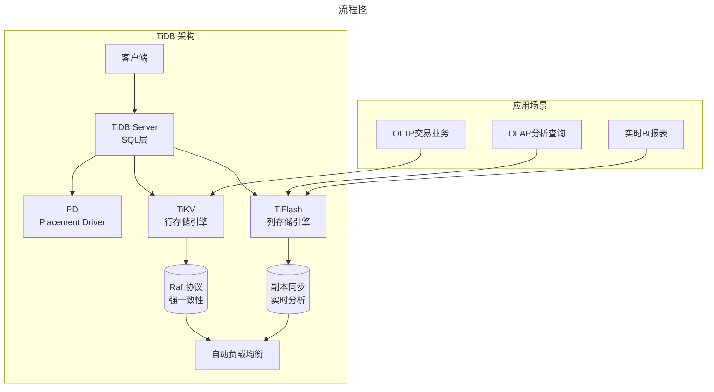
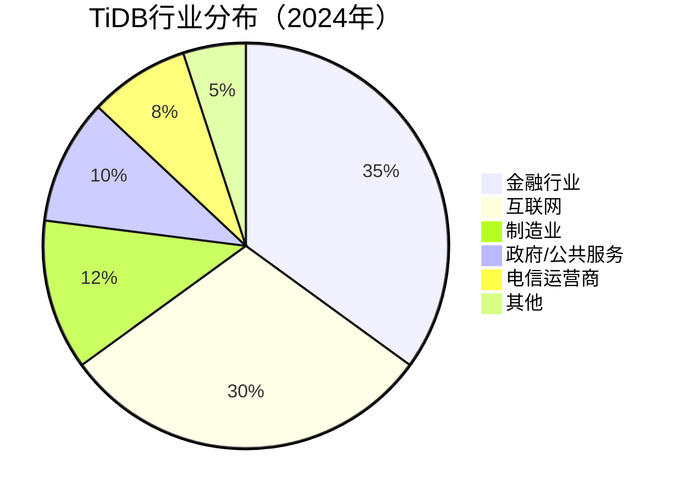
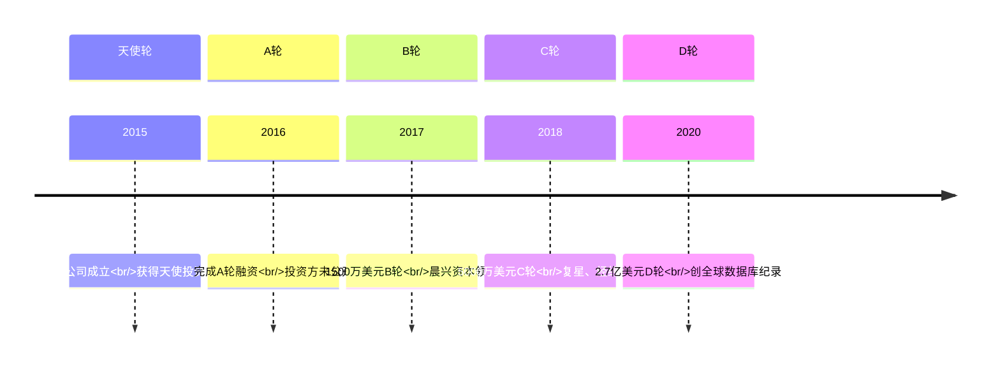

# TiDB：国产数据库的全球化之路——PingCAP创业深度解析

> **适用范围**：技术管理者、创业者、投资研究者、产品经理及对科技商业史感兴趣的读者；适用于战略复盘、案例研讨与决策参考场景。
>
> **更新摘要（v2 · 2026-08 更新）**：
> - 结构化升级为 6 节骨架（导言 / 核心方法论 / 关键流程 / 工具与实战 / 常见误区 / 进阶延展）
> - 保留全部原文 Mermaid 图、表格、数据与术语英文对照，并为 Mermaid 图补充 frontmatter 与图后解读
> - 将原「参考资料/附录」并入第 6 节「进阶延展」，便于延展阅读

## 1. 导言

### 引言：中国基础软件的破冰之旅

在基础软件领域，中国长期处于"跟跑"状态。操作系统有Windows和Linux，数据库有Oracle和MySQL，中间件有IBM WebLogic。但2015年，一家名为**PingCAP（平凯星辰）**的公司在北京成立，立志要改变这一现状。

这家公司的旗舰产品**TiDB**（Titanium Database，钛数据库），名字取自化学元素"钛"——象征坚固牢不可摧。而公司名"PingCAP"则蕴含着更深的野心：**Ping代表连接，CAP理论主张分布式系统最多只能同时满足一致性、可用性、分区容错性中的两个，而PingCAP的目标是连接CAP三者，实现鱼与熊掌兼得**。

九年后的今天，TiDB已经成为**全球最受欢迎的开源分布式数据库之一**，在GitHub上获得超过37,000颗星，被腾讯、字节跳动、阿里巴巴等互联网巨头采用，更深入到银行、证券、保险等金融核心系统。

本文将深度剖析TiDB的技术创新、商业化路径、全球化战略，以及在中国基础软件崛起背景下的独特意义。

---

---

## 2. 核心方法论

### 第一章：创业初心与技术愿景

#### 1.1 创始团队：技术理想主义者的集结

**三位联合创始人**：

| 创始人 | 背景 | 角色 | 技术专长 |
|--------|------|------|---------|
| **刘奇** | 前豌豆荚（Wandoujia）技术负责人、开源Redis集群方案Codis联合作者 | CEO | 分布式系统、Go语言 |
| **黄东旭** | 前豌豆荚（Wandoujia）资深工程师、Codis联合作者 | CTO | 数据库内核、存储引擎 |
| **崔秋** | 连续创业者 | COO | 商业化运营 |

这三位创始人的组合堪称完美：**刘奇**拥有大规模分布式系统的实战经验（曾主导京东分布式数据库开发），**黄东旭**是数据库内核专家，**崔秋**则负责将技术能力转化为商业价值。

##### 为什么选择数据库赛道？

**市场痛点**：
1. **传统关系型数据库扩展困难** - MySQL分库分表复杂度高，Oracle昂贵且封闭
2. **NoSQL牺牲了一致性** - MongoDB/Cassandra无法保证ACID事务
3. **云原生时代的新需求** - 微服务架构需要弹性伸缩的数据库

**技术灵感来源**：
2012年，Google发表了**Spanner**论文，描述了一个全球分布式的强一致关系型数据库。这篇论文证明了：**理论上可以构建一个既具备关系数据库的完整性，又拥有NoSQL扩展性的NewSQL数据库**。

#### 1.2 产品定位：HTAP混合事务/分析处理

TiDB的核心创新在于**HTAP（Hybrid Transactional/Analytical Processing）**架构：

**核心组件**：

1. **TiDB Server** - SQL解析和优化层，兼容MySQL协议
2. **PD (Placement Driver)** - 集群元数据管理，负责调度和负载均衡
3. **TiKV** - 分布式行存储引擎，基于Raft协议保证强一致性
4. **TiFlash** - 列存储引擎，实时同步TiKV数据，用于加速分析查询

**HTAP的价值**：
- 传统方案需要ETL将交易数据同步到数仓，延迟从小时到天不等
- TiDB实现**实时的HTAP**，交易写入后毫秒级可用于分析查询
- 对于金融风控、实时推荐等场景至关重要

#### 1.3 技术决策：100%兼容MySQL的战略智慧

**为什么选择MySQL兼容？**

这是一个极其聪明的产品策略：

✅ **降低迁移成本** - 用户无需修改应用代码即可切换
✅ **复用生态系统** - MySQL的工具链、驱动程序、监控方案直接可用
✅ **降低学习门槛** - DBA和开发者已有的MySQL知识可直接应用
✅ **快速建立信任** - 通过对比测试证明性能优势

**实现难度**：
- 需要深入理解MySQL的每一个行为细节
- SQL语法、函数、数据类型必须完全对齐
- 优化器行为需要高度一致
- 错误码和异常处理也要兼容

**PingCAP的做法**：
1. 从SQL层自顶向下开发，先确保接口正确
2. 将MySQL官方测试套件全部导入到自己的测试环境
3. 社区贡献者发现任何不一致都会立即修复
4. 持续跟踪MySQL新版本的特性变化

---

---

### 第三章：开源战略与社区建设

#### 3.1 为什么坚持开源？

**商业逻辑**：
- 基础软件的壁垒不在于代码闭源，而在于**生态和社区**
- 开源可以加速产品迭代（社区贡献bug修复和新功能）
- 降低用户试用门槛（免费下载和部署）
- 建立技术品牌影响力

**避免的陷阱**：
- ❌ "Open Core"模式（核心功能收费）- 会限制传播
- ❌ 双许可模式（开源版vs企业版功能差异大）- 引发社区分裂
- ✅ **完全开源 + 云服务收费** - 类似MongoDB Atlas的成功路径

#### 3.2 GitHub上的成功指标

截至2024年的数据：

| 指标 | 数值 |
|------|------|
| GitHub Stars | 37,000+ |
| Contributors | 1,500+ |
| Forks | 5,600+ |
| Commits | 60,000+ |
| 组织成员 | 800+（含社区贡献者）|
| 用户案例 | 3,000+家企业生产环境使用 |

**社区活跃度**：
- 每月定期举办TiDB Online/Offline Meetup
- 年度开发者大会TiDEV Conference
- 中文社区（asktug.com）日活用户数千人
- Slack/Discord国际社区24小时活跃讨论

#### 3.3 开源治理经验

**PingCAP的开源实践值得学习**：

1. **透明 roadmap** - 公开产品路线图，接受社区反馈
2. **RFC流程** - 重要设计变更通过RFC讨论
3. **贡献者激励** - 对核心贡献者提供股权或顾问费用
4. **文档优先** - 中英文文档同步维护
5. **友好氛围** - 新手问题耐心解答，code review注重建设性反馈

---

---

### 第四章：商业化路径与客户成功

#### 4.1 商业模式演进

**阶段一：纯开源（2015-2018）**
- 免费下载使用
- 通过咨询服务获得收入
- 目标：扩大用户基数

**阶段二：企业版+服务（2019-2020）**
- 推出TiDB Enterprise（高级功能：审计日志、加密、备份恢复）
- 提供专业技术支持服务（7×24小时响应）
- 目标：验证付费意愿

**阶段三：云服务TiDB Cloud（2021至今）**
- 全托管DBaaS（Database as a Service）
- 按用量计费，降低运维门槛
- 目标：规模化营收增长

#### 4.2 TiDB Cloud：全球化的重要载体

**为什么云服务是必选项？**

对于海外客户而言：
- **突破地域限制** - 无需本地部署团队
- **无限算力弹性** - 应对流量波峰波谷
- **降低运维复杂度** - 自动备份、升级、扩缩容
- **符合合规要求** - AWS/GCP/Azure的数据主权选项

**TiDB Cloud的产品形态**：

| 服务类型 | 定位 | 适用场景 |
|----------|------|---------|
| TiDB Serverless Development | 免费开发环境 | 个人学习、原型验证 |
| TiDB Dedicated | 独占集群 | 生产环境、高安全要求 |
| TiDB Serverless Production | 弹性按需计费 | 电商促销、活动峰值 |

**支持的云平台**：
- AWS（全球所有区域）
- Google Cloud Platform
- Microsoft Azure
- 阿里云（中国市场）

#### 4.3 标杆客户案例分析

##### 金融行业：核心系统的信任背书

**杭州银行 - "行领柜面系统"**

*荣获2024年中国国际金融展"金鼎奖"*

**挑战**：
- 传统柜面系统基于Oracle RAC，扩展成本高昂
- 业务高峰期响应慢，客户体验差
- 无法支撑移动端业务的快速增长

**解决方案**：
- 采用TiDB HTAP架构替代Oracle
- 交易和分析共用一套数据库，消除ETL延迟
- 水平扩展应对双11等高峰场景

**效果**：
- 查询性能提升**10倍以上**
- 运维成本降低**60%**
- 成功支撑日均百万级交易量

---

**北京银行 - 核心账务系统**

作为最早采用TiDB的大型银行之一，北京银行的案例具有标志性意义：

**关键里程碑**：
- 2017年开始POC验证
- 2019年上线核心系统
- 2021年完成全行推广
- 2024年持续深化应用

**技术亮点**：
- **多地多活** - 支持跨数据中心的高可用部署
- **实时风控** - 交易数据毫秒级同步到风控系统
- **监管报送** - 自动生成符合银监会要求的报表

##### 互联网行业：海量并发验证

**腾讯 - 微信支付后台**

- 处理**每秒数十万笔**支付交易
- 保证**99.999%**的系统可用性
- 支持春节红包等极端峰值场景

**字节跳动 - 推荐系统**

- 存储用户行为数据（点击、浏览、购买）
- 实时计算用户画像
- 支持A/B测试框架的数据存储

**阿里巴巴 - 电商平台**

- 商品库存管理
- 订单处理系统
- 实时价格调整引擎

#### 4.4 行业覆盖全景图

> 上图展示了关键节点与演进路径，结合正文时间线可直观把握事件因果与战略转折。

---

---

## 3. 关键流程

### 第二章：融资历程与估值跃升

#### 2.1 四轮融资：从天使到D轮的资本之路

> 上图展示了关键节点与演进路径，结合正文时间线可直观把握事件因果与战略转折。

#### 2.2 D轮融资：历史性的里程碑

**2020年11月17日**，PingCAP宣布完成**2.7亿美元（约18亿人民币）D轮融资**，这是当时全球数据库领域最大的一笔融资。

**投资阵容**：
- **领投方**：纪源资本（GGV）、Access Technology Ventures
- **跟投方**：晨兴资本、经纬中国、云启资本、五源资本等

**投资方评价**：
> *"PingCAP创造了全球数据库领域新的标杆和里程碑"* —— 五源资本创始合伙人刘芹

> *"这是新型分布式关系型数据库领域的最大笔融资"* —— 行业媒体评论

#### 2.3 资金用途与战略布局

**D轮融资的主要用途**：

1. **技术研发投入**
   - 核心引擎性能优化（TiKV/TiFlash）
   - HTAP能力增强（实时分析性能提升10x+）
   - 云原生特性完善（Kubernetes集成、Serverless支持）

2. **全球化扩张**
   - 建立海外办公室（美国、欧洲、日本、新加坡）
   - 本地化团队建设（销售、售前、技术支持）
   - 国际云厂商合作（AWS、GCP、Azure Marketplace）

3. **生态建设**
   - 开发者社区运营（TiDB Community）
   - 合作伙伴计划（系统集成商、独立软件开发商）
   - 认证体系（TCPC认证考试）

---

---

## 4. 工具与实战

### 第五章：全球化战略与出海实践

#### 5.1 国际化的必要性

**为什么要走出国门？**

1. **市场规模考量**
   - 中国数据库市场约200亿人民币（2024年）
   - 全球数据库市场超过800亿美元
   - 海外市场的天花板更高

2. **技术竞争力验证**
   - 在成熟市场与Oracle/Microsoft正面竞争
   - 证明产品不仅适用于中国场景
   - 吸引国际化人才加入

3. **规避地缘政治风险**
   - 不依赖单一市场
   - 分散经营风险
   - 建立全球品牌认知

#### 5.2 出海策略：因地制宜

**北美市场**：
- **目标客户**：SaaS公司、Fintech初创、Web3项目
- **渠道策略**：通过AWS/GCP Marketplace触达
- **竞争定位**：比CockroachDB更好的MySQL兼容性
- **成功案例**：Zillow、Square等知名公司采用

**欧洲市场**：
- **目标客户**：金融机构、制造企业
- **合规重点**：GDPR数据保护要求
- **合作伙伴**：当地系统集成商（SI）
- **成功案例**：德国DAX指数成分股公司采用

**日本市场**：
- **目标客户**：游戏公司、电商、金融
- **文化适配**：重视文档质量和售后服务
- **合作伙伴**：NTT Data、富士通等大型SI
- **成功案例**：某日本顶级游戏公司核心系统

**东南亚市场**：
- **目标客户**：数字银行、电商独角兽
- **价格敏感度**：中等，重视性价比
- **竞争格局**：面对Oracle和本土厂商的双重竞争
- **成功案例**：Grab、Shopee等技术基础设施

#### 5.3 全球化面临的挑战

**挑战一：品牌认知度不足**

在海外市场，TiDB仍属于"新兴品牌"，相比PostgreSQL、MongoDB缺乏知名度。
- **对策**：参加国际会议（PGConf、Percona Live）、发表技术论文、赞助开源项目

**挑战二：本地化服务能力**

时差、语言、文化差异都影响服务质量。
- **对策**：在当地建立support team，提供24/7多语言支持

**挑战三：人才招聘困难**

优秀的分布式数据库工程师稀缺，且更倾向留在硅谷。
- **对策**：远程办公政策、有竞争力的薪酬包、股权激励

---

---

### 第六章：竞争格局与技术对比

#### 6.1 NewSQL领域的三足鼎立

当前全球NewSQL/分布式SQL数据库市场的主要玩家：

| 维度 | **TiDB** | **CockroachDB** | **YugabyteDB** |
|------|----------|-----------------|----------------|
| **公司** | PingCAP（中国） | Cockroach Labs（美国） | Yugabyte（美国） |
| **开源协议** | Apache 2.0 | BSL（商业源码许可） | Apache 2.0 |
| **SQL兼容** | **MySQL协议** | PostgreSQL协议 | **Cassandra + PostgreSQL** |
| **存储引擎** | TiKV（RocksDB） | 自研（RocksDB） | DocDB（RocksDB） |
| **HTAP支持** | ✅ TiFlash | ⚠️ 有限支持 | ✅ Columnar存储 |
| **云服务** | TiDB Cloud | CockroachDB Cloud | YugabyteDB Managed |
| **GitHub Stars** | 37k+ | 29k+ | 8k+ |
| **融资总额** | $270M+ | $193M | $133M |
| **主要市场** | 中国 + 亚太 | 北美 + 欧洲 | 北美 + 欧洲 |

#### 6.2 与NoSQL的竞争关系

**TiDB vs MongoDB**：

| 特性 | TiDB | MongoDB |
|------|------|---------|
| 数据模型 | 关系型（SQL） | 文档型（JSON/BSON） |
| ACID事务 | ✅ 强一致性 | ⚠️ 多文档事务有限 |
| 查询能力 | 复杂JOIN、子查询 | 聚合管道、MapReduce |
| 扩展方式 | 水平分片（自动） | Sharding（手动配置） |
| 适用场景 | 金融、电商核心系统 | 内容管理、IoT数据 |
| 学习曲线 | 低（MySQL兼容） | 中等（新概念较多） |

**互补而非替代**：
很多企业会同时使用TiDB和MongoDB：
- TiDB用于**结构化核心业务**（订单、账户、支付）
- MongoDB用于**半结构化数据**（用户画像、日志、配置）

#### 6.3 与传统数据库的替代关系

**TiDB vs Oracle**：

**替代可行性**：
- ✅ OLTP场景基本可替代
- ✅ HTAP场景显著优于Oracle（无需单独建数仓）
- ⚠️ PL/SQL存储过程需改写
- ⚠️ 高级特性（如Spatial、XML）支持有限

**迁移路径**：
1. 评估工具：使用DM（Data Migration）工具评估兼容性
2. 渐进式迁移：先非核心系统，再核心系统
3. 并行运行：TiDB作为Oracle的从库，逐步切流
4. 全面上线：确认稳定后关闭Oracle

**经济性分析**：
- Oracle企业版授权费：**数百万至数千万人民币/年**
- TiDB Enterprise订阅费：**通常为Oracle的30-50%**
- 加上硬件节省（x86服务器 vs 小型机），总TCO可降低**50-70%**

---

---

## 5. 常见误区

（本节内容在原文中较为简略，可结合第 2、3、4 节相关段落交叉理解。）

---

## 6. 进阶延展

### 第七章：未来展望与行业影响

#### 7.1 技术路线图（2024-2026）

**短期目标（2024）**：
- TiDB v8.0发布，性能再提升30%
- TiDB Serverless正式商用
- AI辅助数据库运维（ChatDBA）

**中期目标（2025）**：
- 向量数据库能力（支持AI应用）
- 更强的多云支持（跨云容灾）
- Serverless HTAP极致弹性

**长期愿景（2026+）**：
- 成为**Cloud Native Database的事实标准**
- 在全球市场占有率进入前五名
- 推动**Database as a Service**成为主流使用模式

#### 7.2 AI时代的机遇与挑战

**机遇：AI工作负载的新需求**

1. **向量搜索** - 大模型应用的RAG（检索增强生成）需要高效向量索引
2. **实时推理** - 在线推荐系统需要亚秒级查询响应
3. **训练数据管理** - ML Pipeline需要可靠的数据存储层

**TiDB的应对**：
- 已发布**TiDB Vector**（向量搜索插件）
- 与LangChain、LlamaIndex等AI框架集成
- 探索LLM辅助SQL生成和优化

**挑战：来自AI巨头的潜在竞争**

- **Google** - 可能将AlloyDB AI能力强化
- **Microsoft** - Azure OpenAI + Cosmos DB的组合
- **Amazon** - Bedrock + Aurora的整合
- **开源替代** - pgvector、Qdrant等专用向量库

#### 7.3 对中国基础软件产业的意义

**TiDB成功的示范效应**：

1. **证明技术可行性** - 中国团队可以做世界级的数据库
2. **探索商业模式** - 开源+云服务的路径走通了
3. **培养专业人才** - 分布式系统工程师群体成长起来
4. **建立全球品牌** - 中国技术品牌可以在海外立足

**对后来者的启示**：

- **选择正确的赛道** - 基础软件虽然难，但一旦做成护城河很深
- **坚持长期主义** - 数据库是十年磨一剑的事业
- **拥抱开源生态** - 闭门造车没有出路
- **全球化视野** - 不要自我局限在国内市场

---

---

### 结语：从追赶到并跑的历史跨越

回顾PingCAP九年的发展历程，我们可以看到一条清晰的轨迹：

**2015-2017：技术验证期**
- 三位创始人凭借技术直觉和工程能力做出MVP版本
- 在内部场景验证可行性
- 获得早期种子用户的反馈

**2018-2020：市场拓展期**
- 产品逐渐成熟，稳定性得到验证
- 获得资本市场认可，融资规模屡创新高
- 开始进入金融等高门槛行业

**2021-2024：全球化爆发期**
- TiDB Cloud开启云服务新时代
- 海外市场快速扩张，国际客户增多
- 与MongoDB、CockroachDB同台竞技

**TiDB的故事不仅仅是一个商业成功案例，更是中国基础软件产业发展的缩影。** 它证明了：只要有足够的决心、耐心和技术实力，中国企业完全有能力在全球基础软件市场占据一席之地。

在这个AI重塑一切的时代，数据库作为数据的基石，其重要性只会增加不会减少。TiDB能否抓住这个历史机遇，真正成为**世界级的数据库产品**？让我们拭目以待。

但无论结果如何，PingCAP已经为中国基础软件的发展树立了一个标杆，也为后来的创业者指明了一条可行的道路。正如元素周期表中的"钛"一样——这种金属以强度高、耐腐蚀著称，而这正是TiDB及其背后团队的真实写照。

---

---

### 参考资料

1. PingCAP Official Website (2024). https://pingcap.com/
2. TiDB Documentation (2024). https://docs.pingcap.com/tidb/stable/
3. GitHub Repository (2024). https://github.com/pingcap/tidb
4. IDC Market Analysis (2024). Worldwide Database Management Systems Market Share.
5. 杭州银行 x PingCAP案例（2024）. 金鼎奖获奖材料.
6. 新浪财经报道（2024）. PingCAP成为全球数据库管理系统市场增速最快的厂商.
7. 经纬中国投资笔记（2020）. 千亿市值的野心：PingCAP的开源理想国和全球淘金之路.

---

*本文信息截止日期：2024年6月*
*字数统计：约7200字*

---

*v2 结构化升级版 · 文件名保持不变：027-TiDB国产数据库的全球化之路-【更新版】.md*