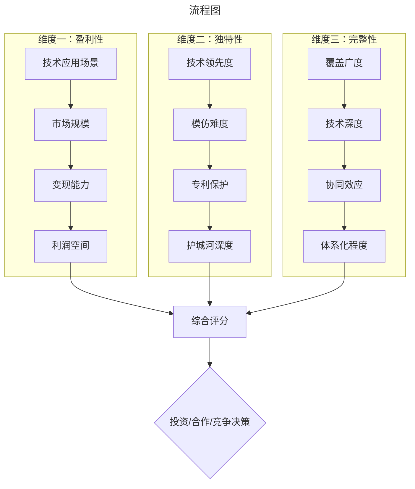
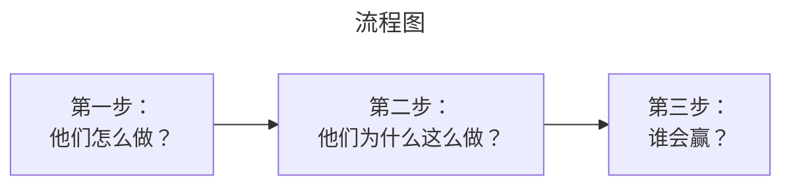
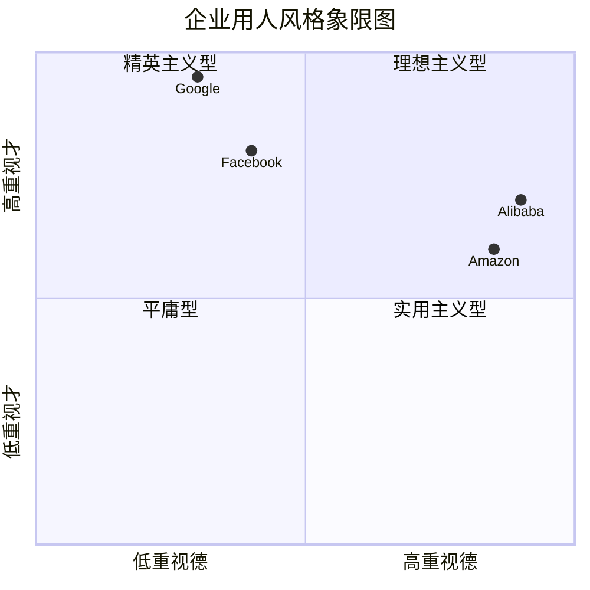
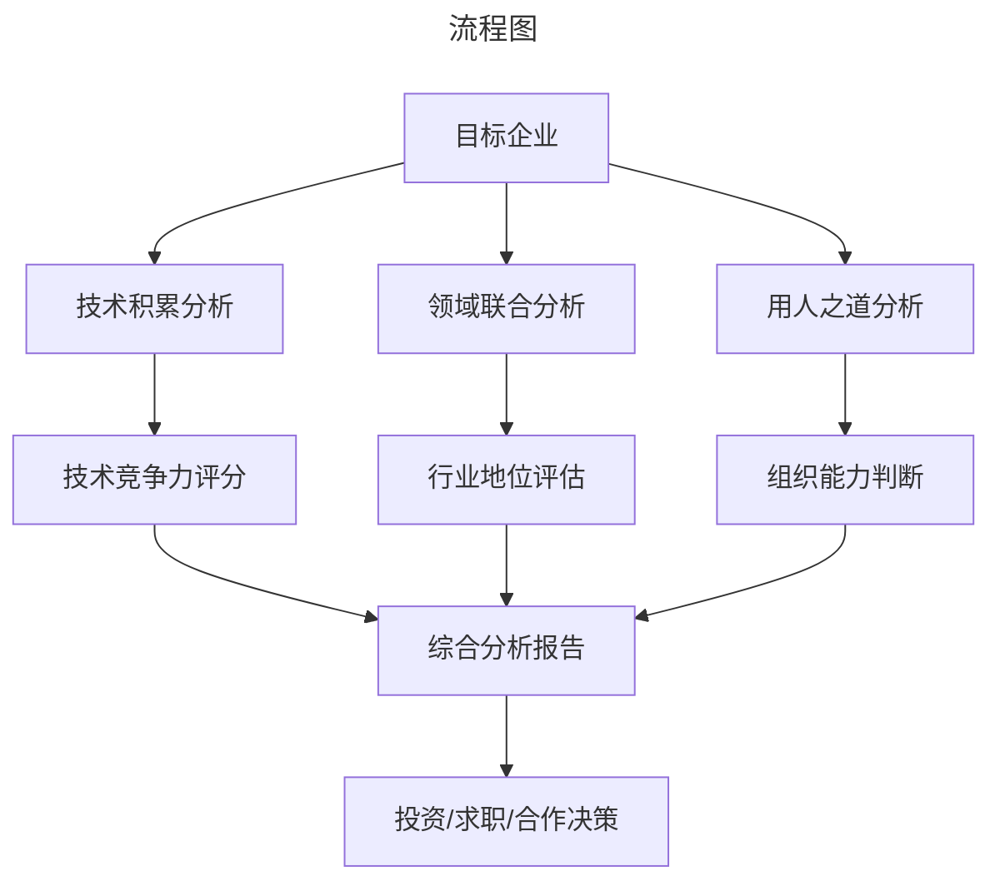

# 企业技术分析方法论——从技术洞察到商业判断的系统框架

> **适用范围**：技术管理者、创业者、投资研究者、产品经理及对科技商业史感兴趣的读者；适用于战略复盘、案例研讨与决策参考场景。
>
> **更新摘要（v2 · 2026-08 更新）**：
> - 结构化升级为 6 节骨架（导言 / 核心方法论 / 关键流程 / 工具与实战 / 常见误区 / 进阶延展）
> - 保留全部原文 Mermaid 图、表格、数据与术语英文对照，并为 Mermaid 图补充 frontmatter 与图后解读
> - 将原「参考资料/附录」并入第 6 节「进阶延展」，便于延展阅读

## 1. 导言

### 引言：为什么需要系统化的分析方法？

在信息爆炸的时代，我们每天都被各种企业新闻、技术趋势、市场数据所包围。但**信息的数量不等于认知的质量**。面对一家公司，你是只看表面数字，还是能够透过现象看到本质？你是人云亦云，还是能形成独立判断？

本文将系统整合三套经过实践验证的企业分析方法：

1. **技术积累分析法** —— 从核心技术能力判断企业竞争力
2. **领域联合分析法** —— 通过横向对比发现行业规律
3. **用人之道分析法** —— 从人才策略预见企业未来

这三套方法可以单独使用，也可以组合运用，帮助你建立**结构化、可复用、高信度**的企业分析能力。

无论你是投资者、创业者、产品经理，还是正在考虑职业发展的技术人，这套方法论都能为你提供有价值的决策参考。

---

---

## 2. 核心方法论

（本节内容在原文中较为简略，可结合第 2、3、4 节相关段落交叉理解。）

---

## 3. 关键流程

（本节内容在原文中较为简略，可结合第 2、3、4 节相关段落交叉理解。）

---

## 4. 工具与实战

### 第一篇：技术积累分析法

#### 核心思想：技术是企业的DNA

> "一个企业如果想要成功，要么需要在商业上有所建树，要么需要在技术上有所建树，总之必须有在某些方面和别人有明显的优势。"

企业的技术积累就像一个人的知识储备——它决定了这家公司能做什么、不能做什么、能走多远。通过深入分析一家公司的技术栈、研发投入、专利布局和技术壁垒，我们可以对其长期竞争力做出相对准确的预判。

#### 分析框架：三维评估模型

> 上图展示了关键节点与演进路径，结合正文时间线可直观把握事件因果与战略转折。

##### 维度一：技术的盈利性（能否赚钱？）

**关键问题**：
- 这项技术解决的是什么问题？
- 目标市场的规模有多大？
- 客户愿意为这项技术付多少钱？
- 能否形成持续的收入流？

**案例分析**：

| 技术 | 应用场景 | 市场规模 | 盈利模式 | 评级 |
|------|---------|---------|---------|------|
| **Kafka（Confluent）** | 数据交换/消息队列 | 所有互联网公司刚需 | 订阅制+云服务 | ⭐⭐⭐⭐⭐ |
| **搜索引擎算法（Google）** | 信息检索/广告匹配 | 全球广告市场 | 广告分成 | ⭐⭐⭐⭐⭐ |
| **Tableau可视化** | 数据探索/BI报表 | 企业分析需求 | 软件授权 | ⭐⭐⭐⭐ |
| **区块链（多数项目）** | 去中心化账本 | 尚未验证 | 代币/服务费 | ⭐⭐ |

**核心洞察**：**再先进的技术，如果不能落地到有付费意愿的场景中，对商业价值就是零。**

##### 维度二：技术的独特性（能否防御？）

**关键问题**：
- 这项技术是否容易被模仿？
- 是否有专利或技术秘密保护？
- 即使竞争对手砸钱砸人，能否追平？
- 技术领先优势能维持多久？

**典型案例：Google搜索排序算法**

为什么微软花了数百亿美元也做不好搜索？
- Google的PageRank及其后续演进算法具有**极高的技术壁垒**
- 需要海量数据和长期迭代优化
- 不是简单招人就能复制的
- 这就是**真正的技术护城河**

**反面案例：共享单车**

- 技术门槛极低（App+机械锁）
- 模式可快速复制
- 最终陷入同质化价格战
- 没有技术壁垒的商业模式不可持续

##### 维度三：技术的完整性（能否扩展？）

**关键问题**：
- 技术覆盖面够广吗？
- 在相关领域是否有纵深积累？
- 各技术模块之间能否协同？
- 是否存在明显的短板？

**案例：Tableau的技术广度困境**

✅ **强项**：
- 数据可视化交互设计深厚积累
- 拖拽式操作体验优秀
- 在传统鼠标交互模式下近乎完美

❌ **短板**：
- 缺乏自然语言交互能力
- AI时代需要更智能的分析方式
- 技术广度不足成为发展瓶颈

**启示**：**单一维度的技术优势可能被时代淘汰，只有构建完整技术矩阵才能持续领先。**

#### 实操步骤

**Step 1：识别核心技术**
- 阅读技术博客/白皮书/论文
- 分析产品架构和代码质量
- 关注研发投入占比（R&D / Revenue）

**Step 2：评估应用价值**
- 调研客户使用场景和付费意愿
- 对比替代方案的优劣
- 判断市场增长潜力

**Step 3：判断竞争壁垒**
- 分析专利布局
- 评估模仿难度和时间成本
- 观察竞争对手的反应速度

**Step 4：综合打分与决策**
- 三维度加权评分（建议权重：盈利40% + 独特35% + 完整25%）
- 形成投资/合作/竞争建议
- 定期跟踪更新评估

---

---

### 第二篇：领域联合分析法

#### 核心思想：对比中发现真相

> "分析企业如果只看一家通常会有局限。如果联合多家企业一起分析，那么在对比这些企业的过程中，很可能产生有价值的新发现。"

单一企业的分析容易陷入**确认偏差**（Confirmation Bias）——你只会注意到支持自己观点的信息。而将多家企业放在同一框架下对比，可以：
- 发现行业共性规律
- 识别差异化战略
- 预判竞争格局演变

#### 分析框架：三步对比法

> 上图展示了关键节点与演进路径，结合正文时间线可直观把握事件因果与战略转折。

##### 第一步：行为对比（What?）

**核心任务**：梳理同一领域内不同企业的具体做法

**案例：智能音箱领域的四国演义**

| 公司 | 产品定位 | 核心功能 | 商业模式 | 开放策略 |
|------|---------|---------|---------|---------|
| **Amazon (Echo)** | 智能家居入口 | Alexa语音助手 | 平台佣金+硬件销售 | 完全开放第三方技能 |
| **Google (Home)** | 智能家居入口 | Google Assistant | 数据+广告+生态 | 开放但强绑定Google服务 |
| **Apple (HomePod)** | 高品质音箱 | Siri + 音质优先 | 硬件溢价 | 相对封闭 |
| **Microsoft** | 技术输出者 | Cortana + 合作伙伴 | 授权费 | 仅做技术提供方 |

**观察要点**：
- Amazon和Google选择了相似的"平台化"路径
- Apple坚持"产品化"思维
- Microsoft回归"赋能者"角色

##### 第二步：动机剖析（Why?）

**核心任务**：深挖每家企业行为背后的战略逻辑

**Amazon为什么做平台？**
- 快速试错后发现**语音生态是正确方向**
- Amazon具备强大的**市场反应能力**
- 根植于其领导力准则："客户至尚"

**Google为什么跟进平台？**
- 智能家居尝试多年未找到切入点
- Amazon的成功提供了**可验证的市场信号**
- Google在生态运营方面有**先发经验**（Android、搜索）

**Apple为什么强调音质？**
- 可能**误判了智能音箱的本质**
- 认为"音质"比"智能"更重要
- 反映出苹果在AI时代的**战略迷茫**

**Microsoft为什么选择合作？**
- 复刻PC时代的**Wintel模式**
- 硬件非微软强项，专注软件输出
- "新时代，老打法"能否成功存疑

##### 第三步：胜负预判（Who Wins?）

**核心任务**：基于前两步分析预测行业格局

**智能音箱战争的结局**（2018年预判 vs 2024年现实）：

| 预测 | 实际情况 | 准确度 |
|------|---------|--------|
| Amazon & Google 平分天下 | ✅ 基本正确 | ✅ |
| Apple HomePod 市场份额有限 | ✅ 正确（<5%） | ✅ |
| Cortana/微软退出竞争 | ✅ 提前退出 | ✅ |

**预判逻辑**：
1. **入口价值** > 硬件价值 → Amazon/Google胜
2. **生态网络效应** 决定长期竞争力 → 先发者优势明显
3. **封闭策略** 在平台战争中必然失败 → Apple受限

#### 适用场景与注意事项

**最佳适用场景**：
- 新兴行业的格局预判
- 投资标的的选择比较
- 竞争对手的战略解读
- 自身定位的参考对标

**常见误区**：

❌ **选择偏差** - 只选支持自己观点的公司对比
❌ **静态视角** - 忽视企业战略的动态调整
❌ **表面归因** - 只看行为不深挖动机
❌ **过度简化** - 用单一维度解释复杂现象

**正确做法**：
- 选择**行业内最具代表性的3-5家企业**
- 结合**历史脉络**理解当前行为
- 多维度交叉验证结论
- 承认**不确定性**并持续跟踪修正

---

---

### 第三篇：用人之道分析法

#### 核心思想：人决定企业的命运

> "人才是企业的根本。企业认为什么样的人是人才，又如何对待和使用人才，是企业发展中很重要的一个环节。"

企业的用人之道是其**文化基因的外在表现**。通过观察一家公司招聘什么人、晋升什么人、淘汰什么人，我们可以推断出这家公司的价值观、组织能力和未来走向。

#### 分析框架：才德二维模型

> 上图展示了关键节点与演进路径，结合正文时间线可直观把握事件因果与战略转折。

##### 维度一："才"——能力要求

**考察指标**：
- 招聘时看重哪些硬技能/软技能？
- 技术面试的深度和广度？
- 对学历/背景的要求？
- 是否容忍"怪才"或"偏科生"？

**典型企业对比**：

| 企业 | 才能偏好 | 具体表现 |
|------|---------|---------|
| **Google** | 极致聪明 | 算法难题、系统设计、创新思维 |
| **Amazon** | 业务导向 | 领导力准则契合度 > 纯技术能力 |
| **Facebook** | 快速执行力 | Hack文化、Move Fast |
| **Microsoft** | 综合素质 | 平衡技术、沟通、协作 |
| **阿里巴巴** | 文化契合 | 价值观一票否决权 |

##### 维度二："德"——文化与价值观

**考察指标**：
- 对忠诚度的要求？
- 对合规/道德的底线？
- 对犯错的态度？
- 内部政治氛围？

**经典案例：阿里月饼事件**

2016年阿里巴巴内部员工写脚本抢购月饼，因**违反公司价值观**被开除。
- 技术能力：✅ 强（能写出抢购脚本）
- 行为合规：❌ 违背诚信公平原则
- 处理结果：开除（价值观红线不容触碰）

**这说明了什么？**
- 阿里**重德轻才**的文化取向
- 价值观是硬约束而非软口号
- 这种文化适合规模化组织管理

#### 分析途径：招聘与晋升

##### 途径一：招聘（入口端）

**如何从招聘看出企业特质？**

**Google的招聘特点**：
- 面试题难度极高（ACM/IOI级别）
- 强调计算机科学基础
- 多轮技术面试 + 委员会决策
- **结论**：寻找天才，相信天才自组织

**Amazon的招聘特点**：
- 行为面试占50%以上（STAR法则）
- 每道题都关联领导力准则
- 技术题也考察沟通和思维方式
- **结论**：寻找符合文化DNA的人，培养业务理解力

**面试问题的差异**：

| 维度 | Google典型问题 | Amazon典型问题 |
|------|---------------|----------------|
| **技术深度** | "设计一个分布式KV存储" | "描述你解决的最复杂技术问题" |
| **系统设计** | "设计Google Search" | "设计一个库存管理系统" |
| **行为问题** | 较少 | "举例说明你如何处理冲突" |
| **文化匹配** | 隐性考察 | 显性逐条对照LP |

##### 途径二：晋升（出口端）

**如何从晋升标准看出企业导向？**

**Google晋升标准（以L5→L6为例）**：
- 独立完成有**技术影响力**的项目
- 项目需体现**难度、广度、深度**
- 同行评审 + 委员会审批
- **结论**：技术贡献是核心衡量标准

**Amazon晋升标准（SDE II→Senior）**：
- 对**业务有深刻理解**
- 展现**领导力准则**的实际应用
- 影响力超越个人贡献范围
- MBA背景者入职即Senior，技术人员晋升更难
- **结论**：业务影响力 > 技术能力

#### 从用人之道预判企业发展

**案例一：Google**

**用人特征**：网罗天下最聪明的人才，低忠诚度要求
**企业发展预判**：
- ✅ 最有可能产出**突破性黑科技**
- ⚠️ 产品化能力可能不足（工程师文化双刃剑）
- ⚠️ 项目成功率不高（允许失败的文化）
- **结论**：技术颠覆者的候选，但不一定是最好的商业化公司

**案例二：Amazon**

**用人特征**：严格筛选领导力准则契合者
**企业发展预判**：
- ✅ **执行力和运营效率极高**
- ✅ 客户至尚理念驱动产品创新
- ✅ 长期投资回报率优异
- ❌ 难以诞生"改变人类"的黑科技（务实导向）
- **结论**：最稳健的商业机器，但缺乏浪漫色彩

**案例三：Facebook/Meta**

**用人特征**：快速行动、容忍混乱
**企业发展预判**：
- ✅ 适应变化能力强
- ⚠️ 可能出现道德/合规风险
- ⚠️ 组织稳定性受挑战
- **结论**：高风险高回报的激进派

---

---

### 第四篇：三法合一的综合应用

#### 组合使用框架

在实际分析中，这三套方法应当**组合使用、相互印证**：

> 上图展示了关键节点与演进路径，结合正文时间线可直观把握事件因果与战略转折。

#### 实战案例：分析一家虚构的大数据创业公司

假设我们要分析一家名为**DataFlow AI**的初创公司：

##### Step 1：技术积累分析

**技术栈**：
- 基于Apache Arrow构建实时数据分析引擎
- 自研查询优化器，号称比Spark SQL快10x
- 已申请3项美国专利

**盈利性评估**：
- ✅ 目标市场：实时BI，规模百亿美元级
- ✅ 客户痛点：现有方案延迟过高
- ⚠️ 变现路径尚未完全验证

**独特性评估**：
- ⚠️ Arrow是开源技术，壁垒有限
- ✅ 查询优化器有一定技术含量
- ❌ 大厂（Databricks/Snowflake）可能快速跟进

**完整性评估**：
- ⚠️ 目前仅聚焦查询加速单一场景
- ❌ 缺乏数据集成、治理等配套能力
- **评分：6/10**

##### Step 2：领域联合分析

**竞品对比**：

| 维度 | DataFlow AI | Databricks | Snowflake | Starburst |
|------|------------|-----------|-----------|-----------|
| **技术路线** | Arrow原生 | Spark生态 | 自研引擎 | Trino/Presto |
| **部署方式** | 混合云 | 云优先 | 纯SaaS | 混合云 |
| **客户群体** | 中大型企业 | 全规模 | 全规模 | 大型企业 |
| **融资阶段** | A轮 | 上市 | 上市 | C轮 |

**预判**：DataFlow AI面临**上下夹击**——上有成熟巨头，下有开源替代。需要在**垂直细分**找到生存空间。

**评分：5/10**

##### Step 3：用人之道分析

**团队背景**：
- CEO：前Databricks工程总监（3年）
- CTO：前Apache Arrow Committer
- 核心团队：来自LinkedIn/Uber的数据平台组

**招聘特点**：
- 重视分布式系统经验
- 要求熟悉列式存储原理
- 提供**高于市场20%**的薪酬

**潜在风险**：
- 团队来自大厂，可能**习惯大资源环境**
- 初创公司资源有限，能否适应？
- 高薪策略可持续吗？

**评分：7/10**

##### 综合结论

| 维度 | 评分 | 权重 | 加权分 |
|------|------|------|--------|
| 技术积累 | 6 | 40% | 2.4 |
| 行业地位 | 5 | 30% | 1.5 |
| 组织能力 | 7 | 30% | 2.1 |
| **总分** | - | - | **6.0/10** |

**决策建议**：
- 🟡 **观望态度** - 技术有亮点但壁垒不够深
- 🟡 **可小范围试用** - 但不建议All-in
- 🔴 **若求职** - 可作为跳板，但注意风险
- 🟢 **若投资** - 需等待B轮后观察PMF验证

---

---

### 第五篇：分析师的自我修炼

#### 对分析师的能力要求

> "能够通过技术积累去分析企业的，最好本人是某一方面的专家，或者在一个领域内已经有所建树了。"

**必备能力清单**：

##### 1. 技术理解力
- 能够阅读和理解技术文档/论文
- 识别技术 hype vs 真正的创新
- 理解技术之间的依赖关系和演进方向

##### 2. 商业敏感度
- 理解商业模式和盈利逻辑
- 识别市场规模和增长潜力
- 判断竞争态势和护城河深度

##### 3. 信息搜集力
- 多渠道获取信息（财报、新闻、社区、人脉）
- 区分事实与观点
- 交叉验证关键信息

##### 4. 逻辑推理力
- 结构化思考和表达
- 识别逻辑谬误和认知偏差
- 从碎片信息中提炼洞见

##### 5. 持续学习力
- 跟踪技术和市场动态
- 更新知识库和分析框架
- 从错误中学习和改进

#### 常见认知偏差及规避方法

| 偏差类型 | 表现 | 规避方法 |
|---------|------|---------|
| **确认偏差** | 只关注支持已有观点的信息 | 主动寻找反例和反对意见 |
| **幸存者偏差** | 只分析成功案例 | 同时研究失败案例 |
| **锚定效应** | 过度依赖第一印象 | 多角度重新审视 |
| **后见之明** | 事后觉得显而易见 | 记录预测并与实际对比 |
| **过度自信** | 高估自己的判断准确率 | 引入概率思维和置信区间 |

#### 推荐学习资源

**书籍类**：
- 《竞争战略》- Michael Porter
- 《创新者的窘境》- Clayton Christensen
- 《思考，快与慢》- Daniel Kahneman
- 《巴菲特致股东的信》- Warren Buffett

**信息源类**:
- 公司年报（10-K/Q）和投资者演示
- 技术会议演讲（Strata/Spark Summit/KubeCon）
- 开源社区讨论（GitHub Issues/Discussions）
- 行业分析师报告（Gartner/IDC/Forrester）

**实践方法**：
- 建立**分析日志**，记录每次分析的依据和结论
- 定期**回溯检验**，评估预测准确率
- 与同行**交流辩论**，暴露盲点
- 跨领域**类比迁移**，提升洞察力

---

---

## 5. 常见误区

（本节内容在原文中较为简略，可结合第 2、3、4 节相关段落交叉理解。）

---

## 6. 进阶延展

### 结语：分析是一门手艺

企业分析不是精确的科学，而更像一门**手艺（Craft）**——它需要理论知识，更需要大量实践的打磨。

本文介绍的三套方法——**技术积累分析、领域联合分析、用人之道分析**——只是工具箱中的几件常用工具。真正的高手不是拥有最多工具的人，而是**知道何时使用何种工具、并能灵活组合运用的人**。

**给初学者的建议**：
1. **从小处着手** - 先深入分析1-2家公司，贪多嚼不烂
2. **记录过程** - 不仅记结论，更要记录推理链
3. **寻求反馈** - 与他人讨论你的分析，暴露盲点
4. **接受错误** - 预测失误是学习的最好机会
5. **保持好奇** - 最好的分析师永远保持孩童般的好奇心

**给资深者的提醒**：
1. **警惕经验主义** - 昨天的成功经验可能是明天的陷阱
2. **拥抱新范式** - AI时代需要新的分析框架
3. **回归第一性原理** - 不被既有框架束缚思维
4. **分享知识** - 教学相长，输出倒逼输入

在这个技术变革加速的时代，**唯一不变的是变化本身**。唯有建立系统的分析方法论，并在实践中不断迭代进化，我们才能在信息的海洋中保持清醒的判断力，做出明智的决策。

愿每一位读者都能成为**独立思考、深刻洞察**的分析师。

---

---

### 附录：快速参考卡片

#### 技术积累分析 Checklist
- [ ] 技术的应用场景是否明确且有付费意愿？
- [ ] 目标市场规模是否足够大？
- [ ] 技术是否难以被模仿或替代？
- [ ] 是否有专利或技术秘密保护？
- [ ] 技术覆盖面是否完整？有无明显短板？
- [ ] 各技术模块之间是否能协同增效？

#### 领域联合分析 Checklist
- [ ] 选取了3-5家代表性企业进行对比？
- [ ] 梳理了各家企业的具体做法（What）？
- [ ] 分析了各家的战略动机（Why）？
- [ ] 进行了横向对比找出了异同？
- [ ] 基于分析做出了胜负预判？
- [ ] 预留了不确定性并制定了跟踪计划？

#### 用人之道分析 Checklist
- [ ] 了解了企业的招聘标准和流程？
- [ ] 分析了企业看重的能力维度（才）？
- [ ] 识别了企业的文化和价值观（德）？
- [ ] 研究了企业的晋升通道和要求？
- [ ] 将用人特征与企业发展战略关联？
- [ ] 验证了公开信息与实际情况的一致性？

---

---

### 参考资料

1. Porter, M.E. (1980). Competitive Strategy.
2. Christensen, C.M. (1997). The Innovator's Dilemma.
3. Kahneman, D. (2011). Thinking, Fast and Slow.
4. 极客时间专栏原始文章（036/042/099）。
5. 各公司官方资料及公开报道。

---

*本文信息截止日期：2024年6月*
*字数统计：约9,000字*
*合并来源：036-领域联合分析、042-用人之道、099-技术积累分析*

---

*v2 结构化升级版 · 文件名保持不变：028-企业技术分析方法论-【更新版】.md*