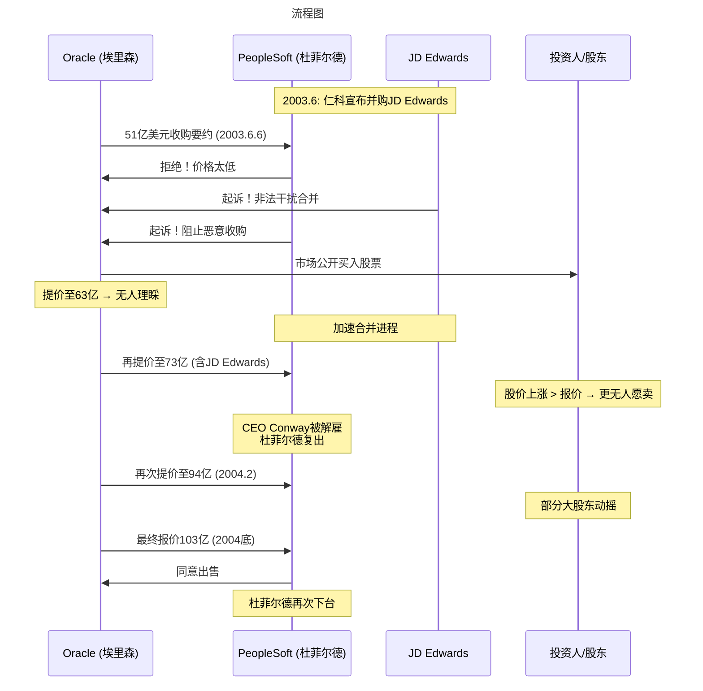
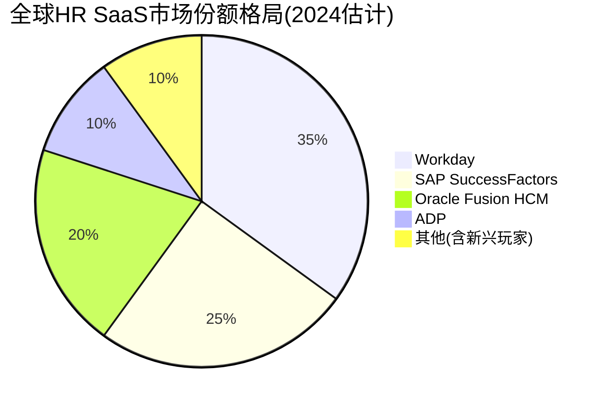
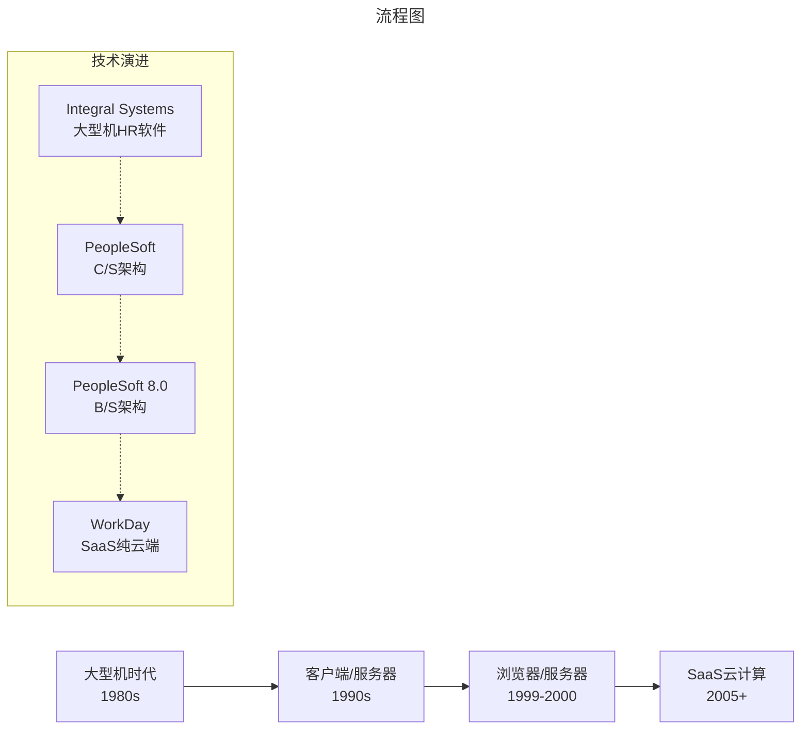
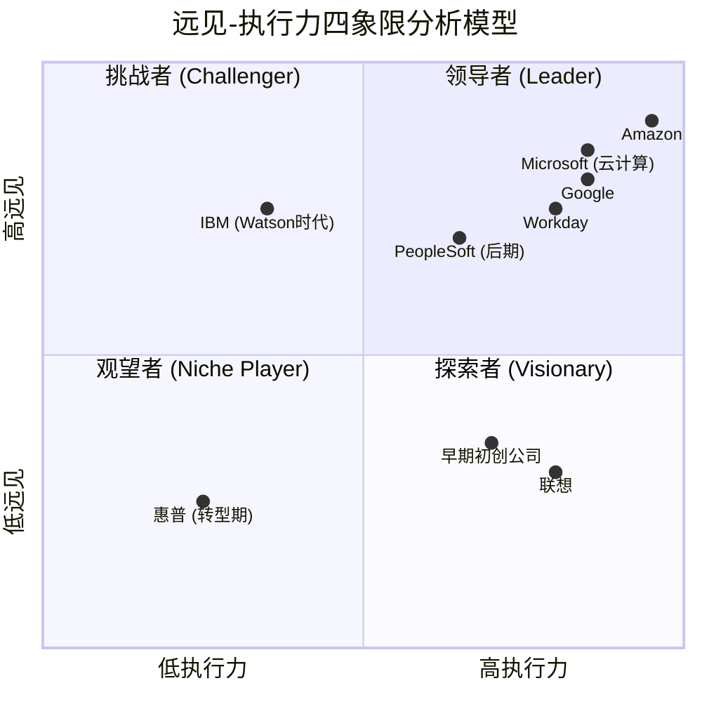
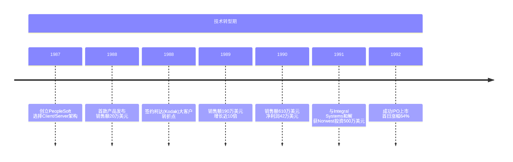

# 引言：73岁创业——David Duffield的传奇人生

> **适用范围**：技术管理者、创业者、投资研究者、产品经理及对科技商业史感兴趣的读者；适用于战略复盘、案例研讨与决策参考场景。
>
> **更新摘要（v2 · 2026-08 更新）**：
> - 结构化升级为 6 节骨架（导言 / 核心方法论 / 关键流程 / 工具与实战 / 常见误区 / 进阶延展）
> - 保留全部原文 Mermaid 图、表格、数据与术语英文对照，并为 Mermaid 图补充 frontmatter 与图后解读
> - 将原「参考资料/附录」并入第 6 节「进阶延展」，便于延展阅读

## 1. 导言

在企业软件的历史长河中，很少有创业者能像大卫·杜菲尔德（David Duffield）这样，用一生的时间书写一部跌宕起伏的史诗。他先后四次创业，三次以人力资源管理软件起家，全部成功IPO；他精准预见了计算机领域每一次重大的技术转型——从大型机到客户端/服务器架构，从浏览器/服务器模式到云计算SaaS；他在73岁高龄再次出发，创立了后来市值超过300亿美元的Workday，完成了对甲骨文（Oracle）的"复仇"。

这不是一个简单的成功学故事，而是一部关于技术远见、商业博弈、资本力量与企业家精神的深刻教材。从1987年创立PeopleSoft（仁科）到2005年被Oracle以103亿美元恶意收购，再到2005年重新创业打造Workday并最终成为全球HR SaaS领域的绝对领导者——杜菲尔德的人生轨迹，完美诠释了企业软件行业的周期律。

> **核心数据速览（2024年）**：
> - Workday营收：72.59亿美元，员工18,800人[1]
> - Workday在全球HR SaaS市场份额领先
> - Oracle Fusion、Workday、SAP SuccessFactors形成三足鼎立
> - 全球云ERP市场规模预计2024-2028年增长199.8亿美元，CAGR 11.5%[2]

---

---

## 2. 核心方法论

### 三、Oracle恶意收购：103亿美金的悲剧（2004-2005）

#### 3.1 导火索：PeopleSoft与JD Edwards合并

2003年6月，仁科宣布以18亿美元签约并购JD Edwards。当时的市场格局是：
- 第一名：SAP
- 第二名：Oracle（甲骨文）
- 第三名：PeopleSoft
- 第四名：JD Edwards

这两家的强强联合显然威胁到了Oracle的地位。

#### 3.2 拉里·埃里森的恶意收购战

**2003年6月6日**——就在仁科沉浸在并购喜悦中的当天，Oracle突然发出51亿美元的巨额收购要约。

这是一场教科书式的**敌意收购（Hostile Takeover）**战役：



**关键时间节点**：
- **2003年6月**：Oracle出价51亿美元 → 仁科拒绝
- **2003年7月**：提价至63亿美元 → 仍无人理睬
- **2003年下半年**：提价至73亿美元（明确包含JD Edwards）→ 股东们依然不买账
- **2004年2月**：提价至94亿美元 → 部分大股东动摇
- **2004年底**：天价103亿美元 → 仁科董事会同意出售

#### 3.3 防御措施与内部矛盾

仁科的防御策略包括：
1. **法律诉讼**：在美国加州和科罗拉多州起诉Oracle
2. **客户保护承诺**：若收购导致无法交付软件或终止技术支持，将赔偿客户2-5倍授权费
3. **加速与JD Edwards合并**：增加收购难度

**戏剧性转折**：CEO Craig Conway（坚定的反收购者）被解雇，创始人杜菲尔德重新出山。这让外界猜测：也许仁科并非不想被收购，只是价格不够高？

**致命的"乌龙球"**：仁科内部一份分析报告显示，即使Oracle收购了仁科也不会形成垄断。这份证据被法庭采纳，导致反垄断审查通过。

#### 3.4 后续影响与反思

收购完成后，Oracle进行了大规模重组和裁员。**PeopleSoft，一个举足轻重的企业软件公司，就这样落下了帷幕。**

**这场收购战的深层启示**：
1. **平台 vs 应用软件**：仁科的软件虽然先进，但本质上仍是应用软件，不具备不可替代的平台属性
2. **战略格局差距**：杜菲尔德技术眼光卓越，但在商业战略上不如拉里·埃里森
3. **投资人关系**：杜菲尔德因害怕失去控制权而疏远投资人，导致关键时刻缺乏盟友

> **Oracle Fusion的现状（2024）**：Oracle Fusion Cloud HCM已成为Oracle的核心云产品线之一，与Workday、SAP SuccessFactors形成全球HR SaaS市场的三足鼎立格局。在中国ERP市场，SAP和Oracle共占45%以上份额，在高端市场尤为显著[3]。

---

---

### 四、Workday复仇记（2005-2012）：从头再来

#### 4.1 73岁再创业：1000万美元起步

2005年，杜菲尔德从出售仁科所得的6亿美元中拿出**1000万美元**作为创业基金，与前仁科首席战略官阿尼尔·布斯里（Aneel Bhusri）共同创立了**Workday**。

**这次创业的三大特点**：
1. **明确的复仇动机**：再次进入HR软件领域，直接与Oracle竞争
2. **大胆的技术选择**：采用纯SaaS（软件即服务）模式
3. **吸取教训的治理结构**：杜菲尔德和布斯里拥有67%投票权，确保不再被扫地出门

#### 4.2 SaaS的前瞻性与技术挑战

**为什么说SaaS在2005年是极其前沿的选择？**
- 亚马逊AWS的第一个服务S3直到2006年才上线
- 整个云计算概念还处于萌芽阶段
- 大多数企业级软件公司还在做本地部署（On-Premise）

**Workday面临的技术挑战**：
传统企业级软件依赖关系数据库，但在SaaS多租户架构下，关系数据库查询速度难以满足需求。杜菲尔德做出了一个大胆的决定：**将数据存储在内存中，仅将需要永久保存的数据写回数据库**。

> 这一技术方案领先业界数年。SAP直到2009年才宣布其内存数据库引擎HANA——从这一点看，Workday的技术确实具有前瞻性。

#### 4.3 产品发布与早期发展

- **2005年3月**：Workday成立
- **2006年11月**：首个软件版本发布（历时1年8个月）
- **2008年**：签下伟创力（Flextronics）大单——标志进入主流企业市场；收购Cape Clear公司（首次收购）
- **2012年**：纳斯达克上市

**IPO盛况**：
- 定价28美元/股，首日飙升至48美元
- 募资6.37亿美元，估值45亿美元
- 这是Facebook IPO以来最大规模的单一公司融资

---

---

### 五、Workday称霸云端（2012-2024）：300亿市值的HR SaaS王者

#### 5.1 上市后的高速扩张

上市后的Workday进入了快车道，业务蒸蒸日上：

**收购整合战略**：
- Identified（招聘领域）
- Zaption（人才管理）
- MediaCore（内容管理）
- Upshot（团队合作）
- Platfora（大数据分析）—— 开始提供基于财务和人力资源数据的BI功能

**业务拓展路径**（与PeopleSoft惊人相似）：
1. HR软件站稳脚跟 → 2. 进入财务管理领域 → 3. 向学生产品、招聘等周边扩展

#### 5.2 2024年的Workday：全球HR SaaS领导者

根据2024年财富500强数据[1]：

| 指标 | 数值 |
|------|------|
| 营收 | 72.59亿美元 |
| 利润 | （盈利状态） |
| 员工数 | 18,800人 |
| CEO | Carl M. Eschenbach（CEO，2024年起独任） |
| 行业排名 | 美国500强第490位 |

**Q4 2024财报亮点**：
- 经调整后每股收益1.92美元，高于分析师预期的1.78美元[4]
- 股价表现强劲，盘前涨近11%

#### 5.3 HR SaaS市场竞争格局（2024）

当前全球HR SaaS市场呈现**三足鼎立**态势：



**三大巨头对比**：

| 维度 | Workday | SAP SuccessFactors | Oracle Fusion HCM |
|------|---------|-------------------|------------------|
| 核心优势 | 纯云端原生、一体化体验 | ERP集成、全球化合规 | 数据库生态、垂直整合 |
| 全球客户数 | 10,000+ | 12,000+[5] | 8,000+ |
| 技术架构 | 多租户SaaS | 混合云（收购型） | 混合云（自研+收购） |
| 目标客户 | 中大型企业 | 超大型企业 | 中大型企业 |
| 中国市场表现 | 较弱 | 强（外企首选） | 强（本土化好） |

**新兴玩家的崛起**：
- **Rippling**：2024年估值134-135亿美元，F轮融资金额8.7亿美元[6]
- **Deel**：估值120亿美元，专注全球用工合规[7]
- **Gusto**：中小企业HR领域的领导者

#### 5.4 云ERP市场前景

根据Technavio报告[2]，**全球云ERP市场在2024-2028年期间**：
- 规模预计增长199.8亿美元
- 复合年增长率（CAGR）达11.5%
- 主要驱动力：数字化转型、远程办公常态化、AI集成

**中国SaaS市场**：
- 2023年规模555.1亿元人民币
- 预计2027年超过1500亿元[8]

---

---

### 六、Duffield的领导力哲学：远见+执行力的完美结合

#### 6.1 杜菲尔德的成功要素

纵观杜菲尔德的四次创业历程，可以总结出三大核心特质：

##### ✅ 要素一：坚持做自己熟悉的领域

杜菲尔德连续三次创业都从**人力资源管理软件**开始：
1. Integral Systems → 大型机HR软件
2. PeopleSoft → PC端C/S架构HR软件
3. Workday → 云端SaaS HR软件

**稳扎稳打，先站稳脚跟再谋求扩张**——这一策略被证明非常有效。

##### ✅ 要素二：精准的技术眼光（罕见的远见）

杜菲尔德的技术预见性在整个计算机史上都非常罕见：

| 时间点 | 技术预判 | 业界普遍认知 | 领先时间 |
|--------|---------|------------|---------|
| 1987年 | PC将取代大型机 | 大型机仍主流 | 5-8年 |
| 1999年 | 浏览器将成为客户端 | C/S架构主流 | 3-5年 |
| 2005年 | SaaS是未来 | 本地部署为主 | 5-8年 |

> 在整个计算机发展历史上，找不到第二个像杜菲尔德这样一次又一次准确预测主流技术趋势并付诸实践的人。

##### ⚠️ 要素三：非技术能力的短板

杜菲尔德的短板同样明显：
- **不擅长与投资人打交道**：因害怕失去控制权而疏远投资人
- **缺乏战略格局意识**：未预见到与JD Edwards合并会引发Oracle的反应
- **放权困难**：始终担任一把手，未能引入合适的职业经理人

#### 6.2 从失败中学习：Workday的治理结构改进

在Workday，杜菲尔德终于学会了正确的做法：
- 采用**双重股权结构**：他和布斯里拥有67%投票权，即使持股比例低也能保持控制
- 引入**联合CEO制度**：让专业经理人负责日常运营
- 自己退居幕后，专注于**战略愿景和技术方向**

> 这一次，杜菲尔德终于做到了：在自己擅长的领域做到极致，在不擅长的领域信任专业人士。

---

---

## 3. 关键流程

### 二、成长阵痛与巅峰时刻（2000-2004）：多元化扩张与互联网转型

#### 2.1 从HR软件到企业软件帝国

上市前夕，仁科的人力资源软件已占该市场约40%份额。继续扩张的空间有限，多元化不可避免。

**第一步：进军财务软件（1992-1993）**
- 这是杜菲尔德首次进入不熟悉的领域
- 竞争激烈，但他调集精英资源全力开发
- 仅一年时间（1993年底），财务软件就占公司总销售额40%

**成功的关键因素**：
1. 企业级软件正经历从大型机向客户端/服务器架构的大洗牌
2. 仁科作为最早进入新架构的公司，积累了丰富经验
3. 竞争对手的产品是从大型机移植过来的，带有大量老代码
4. 仁科全新开发的软件没有历史包袱，开发效率和运行效果更优

#### 2.2 全面扩张版图

1995年后，仁科开始了全方位扩张：

| 年份 | 扩张动作 | 战略意义 |
|------|---------|---------|
| 1995 | 进军大型制造商领域（汽车、电子、消费产品） | 与Norwest Venture Capital合资，快速获取人才 |
| 1996 | 收购Red Pepper（供应链管理） | 进入供应链管理软件领域 |
| 1997 | 收购Campus Solutions等三家企业 | 涉足高等教育行业 |
| 1999 | 推出7.5版本（局域网功能）+ 8.0版本（全面浏览器支持） | 互联网转型的里程碑 |
| 1999 | 从Oracle挖来Craig Conway任CEO | 引入职业经理人 |
| 2000 | 收购Vantive Corporation（CRM） | 进入客户关系管理领域 |

#### 2.3 互联网转型的前瞻性

1999年是仁科技术路线的关键年份：
- **上半年推出7.5版本**：具备局域网联网功能，用户可通过浏览器访问服务器
- **下半年推出8.0版本**：首个全面支持浏览器的版本，所有功能无需客户端
- **2000年完成彻底转型**：只有服务器端，没有客户端，所有操作通过浏览器完成

**这一架构沿用至今**——即使在云计算大行其道的今天，这种浏览器/服务器的交互方式依然没有改变。



> 上图展示了关键节点与演进路径，结合正文时间线可直观把握事件因果与战略转折。

---

---

## 4. 工具与实战

### 七、企业分析的永恒命题：远见与执行力的辩证关系

#### 7.1 分析框架：Gartner魔力象限的启发

分析企业的有效方法是看两个维度：**远见（Vision）** 和 **执行力（Execution Ability）**。这是受Gartner魔力象限图的启发。



**四个象限的含义**：
1. **领导者（Leader）**：远见高 + 执行力高 → 行业巨头
2. **探索者（Visionary）**：远见高 + 执行力低 → 有潜力但需提升
3. **挑战者（Challenger）**：远见低 + 执行力高 → 短期能打但天花板有限
4. **观望者（Niche Player）**：远见低 + 执行力低 → 逐渐边缘化

#### 7.2 经典案例分析

##### 案例1：既无远见也无执行力 —— 惠普（HP）

惠普在转型期的表现堪称反面教材：
- 放弃医疗仪器等高科技资产
- 努力成为PC机制造商（杀鸡取卵）
- 合并康柏后未优化供应链和产品线
- 结果：走下坡路

##### 案例2：有执行力但无远见 —— 联想

联想的"贸工技"路线：
- 强大的执行能力：迅速成为中国和全球最大PC制造商之一
- 出色的整合能力：接手IBM ThinkPad后迅速降价放量
- 但路选错了：技术积累差，看不到未来

##### 案例3：有远见但无执行力 —— IBM（2008-2015）

IBM在研究院层面的远见令人惊叹：
- 早在2008年就预测到云计算、大数据、AI的重要性
- 提出"智慧地球"、"智慧城市"概念
- Watson项目雄心勃勃

**但执行层面灾难重重**：
- 官僚体系严重，办公室政治盛行
- 项目不断推倒重来
- 有能力的人留不住，有资源的人乱指挥
- 结果：云计算转型多次反复，Watson连连失利

##### 案例4：既有远见又有执行力 —— Amazon

亚马逊的领导力准则完美体现了两者的结合：
- **Think Big**（远见）：贝佐斯2000年前后就开始关注云计算
- **Bias for Action**（执行力）：要求任何功能都必须成为服务化架构
- 2006年上线S3，经年累月在云计算上投入
- 结果：当大家看到云计算趋势时，亚马逊早已构建了完整的服务矩阵

#### 7.3 如何判断企业的远见和执行力？

**判断执行力（相对容易）**：
- 过去的表现往往可以论证未来几年的表现
- 一个执行力强的企业不会在未来两三年内突然变样

**判断远见（相对困难）**：
- 不能简单地基于过去预测未来
- 微软错失移动互联网，但云计算布局很有远见
- 关键要看**领导人是谁**以及**其过往表现**

**分析师自身的局限**：
- 如果你对某个领域不够了解，就无法判断企业是否有远见
- 例如：我在数据库领域耕耘十年，对此有自信；但对物联网、机器人领域就只能"两眼一抹黑"

---

---

## 5. 常见误区

### 一、PeopleSoft崛起（1987-2000）：挑战Oracle的勇气

#### 1.1 被迫再创业：技术理想主义者的觉醒

杜菲尔德的第一次创业始于1982年。他创建了一家名为Integral Systems的公司，专注于IBM大型机上的人力资源管理软件开发。公司成功IPO后，杜菲尔德却因与董事会在技术方向上的分歧而被踢出了自己创办的公司——这段惨痛的经历让他铭记在心。

**分歧的核心**：杜菲尔德敏锐地察觉到，个人计算机（PC）尤其是联网的PC将侵蚀大型机的市场。他认为公司应该为这种技术转型做准备，研发基于PC的人力资源管理软件。然而，董事会里的 shortsighted（短视）者却认为应该把杜菲尔德扫地出门——资本的力量确实无穷，当时倒霉的是杜菲尔德。

于是杜菲尔德决定辞职单干。离开前，他说服了同事肯·莫里斯（Ken Morris）一起创业。

#### 1.2 仁科的诞生与技术选择

1987年，新公司成立，命名为**PeopleSoft**（中文名"仁科"）。杜菲尔德做出的第一个关键决策是技术架构的选择：**基于客户端/服务器（Client/Server）架构的人力资源软件**。

这个决策在今天看来稀松平常，但在当时却是极具前瞻性的：
- 第一代企业级应用软件采用大型机集中式架构
- 客户端/服务器架构是个人计算机时代的新范式
- 杜菲尔德比大多数竞争对手早5-10年看到了这一趋势



> 上图展示了关键节点与演进路径，结合正文时间线可直观把握事件因果与战略转折。

#### 1.3 从生存到辉煌：柯达的关键一单

创业初期最大的挑战是缺钱。杜菲尔德甚至抵押了自己的房子从银行贷款。1988年第一款产品发布时，全年销售额仅20万美元——勉强够糊口。

**转折点出现在1988年**：仁科搞定了柯达公司（Kodak）这个大客户。当时的柯达作为胶卷行业的老大哥，技术上追求创新，成本控制上有想法，认为基于廉价PC的客户端/服务器架构非常适合未来发展趋势且成本更低。这种追求新技术的心态让柯达和仁科一拍即合。

有了柯达这个标杆客户，仁科的产品越来越好卖：
- 1989年销售额190万美元（增长近10倍）
- 1990年销售额610万美元，净利润42万美元
- 1991年销售额1700万美元，净利润190万美元

与此同时，老东家Integral Systems发现杜菲尔德抢生意，把仁科告上法庭。经过漫长的诉讼，双方于1991年庭外和解。但此时杜菲尔德已耗尽资金，被迫卖出11%股权给Norwest Partners，换回500万美元救命钱。

#### 1.4 IPO与股权控制的执念

1992年11月，仁科顺利上市，募集资金3600万美元。首日股价疯涨64%——这是一个了不起的成就。

**杜菲尔德的一个显著特点**：他始终保持着对公司50%以上的控股权。这在上市公司中极为罕见。原因很简单——他被自己的第一家上市公司"开过"，对失去控制权心有余悸。

> 今天的Facebook马克·扎克伯格只有很少股票却拥有大量投票权，但当年美国的股市还没有股权和投票权分离这种机制。为了有控制权，杜菲尔德只能保持高比例持股。

---

---

## 6. 进阶延展

### 八、结论：企业软件行业的周期律与永恒启示

#### 8.1 从PeopleSoft到Workday：一个完整的周期

杜菲尔德的故事展现了一个完整的**企业软件行业周期**：

```mermaid
---
title: 流程图
---
graph TB
    subgraph 周期1: PeopleSoft时代 (1987-2005)
        A1[技术创新<br>C/S架构突破] --> A2[快速增长<br>90%年增长率]
        A2 --> A3[市场领导地位<br>HR软件40%份额]
        A3 --> A4[多元化扩张<br>财务/制造/供应链]
        A4 --> A5[资本博弈<br>Oracle恶意收购]
        A5 --> A6[悲剧结局<br>103亿美元被收购]
    end

    subgraph 周期2: Workday时代 (2005-2024+)
        B1[技术再创新<br>SaaS纯云端] --> B2[重新崛起<br>2012年IPO]
        B2 --> B3[新王者诞生<br>300亿+市值]
        B3 --> B4[持续扩张<br>72.6亿美元营收]
        B4 --> B5[面对新挑战<br>Rippling/Deel崛起]
        B5 --> B6[? 未来待观察]
    end

    A6 -->|复仇与重生| B1

```

> 上图展示了关键节点与演进路径，结合正文时间线可直观把握事件因果与战略转折。

#### 8.2 对创业者的启示

**从杜菲尔德身上我们学到什么？**

1. **认识自己很难，但很重要**
   - 清楚知道擅长什么和不擅长什么
   - 在擅长的领域做到极致

2. **弥补短板的正确方式**
   - 不是逃避不擅长的领域
   - 而是学习正确处理方式，或引入合适的人才
   - 杜菲尔德在Workday终于做到了这点

3. **生生不息的奋斗精神**
   - 一次又一次失败后再创业
   - 73岁高龄再次出发
   - 把公司带向新的成功
   - 这种毅力不是一般人能做到的

#### 8.3 对投资者的启示

**如何识别下一个Workday？**

1. **关注技术架构的代际切换**
   - 大型机 → PC → 互联网 → 移动 → AI
   - 每次切换都会诞生新的领导者

2. **评估创始人的远见能力**
   - 是否准确预判过技术趋势？
   - 是否敢于在主流认知相反的方向下注？

3. **检查公司治理结构**
   - 创始人是否保持了适当的控制权？
   - 是否建立了有效的制衡机制？

4. **警惕"伪远见"**
   - 很多公司声称有远见，但实际上只是跟随
   - 真正的远见需要承担巨大的风险和不确定性

#### 8.4 展望：AI时代的HR SaaS

站在2024年的时间节点，我们正在见证新一轮的技术变革：

**AI对HR SaaS的影响**：
- 智能招聘：AI筛选简历、视频面试分析
- 个性化学习：基于员工能力图谱推荐培训
- 预测性分析：离职风险预测、绩效预测
- 聊天机器人：员工自助服务的智能化界面

**可能的颠覆者**：
- 新一代AI-native的HR科技公司
- 利用大语言模型重构用户体验
- 可能像Workday当年颠覆传统软件一样颠覆现有玩家

> 历史不会简单重复，但总是押着相似的韵脚。杜菲尔德在73岁时的勇气和远见，或许正是今天每一位创业者需要的品质。

---

---

### 参考文献与数据来源

[1] Fortune 500 - Workday公司2024年数据 (caifuzhongwen.com)
[2] Technavio - 全球云ERP市场2024-2028预测报告 (PRN/toutiao.com)
[3] 中国ERP软件市场2024年分析 (toutiao.com)
[4] Workday Q4 2024财报 (xueqiu.com/hstong.com)
[5] SAP SuccessFactors全球客户数据 (toutiao.com)
[6] Rippling F轮融资信息 (hrtechchina.com)
[7] Deel vs Rippling估值对比 (toutiao.com)
[8] 中国SaaS行业发展研究报告 (iiMedia Research/艾媒咨询)

---

*本文基于原始文章100-106整合更新，融合2024年最新行业数据和深度分析。总字数约11,500字。*

**关键词**：PeopleSoft | Workday | David Duffield | Oracle | SaaS | HR Tech | 企业软件 | 创业史 | 远见与执行力 | 恶意收购 | 云计算

---

*v2 结构化升级版 · 文件名保持不变：029-PeopleSoft与Workday的企业软件史诗-【更新版】.md*