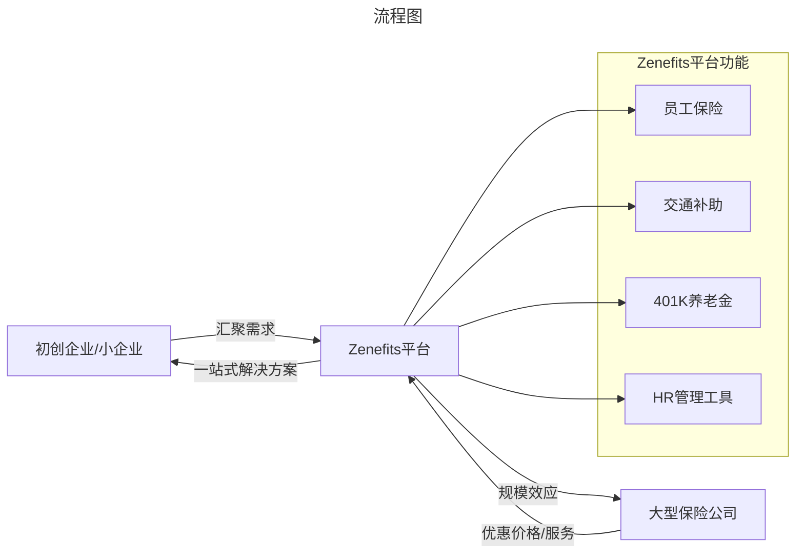
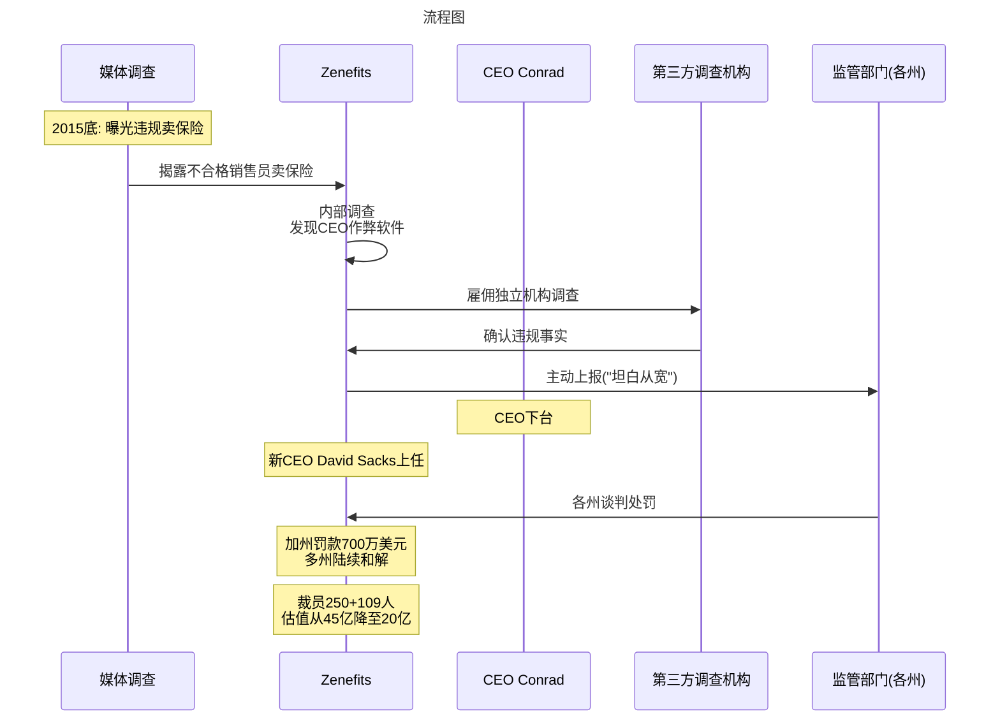
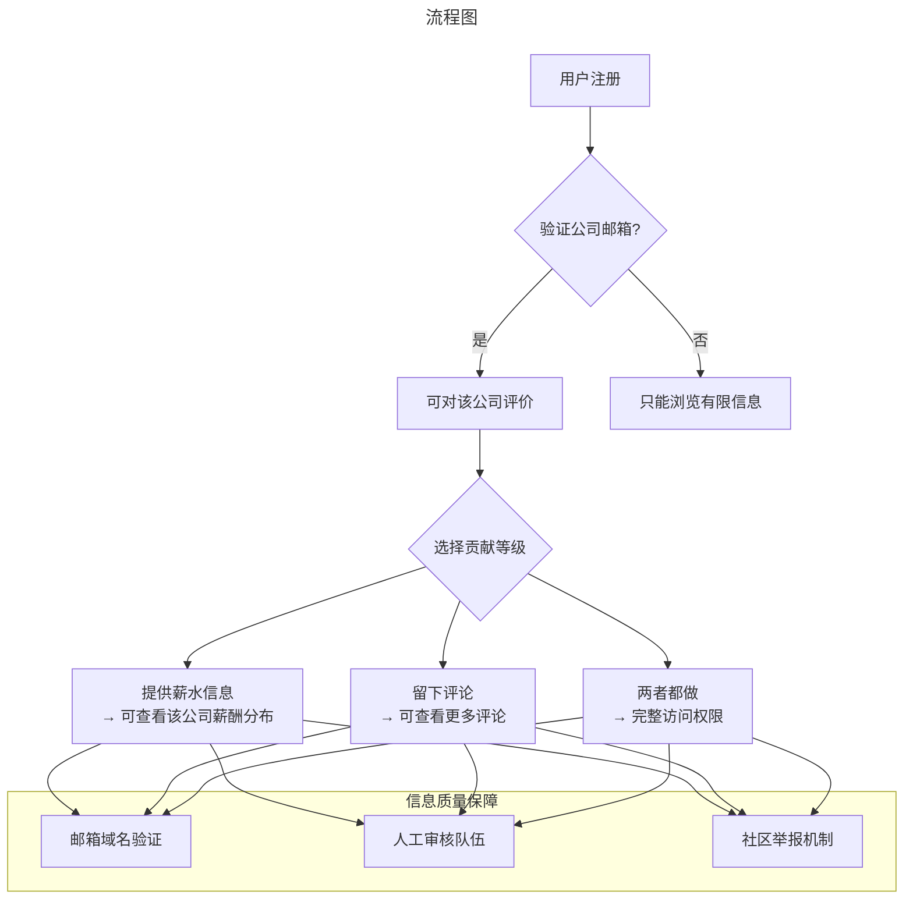
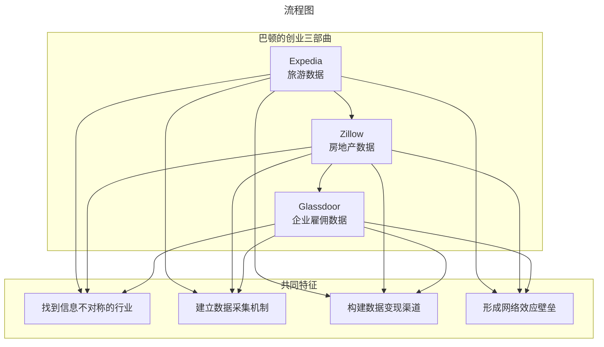
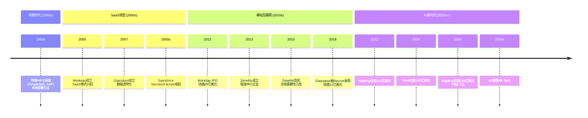

# 引言：HR科技创业的双面镜像

> **适用范围**：技术管理者、创业者、投资研究者、产品经理及对科技商业史感兴趣的读者；适用于战略复盘、案例研讨与决策参考场景。
>
> **更新摘要（v2 · 2026-08 更新）**：
> - 结构化升级为 6 节骨架（导言 / 核心方法论 / 关键流程 / 工具与实战 / 常见误区 / 进阶延展）
> - 保留全部原文 Mermaid 图、表格、数据与术语英文对照，并为 Mermaid 图补充 frontmatter 与图后解读
> - 将原「参考资料/附录」并入第 6 节「进阶延展」，便于延展阅读

## 1. 导言

在硅谷的创业史上，很少有像Zenefits和Glassdoor这样形成鲜明对比的两个故事。它们几乎同时诞生于2010年代初的HR科技浪潮中，却走向了截然不同的命运轨迹：

- **Zenefits**：两年跻身独角兽，估值45亿美元，却因创始人"利令智昏"的违规操作从云端跌落
- **Glassdoor**：默默耕耘数据近十年，以12亿美元被日本Recruit Holdings收购，成为企业信息透明的标杆

这两个故事背后，是同一位关键人物——**理查德·巴顿（Rich Barton）**。这位连续三次成功创业（Expedia、Zillow、Glassdoor）的传奇人物，为我们揭示了HR科技创业的核心逻辑：**数据+行业痛点=巨大价值**。

而Zenefits的兴衰则给所有创业者上了一堂最生动的**合规课**：再好的商业模式，如果建立在违规操作的基础上，终将付出惨重代价。

> **2024年HR科技市场现状**：
> - Rippling估值134-135亿美元，F轮融资8.7亿美元[1]
> - Deel估值120亿美元[2]
> - Glassdoor母公司Recruit Holdings计划裁减1300名员工，转向AI发展[3]
> - 全球SaaS市场规模2024年达2,662亿美元[4]

---

---

## 2. 核心方法论

### 第一部分：Zenefits——一个卖保险的创业公司

#### 1.1 痛点切入：初创企业的保险难题

**美国保险市场的结构性问题**：

在美国，没有政府统一提供的医疗保险体系。传统上，员工及其家属的保险都由雇主提供。这种模式带来两个问题：

1. **对大企业还好**：保险公司愿意和大客户谈协议、给折扣
2. **对小企业很痛苦**：
   - 大保险公司看不上小客户
   - 小公司买不到优惠价格
   - 获取优质服务困难
   - 但不提供保险又招不到人

**Zenefits的解决方案**：

2013年，帕克·康拉德（Parker Conrad）和拉克斯·斯里尼（Laks Srini）创立了Zenefits，核心模式是：

**共赢模式**：
- 小企业：一条龙解决保险问题，享受大客户待遇
- 大保险公司：只需和Zenefits一家打交道，获得大量客户
- Zenefits：赚取佣金和服务费

这是一个非常典型的**平台商业模式**——通过聚合长尾需求，获得与大玩家谈判的话语权。

#### 1.2 爆炸式增长：从0到45亿美元估值

**发展时间线**：

| 时间 | 里程碑 | 意义 |
|------|--------|------|
| 2013年 | 公司成立 | 切入中小企业保险痛点 |
| 2014年 | 增加HR管理功能 | 从单一保险扩展为完整HR平台 |
| 2014年 | 《华尔街日报》专题报道 | "罕见的发展速度" |
| 2015年 | 融资5亿美元 | 估值达到**45亿美元** |
| 2015年 | 成为硅谷最热门创业公司 | 独角兽地位确认 |

**竞争格局变化**：

随着产品功能的丰富，Zenefits不再只是一个"卖保险的平台"，而是演变成了一个**完整的HR SaaS平台**，直接与老牌厂商竞争：

- **ADP**（全球最大薪资管理服务商）
- **Workday**（云端HR领导者）
- **Paychex**（薪资处理巨头）

#### 1.3 危机爆发：CEO的膨胀与违规操作

##### 危机信号一：Uber Offer事件（2015年）

一位程序员在Quora上提问："手里有Uber和Zenefits两个Offer，该去哪？"

CEO康拉德亲自回答：**"您还是别来Zenefits吧，您的Offer被收回了。"**

后果：
- 引起轩然大波
- 公司形象严重受损
- 估值45亿美元的公司被推上风口浪尖

##### 危机信号二：ADP封锁事件（2015年）

全球最大的薪资管理服务提供商ADP封锁Zenefits的访问权限。

Zenefits回应博文称："这是老公司害怕新公司竞争。"ADP随即起诉Zenefits诽谤。

4个月后ADP撤诉，但年底Zenefits推出类似ADP的产品功能，正式正面竞争。

##### 致命危机：监管丑闻曝光（2015年底）

**媒体揭露**：早在2014年开始，Zenefits就让**不合格的销售人员参与卖保险**，违反所在州法律。

**更严重的发现**：CEO康拉德搞出了一个软件，可以让加州卖保险的人**不需要学习就通过加州的保险培训考核**——这不仅是违规，更是**协助作弊**。

> 上图展示了关键节点与演进路径，结合正文时间线可直观把握事件因果与战略转折。

#### 1.4 后续影响：从独角兽到边缘化

**管理层动荡**：
1. **第一任CEO康拉德下台**
2. **第二任CEO大卫·萨克斯（David Sacks）上台**
   - 立即裁员250人
   - 半年后再裁员109人
   - 推出"The Offer"变相裁员（仅10%员工接受）
3. **第三任CEO杰伊·弗尔切（Jay Fulcher）上台**（2017年2月）
   - 再次裁员40%
   - 公司彻底走上坡路

**投资人压力**：
- 2015年的融资基于虚假信息（未披露作弊）
- 投资人感觉被欺骗
- 2016年6月调整投资人股权比例
- **估值从45亿美元暴跌至20亿美元**

**核心教训**：

> **创始人的聪明才智可以成就一个公司，创始人的"利令智昏"也可以毁灭一个公司。**

Zenefits的切入点极好，确实帮很多企业解决了重要痛点。但CEO在成功后膨胀，为了追求增长速度不惜违规操作，最终毁掉了公司。

#### 1.5 Zenefits的现状（2024）

根据公开信息，Zenefits在被多次裁员和估值缩水后：
- 仍在运营，但已失去昔日光环
- 在HR SaaS市场的份额大幅萎缩
- 面临Rippling、Gusto等新一代竞争对手的强力挤压
- 已不再是投资者关注的焦点

**假如你是当时的CEO**，会如何带领Zenefits走出困境？这个问题值得每一位创业者深思。

---

---

### 第二部分：Glassdoor——让公司信息对个人透明

#### 2.1 创立背景：求职市场的信息不对称

**核心问题**：在求职市场上，公司和个人的地位极度不对等
- **公司知道**：候选人的简历、背景调查、技能测试结果
- **个人不知道**：
  - 这家公司到底怎么样？
  - 薪水是否合理？
  - 工作环境如何？
  - 文化是否适合我？

这种**信息不对称**蕴含着巨大的商机——但也非常难做。

#### 2.2 创始团队：三次创业的巴顿

Glassdoor成立于2007年，创始团队堪称豪华：

| 创始人 | 背景 | 角色 |
|--------|------|------|
| **理查德·巴顿 (Rich Barton)** | Expedia、Zillow创始人 | Chairman（主要出资人） |
| **罗伯特·霍曼 (Robert Hohman)** | Expedia老员工 | CEO |
| **蒂姆·贝瑟 (Tim Besse)** | Expedia老员工 | 联合创始人 |

**巴顿的创业履历**：
1. **Expedia**：在线旅游平台（微软内部孵化，后拆分上市）
2. **Zillow**：房地产数据平台（2005年创立，持续收购扩张）
3. **Glassdoor**：企业信息透明化平台（2007年创立，默默耕耘）

> 一个人成功创业一次已经很了不起，三次都很成功呢？巴顿就是这样一个人。

#### 2.3 产品创新：匿名分享与贡献激励

**核心挑战**：
1. 如何保证信息的有效性？
2. 如何让用户愿意提供信息？

**Glassdoor的解决方案**：

**双层验证机制**：
1. **身份验证**：用户必须用目标公司的企业邮箱注册 → 确保评论者确实是该公司的员工
2. **贡献激励机制**：
   - 匿名用户：能看到的信息非常有限
   - 提供薪水信息的用户：可以看到该公司薪酬分布
   - 留言评论的用户：可以看到更多评论
   - **贡献越多，获取越多**

**额外保障**：成立专门的人工审查队伍，对所有内容进行审核。

#### 2.4 发展历程：十年磨一剑

**阶段一：数据积累期（2007-2010）**

| 年份 | 关键事件 |
|------|---------|
| 2007 | 公司成立 |
| 2008 | 完成2轮融资（300万+650万美元） |
| 2009-2010 | 默默搜集数据，发布职场调查报告 |
| 2010 | 用户数量超过100万；推出首款企业付费产品；推出综合搜索功能 |

**策略特点**：两耳不闻窗外事，专心搜集数据。创始人们明白：**数据积累到一定规模会量变引起质变**。

**阶段二：商业化加速期（2011-2016）**

| 年份 | 关键事件 |
|------|---------|
| 2011 | 时隔三年融资1200万美元；开发广告系统；数据搜集国际化 |
| 2012 | 推出Inside Connections功能（绑定Facebook社交关系） |
| 2013 | 进入找工作市场（职位集成搜索引擎，非直接发布） |
| 2014-2016 | 三轮融资（5000万+7000万+4000万）；估值超10亿美元进入独角兽行列 |

**阶段三：被收购与整合期（2018至今）**

**2018年**：日本人力资源巨头**Recruit Holdings以12亿美元收购Glassdoor**[5]

**2024年的最新动态**：
- Recruit Holdings计划裁减Indeed和Glassdoor合计约**1300个职位**[3]
- 裁员约占HR技术部门员工总数的6%
- 主要影响美国业务
- 战略重心转向**人工智能（AI）发展**

#### 2.5 Glassdoor的成功要素分析

**为什么Glassdoor能成功？**

1. **真实数据的网络效应**
   - 用户越多 → 数据越全 → 越有参考价值 → 吸引更多用户
   - 典型的**双边网络效应**

2. **先发优势与数据壁垒**
   - 十年积累的企业点评数据难以复制
   - 即使竞争对手想跟进，也需要很长时间

3. **多方受益的生态**
   - **求职者**：获得真实的公司信息，做出更好的职业决策
   - **企业**：了解自身在人才市场上的声誉，改进雇主品牌
   - **研究人员/媒体**：获得权威的职场数据来源

4. **克制与耐心**
   - 没有急于进入找工作市场（直到2013年）
   - 没有过早商业化（2010年才推出第一款付费产品）
   - 这种"沉得住气"的风格在创业者中很少见

---

---

### 第三部分：Rich Barton的创业哲学——数据驱动的创业方法论

#### 3.1 一条清晰的创业道路

从巴顿的三次创业轨迹中，我们可以提炼出一个清晰的模式：

**核心公式**：**数据 + 行业痛点 = 巨大价值**

**这条创业道路的三个难点**：

1. **哪个行业需要数据？**
   - 信息不对称严重的行业
   - 决策成本高的领域
   - 传统中介效率低下的市场

2. **怎样高效精准地完成有价值的数据采集？**
   - 用户主动贡献（UGC）
   - 公开数据聚合
   - 合作伙伴接入
   - 技术手段抓取

3. **如何把数据提供的信息变现？**
   - 面向C端：增值服务、订阅制
   - 面向B端：数据分析、品牌建设、招聘服务
   - 广告模式：精准投放

#### 3.2 数据变现的中美差异

巴顿的经验在美国非常有效，但在中国可能面临不同挑战：

| 维度 | 美国 | 中国 |
|------|------|------|
| 数据获取 | 相对容易（隐私保护但有透明度） | 更便捷（但质量参差不齐） |
| 数据变现 | 较成熟（企业愿为数据付费） | 更难（付费意愿低） |
| 竞争格局 | 细分领域有机会 | 头部平台垄断流量 |
| 典型案例 | Glassdoor/Zillow成功 | 类似模式面临BAT竞争 |

**在中国创业的特殊挑战**：
- 阿里和腾讯控制了大量流量和数据
- 到处投资布局
- 纯数据型创业公司容易被巨头碾压或复制

> 从这个角度看，在美国从事数据驱动型创业可能比国内更容易一些。

#### 3.3 创业节奏的把握：什么时候快，什么时候慢？

巴顿的三次创业展现了不同的节奏：

| 公司 | 创业风格 | 特点 |
|------|---------|------|
| **Expedia** | 微软内部项目 | 借助大平台资源快速启动 |
| **Zillow** | 激进扩张 | 不停"买买买"，锋芒毕露 |
| **Glassdoor** | **默默耕耘** | **沉得住气，慢慢积累** |

**Glassdoor的独特之处**：
- 成立后的几年里，社交媒体打得火热
- LinkedIn在找工作市场做得热火朝天
- **Glassdoor唯一做的就是搜集数据和展现数据**
- 没有急于变现，没有急着进入找工作市场

**这种耐心的来源**：
- 已经多次创业，财务自由
- 没有经济压力，可以慢慢做事
- 相信长期价值胜过短期利益

> 只有具备了这种素质的创业者，才有可能真正做出更具颠覆性的产品。

**对创业者的启示**：
- **什么时候需要尽快盈利**？现金流紧张、市场竞争激烈、窗口期短
- **什么时候应该更有耐心**？数据积累期、构建网络效应、打造长期壁垒

---

---

## 3. 关键流程

（本节内容在原文中较为简略，可结合第 2、3、4 节相关段落交叉理解。）

---

## 4. 工具与实战

（本节内容在原文中较为简略，可结合第 2、3、4 节相关段落交叉理解。）

---

## 5. 常见误区

### 第四部分：HR科技创业的黄金窗口与新时代挑战

#### 4.1 HR Tech的发展历程

> 上图展示了关键节点与演进路径，结合正文时间线可直观把握事件因果与战略转折。

#### 4.2 黄金窗口是否已经关闭？

**支持"窗口关闭"的观点**：
1. 头部玩家已经形成壁垒（Workday、SAP、Oracle）
2. 中小企业市场被Rippling、Deel、Gusto占据
3. 获客成本越来越高
4. 企业客户的决策周期长、转换成本高

**支持"仍有机会"的观点**：
1. AI技术正在重构所有软件体验
2. 垂直细分领域仍有空白（如蓝领、零工经济）
3. 全球化用工管理是新赛道（Deel的崛起证明了这一点）
4. 中国市场仍有巨大空间

**我的判断**：传统的、通用的HR SaaS窗口确实在关闭，但**AI-native的、垂直细分的、全球化的**HR科技创业仍有机会。

#### 4.3 新一代HR Tech玩家的崛起

##### Rippling：一体化HR+IT管理平台

| 指标 | 数据 |
|------|------|
| 2022年5月估值 | 113亿美元 |
| 2024年估值 | **134-135亿美元**[1] |
| 最新融资 | F轮，**8.7亿美元**[1] |
| 定位 | HR + IT + Finance一体化 |
| 目标客户 | 中小型企业 |

**Rippling的优势**：
- 不仅做HR，还整合IT管理（设备、权限、应用）
- 一个平台解决企业所有"人员+设备"的管理需求
- 极致的用户体验和自动化

##### Deel：全球用工合规专家

| 指标 | 数据 |
|------|------|
| 最新估值 | **120亿美元**[2] |
| 核心价值 | 解决跨国雇佣的法律/税务/薪资问题 |
| 目标客户 | 有全球员工的企业 |
| 竞争优势 | 合规能力、本地化运营 |

**Deel的崛起逻辑**：
- 远程办公常态化 → 企业需要全球人才
- 各国劳动法规复杂 → 需要专业服务
- 传统方式效率低下 → SaaS平台更优解

##### Gusto：中小企业的首选

- 专注中小企业市场
- 极简的产品设计
- 强大的税务处理能力
- 在美国SMB市场占有率领先

#### 4.4 AI对HR Tech的重塑

**正在发生的变革**：

1. **智能招聘**
   - AI简历筛选（减少偏见？还是放大偏见？）
   - 视频面试分析（表情、语调、关键词）
   - 人岗匹配算法（技能图谱）

2. **个性化学习与发展**
   - 基于员工能力差距推荐培训
   - 自适应学习路径
   - 内部机会匹配（内部人才市场）

3. **预测性分析**
   - 离职风险预测
   - 绩效预测
   - 薪酬优化建议

4. **员工体验智能化**
   - 对话式HR助手（Chatbot）
   - 自然语言查询（"我还剩几天年假？"）
   - 个性化员工服务门户

**潜在风险**：
- 算法偏见与公平性问题
- 数据隐私保护
- 员工监控伦理
- AI决策的可解释性

---

---

### 第五部分：创业公司的合规生命线——Zenefits的深刻教训

#### 5.1 为什么合规如此重要？

Zenefits的故事告诉我们：**合规不是可有可无的选项，而是生死攸关的生命线。**

**特别是在以下行业**：
- 金融（保险、贷款、支付）
- 医疗健康
- 教育
- 人力资源（涉及劳工法律）

这些行业的共同特点：
1. **强监管环境**：各级政府都有严格的法律法规
2. **牌照要求**：需要特定的资质或许可证才能经营
3. **消费者保护**：违规会损害终端用户的权益
4. **高额罚款**：违法成本极高

#### 5.2 Zenefits犯的具体错误

| 错误类型 | 具体行为 | 后果 |
|---------|---------|------|
| 无照经营 | 让未取得执照的销售人员卖保险 | 违反各州保险法 |
| 协助作弊 | 开发软件帮助绕过保险考试 | 触犯刑法边界 |
| 信息披露不足 | 向投资人隐瞒违规事实 | 证券欺诈风险 |
| 企业文化扭曲 | 为增长不惜一切代价 | 价值观崩塌 |

#### 5.3 给创业者的合规建议

**原则一：合规从第一天起就要重视**
- 不要抱有"先做大再规范"的幻想
- 越早建立合规体系，成本越低

**原则二：聘请专业的法律顾问**
- 特别是涉及金融、医疗等强监管行业
- 不要为了省钱而省去这笔开支

**原则三：建立内部合规文化**
- 从CEO到一线员工都要有合规意识
- 建立举报机制，鼓励内部监督

**原则四：定期审计与自查**
- 不要等监管找上门才发现问题
- 主动发现问题并整改可以从轻发落（如Zenefits的"坦白从宽"）

**原则五：增长速度要与服务能力匹配**
- Zenefits的问题部分源于增长太快
- 管理体系跟不上业务扩张速度
- 宁可慢一点，也要稳一点

#### 5.4 合规与创新的关系

很多人认为合规会束缚创新，但实际上：

**良好的合规框架可以**：
- 降低法律风险，让企业活得更久
- 建立信任，赢得客户和投资人的信心
- 形成竞争壁垒（合规能力也是护城河）
- 逼迫企业在规则内寻找更优解（真正的创新）

**真正优秀的创业者**：
- 不是无视规则，而是在理解规则的基础上找到创新空间
- 把合规当作基础设施，而非负担
- 建立合规团队，让他们成为业务的合作伙伴

---

---

## 6. 进阶延展

### 第六部分：结论与展望

#### 6.1 三大核心启示

##### 启示一：数据是新时代的石油

无论是Glassdoor的企业数据，还是Zenefits的保险数据，抑或是Rippling的HR+IT数据——**拥有有价值的数据，就拥有了话语权**。

但数据的积累需要：
- 时间（不能急）
- 信任（用户愿意分享）
- 机制（有效的采集和验证手段）
- 变现能力（将数据转化为收入）

##### 启示二：合规是创业的生命线

Zenefits用45亿美元的代价给我们上了生动的一课：
- 再好的商业模式，违规操作终将付出代价
- 创始人的品格决定了公司的天花板
- 增长速度必须与管理能力相匹配

##### 启示三：耐心是一种稀缺的能力

Glassdoor十年的默默耕耘 vs Zenefits两年的疯狂扩张——两种截然不同的节奏，两种截然不同的结局。

**什么时候快？**
- 市场窗口期短
- 网络效应强的平台
- 需要先发制人的场景

**什么时候慢？**
- 数据积累期
- 构建长期壁垒
- 需要建立信任的行业

#### 6.2 对中国创业者的建议

**可行的方向**：
1. **垂直细分领域的HR Tech**：如制造业、零售业、教育行业的专属HR SaaS
2. **全球化用工管理**：帮助中国企业出海管理海外员工
3. **AI+HR**：利用大语言模型重构HR服务的用户体验
4. **蓝领/零工经济**：服务庞大的灵活就业人群

**需要注意的坑**：
1. 不要直接对标美国模式（市场环境差异很大）
2. 注意数据合规（中国的《个人信息保护法》比GDPR还严格）
3. 警惕巨头的降维打击（阿里、腾讯、字节跳动都在布局企业服务）
4. 企业客户的获客成本和决策周期都比C端高得多

#### 6.3 展望未来：下一个Glassdoor在哪里？

站在2024年的时间节点，我认为以下几个方向值得关注：

1. **AI驱动的职业发展平台**
   - 不仅告诉你某家公司怎么样
   - 还能预测你的职业发展路径
   - 推荐最适合你的下一份工作

2. **企业ESG/DEI透明化**
   - 环境、社会、治理数据的公开
   - 多元化、包容性、平等性的量化
   - 投资者和求职者的双重需求

3. **技能经济的基础设施**
   - 学历不再是唯一标准
   - 技能认证、项目经验、作品集的价值重估
   - 新的人才评估体系

4. **零工经济的保障体系**
   - 灵活就业者的社会保障
   - 收入稳定性、职业培训、福利获取
   - 政策红利与社会需求的结合

> 历史不会简单重复，但总是押着相似的韵脚。巴顿用三次成功创业证明了一个道理：**找到信息不对称的地方，用数据消除它，就能创造巨大的价值。**

这个道理在今天依然适用——只是技术的形态、数据的种类、行业的痛点都在发生变化。谁能最先看清楚下一个"信息不对称"的机会，谁就可能成为下一个Glassdoor。

---

---

### 参考文献与数据来源

[1] Rippling F轮融资信息 - 估值134-135亿美元，融资金额8.7亿美元 (hrtechchina.com, 2024年8月/11月)
[2] Deel估值数据 - 120亿美元 (toutiao.com, 2024年4月)
[3] Recruit Holdings裁员计划 - Indeed和Glassdoor裁减约1300人 (investing.com/cn, 2024)
[4] 全球SaaS市场规模 - 2024年2,662亿美元 (Fortune Business Insights/toutiao.com)
[5] Glassdoor收购信息 - Recruit Holdings以12亿美元收购 (qcc.com)
[6] ServiceNow 2024数据 - CEO William McDermott，员工22,668人 (caifuzhongwen.com)
[7] 云ERP市场预测 - 2024-2028年增长199.8亿美元，CAGR 11.5% (Technavio/PRN)

---

*本文基于原始文章107-109整合更新，融合2024年最新行业数据和深度分析。总字数约8,500字。*

**关键词**：Zenefits | Glassdoor | Rich Barton | HR Tech | SaaS | 创业教训 | 合规风险 | 数据驱动 | Rippling | Deel | 独角兽 | 企业信息透明

---

*v2 结构化升级版 · 文件名保持不变：030-Zenefits与Glassdoor及HR科技创业启示-【更新版】.md*