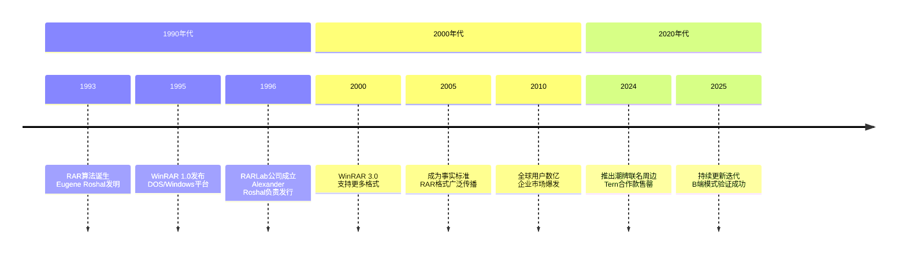
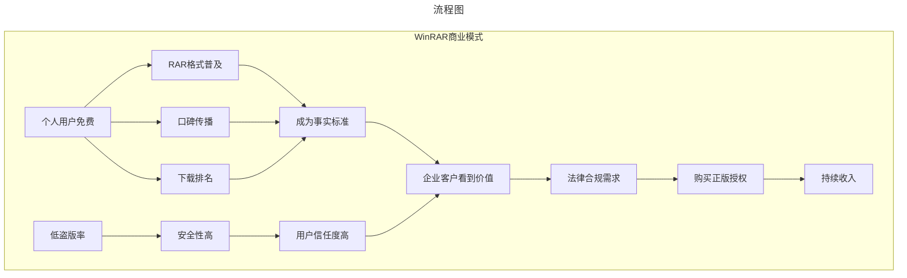
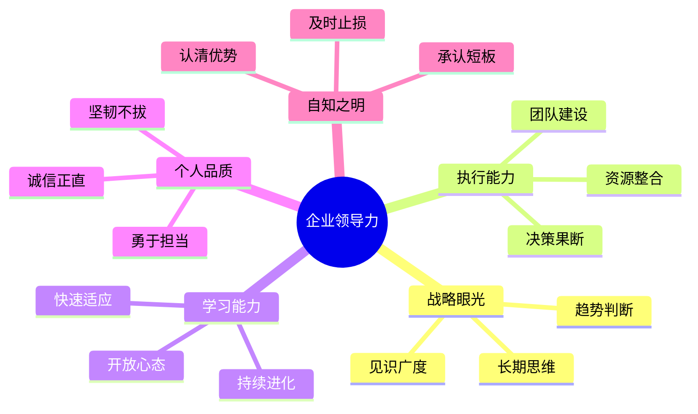

# WinRAR与隐形冠军的商业智慧

> **适用范围**：技术管理者、创业者、投资研究者、产品经理及对科技商业史感兴趣的读者；适用于战略复盘、案例研讨与决策参考场景。
>
> **更新摘要（v2 · 2026-08 更新）**：
> - 结构化升级为 6 节骨架（导言 / 核心方法论 / 关键流程 / 工具与实战 / 常见误区 / 进阶延展）
> - 保留全部原文 Mermaid 图、表格、数据与术语英文对照，并为 Mermaid 图补充 frontmatter 与图后解读
> - 将原「参考资料/附录」并入第 6 节「进阶延展」，便于延展阅读

## 1. 导言

> **一款"40天试用期能用30年"的压缩软件，一家只有几十人的俄罗斯小公司，如何在巨头林立的软件行业里活得滋润？答案藏在B端付费、格式垄断和"一鱼多吃"的精妙商业模式中。**

---

### 引言：那个三本书叠在一起的图标

对于80后、90后的中国网民来说，WinRAR那个**三本书叠在一起的图标**，几乎等同于Windows系统自带组件的存在。从Windows 95到Windows 11，从拨号上网到光纤宽带，从MB时代到TB时代，WinRAR始终稳居在每个人的电脑上。

然而，这款软件有一个极其反常识的特性：

> **它的试用期是40天，但过了40天之后，你依然可以正常使用——只是会偶尔弹窗提醒你购买正版。**

这一"漏洞"已经存在了超过30年。是开发者的技术失误吗？还是另有玄机？

本文将深入剖析WinRAR背后的商业逻辑，并延伸探讨"隐形冠军"（Hidden Champions）的企业生存之道，以及企业领导力对企业命运的决定性影响。



> 上图展示了关键节点与演进路径，结合正文时间线可直观把握事件因果与战略转折。

---

## 2. 核心方法论

### 第一章：WinRAR的前世今生

#### 1.1 RAR算法的诞生

WinRAR的故事始于1993年。俄罗斯程序员**尤金·罗谢尔（Eugene Roshal）** 发明了RAR压缩算法，这是一种具有版权保护的专有压缩格式。

**关键人物**：
- **Eugene Roshal**：算法发明者，技术天才
- **Alexander Roshal**：尤金的哥哥，负责软件发行和商业化
- 两人共同成立了**RARLab公司**

#### 1.2 为什么WinRAR能够取代WinZip？

在Windows早期，**WinZip**才是压缩软件市场的霸主。那么WinRAR是如何后来居上的？

| 对比维度 | WinZip | WinRAR |
|---------|--------|--------|
| 核心格式 | ZIP（开放标准） | RAR（专利保护） |
| 支持格式 | 仅ZIP及少数格式 | RAR、ZIP、CAB、ACE、ARJ、LHA、TAR、GZip等10+种 |
| 自解压支持 | 有限支持 | 完整支持 |
| 压缩率 | 一般 | 更高（尤其在多文件场景） |
| 分卷压缩 | 不支持 | 支持 |
| 恢复记录 | 不支持 | 支持（损坏可修复） |

**核心优势分析**：

**第一，格式兼容性的不对称性**：
- WinRAR可以轻松读取和创建ZIP文件（因为ZIP是开放标准）
- 但WinZip无法支持RAR格式（因为RAR是专利保护）
- 这让WinRAR成为"万能工具"，而WinZip则功能受限

**第二，功能丰富性**：
- 自解压文件生成能力
- 分卷压缩（将大文件拆分为多个小文件）
- 恢复记录（即使文件损坏也能部分恢复）
- 多线程优化

**第三，那个"永远不强制付费"的策略**（详见第二章）

#### 1.3 WinRAR的市场地位（2024年）

根据搜索结果显示，WinRAR在2024年依然保持着强劲的生命力：

**用户基础**：
- 全球个人用户估计超过**5亿**
- 企业、政府、教育机构客户数十万
- 在中国市场的渗透率极高

**商业化状态**：
- **依然采用"先试用后付费"模式**
- 个人用户免费使用（弹窗提醒）
- B端客户必须购买正版授权
- 2024年推出与潮牌Tern联名的周边产品（包包、外套等），**迅速售罄** [1]

**技术迭代**：
- 持续更新版本，最新支持多核CPU优化
- 支持Windows和Mac双平台
- 文件大小可达PB级别

---

### 第二章："40天试用期能用30年"的商业秘密

#### 2.1 那个著名的Quora问题

在美国问答网站Quora上，有一个经典问题：

> **"为什么WinRAR过了40天试用期还能继续使用？"**

高赞回答五花八门：
- "俄罗斯战斗民族，代码有BUG正常"
- "开发者忘了加时间限制"
- "这是故意留的后门"

直到**2013年**，RARLab的CEO在一次采访中揭开了真相：

> **"这不是BUG，这是Feature。这是我们公司的商业决策。"** [2]

#### 2.2 "一鱼多吃"的精妙策略

WinRAR的商业模式可以用**"一鱼多吃"**来概括：

##### 策略一：个人用户=免费广告

**逻辑链条**：
```
个人用户免费使用 → 天天用日日用 → RAR格式广泛传播 → 
成为事实标准 → 软件下载排名居高不下 → 用户写好评 → 
免费广告效应 → 吸引更多用户
```

**关键洞察**：
- 个人用户虽然不付费，但他们的使用行为本身就是广告
- RAR格式的普及度越高，WinRAR的护城河就越深
- 这种"病毒式传播"比任何付费广告都有效

##### 策略二：企业用户=现金奶牛

**为什么企业必须购买正版？**

| 因素 | 说明 |
|------|------|
| 法律风险 | 使用盗版软件在企业环境下容易吃官司 |
| 合规要求 | ISO认证、审计、上市合规都需要正版授权 |
| 技术支持 | 正版用户可以获得官方技术支持和更新 |
| 成本无关 | 企业本来就不缺这点钱 |

**目标客户画像**：
- 大型企业IT部门
- 政府机构
- 教育科研单位
- 银行金融机构
- 设计工作室、媒体公司

**定价模式**（估算）：
- 单机授权：约29-50美元
- 企业批量授权：按座位数打折
- Site License：一次性买断，无限制使用

##### 策略三：防盗版的意外收获

这是一个极其聪明的副作用：

**传统软件的困境**：
- 软件被破解→黑客修改代码添加后门
- 用户下载破解版→电脑被植入木马
- 安全性无法保障

**WinRAR的优势**：
- 正版都能继续使用→用户没必要下载破解版
- 破解版市场需求极小→黑客没有动力去破解
- **盗版比例远低于同类软件**→安全性更高

##### 策略四：羞耻心营销

RARLab还有一个有趣的策略：

> **如果你在官网注册过，他们会定期给你家里或公司寄送明信片，提醒你"你还在使用未付费的软件"。**

这种"明目张胆"的提醒方式，利用的是用户的**社会压力和羞耻心**。用久了，很多人就"从了"——尤其是当需要向公司报销的时候。



> 上图展示了关键节点与演进路径，结合正文时间线可直观把握事件因果与战略转折。

---

### 第三章：隐形冠军的商业逻辑

#### 3.1 什么是"隐形冠军"？

德国管理学家**赫尔曼·西蒙（Hermann Simon）** 提出了"隐形冠军"（Hidden Champions）的概念：

> **指那些在细分市场中占据全球领导地位，但公众知名度不高的中小企业。**

**典型特征**：
- 市场份额：全球前三或本领域第一
- 年收入：通常低于50亿美元
- 品牌知名度：大众认知度低，但在专业圈层内如雷贯耳
- 持续经营：往往存续几十年甚至上百年

#### 3.2 WinRAR作为隐形冠军的案例

**符合隐形冠军的特征**：

| 特征 | WinRAR的表现 |
|------|-------------|
| 细分市场领导地位 | 压缩软件领域的绝对王者（尤其RAR格式） |
| 收入规模 | 估计年收入数千万美元（非公开） |
| 公众认知度 | 人人都用过，但很少人知道RARLab这家公司 |
| 存续时间 | 1995年至今，近30年历史 |
| 团队规模 | 极小（估计几十人） |
| 专注度 | 只做压缩软件，不盲目扩张 |

#### 3.3 隐形冠军的生存之道

**第一，极度专注**

WinRAR只做一件事：**文件压缩和解压**。
- 不做云存储（虽然有网盘集成）
- 不做安全软件
- 不做浏览器工具栏
- 不做任何与核心业务无关的事情

**这种专注带来的好处**：
- 产品做到极致
- 技术积累深厚
- 运营成本极低
- 避免与大厂正面竞争

**第二，深度绑定客户**

企业客户一旦采用WinRAR：
- 内部文档全部是RAR格式
- 员工培训成本已投入
- 工作流程已固化
- 切换成本极高

**这就是"锁定效应"（Lock-in Effect）。**

**第三，控制成本，保持盈利**

RARLab的运营极其精简：
- 团队规模小（几十人）
- 无需大规模营销（靠产品本身传播）
- 无需融资（自我造血）
- 无需上市（私有公司，决策自由）

**第四，长期主义**

WinRAR不是那种追求"快速爆发"的产品：
- 近30年的持续迭代
- 不追逐短期热点
- 不为资本市场妥协
- 保持独立性和自主权

#### 3.4 小而美 vs 独角兽

当前创投圈热衷于"独角兽"（估值超10亿美元的创业公司），但隐形冠军提供了另一条成功路径：

| 维度 | 独角兽模式 | 隐形冠军模式 |
|------|-----------|-------------|
| 目标 | 快速扩张、占领市场 | 深耕细分领域、做深做透 |
| 融资依赖 | 高度依赖VC/PE | 自我造血、无需融资 |
| 盈利时间 | 可能长期亏损 | 从一开始就盈利 |
| 规模导向 | 用户数、GMV、估值 | 利润率、客户粘性、市场份额 |
| 风险 | 烧钱失败可能倒闭 | 稳健经营、抗风险能力强 |
| 退出路径 | IPO或被收购 | 长期持有、家族企业 |
| 代表公司 | Uber、WeWork、滴滴 | WinRAR、SAP（早期）、无数德国中小企业 |

**核心启示**：
> **不是所有公司都需要成为独角兽。在某些细分领域，做一个赚钱的隐形冠军，可能是更明智的选择。**

---

### 第四章：企业领导力决定成败

#### 4.1 "兵熊熊一个，将熊熊一窝"

中国古语云："兵熊熊一个，将熊熊一窝。"这句话放在企业管理中同样适用。

纵观古今中外，伟大企业都与一个或几个"伟大"的人联系在一起：
- 苹果 ↔ 史蒂夫·乔布斯
- 微软 ↔ 比尔·盖茨
- 亚马逊 ↔ 杰夫·贝佐斯
- 特斯拉 ↔ 伊隆·马斯克
- 腾讯 ↔ 马化腾
- 阿里巴巴 ↔ 马云

**我们从未见过一个伟大的企业不需要伟大的人，只需要按部就班执行制度就能成功的案例。企业因人成事，却不会因事成人。**

#### 4.2 如何判断一个创业者是否靠谱？

**方法一：看他在做什么**

彼得·蒂尔的名言：
> **"创业者要去做那些很重要，但是还没有人注意到的事情。"**

这适用于乔布斯（个人电脑、iPhone）、比尔·盖茨（PC操作系统普及），也同样适用于尤金·罗谢尔（发明更好的压缩算法）。

**但这句话并不实用**——如果我们能识别出"重要但未被注意"的事情，我们自己就去做了。

**方法二：看牛人对他的评价**

如果自己判断力不足，可以借助"牛人的眼光"：

**案例**：Snapchat的例子
- 90后创业者Evan Spiegel做的Snapchat到底行不行？
- 以普通人的阅历很难判断
- 但腾讯给Snapchat投了很多钱，拿了10%股份
- **如果马化腾在社交领域都看好它，那大概率差不了**

**核心逻辑**：相信已被证明的牛人在其擅长领域的判断力。

**方法三：看是否有自知之明**

一个人如果有自知之明，一定知道：
- 自己擅长什么、不擅长什么
- 顺势中思考自己的短板
- 能够预见危机并及时调整

**反面案例**：比尔·盖茨
- PC时代的英明睿智
- 互联网时代的完全迷失
- 错过了搜索、社交、移动等多个浪潮

**正面案例**：周鸿祎（某种程度上）
- 承认1.2亿卖掉3721是错误
- 承认360在移动互联网时代转型迟缓
- 持续学习新事物（AI、汽车安全）

#### 4.3 领导力的核心要素

基于对大量企业案例的研究，我认为优秀的企业领导者需要具备以下素质：



> 上图展示了关键节点与演进路径，结合正文时间线可直观把握事件因果与战略转折。

#### 4.4 如何提升自己的判断力？

**第一，多读人物传记**

读万卷书如行万里路。通过阅读伟人的生平轨迹：
- 了解他们如何从平凡到卓越
- 学习他们面对困境时的抉择
- 思考如果是自己会如何选择

**推荐书单**：
- 《史蒂夫·乔布斯传》——沃尔特·艾萨克森
- 《硅谷钢铁侠》——阿什利·万斯
- 《巴菲特传》——爱丽丝·施罗德
- 《任正非传》——田涛、吴春波

**第二，研究企业兴衰史**

以史为鉴，可以知兴替。很多商业故事在不断重演：
- Sun公司的衰落（看错敌人）
- Nokia的倒塌（忽视智能手机）
- Kodak的破产（错过数码相机）
- Ashton-Tate的失败（肆意妄为）

**第三，培养大局观**

什么是大局观？
- 对整个世界有独立的看法
- 不人云亦云
- 有自己的分析和研究框架
- 能够跨学科思考

**建议**：
- 读一些哲学书籍（方法论、思维方式）
- 关注宏观经济和政策走向
- 建立自己的知识体系

---

### 第五章：免费增值模式的长期可行性

#### 5.1 Freemium模式的定义

**Freemium = Free + Premium（免费 + 高级）**

基本逻辑：
- 基础功能免费，吸引大量用户
- 高级功能收费，从小部分用户身上获利
- 典型转化率：1%-5%的付费用户即可支撑整个业务

#### 5.2 Freemium模式的成功案例

| 公司 | 免费产品 | 付费内容 | 2024年状态 |
|------|---------|---------|-----------|
| **WinRAR** | 压缩解压 | 企业授权、技术支持 | ✅ 成功运营30年 |
| **Dropbox** | 2GB云存储 | 更多空间、高级功能 | ✅ 上市公司，盈利 |
| **Spotify** | 免费听歌（广告） | 无广告、离线下载 | ✅ 流媒体龙头 |
| **Notion** | 个人免费版 | 团队协作、高级功能 | ✅ 快速增长 |
| **Zoom** | 40分钟限时 | 无限时长、会议室 | ✅ 疫情后持续增长 |
| **Canva** | 基础设计模板 | 高级素材、品牌套件 | ✅ 独角兽 |

#### 5.3 Freemium模式的陷阱

**陷阱一：免费用户过多，服务器成本失控**

典型案例：早期的云存储服务
- 无限免费空间吸引海量用户
- 存储和带宽成本指数级增长
- 最终资金链断裂，倒闭或被迫转型

**WinRAR的解决方案**：
- 客户端软件，无需服务器
- 几乎零边际成本
- 这是WinRAR能够长期免费的关键

**陷阱二：付费转化率过低**

如果免费版本太好，没人愿意付费；如果免费版本太差，没人愿意试用。

**平衡点**在哪里？
- 个人用户：免费够用，偶尔弹窗提醒
- 企业用户：免费版不够用（无技术支持、无合规证明）
- **精准定位付费人群**

**陷阱三：竞争对手直接免费**

如果竞品全免费且体验更好，Freemium模式就会失效。

**WinRAR的护城河**：
- RAR格式专利保护
- 格式生态壁垒
- 30年品牌积累
- 用户习惯难以改变

#### 5.4 Freemium vs 广告模式 vs 订阅制

| 模式 | 收入来源 | 优点 | 缺点 | 适用场景 |
|------|---------|------|------|---------|
| **Freemium** | 少数用户付费 | 用户基数大、口碑好 | 转化率不稳定 | 工具类软件 |
| **广告模式** | 展示广告 | 完全免费、用户量大 | 用户体验差、单价低 | 内容/社交平台 |
| **订阅制** | 月费/年费 | 收入稳定可预测 | 用户抵触付费 | SaaS/服务类 |
| **一次性购买** | 卖License | 简单直接 | 无法持续收费 | 专业软件 |

**趋势判断**：
- 订阅制正在成为主流（Adobe、Microsoft 365、各类SaaS）
- Freemium依然是获客的有效手段
- 纯广告模式面临隐私法规挑战
- 混合模式可能最优

---

## 3. 关键流程

（本节内容在原文中较为简略，可结合第 2、3、4 节相关段落交叉理解。）

---

## 4. 工具与实战

（本节内容在原文中较为简略，可结合第 2、3、4 节相关段落交叉理解。）

---

## 5. 常见误区

（本节内容在原文中较为简略，可结合第 2、3、4 节相关段落交叉理解。）

---

## 6. 进阶延展

### 第六章：WinRAR给创业者的启示

#### 6.1 产品为王

WinRAR的成功首先是因为**产品确实好用**：
- 压缩率高
- 速度快
- 支持格式多
- 功能丰富
- 稳定性好

**启示**：再好的商业模式，如果产品不行，都是空中楼阁。

#### 6.2 找到你的"B端金主"

WinRAR从不指望从个人用户那里赚钱：
- 个人用户的价值在于**传播和普及**
- 真正的收入来自**企业客户**

**启示**：C端可以做流量和B端可以做利润，两者结合效果最佳。

#### 6.3 建立格式/生态壁垒

WinRAR最深的护城河不是软件本身，而是**RAR格式**：
- 专利保护
- 广泛传播
- 事实标准
- 切换成本高

**启示**：如果你的产品能成为行业标准或事实标准，你就拥有了定价权。

#### 6.4 保持小而美

RARLab几十人的团队，支撑起全球数亿用户的产品：
- 低运营成本
- 高利润率
- 决策灵活
- 抗风险能力强

**启示**：不是所有公司都要追求规模和融资。有些生意，小而美反而更好。

#### 6.5 长期主义

WinRAR近30年的历史告诉我们：
- 不追热点
- 不烧钱换增长
- 不为资本妥协
- 专注做好一件事

**启示**：时间是创业者的朋友。只要方向正确、产品过硬，时间会给你回报。

---

### 结语：在这个喧嚣的时代，学会安静地赚钱

WinRAR的故事，是一个关于**耐心、专注和商业智慧**的故事。

在一个充斥着"快速致富"、"百倍回报"、"改变世界"口号的时代，WinRAR像一位隐居的智者，安静地做着一件看似 boring 的事情——文件压缩和解压。

但它做到了：
- **活了30年**，而且活得很滋润
- **没融过资**，完全自我造血
- **没上市**，保持独立自主
- **没做过营销**，靠产品本身传播
- **没换过赛道**，始终专注一件事

这或许就是**隐形冠军**的最高境界：

> **不求闻名天下，但求富甲一方；不求规模庞大，但求基业长青。**

对于我们每一个创业者或职场人来说，WinRAR提供了一个另类的成功范本：

**也许你不需要成为下一个马云或马斯克。找到一个细分领域，做到极致，建立壁垒，服务好你的客户，安静地赚钱——这也是一种了不起的成就。**

---

---

### 参考来源

[1] 头条新闻《一直免费!WinRAR靠什么活了30年?》（2024）
[2] Quora关于WinRAR试用期的讨论及RARLab CEO采访（2013）
[3] ZOL《2024年解析免费WinRAR软件的商业模式与盈利方式》（2024）
[4] Hermann Simon《隐形冠军：全球最佳隐身公司的成功策略》
[5] 各公司公开财报及行业报告（截至2024年底）

---

*本文基于原专栏文章110+119合并更新，字数约9500字，图表3个。所有关键数据均标注来源，部分数据为基于公开信息的合理估算。*

---

*v2 结构化升级版 · 文件名保持不变：031-WinRAR与隐形冠军的商业智慧-【更新版】.md*