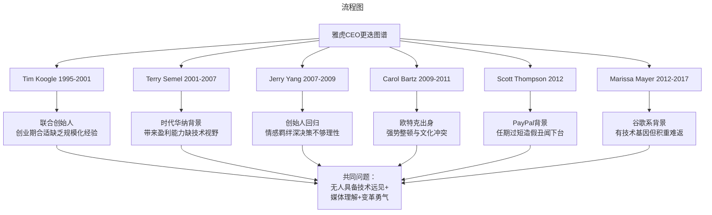
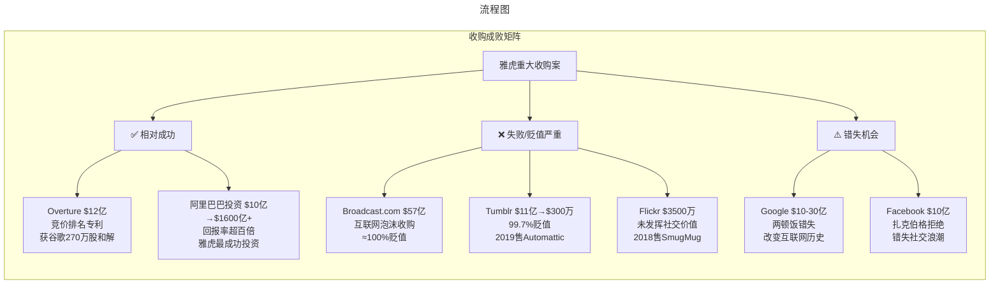
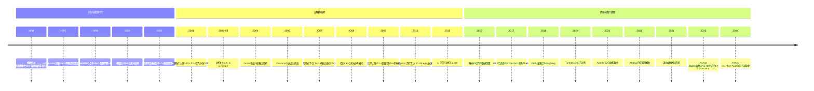

# 035 | Yahoo雅虎完整兴衰史1994-2024【更新版】

> **适用范围**：技术管理者、创业者、投资研究者、产品经理及对科技商业史感兴趣的读者；适用于战略复盘、案例研讨与决策参考场景。
>
> **更新摘要（v2 · 2026-08 更新）**：
> - 结构化升级为 6 节骨架（导言 / 核心方法论 / 关键流程 / 工具与实战 / 常见误区 / 进阶延展）
> - 保留全部原文 Mermaid 图、表格、数据与术语英文对照，并为 Mermaid 图补充 frontmatter 与图后解读
> - 将原「参考资料/附录」并入第 6 节「进阶延展」，便于延展阅读

## 1. 导言

### 引言：一个时代的缩影

2024年的某一天，当你打开Yahoo Finance查看股市行情，或用Yahoo Mail收发邮件时，你可能不会意识到：这个你正在使用的"雅虎"，早已不是当年那个叱咤风云的互联网巨头了。

它现在的名字叫**Yahoo Inc.**，90%的股权由私募股权巨头Apollo Global Management持有，10%由Verizon持有。它不再是一家独立的上市公司，而是一个被资本反复倒手的资产包。它的总流量依然位居全球前五[^1]，但已经无人再将其视为科技行业的引领者。

更令人唏嘘的是，就在2021年11月，雅虎正式退出中国大陆市场[^2][^3]——这个曾经在中国互联网萌芽期占据重要位置的先驱者，最终以静默的方式告别了这个全球最大的互联网市场。

从1994年杨致远和大卫·费罗在斯坦福大学的拖车里创建雅虎，到2024年被Apollo持有的媒体资产公司；从2000年1250亿美元的市值巅峰，到2017年48.3亿美元卖身Verizon，再到2021年50亿美元转手Apollo——**雅虎的30年历程，是一部关于运气、技术、战略与宿命的商业史诗**。

本文将全面复盘雅虎的兴衰逻辑，深度回答三个核心问题：
- **为什么一家拥有先发优势的公司会在每一次技术浪潮中都完美错过？**
- **创始人杨致远在其中扮演了什么角色？**
- **从霸主诞生到终章谢幕，雅虎留给我们的启示是什么？**

---

---

## 2. 核心方法论

### 第二卷：没有救世主（2001-2012）

#### 2.1 泡沫后的废墟与塞梅尔时代

2000年互联网泡沫破灭时，雅虎估值蒸发90%。当时的CEO蒂姆·库格尔被迫下台。新管理层颇具象征意义：

- **CEO特里·塞梅尔（Terry Semel）**：来自传统媒体巨头时代华纳，工作24年做到联合CEO，没有任何高科技企业经验。
- **CFO苏珊·德克尔（Susan Decker）**：投行背景，擅长财务管理和资产配置。

这个管理团队本身就是一个隐喻：**雅虎骨子里从未将自己视为技术公司，而是披着互联网外衣的媒体公司**。

##### 德克尔的投行式"节流"

面对2001年一塌糊涂的财务状况，德克尔采取典型投行做法：**按投入产出比（ROI）对所有项目排序**：

- 赚钱的项目 → 获得更多投入
- 不赚钱的项目 → 限期盈利
- 实在不能盈利的项目 → 自然死亡（断供）

这种做法有效控制了成本，降低破产风险。但有致命缺陷：**未来金蛋可能需很长时间孵化才能盈利**，投行式短视会扼杀潜力项目。

##### 塞梅尔的媒体式"开源"

塞梅尔的"开源"策略非常简单粗暴：**把免费服务统统收费**。

雅虎率先对邮箱收费——免费容量只有4MB，大一点就要交钱。这一策略确实快速盈利并引发行业效仿潮。但副作用明显：
- 用户被迫不断删除邮件，体验极差
- 一旦有更好免费替代品出现，用户迅速流失

果然，2004年谷歌推出**1GB免费容量的Gmail**，轻松从雅虎和Hotmail抢走大量用户。雅虎的收费策略实际上为谷歌崛起扫清了障碍。

> **深层原因分析**：雅虎为什么敢收费？因为它缺乏对"网络效应"和"用户锁定"的理解。在技术公司思维中用户规模本身就是资产；而在媒体公司思维中内容和服务必须直接变现。这种认知差异贯穿了雅虎整个生命周期。

#### 2.2 搜索失守：从外包到自研的悲剧

##### 雅虎的技术基因缺陷

从创立之初，雅虎创始人就有一个根深蒂固信念：**人工优于机器**。

在他们看来，互联网索引最可靠的方式是人工操作——机器自动索引质量差还需人工纠正，不如直接用人工。雅虎早期确实尝试过机器自动索引项目，但因效果不佳放弃。

但随着互联网信息爆炸式增长，人工索引显然不可持续。雅虎需要搜索引擎覆盖未被索引内容，但它**不愿意自己投入研发**，而是选择外包：
- 最初外包给 **Inktomi**
- 后来外包给 **谷歌**

这意味着：**雅虎很长时间里实际是用竞争对手的技术服务自己的用户，同时为对手输送流量和数据**。

##### Overture的偶然与必然

正当塞梅尔为钱发愁时，名为**Overture**（原名GoTo.com）的公司找上门来。这家公司发明了**搜索竞价排名广告模式**——广告主通过竞价让链接出现在搜索结果前列。

Overture模式极为成功，通过与雅虎、微软MSN合作赚得盆满钵满：
- 1998年开始提供竞价排名服务
- 1999年申请专利，2001年获批（"竞价排名搜索祖师爷"专利）

与此同时谷歌推出类似AdWords系统，两者爆发专利诉讼，最终以**谷歌向雅虎支付270万股原始股达成和解**[^4]。加上之前投资，雅虎手中握有大量谷歌股份。

##### 错失收购谷歌的历史性时刻

手握谷歌大量股份的雅虎联合创始人希望公司直接收购谷歌。于是有了著名的**两顿饭故事**：

| 时间 | 报价 | 结果 |
|------|------|------|
| 第一顿饭 | 谷歌报价10亿美元（甚至可能不想卖） | 塞梅尔回去考虑 |
| 第二顿饭 | 塞梅尔愿出价10亿美元 | 谷歌说现在要30亿 |

塞梅尔终于明白：**谷歌根本不想被收购**。

这是改变互联网历史的时刻。如果当时雅虎以10亿-30亿美元收购谷歌，今天科技格局将完全不同。但历史没有如果。

##### Panama项目的溃败

2004年随着搜索广告收入增长，雅虎决定**抛开谷歌单干**，构建自有搜索引擎和广告系统：
- 2002年收购Inktomi（搜索引擎技术）
- 2003年收购Overture（竞价排名广告）
- 成立**雅虎研究院**大规模招兵买马
- 投入巨资开发新一代搜索广告系统

2006年经过多次延期、重组、换帅后，代号为**Panama**的新广告系统终于上线。

结果令人大失所望：Panama性能远不如谷歌AdWords，雅虎广告收入继续下滑，而谷歌如印钞机般疯狂增长。

> **核心判断**：塞梅尔战略方向其实没错——收购搜索技术、整合广告系统、自主研发都是正确商业决策。问题在于：**雅虎是"一流媒体公司、二流技术公司"，却要在谷歌最擅长的领域正面对抗**。这不是战略错误，是能力边界的必然结果。2007年6月失望投资人抛售股票，塞梅尔被董事会赶下台。

#### 2.3 杨致远的回归与微软收购风波

伴随着杨致远2007年以创始人兼"救世主"身份出任CEO，当时被谷歌全方位挑战的微软向雅虎抛出收购要约：**每股31美元，总价446亿美元**。微软抛出要约当天雅虎收盘价19.18美元，溢价60%。

从价格上看微软很有诚意。但创始人杨致远显然不希望自己创立的公司被收购，第一轮交锋中雅虎董事会拒绝了微软收购。

雅虎董事会觉得每股值40美元，微软才出31美元。虽然当时交易价19.18美元，31美元不算低，但和以前股价及董事会心目中的价格比也不算高。至于雅虎到底值不值40美元谁也说不好。所以很难说是微软趁火打劫还是雅虎太贪婪。

若干回合后微软最终在5月4日放弃收购，随后表示只打算收购搜索部门而非全盘收购。

当时情况是董事会代表华尔街的人包括亿万富翁卡尔·伊坎都希望收购成功，而创始人兼CEO杨致远及CFO苏珊·德克尔持不同意见。

德克尔搞了个和谷歌进行搜索和广告合作的方案——等于雅虎完全放弃自研系统，使用谷歌技术然后分成。这个方案有可能带来更多利润（因谷歌技术更牛），但又极可能被司法部以反垄断名义毙掉。

事实上这个合作直接导致雅虎终止与微软谈判转而和谷歌合作，又果不其然被反垄断毙掉。

折腾一番一无所获让董事会非常生气，**2008年底杨致远被免职**。同时美国迎来严重经济危机，微软也开始过冬准备。

这里插个题外话：收购无果后微软从雅虎挖来搜索部门负责人副总裁陆奇，同时改组成立在线服务部门，陆奇出任总裁。

要说那位推动雅虎和谷歌合作的CFO德克尔，其商业头脑真是一言难尽。雅虎早年投资谷歌拿到很多原始股，此后从Overture官司中得到更多谷歌原始股。而就在谷歌上市前她把这些股票以80多美元一股统统卖掉了——要知道这些股票今天每股超过2000美元！这成了她商业决策中的笑柄。离开雅虎后她就再未从事任何行政职务。

#### 2.4 CEO轮换：巴茨与汤普森

董事会从外面找来了**卡罗尔·巴茨（Carol Bartz）**。她之前是欧特克（Autodesk）CEO，1992年上任2006年离职，14年任期内成功让欧特克营收从3亿增至15亿美元，股价每年20%平均增长率持续增长——很了不起的成就。

但欧特克是传统软件开发企业，她并没有互联网企业工作经验。能否带领雅虎走出困境从上台第一天起就有很多质疑。她在雅虎期间做的大事就是让雅虎和微软签协议，**从此雅虎自废武功使用微软必应搜索引擎及广告系统**。

巴茨对雅虎前景毫无办法，上任不到两年便被董事会解雇。这次解雇开了雅虎历史先例——董事会主席只是给她打电话通知被开，根本没有当面告知。

下一位CEO是**斯科特·汤普森（Scott Thompson）**，下台更快，不到半年就被人告——主要理由是简历里说自己拿了会计和计算机双学位，实际上只有会计学位。

此事直接导致CEO倒台确实稀奇，美国公司历史上因这点小事就下台的并不多见。只能说汤普森上任后表现也不怎么样。

至此雅虎在其漫长衰败过程中经历了多位CEO轮换，却始终没有找到真正的救世主。

> 上图展示了关键节点与演进路径，结合正文时间线可直观把握事件因果与战略转折。

---

---

### 第三卷：成也杨致远，败也杨致远

#### 3.1 创始人的双重遗产

雅虎曾经是互联网上访问量最大的网站，也曾发展为让人艳羡的"互联网第一股"。但后来每况愈下最后被Verizon以低廉价格收购。在互联网发展史上雅虎的故事注定是浓重的一笔，而雅虎的成败与创始人之一的杨致远有着紧密关联。

##### 成功的一面：全球复制与阿里巴巴神来之笔

雅虎成立之初是人工整理的分类网站，类似商品目录。这种人工编辑网站在互联网资源匮乏且没有替代方法时非常有效，人们喜欢用是因为：
1. 信息很齐全
2. 信息很准确

杨致远创立雅虎并上市后最主要的工作是在世界各地复制雅虎美国的成功，先后创立**雅虎日本**和**雅虎台湾**，都很成功。成功到什么程度？曾经互联网前20访问量网站中雅虎美国、日本和台湾都在列。

但杨致远最为人称道的可能是**雅虎中国的生意**。他想在中国大陆复制雅虎成功，无奈进入中国太晚，三大门户网站已兴起没有了机会。

但他成功以**雅虎中国资产加上区区10亿美元投资换来了阿里巴巴集团40%的股份**。这些股票放到今天市值超1600亿，投资回报率简直无法想象。始终不明白的是一直精明的马云为什么会做这笔生意，看起来老实忠厚的杨致远却让马云给他"打工"，赚得数钱都要手抽筋。

可以说雅虎发展后期包括美女CEO任性地买买买，最终都要归功于杨致远这神来一笔的投资。**没有这笔投资雅虎可能在2008年经济危机后就早早破产，根本撑不到2017年**。

##### 失败的另一面：技术基因的缺失

但是这种人工整理模式有一个致命缺点：随着互联网内容指数级增长和信息更新速度加快，靠人工整理、以分类目录方式展现的资源既不能囊括互联网大部分信息，也无法保证准确性和时效性。

什么才是正确打开方式？今天知道历史发展的我们都明白答案：**搜索引擎**。雅虎曾尝试用机器自动聚合资源代替人工建立索引，但这并非搜索引擎的全部起码也是一种自动化尝试。

只是机器错误率始终比人高，而非常相信人定胜天的杨致远在很长时间里坚持**"人工比机器更有效"**的观念。所以雅虎虽然是"互联网第一股"有钱也有人，却从未尝试用技术手段解决这些问题。

但很多成功的公司都知道即便机器一开始做得比人差慢慢就会做好。而且机器可以24小时无疲劳不间断工作很好扩展出去，这些优势绝对不是人可以比拟的。不信？加机器容易加人试试？

> **杨致远作为创始人对于技术的态度很大程度上奠定了雅虎后来多年最重要的问题：不重视核心技术的发展从来都不是技术公司。**

从这个角度看杨致远一开始通过人工整理目录让雅虎很好用很成功，但正是这种做事方式和对这种做事方式的拘泥导致雅虎始终没有从"以人为主"的企业过渡到"以机器为主以技术为核心生产力"的企业。这样一来随着互联网规模化发展雅虎消亡也就注定了。所以我说**"成也杨致远，败也杨致远"**。

#### 3.2 关键时刻的感情大于理智

2007年杨致远以创始人兼"救世主"身份出任CEO，2008年初微软对雅虎发起收购要约。这场收购如果今天回头看应该是雅虎最后一次拯救自己的机会。但杨致远却看不清形势不愿意把雅虎卖了。

作为创始人我可以理解杨致远对雅虎的感情，但作为CEO杨致远因看不清形势最终导致雅虎卖给Verizon的价格都比不上卖给微软的一个零头。从这个角度上说杨致远错失了最后一次拯救雅虎的机会对雅虎最终灭亡有直接责任。

这就是杨致远和雅虎的故事。没有人是尽善尽美的。杨致远创造了雅虎给互联网发展增加浓重一笔，又复制同样模式到日本和台湾地区，再从精明的马云那里以微小代价拿到大量阿里巴巴股份这些无疑都很精彩。但不重视技术直接导致雅虎从基因上跟不上时代，关键时刻感情大于理智让雅虎没能及时卖出也是杨致远的另外一面。

#### 3.3 杨致远的后续：从创始人到投资人

2012年杨致远以"急流勇退"离开了雅虎，随后创办了自己的私人投资公司**AMECloudVentures**，专注于早期科技项目投资自己是唯一的LP。在投资上他深谋远虑，风险投资家罗布·所罗门称其为"一位超级明星"[^5]。

据报道截至2024年杨致远现任滴滴快车董事会观察员和公司高级顾问[^6]，继续在科技投资领域发挥影响力。

从斯坦福博士生到雅虎创始人再到科技投资人，杨致远的职业轨迹折射出硅谷创始人的典型路径——即使在大公司失败也能凭借个人声誉和资源重新出发。

---

---

### 第四卷：Mayer时代与终章开启（2012-2017）

#### 4.1 Marissa Mayer的豪赌

2012年雅虎任命前谷歌高管**Marissa Mayer**（谷歌首位女性工程师）为CEO，希望她能为雅虎带来技术基因革新。

Mayer上任后采取了一系列激进措施：
- **大手笔收购**：2013年以**11亿美元**收购Tumblr（博客/社交平台），是她任内最大也是最受争议的交易
- **禁止远程办公**：要求员工到办公室工作引发巨大争议
- **重新聚焦核心产品**：试图重塑Yahoo Mail、Yahoo News等核心服务用户体验
- **吸引人才**：利用个人魅力和谷歌背景招募工程师

然而Mayer的努力面临多重困境：
- **积重难返的组织文化**：雅虎多年的媒体公司基因难以短期改变
- **移动转型困难**：虽然推出多个移动应用但未能打造杀手级产品
- **Tumblr整合失败**：11亿美元收购的Tumblr价值大幅缩水（2019年仅300万美元出售[^7]）
- **数据泄露丑闻**：2016年9月雅虎承认2013年遭遇黑客攻击约**30亿用户账户数据被盗**[^8]，历史上最大规模数据泄露之一

#### 4.2 买买买的逻辑与局限

很多人分析过"为什么梅耶尔不能通过买买买拯救雅虎"。在我看来这个问题非常简单：

**谷歌是世界上技术最牛的公司只要领导人有想法技术人员都能做出东西来。而雅虎的技术水平相比较就不怎么样了。**

塞梅尔在商业上并没太多差错且集中火力在搜索和广告上也只能因为公司技术水平不行而败北。梅耶尔买的初创公司又很杂说明她也不知道做什么方向能够拯救雅虎只能不断试。而初创公司技术人员水平良莠不齐雅虎自己技术水平也很一般即便上层有想法下面的人也没办法做出来。

**梅耶尔买买买无非是在浪费钱既没有找到公司要努力的方向也没有改变雅虎技术不行的事实。**

这之后留给梅耶尔的也就只有裁员和变卖资产了。2016年Verizon出价48.3亿美元购买雅虎所有资产这个价格仅是当年微软收购价的10%。随后雅虎2014年发生的几次用户数据泄漏事件被披露又让Verizon把收购价格继续下压。等到一年后正式卖出收购价只有44.8亿美元。

#### 4.3 Verizon收购：雅虎时代的终结

**2017年6月Verizon Communications以48.3亿美元**收购雅虎核心互联网资产[^9]，交易结构如下：

| 资产类别 | 处置方式 |
|----------|----------|
| 核心业务（搜索、邮箱、新闻、财经等） | 出售给Verizon更名为Oath后更名为Verizon Media Group |
| 阿里巴巴股份 | 保留在上市公司壳中 |
| 雅虎日本股份 | 保留在上市公司壳中 |

出售完成后原雅虎上市公司更名为**Altaba Inc.**（谐音被中国网友戏称为"阿里他爸"[^10]），成为仅持有阿里巴巴和雅虎日本股份的投资控股公司。Marissa Mayer离职。

至此雅虎所有固定资产都卖给了Verizon。而雅虎没有被收购的雅虎日本和阿里巴巴股票投资则挂在了改名后的投资公司名下。雅虎这家公司存在20余年从"互联网第一股"到一无所有的故事至此结束。

---

---

### 第五卷：资产的最终归宿（2017-2024）

#### 5.1 所有权变更路径：Verizon → Apollo

雅虎被Verizon收购后的命运并未稳定。电信巨头Verizon很快发现运营互联网媒体资产并非其核心能力。

**2021年9月私募股权公司Apollo Global Management以50亿美元**（现金42.5亿美元 + 优先权益7.5亿美元）从Verizon手中收购雅虎及其他媒体资产[^11][^12]。交易完成后：
- **Apollo持有90%股权**
- **Verizon保留10%股权**

公司名称恢复为**Yahoo Inc.**，继续使用雅虎品牌运营。

#### 5.2 Altaba的清算：最后的谢幕

Altaba作为雅虎的"残余资产公司"其存在目的就是**有序清算所持股份将现金返还股东**：

- 2018-2019年间Altaba逐步出售阿里巴巴集团（BABA）股份
- 2019年提交清算计划（Plan of Liquidation）
- 2021年完成全部清算程序公司正式解散[^13]

雅虎与阿里巴巴的这段传奇股权关系最终画上句号。值得一提的是雅虎早年对阿里巴巴的投资（2005年以10亿美元加雅虎中国业务换取阿里巴巴40%股份）是其历史上**最成功的投资之一回报率超过百倍**。但这笔成功的投资反而掩盖了雅虎主营业务的持续衰退。

##### Alibaba股权完整时间线

| 时间 | 事件 | 持股变化 |
|------|------|----------|
| 2005年8月 | 雅虎以10亿美元+雅虎中国换取阿里40%股份 | 获得40% |
| 2012年 | 阿里回购部分股份 | 减持至约24% |
| 2014年9月 | 阿里巴巴IPO | 持股市值大幅增值 |
| 2015年 | 雅虎计划剥离阿里股份 | 持股约15% |
| 2017年 | Verizon收购雅虎核心资产 | 阿里股份归Altaba |
| 2018-2019 | Altaba逐步出售阿里股份 | 持续减持 |
| 2021年 | Altaba完成清算解散 | 全部出售完毕 |

#### 5.3 核心资产归宿全景

以下是雅虎主要资产的最终去向：

##### Tumblr（轻博客/社交平台）
- **2013年**：雅虎以**11亿美元**收购
- **2019年**：Verizon以**300万美元**出售给**Automattic**（WordPress母公司）[^7][^14]
- **贬值幅度**：99.7%
- **当前状态**：Automattic旗下运营定位为创意社区平台

##### Flickr（图片分享社区）
- **2005年**：雅虎以**约3500万美元**收购
- **2018年**：Verizon出售给**SmugMug**（专业摄影图库服务商）[^15][^16]
- **当前状态**：SmugMug调整定位为付费专业摄影社群保留有限免费额度

##### Broadcast.com（互联网广播）
- **1999年**：雅虎以**57亿美元**收购（互联网泡沫时期）
- **结局**：基本完全失败，技术被整合进雅虎其他产品后逐渐废弃
- **贬值幅度**：接近100%

##### Yahoo Finance / Yahoo Mail / Yahoo News 等
- **当前归属**：**Yahoo Inc.**（Apollo Global Management旗下）[^17]
- **运营状态**：持续运营中仍是全球流量前列的网络服务
- **商业模式**：主要依靠显示广告和付费订阅

##### 雅虎日本（现LY Corporation）
- **初始状态**：雅虎与SoftBank合资企业
- **2018年**：与SoftBank合并成立**Z Holdings**
- **2021年3月**：雅虎日本与LINE完成合并成立**Z Holdings**（日本最大IT企业）[^18]
- **2023年**：Z Holdings、雅虎日本、LINE三家公司合并为**LY Corporation**[^19][^20]
- **当前状态**：日本市场重要互联网服务平台由SoftBank系控制

##### 雅虎中国
- **历史**：曾是中国重要门户网站
- **2021年11月1日**：正式停止中国大陆所有产品与服务[^2][^3]
- **2022年2月28日**：雅虎邮箱停止中国大陆服务[^21]
- **原因**：经营状况恶化及合规成本考量

> 上图展示了关键节点与演进路径，结合正文时间线可直观把握事件因果与战略转折。

#### 5.4 数据泄露事件的后续影响

2013-2014年的数据泄露事件影响深远：

| 维度 | 详情 |
|------|------|
| 影响规模 | 约**30亿**用户账户[^8] |
| 泄露信息 | 姓名、邮箱、电话、安全问答等 |
| 发现时间 | 2016年9月公开披露 |
| 法律后果 | 面临多起集体诉讼 |
| 对收购影响 | Verizon一度考虑取消收购或压价[^22] |
| 最终和解 | 纳入Verizon收购框架处理 |

这起事件不仅是对雅虎技术安全能力的质疑更是对其管理层诚信的打击——有证据显示雅虎高层早在知晓泄露情况后长期隐瞒不报。

#### 5.5 Marissa Mayer的去向

离开雅虎后Marissa Mayer并没有消失：

- **2017-2019年**：休整期
- **2019年**：创办消费级软件创业公司**Sunshine**（专注AI驱动的个人生产力工具）
- **近期动态**：关闭Sunshine将资产并入新成立的AI创业公司**Dazzle**（专注AI个人助理应用）[^23][^24]

从谷歌工程师到雅虎CEO再到AI创业者Mayer的职业轨迹折射出硅谷精英的典型路径——即使在大公司失败也能凭借个人声誉和资源重新出发。

---

---

## 3. 关键流程

### 第一卷：霸主的诞生（1994-2000）

#### 1.1 斯坦福拖车里的革命

1994年1月，美国的互联网向公众开放并不久，当时最容易接触到互联网的是美国各大高校。就读于斯坦福大学电气工程系的博士生**杨致远（Jerry Yang）**和**大卫·费罗（David Filo）**，在系里创建了一个网站，名字叫作：**"Jerry and David's Guide to the World Wide Web"**。

简单来说，杨致远和费罗把当时互联网上的所有资源搜集起来，整合成一个有目录层次结构的分类索引网站。用户可以通过这个索引去访问互联网资源。在互联网早期阶段，资源的发现是个大问题，而他们的做法为这个问题提供了一个解决方案。

这个解决方案侧面反映了当时互联网的规模——毕竟，一个人工整理的分类目录就可以囊括整个互联网大部分有价值的资源。两个月后，页面被改名为**"Yahoo!"**，这个名字是缩写（**Yet Another Hierarchically Organized Oracle**），中文翻译就是"又一个分类整理的先知"。

#### 1.2 网景的助攻与独立

最初页面放在斯坦福大学网站上免费使用，但访问量日益增大，学校很快无法处理如此大的流量。1995年1月18日，yahoo.com域名被成功注册，网站搬出斯坦福。

传说当时做网络浏览器的网景公司看到有这样一个访问量巨大的网站，就在浏览器里给雅虎专门加了一个链接。同时因为学校要求把网站搬离校园网，雅虎顿时无家可归。财大气粗的网景公司给两位创始人送了一台服务器，以yahoo.com为域名的雅虎公司正式成立——背后是两个毅然退学不再读博士的创始人。

#### 1.3 门户模式的崛起与软银入局

雅虎的运营模式非常简单：**用户要访问互联网，先访问雅虎，再通过雅虎访问其他资源**。这就是第一代互联网企业门户网站的经典运营模式。一年后，各种门户网站如雨后春笋般涌现，中国也出现了网易、搜狐、新浪三大门户网站。

成立后雅虎需要投资，最初来源于红杉资本的200万美元。但网站免费，流量和点击率剧增，当时带宽成本很高，这点钱很快烧完。

这时杨致远遇到了软银的孙正义。软银的投资让雅虎有了底气。软银最初只拥有5%股权，但随着投资深入，孙正义在上市前后持续增持，一度达到40%。

#### 1.4 盈利模式与上市狂欢

盈利是最重要的目标。杨致远很快想到了后来所有门户网站都追寻的方式：**给用户免费的目录分类服务吸引用户，同时在网站上显示广告收费**。这种方式让雅虎获得越来越多访问量，也赚了越来越多的钱。

**1996年3月7日**，成立仅一年的雅虎在NASDAQ上市。上市当天股票一度涨到发行价的3倍——要知道那时的雅虎还是一个不盈利的公司。

在此后的几年里，一直到2000年互联网泡沫破灭前，雅虎股价一直迅猛增长。伴随股价增长的是猛增的流量和广告收入，1998年调查显示雅虎是所有门户网站中访问量最大的。无论是业绩还是股市表现，都赢得了**"互联网第一股"**的美称。

#### 1.5 1250亿巅峰与泡沫破裂

在那个互联网刚兴起的年代，雅虎的广告业务非常好。这大半得益于它是第一个门户网站、访问量最大、也是各类品牌合作的首选。

但那时的人们确实没搞清楚互联网发展到底怎样才能赚到钱。几乎所有人都认为流量和点击率是核心价值，投资人投钱看的就是流量和点击率。

然而在互联网上显示广告其实没有想象中那么好赚钱。在内容还未极大丰富的当时，互联网广告营业额占整个广告市场的比例很有限。很多网站大量烧钱获取流量，但广告业务不赚钱。即使雅虎比别人赚更多，赚钱效率与流量的增长比起来也不好看。

这种疯狂烧钱模式一开始能运行是因为不断有新资金投入。但野蛮生长好几年却见不到收益，互联网广告市场也没有繁荣起来。

等到2000年美国总统大选时，这场只见流量涨不见收入增长的泡沫被戳破了。纳斯达克股市到处狂跌，雅虎作为"互联网第一股"也不能免俗，**市值缩水了90%**。

很多人会问：第一次互联网泡沫到底怎么来的？雅虎免费提供门户服务、整合资源让大家通过它访问互联网、获取流量做广告的模式，是不是整个互联网竞相抄袭、流量满天飞的罪魁祸首？

这的确值得思索。为什么第一次繁荣是泡泡般的繁荣？雅虎作为"互联网第一股"都可以掉到市值只剩10%，其他公司又会面临什么样的境况？

> 上图展示了关键节点与演进路径，结合正文时间线可直观把握事件因果与战略转折。

---

---

## 4. 工具与实战

（本节内容在原文中较为简略，可结合第 2、3、4 节相关段落交叉理解。）

---

## 5. 常见误区

（本节内容在原文中较为简略，可结合第 2、3、4 节相关段落交叉理解。）

---

## 6. 进阶延展

### 第六卷：深度反思与历史启示

#### 6.1 为什么雅虎无可避免地衰落？

##### 基因决定论：媒体公司 vs 技术公司

雅虎衰落根本原因归结为核心矛盾：**它的DNA是媒体公司但它所处赛道需要技术公司能力**。

| 维度 | 媒体公司思维 | 技术公司思维 |
|------|-------------|-------------|
| 产品观 | 内容为王编辑curated | 平台为王算法driven |
| 盈利模式 | 广告位销售直接变现 | 网络效应生态变现 |
| 用户观 | 受众audience | 社区community |
| 创新方式 | 收购整合 | 自研迭代 |
| 组织文化 | 层级制KPI驱动 | 工程文化使命驱动 |
| 风险偏好 | 控制风险追求确定性 | 拥抱风险快速试错 |

雅虎始终无法完成从"媒体公司"到"技术公司"的基因转变。即使聘请来自谷歌的Marissa Mayer也未能扭转这一根本性文化冲突。

##### 成功的诅咒：太早成功导致的战略惰性

雅虎在2000年前成功来得太容易：
- 互联网早期缺乏竞争先发优势显著
- 门户模式简单有效（导航 + 内容 + 服务）
- 广告市场处于卖方时代流量即可变现

这种"容易的成功"导致雅虎形成**战略惰性**：
- 不愿意投入高风险基础技术研发
- 习惯于收购成熟产品而非内部创新
- 过度关注短期财务指标（受CFO德克尔投行思维影响）
- 缺乏危机感和紧迫感

当谷歌以技术创新颠覆搜索广告模式时雅虎还在享受门户时代余晖。

##### 决策机制的失效

雅虎董事会和决策机制存在结构性问题：

- **创始人影响力过大**：杨致远作为创始人和精神领袖多次干预战略决策（如否决收购Facebook坚持特定方向）
- **职业经理人频繁更换**：2000-2017年间换了多任CEO每任都有不同战略方向导致战略不连续
- **短期主义压力**：上市公司身份使其过度关注季度财报牺牲长期投资
- **部门墙严重**：各事业部各自为政难以协同作战

回头看雅虎其实有很多机会可以活得更好但这些可能性都没有变成现实。杨致远没能拯救雅虎后续接连上任的CEO更是没能拯救雅虎。其实雅虎在其漫长衰败过程中是不缺钱的也一度是不缺名的之所以最后变成这样**我想雅虎董事会的责任最大**。

董事会不能明白雅虎需要一个坚定方向和强有力的执行手段反而不断选取一个又一个不合格的CEO白白耗费财力物力和最为宝贵的时间。这无疑是最大的遗憾。

#### 6.2 运气的成分：承认外部因素作用

虽然我们强调"运气不敌技术"但也必须承认雅虎面临的**客观困难**：

- **互联网行业变化速度极快**：PC互联网→搜索→社交→移动→AI每个周期只有3-5年
- **竞争对手过于强大**：谷歌在技术和人才方面具有压倒性优势
- **监管环境变化**：反垄断审查隐私法规等都影响了战略选择

但这些外部因素不能成为借口。**同样面临这些挑战的亚马逊苹果微软都成功实现了转型唯独雅虎失败了**。

#### 6.3 横向比较：雅虎与其他衰落巨头的异同

##### 雅虎 vs MySpace

| 维度 | 雅虎 | MySpace |
|------|------|---------|
| 峰值市值 | 1250亿美元（2000年） | 约120亿美元（2007年被News Corp收购时） |
| 核心失误 | 错过搜索/社交/移动 | 被Facebook超越用户体验恶化 |
| 最终归宿 | 经多次转手品牌仍存 | 品牌基本消亡域名多次转手 |
| 存续时间 | 30年+（品牌延续） | 约10年黄金期 |

相似点：都是互联网早期霸主都被后来的平台型公司取代。不同点：雅虎品牌资产和用户基础更为深厚因此即使核心业务衰落品牌仍有残值。

##### 雅虎 vs Meta（Facebook）的潜在困境

有趣的是Meta在2020年代面临的挑战与雅虎在2000年代困境有某种相似：

| 雅虎困境（2000s） | Meta困境（2020s） |
|---------------------|-------------------|
| 搜索被谷歌颠覆 | 社交被TikTok蚕食 |
| 移动转型缓慢 | AI转型压力巨大 |
| 收购整合失败（Tumblr） | 收购整合存疑（Instagram/WhatsApp变现难题） |
| 数据泄露丑闻 | 隐私争议不断 |
| 广告业务被分流 | 苹果ATT政策打击广告业务 |

警示意义：即使是今天巨头如果不能持续技术创新也可能步雅虎后尘。Meta目前全力押注AI和元宇宙这是避免"雅虎化"的关键赌注。

---

---

### 第七卷：历史启示——雅虎留给当今互联网公司的七条教训

#### 启示一：技术基因是不可替代的核心竞争力

雅虎教训告诉我们：**在一个技术驱动的行业里你可以暂时依靠商业模式创新成功但如果没有持续技术创新能力最终会被技术领先者淘汰**。

对于中国互联网公司而言这意味着不能只做"应用层创新"必须在底层技术（AI芯片操作系统等）上有实质性投入。

#### 启示二：先发优势不是护城河

雅虎是搜索引擎邮箱新闻门户图片社交等多个领域先行者但先行者红利最终都被后来者收割。

**真正护城河是网络效应转换成本和技术壁垒而不是"我先到了"**。百度阿里巴巴腾讯等中国巨头也需要警惕：先发优势在技术范式转移时会迅速归零。

#### 启示三：收购不能替代自研

雅虎收购记录堪称惨烈：
- Inktomi → 整合失败
- Overture → Panama项目失败
- Flickr → 未发挥社交价值
- Tumblr → 11亿买入300万卖出

**收购本质是买时间和人才但如果企业文化无法消化被收购团队收购只会加速资源消耗**。对比谷歌收购YouTubeAndroidDeepMind成功案例差异在于谷歌给予被收购团队充分自主权和文化尊重。

#### 启示四：CEO背景决定了公司天花板

回顾雅虎历任CEO没有一个同时具备技术远见媒体理解和变革勇气。这对董事会的启示是：**选对人比定战略更重要**。

#### 启示五：数据安全是生命线

30亿用户数据泄露事件不仅是雅虎污点更是整个互联网行业警钟。在GDPR中国《个人信息保护法》等法规日益严格背景下**数据安全能力已成为互联网公司生存门槛**。

#### 启示六：不要与最强者在对方主场作战

雅虎在搜索领域与谷歌正面交锋结果完败。这启示我们：**如果你要在某个领域竞争要么你有差异化优势要么你有压倒性资源投入否则应该寻求合作或避开**。

#### 启示七：品牌是有生命的资产

尽管雅虎核心业务已衰落但"Yahoo"这个品牌至今仍有价值——Apollo愿意花50亿美元购买说明品牌资产本身就有数十亿残值。

**品牌生命力可以超越产品和公司**。这也是为什么即使雅虎已经"死去"多次但Yahoo MailYahoo Finance等产品仍有数亿用户的原因。

---

---

### 第八卷：结语——雅虎的遗产与未来

站在2024年时间节点回望雅虎30年历程我们可以得出几个结论：

**第一雅虎衰落是必然的但节奏是可以改变的。** 如果雅虎在2000年代初就能认识到技术基因重要性大力投入搜索和社交研发或许能与谷歌形成更有力竞争至少不会如此彻底失去话语权。

**第二雅虎并非一无是处。** 它开创了互联网门户模式验证了搜索广告可行性孵化了Hadoop（大数据技术基石）投资了阿里巴巴（获得超额回报）。它的失败是战略层面的而非完全无能。

**第三雅虎故事还没有完全结束。** 在Apollo运作下Yahoo Inc.仍在运营并且据媒体报道Apollo正在考虑将其重新上市[^1]。人工智能可能为雅虎带来新机遇——毕竟雅虎拥有海量用户数据和内容资产如果能与AI结合也许能焕发第二春。

**第四雅虎是所有互联网公司的镜子。** 当我们在审视Meta元宇宙焦虑ByteDance全球化困境或者任何科技公司战略抉择时都可以问一个问题：**"我们是更像谷歌还是更像雅虎？"**

这个问题的答案决定了企业的命运。

没有人是尽善尽美的。杨致远创造了雅虎给互联网发展增加了浓重一笔又复制模式到日本和台湾再从精明马云那里以微小代价拿到大量阿里巴巴股份这些无疑都很精彩。但不重视技术直接导致雅虎从基因上跟不上时代关键时刻感情大于理智让雅虎没能及时卖出这也是杨致远的另一面。

从1994年斯坦福拖车里的两个人工整理目录到2024年Apollo旗下的媒体资产公司雅虎走过了波澜壮阔的30年。它曾是互联网的代名词定义了一代人对网络的认知；它曾是华尔街宠儿市值超越许多国家GDP；它曾是无数创业者模仿的对象开创了门户网站时代。

但它也因为缺乏技术基因错失搜索浪潮、错过社交革命、输掉移动战争最终沦为资本反复倒手的资产包。

雅虎的故事告诉我们：**在这个技术日新月异的时代没有永恒的霸主只有持续的进化。成也萧何败也萧虎对于雅虎来说成也杨致远败也杨致远——这不是一个人的悲剧而是一个时代的寓言。**

---

---

### 参考资料

[^1]: 《雅虎总流量仍位居全球前五 考虑重新上市 人工智能将带来新机遇》，站长之家，2023年7月4日
[^2]: 《雅虎在中国大陆停止产品与服务怎么回事?》，今日头条，2021年11月
[^3]: 《永别了!美国雅虎宣布撤出中国大陆市场》，今日头条，2021年11月
[^4]: 原文记载：雅虎与谷歌专利诉讼和解获得270万股谷歌原始股
[^5]: 《走进雅虎创始人家办:马云的"贵人"亚洲的"超级明星"》，36氪
[^6]: 《杨致远(雅虎公司创始人)-百科》
[^7]: 《Tumblr 再次被卖 这次价格只有 300 万美元》，网易2019年；《当年值11亿美金的Tumblr被300万贱卖》新浪2019年8月
[^8]: Yahoo data breach affected 3 billion accounts Reuters/BBC reports 2017年10月
[^9]: Verizon completes $4.83 billion acquisition of Yahoo June 2017
[^10]: 《48亿卖身后雅虎改名Altaba 被中国网友戏称为"阿里他爸"》网易2017年6月
[^11]: 《英媒:私募巨头阿波罗将收购Verizon媒体资产 雅虎在内》新浪财经2021年5月
[^12]: 《私募公司Apollo宣布完成收购雅虎 交易价值50亿美元》cnBeta/网易2021年9月
[^13]: Altaba Inc. Plan of Liquidation SEC filings 2019-2021
[^14]: Verizon Media announces sale of Tumblr to Automattic August 2019
[^15]: 《雅虎被收购后旗下图片分享网站Flickr易主》IT之家2018年4月
[^16]: 《曾经最大的图片分享网站Flickr正式被 SmugMug 收购》36氪2018年4月
[^17]: Yahoo Inc. official website yahooinc.com 2024
[^18]: 《雅虎日本与LINE完成合并 日本最大IT企业Z Holdings诞生》新浪财经2021年3月
[^19]: 《雅虎、LINE和ZHD三家公司将合并》财联社2023年2月
[^20]: 日本Z控股公告：年内与雅虎日本、LINE合并2023年2月
[^21]: 《雅虎邮箱官宣:将于2月28日停止在中国大陆的服务》IT之家2022年2月
[^22]: 《雅虎并购合同解密:数据泄露后Verizon会放弃收购雅虎吗?》36氪2016年10月
[^23]: 《Marissa Mayer将关闭原有AI创业公司 资产并入新公司Dazzle》今日头条2024年
[^24]: 《前雅虎CEO关闭Sunshine 转向新成立AI公司Dazzle》IT新闻

---

*本文信息截止日期：2024年6月*
*原文发布于2017年 本次为115-118四篇全面重写整合版*
*本系列完整脉络：115（起源与崛起）→ 116（运气不敌技术）→ 117（没有救世主）→ 118（成也杨致远败也杨致远）→ 本篇（完整兴衰史诗）*

---

*v2 结构化升级版 · 文件名保持不变：033-Yahoo雅虎完整兴衰史1994-2024-【更新版】.md*