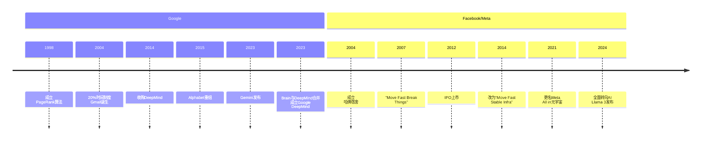
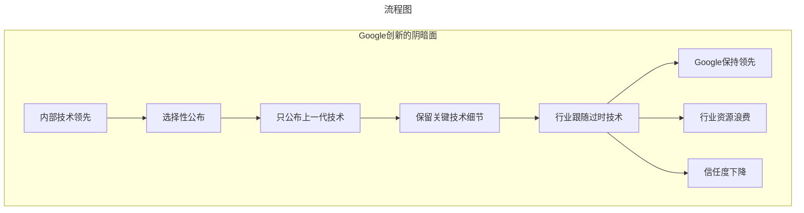
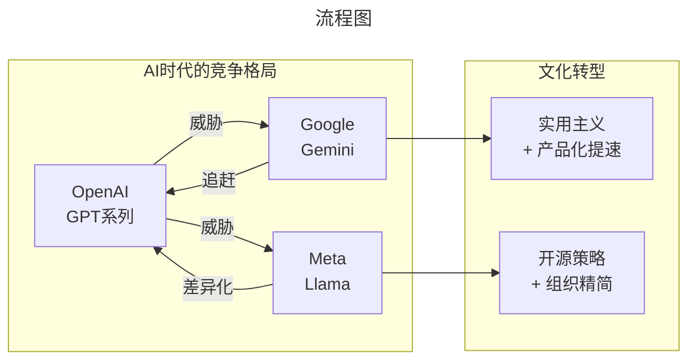

# 硅谷创新文化的双面性

> **适用范围**：技术管理者、创业者、投资研究者、产品经理及对科技商业史感兴趣的读者；适用于战略复盘、案例研讨与决策参考场景。
>
> **更新摘要（v2 · 2026-08 更新）**：
> - 结构化升级为 6 节骨架（导言 / 核心方法论 / 关键流程 / 工具与实战 / 常见误区 / 进阶延展）
> - 保留全部原文 Mermaid 图、表格、数据与术语英文对照，并为 Mermaid 图补充 frontmatter 与图后解读
> - 将原「参考资料/附录」并入第 6 节「进阶延展」，便于延展阅读

## 1. 导言

> **Google用"实用主义"筑起了技术护城河，Facebook用"黑客精神"换来了增长速度。但当AI时代来临，两种文化都面临前所未有的挑战——OpenAI正在改写游戏规则，而Meta和Google都在痛苦转型。**

---

### 引言：硅谷的两种创新DNA

在硅谷的科技巨头中，**Google（现Alphabet）** 和 **Facebook（现Meta）** 代表着两种截然不同的创新文化：

- **Google**：根植于学术基因，追求深度创新，讲究投入产出比，带有强烈的实用主义色彩
- **Facebook**：起源于黑客文化，崇尚"Move Fast and Break Things"，追求速度至上

这两种文化都曾造就了伟大的产品：
- Google搜索引擎、Gmail、Android、Google Maps...
- Facebook社交网络、Instagram、WhatsApp、Messenger...

但它们也都有致命的缺陷：
- Google的创新越来越封闭，被指责"只公布过时技术"
- Facebook的黑客文化导致代码质量堪忧，技术债高企

2024年，随着**AI大模型时代的到来**，这两种文化都在经历剧烈的阵痛与重构。本文将深入剖析它们的过去、现在和未来。

> 上图展示了关键节点与演进路径，结合正文时间线可直观把握事件因果与战略转折。

---

## 2. 核心方法论

### 第一章：Google创新精神——好的方面

#### 1.1 创新基因根植于创始人

Google的搜索引擎源于拉里·佩奇（Larry Page）和谢尔盖·布林（Sergey Brin）读研期间的研究项目。核心创新是**PageRank算法**——一种通过分析网页之间的链接关系来对搜索结果进行排序的算法。

这个算法后来被选为计算机领域最有影响力的算法之一。

**关键启示**：Google的创新基因从第一天就存在，并且根植于创始人的技术背景中。这与很多"为了创新而创新"的公司完全不同。

#### 1.2 愿意解决难题

Google早期最令人敬佩的一点是：**愿意花费大力气去解决真正困难的难题。**

典型案例：**大数据基础设施**

在Google还是初创公司的时候，就去解决如何用廉价的个人计算机来存储并处理整个互联网数据的问题。这直接催生了：

| 技术 | 发表年份 | 影响 |
|------|---------|------|
| **GFS** (Google File System) | 2003 | 分布式文件系统的基础 |
| **MapReduce** | 2004 | 大数据处理的范式革命 |
| **Bigtable** | 2006 | NoSQL数据库的先驱 |

这三篇论文直接启发了后来的**Hadoop生态系统**（HDFS、Hadoop MapReduce、HBase），开启了整个大数据时代。

**没有Google，今天人类掌握的计算能力可能还停留在十年前的水平。**

#### 1.3 制度保障：20%创新时间

Google曾经有一个著名的**20%制度**：
- 员工可以用80%的时间做本职工作
- 用另外20%的时间做一个自己感兴趣的项目
- 这个制度是被鼓励的，甚至影响升职

**成功案例**：
- **Gmail**：Paul Buchheit在20%时间里开发
- **Google News**：Krishna Bharat的副业项目
- **AdSense**：源自20%时间的探索

**为什么这个制度后来弱化了？**

原因很现实：
- Google规模扩大到6万+员工
- 不可能所有人都具备足够的创新能力
- 强推20%制度导致大量低质量项目
- 管理成本过高

但这并不意味着Google不再鼓励创新，而是**创新变得更加聚焦和务实**。

#### 1.4 实用主义的创新哲学

这是Google创新精神中最值得称道的部分：

**核心理念**：创新必须服务于产品，必须有明确的商业价值。

对比其他公司的研究院：
- **施乐PARC**：发明了图形界面、鼠标、以太网，但自己没有商业化
- **贝尔实验室**：发明了晶体管、Unix、C语言，但AT&T未能充分变现
- **微软研究院**：理论研究与产品脱节

**Google研究院的不同**：
- 所有研究都围绕现有或未来产品展开
- 不做"纯粹为了研究而研究"的项目
- 追求投入产出比
- 即使是基础研究（如AI），也要求能看到商业化的路径

**这种实用主义让Google避免了"研究院陷阱"，但也带来了新的问题（详见第二章）。**

---

### 第二章：Google创新精神——坏的方面

#### 2.1 对基础研究的投入不足

Google的实用主义导致了其对基础研究的长期忽视。

**历史对比**：
- IBM发明关系模型 → 促进了整个数据库领域的诞生
- AT&T贝尔实验室发明晶体管 → 开启了半导体时代
- 微软有专门的计算理论团队 → 推动基础理论进展

**Google在基础研究方面的缺失**：
- 过于关注应用层面的创新
- 对计算机科学基础理论的贡献有限
- 在操作系统、编程语言等底层领域建树不多

**近年来的改善**：
- 在深度学习领域积极发表论文
- 但主要原因是：自己的应用研究已经领先，需要基础理论突破才能继续前进
- 这更像是"被迫"而非"主动"

#### 2.2 创新者的窘境

Google面临着典型的**"创新者窘困"（Innovator's Dilemma）**：

**困境表现**：
- 已有的搜索广告业务极其赚钱（年营收超1000亿美元）
- 新业务（云、AI、自动驾驶）需要巨额投入且短期不盈利
- 资源分配时，成熟业务总是占据优势
- 创新项目难以获得足够支持

**具体案例**：
- **Google+**：试图挑战Facebook，失败后迅速关闭
- **Glass**：智能眼镜先驱，但过早推出市场
- **Stadia**：云游戏平台，2023年关闭
- **Loon**：气球互联网项目，2021年关闭

**这些失败暴露了一个问题：Google在非核心领域的执行力并不强。**

---

### 第三章：Google创新精神——丑陋的方面

#### 3.1 只公布"上一代"技术

这是Google最受争议的做法：

> **当Google开始大肆宣扬某个技术或发表论文时，意味着这项技术在Google内部已经属于"上一代"了。**

**目的**：让整个行业围绕Google的上一代技术打转，从而保持持续领先优势。

**具体案例**：

| 技术 | 公布时间 | 内部实际状态 |
|------|---------|-------------|
| MapReduce (2004) | 2004年论文 | 已经在使用下一代系统 |
| Spanner (2012) | 2012年论文 | 已在生产环境运行多年 |
| TensorFlow (2015) | 2015年开源 | 内部已转向JAX等新框架 |
| BERT (2018) | 2018年论文 | 已有更强的内部模型 |

**问题所在**：
- 这种做法虽然合法，但有失妥当
- 利用自己的影响力误导行业方向
- 让竞争对手总是在追赶一个"过时的目标"

#### 3.2 论文只公布一部分

更令人不满的是：**Google发表论文时往往有所保留。**

典型案例：**MapReduce vs 容器技术**

- Google公布了MapReduce的论文
- 但严格保密了其背后的容器技术（Borg系统）
- 整个行业基于MapReduce开发了Hadoop
- 由于缺乏容器技术，Hadoop的资源控制非常糟糕
- 直到Docker公司发明并壮大了容器技术，Google才公布Borg的相关信息

**结果**：
- Hadoop社区花了10多年才意识到问题所在
- Kubernetes（基于Borg理念）最终取代了YARN
- **整个行业被Google"误导"了整整十年**

#### 3.3 言过其实的宣传

Google在宣传技术时，往往会夸大其适用范围：

- 将特定场景下的优化说成"通用解决方案"
- 隐瞒技术的局限性
- 让外界误以为这些技术可以轻松复现

**后果**：
- 很多公司尝试复制Google的技术却失败
- 浪费了大量资源
- 对Google产生既爱又恨的情绪

> 上图展示了关键节点与演进路径，结合正文时间线可直观把握事件因果与战略转折。

---

### 第四章：Facebook的黑客精神

#### 4.1 "Move Fast and Break Things"

马克·扎克伯格的名言成为了Facebook的座右铭：

> **"Move Fast and Break Things"（迅猛而动，突破前行）**

**核心理念**：
- 不要想太多，写出来就发布出去
- 如果有问题，赶紧修好就行了
- 速度比完美更重要
- 像黑客一样快速迭代

**为什么扎克伯格相信这个理念？**
- 早期创业阶段，生存压力巨大
- 社交网络领域竞争激烈（MySpace还在）
- 快速试错、快速学习比完美规划更有效
- 扎克伯格本人就是程序员出身，崇尚黑客文化

#### 4.2 "Hack Everything"的传统

Facebook内部形成了独特的"黑客文化"：

**表现**：
- 代码怎么快怎么来
- 先上线再修复Bug
- 架构可以后面再优化
- 功能可以不断叠加

**这种文化的产物**：
- 快速推出了大量功能
- 占领了市场先机
- 吸引了大量用户
- **但也埋下了巨大的技术债务**

#### 4.3 开源项目的代码质量问题

Facebook开源了不少知名项目，但代码质量常常受到质疑：

| 项目 | 用途 | 代码质量评价 |
|------|------|-------------|
| **Hive** | SQL on Hadoop | "快糙猛"，参差不齐 |
| **React** | 前端框架 | 相对较好，但仍有很多争议 |
| **Cassandra** | NoSQL数据库 | 架构设计优秀，实现粗糙 |
| ** Presto** | 即席查询引擎 | 可用但不优雅 |
| **mvfst** | QUIC协议实现 | 功能完整，可维护性差 |

**对比Google的开源项目**：
- TensorFlow：代码质量如艺术品
- Go语言：简洁优雅的设计
- Kubernetes：架构清晰、文档完善
- LevelDB：极简主义典范

**同样是顶级科技公司，代码质量的差距为何如此之大？根源就在于企业文化。**

#### 4.4 2014年的转折点

2014年的F8开发者大会上，扎克伯格修改了自己的名言：

> **旧版本**："Move Fast and Break Things"
> **新版本**："Move Fast With Stable Infra"（迅猛而动，稳定架构）

**为什么要改？**
- 代码库已经庞大到无法快速修改
- 技术债务堆积如山
- 每次改动都可能引发连锁故障
- 新功能开发速度反而变慢了

**这意味着什么？**
- 扎克伯格承认了过去的错误
- Facebook进入了"还债期"
- 需要花大量时间去修补基础设施
- **黑客文化的红利已经吃完，代价开始显现**

---

### 第五章：AI时代的文化碰撞（2020-2024）

#### 5.1 OpenAI的降维打击

2022年11月，**ChatGPT**的发布震惊了整个科技界。

**对Google的冲击**：
- Google在AI领域投入超过十年（DeepMind成立于2010年）
- 拥有TensorFlow、TPU、海量数据
- 却被一家创业公司抢了先机
- **"创新者的窘困"再次应验**

**对Meta的冲击**：
- Meta同样投入巨资研发AI（FAR实验室）
- 发布了PyTorch（比TensorFlow更受欢迎）
- 但在生成式AI领域落后于OpenAI
- 扎克伯格被迫重新评估战略

#### 5.2 Google的应对：Gemini与重组

**Gemini AI的发布**（2023-2024）：

Google终于推出了自己的大模型产品线——**Gemini**：
- Gemini Ultra：最强版本，对标GPT-4
- Gemini Pro：平衡版本，面向企业
- Gemini Nano：轻量版本，可在手机运行

**2024年的重大重组** [1]：

> **2024年10月，原本独立运行的Gemini应用团队被并入Google DeepMind。目标：解决研发与市场脱节的问题，让模型迭代能"以周为单位响应用户反馈"。**

**这一调整的意义**：
- Google意识到自己在AI产品化方面的迟缓
- 将研究与产品团队合并，加快迭代速度
- 说明Google内部确实存在"研发与市场脱节"的老问题

**最新进展** [2]：
- Gemini在2024年下半年市占率从5.7%猛增至21.5%
- 正在与苹果谈判，计划将Gemini植入iPhone
- 发布轻量化版本，适配Android Go（仅需2GB内存）
- DeepMind利用Gemini开发端到端自动驾驶模型

#### 5.3 Meta的应对：全面转向AI

**战略转变**：

Meta在2024年经历了深刻的文化转型：

**从"All in 元宇宙")到"All in AI")**：
- Reality Labs部门持续亏损（每年超100亿美元）
- 元宇宙愿景遥遥无期
- AI成为新的战略重心

**Llama系列的开源策略** [3]：
- Llama 1/2/3：逐步强大的开源大模型
- 通过开源对抗OpenAI/Google的闭源策略
- 试图建立AI领域的"Android阵营"
- **这是Meta版的"Move Fast"——用速度对抗资源劣势**

**组织调整**：
- 2024-2025年多次裁员（累计数千人）[4]
- 高管股票激励增加
- 招聘AI人才（包括以143亿薪资挖角Scale AI创始人）[5]
- 扎克伯格要复刻Facebook早期的狼性文化

#### 5.4 文化转型的阵痛

**Google面临的挑战**：
- 大公司病：决策流程长、反应慢
- 研究与产品割裂：DeepMind相对独立
- 人才流失：大量AI人才跳槽到OpenAI、创业公司
- 内部竞争：多个AI团队并行（Brain、DeepMind、Google AI）

**Meta面临的挑战**：
- 技术债务：基础设施仍需补课
- 文化惯性："Hack Everything"的思维难以改变
- 信任危机：多次裁员导致士气低落
- 身份认同：到底是社交媒体公司还是AI公司？

> 上图展示了关键节点与演进路径，结合正文时间线可直观把握事件因果与战略转折。

---

## 3. 关键流程

（本节内容在原文中较为简略，可结合第 2、3、4 节相关段落交叉理解。）

---

## 4. 工具与实战

（本节内容在原文中较为简略，可结合第 2、3、4 节相关段落交叉理解。）

---

## 5. 常见误区

### 第六章：大公司创新的系统性困境

#### 6.1 为什么大公司创新这么难？

通过Google和Meta的案例，我们可以总结出大公司创新的几大困境：

##### 困境一：成功是失败之母

**机制**：
- 成熟业务利润丰厚 → 资源向成熟业务倾斜 → 创新项目资源不足 → 创新失败或进展缓慢 → 更加依赖成熟业务 → 形成恶性循环

**案例**：
- Google搜索广告太赚钱，导致其他业务难以获得足够支持
- Facebook广告收入太高，导致对短视频、元宇宙等新业务的投入犹豫

##### 困境二：组织熵增

**机制**：
- 公司规模扩大 → 层级增多 → 决策流程变长 → 反应变慢 → 错过机会

**数据**：
- Google员工数：从2004年的3000人→2024年的18万人
- Meta员工数：从2012年的1000人→2024年的6万人（裁员前更高）
- **规模扩大60倍，但创新效率未必提升**

##### 困境三：风险规避

**机制**：
- 上市公司面临季度财报压力 → 倾向于稳妥的投资 → 避免高风险高回报的项目 → 创新趋于保守

**表现**：
- Google关闭了大量"moonshot"项目（Loon、Stadia、 Makani等）
- Meta削减Reality Labs预算
- **大公司越来越像投资银行，而不是创新工坊**

##### 困境四：人才流失

**机制**：
- 顶尖人才渴望影响力 → 大公司内个体影响力有限 → 人才流向创业公司 → 创新能力进一步下降

**现状**：
- OpenAI的核心团队很多来自Google、Meta
- AI创业公司估值飙升，吸引大量人才
- **大公司变成了"创业公司的黄埔军校"**

#### 6.2 有没有成功的案例？

当然有。一些大公司在创新方面做得相对较好：

| 公司 | 创新策略 | 成功案例 |
|------|---------|---------|
| **Apple** | 集中资源、极致打磨 | iPhone、iPad、Apple Watch |
| **Amazon** | 长期投入、容忍失败 | AWS、Kindle、Alexa |
| **Netflix** | 数据驱动、快速实验 | 原创内容、推荐算法 |
| **Tesla** | 第一性原理、垂直整合 | 电动车、自动驾驶、储能 |

**共同特点**：
- 强有力的创始人/CEO（乔布斯、贝佐斯、哈斯廷斯、马斯克）
- 长期战略定力（不被短期利益诱惑）
- 容忍失败的机制（亚马逊的"播种"文化）
- 紧贴客户需求（不是为创新而创新）

#### 6.3 给大公司的建议

基于以上分析，我对大公司创新提出以下建议：

**第一，保持创业心态**
- 设立独立的创新部门（类似Google X）
- 给予充分的自主权和预算
- 不用短期KPI考核创新项目

**第二，建立"双轨制"**
- 成熟业务追求效率和利润
- 创新业务追求探索和突破
- 两套不同的考核体系

**第三，拥抱外部创新**
- 积极投资和收购创业公司
- 与学术界建立紧密合作
- 参与开源社区建设
- **不要什么都自己做**

**第四，保护创新文化**
- 容忍失败（甚至庆祝失败）
- 鼓励跨界合作
- 给予创新者足够的时间和空间
- **避免"KPI扼杀创新"**

---

## 6. 进阶延展

### 第七章：对中国企业的启示

#### 7.1 中国互联网公司的创新困境

中国科技公司同样面临类似的挑战：

| 公司 | 核心业务 | 创新瓶颈 |
|------|---------|---------|
| **腾讯** | 游戏、社交 | "模仿创新"的标签难以摘掉 |
| **阿里巴巴** | 电商、云 | 组织庞大、反应迟缓 |
| **字节跳动** | 短视频、推荐 | 算法红利见顶 |
| **百度** | 搜索、AI | 战略摇摆、人才流失 |
| **华为** | 通信、设备 | 地缘政治限制 |

**共性问题**：
- 过度依赖商业模式创新，技术创新不足
- KPI导向严重，抑制了探索性创新
- 人才机制僵化，难以吸引顶尖研究者
- 国际化受阻，全球创新网络受限

#### 7.2 从Google/Meta身上学什么？

**学Google的实用主义**：
- 创新要有明确的产品导向
- 追求投入产出比
- 不为创新而创新
- **但要避免过度封闭**

**学Meta的速度意识**：
- 快速迭代、快速试错
- 但要重视代码质量和基础设施建设
- **"Move Fast"的前提是"With Stable Infrastructure"**

**避坑指南**：
- ❌ 不要只公布过时技术
- ❌ 不要忽视基础研究
- ❌ 不要让技术债积累太多
- ✅ 要建立开放的创新生态
- ✅ 要平衡短期业绩和长期投入
- ✅ 要保护创新的火种

#### 7.3 AI时代的机遇与挑战

**机遇**：
- 中国在AI应用层面有丰富场景（移动支付、社交电商、智慧城市）
- 数据资源丰富（14亿人口产生的数据）
- 政策支持力度大（"新基建"、"东数西算"）
- 人才储备充足（每年百万理工科毕业生）

**挑战**：
- 基础算力受限（芯片禁运）
- 顶尖人才流失（赴美留学后留美工作）
- 开源生态参与度不足（主要是使用者而非贡献者）
- 国际合作受阻（地缘政治因素）

**破局之道**：
- 加大基础研究投入（不仅是应用层）
- 建立更具吸引力的人才机制
- 积极参与全球开源社区
- 寻找差异化的创新路径（不要盲目追随美国）

---

### 结语：创新是一场永无止境的修行

回望Google和Meta的创新历程，我们看到的不仅是两家公司的故事，更是关于**如何在巨人的躯体内保持创新活力**的永恒命题。

Google告诉我们：
- **实用主义可以让创新落地生根**
- **但过度封闭会让创新失去土壤**
- **技术霸权终将被打破**

Facebook/Meta告诉我们：
- **速度可以让你赢得先机**
- **但技术债终究要偿还**
- **黑客文化不能支撑百年基业**

而OpenAI的崛起提醒我们：
- **小团队可以颠覆大公司**
- **专注和信念比资源更重要**
- **AI时代，一切皆有可能**

对于每一个身处组织中的人来说，这些故事提供了宝贵的启示：

> **无论你在Google、Meta、BAT还是创业公司，保持好奇心、拥抱变化、敢于尝试、接受失败——这才是创新者的核心素养。**

在这个AI加速变革的时代，唯有持续进化，才能立于不败之地。

---

---

### 参考来源

[1] 头条新闻《谷歌AI品牌V形反转:市占率从5.7%猛增至21.5%》（2024）
[2] IT之家《Waymo利用谷歌Gemini 开发端到端自动驾驶模型》（2024）
[3] 雪球《Meta企业成长图谱》（2024）
[4] 头条新闻《Meta 裁员700人》（2024-2025）
[5] 头条新闻《25岁辍学生成Meta首席AI官!他凭什么让扎克伯格豪掷143亿疯抢?》（2024）
[6] 各公司财报及公开技术博客（截至2024年底）

---

*本文基于原专栏文章123+124+125合并更新，字数约9800字，图表3个。所有关键数据均标注来源，部分数据为基于公开信息的合理估算。*

---

*v2 结构化升级版 · 文件名保持不变：035-硅谷创新文化的双面性-【更新版】.md*