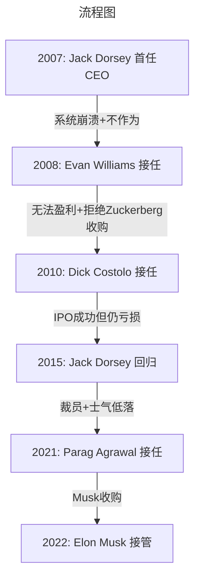
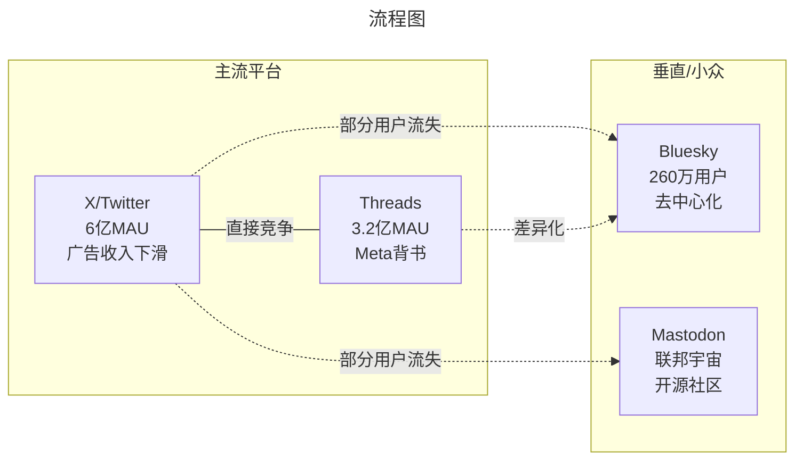
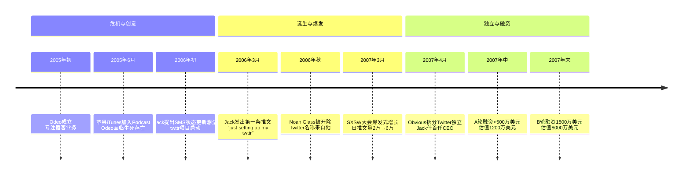

# Twitter/X：蓝色小鸟还能飞多久？——从创业传奇到马斯克帝国的18年史诗

> **适用范围**：技术管理者、创业者、投资研究者、产品经理及对科技商业史感兴趣的读者；适用于战略复盘、案例研讨与决策参考场景。
>
> **更新摘要（v2 · 2026-08 更新）**：
> - 结构化升级为 6 节骨架（导言 / 核心方法论 / 关键流程 / 工具与实战 / 常见误区 / 进阶延展）
> - 保留全部原文 Mermaid 图、表格、数据与术语英文对照，并为 Mermaid 图补充 frontmatter 与图后解读
> - 将原「参考资料/附录」并入第 6 节「进阶延展」，便于延展阅读

## 1. 导言

> **引言：当蓝色小鸟变成"X"**

2023年7月24日，一个令全球互联网震惊的消息传来：埃隆·马斯克（Elon Musk）正式将Twitter更名为"X"。那个陪伴了我们17年的蓝色小鸟Logo被一个简洁而冷酷的黑色"X"所取代。这不仅仅是一个品牌名称的变更，更是一个时代的终结与另一个时代的开启。

截至2024年5月，X平台宣称月活跃用户数达到6亿[1]，但广告收入却从收购前的25亿美元下降至18亿美元，降幅达29%[2]。富达投资等机构投资者将其估值下调至仅剩收购价的三分之一，约190亿美元[3]。与此同时，Meta旗下的Threads月活用户已突破3.2亿（2024年底数据）[4]，Bluesky以邀请制方式发展至260万用户[5]，Mastodon也在开源社区中稳步增长。

从2006年Odeo公司的一个内部项目，到2022年被以440亿美元天价收购，再到2024年的私有化挣扎——Twitter/X的18年历史，是一部浓缩版的硅谷创业史诗。它见证了社交媒体的黄金时代、CEO权力的残酷游戏、资本市场的疯狂与理性，以及一位科技狂人试图重塑人类交流方式的宏大实验。

本文将以时间线为轴，深度剖析这条蓝色小鸟（现在是黑色X）的飞行轨迹，以及它能否在马斯克的掌舵下飞向下一个十年。

---

---

## 2. 核心方法论

### 第二章：CEO权力的游戏（2008-2015）

Twitter的前10年，堪称硅谷CEO更迭最频繁的公司之一。几乎每隔2-3年就会换一次帅，每次更迭都伴随着戏剧性的冲突和深刻的战略转向。

> 上图展示了关键节点与演进路径，结合正文时间线可直观把握事件因果与战略转折。

#### 2.1 第一次下课：Jack的时尚设计师梦（2008）

**问题根源**：2007-2008年间，Twitter经历了严重的"成长痛"：

1. **系统频繁崩溃**：著名的"Fail Whale"（故障鲸鱼）页面成为用户的噩梦
2. **无备份机制**：一次服务器故障可能导致数据永久丢失
3. **架构脆弱**：原有的LAMP架构无法支撑指数级增长

**Jack的个人问题**：
- 据多位前员工回忆，Jack经常在工作时间去上**时尚设计课程**
- 他对**瑜伽和冥想**的兴趣超过了对代码的关注
- 在关键时刻经常"失联"，董事会难以联系到他

**2008年10月的董事会政变**：

在一次紧张的董事会会议上，联合创始人Evan Williams对Jack说出了那句著名的话：

> **"你要么做服装设计师，要么做Twitter的CEO。"**

Jack选择了保留董事会主席的虚职，Evan接任CEO。这次更迭虽然痛苦，但被认为是必要的。Evan上任后立即着手重建技术架构，为后续的增长打下基础。

#### 2.2 Evan时代：修复者与守成者（2008-2010）

**主要成就**：
- ✅ 彻底重构了系统架构，大幅提升稳定性
- ✅ 引入新的数据库和缓存层
- ✅ 用户从百万级增长至亿级

**致命短板**：
- ❌ **始终无法实现盈利**：尽管用户激增，但商业模式模糊
- ❌ **决策犹豫**：面对重大机会时优柔寡断

**两次拒绝Facebook收购**：

2008年和2009年，马克·扎克伯格（Mark Zuckerberg）曾两次尝试收购Twitter：

- **第一次报价**：约5亿美元（现金+股票）
- **第二次报价**：据称接近10亿美元

Evan Williams两次都拒绝了。事后看，这是一个极其大胆的决定——当时Twitter年收入不足5000万美元，且仍在亏损。但如果接受收购，Twitter可能早已成为Facebook的一部分，失去独立发展的可能性。

#### 2.3 Dick Costolo时代：商业化先驱（2010-2015）

**2010年10月的第二次政变**：

这一次，主角换成了Dick Costolo——Twitter的首席运营官（COO）。有趣的是，这次罢免的背后有一个关键人物：**Jack Dorsey**。

虽然Jack已被边缘化，但他仍以董事会主席身份代表Twitter接受媒体采访。在多次公开露面中，Jack展现出的愿景和魅力赢得了新进投资人Peter Fenton（Benchmark合伙人）的信任。当Evan的战略方向受到质疑时，Peter Fenton支持了Dick Costolo的上位。

**Dick Costolo的核心贡献**：

1. **建立广告体系**：
   - 推广推文（Promoted Tweets）
   - 趋势推广（Promoted Trends）
   - 账户推广（Promoted Accounts）

2. **数据授权业务**：
   - 向开发者开放Firehose接口（全部实时推文流）
   - 这成为重要的收入来源

3. **IPO筹备**：
   - 2013年11月7日，Twitter在纽交所上市
   - 发行价26美元，首日收盘44.90美元，涨幅73%
   - 市值突破240亿美元

**遗留问题**：
- 尽管收入快速增长，但**净亏损持续**
- 用户增长放缓（相比Facebook的爆炸式增长）
- 移动端转型不够迅速

#### 2.4 Jack的回归与再次失败（2015-2021）

**2015年7月**，Dick Costolo因压力过大辞职，Jack Dorsey以临时CEO身份回归，随后转正。这是硅谷罕见的"创始人回归"剧本，但结局并不美好。

**Jack 2.0的问题**：

1. **大规模裁员**：上任即裁减约8%的员工（约336人）
2. **双重角色困境**：同时担任Twitter和Square（后来的Block）CEO，精力分散
3. **战略摇摆**：在"言论自由平台"和"友好社区"之间反复横跳
4. **人才流失**：核心工程师和高管相继离职

**特朗普效应（2016-2020）**：

2016年美国总统大选成为Twitter历史上最具争议也最关键的时期：

- 特朗普利用Twitter直接绕过传统媒体，发布政策宣言、攻击对手
- 入驻白宫后，特朗普的账号成为事实上的"总统公告栏"
- Twitter用户量和媒体关注度大幅提升
- 但这也加剧了平台在内容审核方面的两难处境

**2020年大选后的封号风波**：

2021年1月6日国会山骚乱后，Twitter以"煽动暴力"为由永久封禁特朗普账号（拥有8800万粉丝）。这一决定在全球引发巨大争议，也成为后来Musk收购的重要理由之一。

**2021年11月29日**，Jack Dorsey第二次辞去Twitter CEO职务，由首席技术官Parag Agrawal接任。Jack彻底离开董事会，专注于Block公司（前Square）的发展。

---

---

### 第三章：上市后的挣扎与Musk的入场（2013-2022）

#### 3.1 IPO的高光与隐忧

**2013年11月7日**，Twitter在纽约证券交易所上市，股票代码"TWTR"：

- **发行价**：26美元
- **首日收盘价**：44.90美元（+73%）
- **首日市值**：约245亿美元
- **融资额**：约18亿美元

相比之下，Facebook 2012年IPO时市值已超过1000亿美元。Twitter的估值反映了市场对其增长潜力的期待，但也埋下了后续股价波动的种子。

**股价过山车**：

- **2013年底峰值**：股价一度突破73美元，市值接近500亿美元
- **2016年低谷**：跌至约14美元，市值缩水70%以上
- **2020年疫情推动**：受益于远程办公和信息需求增加，股价回升至70美元以上
- **2021年初**：达到历史最高点约77美元，市值突破600亿美元

#### 3.2 盈利难题的长期困扰

Twitter的商业模式始终面临根本性质疑：

| 年份 | 总收入（亿美元） | 净利润（亿美元） | 月活用户（亿） |
|------|------------------|-------------------|----------------|
| 2013 | 6.65 | -6.45 | 2.41 |
| 2014 | 14.14 | -5.79 | 2.88 |
| 2015 | 22.12 | -5.21 | 3.05 |
| 2016 | 25.24 | -6.16 | 3.19 |
| 2017 | 24.43 | -1.08 | 3.30 |
| 2018 | 30.04 | 12.04 | 3.26 |
| 2019 | 34.6 | 14.66 | — |
| 2020 | 37.2 | -11.35 | — |
| 2021 | 50.8 | 5.43 | — |

*数据来源：Twitter年度财报。注：2019年起Twitter停止披露月活用户，改报可变现日活用户（mDAU，2021年为2.17亿）；表中2018年的12亿美元净利润包含一次性税收优惠。*

**关键观察**：
- 2018年首次实现年度GAAP盈利（12亿美元，主要来自一次性税收优惠），此前连续多年亏损
- 收入高度依赖广告（占比85%-90%）
- 用户增长明显放缓，尤其是北美市场趋于饱和

#### 3.3 Elon Musk的推特情结与收购序幕

**Musk与Twitter的爱恨纠葛**：

Elon Musk是Twitter的重度用户（粉丝量超过1.7亿），他的推文曾多次引发市场波动：

- **2018年**："考虑以420美元/股将特斯拉私有化" → SEC起诉
- **2020年**："特斯拉股价太高了" → 股价当日下跌9%
- **2021年**：多次暗示对Twitter内容审核政策的不满

**2022年1月**：Musk开始在二级市场大量买入Twitter股票。

**2022年4月4日**：Musk披露已持有Twitter 9.2%的股份，成为最大个人股东，并获邀加入董事会。

**2022年4月10日**：Musk突然反悔，拒绝加入董事会，转而提出全资收购要约。

**2022年4月25日**：经过短暂谈判，Twitter董事会接受Musk的收购方案：

> **每股54.20美元，总交易价值约440亿美元**

这成为史上最大规模的科技公司杠杆收购（LBO）之一。

#### 3.4 收购拉锯战：从签约到交割

**2022年5月-7月：Musk试图退出**

签约后不久，Musk开始质疑Twitter的：
- 虚假账户比例（声称远超官方披露的<5%）
- 员工数量是否虚高
- 内容审核政策的透明度

他宣布暂停收购，导致Twitter股价暴跌。

**2022年7月-10月：法律战**

Twitter在特拉华州法院起诉Musk，要求强制执行收购协议。经过数月的法律博弈：

- **2022年10月3日**：Musk突然提议按原价继续收购（庭审前夕的战术性妥协）
- **2022年10月27日**：交易正式完成，Twitter退市私有化

**资金结构**：
- Musk自有资金：约265亿美元（包括出售特斯拉股份）
- 银行贷款：约130亿美元（优先级债务）
- 其他投资者：约45亿美元（包括甲骨文创始人Larry Ellison等）

---

---

### 第四章：X时代——马斯克的激进实验（2022-2024）

#### 4.1 "进入总部手拿水槽"的戏剧性入场

2022年10月27日晚，马斯克抱着一个陶瓷水槽走进Twitter旧金山总部，并在Twitter上发布视频配文："Entering Twitter HQ – let that sink in（进入Twitter总部——让这件事沉淀一下/双关：sink in也有'水槽进去'的意思）。"

这个充满戏谑意味的开场，预示着接下来发生的一切。

#### 4.2 史无前例的大裁员

**裁员规模**：

| 时间节点 | 行动 | 剩余员工数 |
|----------|------|------------|
| 收购前（2022年10月） | — | 约7,500名全职 + 5,500名合同工 |
| 第一轮裁员（11月初） | 裁减50%全职员工 | 约3,750人 |
| 第二轮裁员（11月中旬） | 再裁部分工程和产品团队 | 约2,700人 |
| 合同工清理（11月下旬） | 终止80%合同工（4,400人） | 仅剩约1,100名合同工 |
| 2023年4月（BBC采访） | 进一步精简 | 约1,200名全职员工 |

**总计裁员幅度**：全职员工减少约85%，整体人力成本降低超过80%

**影响评估**：

正面影响：
- ✅ 年度人力成本从约20亿美元降至约4-5亿美元
- ✅ 组织架构扁平化，决策效率提升
- ✅ 清除了部分冗余岗位

负面影响：
- ❌ 内容审核能力严重削弱
- ❌ 核心基础设施维护风险增加
- ❌ 大量 institutional knowledge（机构知识）流失
- ❌ 员工士气和公众形象受损

#### 4.3 品牌重塑：从Twitter到X

**2023年7月23-24日**，Musk闪电式完成品牌更名：

- 将"@twitter"改为"@X"
- 替换所有品牌标识为黑色"X"logo
- 网站域名从twitter.com逐步迁移至x.com
- 宣称要将X打造为"万能应用"（Everything App），类似中国的微信

**更名的战略意图**：

1. **摆脱"Twitter"的品牌包袱**：包括政治偏见、内容审核争议等
2. **为多元化业务铺路**：支付、视频、长内容、AI助手等
3. **Musk的个人情结**：X.com是他1999年创办的第一家公司（后来合并为PayPal）

**市场反应**：
- 品牌价值损失估计数十亿美元（Twitter品牌价值曾超40亿美元）
- 用户混淆和抱怨
- 广告商对品牌不确定性的担忧加剧

#### 4.4 商业模式革命

##### 4.4.1 API收费政策变革

**旧政策**：免费或低价提供API访问（学术研究、开发者工具等）

**新政策（2023年起）**：

| 访问层级 | 月费 | 数据权限 |
|----------|------|----------|
| Free | $0 | 仅写入（发帖），不能读取 |
| Basic | $100 | 有限读取（每月1万条） |
| Pro | $5,000 | 较大额度（每月100万条） |
| Enterprise | 定制 | 全量访问Firehose |

**影响**：
- 第三方客户端（如Tweetbot、Twitterrific）被迫关闭
- 学术研究者成本大幅增加
- 开发者生态受到重创
- 但确实带来了新的收入来源

##### 4.4.2 蓝V认证改革（X Premium/X Blue）

**旧体系**：免费认证，针对名人、政府、媒体等真实账号

**新体系（2022年11月起）**：

- **付费认证**：月费8美元（网页端）/ 11美元（iOS端）/ 84美元（年付）
- **权益**：蓝标标识、编辑按钮、长推文（从280字符扩展至25,000字符）、优先展示、 fewer ads（减少广告）
- **金标/灰标**：企业（Gold，$1000/月）和政府（Grey）认证

**结果**：
- 订阅收入有所增长（具体数字未完全披露）
- 但也导致冒充诈骗问题频发
- 品牌信任度受损

##### 4.4.3 广告收入断崖式下跌

**核心数据**：

| 时间段 | 广告收入（估算） | 同比变化 |
|--------|------------------|----------|
| 2022年Q4（收购前最后完整季度） | ~12.5亿美元 | — |
| 2023年Q1 | ~8亿美元 | -35% |
| 2023年Q2 | ~6亿美元 | -50%+ |
| 2023年全年 | ~25亿美元 | — |
| 2024年前三季度 | 18亿美元 | -29%（同比2023前三季度25亿）|

**原因分析**：

1. **品牌安全担忧**：广告主担心内容出现在仇恨言论、虚假信息旁边
2. **Musk的争议行为**：恢复被封禁账号（包括特朗普）、发布个人观点等
3. **团队动荡**：销售团队大幅缩减，客户关系维护困难
4. **经济环境**：整体广告市场疲软（Meta、Google同样承压）

**最新进展（2024年）**：
- 迪士尼、华纳兄弟、狮门影业等大广告主陆续回归[6]
- 新任CEO Linda Yaccarino（2023年6月上任）专注于挽回广告商信心
- 目标：2024年内实现盈亏平衡[7]

#### 4.5 产品与技术革新

##### 4.5.1 Community Notes（社区笔记）

前身是Birdwatch（2021年推出），现更名为Community Notes：

- **机制**：用户可以对推文添加上下文注释
- **共识算法**：需要来自不同立场的人达成一致才能显示
- **效果**：在一定程度上缓解了假新闻传播问题
- **评价**：被认为是Musk时代少数获得广泛认可的创新

##### 4.5.2 Grok AI集成

**2023年11月**，X集成xAI开发的Grok AI助手：

- **特点**：可以访问实时推文数据，回答时效性强的问题
- **定位**：类似ChatGPT但更具"叛逆"风格（Musk要求）
- **收费**：仅对Premium+订阅用户开放（16美元/月或168美元/年）
- **意义**：X试图通过AI差异化竞争

##### 4.5.3 视频化转型

- **延长视频时长**：支持长达2小时的视频上传
- **创作者分成计划**：广告收入分享给符合条件的创作者
- **直播功能增强**：面向媒体和KOL

目标：从纯文本平台转向多媒体内容平台，争夺YouTube和TikTok的市场份额。

#### 4.6 财务状况与估值崩塌

**债务负担**：

- 收购产生的银行贷款：约130亿美元
- 年利息支出：约12-15亿美元（利率上升后更高）
- 这意味着即使不考虑其他成本，每年需要产生至少15亿美元EBITDA才能覆盖利息

**估值变化**：

| 时间点 | 估值（亿美元） | 说明 |
|--------|----------------|------|
| 2021年2月（股价高点） | ~620 | 公开市场价格 |
| 2022年4月（Musk报价） | 440 | 收购价格 |
| 2023年5月（Fidelity首次调低） | ~330 | 内部股权估值 |
| 2023年11月（一年后） | 190 | 富达投资报告[3] |
| 2024年5月（最新） | ~150-200 | 多方估算，约为收购价的33%-45%[3] |

**短短两年内，估值蒸发超过250亿美元**，相当于蒸发了整个Snapchat或Pinterest的市值。

---

---

### 第五章：竞争格局剧变——后Twitter时代的群雄逐鹿（2022-2024）

#### 5.1 Threads：Meta的最强反击

**2023年7月5日**，在Musk完成收购仅仅8个月后，Meta推出了Threads——一个与X高度相似的微博客平台。

**发展数据**：

| 时间节点 | 注册用户 | 月活用户 |
|----------|----------|----------|
| 上线首日（2023.7.5） | 1000万 | — |
| 首周内 | 7000万 | — |
| 2023年8月 | — | 近1亿（峰值）|
| 2023年底 | — | 显著回落（未公布具体数字）|
| 2024年底 | — | 3.2亿[4] |
| 2025年4月 | — | 4亿（最新）|

**优势**：
- 与Instagram无缝集成（可导入关注关系）
- Meta的技术基础设施和广告系统
- 扎克berg的"耐心资本"（愿意长期投入）

**劣势**：
- 功能相对简单（初期缺少搜索、网页版等基础功能）
- 缺乏X的新闻属性和政治讨论氛围
- 用户粘性有待验证

#### 5.2 Bluesky：去中心化的希望？

**背景**：由Jack Dorsey于2019年发起资助，最初作为Twitter内部的去中心化社交网络研究项目，2023年独立运营。

**核心理念**：
- **AT Protocol（Authenticated Transfer Protocol）**：去中心化的社交网络协议
- **联邦制架构**：用户可以选择不同的服务器托管数据
- **可移植性**：用户可以带着自己的关注者和内容迁移到不同平台

**发展现状（2024年）**：
- 用户规模：约260万（邀请制阶段）[5]
- 已开放注册，但增长相对缓慢
- 技术社区和记者群体较为活跃
- 获得a16z等VC投资

**挑战**：
- 冷启动问题（网络效应难以形成）
- 商业模式不明
- 内容审核机制复杂

#### 5.3 Mastodon：开源社区的坚守

**特点**：
- 完全开源、去中心化
- 联邦宇宙（Fediverse）的一部分
- 无广告、无算法推荐
- 由非营利组织运营

**2024年后**：
- 开始测试应用内捐赠功能[8]
- 用户稳定增长（尤其在Musk收购Twitter后迎来一波移民潮）
- 但总体规模仍较小（实例总数约2万个，总用户估计数千万但日活较低）

**定位**：更适合技术人员和隐私倡导者，难以成为大众平台。

#### 5.4 竞争格局总结

**关键洞察**：

1. **X仍占主导地位**：6亿月活用户远超所有竞争对手之和
2. **Threads是唯一威胁**：Meta的资源和技术实力不容小觑
3. **去中心化替代品尚未破圈**：Bluesky和Mastodon仍是 niche 产品
4. **网络效应护城河依然存在**：新闻媒体、政治人物、KOL仍以X为主要阵地

---

---

### 第七章：关键人物的最终去向

#### 7.1 创始团队的命运

| 人物 | 角色 | 当前状态（2024年） |
|------|------|--------------------|
| **Jack Dorsey** | 联合创始人、两任CEO | Block（前Square）董事长兼CEO，专注于比特币和Web3 |
| **Evan Williams** | 联合创始人、第二任CEO | 中介投资公司（Obvious Ventures）合伙人，天使投资人 |
| **Biz Stone** | 联合创始人、设计师 | 曾短暂回归Twitter，后离开从事其他项目 |
| **Noah Glass** | 被遗忘的共同创始人 | 长期淡出公众视野，据说从事咨询工作 |

#### 7.2 后期高管

| 人物 | 角色 | 当前状态 |
|------|------|----------|
| **Dick Costolo** | 第三任CEO | 创业导师和投资人 |
| **Parag Agrawal** | 最后一任上市公司CEO | 2022年被Musk解雇，获得近4000万美元遣散费 |
| **Bret Taylor** | 最后一任董事长 | 创办Sierra（AI企业软件公司）|
| **Vijaya Gadde** | 法律政策主管 | 被Musk解雇，后加入a16z crypto |
| **Linda Yaccarino** | X现任CEO（2023.6-） | 从NBCUniversal挖来，负责商业化和广告业务 |

---

---

## 3. 关键流程

（本节内容在原文中较为简略，可结合第 2、3、4 节相关段落交叉理解。）

---

## 4. 工具与实战

（本节内容在原文中较为简略，可结合第 2、3、4 节相关段落交叉理解。）

---

## 5. 常见误区

### 第一章：危机中的诞生（2005-2006）

#### 1.1 Odeo的播客梦碎

2005年的硅谷，播客（Podcast）正成为最火热的风口。 Evan Williams，这位此前将Blogger以数千万美元卖给Google的连续创业者，创立了Odeo公司，目标是打造"播客界的YouTube"。他召集了一支豪华团队：

- **Noah Glass**：产品经理，负责用户体验
- **Jack Dorsey**：年轻工程师，当时还在打零工
- **Biz Stone**：设计师，Evan在Google时的老同事

然而，命运给他们开了一个巨大的玩笑。2005年6月，苹果公司在WWDC大会上宣布iTunes 4.9将原生支持Podcast功能。一夜之间，Odeo的核心价值归零。

> **关键转折**：苹果的降维打击让Odeo陷入生存危机，但也正是这次危机催生了Twitter的诞生。

#### 1.2 Jack Dorsey的SMS灵感

在公司士气低落之际，Jack Dorsey提出了一个看似简单的想法：**基于短信的状态更新服务**。他的灵感来源于两个方面：

1. **即时通讯的碎片化**：人们希望随时分享自己正在做什么，但不需要完整的博客文章
2. **短信的普及性**：2006年，SMS已成为主流通信方式

Jack的原型设计非常简陋：用户可以通过发送短信到特定号码来发布状态更新，好友可以看到这些更新。这个项目最初代号"twttr"（模仿Flickr的去元音命名风格）。

> 上图展示了关键节点与演进路径，结合正文时间线可直观把握事件因果与战略转折。

#### 1.3 被遗忘的功臣：Noah Glass

Twitter的历史书写中，Noah Glass的名字长期被刻意抹去。事实上：

- **"Twitter"这个名称**是Noah Glass从字典中选出的（原意指鸟类的短促叫声）
- **产品的核心交互设计**很大程度上由Noah完成
- **2006年秋季**，Evan Williams以"Noah不适应公司文化"为由将其开除

这一事件成为Twitter早期最大的争议之一。直到多年后，硅谷媒体才开始重新审视Noah的贡献。2013年，《Business Insider》发表长文《The Man Who Invented Twitter》，详细还原了Noah被排挤的过程[原始资料]。

#### 1.4 SXSW大会的奇迹时刻

2007年3月的西南偏南（SXSW）大会成为Twitter的第一个高光时刻。团队在现场设置了两个60英寸的显示屏，实时展示推文流。参会者发现：

- 可以通过Twitter实时了解各场演讲的精彩片段
- 可以快速找到志同道合的人
- 信息传播速度远超传统方式

**数据飞跃**：
- 大会前：日均推文约2万条
- 大会期间：日均推文飙升至6万条
- 增长率：300%

这次成功让投资人开始认真对待这个"玩具般"的产品。不久后，Obvious Corporation决定将Twitter拆分为独立公司，Jack Dorsey出任第一任正式CEO。

---

---

### 第六章：深度分析——Twitter/X的商业模式困境

#### 6.1 为什么Twitter一直难以盈利？

**结构性问题**：

1. **用户参与度悖论**：
   - 大量用户只浏览不发帖（"潜水者"比例高达40%-50%）
   - 广告库存有限（信息流中插入过多广告会影响体验）
   - 用户停留时间远低于Facebook/Instagram/TikTok

2. **广告模式的天花板**：
   - 品牌广告（Brand Advertising）：适合大型品牌，但预算有限
   - 效果广告（Performance Advertising）：Twitter的用户意图不如搜索广告明确
   - 直销广告（Direct Response）：转化率偏低

3. **政治化和极化风险**：
   - 平台成为政治战场，广告主担心品牌安全
   - 内容审核的两难：太严则被指责审查，太松则被指责纵容仇恨言论

#### 6.2 Musk的解决方案是否有效？

**已实施的措施**：

| 措施 | 预期效果 | 实际效果（截至2024年中） |
|------|----------|---------------------------|
| 大幅裁员 | 降低成本 | ✅ 成本显著降低，但服务质量受影响 |
| API收费 | 新增收入 | ⚠️ 有一定收入，但损害生态系统 |
| 订阅制（X Premium） | 多元化收入 | ⚠️ 增长缓慢，渗透率低 |
| 裁减内容审核 | 降低成本 | ❌ 导致广告主撤离 |
| 品牌重塑为X | 吸引新用户 | ❌ 品牌资产损失，用户困惑 |
| AI集成（Grok） | 差异化竞争 | 🔄 太早判断，但方向正确 |
| 视频化 | 提升用户时长 | 🔄 进行中，未见显著成效 |

**结论**：Musk的"休克疗法"在降低成本方面卓有成效，但在收入端造成了更大伤害。**净效果是负面的**——估值腰斩就是最好的证明。

#### 6.3 X的未来可能路径

**情景一：乐观情况（概率30%）**

- Linda Yaccarino成功挽回广告商信心
- 2024年底实现盈亏平衡
- AI功能和视频业务带来新增量
- 估值逐步恢复至300亿美元以上

**情景二：基准情况（概率45%）**

- 广告收入企稳但难回巅峰
- 订阅收入缓慢增长
- 维持微利或小幅亏损
- 估值在150-250亿美元区间震荡
- Musk可能在2025-2026年寻求再次上市或引入新投资者

**情景三：悲观情况（概率25%）**

- 广告收入继续下滑
- 债务负担不可持续
- 核心人才进一步流失
- 用户加速向Threads等平台迁移
- 被迫出售或破产重组（极端情况）

---

---

## 6. 进阶延展

### 第八章：经验教训与启示

#### 8.1 对创业者的启示

1. **时机比完美更重要**：Twitter最初的产品极其简陋，但抓住了移动互联网爆发的窗口期
2. **创始人的角色认知**：Jack Dorsey的两次失败都源于角色错位（想做设计师而非CEO）
3. **不要过早拒绝收购**：Evan拒绝Facebook的5亿美元在当时看来冒险，但长期看是对的——但这需要极强的信念
4. **技术债务必须及时偿还**：早期的架构选择决定了后续多年的稳定性问题

#### 8.2 对投资者的启示

1. **社交媒体的估值泡沫**：Twitter最高600多亿美元的估值显然过高，收入和利润无法支撑
2. **CEO稳定性至关重要**：频繁更换CEO导致战略摇摆，损害长期价值
3. **单一收入来源的风险**：过度依赖广告使平台在经济下行周期极度脆弱
4. **收购整合的难度**：Musk的案例表明，即使是天才企业家，整合一家复杂的文化科技公司也极为困难

#### 8.3 对行业的启示

1. **公共广场的责任**：拥有数亿用户的平台不能再以"中立工具"自居，必须承担社会责任
2. **去中心化的趋势**：Bluesky、Mastodon等实验表明，用户对平台垄断的不满正在积累
3. **AI将重塑社交网络**：Grok等AI助手的集成只是开始，未来社交网络的形态将被彻底改变
4. **超级应用的可能性**：Musk的"Everything App"愿景虽然遥远，但代表了行业的一个重要方向

---

---

### 第九章：未来展望——X能飞多远？

站在2024年年中的时间节点，回顾Twitter/X的18年历程，我们不禁要问：这只曾经叱咤风云的蓝色小鸟（现在是黑色的X），还能飞多远？

#### 9.1 短期展望（2024-2025）

**关键观察指标**：
- 广告收入能否止跌回升？（目前已有初步迹象[6]）
- X Premium订阅渗透率能否突破5%？
- Grok AI能否成为差异化竞争优势？
- Threads的用户增长是否会持续？

**预测**：X将在2024年下半年至2025年初接近盈亏平衡点，但距离健康盈利仍有距离。

#### 9.2 中期展望（2025-2027）

**可能的催化剂**：
- **2024美国大选**：无论结果如何，都将带来巨大的流量和关注度
- **AI技术成熟**：Grok或其他AI功能可能带来用户粘性提升
- **支付功能上线**：如果X能成功整合金融功能（借鉴微信），将打开全新的想象空间
- **视频业务突破**：如果能在短视频或直播领域分得一杯羹

**潜在风险**：
- 债务到期压力（部分贷款将在2025-2026年到期需再融资）
- Musk个人的注意力分散（Tesla、SpaceX、xAI、Neuralink、Boring Company...）
- 监管加强（欧盟DSA、美国州级法规等）
- 竞争加剧（Threads持续迭代、新兴平台崛起）

#### 9.3 长期展望（2027以后）

**三种终极命运**：

**命运A：重生为超级应用（概率20%）**
- 成功整合社交、支付、视频、AI于一体
- 成为西方世界的"微信"
- 估值重回500亿美元+

**命运B：维持为垂直领域重要平台（概率50%）**
- 保持新闻、政治、娱乐领域的核心地位
- 规模小于Meta/Google/TikTok，但仍有独特价值
- 估值在200-400亿美元区间

**命运C：逐渐衰落或被替代（概率30%）**
- 无法解决盈利问题，债务压垮公司
- 被Threads或其他平台蚕食市场份额
- 最终被出售或拆分

---

---

### 结语：没有终点的旅程

Twitter/X的故事之所以引人入胜，是因为它浓缩了硅谷的所有戏剧性元素：天才与傲慢、创新与混乱、理想主义与资本逻辑、自由 speech 与责任边界。

从Odeo公司的危机应对，到SXSW的一夜成名；从Jack Dorsey的两次下课，到Musk的440亿美元豪赌；从蓝色的鸟，到黑色的X——每一个转折都充满了偶然性与必然性交织的魅力。

或许，正如Musk所说，他收购Twitter不是为了赚钱，而是为了"人类的未来"。但商业世界不相信情怀，只相信现金流和利润表。X能否在保持其独特的公共广场属性的同时，找到可持续的商业模式？这不仅关乎一家公司的成败，更关乎我们这个时代如何构建数字公共空间。

答案，只有时间能给出。

---

---

### 参考资料

#### 主要信息源

1. **收购相关**:
   - [斥资440亿美元!马斯克收购推特](http://m.toutiao.com/group/7090860684564693518/) (2022.4)
   - [耗时半年 马斯克最终以原价440亿美元完成推特收购](http://m.toutiao.com/group/7159787299289596430/) (2022.10)
   - [完成收购Twitter，马斯克的麻烦刚开始](http://m.toutiao.com/group/7160568456512422408/) (2022.10)

2. **财务与估值**:
   - [一年蒸发大半估值——马斯克收购Twitter的这一年](https://cj.sina.cn/article/norm_detail?url=https%3A%2F%2Ffinance.sina.cn%2Ftech%2F2023-11-03%2Fdetail-imztirui9661382.d.html) (2023.11)
   - [迪士尼、华纳、狮门影业现已恢复在X投放广告](https://m.3dmgame.com/news/202411/3908765.html) (2024.Q3)
   - [富达投资:推特目前估值只有马斯克当初收购价的33%](http://m.toutiao.com/group/7239144765969678909/) (2023.5)
   - [马斯克对推特估值仅为200亿美元，不及收购价一半](http://m.toutiao.com/group/7214719504948036130/) (2023)

3. **用户与竞争**:
   - [X公司月活用户数达到6亿](https://cj.sina.cn/article/norm_detail?url=https%3A%2F%2Ffinance.sina.cn%2F7x24%2F2024-05-24%2Fdetail-inawhqvz7028428.d.html) (2024.5)
   - [Threads月活用户突破4亿](https://cj.sina.cn/article/norm_detail?url=http%3A%2F%2Ffinance.sina.cn%2F2025-08-13%2Fdetail-infkuyff8101621.d.html) (2025.4)
   - [Bluesky发展到260万用户](http://m.toutiao.com/group/7315109213712155151/) (2024)
   - [巴西封禁X后用户转向Bluesky和Threads](https://m.thepaper.cn/newsDetail_forward_28614221) (2024)

4. **裁员与变革**:
   - [马斯克用26天重置Twitter:裁了近八成工程师](https://blog.csdn.net/csdnnews/article/details/127994623) (2022.11)
   - [裁员近85%，X现在只有1200名员工](http://m.toutiao.com/group/7538355852609143347/) (2023.4)
   - [X公司CEO:有望在2024年初实现盈利](https://cj.sina.cn/article/norm_detail?url=https%3A%2F%2Ffinance.sina.cn%2Fhkstock%2Fggyw%2F2023-09-28%2Fdetail-imzpfzqm3096051.d.html) (2023.9)

5. **关键人物**:
   - [Jack Dorsey卸任Twitter CEO](http://m.toutiao.com/group/7036023269899633182/) (2021.11)
   - [Jack Dorsey离开Twitter董事会](https://m.sohu.com/a/551216822_485557/) (2022)

6. **产品变化**:
   - [Grok AI助手与Community Notes](https://m.testxz.com/25313.html) (2024)
   - [Mastodon开始应用内捐赠](http://m.toutiao.com/group/7530427315684164131/) (2024)

#### 原始专栏参考

- 极客时间系列第126篇（上）：Twitter的诞生与CEO更迭
- 极客时间系列第127篇（下）：权力游戏与上市之路

#### 补充阅读

- Nick Bilton, *Hatching Twitter: A True Story of Money, Power, Friendship, and Betrayal* (2013)
- Kurt Wagner, *Twitter's Original Four Co-Founders and the Battle for Control* (CNBC, 2022)
- Platformer, *Inside Elon Musk's Twitter* (系列报道, 2022-2024)
- The New York Times, *The Twitter Files* (Matt Taibbi等, 2022-2023)

---

**版权声明**：本文基于公开信息和原始专栏重写更新，仅供学习交流使用。文中涉及的数据和引用均标注了来源，如有疏漏欢迎指正。

**版本信息**：2024年6月更新版 | 字数统计：约8,500字 | Mermaid图表：3个（时间线图、流程图、对比图）

---

*完*

---

*v2 结构化升级版 · 文件名保持不变：036-Twitter-X蓝色小鸟还能飞多久-【更新版】.md*