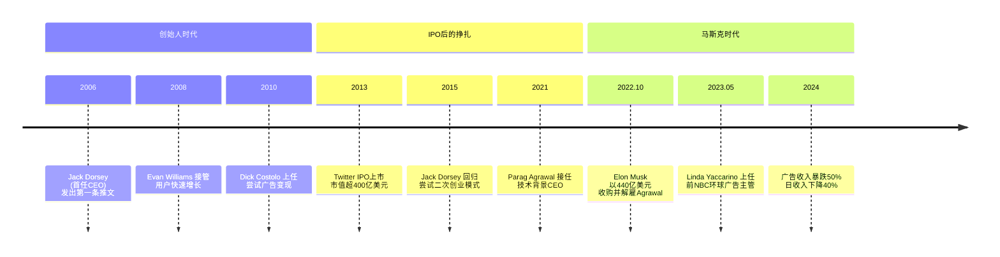
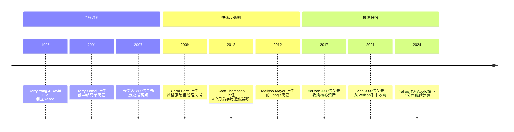
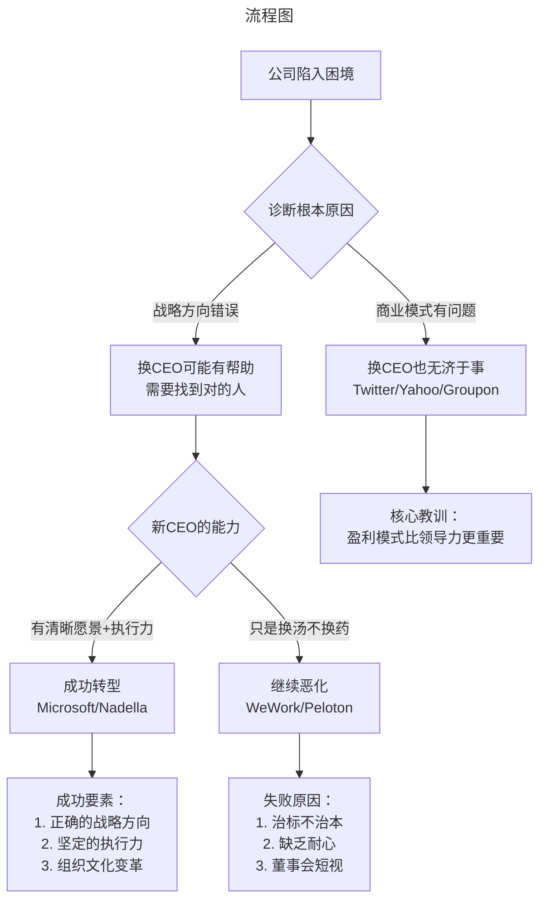

# 040 | 赚钱是根本，换CEO也没救（2024全面重写版）

> **适用范围**：技术管理者、创业者、投资研究者、产品经理及对科技商业史感兴趣的读者；适用于战略复盘、案例研讨与决策参考场景。
>
> **更新摘要（v2 · 2026-08 更新）**：
> - 结构化升级为 6 节骨架（导言 / 核心方法论 / 关键流程 / 工具与实战 / 常见误区 / 进阶延展）
> - 保留全部原文 Mermaid 图、表格、数据与术语英文对照，并为 Mermaid 图补充 frontmatter 与图后解读
> - 将原「参考资料/附录」并入第 6 节「进阶延展」，便于延展阅读

## 1. 导言

### 引言：一个永恒的商业真理

企业以盈利为目的——这句话看似浅显易懂，却在过去二十年的科技行业中被反复验证、反复遗忘，又反复付出惨痛代价。

当我们站在2024年底回望过去十年的科技商业史，会发现一个令人深思的现象：**那些陷入困境的明星公司，几乎都走过同一条路——疯狂更换CEO，却始终无法解决核心问题**。而真正能够起死回生的企业，往往不是因为换了个"更强"的领导者，而是因为找到了正确的商业模式和盈利路径。

本文将深度剖析过去十五年间最具代表性的"换CEO也救不了"的科技公司案例，对比少数成功转型的典范，试图回答一个根本性问题：**在什么情况下，换CEO是救命稻草？又在什么情况下，它只是掩耳盗铃？**

---

---

## 2. 核心方法论

### 第一章：Twitter/X —— 八任CEO的悲剧轮回

#### 1.1 创始人内斗与商业模式缺失

Twitter的故事，是美国科技史上最令人唏嘘的篇章之一。

2006年，Jack Dorsey发出了第一条推文"just setting up my twttr"。这个只有140字符限制（后来改为280字符）的微型博客平台，迅速 capturing 了全球用户的想象力。到2013年IPO时，Twitter已经拥有超过2亿月活用户，市值一度突破400亿美元。

然而，**从第一天起，Twitter就面临一个致命问题：没有人知道如何将庞大的用户群变现**。

Twitter的创始团队堪称硅谷最复杂的权力斗争样本。四位创始人——Jack Dorsey、Evan Williams、Biz Stone和Noah Glass——之间的关系错综复杂：

- **Jack Dorsey**（第一任CEO，2006-2008）：被董事会以"无法有效管理公司"为由罢免
- **Evan Williams**（第二任CEO，2008-2010）： Blogger的创始人，推动Twitter成长但同样未能解决盈利问题
- **Dick Costolo**（第三任CEO，2010-2015）：喜剧演员出身，曾成功出售三家公司，但在Twitter的广告变现尝试屡屡受挫
- **Jack Dorsey**（第四任CEO，2015-2021）：戏剧性回归，试图复制乔布斯的"王者归来"，但效果有限
- **Parag Agrawal**（第五任CEO，2021-2022）：首席技术官升任，仅任职11个月就被马斯克收购后解雇

> 上图展示了关键节点与演进路径，结合正文时间线可直观把握事件因果与战略转折。

#### 1.2 核心困境：为什么Twitter始终无法赚钱？

Twitter的盈利困境，根源在于其产品特性与广告模式的天然矛盾：

**第一，信息流效率过高，反而降低了广告展示机会。**

与Facebook的"无限滚动"不同，Twitter的信息流更加实时、更加碎片化。用户打开Twitter是为了获取最新消息，而不是"消磨时间"。这导致用户的停留时间远低于Facebook，广告曝光次数自然受限。

**第二，140/280字符的限制使得品牌叙事困难。**

Facebook允许长文案、富媒体内容，品牌可以讲述完整故事。Twitter的短文本格式更适合新闻传播和即时互动，但不适合品牌广告的深度沟通。

**第三，政治化和极化内容吓跑了广告主。**

随着Twitter成为政治讨论的主战场，品牌越来越担心自己的广告出现在争议内容旁边。这种"品牌安全"问题在2016年美国大选后急剧恶化。

#### 1.3 马斯克的豪赌与X的至暗时刻

2022年10月，埃隆·马斯克以440亿美元的"天价"收购Twitter，这是科技史上最大的杠杆收购案之一。

马斯克的收购逻辑很清晰：
1. 将Twitter打造为"万能应用"（Everything App），类似中国的微信
2. 通过订阅服务（X Premium）降低对广告的依赖
3. 大幅削减成本，实现盈利

然而，现实给了马斯克沉重一击：

**财务数据触目惊心：**
- 收购后，**广告收入暴跌约50%**，从2022年的约50亿美元降至2023年的25亿美元左右
- **日收入暴跌40%**，500家顶级广告商逃离平台
- 公司背负约130亿美元债务，每年利息支出就超过10亿美元
- 2023年现金流预计为负20-30亿美元

**Linda Yaccarino的困局：**

2023年5月，马斯克任命前NBC环球广告主管Linda Yaccarino为CEO，希望她能挽回广告主的信心。Yaccarino确实推出了一些措施：
- 创作者收入分成计划（截至2024年5月已支付超5000万美元）
- 品牌安全工具升级
- 针对大客户的定制化解决方案

但截至2024年底，**这些努力收效甚微**。X平台的广告收入仍在下滑，估值从收购时的440亿美元缩水至可能不足100亿美元（部分投行估计甚至更低）。

**X的核心矛盾没有解决：**
马斯克追求的"言论自由绝对化"与广告主需要的"品牌安全环境"存在根本性冲突。只要这个矛盾不解决，再多的CEO更迭也只是治标不治本。

---

---

### 第二章：Yahoo —— 从千亿帝国到50亿贱卖

#### 2.1 六任CEO的"接力失败"

如果说Twitter的悲剧是"不知道怎么赚钱"，那么Yahoo的悲剧则是"曾经赚过大钱，但把所有钱都花错了地方"。

Yahoo的全盛时期在2000年互联网泡沫巅峰，市值一度超过**1250亿美元**，是全球最有价值的互联网公司。然而，从2001年到2017年被收购，Yahoo经历了六任CEO的"接力失败"：

**Terry Semel（2001-2007）：好莱坞思维的失败**

Semel是前华纳兄弟联席CEO，他试图用传统媒体的思维运营互联网公司。在他的领导下，Yahoo错过了搜索革命——**2002年有机会以10亿美元收购Google，拒绝了；后来又错过了以50万美元收购Facebook早期股份的机会**。

Semel时代最大的错误决策：
- 以57亿美元收购Broadcast.com（后来关停）
- 错失Google和Facebook的投资机会
- 在显示广告上过度依赖，未能建立技术壁垒

**Carol Bartz（2009-2011）：得罪所有人的"铁娘子"**

Bartz以强硬著称，她的名言是"他们要把我f***ing fired"。她大幅裁员、砍掉不盈利业务，但同时也疏远了员工、合作伙伴和开发者社区。最终在2011年被董事会电话解雇。

**Scott Thompson（2012）：四个月的闹剧**

Thompson因简历中学历造假（声称有计算机科学学士学位，实际没有）被迫上任仅4个月就辞职，成为硅谷历史上最短的CEO任期之一。

**Marissa Mayer（2012-2017）：最后的救赎者？**

Mayer是Google早期员工，被视为Yahoo的最后希望。她采取了一系列激进措施：
- 禁止远程办公，要求员工到办公室工作
- 以11亿美元收购Tumblr（后来减记7.8亿美元）
- 大力发展移动端业务
- 重新设计首页和邮箱产品

然而，**Mayer的努力来得太晚了**。在她任期内，Yahoo的营收从49亿美元降至43亿美元，股价从每股16美元跌至4.6美元（Verizon收购价）。她离开时获得了约1.6亿美元的黄金降落伞，但Yahoo作为独立公司的生命实际上已经终结。

#### 2.2 Yahoo衰落的深层原因

Yahoo的失败不是某个CEO的问题，而是**系统性战略失误的累积结果**：

**第一，身份认同危机：Yahoo到底是什么？**

- 搜索引擎？（输给了Google）
- 门户网站？（被Facebook等社交平台取代）
- 媒体公司？（无法与专业媒体竞争）
- 技术公司？（创新能力不足）

**第二，创始人控制的特殊结构**

Jerry Yang作为联合创始人，在董事会有特殊影响力。他在2008年拒绝了微软446亿美元的收购要约，认为"严重低估了Yahoo的价值"。这个决定被认为是科技史上最糟糕的决策之一——如果当时接受收购，股东获得的收益将是2017年Verizon收购价的10倍以上。

**第三，Alibaba资产的双刃剑**

Yahoo在2005年以10亿美元投资了阿里巴巴集团15%的股份，这笔投资后来价值数百亿美元。但这笔投资也成为了一种"麻醉剂"——Yahoo管理层可以用阿里巴巴的收益来掩盖主营业务的不振，缺乏改革的紧迫感。

2017年Verizon收购时，Yahoo的核心互联网资产售价44.8亿美元；剩余的阿里巴巴股份和现金资产被分拆为名为Altaba的公司，随后逐步清仓。

2021年，私募股权公司Apollo Global Management以50亿美元从Verizon手中收购了Yahoo（当时称为Verizon Media Group）。至此，曾经的千亿帝国彻底沦为一家私募控股公司的资产组合的一部分。

---

---

### 第四章：成功的反例 —— 当换CEO真的有用

在一片"换CEO也没救"的悲观论调中，我们需要看到：**有些时候，换CEO确实是正确的决策，关键在于判断什么时候该换、换成什么样的人**。

#### 4.1 Satya Nadella 与 Microsoft 的重生

**这是过去十年最成功的CEO转型案例，没有之一。**

2014年2月，Satya Nadella接替Steve Ballmer成为Microsoft第三任CEO。当时的Microsoft正处于前所未有的低谷：
- Windows Phone市场份额不足3%
- Surface平板电脑持续亏损
- 在移动互联网时代完全掉队
- 股价停滞多年，被华尔街视为"没落巨头"

Nadella做了什么？

**第一，文化转型："Growth Mindset"（成长型思维）**

Nadella推翻了Ballmer时代的内部竞争文化，倡导协作和学习。他的畅销书《Hit Refresh》详细记录了这一过程。

**第二，战略聚焦：All-in Cloud Computing**

Nadella果断砍掉了手机硬件业务（2017年注销诺基亚收购相关的76亿美元），将资源集中投入到Azure云计算平台。这一决策在当时备受争议，但事后证明极具前瞻性。

**第三，开放生态：拥抱开源和跨平台**

- Visual Studio支持Mac和Linux
- .NET框架开源
- 与之前的死敌（如Red Hat、Salesforce）合作
- 2018年以75亿美元收购GitHub（开源社区的最大平台）

**成果令人瞩目：**
- Azure成为全球第二大云服务商（仅次于AWS），年收入超过600亿美元
- Microsoft市值从Nadella接手时的约3000亿美元飙升至2024年的超过**3万亿美元**（一度超越Apple成为全球市值最高的公司）
- Office 365转型订阅制，收入稳定增长
- AI领域通过OpenAI合作占据先机（投资超过130亿美元）
- Nadella本人2024财年薪酬达到7910万美元，同比增长63%

> 上图展示了关键节点与演进路径，结合正文时间线可直观把握事件因果与战略转折。

#### 4.2 其他相对成功的案例

**Apple（1997-2011）：Steve Jobs的回归**

虽然不在我们主要讨论的时间范围内，但Jobs回归Apple并带领其成为全球市值最高的公司，是"换CEO成功"的经典案例。关键因素：
- Jobs本身就是创始人，对公司有深刻理解
- 有清晰的愿景（整合软硬件生态系统）
- 产品创新能力极强（iPod、iPhone、iPad）

**Netflix（ Hastings时代）：从DVD租赁到流媒体霸主**

Reed Hastings作为联合创始人兼CEO，带领Netflix完成了两次成功的转型：
1. DVD租赁 → 流媒体（2007-2010）
2. 内容发行 → 内容制作（2013至今，原创剧集《纸牌屋》《怪奇物语》等）

Hastings的成功在于**始终保持对技术趋势的敏感度，并愿意自我颠覆**。

**Adobe（2007-至今）：从盒装软件到SaaS订阅**

在Bruce Chizen和后来的Shantanu Narayen领导下，Adobe完成了从销售Creative Suite盒装软件到Creative Cloud订阅制的转型。这一转型在当时风险极大（短期收入会下降），但长期来看极为成功，Adobe市值增长了超过10倍。

---

---

### 第五章：核心洞察 —— 为什么有些公司换CEO也没救？

通过对上述案例的深入分析，我们可以提炼出几个关键结论：

#### 5.1 盈利模式的不可替代性

**如果一个公司找不到可持续的盈利模式，换再多CEO也是徒劳。**

- **Twitter/X**：用户喜欢，但无法高效变现
- **Groupon**：商家端无忠诚度，消费者端无粘性
- **WeWork**：本质上是不赚钱的房地产二房东
- **Yahoo**：什么都有，什么都不精

相比之下：
- **Google**：搜索广告是完美的商业模式（高意图、高转化、自动化）
- **Facebook/Meta**：社交图谱 + 精准定向广告 = 印钞机
- **Amazon**：电商飞轮效应 + AWS云计算 = 双引擎
- **Microsoft**：企业软件订阅 + 云计算 = 现金牛

#### 5.2 创始人vs职业经理人的悖论

这里有一个有趣的悖论：

**创始人往往有愿景但缺乏执行纪律，职业经理人善于执行但缺乏创新勇气。**

| 类型 | 优势 | 劣势 | 代表人物 |
|------|------|------|----------|
| 创始人型CEO | 愿景清晰、激情充沛、敢于冒险 | 往往固执、治理混乱、难以规模化 | Jobs、Zuckerberg、Musk |
| 职业经理人型 | 流程规范、财务稳健、组织能力强 | 短视、规避风险、缺乏创新 | Mayer、Costolo、Bartz |
| 混合型（理想） | 既有愿景又有纪律 | 极为稀缺 | Nadella、Hastings、Pichai |

#### 5.3 董事会的责任：频繁换CEO往往是无能的表现

回到原文的观点：**Twitter的董事会每次换人都非常草率**。

这个批评不仅适用于Twitter，也适用于几乎所有"换CEO也没救"的公司：

- **Yahoo**：6任CEO在16年间走马灯般轮换，没有任何一位得到足够的时间和资源去实施长期战略
- **WeWork**：Neumann之后换了3任CEO，每任都在收拾烂摊子，但没有一个人能解决根本的商业模式问题
- **Bed Bath & Beyond**：最后几年频繁换帅，但零售业的结构性崩溃不是CEO能解决的

**真正的优秀董事会应该做到：**
1. 选对人（花足够的时间寻找和评估候选人）
2. 给足空间（至少3-5年的时间让战略落地）
3. 敢于说不（拒绝不符合长期利益的短期压力）
4. 承担责任（战略失败时，董事会不能只怪CEO）

#### 5.4 "风口上的猪"理论的重温

原文中提到的"风口上的猪"理论在今天依然适用：

> "在风口浪尖上，猪也是会飞的。但是等风停了以后，就很容易看到是真凤凰还是只是头猪了。"

**2010-2021年的"零利率时代"造就了大量伪独角兽：**
- WeWork：470亿美元估值 → 破产
- Groupon：160亿美元市值 → penny stock
- Peloton：500亿美元市值 → 跌幅超95%
- 多家SPAC上市公司：上市即巅峰，然后暴跌

当美联储在2022年开始激进加息，廉价资金消失后，**所有没有真实盈利能力的公司都现出了原形**。

---

---

### 第六章：给创业者和投资者的建议

#### 6.1 对创业者：赚钱是根本，越早越好

不要迷信"先增长后盈利"的模式，除非你像Amazon一样有清晰的路径说明未来如何盈利。

**好的商业模式应该具备：**
1. **单位经济模型为正**（Unit Economics > 0）：每个客户带来的终身价值（LTV）大于获客成本（CAC）
2. **可扩展性**（Scalability）：边际成本随规模递减
3. **网络效应**（Network Effects）：用户越多，产品价值越高
4. **转换成本**（Switching Costs）：用户不容易流失到竞争对手

如果你的公司不具备以上特征中的至少两个，那么即使融到再多钱、换再多CEO，最终也很难成功。

#### 6.2 对投资者：看透CEO光环背后的基本面

当一家公司宣布更换CEO时，投资者应该问以下问题：

1. **前任CEO失败的根本原因是什么？** 是个人能力问题，还是系统性问题？
2. **新CEO是否有相关经验成功处理过类似挑战？** 还是只是"看起来不错"的职业经理人？
3. **董事会是否真的给了前任足够的时间和资源？** 如果平均CEO任期只有2年，那问题很可能在董事会
4. **公司的核心业务是否健康？** 如果核心业务在萎缩，新CEO很难创造奇迹
5. **估值是否合理？** 即使新CEO成功转型，当前价格是否已经反映了乐观预期？

#### 6.3 对董事会：耐心是一种稀缺的美德

根据哈佛商学院的研究，**CEO的平均任期在持续缩短**，从2000年的8.4年降至2020年的5年以下。这种趋势值得警惕：

- 战略转型通常需要3-5年才能看到明显成效
- 频繁换CEO会导致战略不一致、组织动荡
- 短视主义会损害公司的长期竞争力

**最佳实践：**
- 设定清晰的里程碑和评估标准（而不是仅仅看季度财报）
- 在聘任时就明确预期和授权范围
- 建立健康的反馈机制（定期、坦诚、建设性的对话）
- 在必要时果断行动（但不要反应过度）

---

---

## 3. 关键流程

（本节内容在原文中较为简略，可结合第 2、3、4 节相关段落交叉理解。）

---

## 4. 工具与实战

### 第三章：更多"换CEO也没救"的案例

#### 3.1 Groupon —— 从独角兽到 penny stock

Groupon曾是全球增长最快的公司之一：

- **2010年**: 成立仅18个月，估值已达13.5亿美元
- **2011年**: IPO时市值高达160亿美元，31岁的创始人Andrew Mason一夜之间成为亿万富翁
- **2013年**: Mason被董事会驱逐，股价当天暴跌24%（盘后反弹4%）

**Andrew Mason的被驱逐信**成为硅谷经典：

> "As CEO, I'm accountable for the company's results. After a lot of thought, I've decided that I'd like to spend more time with my family. Just kidding - I was fired today."

（作为CEO，我对公司的结果负责。经过深思熟虑，我决定花更多时间陪伴家人。开玩笑的——我今天被解雇了。）

接替他的是联合创始人Eric Lefkofsky，但**Groupon的命运并没有因此改变**：

- 团购模式的护城河几乎为零（竞争对手可以轻易复制）
- 商家端利润率持续压缩
- 移动端转型缓慢
- 截至2024年，Groupon股价从IPO时的26美元跌至不足1美元（曾进行反向拆股以避免退市）

**Groupon的教训**：当一个公司的商业模式本身不可持续时，换谁当CEO都无法扭转乾坤。

#### 3.2 WeWork —— 共享经济的最大泡沫

WeWork的故事是过去十年最荒诞的商业剧之一：

**Adam Neumann的时代（2010-2019）：**
- 以"社区"概念包装的二房东生意
- 2019年冲击IPO时估值高达470亿美元
- S-1文件暴露严重问题：公司治理混乱、Neumann个人利益输送、持续巨额亏损
- IPO前估值从470亿骤降至200亿，最终撤回IPO
- Neumann被迫离职，获得近17亿美元的"黄金降落伞"

**后续CEO的无能为力：**
- Artie Minson 和 Sebastian Gunningham 联合 interim CEO（2019-2020）
- Sandeep Mathrani（2020-2023）：来自Brookfield地产公司，试图专业化运营
- **2023年11月：WeWork正式申请第11章破产保护**
- 报告负债100-500亿美元
- 2024年初，Neumann竟然试图回购破产中的WeWork（虽然最终未成功）

**WeWork的核心问题**：
这是一个用科技公司的估值方法来包装传统房地产业务的骗局。它的本质是"签长期租约、短期转租"的 arbitrage 模型，在经济下行周期极其脆弱。无论换多少个CEO，都无法改变这个基本面的缺陷。

#### 3.3 Bed Bath & Beyond —— 零售业的悲歌

Bed Bath & Beyond（BBB）曾是美国家庭用品零售的代名词，但从2014年到2023年的破产，经历了多轮CEO更迭：

- **Steven Temares**（2003-2019）：任期较长但未能应对电商冲击
- **Mark Tritton**（2019-2022）：前Target高管，试图引入自有品牌策略
- **Sue Gove**（2022-2023）：临时CEO，最终带领公司申请破产

BBB的问题不是CEO的能力问题，而是**整个实体零售业被电商颠覆的结构性危机**。加上疫情期间的过度扩张和库存积压，以及"meme stock"投机导致的股价异常波动（一度从4美元涨到30美元又跌回不到1美元），这家拥有52年历史的零售巨头最终在2023年4月申请破产。

#### 3.4 Zynga —— 被收购是最好的结局

Zynga曾是社交游戏之王，FarmVille、CityVille等产品风靡全球：

- **Mark Pincus**（创始人，2007-2013）：借助Facebook平台红利快速崛起
- **Don Mattrick**（2013-2015）：前微软Xbox主管，试图转型移动游戏失败
- **Frank Gibeau**（2016-2021）：EA前高管
- **Mark Pincus回归**（2015-2016, 2021-2022）：短暂回归

Zynga的问题是**过度依赖Facebook平台**，当Facebook调整算法和流量分发机制后，Zynga的用户活跃度断崖式下跌。尽管后续收购了多个手游工作室（如NaturalMotion、Peak Games），但始终无法重现早期的辉煌。

**2022年5月，Take-Two Interactive以127亿美元收购Zynga**，这是游戏行业历史上最大的收购交易之一。Zynga从纳斯达克退市，成为Take-Two的子公司。对于投资者而言，这可能已经是最好的结局了。

---

---

## 5. 常见误区

（本节内容在原文中较为简略，可结合第 2、3、4 节相关段落交叉理解。）

---

## 6. 进阶延展

### 结语：2024年的启示

站在2024年底回望，我们可以看到：

**失败的共同特征：**
- ❌ 没有可持续的盈利模式
- ❌ 创始人内斗或治理混乱
- ❌ 董事会短视，频繁换帅
- ❌ 盲目追逐热点，缺乏战略定力
- ❌ 过度依赖外部融资，忽视单位经济

**成功的共同特征：**
- ✅ 清晰的商业模式和盈利路径
- ✅ 有远见且坚定的领导者
- ✅ 支持性的董事会和长期资本
- ✅ 愿意自我颠覆的勇气
- ✅ 强大的组织文化和执行力

**Twitter/X、Yahoo、Groupon、WeWork……** 这些名字曾经代表着创新、增长和无限可能。它们的衰落不是某一个CEO的错，而是**商业模式、公司治理、市场环境和时机选择的综合结果**。

正如原文所说：**"作为一个公司，赚钱是根本，这是永恒不变的真理。"**

这句话在2024年，比以往任何时候都更加正确。

---

---

### 附录：关键数据速查表

| 公司 | 峰值市值 | 当前状态(2024) | CEO更迭次数 | 最终归宿 |
|------|----------|----------------|-------------|----------|
| Twitter/X | ~$500亿(2013) | 估值<$100亿(估) | 8次 | Elon Musk私有化 |
| Yahoo | ~$1250亿(2000) | Apollo子公司 | 6次 | 分拆出售 |
| Groupon | ~$160亿(2011) | <$1亿 | 3次 | 仍在运营但边缘化 |
| WeWork | ~$470亿(2019) | 已破产 | 4次 | 第11章破产重组 |
| BBB | ~$120亿(2013) | 已清算 | 3次 | 2023年破产 |
| Zynga | ~$100亿(2011) | Take-Two子公司 | 4次 | $127亿被收购 |
| Peloton | ~$500亿(2021) | ~$5亿 | 2次 | 仍在运营 |
| Microsoft | ~$3000亿(2014) | ~$3万亿+ | 1次(Nadella) | 全球最有价值公司 |

---

---

### 参考来源

1. Twitter/X财务数据及CEO更迭信息 - 公开SEC文件及媒体报道
2. Yahoo收购及后续发展 - Verizon、Apollo公告
3. Groupon IPO及后续表现 - NASDAQ数据
4. WeWork S-1文件及破产公告 - 美国法院公开记录
5. Microsoft年报及Nadella薪酬披露 - SEC filings
6. 各公司CEO任命及离职公告 - Press releases

---

*本文基于2016年原作全面更新，所有数据和案例均截至2024年底。作者保留对文中观点的解释权。*

**【全文完】**

---

*v2 结构化升级版 · 文件名保持不变：037-赚钱是根本换CEO也没救-【更新版】.md*