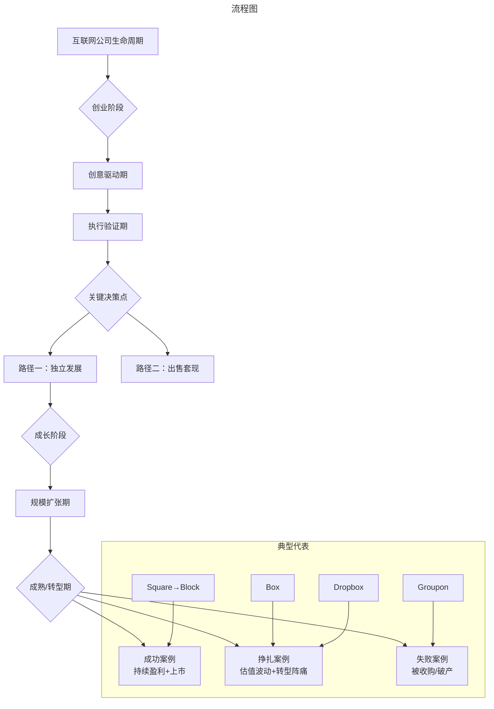
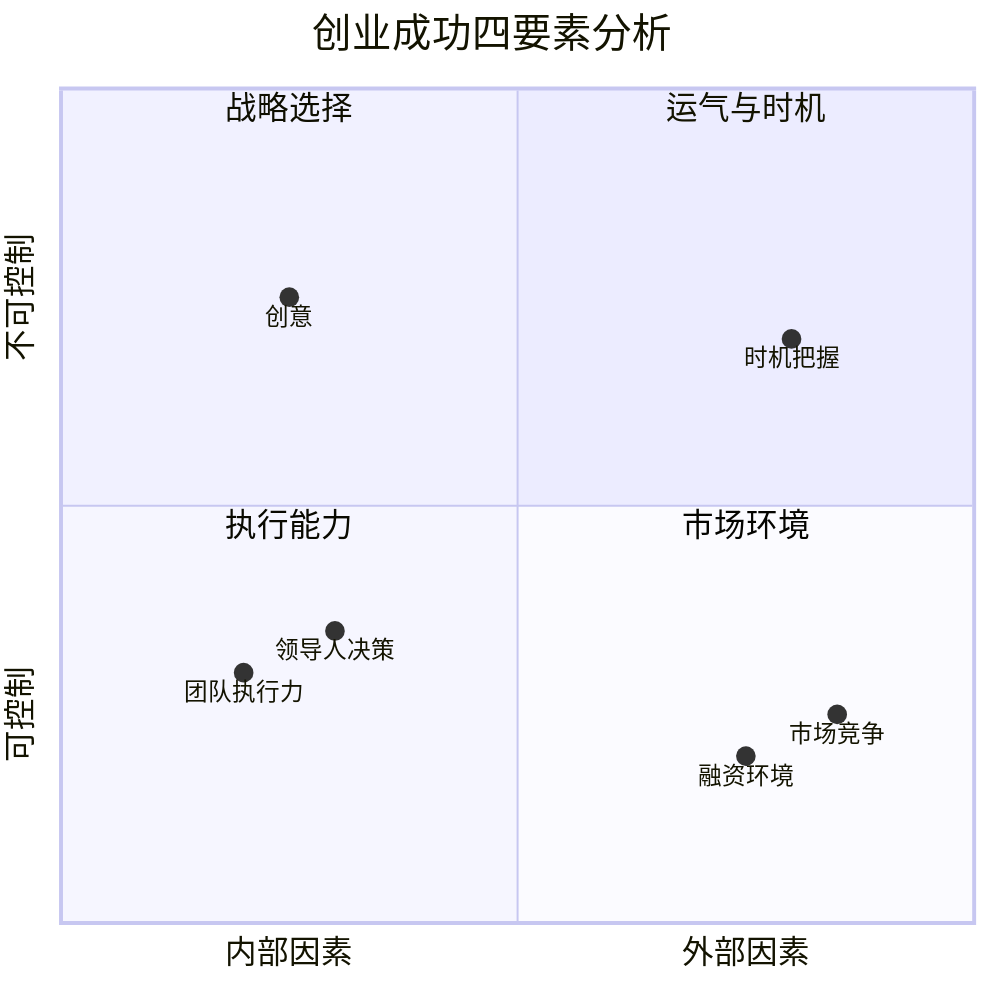

# 互联网公司生死存亡录：从Square到Box、Dropbox的兴衰启示

> **适用范围**：技术管理者、创业者、投资研究者、产品经理及对科技商业史感兴趣的读者；适用于战略复盘、案例研讨与决策参考场景。
>
> **更新摘要（v2 · 2026-08 更新）**：
> - 结构化升级为 6 节骨架（导言 / 核心方法论 / 关键流程 / 工具与实战 / 常见误区 / 进阶延展）
> - 保留全部原文 Mermaid 图、表格、数据与术语英文对照，并为 Mermaid 图补充 frontmatter 与图后解读
> - 将原「参考资料/附录」并入第 6 节「进阶延展」，便于延展阅读

## 1. 导言

> **信息截止日期：2024年6月**
> 
> 本文整合原129-136七篇文章，补充2024年最新动态，全面解读支付、云存储领域的创业公司如何在AI时代寻求生存与发展。

---

---

### 引言：创业公司的生存法则

在互联网行业的历史长河中，无数创业公司如流星般划过——有的成为恒星，有的黯然陨落。今天我们要讲述的，是**Square（现Block）、Box、Dropbox**这几家曾经风光无限的独角兽企业，以及它们背后关于**创意、执行、市场选择、卖与不卖**的深刻教训。

这些公司的故事告诉我们：**一个伟大的创意只是起点，真正的考验在于长期的执行能力、关键时刻的决策勇气，以及在时代变迁中的转型智慧。**

> 上图展示了关键节点与演进路径，结合正文时间线可直观把握事件因果与战略转折。

---

---

## 2. 核心方法论

### 第二部分：Jack Dorsey——分身有术的双CEO传奇

#### 2.1 人物背景

杰克·多西（Jack Dorsey）的成长轨迹充满传奇色彩：
- 生于美国圣路易斯
- 先后求学于密苏里大学和纽约大学，**中途辍学**
- 早年为出租车公司做调度软件
- 做过模特，在eBay上拍卖过自己的朗诵文章
- 加入Odeo（埃文·威廉姆斯的博客公司），成为程序员

#### 2.2 Twitter的起伏

**第一次当CEO**：
- Twitter独立后，30岁出头的杰克"摇身一变"成CEO
- 但他显然还没准备好：网站不稳定、盈利无解、每天准点下班去练瑜伽或学时装设计
- 结果：很快被董事会开除，埃文接管

**复仇之路**：
- 卸任CEO后保留董事会主席虚职
- 利用Twitter名义拉投资、接受采访宣传自己
- 深刻反省，改善公众形象，搞好投资人关系
- 最终推动将埃文赶下台，**再次成为Twitter CEO**

#### 2.3 双CEO时期的极限操作

能同时担任两家上市公司CEO的人屈指可数：
- 已故的**史蒂夫·乔布斯**（苹果+皮克斯）
- **埃隆·马斯克**（特斯拉+SpaceX）
- **杰克·多西**（Twitter+Square）

杰克刻意模仿乔布斯的穿着和言论风格，被称为"活着的乔布斯"。

**他的时间管理方案**（CNN采访披露）：
- 每天工作**16小时**：8小时给Twitter + 8小时给Square
- 周一：管理层会议和公司运作
- 周二：产品开发
- 周三：市场、沟通及扩张
- 周四：开发人员和合作伙伴
- 周五：公司和企业文化
- 周六：郊游
- 周日：反省、反馈和战略

**评价**：
- 如果是真的，这种强度非常人所能及
- 严格按计划执行是唯一办法
- 但突发事件如何处理？两家公司股东是否担忧？

#### 2.4 双CEO模式的终结

最终，杰克做出了选择：
- **2021年11月**：辞去Twitter CEO职务（约一年后Twitter被马斯克收购）
- 全力专注于**Block（原Square）**
- 2024年的大裁员可以看作是他All-in Block后的彻底改革

**反思**：分身有术固然令人敬佩，但人的精力终究有限。杰克的故事说明：**专注往往比分散更有力量**。

---

---

### 第三部分：创意很重要，但不是一切

#### 3.1 Square的成功要素拆解

Square的发展证明了：**一个好创意只是起点**。

**创意层面**：
- 2009年想到做智能手机读卡器+App = 非常创新 ✓

**执行层面**：
- 团队分工明确：后端服务器、硬件支付、智能手机App各有人负责 ✓
- 把核心客户（小商家）体验做到极致 ✓
- 低廉明确的手续费（2.75%）✓
- 款项快速到账 ✓

**关键时刻的正确决策**：
1. **2015年流血上市**：宁可砍半估值也要IPO筹钱
2. **2017年支持比特币**：敢于押注新兴事物

#### 3.2 为什么巨头抄不走？

亚马逊和PayPal也曾推出类似硬件，但都消失了。原因：
- Square真正解决了小商家的痛点
- 不仅硬件好，软件和服务生态完整
- 对客户友好，细节做到位

**启示**：创业者最大的护城河不是创意本身，而是**对用户需求的深度理解和持续的服务能力**。

---

---

### 第四部分：卖掉自己是不是更好？

#### 4.1 该卖没卖的惨痛教训

| 公司 | 收购方 | 报价 | 结果 |
|------|--------|------|------|
| **Groupon** | Google（2010） | 60亿美元 | 上市后市值缩水至30亿美元 |
| **雅虎** | Microsoft（2008上半） | 高价 | 2017年以当年10%不到的价格卖给Verizon |
| **Foursquare** | Yahoo!（2015第二次报价） | 9亿美元 | 2016轮融资估值仅3亿美元 |

**共同特点**：
- 都曾收到高价收购要约
- 创始人都拒绝了
- 后来发展远不如预期
- 错过了最佳退出窗口

#### 4.2 不卖也对的幸运儿

| 公司 | 拒绝的收购方 | 当前状态 |
|------|--------------|----------|
| **Google** | Yahoo!（早期） | 全球最成功的互联网公司之一 |
| **Facebook** | Yahoo!（早期） | 市值数千亿美元的庞然大物 |
| **Snap** | Facebook | 成功上市并独立发展 |

#### 4.3 决策框架：卖还是不卖？

**核心衡量标准**：收购价 vs 企业实际内在价值

但问题在于：**如何准确评估企业的内在价值？**

这引出了创始人的素质问题……

#### 4.4 两类创始人

##### 类型一："风口上的猪"
- 有一定才华，但才华与业绩不完全匹配
- 机缘巧合赶上风口，飞起来了
- 但缺乏驾驭飞行的能力
- **典型**：Groupon创始人（团购风口过去就摔下来了）

##### 类型二："弄潮儿"
- 清楚知道企业为什么存在
- 了解自身强弱项
- 对未来有清晰规划
- 能准确判断收购是否划算
- **典型**：Google、Facebook创始人

> **结论**：创始人的素质决定了企业的命运。卖或不卖，很大程度上取决于创始人能否做出正确判断。

---

---

### 第五部分：Box——企业市场的坚守者

#### 5.1 创业故事

**2004年**，南加州大学商学院学生**阿隆·列维（Aaron Levie）**在一次课程作业中分析了在线存储行业的弊端，发现了商机。

**创始团队**（4人）：
- 阿隆·列维（Aaron Levie）：CEO，南加州大学
- 狄伦·史密斯（Dylan Smith）：COO，杜克大学
- 萨姆·高德斯（Sam Ghods）
- 杰夫·奎伊瑟（Jeff Queisser）

四人全部**辍学创业**。

#### 5.2 关键转折：从消费者到企业

最初Box也是面向消费者的网盘服务（免费1GB空间）。但CEO列维很快意识到：
- 消费者愿意付费的可能性很低
- 企业才是能够稳定付费的客户

**2007年左右**，Box果断转向**企业在线存储和文件共享**市场。这是Box发展史上最重要的方向转变。

#### 5.3 "祸兮福所倚"：经济危机带来的机遇

**2008年金融危机**对Box反而是机遇：
- 传统企业无法继续采购昂贵的IT软硬件
- IT部门被迫评估市场上现有产品
- Box顺势进入很多传统企业的视线
- 经济危机也让投资人更青睐**能盈利的公司**

#### 5.4 移动互联网的东风

- **2007 iPhone发布**：里程碑事件
- **2010 iPad出现**：把Box推向新高潮
- 新硬件 = 新软件需求 = 初创企业与大公司站在同一起跑线

Box抓住机会，在企业办公场景（安全、权限管理、行为追踪）上投入巨大精力。

#### 5.5 垂直领域深耕

**2012年起**，Box开始深耕细作垂直领域：
- 医疗健康（HIPAA合规）
- 法律行业
- 教育领域
- 各行各业的数据存储安全法规

这让Box与企业竞争对手拉开差距，越来越受欢迎。

#### 5.6 IPO与现状

- **2013年宣布一年内IPO** → **2015年初才完成**
- 上市后一度低迷，后稳中攀升
- 始终坚持**服务企业客户**为核心
- 对消费者市场关注有限

**Box的理念**：盯着有钱人赚钱，稳定盈利最重要。
**代价**：错失消费者流量和潜在更大收益。

#### 5.7 2024年的AI转型

进入AI时代，Box面临新的机遇与挑战：
- 企业对**AI驱动的数据分析**需求激增
- Box正在将其存储服务与AI工具集成
- 竞争对手（Microsoft 365 Copilot、Google Workspace AI）都在加码AI
- Box需要找到自己在AI时代的独特定位

---

---

### 第六部分：Dropbox——消费者市场的探索者

#### 6.1 创业故事

**2007年**，MIT学生**德鲁·休斯顿（Drew Houston）**经常忘记带U盘，于是写了一个为自己服务的网盘。后来想到：其他学生肯定也有同样问题 → 商业前景。

联合创始人**阿拉什·费多斯基（Arash Ferdowsi）**被产品惊艳，加盟创业。

#### 6.2 与Box的关键差异

| 维度 | Box | Dropbox |
|------|-----|---------|
| **成立时间** | 2005 | 2007 |
| **初始基础设施** | 自建服务器 | AWS S3（2006年刚发布） |
| **首笔投资来源** | Mark Cuban（35万美元） | Y Combinator |
| **核心市场** | 企业 | 消费者 |
| **盈利模式** | 企业订阅（稳定） | Freemium（转化率低） |

#### 6.3 Dropbox的独特优势

**用户体验极佳**：
-首创电脑端特殊目录方式：拖拽文件即可同步
- 后来Google Drive、One Drive都采用类似方式
- 用户界面友好，使用便捷

**增长迅猛**：
- 全球超过**5亿用户**
- 曾与Square、Pinterest并称"湾区三剑客"
- 投资人最看重的指标：用户量

#### 6.4 变现困境与尝试

Freemium模式的痛点：**用户量大，但付费率极低**。

**多次尝试挖掘用户价值**：
- **2013年收购Mailbox**：邮件App → 2015年关停
- **2014年推出Carousel**：照片编辑共享 → 2015年底关停
- **2015年推出Dropbox Paper**：协作文档编辑器（弥补不能在线编辑文件的短板）

**结论**：增值服务大多失败，变现困难。

#### 6.5 技术壮举：自建文件系统

**2014-2016年**，Dropbox完成了成立以来最大的一次技术变革：
- 从AWS迁移到**自建数据中心和文件系统**
- 工程师专门撰写技术文章分享经验
- 反映了Dropbox后端团队的高超架构能力

**原因**：
- 更好地控制存储内容
- 自建网络，提供更快更稳定的服务
- 可能也有成本考量

#### 6.6 IPO与后续发展

- **2018年上市**，首日涨50%
- 无需像Square那样自砍估值（现金流已正）
- 后续推出**Dropbox Business**企业版，但功能相对单薄

#### 6.7 2024年重大变动

**CEO卸任**：2024年末，联合创始人**德鲁·休斯顿（Drew Houston）**宣布卸任CEO职位。

新任CEO背景：
- 此前任职于视频平台Vimeo
- 2024年末加入Dropbox
- 据称提升了客户响应效率，让公司在创新上更加大胆

**AI新特性**：
- 2024年，Dropbox推出一系列**AI特性**
- 目标：帮助用户整理杂乱的文件
- 反映了对用户需求的敏锐洞察
- 在工作和生活中产生的文件数量爆炸式增长的背景下，AI整理工具具有现实意义

**休斯顿的表态**：信任新任管理者，公司目前发展态势稳健。卸任并无特殊缘由。

---

---

## 3. 关键流程

### 第一部分：Square——从手机POS机到Block的进化史

#### 1.1 创业起源：一次对话引发的革命

2008年，Twitter联合创始人兼CEO**杰克·多西（Jack Dorsey）**被开除出Twitter后一度迷茫。2009年，当他见到老朋友吉姆·麦凯尔维（Jim McKelvey）时，得知对方因无法接受信用卡支付而损失了一笔2000美元的水龙头生意。

这一刻，杰克看到了机会。

**核心洞察**：个人和小商家接受信用卡支付是一个巨大的痛点。解决方案？做一个可以插在智能手机上的信用卡读卡器。

#### 1.2 产品演进路线

| 时间 | 产品 | 特点 |
|------|------|------|
| **2009** | Square读卡器（第一代） | 插入iPhone耳麦孔，免费赠送 |
| **2014** | 芯片卡读卡器 | 适应美国EMV迁移趋势 |
| **2015** | Apple Pay支持 | 与苹果合作 |
| **2015前** | Square Stand | 外接设备+iPad=收银台 |
| **2017** | Square Register | 独立POS机，无需手机/iPad |

**商业模式**：
- 读卡器免费送
- 收取**2.75%交易手续费**
- 扣除银行等成本后，约赚**1%/笔**

#### 1.3 业务生态扩展

Square不仅做硬件，还构建了完整的商户服务生态：

- **Square Cash**：个人间转账App，市占率高
- **Square Capital**（2014）：小商家贷款服务，还款方式创新（按刷卡收入比例还本付息）
- **Caviar收购**（2014.8）：送餐业务（关闭了自家的Square Order取餐业务）
- **Customer Engagement**：CRM工具集，客户细分+精准促销
- **Payroll系统**：工资发放服务（竞争ADP、Workday）

#### 1.4 融资与流血上市

**高光时刻**：
- 2014年夏，估值达**60亿美元**
- 与Dropbox、Pinterest并称"湾区最红火三剑客"

**至暗时刻**：
- 2015年，Uber和Airbnb崛起，取代"三剑客"地位
- Square融资困难，烧钱严重
- 杰克做出艰难决定：**流血IPO**

**上市数据**：
- 估值从60亿砍半至**29亿美元**
- 2015年底成功上市
- 杰克的逻辑：不IPO可能既筹不到钱，上市也更难

> **事后证明**：这个决定极其英明。同期Dropbox和Pinterest未上市，后来上市越发困难。Square市值后来翻了4倍多，达130亿美元，远超2014年的60亿峰值。

#### 1.5 比特币豪赌：前瞻还是运气？

**2017年**，Square宣布支持比特币支付。当时：
- 比特币年初约1000美元/枚 → 年末约20000美元/枚
- 主流支付平台无人支持比特币
- Square成为第一个吃螃蟹的人

**结果**：这波操作给Square股价带来猛涨。

**争议**：是预见了比特币大火，还是撞了大运？无论如何，这反映了领导人的**远见卓识**——而远见对企业发展至关重要。

#### 1.6 更名Block与2024年大地震

##### 更名Block
Square后来更名为**Block Inc.**（股票代码：XYZ），以反映其多元化业务：
- Square（支付）
- Cash App（个人金融）
- Afterpay（先买后付）
- Tidal（音乐流媒体，杰克从Jay-Z手中收购）
- BTC相关业务

**Afterpay收购**（2021年，290亿美元）：这是Block历史上最大的收购，标志着其进入"先买后付"（BNPL）赛道。

##### 2024年的震撼消息

**2024年2月26日**，Jack Dorsey突然宣布：

> **Block裁员40%，约4000人！**

更令人震惊的是他在股东信中的表态：

> "我们裁员不是因为业绩不好，反而我们的业绩很坚挺。**只是AI从根本上改变了构建和运营公司的意义**，小团队+公司自研AI工具可以把工作做得更好。"

他还预言：**大多数企业将在未来一年内被迫作出类似的结构性调整。**

**市场反应**：
- 宣布当天Block股价飙升**24%**
- 市场解读为：AI提升效率的正面信号
- 也引发了对"AI替代人类"的广泛讨论

**深层含义**：
- Jack Dorsey终于放弃了"双CEO"模式后的彻底转型
- Block正在从一家支付公司变成一家**AI驱动的金融科技公司**
- 比特币业务的整合也在推进（与Lightning Network整合，允许商家通过Square硬件直接接受比特币支付）

---

---

## 4. 工具与实战

### 第七部分：做产品先做消费者市场，还是企业市场？

#### 7.1 核心判断标准

**放之四海而皆准的标准：能不能赚钱？能赚多少钱？**

选择消费者市场还是企业市场，取决于对**产品盈利模式的理解**。

#### 7.2 典型案例对比

##### 消费者市场典范：Apple
- iPhone推出时购买场面火爆
- 设计好、易用性强、刚需
- 利润率极高

##### 企业市场典范：Oracle
- 数据库产品老大
- 不关注消费者市场（太小的生意）
- 企业级软件特点：
  - 复杂性高 → 开发成本高
  - 客户数量少 → 单价必须高
  - 单套利润远超消费者产品

#### 7.3 Box vs Dropbox的战略分歧

| 维度 | Box的选择 | Dropbox的选择 |
|------|-----------|---------------|
| **核心理念** | 服务愿意付费的企业 | 先圈用户再变现 |
| **优势** | 盈利模式清晰可预期 | 用户基数大，潜在天花板高 |
| **风险** | 市场规模有限 | 变现困难，烧钱压力大 |
| **性质** | 稳健但天花板较低 | 激进但回报潜力更高 |

#### 7.4 2024年的新变量：AI改变一切

在AI时代，这个经典问题有了新的答案：

**对于云存储公司而言**：
- AI需要大量训练数据 → 消费者市场的海量数据变得更有价值
- 企业需要AI集成工具 → 企业市场的付费意愿更强
- **边界正在模糊**：最好的策略可能是"两者兼顾"

**Box的策略**：深耕企业AI应用场景
**Dropbox的策略**：用AI增强消费者体验（文件整理、智能搜索）

---

---

## 5. 常见误区

（本节内容在原文中较为简略，可结合第 2、3、4 节相关段落交叉理解。）

---

## 6. 进阶延展

### 第八部分：深度总结与启示

#### 8.1 创业成功的四要素

1. **创意**：好的起点，但只是起点
2. **执行**：把创意落地的能力
3. **时机**：在对的时间做对的事
4. **决策**：关键时刻的取舍勇气

#### 8.2 三家公司的命运启示

| 公司 | 核心教训 | 2024年现状 |
|------|----------|------------|
| **Square/Block** | 流血上市的魄力+前瞻性布局 | AI转型，裁员40%重构组织 |
| **Box** | 找到付费客户比追求流量更重要 | AI时代的企业服务机遇 |
| **Dropbox** | 用户数量≠商业成功 | CEO交棒，AI赋能新产品 |

#### 8.3 给创业者的建议

##### 关于创意
- 创意很重要，但不是一切
- 好创意需要更好的执行来匹配
- 不要因为有好创意就忽视基本功

##### 关于市场选择
- 想清楚谁会为你付费
- 消费者市场：规模大但变现难
- 企业市场：规模小但付费稳
- AI时代可能打破传统二元对立

##### 关于关键决策
- 该出手时要出手（如Square的流血上市）
- 该坚持时要坚持（如Facebook拒绝收购）
- 但前提是你真的理解自己公司的价值

##### 关于卖或不卖
- 没有标准答案
- 取决于创始人的素质和判断力
- "风口上的猪"要及时套现
- "弄潮儿"可以继续追梦

##### 关于AI时代的新挑战
- AI正在重塑所有行业
- 组织结构需要适配AI时代（如Block的裁员逻辑）
- 技术壁垒可能不再是护城河
- **数据和场景**才是真正的资产

---

---

### 结语：在不确定性中寻找确定性

Square、Box、Dropbox这三家公司，代表了互联网创业的三种典型路径：

- **Square**：从硬件切入，构建生态，不断进化为Block
- **Box**：专注企业市场，稳健经营，等待AI新机遇
- **Dropbox**：以消费者为王，经历变现困境，在转型中摸索

它们的故事告诉我们：

> **创业是一场马拉松，不是百米冲刺。起跑线的领先不重要，重要的是途中的每一次决策、每一次转型、每一次坚持。**

而在2024年的今天，AI浪潮席卷而来，这三家公司——以及所有互联网公司——都面临着同样的命题：**如何在AI时代重新定义自己的价值？**

Block选择了激进的组织重构，Box选择了深耕企业AI场景，Dropbox选择了换帅求新。谁的策略最终会被证明是正确的？时间会给出答案。

但有一点是确定的：**那些能够在时代变迁中保持学习能力、敢于自我革新的公司，才有可能活到最后。**

---

> **参考资料来源**：
> - 原专栏文章129-136
> - Block/Square/Dropbox/Box官方财报及公告
> - 各大财经媒体2024年报道
> - Wikipedia及其他公开资料
>
> **声明**：本文信息截至2024年6月，部分数据可能已有变化。投资决策请参考最新信息。

---

*v2 结构化升级版 · 文件名保持不变：038-互联网公司生死存亡录Square Box Dropbox等-【更新版】.md*