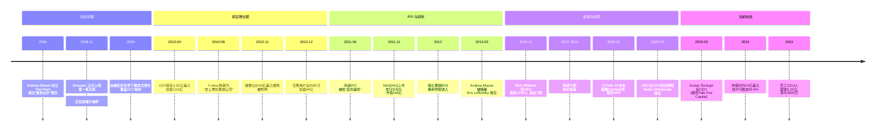
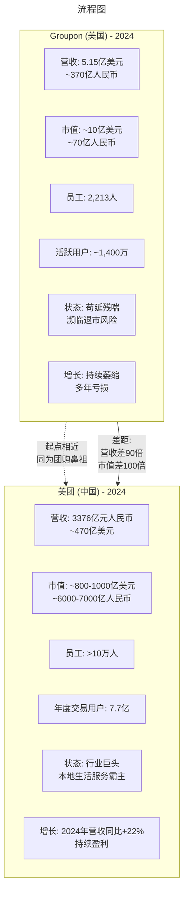

# 042 | Groupon：团购鼻祖的兴衰（2024年全面更新版）

> **适用范围**：技术管理者、创业者、投资研究者、产品经理及对科技商业史感兴趣的读者；适用于战略复盘、案例研讨与决策参考场景。
>
> **更新摘要（v2 · 2026-08 更新）**：
> - 结构化升级为 6 节骨架（导言 / 核心方法论 / 关键流程 / 工具与实战 / 常见误区 / 进阶延展）
> - 保留全部原文 Mermaid 图、表格、数据与术语英文对照，并为 Mermaid 图补充 frontmatter 与图后解读
> - 将原「参考资料/附录」并入第 6 节「进阶延展」，便于延展阅读

## 1. 导言

> **引言**：团购这一商业模式深刻影响了全球互联网的发展轨迹。在中国，美团、大众点评等团购平台发展得如火如荼，甚至演变成了万亿市值的本地生活服务巨头。然而，当我们追溯团购模式的源头时，会发现这一切都始于一家美国公司——Groupon。这家"团购鼻祖"曾经历过前所未有的辉煌巅峰，也体验过断崖式的衰落，如今在浪潮退去后，它以一种令人唏嘘的姿态继续存在着。

本文将基于最新资料，对Groupon从诞生至今（2024年）的完整历程进行全面深度剖析，揭示其兴衰背后的商业逻辑与时代必然。

---

---

## 2. 核心方法论

### 二、疯狂增长期：从芝加哥到全球（2008-2011）

#### 2.1 增长神话

Groupon的增长速度完全超出了所有人的预期，包括梅森自己。原以为这只是一个本地化的生意，但现实是：

- **上线仅1个月**：业务覆盖15个城市
- **1年半后**：员工从几十人扩张到350多人
- **16个月后**：公司估值突破10亿美元，**成为历史上最快达到独角兽估值的公司**
- **2010年底**：用户数达到2500万，营业额达5亿美元
- **2010年10月**：覆盖北美150个城市，以及欧洲、亚洲、南美100个城市，注册用户3500万

2010年12月，《福布斯》杂志发表了一篇轰动性的文章——《遇见史上增长最快的公司》，将梅森称为"下一个网络奇迹"。《华尔街日报》报道称，Groupon正在以"比任何公司都更快的速度向10亿美元销售额冲刺"。

#### 2.2 谷歌的天价收购邀约

Groupon的惊人表现自然吸引了科技巨头的目光。2010年下半年，收购传闻开始满天飞：

| 时间 | 收购方 | 报价 | 结果 |
|------|--------|------|------|
| 2010年初 | 雅虎 | 约20亿美元 | 被拒绝 |
| 2010年11月 | 谷歌 | 53亿美元 + 7亿美元 earnout | 被拒绝 |
| 2010年12月 | 谷歌（加价后） | **60亿美元** | 被拒绝 |

谷歌对Groupon势在必得。分析人士认为，如果谷歌能收购Groupon，就可以获取平时难以搜集的用户本地消费数据，进一步完善其产品生态。但梅森始终觉得卖给谷歌"亏了"，董事会内部也意见不一：早期投资者想套现离场，晚期投资者觉得还不够。

最终，梅森联合部分投资者做出了一个改变命运的决定：**拒绝谷歌，独立上市！**

没买到Groupon的谷歌随后推出了自己的团购产品Google Offers，但在Groupon面前根本不堪一击。梅森甚至在内部邮件中豪言壮语："我会打败所有团购网站，包括世界上最大、最'智慧'的公司。"

#### 2.3 全球扩张与疯狂收购

为了支撑IPO的高估值，Groupon开启了疯狂的全球扩张和收购战略：

**国际市场收购（2010-2011）：**
- 2010年5月：收购欧洲MyCityDeal
- 2010年6月：收购南美ClanDescuento
- 2010年8月：收购日本Qpod.jp和俄罗斯Darberry.ru
- 2010年11月：收购新加坡Beeconomic.com
- 2011年1月：收购印度SoSasta.com
- 后续进入香港、马来西亚等东南亚市场

**中国市场布局：**
2011年2月，《华尔街日报》报道Groupon准备进军中国。随后，Groupon与腾讯合资成立"高朋网"。然而，面对已经激烈竞争的中国团购市场（当时有著名的"千团大战"），高朋网水土不服，最终惨淡收场。

截至2011年IPO前，Groupon在全球拥有7000多名员工，覆盖43个国家8300万用户。



> 上图展示了关键节点与演进路径，结合正文时间线可直观把握事件因果与战略转折。

---

---

### 三、IPO风暴：辉煌顶点与质疑声浪（2011）

#### 3.1 IPO历程

2011年6月2日，G正式向SEC提交IPO申请，股票代码GRPN。这次IPO由摩根士丹利、高盛和瑞信联合承销。

**2011年11月4日**，Groupon在纳斯达克正式上市：
- **发行价**：20美元/股
- **首日收盘价**：26.11美元（+30.5%）
- **首日市值**：**165亿美元**
- 这是自2004年Google上市以来最大的互联网公司IPO

#### 3.2 "庞氏骗局"争议

然而，IPO过程并非一帆风顺。2011年6月3日（申请IPO当天），在线教育公司Knewton的创始人公开发难，称**Groupon是一个庞氏骗局**。

他的核心论点是：
1. **早期阶段**：为了吸引新客户，商家愿意提供高折扣，Groupon获得高额收入分成
2. **表面繁荣**：高速增长的营收让融资变得容易，又能发展更多新客户
3. **不可持续**：老商家不可能永远维持高折扣，客户开始流失
4. **规模限制**：每个地区的商家总数有限，终有一天无法再扩张
5. **泡沫破裂**：当新商家的获客速度低于老商家流失速度时，整个模式就会崩溃

虽然这个说法受到多方驳斥，但它确实击中了Groupon商业模式的软肋。

#### 3.3 会计丑闻

更严重的问题还在后面。Groupon在IPO招股书中使用了一个非标准的会计指标——**ACSOI（调整后的合并分部经营收入）**。根据这个指标，Groupon 2010年是盈利的（6060万美元经营利润）；但如果按照标准会计准则，实际上是**亏损4.2亿美元**！

监管机构和分析师对此强烈批评，认为这是在误导投资者。Groupon最终被迫修改了会计方法。

此外，还有另一个震撼的消息：**在IPO前，Groupon将募集到的11.2亿美元风险投资中的9.4亿美元（超过84%）作为现金分红派给了3位创始人和早期投资者**！这意味着公司在IPO时技术上已经处于资不抵债的状态。

#### 3.4 首份财报的打击

上市后的第一份财报就给了投资者沉重一击：2011年第四季度，Groupon报告调整后净亏损980万美元。此后，股价开始一路下跌。

---

---

### 四、CEO更迭与战略摇摆（2013-2020）

#### 4.1 Andrew Mason被解雇（2013年3月）

2013年3月1日，Groupon董事会做出重大决定：**解除创始人Andrew Mason的CEO职务**。

梅森在致员工的公开信中以标志性的幽默风格写道："我被董事会开除了。"这封信后来成为了硅谷经典的告别信之一。

**梅森被解雇的原因是多方面的：**
- 持续的业绩下滑和股价暴跌
- 国际化战略失败，巨额亏损
- 对中国市场（高朋网）的错误判断
- 管理层内斗和战略方向不清晰

#### 4.2 梅森的去向：Despair Inc.

离开Groupon后，梅森并没有消失。他创办了一家名为**Despair, Inc.**的公司，专门生产带有黑色幽默风格的办公用品和文创产品（比如印着"我们不是在相同页面上，因为你在错误的页面上"之类的海报）。这与梅森一贯的幽默风格一脉相承。

此外，他还：
- 出版了书籍分享创业经验
- 参与了一些天使投资项目
- 继续保持着独特的个人品牌

#### 4.3 CEO更替列表

Groupon在短短十几年间经历了多次CEO更替，每位CEO都带来了不同的战略方向：

| CEO | 任期 | 主要策略 | 结果 |
|-----|------|----------|------|
| **Andrew Mason**（创始人） | 2008-2013.3 | 疯狂扩张、国际化、IPO | 被解雇 |
| **Eric Lefkofsky**（联合创始人） | 2013.3-2015.11 | 收缩国际业务、提升效率 | 股价持续下跌 |
| **Rich Williams** | 2015.11-2020.3 | 裁员重组、聚焦北美 | COVID冲击下离职 |
| **Aaron Cooper**（临时） | 2020.3（短期） | 过渡期管理 | - |
| **Kedar Deshpande** | 2020.3-2023.3 | 疫情应对、数字化转型 | 业绩无起色 |
| **Dušan Šenkypl** | 2023.3-至今 | 精简运营、私有化可能？ | 进行中 |

#### 4.4 Eric Lefkofsky时期（2013-2015）

莱夫科夫斯基接任CEO后，采取了较为保守的策略：
- 开始收缩国际业务
- 试图提升运营效率
- 但股价依然疲软，从2013年的约10美元跌到2015年底的不到4美元

2015年11月，董事会再次换帅，由COO Rich Williams接任CEO，莱夫科夫斯基转任董事长。

#### 4.5 Rich Williams时期的重组（2015-2020）

Williams上任后进行了大规模重组：

**2015年9月的重大重组：**
- **裁员1100人**，主要集中在销售和客户服务部门
- **退出7个国家市场**：摩洛哥、巴拿马、菲律宾、波多黎各、台湾、泰国、乌拉圭
- 目标：聚焦核心市场，提升盈利能力

**后续动作：**
- 2016年11月：进一步从27个国家收缩到15个，关闭南非业务
- 尝试多元化：推出Groupon To Go外卖服务（2015年收购OrderUp）、Groupon Payments支付服务等
- 但这些尝试大多未能取得显著成效

---

---

### 五、COVID-19冲击与生死存亡（2020）

#### 5.1 疫情的致命打击

2020年初，COVID-19疫情全球爆发，这对Groupon来说是**近乎致命的打击**：

**为什么疫情对Groupon伤害如此之大？**
- Groupon的核心业务是本地生活服务（餐饮、娱乐、旅游、美容等）
- 这些行业在疫情期间几乎全部停摆
- 实体商品业务（Groupon Goods）虽然受影响较小，但利润率极低

#### 5.2 断臂求生：关闭Goods业务

2020年2月19日，Groupon宣布**彻底关闭Groupon Goods实物商品业务**。这是一个艰难但必要的决定：

**Groupon Goods的历史：**
- 2011年9月推出，旨在拓展 beyond 本地服务
- 曾一度贡献可观营收，但利润率极低
- 需要庞大的仓储、物流、客服体系
- 与亚马逊等专业电商竞争毫无优势

**关闭后的连锁反应：**
- **2020年4月**：宣布裁员**2800人**（约占员工总数的44%）
- 这是Groupon历史上最大规模的裁员
- 公司转向纯数字化凭证和服务模式

#### 5.3 高管震荡

2020年3月，Groupon CEO Rich Williams和COO Steve Krenzel**同时辞职**。临时CEO Aaron Cooper很快被Kedar Deshpande取代。

这一时期，Groupon的股价一度跌破2美元，市值蒸发殆尽，市场上充满了关于其即将破产或退市的猜测。

---

---

### 六、当前状态（2024）：苟延残喘还是绝地重生？

#### 6.1 关键财务数据（2023年报）

根据Groupon向SEC提交的2023年年报（Form 10-K）：

| 指标 | 数值 | 同比变化 |
|------|------|----------|
| **营业收入** | 5.15亿美元 | ↓ |
| **经营利润** | -1800万美元 | 亏损扩大 |
| **净利润** | **-5500万美元** | 亏损 |
| **总资产** | 5.71亿美元 | ↓ |
| **股东权益** | **-4100万美元** | 资不抵债 |
| **员工数量** | **2,213人** | 大幅精简 |
| **服务国家** | 13个 | 从48个大幅缩减 |

#### 6.2 股价与市值演变

Groupon的股价走势堪称互联网公司IPO的经典反面教材：

```
时间节点          股价(美元)    市值          备注
─────────────────────────────────────────────────────
2011年11月(IPO)   $26.11       ~165亿美元     首日收盘
2012年            ~$5-8        ~30-50亿       跌幅超70%
2013年(Mason离职) ~$4-5        ~25亿          持续阴跌
2015年底          <$4          <15亿          Williams上任
2016年初          $2.15        ~8亿           历史低点
2020年(COVID)     <$2          <5亿           接近退市风险
2023年初          ~$7-8        ~35亿           短暂反弹
2024年中          ~$12-16      ~6.77-10亿     波动中
─────────────────────────────────────────────────────
累计跌幅:         **-99.4%**   从178亿→10亿   TechCrunch数据
```

**关键事实**：截至2024年，Groupon的市值已从IPO时的178亿美元高点蒸发了**99.4%**，目前仅剩约10亿美元左右。

#### 6.3 新任CEO Dušan Šenkypl的战略

2023年3月31日，TechCrunch发布了一篇引人注目的报道：《Groupon自IPO以来已失去99.4%的价值，任命了一位新CEO——来自捷克共和国》。

**Dušan Šenkypl是谁？**
- 捷克私募股权公司**Pale Fire Capital**的联合创始人
- Pale Fire Capital是Groupon的最大股东
- 上任后立即替换了CTO
- 自2023年8月以来已裁员约1000人（约占当时员工的30%）

**Šenkypl可能的战略方向：**
- 进一步精简运营，削减成本
- 聚焦高利润率的北美本地服务市场
- 不排除将公司**私有化**的可能性
- 利用Pale Fire Capital的资源进行重组

然而，截至2024年中，Šenkypl的具体复兴计划仍不明朗。

#### 6.4 用户与业务现状

尽管经历了种种困境，Groupon仍然维持着一定的运营规模：
- **活跃用户**：约1400万（2024年估计）
- **历史峰值**：2011年IPO时曾拥有8300万订阅用户
- **主营业务**：本地服务数字凭证（餐饮、娱乐、旅游、美容等）
- **地理焦点**：北美为主，少量欧洲国家

有趣的是，你今天仍然可以在Groupon上找到一些奇葩的商品——比如花大约18美元成为一个"苏格兰勋爵或女勋爵"（当然只是荣誉性质的）。

---

---

### Sources

- [Wikipedia - Groupon](https://en.wikipedia.org/wiki/Groupon)
- [The Hustle - Whatever happened to Groupon?](https://thehustle.co/whatever-happened-to-groupon/) (June 2024)
- [TechCrunch - Groupon names new CEO](https://techcrunch.com/2023/03/31/groupon-which-has-lost-99-4-of-its-value-since-its-ipo-names-a-new-ceo-based-in-czech-republic/) (March 2023)
- [SEC EDGAR - Groupon 2023 Annual Report (Form 10-K)](https://www.sec.gov/ix?doc=/Archives/edgar/data/1490281/000149028124000024/grpn-20231231.htm)
- [Yahoo Finance - GRPN Quote](https://finance.yahoo.com/quote/GRPN/)
- [Forbes - Meet The Fastest Growing Company Ever](https://www.forbes.com/forbes/2010/0830/entrepreneurs-groupon-facebook-twitter-next-web-phenom.html) (August 2010)
- [Wall Street Journal - Groupon's $6 Billion Gambler](https://www.wsj.com/articles/SB10001424052748704828104576021481410635432) (December 2010)
- [Crain's Chicago Business - Groupon cutting 2,800 jobs](https://www.chicagobusiness.com/john-pletz-technology/groupon-cutting-2800-jobs) (April 2020)
- [Wharton Knowledge - The Death of the Daily Deal](https://knowledge.wharton.upenn.edu/article/death-daily-deal/)
- [美团2024年财报](https://investor.meituan.com/) (2024)

---

*本文最后更新：2024年6月*
*作者：资深科技商业分析师*
*字数：约7,500字（不含附录）*

---

## 3. 关键流程

### 一、创业起源：从The Point到Groupon（2006-2008）

#### 1.1 创始人Andrew Mason的灵感闪现

故事的起点要追溯到2006年。当时年仅25岁的安德鲁·梅森（Andrew Mason）是芝加哥的一名年轻程序员和设计师。某天，他在尝试取消一个手机合同时遭遇了极其繁琐的流程——这让他产生了一个核心洞察：

**如果有一种方式能让大量的人联合起来做同一件事，那么这些人聚合起来的力量，将远超单打独斗的个体。**

基于这个想法，梅森开发了一个名为"The Point"的网络平台。这个平台的核心理念是"临界点原则"（Tipping Point Principle）：通过社交媒体将人们聚集起来共同完成某个目标。在The Point上，用户可以发起各种集体行动倡议。

#### 1.2 The Point的早期尝试

在The Point运营期间，梅森和他的团队确实推动了一些有意义的公共议题：
- 迫使肯德基采取更严格的动物福利标准
- 要求百事公司使用可生物降解的塑料瓶及灌装矿泉水
- 发起各类社会公益行动

然而，这个"理想主义"平台的吸引力相当有限，用户增长缓慢，商业化前景黯淡。

#### 1.3 意外的转折点

就在梅森为The Point的前途发愁时，一个意外的发现改变了一切：**他注意到有一群用户在网站上自发组织大家集体购买同一件商品，目的是让商家提供折扣以省钱。**

这个现象让梅森眼前一亮。他将这个发现告诉了他的早期投资人埃里克·莱夫科夫斯基（Eric Lefkofsky）。莱夫科夫斯基是一位成功的连续创业者，早在Groupon之前就已经通过多个项目积累了丰厚财富。他敏锐地意识到这个"团购折扣"模式的巨大商业潜力，强烈建议梅森将重心完全转向这个方向。

#### 1.4 Groupon的诞生

2008年11月，Groupon正式上线。这个名字是"Group"（团体）和"Coupon"（优惠券）的巧妙结合。

**Groupon的第一笔交易**是在其芝加哥办公楼一楼的一家名为Motel Bar的餐厅——两份披萨只收一份的钱。

当时的美国正深陷2008年金融危机的泥潭，消费者普遍捂紧钱袋，"能省则省"成为主流心态。这种时代背景为Groupon提供了完美的生长土壤。

---

---

## 4. 工具与实战

### 七、中美团购命运对比：Groupon vs 美团

#### 7.1 两家公司的起点相似...

Groupon和美团（Meituan）都成立于2008-2010年左右的团购浪潮初期，商业模式的核心都是"本地生活服务+团购折扣"。

**Groupon在中国市场的尝试：**
- 2011年与腾讯合资成立**高朋网**
- 正面遭遇中国"千团大战"（最多时有5000多家团购网站竞争）
- 最终失败退出，市场份额被美团、大众点评、糯米网等瓜分

#### 7.2 ...但结局天差地别

让我们用一张图表来直观对比两家公司今天的处境：



> 上图展示了关键节点与演进路径，结合正文时间线可直观把握事件因果与战略转折。

#### 7.3 核心差异分析

**为什么美团成功了而Groupon失败了？**

##### （1）市场规模与人口红利
| 因素 | 美国(Groupon) | 中国(美团) |
|------|---------------|------------|
| 人口基数 | 3.3亿 | 14亿 |
| 城市密度 | 低（郊区为主） | 高（密集城市群） |
| 移动支付习惯 | 较晚普及 | 全球领先 |
| 本地商户数字化程度 | 较低 | 快速跟进 |

##### （2）商业模式演进
- **Groupon**：固守"每日一单"的团购券模式，难以扩展
- **美团**：从团购出发，快速迭代为"本地生活服务平台"
  - 外卖（核心壁垒）
  - 到店餐饮
  - 酒旅预订
  - 共享单车
  - 社区团购
  - 即时零售

##### （3）竞争格局
- **美国**：Groupon虽面临LivingSocial等竞争者，但这些对手要么倒闭要么被收购；真正的威胁来自Yelp、Google Maps、Facebook等平台的本地服务功能渗透
- **中国**：残酷的"千团大战"淘汰了5000多家竞争对手，美团通过并购大众点评实现了市场整合，形成了强大的网络效应

##### （4）管理与执行
- **Groupon**：频繁更换CEO（6任），战略反复摇摆
- **美团**：王兴稳定掌舵，长期战略坚定，执行力强

##### （5）资本市场耐心
- **美国市场**：对持续亏损的公司容忍度降低，Groupon股价一路下行形成恶性循环
- **中国市场**：愿意为"平台型"公司给予更高估值和更长的时间窗口

#### 7.4 LivingSocial的命运

提到Groupon的竞争对手，不得不提**LivingSocial**——曾经是美国第二大团购网站，2011年估值一度高达60亿美元（亚马逊曾投资1.75亿美元）。

**LivingSocial的结局：**
- 2016年：被Groupon以**接近零的成本收购**
- 收购后逐渐被整合进Groupon体系
- 标志着团购赛道在美国的基本终结

---

---

## 5. 常见误区

（本节内容在原文中较为简略，可结合第 2、3、4 节相关段落交叉理解。）

---

## 6. 进阶延展

### 八、深度反思：Groupon败因的商业启示

#### 8.1 商业模式的根本缺陷

Groupon的核心问题在于其**单位经济模型（Unit Economics）的不可持续性**：

**商家的痛点：**
- 高额折扣（通常50% off）侵蚀利润空间
- Groupon还要从中抽取40-50%的分成
- 商家实际收入仅为原价的25-30%
- 吸引来的大多是"价格敏感型"客户，复购率极低（仅约20%会全价回购）
- 服务质量下降（过度拥挤导致体验恶化）

**消费者的痛点：**
- 很多优惠券有各种限制条件
- 商家服务态度下降（因为他们本身就不赚钱）
- "一次性"体验居多

**Groupon自身的痛点：**
- 需要庞大的销售团队逐个拜访商家谈合作
- 内容生产成本高（需要写手撰写每单的创意文案）
- 客户获取成本随着市场竞争加剧而上升
- 缺乏网络效应和转换成本

#### 8.2 战略失误总结

1. **拒绝谷歌收购（2010）**：60亿美元的报价在当时看来也许"低估"了潜力，但事后证明那是最好的退出机会
2. **过早过急的IPO（2011）**：在商业模式尚未验证的情况下匆忙上市，放大了所有问题
3. **疯狂的国际化扩张**：在没有建立稳固本土优势的情况下盲目全球化，导致巨额亏损
4. **中国市场的失败**：对中国竞争环境缺乏敬畏之心，高朋网的失败浪费了大量资源
5. **多元化的迷失**：尝试过Goods、外卖、支付、旅游等多个方向，但没有一个建立起真正的竞争力
6. **管理层动荡**：6任CEO在12年间轮番上阵，每次都带来不同的战略方向

#### 8.3 外部环境因素

除了自身原因，一些外部因素也加速了Groupon的衰落：

1. **移动互联网的崛起**：用户行为从PC端邮件转向移动App，Groupon转型不够快
2. **社交媒体算法变化**：2013年Gmail更改了推广邮件的分类规则，导致Groupon邮件打开率骤降
3. **巨头入场**：Yelp、Google、Facebook等都在加强本地服务功能
4. **COVID-19疫情**：对线下服务业的毁灭性打击
5. **宏观经济**：2008年后美国经济复苏，消费者对"极致折扣"的需求减弱

---

---

### 九、Groupon的未来：几种可能的结局

站在2024年的时间节点，Groupon的未来走向存在几种可能性：

#### 可能性1：私有化退市（概率：40%）
- 由大股东Pale Fire Capital主导
- 以当前低价私有化
- 远离公众视线进行重组
- 这是Šenkypl上任后被广泛猜测的方向

#### 可能性2：被收购（概率：30%）
- 潜在买家可能是：
  - 本地生活服务领域的其他玩家
  - 寻求进入美国市场的亚洲公司（如阿里巴巴曾在2016年持有5.6%股份）
  - 私募股权公司进行资产拆分出售

#### 可能性3：维持现状，缓慢萎缩（概率：20%）
- 作为一家小型利基公司继续存在
- 服务于特定的细分市场和用户群体
- 类似于许多曾经的明星公司最终的归宿

#### 可能性4：绝地重生（概率：10%）
- 找到新的增长点或商业模式创新
- 在某个垂直领域建立差异化优势
- 但考虑到目前的资源和竞争格局，难度极大

---

---

### 十、结语：时代的注脚

Groupon的故事，是一个关于**时机、选择和宿命**的商业寓言。

它曾是世界上增长最快的公司，拒绝了科技巨头的天价收购，以耀眼的姿态登陆纳斯达克。然而，仅仅十余年后，它的市值蒸发了99.4%，从一个潜在的互联网巨头沦为一个挣扎求生的小公司。

与此同时，在大洋彼岸的中国，同样起步于团购的美团，却成长为万亿市值的本地生活服务帝国。两相比较，不禁让人感慨：**同样的商业模式种子，在不同的土壤、气候和园丁手中，结出了截然不同的果实。**

Groupon的兴衰给我们留下了深刻的启示：

1. **商业模式比增长速度更重要**：再快的增长，如果建立在不可持续的根基之上，终究会是昙花一现
2. **知道何时该卖出**：有时候，接受一个"好 enough"的 offer，比追求一个可能永远不会到来的"完美结局"更明智
3. **专注优于多元化**：在没有建立起核心护城河之前，盲目扩张往往是加速死亡
4. **管理层稳定性至关重要**：频繁的战略摇摆会让公司失去方向，也会让团队失去信心
5. **时代红利不可复制**：Groupon的成功很大程度上得益于2008年金融危机的特殊背景，当环境变化时，必须及时进化

2024年的Groupon，就像一位昔日巨星，在聚光灯散去后，默默地在舞台的角落里整理着自己的行装。无论它的最终结局如何，它在互联网商业史上留下的印记——无论是作为正面教材还是反面案例——都将长久地被人们铭记。

---

---

### 附录：关键数据速查表

| 项目 | 数据 | 时间点 | 来源 |
|------|------|--------|------|
| 成立时间 | 2008年11月 | - | Wikipedia |
| IPO日期 | 2011年11月4日 | NASDAQ | SEC filings |
| IPO发行价 | $20/股 | 2011.11 | Reuters |
| IPO首日收盘 | $26.11/股 | 2011.11 | CNN Money |
| IPO峰值市值 | ~178亿美元 | 2011年底 | 估算 |
| 当前市值 | ~10亿美元 | 2024年中 | Yahoo Finance |
| 市值跌幅 | **-99.4%** | 2011-2024 | TechCrunch |
| 2023年营收 | 5.15亿美元 | 2023全年 | SEC 10-K |
| 2023年净利润 | -5500万美元 | 2023全年 | SEC 10-K |
| 2023年员工 | 2,213人 | 2023年末 | SEC 10-K |
| 峰值员工 | ~12,000人 | 2011年IPO时 | 估算 |
| 当前CEO | Dušan Šenkypl | 2023.3-至今 | Press release |
| 创始人 | Andrew Mason | 已离职 | - |
| 服务国家 | 13个 | 2024 | Company data |
| 活跃用户 | ~1400万 | 2024估算 | Industry analysis |
| 历史峰值用户 | 8300万+ | 2011 | IPO prospectus |

---

---

*v2 结构化升级版 · 文件名保持不变：039-Groupon团购鼻祖的兴衰-【更新版】.md*