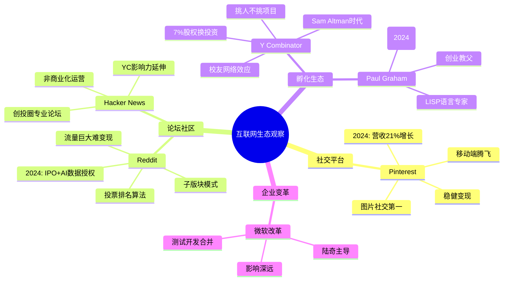
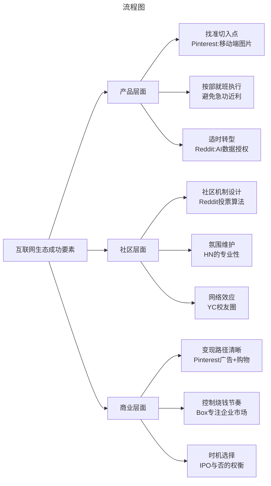

# 从Pinterest到Reddit到YC：互联网生态的深度观察

> **适用范围**：技术管理者、创业者、投资研究者、产品经理及对科技商业史感兴趣的读者；适用于战略复盘、案例研讨与决策参考场景。
>
> **更新摘要（v2 · 2026-08 更新）**：
> - 结构化升级为 6 节骨架（导言 / 核心方法论 / 关键流程 / 工具与实战 / 常见误区 / 进阶延展）
> - 保留全部原文 Mermaid 图、表格、数据与术语英文对照，并为 Mermaid 图补充 frontmatter 与图后解读
> - 将原「参考资料/附录」并入第 6 节「进阶延展」，便于延展阅读

## 1. 导言

> **信息截止日期：2024年6月**
> 
> 本文整合原137-140、152-156八篇文章（跳过141-Sun相关已单独处理），补充2024年最新动态，全面解读互联网生态中社交平台、社区论坛、创业孵化器等关键领域的发展脉络与未来趋势。

---

---

### 引言：互联网生态的多彩图谱

互联网世界不仅仅是几家巨头的游戏。在巨头之外，存在着一个丰富多彩的生态系统：**专注图片的社交网络、基于投票的内容社区、孕育创新的孵化器、连接创业者与投资人的信息平台**……

今天我们要讲述的，是**Pinterest（图片社交）、Reddit（论坛社区）、Hacker News（创投论坛）、Y Combinator（创业孵化器）以及其灵魂人物Paul Graham**的故事，还有一段关于**微软工程师改革**的历史插曲。

这些故事共同构成了一幅互联网生态的全景图，让我们看到：**创新可以来自任何地方，成功有多种定义，而坚持自己的节奏有时比追逐风口更重要。**



> 上图展示了关键节点与演进路径，结合正文时间线可直观把握事件因果与战略转折。

---

---

## 2. 核心方法论

### 第一部分：Pinterest——按部就班的胜利

#### 1.1 产品起源：Pin + Interest

**2009年**，本·希伯尔曼（Ben Silbermann）、保罗·夏拉（Paul Sciarra）和伊文·夏普（Evan Sharp）创立了**Pinterest**。

名字来源于**pin**（图钉/收藏）+ **interest**（兴趣），类似于Groupon取自Group + Coupon。

#### 1.2 核心功能

Pinterest是一个**图片社交网站**：
- 用户通过"pin"的方式保存喜欢的图片
- 图片按不同类别组织成合集（Board）
- 合集可共享给其他用户
- 可follow其他用户
- 基于图片和用户喜好构建社交网络

**为什么图片社交有独特价值？**
- 衣服、化妆品、艺术品、旅游风景等天然适合图片交流
- 图片是信息交流的高效方式
- 基于共同爱好形成独特的垂直社区

#### 1.3 艰难的起步

**2009年底-2010年3月**：小范围发布，邀请亲朋好友和媒体人
- 采用Gmail式的**邀请制传播**
- 但效果不尽如人意
- **9个月后注册用户刚过1万人**

**创始人的努力**：
- CEO本·希伯尔曼亲自给前5000名注册用户打电话
- 甚至约见部分用户了解需求
- 但仍未从根本上改变局面

#### 1.4 移动端的转折点

**真正的问题是**：Pinterest一直只关注网站，没有开发手机APP。
**而图片天生更适合手机浏览！**

**2011年初**：
- 发布iPhone APP → 找到"正确的打开方式"
- 8月发布iPad版APP
- **移动端发力让访问量剧增**

**2012年**：
- 增长迅猛，超越其他社交媒体
- 成为仅次于Facebook和Twitter的**第三大社交媒体**
- 取消邀请制限制

**2017年数据**：
- 月活用户**1.75亿**
- 一半在美国，一半在海外

#### 1.5 变现路径探索

创始团队长期专注于用户增长，赚钱不是优先级。但投资人不能永远等待：

**三种盈利模式**：
1. **企业付费页面**：类似Facebook/Twitter的品牌主页
2. **Promoted Pins**：图片广告（类似Google/Facebook广告）
3. **APP内购买功能**：看到喜欢的商品直接购买，Pinterest抽成

**整体评价**：能赚钱，但赚得不多。与庞大用户基数相比，变现潜力有待挖掘。

#### 1.6 版权问题

长期为人诟病的问题：
- 用户Pin的图片可能有版权
- Pinterest不付版权费就拿去用做广告
- 与图片作者纷争不断

**解决方案**：
- 引入"nopin" HTML tag：网站可拒绝被Pin
- 屏蔽Flickr、Behance、YouTube、Vimeo等来源
- 问题缓解但未完全解决

#### 1.7 IPO历程与"慢哲学"

**与其他独角兽的不同**：
- Pinterest创始人强调**不急于IPO**
- "做好当前工作最重要"
- 这导致很多老员工因无法套现而离职

**最终IPO**：
- **2019年**正式IPO（比预期晚很多）
- 给了员工一个盼头
- IPO前大范围招人，准备新发展

**启示**：
- Pinterest是一个典型的借助**移动互联网东风**腾飞的案例
- 后续发展**按部就班**，没有特别惊心动魄的时刻
- 没有过分追求利润，对用户保持吸引力是关键
- **按部就班地发展壮大，看似平淡，其实难能可贵**

#### 1.8 2024年的Pinterest：稳健增长

进入2024年，Pinterest展现出强劲的增长势头：

| 指标 | 数据 |
|------|------|
| **Q2营收** | 8.537亿美元，同比增长**21%** |
| **分析师预期** | 8.482亿美元（超预期）✓ |
| **调整后每股收益** | 0.29美元（预期0.28美元）✓ |
| **月活用户数** | **5.22亿**（预期5.1亿）✓ |

**重大合作**：
- 2024年6月，宣布与亚马逊AWS达成价值**40亿美元**的云服务合作协议
- 合作期限至2031年
- 为Pinterest的AI基础设施升级提供支持

**AI战略**：
- 推出一系列新的**AI工具**
- 目标：为内容创作者和营销人员提供更具创意和高效的体验
- AI帮助用户发现更多感兴趣的内容
- 提升广告投放精准度

**挑战**：
- Q3营收指引曾一度逊于预期，股价跌超9%
- 需要在用户增长和商业化之间找到更好平衡
- 来自Instagram、TikTok的竞争压力持续存在

---

---

### 第二部分：Reddit——天涯论坛的美国版

#### 2.1 什么是Reddit？

Reddit是美国著名的**社交新闻聚合、内容打分和讨论网站**：
- 月访问量约**5.42亿用户**（历史数据）
- 美国**第四大**访问量网站
- 全球**第八大**访问量网站
- 很多新闻消息的源头，具有巨大的社会影响力

**核心功能**：
1. **内容分享**：用户提交超链接、文字、图片等
2. **打分机制**：通过投票决定内容展示位置

#### 2.2 Subreddit：独特的社区结构

Reddit的内容组织基于**子版块（subreddit）**：
- 每个subreddit聚焦特定主题
- 有小圈活跃用户
- 覆盖主题极广：新闻、音乐、科学、电影……甚至极其小众的兴趣

**新手门槛**：
- 主页设计复古，不易导航
- 正确方式是用**APP**（整合了大量subreddit推荐）
- 推荐技术宅从r/technology开始

#### 2.3 打分算法：Reddit的核心竞争力

Reddit的源代码公开，打分系统由两部分组成：

##### 第一部分：赞成/反对差值
```
score₁ = log₁₀(|upvotes - downvotes|)
```
- 差值越大分数越高
- 但采用对数函数，导致效用**指数级递减**
- 前10个差值、后90个差值、后900个差值的重要性相同

**结论**：越极端得分越高，但边际递减。

##### 第二部分：时间因素
```
score₂ = (post_time / 45000) × sign(up - down)
```
- 时间影响很大：**越新的帖子影响越大**
- 多数人赞同加分，多数人反对减分

##### 综合效果
- **超级受欢迎+新发的帖子**排最前
- **大家都讨厌的帖子**快速沉底
- **中庸的文章**不上不下

**深层含义**：
- Reddit符合大众口味，过于偏激的言论不易展现
- 但每个subreddit有自己的价值观（人以群分）
- 小社区特色+主流价值观排序 = Reddit的核心竞争力

#### 2.4 发展简史

| 时间 | 事件 |
|------|------|
| **2005** | 弗吉尼亚大学两位学生Steve Huffman和Alexis Ohanian创立 |
| **2006.10** | 被Conde Nast Publications收购 |
| **2011.09** | 从Advance Publications旗下独立运营 |
| **2014.10** | Sam Altman领投5000万美元，估值5亿美元 |
| **2017.07** | 第二轮融资2亿美元，估值18亿美元，正式成为独角兽 |

**著名投资人**（2014轮）：Sam Altman、Marc Andreessen、Peter Thiel、Ron Conway等

#### 2.5 永恒难题：流量如何变钱？

Reddit的困境：
- 流量丰富 ✓
- 广告影响使用体验 ✗
- 变现困难 ✗

**传统观点**：论坛都是叫好不叫座的东西，赚钱太难。Reddit的衰落只是时间问题？

#### 2.6 2024年：IPO与AI救星？

##### 2024年IPO：估值缩水后的"成功上市"

Reddit于2024年3月完成IPO（NYSE: RDDT）：
- IPO定价34美元/股，对应市值约65亿美元，较2021年私募轮约100亿美元的估值大幅缩水
- 但上市首日股价大涨约48%，市场反应远好于悲观预期
- 此后股价在AI数据授权与广告增长的叙事下继续走强，成为2024年表现最好的大型科技IPO之一

**原因分析**：
- 互联网蓬勃、风投茂盛的时代渐行渐远
- 盈利模式始终不够清晰
- 市场偏好已转向AI等新赛道

##### AI数据授权：意外的救命稻草

就在IPO前后，Reddit找到了一条新的变现路径——**AI数据授权**：

**背景**：
- AI大模型训练需要海量文本数据
- Reddit拥有近20年高质量的用户生成内容（UGC）
- 这些数据对训练聊天机器人、理解人类对话极具价值

**操作**：
- Reddit与大型AI公司签署**内容授权协议**
- 允许对方在Reddit内容基础上训练AI模型
- 这成为IPO的重要卖点之一

**争议**：
- 用户担心隐私问题
- 监管机构开始审查这种数据出售行为
- 内容创作者是否应获得分成？

**2025年Q2数据**（最新）：
- 广告收入占总营收**93%**，同比增长**84%**
- 显示广告变现能力持续提升
- AI数据授权成为新的收入增长点

**评价**：Reddit可能靠AI走出了"第二春"。这个曾经被认为难以变现的论坛，因为AI时代的到来而获得了新的价值认定。

---

---

### 第三部分：Hacker News——创投圈的自由广场

#### 3.1 缘起：推广Arc语言的副产品

**2007年**，Y Combinator创始人之一**保罗·格雷厄姆（Paul Graham）**为了宣传自己新发明的**Arc编程语言**（基于LISP的增强版），决定写一个现实应用来证明Arc可以做商用软件开发。

这个网站就是后来的**Hacker News**。

**讽刺的是**：
- Arc语言没有流行开来（全世界可能只有HN这一个用Arc的主流产品）
- 但Hacker News却变得非常火爆
- 创业者和投资人蜂拥而至

最初名字叫**Startup News**，几个月后改名为Hacker News并沿用至今。

#### 3.2 与Reddit的异同

##### 相似之处
- 都是新闻集中营，允许用户上传新闻
- 都有打分系统
- 时间因素都很重要（新文章容易排前面）

##### 不同之处

| 维度 | Hacker News | Reddit |
|------|-------------|--------|
| **打分机制** | 基本只有肯定权；否定权仅少数资深用户有，且代价高昂 | 可肯定也可否定 |
| **氛围** | 更和谐 | 更多元但也更极化 |
| **人群** | IT/技术/创业/投资专业人士 | 大众，覆盖所有主题 |
| **规模** | 相对小众 | 全球第八大网站 |
| **技术含量** | 更高（反作弊、自动检测等） | 相对基础 |
| **定位** | 专业论坛 | 综合性论坛 |

格雷厄姆创立HN的部分动机是：**希望维系早年Reddit那种技术人员相谈甚欢的氛围**（后来Reddit规模太大，黑客空间被淹没）。

#### 3.3 商业化立场：永远的免费

**格雷厄姆明确表示**：Hacker News不会商业化。

理由：
- 他已是YC创始人，无意再搞创业公司
- 只想给大家创建一个信息交流场所
- 免费提供给大家使用

**争议**：
- 因为YC运营，文章客观性常受质疑
- 和YC相关的新闻似乎总是"近水楼台先得月"
- 但格雷厄姆从未承诺过绝对公平

**作者观点**：要是没有倾向性反而不正常了。选择权在用户。

#### 3.4 格雷厄姆离职后的HN

**2014年**，格雷厄姆退出YC日常管理。人们一度担忧HN的未来。

**结果**：
- YC为HN配备了新的维护人员
- 四年过去了（截至原文章写作时），HN还是老样子
- 没有大变化，也没有商业化倾向

**到2024年**：Hacker News依然是硅谷创投圈最重要的信息集散地之一，虽然面临Twitter/X、LinkedIn等平台的竞争，但其独特的社区氛围和专业深度依然无可替代。

#### 3.5 启示：无心插柳柳成荫

Hacker News的故事告诉我们：**有时候我们做事情，往往是有心栽花花不开，无心插柳柳成荫。拥抱变化、适应变化，才是常态。**

---

---

### 第四部分：Y Combinator——孵化器还是培训班？

#### 4.1 孵化器的前世今生

在Y Combinator之前，"孵化器"名声不佳：
- 不能真正给创业者带来好处
- 在盘剥创业公司上很厉害
- 几乎等同于骗子

**Y Combinator的横空出世彻底改写了这一历史**。今天无数创业者想去YC或类似孵化器，与YC创立前的状况不可同日而语。

#### 4.2 YC的独特模式

**创立**：2005年由Paul Graham、Jessica Livingston、Trevor Blackwell、Robert Tappan Morris联合创立

**核心特点**：
- 不是随时入驻的孵化器
- 必须参加**一年两次**的创业投资培训计划
- 每次**三个月**
- 需要**严格PK选取**

**流程**：
1. 创业团队提交申请
2. YC邀请部分候选团队面试
3. 小比例录取（录取率越来越低）
4. 入驻湾区YC办公场所，联合办公三个月
5. 全方位辅导（创业+融资）
6. 邀请往期成功学员分享（如Airbnb创始人）
7. 结束前**Demo Day**：向全球优质投资人展示

**投资条款**：
- 种子资金：**5500美元** + 每人额外5500美元
- 例：3人团队可获得22000美元
- YC拿走**7%股权**

**7%贵不贵？**
- 如果成长为独角兽（10亿美元），7% = 7000万美元，代价巨大
- 如果失败，7%无意义
- 但大部分创业者仍趋之若鹜，说明他们觉得值得

#### 4.3 为什么YC如此成功？

##### 原因一：导师经验的价值

YC导师的经验覆盖创业方方面面，这不是一般机构能提供的。Airbnb、Dropbox这样的独角兽就是最好证明。

##### 原因二：品牌认证效应

- 能被YC选中本身就是好项目
- 对投资人来说 = 经过精选的低风险高回报项目
- 创业团队获得认证 = 成功融资可能性大大增强

##### 原因三：校友网络效应

YC很好地维护了毕业创业者和后来者之间的**校友关系**：
- 已成功的先辈（Dropbox、Airbnb等巨无霸）提携后辈
- 这种资源无可估量

#### 4.4 经典案例：Airbnb的千里马与伯乐

**背景**：
- Airbnb两位创始人找不到投资人
- 投资人觉得"把家租给陌生人"很异想天开
- 公司没生意，钱花光了
- 两位艺术家出身的创始人设计销售奥巴马/麦凯恩形象麦片盒子来筹钱

**转折**：
- 他们报名YC
- Paul Graham也不知道项目能不能成功
- 但听说两人"为了创业一无所有还在想办法赚钱坚持"
- 毅然决定投资

**名言**（广为流传）：
> "你们公司这个想法到底能不能成功我不知道，但是你们两个人一定能存活下来。因为你们这样坚定的信念和做事情的决心，我相信你们两个人。"

**后续**：
- YC帮他们找了个程序员做联合创始人
- 毕业后给投资人写推荐信
- Airbnb拿到红杉投资，走向成功

#### 4.5 YC核心理念：挑人不挑项目

> **YC相对于看项目好不好，更重视创业团队的人到底怎么样。**

它相信那些**为了创业可以不顾一切的人**，最后一定会成功——哪怕在这个项目失败了，也可能在另一个项目上成功。

**批评声音**：
- Zenefits（YC投资公司）创始人确实"不顾一切"，但不顾一切到了违法违规的地步
- 开始很成功，被揭穿后一塌糊涂
- 很多人因此批评YC的理念

**总体评价**：褒多过贬，需求依然强劲。

#### 4.6 Sam Altman的时代与离开

**Sam Altman在YC**：
- 2014年接替Paul Graham担任YC主席
- 在任期间扩大了YC的规模和影响力
- 推动了YC在全球范围内的扩张
- 2019年离开YC全职投入OpenAI

**离开后的影响**：
- YC继续运转，但失去了最具公众影响力的领导者
- Altman将精力转向OpenAI，后来成为全球AI领域的中心人物
- 2024年，Altman因OpenAI的成功而备受关注，但也陷入与马斯克的诉讼纠纷

**PG的评价**（据媒体报道）：
- PG私下对同事表示对Altman的一些做法有保留
- 2018年Altman称"过渡为YC主席"时，PG似乎并不完全认同这种表述
- 这反映了YC内部在领导理念上的分歧

#### 4.7 2024年的YC

YC仍然是全球最顶尖的创业孵化器：
- 每批吸收的初创公司数量比早年扩大了好几倍
- 申请人数持续增长，录取率持续下降
- 在AI浪潮中，YC孵化的AI相关初创公司受到热烈追捧
- 但也有观点认为：YC能够接纳的团队与实际市场需求仍有差距

---

---

### 第五部分：Paul Graham——硅谷创业教父

#### 5.1 头衔集锦

**程序员、计算机编程语言LISP专家、创业者、投资人、作家**——当这些头衔集中在一个人身上，这个人就是**保罗·格雷厄姆（Paul Graham）**。

他最为人知的身份是**Y Combinator创始人**，但这远不是全部。

#### 5.2 LISP的坚守者

格雷厄姆是少数几个钟爱并精通**LISP**的人：
- LISP诞生于20世纪60年代，是非常优秀但有难度的函数式编程语言
- 在90年代格雷厄姆进入行业时，LISP已不再是主流（当时是C/C++和Java的天下）
- 他写过《ON LISP》、《ANSI COMMON LISP》等经典著作

**Blub论断**：
- 格雷厄姆提出假想的"Blub语言"
- 使用高级语言的人知道低级语言缺乏什么
- 使用低级语言的人无法体会高级语言的额外特性
- 结论：学习高级语言才能真正了解编程语言差异
- LISP在他眼里是最高的语言

**Arc语言**：
- 酝酿多年后于2008年正式推出基于LISP的Arc语言
- 用Arc写了Hacker News来证明其可用性
- HN成名了，Arc没人搭理
- 格雷厄姆以一己之力无法阻挡历史车轮

#### 5.3 创业经历：Viaweb

**1995年**，格雷厄姆与Robert Morris创办**Viaweb**：
- 允许用户创建互联网商店
- 最早在互联网上提供服务的公司之一
- 大部分代码用Common Lisp写的（非常非主流）

**1998年**，以**5000万美元**卖给雅虎。服务被整合进雅虎产品后销声匿迹，但格雷厄姆获得了第一桶金。

#### 5.4 创业思想：影响深远的文章

格雷厄姆在HN上发表了大量关于创业的文章，影响广泛。经典包括：

1. **How to Get Startup Ideas**（如何获得创业想法）
2. **Do Things That Don't Scale**（做不可扩展的事）
3. **Startup = Growth**（创业即增长）

#### 5.5 Y Combinator与核心理念

2005年联合创办YC，奠定创业孵化器标准。核心理念：
- **创业是挑人而非挑项目**
- 最看好的素质：**决心创业并且不顾一切坚持到底**

**2014年**退居二线，从主席位置下来。

#### 5.6 2024年的Paul Graham：《Founder Mode》刷屏

**2024年9月初**，Paul Graham发表了一篇名为**《Founder Mode》（创始人模式）**的文章，在硅谷创投圈引发巨大反响：

**核心观点**：
- 传统管理理论告诉创始人应该"雇佣好人然后放手"
- 但这种"经理人模式"对创始人可能是错误的
- 最成功的创始人（如乔布斯、马斯克）实际上采用的是完全不同的"创始人模式"
- 创始人应该更深入地参与公司的各个方面，而不是简单地 delegation

**反响**：
- **埃隆·马斯克**转发并表示"值得一读"
- 大量创始人在转发时表示"深有感触"
- 引发了关于创始人角色、公司治理的广泛讨论

**意义**：
- 时隔多年，PG依然能够用一篇文章引爆整个硅谷
- 证明了他的思想深度和对创业本质的洞察力
- 也说明了"创业教父"的地位依然稳固

**其他2024年动态**：
- PG仍在撰写文章，讨论写作与思维的关系（《Writes and Write-Nots》）
- 继续保持相对低调的生活
- 其思想通过YC和HN持续影响着新一代创业者

---

---

### 第六部分：企业不上市为哪般？

#### 6.1 两类独角兽

**类型一：奔着上市去的**
- 典型：Snap
- 提前多年为上市做准备
- 员工期待股权变现

**类型二：不急着上市的**
- 典型：Palantir、Pinterest（早期）
- 强调按自己节奏发展
- 员工股权可能长期"纸上富贵"

#### 6.2 上市与否的利益相关方

##### 从员工角度
- 上市 = 股权从"纸上富贵"变真现金 ✓
- 不上市 = 股权无法套现 ✗
- **例外**：只拿现金不给股票的公司（Bloomberg、SAS）或参与分红的公司（华为）

##### 从创始人角度
- 上市有利有弊，需要权衡
- 上市后需要披露更多信息，自由度降低
- 但也获得了退出渠道和流动性

#### 6.3 不上市的典型案例

**Palantir不上市的理由**：
- 服务政府/情报部门（CIA、FBI、NSA）
- 上市要求披露敏感信息
- 可能影响与敏感客户的合作
- 不上市反而更"自由"和"划算"

**Pinterest不上市的理由（早期）**：
- CEO认为按自己节奏发展更有利
- 上市后自由度可能丢失
- 最终还是在2019年IPO了

#### 6.4 如何解决不上市的员工激励问题？

**方案一：华为模式**
- 员工持股+分红
- 每年都能从收益中分成
- 股票不是纸上的数字

**方案二：Bloomberg/SAS模式**
- 工资只包含现金
- 不涉及公司股票
- 条件：必须是盈利且持续盈利的企业

**如果不解决会怎样？**
- 员工知道股权无意义
- 有能力的员工纷纷跳槽
- Pinterest早期就出现了这种情况

#### 6.5 2024年的新思考：上市vs私有化的再平衡

在2024年的市场环境下：
- IPO市场波动较大（Reddit"最惨IPO"就是例证）
- 私募市场资金充裕，一些公司选择延迟上市
- SPAC等替代方案兴起后又降温
- AI公司尤其倾向于保持私有化更长时间（以便在上市前实现更高估值）

**结论**：上市还是不上市，取决于公司商业模式、盈利方式和发展阶段。没有标准答案。

---

---

### 第七部分：微软的综合工程师改革

#### 7.1 改革背景：软件帝国的开发模式

微软在个人计算机软件飞黄腾达的年代，培养出一套成功的**三权分立**开发模式：

**三种并行角色**：
1. **开发**（Development）
2. **测试**（Quality Assurance）
3. **项目经理**（Program Manager）

三种角色在公司内并行存在，级别一路可到副总裁，最后汇报给部门总负责人（如Online Service Division的陆奇）。

**为什么需要这种模式？**
- 软件发行不可能太频繁（平均周期三年）
- 必须注重客户需求和软件质量
- 严重Bug意味着巨额召回成本
- 庞大的测试队伍是品质保证所必须

#### 7.2 互联网时代的挑战

进入互联网发达时代后，这套模式的优势逐渐失去，弊端凸显：

**互联网时代的特点**：
- 软件可通过互联网下载更新
- 测试不需要那么仔细（发布补丁即可）
- 软件发布不需要那么久（边开发边发布）
- 对测试要求相对较低

**必应搜索引擎的困境**：
- 作为互联网产品，应采用互联网开发模式
- 但 inherited 了庞大的测试团队
- 效率低下，产品难产
- **一年才能发布一次**

#### 7.3 陆奇的综合工程师改革

**核心举措**：把测试部门和开发部门合并
- 只剩下开发和项目经理两个组织
- 每个人既要负责测试又要负责实施

**推行过程**：
1. 先在Online Service Division的铁杆部门试点
2. 成功后逐步推广到OSD其他部门
3. 用了两年时间完成整个OSD的合并
4. 获得微软高层支持后在全公司推广

**难度**：
- 测试组织在微软根深蒂固（自公司成立就有）
- 完全独立且关系盘根错节
- 无数既得利益者

#### 7.4 改革的影响

##### 正面影响
- 开发不再需要繁琐的测试历程
- 软件发布速度迅速提升
- 为微软后续在云计算上的推进奠定了基础

##### 负面影响（副作用）
- **大量测试人员被裁撤**
- 很多人在微软工作20来年，唯一技能是使用内部工具和手动测试
- 合并后绩效考评排在末尾
- 连续两次考核不合格就被开除
- 作者认识一位17年资深测试员，离开后找不到开发工作，成了卡车司机

**其他副作用**：
- Windows、Visual Studio等基础软件质量下降
- 近年Bug增多，甚至出现补丁导致蓝屏无法恢复的严重事故
- 专职测试的话语权丧失

#### 7.5 总结与反思

这场改革**深刻而深远**：
- 让微软轻装上阵，为新时代做好准备
- 但也**矫枉过正**，产生明显副作用
- 测试人员作为三权分立的一支正式退出微软

**最叹惋的是那些被淘汰的测试人员**：毕生贡献给微软却被辞退，因技能单薄找不到下一份工作。这是谁的锅？是他们自己的问题？还是时代变迁的必然产物？

---

---

### 第八部分：进孵化器真的值得吗？

#### 8.1 不进的好处
- 不会丢失股份（通常2%-10%）

#### 8.2 进的好处
- 可能获得很好的指导和资源
- 但也不一定，良莠不齐

#### 8.3 取决于两个因素

##### 因素一：创业团队本身
- 曾成功创业的人再次创业 vs 第一次创业的学生
- 有大公司高管加盟的团队 vs 全是应届生的团队
- **举例**：Airbnb的艺术家创始人毫无经验，YC的帮助至关重要
- **反例**：Snowflake团队经验丰富（Oracle高管+成功创业经历），无需孵化器

##### 因素二：孵化器的资质
- 世界顶级的YC vs 一般孵化器
- **YC的三大优势**：
  1. 导师经验的附加价值
  2. 品牌认证带来的融资便利
  3. 校友网络的提携效应

**结论**：如果能进YC这样的顶级孵化器，没什么理由不去。但YC的模式不一定适用于其他孵化器。

#### 8.4 中国孵化器的现状

**创新工场的尝试**：
- 李开复最初想做中国的YC
- 大体学习了YC的模式
- 约两年后发现做不下去
- 转型为纯VC角色

**为什么做不下去？（作者分析）**
- 李开复一直在大公司工作，自身没有成功创业经历
- 没有创业成功经历的人做导师，能帮多少？
- 不具备复制YC的条件

**国内现状**：
- 很多没有成功创业经历的人创建孵化器
- 能否给创业者提供有效帮助值得怀疑
- 所以中国创业者要么申请国外孵化器，要么干脆不进

---

---

## 3. 关键流程

（本节内容在原文中较为简略，可结合第 2、3、4 节相关段落交叉理解。）

---

## 4. 工具与实战

（本节内容在原文中较为简略，可结合第 2、3、4 节相关段落交叉理解。）

---

## 5. 常见误区

（本节内容在原文中较为简略，可结合第 2、3、4 节相关段落交叉理解。）

---

## 6. 进阶延展

### 第九部分：深度总结与未来展望

#### 9.1 互联网生态的关键洞见



> 上图展示了关键节点与演进路径，结合正文时间线可直观把握事件因果与战略转折。

#### 9.2 各家公司的命运启示

| 公司/组织 | 核心教训 | 2024年现状 | 未来展望 |
|-----------|----------|------------|----------|
| **Pinterest** | 移动端是关键；按部就班也能赢 | 营收增长21%，MAU达5.22亿 | AI工具赋能，AWS合作深化 |
| **Reddit** | 流量大≠赚钱；社区机制是核心 | IPO定价较私募轮缩水，但上市后股价走强；AI数据授权成新亮点 | 能否靠AI走出第二春？ |
| **Hacker News** | 专业化有价值；商业化非必须 | 仍是创投圈重要平台 | 面临社交媒体竞争 |
| **Y Combinator** | 挑人对比挑项目更重要 | 规模扩大，AI项目受追捧 | Sam Altman离开后的影响待观察 |
| **Paul Graham** | 思想的影响力超越任期 | 《Founder Mode》2024刷屏 | 依然是硅谷的创业教父 |
| **微软改革** | 时代变迁要求组织变革 | 改革红利持续释放 | 质量问题仍需关注 |

#### 9.3 2024年的新趋势

##### 趋势一：AI重塑所有行业
- Pinterest推出AI工具提升用户体验
- Reddit将AI数据授权作为新收入来源
- YC孵化的AI初创公司备受青睐
- Paul Graham的《Founder Mode》在AI创业背景下引发共鸣

##### 趋势二：变现路径多元化
- 传统广告模式之外，数据授权、AI服务成为新选项
- 平台型公司开始挖掘数据的二次价值

##### 趋势三：上市不再是唯一目标
- 私募市场资金充盈
- 一些公司选择延迟上市或保持私有
- 员工激励需要创新解决方案

##### 趋势四：社区价值重估
- 高质量社区（如Reddit、HN）的数据和用户粘性在AI时代获得新认可
- 算法推荐之外，人为策划的社区体验重新受到重视

#### 9.4 给不同角色的建议

##### 给创业者
- 学习Pinterest的耐心：找对方向后按部就班
- 借鉴Reddit的韧性：即使不被看好也要坚持
- 关注YC的理念：人和团队比项目更重要
- 读读Paul Graham的文章：思想的力量是持久的

##### 给投资者
- 不要忽视"无聊"的公司：Box/Pinterest式的稳健增长很有价值
- 关注AI时代的资产重估：Reddit的数据价值被重新发现
- 孵化器品牌是有价值的背书：YC系项目值得优先考虑

##### 给从业者
- 时代变迁时要有危机感：微软测试人员的教训
- 保持学习能力：单一技能可能随时被淘汰
- 拥抱变化：从HN的故事看，适应力比预测力更重要

---

---

### 结语：生态多样性的价值

从Pinterest的图片社交，到Reddit的论坛社区，从Hacker News的专业讨论，到Y Combinator的创业孵化，再到Paul Graham的思想输出——这些看似不同的参与者，共同构成了互联网生态系统的多样性。

**多样性本身就是一种韧性**：
- 当社交网络同质化时，Pinterest坚持图片差异化
- 当短视频崛起时，Reddit的深度讨论依然不可替代
- 当加速迭代成为主流时，YC的"挑人"理念提醒我们慢下来的价值
- 当所有人都在追逐风口时，Paul Graham告诉我们思考的力量

在AI席卷一切的2024年，回望这些互联网生态参与者的历程，我们发现：**真正经得起时间考验的，往往不是最激进的商业模式，而是对人性和需求的深刻理解。**

无论是Pinterest对"视觉发现"的坚持，Reddit对"社区自治"的尊重，YC对"人的潜力"的信仰，还是Paul Graham对"独立思考"的倡导——这些都指向同一个真理：

> **技术会变，平台会变，但人性中对连接、创造、成长的渴望不会变。能够洞察并服务于这些渴望的企业和个人，终将穿越周期，历久弥新。**

---

> **参考资料来源**：
> - 原专栏文章137-140、152-156
> - Pinterest/Reddit/Hacker News官方数据及公告
> - Y Combinator官方披露
> - Paul Graham个人博客及 essays
> - 各大财经科技媒体2024年报道
> - Wikipedia及其他公开资料
>
> **声明**：本文信息截至2024年6月，部分数据可能已有变化。投资决策请参考最新信息。

---

*v2 结构化升级版 · 文件名保持不变：040-从Pinterest到Reddit到YC的互联网生态观察-【更新版】.md*