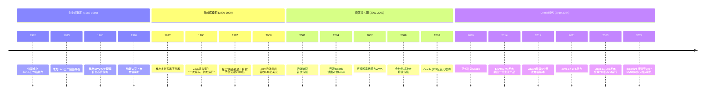
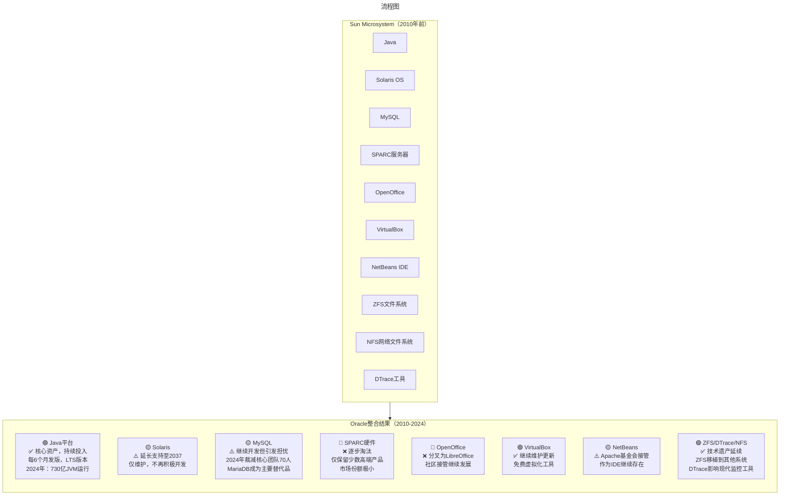

# Sun微系统：太阳升起到陨落的完整史诗（1982-2024）

> **适用范围**：技术管理者、创业者、投资研究者、产品经理及对科技商业史感兴趣的读者；适用于战略复盘、案例研讨与决策参考场景。
>
> **更新摘要（v2 · 2026-08 更新）**：
> - 结构化升级为 6 节骨架（导言 / 核心方法论 / 关键流程 / 工具与实战 / 常见误区 / 进阶延展）
> - 保留全部原文 Mermaid 图、表格、数据与术语英文对照，并为 Mermaid 图补充 frontmatter 与图后解读
> - 将原「参考资料/附录」并入第 6 节「进阶延展」，便于延展阅读

## 1. 导言

> **"网络就是计算机"**（The Network is the Computer）——这句由Sun微系统在80年代提出的口号，不仅预言了云计算时代的到来，更成为这家硅谷传奇公司最持久的技术遗产。从1982年斯坦福校园里的一个工作站项目，到2000亿美元市值的互联网基础设施霸主，再到2010年被Oracle以74亿美元收购——Sun的28年历程，是一部关于技术创新、战略失误与时代变迁的完整史诗。

---

---

## 2. 核心方法论

### 一、创世纪：四个天才的相遇（1982）

#### 1.1 Stanford University Network

很多人以为Sun是"太阳"的意思。实际上，**Sun的全称是Stanford University Network（斯坦福大学网络）**。这个名称本身就揭示了公司的起源。

故事要从1981年说起。当时，斯坦福大学计算机系的研究生**安迪·贝克托斯海姆（Andy Bechtolsheim）**正在为学校的校园网建设设计一台CAD工作站。他受到施乐帕洛阿尔托研究中心（Xerox PARC）Alto电脑的启发，使用摩托罗拉68000处理器和高级内存管理器，手工打造了一台具有划时代意义的工作站。

这台被命名为**Sun-1**的工作站实现了著名的**"三个一百万"指标**：
- 每秒运算100万次指令
- 100万个字节的内存（1MB）
- 100万像素的图形显示器

安迪最初只是想给自己用，但很快发现这个设计的商业潜力。然而，当他试图将硬件设计授权给制造商时，竟然无人问津——这再次证明了一个道理：**在重大机遇面前，大多数人都是看不到的**。

#### 1.2 梦幻创业团队

幸运的是，**维诺德·科斯拉（Vinod Khosla）**看到了机会。这位曾创办EDA软件公司的企业家深知：好的软件需要强大的硬件支撑。他立即怂恿安迪创业，并拉来了自己在斯坦福商学院的同学**斯科特·麦克尼利（Scott McNealy）**。三人撰写了商业计划书，迅速获得了风险资本的支持。

不久之后，第四位创始人加盟——**比尔·乔伊（Bill Joy）**。这位伯克利大学的天才学生是BSD Unix系统的主要开发者，后来成为Solaris操作系统的灵魂人物。

**Sun创始团队的分工：**
- **Vinod Khosla** —— CEO，负责整体战略
- **Scott McNealy** —— 负责制造运营（后接任CEO长达22年）
- **Andy Bechtolsheim** —— 负责硬件设计
- **Bill Joy** —— 负责软件设计与操作系统

这是一个堪称梦幻的创业组合：硬件天才、软件大神、商业精英、运营专家——四人各有所长，完美互补。

#### 1.3 一炮而红

1982年2月24日，Sun Microsystems正式成立。由于Sun-1工作站过于先进，公司一开张就卖得特别好，**第一季度就实现盈利**。

到1983年，Sun已经声名鹊起。它的工作站是除DEC著名VAX小型机外唯一能运行BSD Unix的机器。Sun甚至将技术授权给其他厂商生产，从中赚取授权费用——这种开放策略在当时相当超前。

> 上图展示了关键节点与演进路径，结合正文时间线可直观把握事件因果与战略转折。

---

---

### 二、黄金时代：从工作站到互联网基础设施之王

#### 2.1 SPARC：自己的CPU

Sun发展史上最关键的一步发生在1985年。由于合作伙伴摩托罗拉无法满足Sun对CPU性能和修复bug的速度要求，Bill Joy建议开发自己的处理器。于是，**SPARC（Scalable Processor Architecture，可扩展处理器架构）**诞生了。

SPARC采用当时最先进的RISC（精简指令集）架构，比传统CISC（复杂指令集）处理器快得多。这款自研芯片让Sun在高端计算领域建立了难以撼动的优势，也为后来的企业级服务器业务奠定了基础。

#### 2.2 Solaris：最好的Unix

Bill Joy基于BSD开发的**SunOS**操作系统，后来演化为**Solaris**。在八九十年代，Solaris是最先进的商用Unix系统，以以下特性著称：

- **对称多处理（SMP）**：支持大量CPU并行工作，最多可达上百个
- **卓越的网络能力**：内置TCP/IP协议栈（这在当时很罕见）
- **NFS文件系统**：由Bill Joy亲自设计，让用户可以像访问本地存储一样访问远程文件
- **DTrace动态追踪**：革命性的系统诊断工具

相比之下，当时的Windows NT仅支持4-8个Intel CPU。**Solaris在可扩展性上把Windows甩出了好几条街**。

#### 2.3 工作站时代的霸主

在整个80年代，Sun的主要竞争对手是DEC的小型机和IBM的大型机。Sun的工作站具备接近小型机的性能，但体积更小、价格更低（几万到几十万美元一台）。虽然不便宜，但相比DEC动辄数百万美元的小型机和IBM的大型机，Sun的产品性价比极高。

1986年，成立仅四年的Sun上市。作为一家持续增长超过30%的公司，Sun受到了投资者的疯狂追捧。

#### 2.4 互联网泡沫中的狂欢

90年代后期，Web开始兴起。雅虎、eBay、亚马逊等互联网公司如雨后春笋般涌现。这些公司需要大量的Web服务器，而Sun的服务器凭借Solaris+SPARC的组合，成为了数据中心的首选。

如果你在那个时代走进任何一家大型互联网公司的数据中心，会看到**一层又一层的机架上摆满了Sun的服务器集群**。Sun的营收每年增长50%-60%，员工士气高涨，每个人都觉得自己在改变世界。

1995年，Sun的工程师们又做出了一个改变世界的发明——**Java编程语言**。

---

---

### 三、Java：Sun最伟大的遗产

#### 3.1 诞生的背景

90年代中期，Sun意识到互联网时代需要一种新的编程语言。James Gosling领导的团队开发了Java，核心理念是：**"一次编写，到处运行"（Write Once, Run Anywhere）**。

在互联网时代，软件需要运行在各种不同的硬件和操作系统上。如果每种平台都要单独开发，效率极低。Java通过虚拟机（JVM）机制，实现了真正的跨平台能力。

#### 3.2 与微软的战争

Java的愿景得到了IBM、Oracle、BEA等公司的热烈拥抱。但有一家除外——**微软**。

当时的微软正如日中天，CEO比尔·盖茨敏锐地察觉到Java对Windows生态的威胁。微软试图通过：
- 推出"Visual J++"，在Java中加入Windows专有扩展
- 在Windows中预装过时的Java版本
- 通过各种法律手段阻止Java标准化

这场战争持续了多年。虽然微软的策略短期内奏效了，但从长远看，**Java还是赢了**。

#### 3.3 Java的胜利

今天回头看，Java已经成为世界上最重要的软件开发平台之一：
- 全球有**数百万开发者**
- 运行着超过**730亿个Java虚拟机（JVM）**
- Android系统的应用开发主要使用Java/Kotlin（基于JVM）
- 大数据框架（Hadoop、Spark）、企业级应用（Spring生态系统）都建立在Java之上

微软的.NET虽然在内部很成功，但在微软之外始终无法与Java抗衡。从这个意义上说，**Sun的梦想最终还是实现了**。

但讽刺的是，**Sun发明了Java，却不知道如何用Java赚钱**。你使用Java时，下面可能是Tomcat/WebLogic应用服务器、MySQL/Oracle数据库、Linux操作系统+Intel CPU——这些东西和Sun一毛钱关系都没有！Sun每次宣传Java，最终都会指向它的硬件销售，本质上还是靠硬件盈利。

---

---

### 六、Oracle收购：74亿美元的终局（2010）

#### 6.1 收购过程

2009年4月20日，**Oracle宣布以每股9.50美元的价格收购Sun，交易总额约74亿美元**（扣除现金和债务后约56亿美元）。

这次收购震惊了整个IT行业。业内普遍认为这是一次战略性收购：
- **Java**：全球最大的开发平台之一
- **Solaris**：企业级Unix操作系统
- **MySQL**：最流行的开源数据库（Sun于2008年以10亿美元收购）
- **SPARC服务器**：高端硬件产品线

收购完成后，Oracle成为继IBM之后第二家拥有**全栈能力**的公司：从硬件（服务器）→ 操作系统（Solaris）→ 数据库（Oracle DB + MySQL）→ 中间件 → 应用软件。

#### 6.2 收购后的资产整合

> 上图展示了关键节点与演进路径，结合正文时间线可直观把握事件因果与战略转折。

---

---

### 七、Oracle时代：各资产的命运（2010-2024）

#### 7.1 Java：Oracle最成功的收购资产

**这是Oracle收购Sun最成功的部分。**

在Oracle的管理下，Java迎来了新的黄金时代：

##### 发布节奏革新
- **2017年起**：Oracle将Java改为**每6个月发布一个新版本**（3月和9月）
- **每两年推出一个LTS（长期支持）版本**：Java 11（2018）、Java 17（2021）、**Java 21（2023）**
- 这种快速迭代模式让Java能够更快地引入新特性

##### 技术创新
Java 17和21引入了大量现代化特性：
- **Records**：简化数据类定义
- **Pattern Matching**：模式匹配
- **Sealed Classes**：密封类
- **Virtual Threads（虚拟线程）**：大幅提升并发性能
- **Structured Concurrency（结构化并发）**：Java 21引入的前瞻性功能

##### 生态系统繁荣
根据Oracle官方数据（2024年）：
- 全球有**数百万Java开发者**
- 运行超过**730亿个JVM实例**
- Java仍然是**企业级应用开发的首选语言**
- Android生态系统继续扩大Java的影响力

**评价：Oracle对Java的管理总体上是成功的。** 快速的发布节奏、持续的投入、保持向后兼容性，这些都赢得了开发者的认可。虽然早期有过一些争议（如Oracle JDK的商业化收费），但OpenJDK的开源确保了Java的长期健康发展。

#### 7.2 Solaris：缓慢走向日落

Solaris曾是Sun皇冠上的明珠，但在Oracle手中的命运令人唏嘘：

##### 时间线
- **2010-2017**：Oracle继续发布Solaris 11的更新版本
- **2017年**：发布Solaris 11.4，此后基本停止新功能开发
- **2024年1月**：Oracle宣布**将Solaris 11.4的Extended Support延长至2037年**

##### 现状
- 仅面向现有的Oracle SPARC服务器客户
- 不再积极推广或吸引新用户
- 主要用于运行遗留的企业级应用（特别是金融、电信行业）
- 新项目几乎不会选择Solaris

**评价：Solaris正在成为一个"维持性产品"。** 它的技术遗产（ZFS文件系统、DTrace动态追踪、NFS协议）已经被其他系统吸收，但Solaris本身注定会随着硬件的老化而逐渐消失。

#### 7.3 MySQL：爱与恨的交织

Sun在2008年以10亿美元收购了MySQL，这也是Oracle收购Sun的重要动机之一。

##### Oracle管理下的MySQL
- 继续开发和发布新版本（MySQL 8.0+）
- 性能持续优化（InnoDB引擎改进）
- 引入NoSQL特性（JSON文档存储）
- 云化转型（MySQL Heatwave on AWS/OCI）

##### 社区的担忧
- **2024年突发新闻**：Oracle裁减MySQL核心团队约70人
- MySQL之父**Michael "Monty" Widenius**早在Oracle收购后就离职，创建了**MariaDB**作为MySQL的fork
- MariaDB已成为许多企业和云服务商的首选
- 社区担心Oracle可能逐渐减少对MySQL的投入

**评价：MySQL在Oracle手中仍然活着，但社区信任度下降。MariaDB的成功说明，开源社区的"保险机制"是有效的。**

#### 7.4 SPARC服务器：英雄迟暮

SPARC曾是RISC处理器的代表，但x86的胜利不可逆转：

##### Oracle的策略
- 收购后继续推出新产品（SPARC T系列、M系列）
- **2015年发布SPARC M7**：集成硬件加速的安全特性
- 但市场份额持续萎缩（估计不足1%）
- 主要服务于需要极致可靠性的遗留系统（银行、政府、军事）

##### 最终命运
- **2021年后**：Oracle基本停止SPARC的新品研发
- 现有的SPARC客户逐步迁移到x86或云平台
- Oracle自身也大力推广基于Intel/AMD的x86服务器

**评价：SPARC完成了历史使命。** 它曾经是最好的服务器处理器，但摩尔定律和产业规模效应最终站在了x86这边。这不是技术失败，而是产业规律使然。

#### 7.5 其他资产

| 资产 | 现状 | 说明 |
|------|------|------|
| **OpenOffice** | 已分叉 | 社区创建LibreOffice继续发展 |
| **VirtualBox** | 继续维护 | 免费虚拟化软件，定期更新 |
| **NetBeans** | Apache托管 | 作为Apache项目继续存在 |
| **ZFS** | 广泛移植 | FreeBSD、Linux（通过模块）、macOS均支持 |
| **NFS** | 行业标准 | 仍在广泛使用，已演进到NFSv4 |
| **DTrace** | 技术影响 | 启发了现代APM工具的设计理念 |

---

---

### 八、收购评估：74亿美元值不值？

距离Oracle收购Sun已经过去14年，我们能否给出一个客观的评价？

#### 8.1 从财务角度

- 收购价：**74亿美元**（净价56亿）
- Java带来的间接收益：难以精确估算，但Oracle数据库、中间件与Java的协同效应显著
- 硬件业务的亏损：SPARC服务器线长期亏损，最终基本关停
- **粗略判断：单靠Java就基本回本了**

#### 8.2 从战略角度

**成功之处：**
- ✅ 获得了全球最大的开发平台（Java），强化了Oracle在企业级市场的地位
- ✅ MySQL帮助Oracle在数据库市场形成"高低搭配"（Oracle DB面向高端，MySQL面向中低端）
- ✅ Solaris和SPARC为Oracle提供了完整的软硬一体化解决方案（至少在一段时间内）

**失败/遗憾之处：**
- ❌ 未能挽救Sun的硬件业务，数十亿美元的投资打了水漂
- ❌ OpenOffice的流失（分叉为LibreOffice）
- ❌ MySQL社区信任度受损，催生了强有力的竞争对手MariaDB
- ❌ 未能有效利用Sun的创新文化，许多顶尖人才离职

#### 8.3 总体结论

**Oracle收购Sun是一次"部分成功"的战略举措。**

Java的价值无可争议，这笔账算得过来。但Oracle更像是一个"收割者"而非"培育者"——它擅长将成熟资产变现，却未能延续Sun那种激进的创新文化。14年过去，Sun的名字已经从产品上消失，但它的技术遗产仍在深刻影响着今天的IT世界。

---

---

### 九、人的去向：创始人及知名员工的后续

#### 9.1 四位创始人

| 创始人 | Sun期间角色 | 后续去向 |
|--------|------------|---------|
| **Vinod Khosla** | 首任CEO（1982-1984） | 著名风险投资家，创立Khosla Ventures，投资清洁能源、AI等领域 |
| **Scott McNealy** | CEO（1984-2006），董事长（2006-2010） | 继续担任多家公司董事，投资教育和科技初创企业 |
| **Andy Bechtolsheim** | 联合创始人，首席硬件设计师 | 1995年联合创立 Granite Systems；2001年重返Sun；**1998年向Google投资10万美元**（这张支票现在价值数十亿美元）；后联合创立Arista Networks（数据中心网络设备公司） |
| **Bill Joy** | 联合创始人，首席科学家 | 2003年离开Sun；成为风险投资家（Kleiner Perkins）；专注于清洁技术和人工智能研究 |

#### 9.2 从Sun走出的科技巨星

Sun不仅仅是一家公司，它更像是一所**"硅谷黄埔军校"**。以下是部分从Sun走出的知名人物：

##### 科技公司领袖
- **萨提亚·纳德拉（Satya Nadella）**：微软现任CEO（2014年至今），曾在Sun工作
- **埃里克·施密特（Eric Schmidt）**：Google前CEO（2001-2011）、董事长，曾在Sun工作，参与Lex开发
- **庄思浩（Alfred Chuang）**：BEA Systems创始人兼CEO（后被Oracle收购）
- **克里斯·马拉科夫斯基（Chris Malachowsky）**：NVIDIA联合创始人

##### 开源与技术先驱
- **詹姆斯·邓肯·戴维森（James Duncan Davidson）**：Tomcat（Java Web服务器）作者
- **马克·弗勒里（Marc Fleury）**：JBoss（Java应用服务器）创始人
- **乔舒亚·布洛克（Joshua Bloch）**：《Effective Java》作者，Java集合框架设计师
- **拉尔斯·巴克（Lars Bak）**：Java HotSpot VM作者，后来设计了V8 JavaScript引擎（Chrome浏览器）
- **布伦丹·格雷格（Brendan Gregg）**：DTrace首席布道师，性能优化专家
- **惠特菲尔德·迪菲（Whitfield Diffie）**：图灵奖得主，公钥密码学先驱
- **鲍勃·谢夫勒（Bob Scheifler）**：X Window System领导者

**这些名字本身就是一部IT史。** 从操作系统到编程语言，从数据库到图形界面，从密码学到电子邮件——Sun的人才遍布 computing 的每一个重要领域。

---

---

### 十、Sun的文化遗产：为何让人念念不忘？

#### 10.1 工程师天堂

在许多前Sun员工口中，Sun是**"最好的公司"**、"old good days"。原因何在？

**极度重视工程师文化：**
- 技术人员可以做主，只要把工作搞定，没人干涉你怎么做
- 冒险会得到奖励，失败不会受到惩罚
- 前所未有的创新氛围
- 福利待遇极佳（类似今天的Google）

**这种文化的双刃剑效应：**
- ✅ 产生了伟大的技术创新（SPARC、Solaris、Java、NFS、ZFS...）
- ❌ 技术人员根据自己的"品味"创造产品，缺乏市场导向
- ❌ 缺乏像比尔·盖茨那样"商业+技术"的双料领袖来整合资源

#### 10.2 开源精神的先行者

Sun在开源运动中扮演了复杂但重要的角色：

**早期的矛盾态度：**
- Java最初并非真正开源（Sun控制着兼容性认证）
- Solaris长期闭源，直到2005年才发布OpenSolaris
- 这种"半开放"策略受到自由软件社区的批评

**后期的转变：**
- 2006年：Java在GPL v2下开源（OpenJDK）
- 2005年：Solaris开源（OpenSolaris， CDDL许可证）
- 2008年：收购MySQL，拥抱开源数据库

**遗产：**
- OpenJDK成为Java的事实标准
- ZFS、DTrace等技术被广泛移植到其他系统
- OpenOffice → LibreOffice的开源传承

#### 10.3 "网络就是计算机"的预言

Sun在80年代提出的这句口号，在当时听起来像是营销噱头。但今天回看，**这简直是对云计算最精准的预言**。

- **网络即平台**：AWS、Azure、Cloudflare验证了这个理念
- **瘦客户端**：Chromebook、Web App、移动端App
- **软件即服务（SaaS）**：Salesforce、Google Workspace、Office 365
- **API经济**：RESTful API、微服务架构

Sun没能活到享受云计算红利的那一天，但它播下的种子，已经在整个行业中开花结果。

---

---

## 3. 关键流程

（本节内容在原文中较为简略，可结合第 2、3、4 节相关段落交叉理解。）

---

## 4. 工具与实战

（本节内容在原文中较为简略，可结合第 2、3、4 节相关段落交叉理解。）

---

## 5. 常见误区

### 四、危机潜伏：两个看不见的敌人

#### 4.1 Windows NT + Intel的崛起

90年代初，两股力量正在悄然崛起：

**第一，微软的Windows NT。** 这款由前DEC内核大神David Cutler领导开发的操作系统，首次让PC具备了企业级组网能力。它支持多用户、多任务、网络功能，稳定性远超之前的Windows版本。HP、IBM、Compaq等巨头纷纷采用Windows NT制造低端服务器。

**第二，Linux的成熟。** 芬兰大学生林纳斯·托瓦兹（Linus Torvalds）于1991年创建了Linux内核，并将其开源。这种跨国界协作的开发模式展现了惊人的活力。更重要的是，**IBM看到了Linux对付Sun的价值**。

IBM虽然被Sun在小型机市场甩出几条街，但它做了一个极具远见的决定：**投资10亿美元支持Linux开发**，并向开源社区贡献代码。到2001年以后，Linux作为服务器的性能已经与低端Sun工作站相差无几。

#### 4.2 Sun的战略盲区

为什么Sun没有及时应对这两个威胁？

**原因一：注意力偏差。** Sun当时正忙于蚕食DEC和IBM的大型机/小型机市场，利润丰厚，增长迅速。相比之下，PC服务器挖走的只是"九牛一毛"的低端市场。

**原因二：技术傲慢。** Sun的硬件和软件确实强大，完全不是PC+Windows NT/Linux可以匹敌的。在Sun看来，这些"蚍蜉"怎么可能撼动大树？

**原因三：量变引起质变的误判。** Sun忽略了一个致命事实：**它在努力占领的市场是一个不断萎缩的市场**。总有一天，传统小型机和大型机会退出历史舞台，届时Sun将无地可耕。

当.com泡沫在2000年破灭时，一切都变了。无数互联网公司破产，幸存者也"勒紧裤腰带"。他们发现：**廉价的Intel PC + 免费的Linux，完全可以替代昂贵的Sun服务器**。Google就是最杰出的榜样——它用成千上万台普通PC组建了庞大的Linux集群。

---

---

### 五、漫长的衰落（2001-2009）

#### 5.1 首次亏损

2001年，伴随.com泡沫破裂，Sun的订单大规模萎缩，**第一次出现亏损**。营收从183亿美元的峰值断崖式下跌。

如果是正常的周期调整，几年后应该能恢复。但Sun不仅没有走出低谷，反而每况愈下。

#### 5.2 错失的反击时机

Sun领导人终于意识到了问题，决定**开放Solaris源代码**（2005年发布OpenSolaris），试图与Linux正面竞争。

这个策略如果放在90年代执行，可能真的没有Linux什么事了。但等到2005年，Linux经过IBM多年的培育已经茁壮成长，此时开放Solaris，**为时已晚**。

#### 5.3 最后的挣扎

Sun尝试了各种自救措施：
- 多次更换CEO（Jonathan Schwartz接替McNealy）
- 大规模裁员
- 出售资产和地产
- 将股票代码从SUNW改为JAVA（象征Java是最后的希望）

这些措施带来了一段短暂的盈利时光，但根本问题没有解决。

#### 5.4 2008年的最后一击

2008年金融危机来袭时，Sun的底子已经不是2000年那个庞然大物了，而是一个千疮百孔的烂摊子。投资者再也无法忍受持续亏损，Sun的命运已成定局。

---

---

### 十一、历史的教训：Sun为何衰落？

#### 11.1 表面原因 vs. 深层原因

**表面上看**，Sun败给了：
- Intel x86处理器的摩尔定律
- Linux免费且不断改进
- Windows NT的企业级进化
- .com泡沫破裂的经济打击

**深层来看**，Sun败给了自己：

1. **战略盲区**：在高速增长期未能识别真正的竞争对手
2. **商业模式僵化**：过度依赖硬件销售，未能将Java等软件资产有效货币化
3. **文化陷阱**：工程师文化导致忽视市场营销和商业模式创新
4. **时机错误**：反击动作太晚（开源Solaris应在90年代而非00年代）

#### 11.2 如果Sun还活着...

这是一个有趣的思维实验。如果Sun没有被收购，而是成功转型：

- 可能会成为今天的"红帽"（Red Hat）：专注企业级开源解决方案
- 或者成为另一个"VMware"：虚拟化和云计算基础设施提供商
- 甚至可能提前布局公有云，与AWS竞争

但历史没有如果。**Sun的故事告诉我们：即使你拥有世界上最先进的技术，如果不能适应市场变化，依然会被淘汰。**

---

---

## 6. 进阶延展

### 十二、结语：太阳落下，光芒永存

2024年，距离Sun被Oracle收购已经过去了14年。

**Sun作为一个独立的公司已经消失了**，但它的遗产无处不在：
- 当你在手机上运行Android应用时，Java虚拟机在工作
- 当你使用ZFS保护数据时，那是Sun文件系统的后代
- 当你通过NFS访问远程文件时，那来自Sun的发明
- 当你在Linux/macOS上使用DTrace排查问题时，灵感来自Sun
- 当你看到"Write Once, Run Anywhere"的理念时，那是Sun的梦想

**Sun的四大创始人也各自精彩：** Khosla成为顶级投资人，McNealy继续商业探索，Bechtolsheim靠Google投资获得惊人回报后又创办了Arista，Joy则在思考人类与机器的未来。

**从Sun走出的那些人，正在塑造今天的科技世界：** 微软CEO纳德拉、Google前CEO施密特、Nvidia联合创始人马拉科夫斯基......他们的基因里都有Sun的烙印。

**Sun的文化也在延续：** 对工程师的尊重、对创新的追求、对开源的拥抱——这些价值观已经融入了硅谷的DNA，影响着一代又一代的科技公司。

Sun微系统，1982-2010，享年28岁。

它像一颗超新星，燃烧得异常耀眼，然后在最辉煌的时刻轰然坍塌。但它的光芒穿越时空，至今仍照亮着我们每天使用的数字世界。

**太阳落下，但从未真正消失。**

---

---

### 参考资料

1. Sun官方历史档案及公开财务报告
2. Oracle收购公告（2009年4月20日）
3. Oracle Java官方文档及统计数据（2024）
4. The Register: "Oracle extends Solaris support to 2037"（2024年1月）
5. CSDN/搜狐等中文技术社区分析文章
6. James Gosling访谈录（关于Oracle收购后的内幕）
7. Andy Bechtolsheim访谈及演讲记录
8. 各种公开的Sun前员工访谈和回忆录

---

*本文合并重写自原《142-Sun：太阳的升起》和《143-Sun：太阳的陨落》，并补充了截至2024年的最新信息。*

---

*v2 结构化升级版 · 文件名保持不变：042-Sun微系统太阳升起到陨落的完整史诗-【更新版】.md*