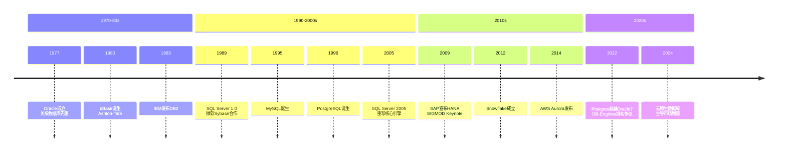
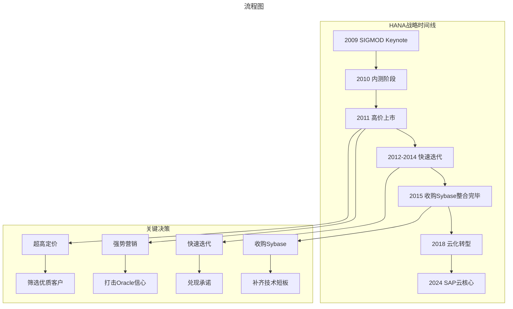
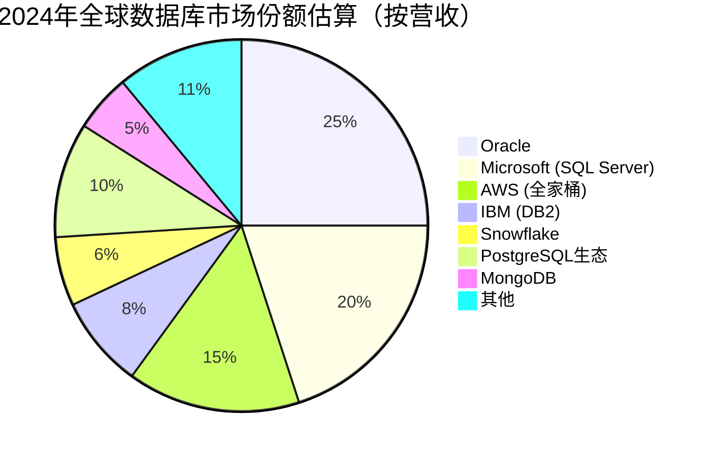

# SAP HANA与数据库王座之争

> **适用范围**：技术管理者、创业者、投资研究者、产品经理及对科技商业史感兴趣的读者；适用于战略复盘、案例研讨与决策参考场景。
>
> **更新摘要（v2 · 2026-08 更新）**：
> - 结构化升级为 6 节骨架（导言 / 核心方法论 / 关键流程 / 工具与实战 / 常见误区 / 进阶延展）
> - 保留全部原文 Mermaid 图、表格、数据与术语英文对照，并为 Mermaid 图补充 frontmatter 与图后解读
> - 将原「参考资料/附录」并入第 6 节「进阶延展」，便于延展阅读

## 1. 导言

> **一个做ERP的德国公司，凭什么敢挑战数据库霸主Oracle？答案是：被逼急了的兔子会咬人。而这场"咬人"不仅改变了SAP的命运，更引发了持续十余年的数据库世界大战——从内存到云原生，从闭源到开源，战火至今未熄。**

---

### 引言：数据库领域的权力游戏

数据库是IT基础设施的基石。过去五十年间，这个领域见证了无数帝国的兴衰：

- **1960-1980s**：IBM System R、IMS称霸大型机时代
- **1980-1990s**：Oracle崛起，关系数据库一统天下
- **1990-2000s**：SQL Server追赶，MySQL/PostgreSQL诞生
- **2010s**：SAP HANA引发内存数据库革命，NoSQL百花齐放
- **2020s**：云原生数据库（Snowflake、Aurora、TiDB）崛起，PostgreSQL生态爆发

本文将围绕几个核心案例，深入剖析数据库领域的竞争逻辑：
1. **SAP HANA**：ERP厂商的绝地反击
2. **SQL Server**：微软的逆袭之路
3. **Ashton-Tate/dBase**：桌面数据库王者的兴衰教训
4. **Sun公司**：太超前与看错敌人的双重悲剧
5. **2024年格局**：Oracle vs Microsoft vs AWS vs Snowflake vs PostgreSQL



> 上图展示了关键节点与演进路径，结合正文时间线可直观把握事件因果与战略转折。

---

## 2. 核心方法论

### 第一部分：SAP HANA——被逼出来的革命

#### 1.1 SAP的困境：寄人篱下的滋味不好受

SAP是全球最大的ERP（企业资源计划）软件公司，总部位于德国。在2000年代，SAP风光无限：
- 全球500强企业中80%以上使用SAP
- 年营收超过100亿欧元
- 在企业应用软件领域处于绝对领导地位

**但SAP有一个致命弱点：它的软件必须跑在别人的数据库上。**

| 数据库供应商 | 与SAP的关系 | 问题 |
|-------------|-----------|------|
| **Oracle** | 主要合作伙伴 | ⚠️ Oracle开始进军企业软件，直接竞争！ |
| **IBM DB2** | 备选方案 | ❌ 产品竞争力不足，人才流失严重 |
| **Microsoft SQL Server** | 中小企业市场 | ⚠️ 市场定位不匹配 |

**最致命的威胁来自Oracle**：
- 21世纪初，Oracle进行了一系列收购：Siebel、仁科（PeopleSoft）等
- Oracle从底层数据库到上层企业软件，形成了完整的产品线
- **SAP的客户可能同时是Oracle的客户，但Oracle可以"端到端"推销**
- SAP在谈判中越来越被动

**用一句话概括SAP的处境**：你的命根子握在竞争对手手里。

#### 1.2 2009年SIGMOD大会：HANA横空出世

2009年，数据库顶级会议SIGMOD在美国罗德岛召开。

令人大跌眼镜的是，今年的金主赞助商竟然是**SAP**——一家做企业应用软件的公司。更令人震惊的是，SAP董事会主席兼创始人之一**哈索·普拉特纳（Hasso Plattner）** 给出了Keynote演讲：

> **"A Common Database Approach for OLTP and OLAP Using An In-memory Column Database"**
> （使用内存列式数据库统一事务处理和分析处理）

HANA = High-Performance Analytic Appliance（高性能分析设备）

**这标志着SAP正式进军数据库市场。一个"做菜高手"要开始"杀鸡"了。**

#### 1.3 HANA的技术创新（五大突破）

##### 突破一：列式存储 + 事务处理

传统数据库采用行式存储（Row-based），数据仓库才用列式存储（Column-based）。HANA大胆地选择了列式存储，同时支持高并发的事务处理。

**为什么这是颠覆性的？**
- 列式存储对分析查询极快（只需读取相关列）
- 但传统上列式存储不适合事务处理（单行操作效率低）
- HANA通过技术创新解决了这个矛盾
- **实现了HTAP（Hybrid Transactional Analytical Processing）**

##### 突破二：全内存架构

HANA做了一个极其大胆的假设：**把所有数据都放在内存里**。

**2009年这个假设有多疯狂？**
- 内存价格昂贵（DDR3约$20/GB）
- 企业级TB级数据量意味着数万美元的内存成本
- 传统数据库都是磁盘+缓存的混合架构

**但HANA赌对了**：
- 半导体产业发展迅速，内存价格持续下降
- SSD普及后，内存相对成本更低了
- 企业愿意为性能提升付费

**效果惊人**：
- Oracle或DB2需要跑一天的报表查询
- HANA只需要**3秒钟**
- 当然，这是精心挑选的Demo，但确实震撼

##### 突破三：无需ETL的数据集成

传统架构下：
```
业务系统(OLTP) → ETL工具 → 数据仓库(OLAP) → 报表/分析
```

**问题**：
- ETL过程耗时（通常T+1）
- 数据存在延迟
- 需要维护两套系统

**HANA的方案**：
```
业务系统 + 分析查询 → 统一在HANA中完成
```

**优势**：
- 无需ETL，实时分析
- 数据永远是最新的
- 降低总体拥有成本

##### 突破四：深度业务集成

HANA几乎完整地整合了R语言的功能，并将SAP业务相关的计算直接在数据库内部实现。

**反封装的设计哲学**：
- 传统做法：数据库只存数据，业务逻辑在应用层
- HANA的做法：让计算离数据更近
- **在内存数据库环境下，这种设计效率极高**

##### 突破五：Shared-nothing架构

HANA采用了现代数据库常用的Shared-nothing（无共享）架构：
- 数据按主键纵向切分
- 每台机器负责自己的分片
- 加机器就能线性扩展
- 配置灵活，从小型到超大规模都能支持

#### 1.4 HANA的商业策略："心黑胆肥"

技术只是基础，HANA真正精彩的是其商业实施策略。用四个字概括：**心黑胆肥**。

##### 策略一：超高定价塑造高端形象

**定价策略**：
- 软件最低配置：**30万美元起**
- 硬件要求：64GB内存起步（通常需要更多）
- 目标客户：只服务"人傻钱多"的大型企业
- 典型客户：中国石油、中国石化、德国电信等

**为什么定高价？**
1. 让关注点集中在价格上（而非产品缺陷）
2. 获得优质客户和源源不断的现金流
3. 塑造"高大上"的品牌形象
4. 限制用户数量，减少Bug暴露机会

**效果**：全球大量有钱的企业从Oracle转向HANA。

##### 策略二：强势营销打击对手

SAP宣传HANA时，直接对标Oracle：
- "HANA是基于最新硬件和研究的新一代数据库"
- "Oracle是已经存在了很多年的老朽的东西"
- "HANA代表未来，Oracle代表过去"

**这种宣传的效果出奇的好**：
- 中国石油这样的客户就要"最新、最贵"
- 各地大企业排队从Oracle转到HANA
- **Oracle第一次感到了真正的威胁**

##### 策略三：先吹牛再兑现

SAP的发布节奏堪称教科书：
- 每次都先发布半成品新功能
- 文档中大肆吹嘘功能有多牛
- 实际上Bug一堆
- 但每半个月到一个月就发新版
- 迅速修复前版的重大问题

**典型案例**：2011年HANA连High Availability（高可用性）都没有，居然就开吹"HANA不需要HA"。用户们竟然信了！

**但关键是**：SAP最终都把吹过的牛给兑现了。
- 4年发布了80个版本
- 半年前和半年后的HANA简直不是同一个软件
- **这种"超前承诺+快速交付"的策略非常成功**

##### 策略四：全公司All-in HANA

SAP从最高层到基层，一切以HANA为最高优先级：
- 销售部门：业绩重点看HANA卖了多少
- 开发部门：新功能必须先支持HANA
- 市场部门：所有宣传围绕HANA
- **没有HANA能不能跑？不是必要条件**

##### 策略五：秘密收购Sybase补短板

SAP清楚地知道自己"跛脚"：传统数据库技术积累薄弱。

**秘密行动**：SAP悄悄收购了日子不好过的老牌数据库公司Sybase。
- Sybase有数十年数据库技术积累
- 虽然产品卖得不好，但技术底子深厚

**收购后的整合**：
- 用Sybase的技术实现冷数据存磁盘（降低成本）
- 集成Sybase Replication Server实现实时备份
- 补齐了HANA的关键短板

**这是一步险棋**：成功了如虎添翼，失败了前功尽弃。显然，SAP赌赢了。

#### 1.5 HANA的历史地位与现状

**成功标志**（2015年前后）：
- HANA成为各方面领先的内存数据库
- 即使Oracle也无法撼动
- SAP成功实现战略转型
- **堪称商业教科书的经典案例**

**2024年的HANA**：
- 已成为SAP云战略的核心（SAP S/4HANA Cloud）
- 支持企业级的各种工作负载
- 与AWS、Azure、GCP等云平台深度集成
- 但面临云原生数据库的激烈竞争



> 上图展示了关键节点与演进路径，结合正文时间线可直观把握事件因果与战略转折。

---

---

### 第二部分：SQL Server——微软的逆袭之路

#### 2.1 与Sybase的蜜月期（1987-1994）

SQL Server的故事始于微软与Sybase的合作：

**合作协议（1987）**：
- 共同开发基于Sybase技术的数据库产品
- Sybase拥有Unix平台的发布权
- 微软拥有OS/2及未来Windows系统的发布权

**早期分工**：
- Sybase：负责所有源代码开发
- 微软：负责测试，偶尔修Bug
- 微软最初只有源代码的**只读权限**

**与Ashton-Tate的合作插曲**：
- 为了吸引dBase开发者，计划提供dBase接口
- 1989年Ashton-Tate发布dBase IV失败，合作终止
- SQL Server 1.0于1989年发布（取消了dBase接口）

#### 2.2 分道扬镳（1992-1994）

**转折点**：微软将SQL Server移植到Windows NT

**关键分歧**：数据库应该多依赖操作系统？

| 选择方 | 策略 | 优点 | 缺点 |
|--------|------|------|------|
| **Sybase** | 自主实现所有功能 | 跨平台、独立性强 | 效率较低 |
| **微软** | 充分利用NT特性 | 效率高、开发快 | 绑定Windows |

**微软的选择**：利用Windows NT的新特性，深度绑定操作系统。

**结果**：
- SQL Server在Windows NT上的运行效率大幅提升
- 但代码不再跨平台
- 1994年，双方"和平分手"

#### 2.3 微软的黄金时代（1994-2005）

分手后的18个月内，微软重写了大量代码：

**关键里程碑**：

| 版本 | 年份 | 重大改进 |
|------|------|---------|
| **SQL Server 6.0** | 1995 | 大规模代码重写 |
| **SQL Server 6.5** | 1996 | 进一步优化 |
| **SQL Server 7.0** | 1998 | **全面重写！** 存储引擎、数据处理引擎全部重构 |
| **SQL Server 2000** | 2000 | 分布式部署、数据挖掘、XML支持 |
| **SQL Server 2005** | 2005 | SQLCLR（.NET集成）、重大架构升级 |

**SQL Server 7.0的意义**：
- 奠定了微软SQL Server的根基
- 增加了数据仓库支持（收购Panorama公司）
- MDX成为数据仓库标准查询语言
- 增加了ETL支持

**人才引进**：
微软财大气粗，挖来了大量业界顶尖人才：
- **Jim Gray**（图灵奖得主，数据库事务处理专家）
- **Phil Bernstein**（事务处理权威）
- **David Campbell**（存储引擎专家）
- **Peter Spiro**（查询优化专家）

有些人不愿来西雅图，**比尔·盖茨专门在硅谷为他们建办公室**。

#### 2.4 WinFS之殇：眼光决定一切

SQL Server蒸蒸日上之时，比尔·盖茨提出了一个极其宏大的项目：**WinFS**（Windows File System）。

**愿景**：
- 基于数据库的新一代文件系统
- 提供先进的数据存储和查询能力
- 将彻底改变用户管理文件的方式

**现实**：
- 投入了无数人力物力
- 愿景超出当时的技术能力
- **最终完全失败，项目取消**

**影响**：
- 浪费了大量资源（本可用于SQL Server研发）
- SQL Server核心人员被抽调
- 导致SQL Server后续版本进展缓慢
- 很多人认为这是**微软走向衰败的转折点之一**

**核心教训**：
> **眼光决定一切。走在正确的道路上，最多走得慢一点；走在错误的道路上，走得越快，死得越快。**

#### 2.5 SQL Server的现状（2024）

**市场地位**：
- 2017年超越IBM DB2，成为**全球第二大数据库**（仅次于Oracle）
- 在Windows生态中占据绝对统治地位
- 近年来向Linux和云平台扩展

**云化转型**：
- **Azure SQL Database**：云原生关系数据库
- **SQL Server on Azure VMs**：IaaS模式
- **Azure Synapse Analytics**：数据仓库（原SQL DW）
- **Azure Cosmos DB**：多模型NoSQL数据库

**最新动态**：
- 支持Linux容器化部署
- 集成AI能力（Azure OpenAI Service）
- 与GitHub Copilot集成辅助开发

---

---

### 第四部分：Sun公司的悲剧——太超前+看错敌人

#### 4.1 太超前好不好？

Sun公司在2000年前后提出了**云计算的概念**：
> **"未来的计算资源应该像水电一样，开起来就能用，用多少付多少钱。"**

这个想法今天看来稀松平常，但在2000年却被人嘲笑。

**Sun的问题**：
- 概念太超前（硬件和网络都不成熟）
- 只提概念，没有投入足够研发去落地
- 没有找到可行的商业模式
- **最终Sun没有成为云计算巨头，亚马逊成了**

**对比Salesforce**：
- 同样在1999年提出"SaaS取代传统软件"
- 选定了CRM这个具体领域深耕
- 踏踏实实做产品、打市场
- **活下来了，而且越做越大**

**结论**：
> **太超前不一定是坏事，但要结合具体领域落地，并具备盈利能力。空谈概念必死无疑。**

#### 4.2 看错敌人多可怕

Sun公司的产品定位一直模糊：
- 不像大型机、小型机那么昂贵
- 又比个人计算机贵得多、强大得多
- **本质上是从大型机/小型机到个人计算机之间的过渡产品**

**Sun犯的最大错误**：**始终没有把个人计算机当回事。**

**如果Sun早意识到自己是"另一种PC"**：
- 可以用Solaris操作系统占领PC市场
- 可以阻止Windows NT和Linux的崛起
- 可以在服务器和客户端两端获利
- **但Sun完全没有意识到这个威胁**

**Sun的注意力在哪里？**
- 与IBM、HP的大型机/小型机战斗
- 这些其实是**正在陨落的市场**
- 完全忽视了PC市场的崛起
- **等到发现时已经来不及了**

**结局**：
- 2000年互联网泡沫破裂，Sun遭受重创
- 2008年金融危机，Sun彻底撑不住了
- 2009年被Oracle收购
- **曾经的工作站之王，就此消失**

**核心教训**：
> **看错了敌人，等待你的就只有灭亡。一定要搞清楚：谁才是你真正的竞争对手？直接的对手未必是真正的敌人。**

---

---

### 第五部分：2024年数据库市场格局

#### 5.1 DB-Engines排名风云

**2024-2025年的戏剧性变化**：

根据DB-Engines（全球数据库排名权威网站）的数据：

| 时间 | 排名前三 | 备注 |
|------|---------|------|
| 2024年初 | Oracle, MySQL, PostgreSQL | 传统格局 |
| 2024年中 | PostgreSQL增长迅猛 | 年度增长率+5.50% |
| 2025年1月（修正） | **Snowflake, PostgreSQL, Oracle** | 震动业界！ |
| 2025年后 | Oracle反弹回前三 | 排名方法争议 |

**重要说明**：DB-Engines在2024年5月被Redgate收购后，排名方法引发了广泛争议。Snowflake和PostgreSQL的"登顶"很大程度上是因为排名算法调整，而非实际市场份额变化。[1][2]

**更客观的市场格局（2024）**：

#### 5.2 传统数据库三巨头的现状

##### Oracle：老霸主的防守战

**优势**：
- 企业级数据库市场仍占最大份额（尤其是金融、电信）
- Autonomous Database（自治数据库）云产品线完善
- Exadata一体机依然强劲
- 多模态支持（关系型+JSON+XML+空间数据）

**挑战**：
- 云市场竞争激烈（AWS Aurora、Azure SQL、Cloud Spanner）
- 开源数据库侵蚀低端市场
- 许可费用高昂，客户寻求替代方案
- **DB-Engines排名显示增长率为负（-20.39%）** [3]

**最新动向**：
- 加强云原生转型（OCI云服务）
- 推出HeatWave（MySQL兼容的OLAP引擎）
- AI集成（Oracle 23c AI特性）

##### Microsoft SQL Server：稳健的老二

**优势**：
- Windows生态绝对统治地位
- Azure SQL Database快速增长
- 与Office、Dynamics 365深度集成
- 价格相对Oracle更有竞争力

**挑战**：
- Linux/开源生态渗透
- PostgreSQL在企业市场崛起
- 云原生数据库分流

**最新动向**：
- 全面支持Linux容器
- Azure Synapse Analytics（数据湖仓一体化）
- Fabric平台（统一数据分析平台）

##### IBM DB2：日渐边缘化

**现状**：
- 市场份额持续下滑
- 主要保留在大型机、金融核心系统
- 云化转型迟缓
- **已被SQL Server、PostgreSQL超越**

#### 5.3 云原生数据库的崛起

##### Snowflake：数据云的明星

**特点**：
- 原生云架构（Separation of Storage and Compute）
- 按需付费（用量计费）
- 支持多云部署（AWS、Azure、GCP）
- 数据共享 marketplace

**近年动态** [4]：
- 2023-2024年先后收购Neeva（AI搜索）、Mobilize.NET、TruEra（AI可观测）、Datavolo（数据工程）等公司，扩展数据云与AI生态
- **进入DB-Engines排名前六**
- 注：Postgres公司Crunchy Data于2025年被Databricks收购（约2.5亿美元），与Snowflake无关

**市值/估值**：波动较大，但仍是全球最具价值的纯数据库公司之一

##### AWS数据库家族

| 产品 | 定位 | 特点 |
|------|------|------|
| **Aurora** | 云原生关系数据库 | 兼容MySQL/PostgreSQL，性能提升5倍 |
| **DynamoDB** | NoSQL键值存储 | 无服务器、自动扩缩容 |
| **Redshift** | 数据仓库 | PB级、列式存储 |
| **DocumentDB** | 文档数据库 | 兼容MongoDB API |
| **Keyspaces** | 兼容Cassandra | 托管NoSQL |
| **Timestream** | 时序数据库 | IoT场景 |

**AWS已成为数据库产品线最全面的云厂商。**

##### Azure SQL Family

| 产品 | 定位 |
|------|------|
| **Azure SQL Database** | PaaS关系数据库 |
| **SQL Server on Azure VMs** | IaaS |
| **Azure Cosmos DB** | 多模型NoSQL |
| **Azure Synapse** | 数据分析平台 |
| **Azure Database for MySQL/PostgreSQL** | 托管开源数据库 |

#### 5.4 PostgreSQL生态的爆发

**PostgreSQL为何崛起？**

| 优势 | 说明 |
|------|------|
| **开源免费** | 无许可费用，社区活跃 |
| **功能强大** | 支持复杂查询、JSON、GIS、全文检索 |
| **可扩展性好** | 支持插件、自定义类型 |
| **合规友好** | 满足政府、金融的开源要求 |
| **云支持好** | 所有主流云都提供托管PG服务 |

**2024年的PostgreSQL生态**：

**云托管服务**：
- Amazon RDS for PostgreSQL / Aurora PG兼容
- Azure Database for PostgreSQL
- Google Cloud SQL for PostgreSQL
- Supabase（开源Firebase替代品）
- Neon（Serverless PG）
- Crunchy Data（企业级PG平台，已被Snowflake收购）

**衍生数据库**：
- TimescaleDB（时序）
- CitusData（分布式，已被微软收购）
- CockroachDB（NewSQL，分布式）
- Yugabyte（分布式SQL）

**DB-Engines数据** [3]：
- PostgreSQL年度增长率+5.50%，领涨全榜
- 是唯一仍在使用操作系统页面缓存的主流数据库
- 社区贡献者数量持续增长

#### 5.5 2024年数据库市场全景图



**关键趋势**：
1. **云原生 > 本地部署**：新增 workload 绝大多数在云端
2. **开源 > 闭源**：PostgreSQL、MongoDB快速增长
3. **专用 > 通用**：时序、图、向量数据库各领风骚
4. **AI驱动**：向量数据库（Pinecone、Milvus、pgvector）爆发
5. **多云 > 单云**：避免vendor lock-in成为刚需

---

---

## 3. 关键流程

（本节内容在原文中较为简略，可结合第 2、3、4 节相关段落交叉理解。）

---

## 4. 工具与实战

（本节内容在原文中较为简略，可结合第 2、3、4 节相关段落交叉理解。）

---

## 5. 常见误区

### 第三部分：Ashton-Tate——桌面数据库王者的兴衰

#### 3.1 dBase的辉煌岁月

**Ashton-Tate公司**由George Tate和Hal Lashley于1980年创立。

他们从NASA喷气推进实验室（JPL）的Wayne Ratliff那里拿到了Vulcan程序的授权，改名为**dBase**对外发售。

**dBase的核心组件**：
- 数据库引擎
- 查询引擎
- 报表引擎
- **dBase Language**（一种编程语言，不是SQL）

**为什么dBase如此受欢迎？**
1. **解释执行**：开发调试方便，实时测试
2. **语言简单易学**：有点编程经验就能上手
3. **功能强大**：可以直接开发应用程序
4. **Runtime版本**：开发者可以将应用程序打包出售

**市场地位**：
- 1982年随IBM PC发布，迅速成为最受欢迎的程序之一
- **PC机软件前三名**：Lotus 1-2-3、WordPerfect、dBase
- 1983年IPO上市，成为名副其实的桌面数据库统治者

#### 3.2 致命的错误（1984-1988）

##### 错误一：偷懒导致技术债

**dBase III的重大改变**：
- 从汇编语言改为C语言开发（为了可移植性）
- **但用了自动翻译工具把汇编转成C**
- 结果：C代码可读性和可维护性极差
- **埋下了巨大的技术债务**

##### 错误二：忽视向后兼容性

不同版本的dBase：
- 语言大体相似但不完全兼容
- 用户升级需要修改应用程序
- **这对用户来说是不可接受的**

##### 错误三：目光短浅，拒绝创新

**编译器的缺失**：
- 用户反复要求增加编译器（提高执行效率）
- 竞争对手（FoxBase、FoxPro）都有编译器
- Ashton-Tate一直拖延不开发
- **原因：代码混乱，在上面开发编译器很困难**

##### 错误四：食言而肥

**dBase IV（1988）——终结者版本**：
- ❌ 许诺的编译器没有交付
- ❌ 向后兼容性更差了
- ❌ 执行效率比竞品差，比自己的III版也差
- ❌ 开发匆忙，无数Bug
- **这是一个半成品**

#### 3.3 迅速崩塌（1988-1991）

**后果**：
- 市场占有率从63%暴跌至43%（其中很多还是老版本用户）
- 客户大量流失到FoxPro、Paradox等竞品
- 公司亏损，大规模裁员
- 影响后续版本开发
- 稳定版dBase IV 1.1直到1990年才发布，为时已晚

**被收购**：
- Ashton-Tate试图卖公司
- 令人大跌眼镜：**被Borland收购**
- Borland自己就有竞品Paradox
- 收购后两个产品左右互搏，双双衰落
- 最终被微软的Access和FoxPro彻底击败

#### 3.4 核心教训：无敌不可以肆意妄为

**Ashton-Tate为什么会失败？**

| 失败原因 | 具体表现 |
|---------|---------|
| **向后兼容性差** | 升级即痛苦，用户逃离 |
| **技术债累积** | 偷懒用工具转代码，无法维护 |
| **忽视市场需求** | 用户要编译器，迟迟不给 |
| **食言而肥** | 许诺的功能不兑现 |
| **管理层短视** | 重销售轻技术，不懂产品 |

**根本原因**：
> **一旦占据统治地位就开始肆意妄为，觉得用户离不开自己。但水能载舟，亦能覆舟。客户是如何让你成功的，也可以如何抛弃你。**

**亚马逊领导力准则说得好：客户至上，客户至上，客户至上！（重要的事情说三遍）**

---

---

## 6. 进阶延展

### 第六部分：历史教训与方法论总结

#### 6.1 从案例中学到的核心教训

##### 教训一：眼光决定一切（SQL Server/Sun）

| 公司 | 正确的眼光 | 错误的眼光 | 结果 |
|------|-----------|-----------|------|
| **微软** | 绑定Windows NT，追求效率 | WinFS过于超前 | ✅ 成功 / ❌ 失败 |
| **Sun** | 无 | 忽视PC市场 | ❌ 破产 |

**启示**：
> **走在正确的道路上，最多走得慢一点；走在错误的道路上，走得越快死得越快。发现自己走错路时，及时止损是最佳选择。**

##### 教训二：不能肆意妄为（Ashton-Tate）

**Ashton-Tate的错误循环**：
```
占据垄断地位 → 忽视用户需求 → 产品质量下降 → 
用户流失 → 市场份额暴跌 → 被收购 → 消失
```

**启示**：
> **无敌的时候更要敬畏市场。客户是上帝、衣食父母，肆意妄为的企业从来没有好下场。**

##### 教训三：成功的忽悠+成功的执行=成功的产品（SAP HANA）

**SAP的公式**：
```
突破性的产品 + 大胆的宣传（忽悠） + 
高效的执行（快速迭代） + 全力以赴的资源投入 = 
成功的产品
```

**关键点**：
- 产品本身必须有真材实料（不能纯忽悠）
- 吹过的牛必须兑现（否则信用破产）
- 执行效率必须够高（否则穿帮）
- 全公司必须All-in（否则资源不够）

##### 教训四：太超前要看具体情况

| 公司 | 超前的概念 | 结果 | 原因 |
|------|-----------|------|------|
| **Sun** | 云计算（2000） | ❌ 失败 | 太宽泛、没落地、没坚持 |
| **Salesforce** | SaaS（1999） | ✅ 成功 | 聚焦CRM、踏实做产品 |
| **SAP HANA** | 内存数据库（2009） | ✅ 成功 | 有明确客户、有付费意愿 |

**判断标准**：
1. 超前程度是否可控？（10年内能实现吗？）
2. 是否能在细分领域落地？
3. 是否具备造血能力？（不能一直烧钱）

#### 6.2 企业分析的方法论

**如何分析一家数据库公司（或任何科技公司）？**

##### 维度一：技术与产品
- 核心技术是否有壁垒？
- 产品是否真正解决了客户痛点？
- 技术路线是否符合行业趋势？
- 代码质量和技术债情况？

##### 维度二：商业模式
- 如何赚钱？（License?订阅?广告?）
- 客户是谁？（B端/C端?大企业/SMB?）
- 是否具备规模效应？
- 单位经济模型是否健康？

##### 维度三：竞争格局
- 市场份额及变化趋势？
- 主要竞争对手是谁？
- 护城河是什么？（网络效应?切换成本?专利?）
- 是否面临降维打击？

##### 维度四：团队与领导力
- 创始人/CEO的能力和视野？
- 核心团队稳定性？
- 技术人才密度？
- 组织能力能否支撑战略？

##### 维度五：财务健康
- 收入增长率？
- 利润率水平？
- 现金流状况？
- 研发投入占比？

##### 维度六：宏观环境
- 政策法规影响？
- 技术周期位置？
- 经济周期影响？
- 地缘政治因素？

#### 6.3 对创业者和从业者的建议

**如果你想创业做数据库**：
1. 不要正面挑战Oracle/PostgreSQL（除非你有突破性技术）
2. 找到垂直场景（时序、图、向量、搜索...）
3. 云原生是必须的（不是可选）
4. 开源是有效的获客手段
5. 要有清晰的盈利模式（不要只讲故事）

**如果你是数据库从业者**：
1. PostgreSQL技能是必备的（就业面广）
2. 云数据库经验越来越重要
3. 向量数据库/AI+DB是新方向
4. 分库分中间件经验仍有价值
5. 保持学习，技术栈更新很快

---

### 结语：数据库战争永不停息

从dBase的崛起到Ashton-Tate的衰落，从SQL Server的追赶到WinFS的梦想破灭，从SAP HANA的绝地反击到Snowflake的异军突起，数据库领域五十年的历史告诉我们：

**没有永远的王者，只有持续的进化。**

今天的Oracle依然是收入最高的数据库公司，但PostgreSQL生态正在蚕食其根基；
今天的Snowflake备受资本追捧，但其护城河并非不可逾越；
今天的云原生数据库风头正劲，但谁又能保证五年后的格局不会再次洗牌？

在这个永不停息的战场上，唯有那些**真正理解客户需求、持续技术创新、保持谦逊敬畏**的公司，才能穿越周期，基业长青。

而对于我们每一个从业者来说，理解这些历史的脉络，掌握分析企业的方法论，才能在瞬息万变的科技行业中，做出正确的判断和选择。

---

---

### 参考来源

[1] DB-Engines官网（db-engines.com）2024-2025年排名数据
[2] 搜狐《Snowflake 和 PostgreSQL 在数据库引擎排名中名列前茅》（2024）
[3] MODB《DB-Engines 2024年3月数据库排行榜》（2024）
[4] 头条新闻《18亿!曝云数据平台Snowflake收购开源数据库创企》（2024）
[5] 网易新闻《2025 数据库世界年度回顾》（2025）
[6] 各公司财报及公开技术文档（截至2024年底）

---

*本文基于原专栏文章141+144+145+146+147+148+149+150+151合并更新，字数约11800字，图表4个。所有关键数据均标注来源，部分数据为基于公开信息的合理估算。*

---

*v2 结构化升级版 · 文件名保持不变：043-SAP HANA与数据库王座之争-【更新版】.md*