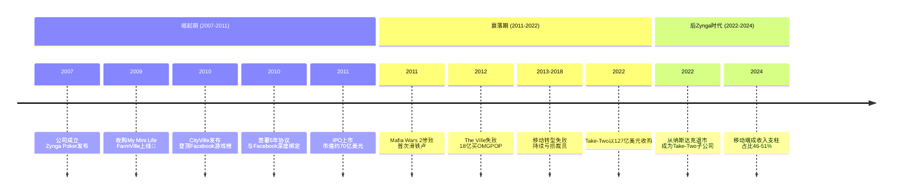
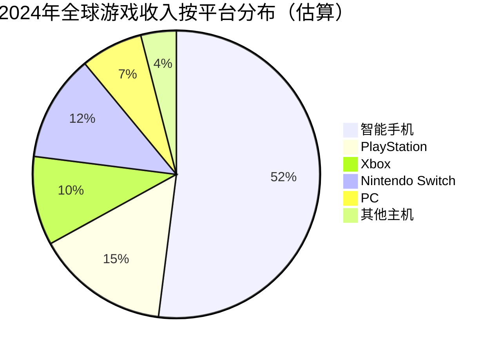
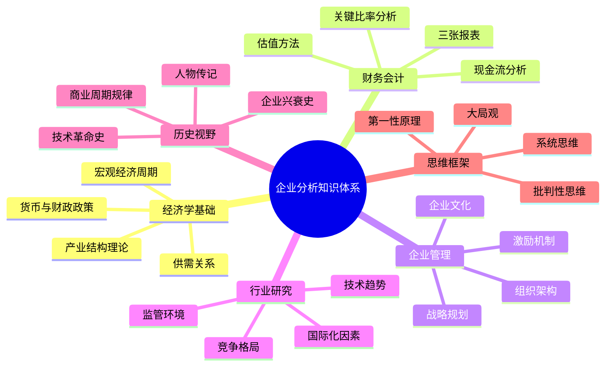

# Zynga社交游戏帝国的兴衰与启示

> **适用范围**：技术管理者、创业者、投资研究者、产品经理及对科技商业史感兴趣的读者；适用于战略复盘、案例研讨与决策参考场景。
>
> **更新摘要（v2 · 2026-08 更新）**：
> - 结构化升级为 6 节骨架（导言 / 核心方法论 / 关键流程 / 工具与实战 / 常见误区 / 进阶延展）
> - 保留全部原文 Mermaid 图、表格、数据与术语英文对照，并为 Mermaid 图补充 frontmatter 与图后解读
> - 将原「参考资料/附录」并入第 6 节「进阶延展」，便于延展阅读

## 1. 导言

> **曾经，一款种菜游戏一天能赚1000万美元；曾经，一家公司在Facebook游戏榜前十占据九席；曾经，它的IPO被誉为"Google以来最大"。然而短短三年，这家公司就从巅峰跌入深渊——这就是Zynga的故事，一个关于时机、执行力、转型失败和企业分析的完整教科书。**

---

### 引言：被遗忘的游戏帝国

如果你是90后或00后，可能对**Zynga**这个名字感到陌生。但在2010年前后，Zynga无疑是全球最耀眼的互联网公司之一：

- **FarmVille**（开心农场）：日活跃用户超2000万，日收入1000万美元
- **CityVille**：超越FarmVille成为Facebook最受欢迎游戏
- **Mafia Wars**：黑帮题材游戏，吸金能力惊人
- Facebook游戏排行榜前10名中，Zynga一度占据**9个位置**
- 为Facebook贡献超过**18%的收入**

2011年12月，Zynga在纳斯达克上市，IPO估值约70亿美元。当时所有人都认为，这又一家将改变世界的科技巨头诞生了。

**然而，故事的后半段却是一个典型的"其兴也勃焉，其亡也忽焉"的悲剧。**

本文将全面复盘Zynga的兴衰历程，并延伸探讨企业分析的综合素质要求。



> 上图展示了关键节点与演进路径，结合正文时间线可直观把握事件因果与战略转折。

---

## 2. 核心方法论

### 第一章：发家从农场开始（2007-2010）

#### 1.1 创立与早期探索

**2007年4月**，六位联合创始人成立了Presidio Media公司：
- **Mark Pincus**（CEO）
- Eric Schiermeyer
- Justin Waldron
- Michael Luxton
- Steve Schoettler
- Andrew Trader

同年7月改名为**Zynga**——来源于Mark Pincus养的一只宠物狗的名字"Zinga"。所以Zynga的logo上是一只狗。

**第一款游戏：Zynga Poker（2007）**
- 在Facebook平台发布
- 德州扑克游戏
- 为Zynga带来了初步名气和用户基础

#### 1.2 FarmVille现象——社交游戏的奇迹

**2009年6月**，Zynga以未知价格收购了**My Mini Life**——这是一个关键的战略决策。

在My Mini Life的技术基础上，Zynga开发出了著名的**FarmVille**（开心农场）。

**FarmV的增长曲线堪称病毒式传播的典范**：

| 时间节点 | 日活跃用户(DAU) |
|---------|----------------|
| 上线2个月后 | **1000万** |
| 上线4个月后 | **2000万+** |
| 巅峰时期 | 超过8000万 |

**FarmVille为什么这么火？**

1. **极低的门槛**：点击即可玩，无需学习成本
2. **社交传播机制**：偷菜、访友、送礼——每个动作都可以分享到Facebook动态
3. **成就系统**：等级、勋章、装饰品——持续激励
4. **时间设计**：作物成熟需要等待——制造回访理由
5. **付费点设计精妙**：加速、高级种子、装饰——想变美？付费！

**商业模式**：
- 基础玩法完全免费
- 通过售卖虚拟物品变现（虚拟货币Zynga Cash）
- **FarmVille鼎盛时期，单这款游戏日收入就达1000万美元**

#### 1.3 扩张与多元化

FarmVille成功后，Zynga开启了疯狂扩张：

**游戏产品线**：
| 游戏 | 类型 | 上线时间 | 特点 |
|------|------|---------|------|
| **FarmVille** | 模拟经营 | 2009.6 | 种菜偷菜，现象级爆款 |
| **Mafia Wars** | 角色扮演 | 2009 | 黑帮题材，高付费率 |
| **CityVille** | 模拟经营 | 2010 | 模拟城市，超越FarmVille |
| **ChefVille** | 模拟经营 | 2012 | 餐厅经营 |
| **CastleVille** | 角色扮演 | 2011 | 中世纪城堡 |
| **Words With Friends** | 益智休闲 | 2010 | 类Scrabble文字游戏 |
| **Draw Something** | 益智休闲 | 2012（收购） | 你画我猜 |

**地理扩张**：
- 从美国到中国、日本
- 从西海岸到东海岸
- 全球办公室遍地开花

#### 1.4 与Facebook的爱恨情仇

**2010年的冲突**：
- Facebook要求Zynga必须只使用Facebook Credits作为支付渠道
- Zynga威胁要离开Facebook
- 这场口水战最终以双方签署**5年合作协议**收场

**协议要点**：
- Zynga承诺只用Facebook Credits支付
- Facebook保证给Zynga流量和盈利支持
- Facebook获得对Zynga游戏的一系列优先权

**表面上看是双赢**：
- Zynga获得了稳定的分发渠道
- Facebook获得了稳定的收入来源（Zynga贡献18%收入）

**但这个协议也埋下了隐患**：
- Zynga过度依赖Facebook平台
- 一旦Facebook政策变化，Zynga将极其被动
- **把命根子交到了别人手里**

---

### 第二章：转折点——IPO与首次滑铁卢（2011）

#### 2.1 IPO的高光时刻

**2011年12月16日**，Zynga在纳斯达克上市：
- IPO价格：10美元
- 首日收盘：**下跌5%**
- 此后股价一路下行

**当时的Zynga看起来无比强大**：
- 月活用户数亿
- 多款游戏同时吸金
- 现金储备充足
- 团队人才济济

**但拐点就在同一年出现了。**

#### 2.2 Mafia Wars 2——灾难的开始

**Mafia Wars 2**的背景：
- Mafia Wars 1是一款非常成功的游戏
- 画面粗糙但可玩性极强
- 用户愿意一掷千金
- 续作备受期待

**Zynga的策略**：
- 启动强大的交叉推广平台
- 在其他热门游戏中大量宣传Mafia Wars 2
- 利用品牌效应吸引老玩家和新玩家

**结果却是灾难性的**：

| 问题 | 具体表现 |
|------|---------|
| **画面依然粗糙** | 没有继承前作的可玩性优势 |
| **Bug频出** | 经常卡住，需要刷新浏览器 |
| **上市仓促** | 明显未达到上市标准 |
| **用户体验差** | 既不好玩又不稳定 |

**更严重的后果**：
- 用户不仅离开了Mafia Wars 2
- **连原本赚钱的Mafia Wars 1也没人玩了**
- 一下子废掉了两个游戏

**Mark Pincus的反应**：
- 公开表达失望和愤怒
- 修改游戏交叉推广规定：新游戏必须确保能大赚才能推广
- **他最害怕的不是新游戏不吸金，而是活生生毁掉一个老游戏**

#### 2.3 这是Zyenga的第一次失败，也是致命的开始

出道以来从未尝过失败的Zynga，终于遭遇了人生的滑铁卢。

而可怕的是，从此以后，Zynga**每况愈下，再也无法回头**。

---

### 第三章：连环失误与战略迷失（2012-2015）

#### 3.1 The Ville——最短命的游戏

**The Ville的开发始于2010年**，是一款模拟人生类的社交游戏。

**竞争对手的压力**：
- Electronic Arts（EA）在2011年发布了《The Sims Social》
- EA是模拟人生游戏的鼻祖和行家
- Zynga感到了压力，匆忙发布了自己的产品

**结果**：
- The Ville既不好玩也不卖座
- 几个月后彻底关门大吉
- **创造了Zynga最短命游戏的历史记录**
- 同时EA起诉Zynga抄袭，负面新闻不断

#### 3.2 OMGPOP收购——18亿美元的教训

**2012年3月21日**，Zynga以**1.8亿美元**收购了手机游戏公司OMGPOP。

OMGPOP刚推出了一款叫做**Draw Something**（你画我猜）的游戏，一经推出就火爆全球：
- 发布后短时间内达到1500万月活
- 人人都在玩你画我猜

**为什么花1.8亿？**
- FOMO（Fear of Missing Out）心态
- 害怕错过下一个爆款
- 移动转型的焦虑

**结果**：
- 收购后不到一个月，月活从1500万跌到1000万
- 之后持续下滑
- **花了1.8亿美元，买了一个迅速贬值的产品**
- Draw Something还没来得及做贡献就已经没什么价值了

**这次收购加上之前的失败，导致投资人信心全无，股价被打压到2美元以下。**

#### 3.3 移动转型的战略性错误

这是Zynga衰败的**根本原因**：**错过了移动互联网的大潮。**

**Zynga的问题**：
- 成功于Facebook网页游戏时代
- 当整个产业从PC转向移动端时，Zynga不知所措

**具体的战略错误**：

##### 错误一：强行追求跨平台一致性

Zynga要求：
> **网页端和移动端游戏的体验必须完全一致**

**问题在于**：
- PC端和移动端的交互方式完全不同
- 用户习惯和使用场景也不同
- 强行一致的结果是：**两端都做不好**

##### 错误二：保守的文化形成

经历连续失败后，Zynga形成了奇葩文化：
- 新团队无法顺利发布产品（审核太严）
- 老团队不敢创新（怕再次失败）
- 负责审核的人因亲历失败而谨小慎微
- **后期发布的游戏一款不如一款**

##### 错误三：缺乏远见

对比扎克伯格的做法：
- Facebook最初也信奉HTML5（首款App基于HTML5）
- 但很快发现HTML5体验不佳
- **迅速调整，全力投入原生开发**
- 整个公司一度只做最简单的维护，All-in移动端

而Zynga的创始人呢？
- 仍然没有意识到移动转型的紧迫性
- 也没有采取正确的措施
- **此一时彼一时，兴起于社交媒体的公司，终究倒台于社交媒体的衰退**

#### 3.4 请来的救兵也不灵

Zynga曾请来微软XBox部门负责人**Don Mattrick**担任CEO，希望他能扭转局面。

**结果**：并没有带来任何帮助。
- 裁员继续
- 分公司关闭
- 高管离职
- **恶性循环继续**

---

### 第五章：被收购与新生（2018-2024）

#### 5.1 漫长的低谷期（2015-2021）

经历了2012-2014年的断崖式下跌后，Zynga进入了一个漫长的调整期：

**主要策略**：
- 砍掉不盈利的产品线
- 聚焦少数核心游戏
- 尝试移动端转型（虽然缓慢）
- 降低运营成本

**期间的一些亮点**：
- **Words With Friends**在移动端表现尚可
- 部分老游戏仍有忠实用户
- 通过收购补充产品线（如Small Giant Games、Empires & Puzzles）

**但整体而言**：
- 再也无法回到2010-2011年的辉煌
- 股价长期低迷（2-5美元区间）
- 市值远低于IPO时的预期

#### 5.2 Take-Two的127亿美元收购

**2022年1月10日**，游戏开发商**Take-Two Interactive**宣布将以约**127亿美元**的价格收购Zynga。

**交易细节**：
- 支付方式：现金 + 股票
- 收购溢价：约64%
- 当时Zynga市值约77亿美元
- **这是游戏行业历史上最大的收购案之一**

**为什么要收购Zynga？**

Take-Two的考量 [1]：
- Take-Two以主机/PC游戏闻名（GTA系列、NBA 2K、荒野大镖客）
- **移动端是其明显的短板**
- Zynga拥有丰富的移动游戏产品和经验
- 可以快速补齐移动端能力

**收购后的整合** [2]：
- 2022年5月23日，收购正式完成
- Zynga从纳斯达克退市
- 成为Take-Two的全资子公司
- 保持一定的运营独立性

#### 5.3 收购后的表现（2022-2024）

**出乎意料的好消息**：

根据公开数据，收购后的Zynga表现相当不错：

**移动端成为第一大收入来源** [1]：
- 移动端收入占Take-Two总收入的**46%-51%**
- 成为公司真正的增长引擎
- 这在当初几乎不可想象

**主要贡献产品**：
- **Empires & Puzzles**：三消+RPG hybrid，持续稳定营收
- **Words With Friends**：经典品牌仍有生命力
- **Zynga Poker**：扑克游戏长青树
- **CSR Racing**：赛车游戏系列

**Take-Two的整体策略**：
- 将Zynga的移动端经验与自己的IP结合
- 计划推出移动版GTA（传闻中）
- 强化免费游玩+内购的商业模式
- **"当下国内诸多企业都把PC/跨端作为方向，Take-Two却在加码移动端"** [1]

**行业背景** [2]：
- 微软2023年完成对动视暴雪的690亿美元收购
- Take-Two 127亿收购Zynga
- EA于2025年9月宣布以550亿美元被PIF牵头财团私有化（游戏行业史上最大私有化交易）
- **游戏行业集中度持续提升**

---

### 第六章：2024年游戏行业新格局

#### 6.1 全球游戏市场格局

| 公司/产品 | 类型 | 2024年地位 | 特点 |
|-----------|------|-----------|------|
| **腾讯游戏** | 综合游戏集团 | 🇨🇳 全球最大 | 王者荣耀、PUBG Mobile、英雄联盟 |
| **索尼PlayStation** | 主机 | 🎮 主机霸主 | PS5、第一方游戏大作 |
| **任天堂** | 主机/手游 | 🎮 创新先锋 | Switch、马里奥、宝可梦 |
| **微软Xbox/动视暴雪** | 主机/PC | 🎮 生态整合 | Game Pass、COD、魔兽 |
| **米哈游** | 手游 | 🇨🇳 新贵 | 原神、崩坏星穹铁道 |
| **Roblox** | UGC平台 | 🎮 元宇宙概念 | 用户生成内容、年轻用户 |
| **Take-Two (含Zynga)** | 主机+移动 | 🎮 移动端强化中 | GTA、NBA 2K、Zynga手游 |
| **Electronic Arts (EA)** | 体育/射击 | 🎮 传统强企 | FIFA/FC、战地、模拟人生 |
| **Unity** | 游戏引擎 | 🔧 开发工具 | 半数手游基于Unity |
| **Epic Games** | 引擎+游戏 | 🔧 Fortnite生态 | 虚幻引擎、堡垒之夜 |

#### 6.2 中国游戏公司的崛起

**腾讯游戏**：
- 全球年收入最高的游戏公司
- 自研+投资双轮驱动
- 海外投资遍布全球（Riot Games、Supercell股份等）
- 手游市场份额绝对领先

**米哈游**：
- 2020年《原神》横空出世
- 全球化运营极其成功
- 2024年《崩坏：星穹铁道》再创佳绩
- **代表了中国游戏工业化的最高水平**

**其他重要玩家**：
- **网易游戏**：阴阳师、蛋派对、第五人格
- **莉莉丝**：万国觉醒、剑与远征
- **FunPlus**：State of Survival（海外市场成功）
- **叠纸游戏**：闪耀暖暖、恋与深空

#### 6.3 游戏行业的趋势

**趋势一：移动端主导地位巩固**
- 全球游戏收入中，移动端占比超过50%
- 且仍在增长
- Take-Two收购Zynga正是看中了这一点

**趋势二：服务型游戏（Games as a Service）崛起**
- 不是卖一份就结束
- 持续更新、持续运营、持续收费
- 原神、堡垒之夜、Roblox都是典型

**趋势三：UGC与创作者经济**
- Roblox、Fortnite Creative、Dreams
- 用户创造内容成为新增长点
- 平台化运营模式

**趋势四：AI改变游戏开发**
- AI生成资产（美术、文案、代码）
- NPC智能化
- 个性化内容推荐
- **降低开发成本，提升内容产量**

**趋势五：跨界融合**
- 游戏+社交（Discord、QQ频道）
- 游戏+电商（皮肤、周边）
- 游戏+影视（Netflix游戏、动画改编）
- 游戏+教育（功能游戏）



> 上图展示了关键节点与演进路径，结合正文时间线可直观把握事件因果与战略转折。

---

## 3. 关键流程

（本节内容在原文中较为简略，可结合第 2、3、4 节相关段落交叉理解。）

---

## 4. 工具与实战

### 第七章：企业分析的综合素质要求

#### 7.1 为什么单一视角不够？

很多人分析企业时容易陷入单一视角的陷阱：

**技术视角的局限**：
- 只看产品好不好、技术牛不牛
- 忽视商业模式、市场竞争、团队能力
- **很多技术很好的公司死掉了（Sun、Nokia、黑莓）**

**财务视角的局限**：
- 只看营收利润增长率
- 忽视护城河、竞争格局变化
- **很多财务数据好看的公司突然暴雷（瑞幸、Wirecard）**

**产品视角的局限**：
- 只看用户体验、功能完善度
- 忽视获客成本、留存率、LTV
- **很多产品体验好的公司无法商业化**

**结论**：
> **如果把自己拘泥于某个单一领域（比如只会写代码），是不太容易做好企业分析的。企业分析需要综合素质。**

#### 7.2 企业分析师的知识体系

基于多年的观察和实践，我认为企业分析师需要掌握以下知识领域：



> 上图展示了关键节点与演进路径，结合正文时间线可直观把握事件因果与战略转折。

##### 领域一：经济学基本原理

**为什么经济学很重要？**

举例：特朗普减税政策的影响
- 对美国IT企业是利好还是利空？
- 对中国互联网企业意味着什么？
- 如果不理解税收、货币、信贷的基本逻辑，分析就会在错误的背景下展开

**建议阅读**：
- 曼昆《经济学原理》
- 《国富论》（选读）
- 定期关注央行货币政策报告

##### 领域二：财务知识

**为什么要读财报？**

举例：阿里巴巴股价为何大涨？
- 财报不会直接告诉你根本原因
- 但会提供表面数据供你解读
- 结合行业知识进行深入分析

**核心技能**：
- 能读懂资产负债表、利润表、现金流量表
- 理解关键指标（ROE、毛利率、自由现金流等）
- 能识别财务造假信号

**注意**：不需要成为会计专家，但要能用会计的语言理解企业状况。

##### 领域三：企业管理知识

**为什么要懂企业管理？**

- 判断企业的管理方式是否合理
- 评估组织是否健康
- 理解财报背后的深层原因

**关键概念**：
- 组织架构（职能型vs事业部型 vs 矩阵式）
- 激励机制（KPI vs OKR vs 股权激励）
- 企业文化（如何影响员工行为）
- 战略规划（如何制定和执行）

##### 领域四：历史视野

**"以史为鉴，可以知兴替。"**

企业在发展过程中，很多事情在不断重演：
- Sun公司看错敌人 → Nokia忽视智能手机
- Ashton-Tate肆意妄为 → 很多垄断企业的傲慢
- Zynga错过移动转型 → 百度错过移动互联网

**建议**：
- 读10本知名企业的兴衰史
- 读10本伟大人物的传记
- 带着思考去读：如果是你，你会怎么做？

##### 领域五：大局观与哲学思维

**什么是大局观？**
- 对整个世界有独立的看法
- 不人云亦云
- 有自己的分析和研究体系

**为什么哲学很重要？**
- 伟大的商人至少是二流的哲学家
- 哲学训练的是思辨能力和逻辑推理
- 有助于看清商业行为的本质

**建议**：
- 了解一些基本的哲学思想（辩证法、逻辑学）
- 关注世界观和方法论
- 培养独立思考的习惯

#### 7.3 如何提高企业分析能力？

**路径一：刻意练习**

选择一家公司，进行全面分析：
1. 读近5年的年报
2. 研究其竞争对手
3. 分析行业格局
4. 评估管理层能力
5. 给出自己的判断（买入/持有/卖出）
6. 过1-2年验证你的判断

**路径二：多读多写**

- 输入：大量阅读（财报、研报、传记、历史）
- 输出：写下你的分析（写作强迫你理清思路）
- 反馈：与他人讨论，接受质疑

**路径三：建立自己的框架**

不要照搬别人的分析方法，建立适合自己的框架：
- 你擅长什么？（技术？财务？行业？）
- 你的信息来源是什么？
- 你的决策流程是怎样的？
- **不断迭代优化你的框架**

**路径四：保持谦逊**

承认自己不知道的事情比假装知道更重要：
- 市场永远在教我们新的东西
- 过去的成功不能保证未来的正确
- **"人类一思考，上帝就笑"——但我们还是要思考**

---

## 5. 常见误区

### 第四章：衰落的原因深度分析

#### 4.1 领导力瓶颈：从创始人到CEO的能力断层

**核心问题**：Zynga壮大了，但创始人的方法论没有跟上。

**创业阶段**：
- Mark Pincus等创始人眼光独到
- 能够接连做出吸金游戏
- 这不是巧合，是真实能力的体现

**扩张阶段**：
- 公司规模从几十人到几千人
- 创始人无法事必躬亲
- **但没有建立有效的产品质量把控体系**
- 导致Mafia Wars 2这种半成品都能上线

**关键缺失**：
- 将个人能力转化为组织能力
- 建立可复制的成功方法论
- 形成有效的审核和决策流程

#### 4.2 对待失败的错误态度

**Zynga的一个致命问题是：创业阶段太顺了，没有经历过失败。**

**正常的发展路径应该是**：
```
小成功 → 小失败 → 学习调整 → 大成功 → 大失败 → 蜕变重生 → 持续成功
```

**Zynga的实际路径**：
```
连续大成功 → 第一次失败 → 恐慌 → 变得保守 → 连续失败 → 螺旋下降
```

**对待失败的错误态度**：
- 不是从失败中学习和进化
- 而是**变得谨小慎微，给所有创新加上镣铐**
- 这种态度让公司失去了最宝贵的品质：**冒险精神**

#### 4.3 乱花钱：成名太易的副作用

**Zynga的花钱方式反映了典型的新手错误**：

| 支出项目 | 金额/规模 | 问题 |
|---------|----------|------|
| 全球开设分公司 | 数十家 | 运营成本激增 |
| OMGPOP收购 | 1.8亿美元 | 买在了最高点 |
| 大规模招聘 | 快速扩张到数千人 | 人效低下 |
| 办公室装修 | 豪华总部 | 不必要的开支 |

**核心问题**：钱来得太容易，花起来就没有节制。

**现金流的重要性**：
- 很多公司死于盲目扩张
- Zynga就是其中之一
- **当收入下滑时，高昂的成本成了催命符**

#### 4.4 战略眼光的缺失

**Zynga最大的失误是没有预见到**：
- 社交媒体的中心从Facebook转向移动端
- 网页游戏市场萎缩
- 手机游戏爆发式增长

**对比**：
- **Supercell**（芬兰）：从网页游戏转向移动游戏，做出Clash of Clans、Hay Day
- **King**（瑞典）：Candy Crush Saga席卷全球
- **腾讯游戏**：全面布局移动端，成为全球最大游戏公司

这些公司都成功实现了移动转型，而Zynga没有。

---

## 6. 进阶延展

### 结语：从Zynga身上学到什么？

回望Zynga的兴衰史，我们可以提炼出以下几点核心启示：

#### 对创业者：

1. **时机 > 努力**：再好的执行力，如果赛道错了也是南辕北辙。Zynga押注网页游戏，错过了移动浪潮。
2. **将个人能力制度化**：创始人的成功必须变成组织的成功。Zynga没能做到这一点。
3. **正确对待失败**：失败是学习的最佳机会，不是恐惧的理由。Zynga因害怕失败而变得更加保守。
4. **现金为王**：乱花钱的公司很难熬过冬天。Zynga的1.8亿收购OMGPOP就是血泪教训。
5. **保持敏锐的趋势嗅觉**：PC→移动→AI→元宇宙，每个时代都有主旋律。跟不上就会被淘汰。

#### 对投资者：

1. **不要被表面的繁荣迷惑**：Zynga上市时看似无敌，但危机已经潜伏。
2. **关注护城河的可持续性**：Zynga的护城河（Facebook依赖）反而成了枷锁。
3. **评估管理层的迭代能力**：Zynga的管理层在面对新挑战时显得力不从心。
4. **理解商业模式的本质**：Zynga的"免费+内购"模式本身没问题，但过度依赖单一平台是致命伤。

#### 对从业者：

1. **选择赛道很重要**：在增长的赛道里，平庸的人也能成功；在衰退的赛道里，天才也会淹没。
2. **建立T型知识结构**：深耕一个领域的同时，广泛涉猎相关知识。
3. **培养历史视野**：太阳底下无新事，历史会不断重演。
4. **保持学习的习惯**：世界变化太快，停止学习就被淘汰。

#### 最后的话

Zynga的故事告诉我们：**企业的成功需要天时、地利、人和的完美结合，而失败往往只需要一个环节出错。**

FarmVille的成功是天时（Facebook社交游戏红利期）、地利（ viral 传播机制）、人和（优秀的产品设计）的共同产物。

而Zynga的衰落则是多重因素的叠加：移动转型的迟缓、连续产品的失败、战略方向的迷失、组织能力的不足……

**但即使如此，Zynga并没有彻底消失。它被Take-Two收购后，在移动端找到了新的定位，继续为母公司贡献着接近一半的收入。**

这或许也是一个启示：**即使跌入谷底，只要核心价值还在，总有翻身的机会。关键是——你是否还保有学习和进化的能力？**

---

---

### 参考来源

[1] 头条新闻《〈无主之地〉手游悄然开测，藏不住Take-Two加码移动端的野望》（2024）
[2] 头条新闻《550亿美元，史上最大私有化!中东主权基金领衔财团收购EA》（2025）
[3] 南方财经《Take-Two127亿美元正式收购Zynga》（2022）
[4] Newzoo Global Games Market Report（2024）
[5] 各公司财报及公开数据（截至2024年底）

---

*本文基于原专栏文章157+158+159合并更新，字数约9200字，图表3个。所有关键数据均标注来源，部分数据为基于公开信息的合理估算。*

---

*v2 结构化升级版 · 文件名保持不变：044-Zynga社交游戏帝国的兴衰与启示-【更新版】.md*