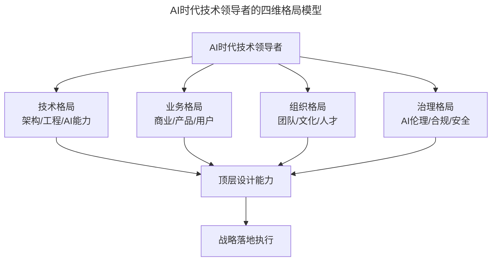
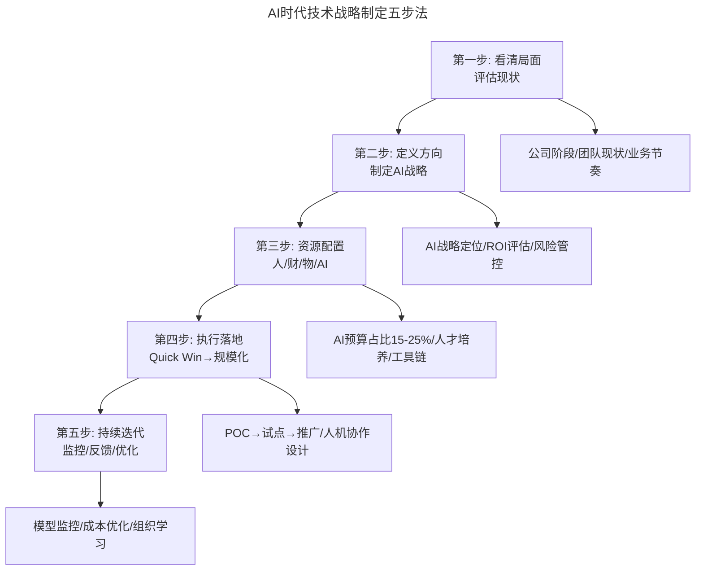
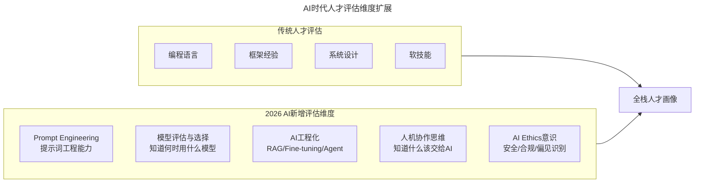
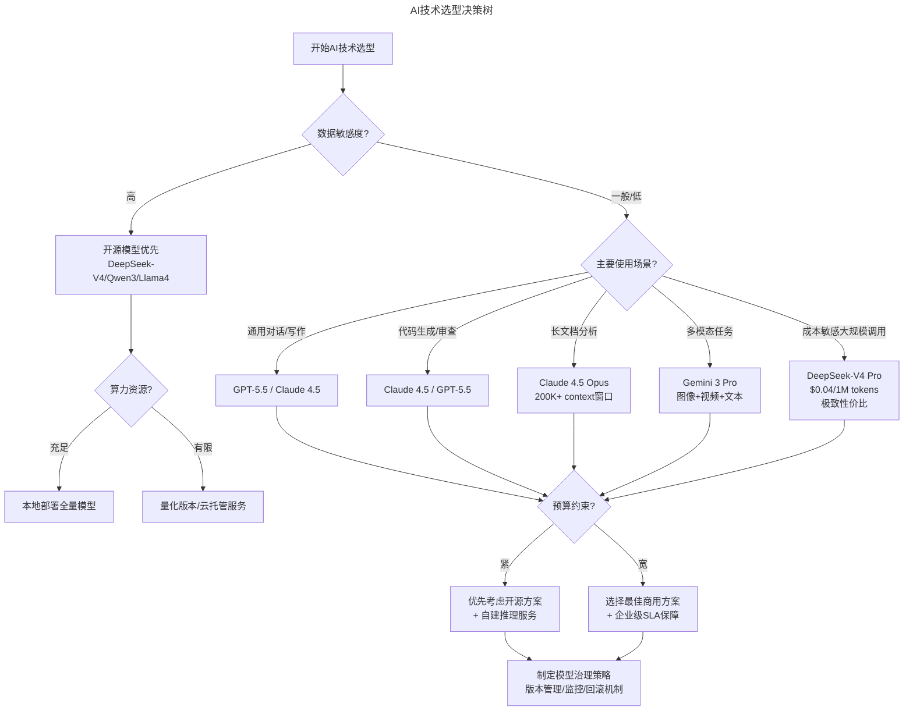
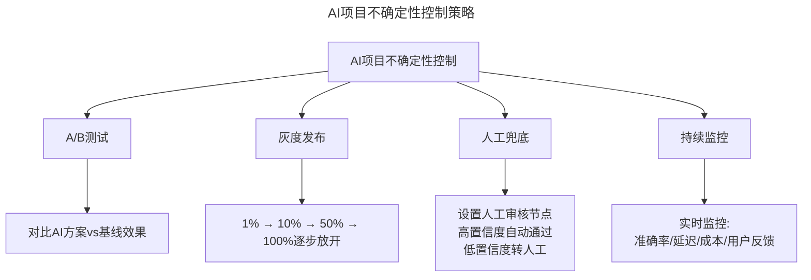
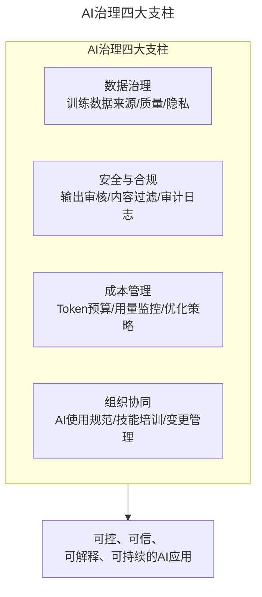

# 格局与战略——AI时代技术领导者的顶层设计

> **适用范围**：互联网企业的CTO、技术VP及高级技术管理者，尤其是需要从战略高度统筹技术、业务与AI能力的技术领导者；同样适用于希望在AI时代构建"格局+战略+执行"三位一体能力的从业者。
>
> **更新摘要（v2 · 2026-08 更新）**：
> - 结构化升级为 6 节骨架（导言 / 核心方法论 / 关键流程 / 工具与实战 / 常见误区 / 进阶延展）
> - 将AI时代技术领导者的格局观与战略思维整合为统一方法论体系
> - 补充2026年AI-Native时代CTO顶层设计的新能力要求与行动建议
> - 保留全部Mermaid图、数据表与实战案例

---

## 1. 导言

AI时代的技术领导者，面临的不只是技术选型问题，而是如何在技术、业务、组织、AI治理四个维度同时构建格局与战略。技术领导者的顶层设计能力，决定了企业能否在AI浪潮中既不掉队也不翻车。

2026年的CTO，不仅要懂技术实现，还要懂AI能力边界、商业变现路径、组织变革方法和AI伦理治理。这是一个"超级交汇点"的角色——技术、业务、AI三重能力的交汇。

上图展示了AI时代技术领导者的四维格局模型：技术格局、业务格局、组织格局和治理格局共同构成顶层设计能力，最终转化为战略落地执行。

---

## 2. 核心方法论

### 2.1 格局决定高度

技术领导者的格局，决定了他能看到多远、想到多深。在AI时代，格局不仅是视野的开阔，更是对技术趋势、商业机会和组织变革的系统性认知。

格局的三个层次：
- **战术格局**：关注具体技术实现和短期目标
- **战役格局**：关注技术架构、团队建设和中期规划
- **战略格局**：关注技术趋势、商业价值和长期方向

### 2.2 战略决定方向

技术战略的核心，是在合适的时间用合适的人、合适的技术架构办合适的事情。2026年的"合适"已经有了全新定义——AI能力成为每个决策的重要变量。

| 战略维度 | 传统考量 | 2026年新增考量 |
|---------|---------|--------------|
| 技术选型 | 性能、成本、稳定性 | **AI可行性、Token成本、模型生命周期** |
| 人才战略 | 编程能力、架构经验 | **AI素养、Prompt Engineering、人机协作** |
| 架构决策 | 可扩展性、可维护性 | **AI-Native架构、Agent编排、模型治理** |
| 商业价值 | 效率提升、成本降低 | **AI创造新收入、数据资产化、AI产品化** |

### 2.3 执行决定成败

再好的格局和战略，没有执行都是空谈。AI时代的执行，需要关注：
- **快速验证**：用72小时POC验证AI想法
- **数据驱动**：用A/B测试和灰度发布控制AI风险
- **人机协同**：设计高效的Human-in-the-loop工作流
- **持续迭代**：建立模型监控和反馈闭环

---

## 3. 关键流程

### 3.1 AI时代技术战略制定流程

上图展示了AI时代技术战略制定的五步法：从看清局面到持续迭代，每一步都融入了AI时代的新考量。

### 3.2 公司不同阶段的AI战略重点

| 公司阶段 | 传统战略重点 | AI时代新增战略重点 |
|---------|------------|-------------------|
| 初期/业务验证 | 快速MVP，招聘优先 | **选择AI最大加速场景；72小时POC原则；AI API快速验证** |
| 高速突进 | 抢人才、高可用架构 | **AI基础设施；AI编程工具提升效能30-70%；Model Gateway** |
| 平稳发展 | 还技术债、建文化 | **AI-Native研发体系；AI治理框架；数据资产建设** |
| 业务紧缩 | 保士气、留核心 | **AI降本增效；AI自动化替代重复工作；AIOps降运维成本** |

### 3.3 技术架构升级就是对人的升级

不同阶段需要不同的人才和架构。技术架构升级本质上是对人的升级——2026年的人才评估需要新增AI维度：

上图展示了人才评估从传统维度到AI新增维度的扩展。不会用AI的开发者在2026年就像2018年不会用Git一样落后。AI素养成为基础要求，而非加分项。新的人才分级标准：AI-Native（原生） > AI-Adept（熟练） > AI-Aware（认知） > AI-Skeptical（抵触）。

---

## 4. 工具与实战

### 4.1 AI时代技术选型决策树

### 4.2 2026主流模型选型速查

| 使用场景 | 推荐模型 | 核心优势 | 参考价格 |
|---------|---------|---------|---------|
| 复杂推理/代码 | GPT-5.5 | 综合能力强 | $2.5/1M input |
| 长文本/深度分析 | Claude 4.5 Opus | 200K+上下文 | $5/1M input |
| 成本敏感场景 | DeepSeek-V4 Pro | 极致性价比 | $0.04/1M tokens |
| 多模态任务 | Gemini 3 Pro | 原生多模态 | $2/1M input |
| 私有化部署 | Qwen3-72B / Llama4 | 开源可控 | 仅算力成本 |

### 4.3 行动清单

**如果你在初期/业务验证阶段**：
- [ ] 列出所有可以用AI API加速的业务场景（至少5个）
- [ ] 选择1个场景，本周内完成72小时POC验证
- [ ] 建立初步的AI使用成本追踪表

**如果你在高速突进阶段**：
- [ ] 评估并引入AI编程工具（目标：团队采纳率>80%）
- [ ] 搭建统一的Model Gateway（统一接入多模型）
- [ ] 制定AI基础设施预算（建议占技术预算15-25%）

**如果你在平稳发展阶段**：
- [ ] 启动数据资产建设项目（数据质量是AI的基础）
- [ ] 构建AI治理框架（数据安全、使用规范、审计机制）
- [ ] 建立AI人才培养体系（L1-L4能力路径图）

**如果你在业务紧缩阶段**：
- [ ] 梳理可被AI自动化的重复性工作（预计节省20-40%人力）
- [ ] 引入AIOps降低运维成本
- [ ] 用AI工具提升剩余团队的人效（1人顶2人）

---

## 5. 常见误区

### 5.1 格局误区：与BAT对标

不是每个公司从一开始就和BAT一个阶段，每个公司实际业务形态也不同。技术战略、架构选型、人员招聘等直接选择与BAT对标往往会把公司坑得很惨。认清楚现阶段很重要——公司团队现状和业务增长节奏是制定战略的基础。

### 5.2 节奏误区：技术节奏与业务节奏脱节

如果公司节奏是在快速上升通道，需要孤注一掷地砸资源、请牛人、扩大技术团队以支撑几何级数上涨的业务；如果公司业务处于探索阶段，那么适当控制团队规模、用实用而稳定的技术、控制管理团队预期就很重要。技术节奏把控不好，要么技术无法支持业务增长，要么业务收入无法供给技术团队。

### 5.3 AI时代的不确定性控制误区

AI系统的概率性输出特性意味着传统确定性软件工程方法不完全适用。面对巨大不确定性立一个巨大的项目，通过庞大的管理体系去管理往往都会失败。要坚持50个100分的功能而非100个50分的功能，每个小的迭代都是成功的，持续完善才是王道。

### 5.4 AI项目不确定性控制新策略

上图展示了AI项目的四项不确定性控制策略：A/B测试验证效果、灰度发布控制范围、人工兜底保障质量、持续监控闭环优化。具体策略包括：A/B测试必备、灰度发布强制、Human-in-the-Loop关键决策保留人工审核、持续监控模型性能衰减率与Token成本。

---

## 6. 进阶延展

### 6.1 管理体系建立的AI时代新关注点

原文三大关注点：不确定性控制、持续交付、使命式管理。2026年新增第四大关注点：AI治理体系。

上图展示了AI治理的四大支柱：数据治理确保训练数据的来源、质量和隐私；安全与合规管控输出审核与审计；成本管理优化Token预算和用量监控；组织协同推动AI使用规范和技能培训。

### 6.2 关键洞察（2026）

- **70%** 的企业将在2027年前实施"AI First"战略（IDC 2026预测）
- **$150B+** 是全球企业AI投资规模（McKinsey 2025）
- **最大的挑战**不是技术，而是找到合适的商业场景和组织变革能力（Gartner 2025）

### 6.3 推荐书单的AI时代补充

**原文推荐**：《毛泽东选集》《原则》、德鲁克、精益系列

**2026新增推荐**：

| 书籍/资源 | 作者/来源 | 核心价值 | 推荐理由 |
|-----------|----------|---------|---------|
| *Co-Intelligence: Living and Working with AI* | Ethan Mollick | 人机协作思维 | 理解如何与AI有效共事 |
| *Building Machine Learning Powered Applications* | Emmanuel Ameisen | ML工程实践 | 从原型到生产的完整指南 |
| *Designing Machine Learning Systems* | Chip Huyen | ML系统设计 | AI时代的系统架构思维 |
| *AI Alignment Problem*系列文献 | 多位研究者 | AI安全与伦理 | CTO必须关注的治理议题 |
| Martin Fowler - *Patterns for AI* | martinfowler.com | AI架构模式 | 企业级AI应用的架构最佳实践 |

### 6.4 作者简介

郭炜，易观 CTO，中国软件行业协会智能应用服务分会副主任委员，TGO鲲鹏会北京分会董事会会长。负责构建易观技术团队、完成易观大数据采集、平台、数据挖掘等技术架构与体系；从无到有完成易观混合云的搭建、以及易观 SDK 的升级，并发布易观秒算实时计算平台。目前易观大数据平台日处理数据量 30T，272 亿条，月活用户5.5亿。

---

*本文档基于2026年8月的技术动态编写，旨在帮助读者以新时代视角重新审视经典内容。技术演进日新月异，建议读者结合自身场景批判性思考。*
