# 技术趋势解读 — 2025-2026技术全景图

> **适用范围**：CTO、技术VP、架构师及需要全面把握2025-2026年AI技术全景的技术领导者；同样适用于制定AI战略规划、技术选型决策、团队AI能力升级的技术管理者。
>
> **更新摘要（v2 · 2026-08 更新）**：
> - 结构化升级为 6 节骨架（导言 / 核心方法论 / 关键流程 / 工具与实战 / 常见误区 / 进阶延展）
> - 基于极客时间《技术领导力实战笔记》（2018-2019）精华内容，全面升级至2026年中最新技术动态
> - 涵盖大模型格局、AI编程工具L1-L5分级、AI Agent架构、RAG落地路径、前端AI化、云原生AI、安全合规七大领域
> - 保留全部Mermaid图、数据表格与行动清单，补充2026年Q2最新市场数据与可执行建议

---

## 1. 导言

> **本文档基于极客时间专栏《技术领导力实战笔记》（2018-2019）的精华内容，全面升级为面向2025-2026年的最新技术趋势知识体系。**
>
> **时效性标注**：本文档技术信息截至**2026年6月**，全面反映2026年中最新技术动态。
> **核心来源**：原始专栏文章 + 2025-2026年行业报告（Google AI Agent Trends 2026、Anthropic Agentic Coding Trends Report等）
> **版本**：v2.0 | 2026-06-07 | 全面更新至2026年6月

正如季昕华CEO曾言"变化的是技术，不变的是目的"。在编程领域，目的始终是"高效、高质量地交付软件"，但技术手段正在经历前所未有的变革——从手工编码到AI辅助编程，再到Agentic Coding。

正如邵浩院长在2018年所指出的，人工智能经历了三次热潮——从感知机的提出到浅层学习算法的应用，再到深度学习的爆发。而今天，我们正站在第四次浪潮之巅：**生成式人工智能（Generative AI）与大语言模型（Large Language Model, LLM）的时代**。

本文将从以下六个维度系统梳理2025-2026年技术全景：核心方法论（大模型/AI编程/Agent）、关键流程（RAG/前端/云原生AI）、工具与实战（选型清单）、常见误区（安全合规治理）、进阶延展（知识图谱与路线图）。

---

## 2. 核心方法论

### 2.1 主流大模型格局（2026年中）

⭐ **2026 更新**：截至2026年6月，全球大模型市场已形成"三足鼎立+中国力量+开源繁荣"的全新竞争格局，DeepSeek V4的出现彻底改变了成本结构：

| 模型系列 | 代表产品 | 发布时间 | 核心特点 | 定价（输入/输出 $/1M tokens） |
|---------|---------|---------|---------|------------------------------|
| **GPT系列** | **GPT-5.5 Pro/Standard** | **2026.4** | 多模态统一、推理能力最强、Agent原生支持 | Pro: \$30/\$180, Standard: \$5/\$15 |
| **Claude系列** | **Claude 4.5 Opus/Sonnet** | **2025.11/2025.9** | 超长上下文(200K+)、安全性最高、编程能力突出 | Opus: \$5/\$25, Sonnet: \$3/\$15 |
| **Gemini系列** | **Gemini 2.5 Pro / Gemini 3 Pro** | **2025.3 / 2025.11** | Google生态原生集成、搜索增强、多模态理解 | 3 Pro: \$2/\$12, 2.5 Pro: \$2.5/\$10 |
| **DeepSeek** ⭐ | **DeepSeek-V4 Pro/Lite** | **2026.4** | 超长上下文Agent能力、代码推理强、**成本极低** | Pro: **\$0.04/\$0.24**（比GPT-5.5便宜700倍） |
| **智谱** ⭐ | **GLM-4.5** | **2025.7** | Thinking能力、整合Coding+Agentic+Reasoning | 开源+API（API: \$0.8/\$3） |
| **通义千问** ⭐ | **Qwen3-Max/Plus** | **2025.9** | 中文优化、阿里生态、Agent平台开放 | Max: \$0.8/\$2.8, Plus: \$0.3/\$1.0 |
| **开源阵营** | Llama 4 / Mistral Large | 2025-2026 | 可私有化部署、社区活跃 | 免费自部署 |

#### 大模型能力对比矩阵

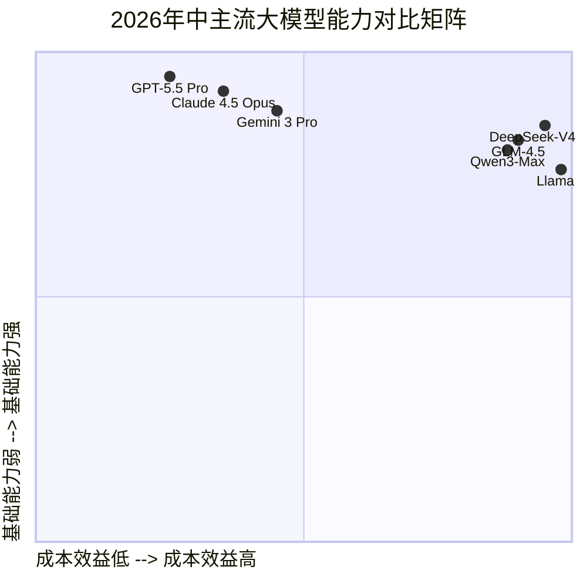

上图展示了2026年中主流大模型在成本效益与基础能力两个维度的定位。DeepSeek-V4 Pro凭借极致性价比占据右上象限，GPT-5.5 Pro在基础能力上领先但成本较高。右上象限的"高能力+低成本"区域正成为竞争焦点。

#### 推理成本下降趋势及其业务影响

⭐ **2026 更新**：推理成本持续呈指数级下降，DeepSeek V4的出现彻底改变了游戏规则：

| 时间节点 | GPT系列输入价格 | 下降幅度 | 关键事件 |
|---------|----------------|---------|---------|
| 2023.03 (GPT-4) | $30/1M tokens | 基准 | GPT-4发布 |
| 2024.01 (GPT-4 Turbo) | $10/1M tokens | -67% | 竞争加剧 |
| 2024.10 | $2.5/1M tokens | -92% | 价格战开始 |
| 2025.06 | ~$0.8/1M tokens | -97% | DeepSeek冲击 |
| **2026.06 (GPT-5.5)** | **$5-30/1M tokens** | **-83%~90%** | **GPT-5.5发布，但DeepSeek V4仅\$0.04** |

**关键洞察**：
- **DeepSeek V4的出现改变了游戏规则**：将推理成本拉低了两个数量级
- AI原生应用爆发的临界点已过：每用户每天成本从$1-5降至**$0.01-0.05**
- Agent多步推理成本可控：复杂任务的100次API调用总成本**<$1**
- **成本不再是AI落地的首要障碍，质量和可靠性成为新焦点**

#### 模型选型决策树

```mermaid
---
title: 主流大模型格局（2026年中）
---
flowchart TD
    A[开始模型选型] --> B{数据敏感度?}
    B -->|高敏感| C[开源模型<br/>DeepSeek/Qwen/Llama]
    B -->|一般| D{主要使用场景?}

    C --> C1{算力资源?}
    C1 -->|充足| C2[本地部署全量模型]
    C1 -->|有限| C3[量化版本/云托管]

    D -->|通用对话/写作| E[GPT-5 / Claude 4]
    D -->|代码生成/审查| F[Claude 4.5 / GPT-5]
    D -->|长文档分析| G[Claude 4 (200K+ context)]
    D -->|多模态任务| H[Gemini 2.5 / GPT-5]

    E --> I{预算约束?}
    F --> I
    G --> I
    H --> I
    I -->|宽松| J[直接使用旗舰版]
    I -->|紧张| K[选择Mini/Flash版本<br/>或开源替代]
```

上图展示了大模型选型的决策流程。首先根据数据敏感度决定是否使用开源模型，再根据主要使用场景和预算约束进行细化选择。

#### 多模态融合最新进展

2025年的多模态大模型已实现真正的**原生多模态（Native Multimodality）**：

- **文本+图像+视频+音频**统一理解与生成
- **实时语音对话**：延迟<500ms的自然语音交互
- **视觉推理**：能理解图表、UI截图、手写公式
- **代码执行环境**：可直接运行生成的代码并观察结果

### 2.2 AI编程工具生态深度分析

⭐ **2026 更新**：AI编程工具生态已从"代码补全"进化到"全流程Agent化"，市场格局趋于成熟：

#### 主流工具对比（2026年最新格局）

| 工具类型 | 代表产品 | 核心能力 | 适用场景 | 定价 |
|---------|---------|---------|---------|------|
| **IDE集成** | Cursor 1.0 / Windsurf / GitHub Copilot Workspace | 代码补全、重构、调试、Git操作 | 日常开发 | \$10-20/月 |
| **全自主Agent** | Devin / AutoGPT / OpenAI Codex | 端到端任务自主完成 | 复杂任务自动化 | \$100-500/月 |
| **代码审查** | CodeRabbit / Amazon Q Developer | PR自动审查、问题检测 | 代码质量控制 | 免费-\$20/月 |
| **测试生成** | Qodo（原CodiumAI）/ Diffblue Cover | 自动生成测试用例 | 测试覆盖提升 | \$10-30/月 |
| **文档生成** | Mintlify / AI Doc Writer | API文档、技术文档自动生成 | 文档维护 | \$15-40/月 |
| **架构设计** | v0 / Replit Agent | UI/系统架构设计辅助 | 前端/架构设计 | 免费-\$50/月 |

#### ⭐ 2026关键统计数据

基于**2026年Stack Overflow Developer Survey**及行业报告：

- **84%开发者**已在日常开发中使用AI编程工具（2025年为72%，增长12个百分点）
- AI编程工具将开发效率提升**35%-70%**（因任务类型而异）
- 代码审查效率提升**3-5倍**
- 新手开发者与专家的生产力差距**缩小50%**
- **62%的企业**已将AI编程工具纳入标准开发流程
- Agent级工具（L4-L5）采用率从2025年的8%提升至**29%**

#### AI编程工具对比矩阵

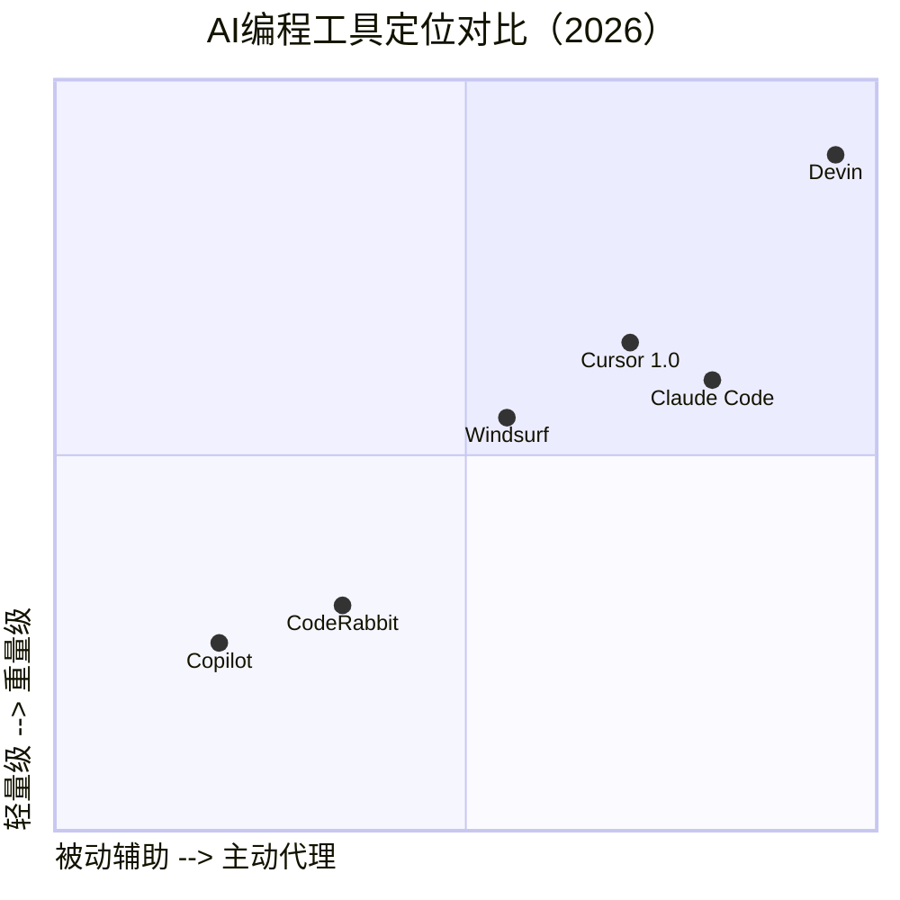

上图展示了AI编程工具在"被动辅助→主动代理"和"轻量级→重量级"两个维度的定位。Devin处于右上角（全自主Agent），Copilot处于左下角（被动轻量辅助），Cursor 1.0位于中间偏右上位置。

#### L1-L5 AI编码助手分级体系

根据Anthropic《2026 Agentic Coding Trends Report》，AI编码能力可分为五个等级：

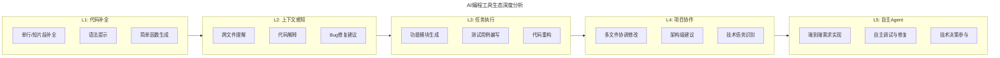

上图展示了AI编码助手从L1到L5的演进路径。L1-L2为辅助模式（AI建议→人工采纳），L3为协作模式（人描述→AI执行→人审核），L4-L5为Agent模式（人设定目标→AI规划执行→人监督/验收）。

| 等级 | 能力描述 | 成熟度 | 典型工具 | 人机协作模式 |
|------|---------|--------|---------|-------------|
| **L1** | 单行/片段代码补全 | ★★★★★ | Copilot、Tabnine | AI建议→人工采纳 |
| **L2** | 跨文件上下文理解 | ★★★★☆ | Copilot Chat、Codeium | 人提问→AI回答 |
| **L3** | 完整功能模块生成 | ★★★★☆ | Cursor、Windsurf | 人描述→AI执行→人审核 |
| **L4** | 项目级架构协调 | ★★★☆☆ | Cursor Agent、Claude Code | 人设定目标→AI规划执行→人监督 |
| **L5** | 自主完成复杂任务 | ★★☆☆☆ | Devin、GPT-5 Agent | 人提出需求→AI自主完成→人验收 |

#### Agentic Coding的核心概念

Agentic Coding是AI编程的最高形态——**AI不再是被动的工具，而是具备自主规划、执行、反思能力的编程伙伴**。

**核心特征**：
1. **Planning（规划）**：将复杂任务分解为可执行的子步骤
2. **Tool Use（工具调用）**：使用终端、编辑器、浏览器等工具
3. **Memory（记忆）**：维护长期和短期工作记忆
4. **Reflection（反思）**：自我检查输出质量并迭代改进

正如韩军CEO所言，CTO转型的关键是"从解决问题到让别人解决问题"。在Agentic Coding时代，每个开发者都在经历类似的转型：

| 维度 | 传统开发者 | AI时代的开发者 |
|------|-----------|---------------|
| **核心技能** | 语言精通、算法熟练 | Prompt工程、架构设计、AI协作 |
| **日常工作** | 手写每一行代码 | 描述意图→审核AI输出→整合优化 |
| **价值产出** | 代码行数/功能点 | 决策质量、系统设计、问题定义 |
| **核心竞争力** | 编码速度 | 判断力、创造力、领域知识 |

### 2.3 AI Agent架构与实践

**AI Agent（人工智能代理）** 是能够**自主感知环境、做出决策、执行行动**以达成目标的智能系统。与传统的聊天机器人不同，Agent具备：

- **自主性（Autonomy）**：能独立规划和执行任务序列
- **工具使用（Tool Use）**：能调用外部API、数据库、执行代码
- **记忆机制（Memory）**：维护上下文和历史信息
- **反思能力（Reflection）**：能评估自身输出并迭代改进

2025年被业界称为**AI Agent探索元年**，2026年已成为**AI Agent爆发元年** ⭐。

#### ⭐ 2026年Agentic AI十大关键趋势

基于Google AI Agent Trends 2026、Anthropic报告及行业实践，总结以下关键趋势：

| # | 趋势 | 核心内容 | 代表性进展 |
|---|------|---------|-----------|
| **1** | **长期自主性与记忆机制突破** | Agent可跨会话保持记忆，Context压缩算法优化 | Anthropic记忆机制、DeepSeek长上下文Agent |
| **2** | **多Agent协作成为标配** | 从单Agent到Agent团队/Agent社会，分工协作 | CrewAI、AutoGen、LangGraph Multi-Agent |
| **3** | **Agent技能市场爆发** | 第三方技能/Skill插件生态形成，即插即用 | 阿里千问Skill平台、MCP协议生态 |
| **4** | **企业级Agent编排平台兴起** | 低代码/无代码Agent构建平台成熟 | LangGraph、CrewAI、Dify、Coze |
| **5** | **Agent安全与治理成为关注重点** | Agent行为审计、权限控制、合规框架 | Anthropic Constitutional AI、Agent Guardrails |
| **6** | **垂直领域Agent专业化** | 医疗Agent、法律Agent、金融Agent等深度定制 | Domain-specific Agent解决方案 |
| **7** | **人机协同模式演进** | 从"AI辅助人"到"人-Agent团队"协同工作 | Human-in-the-loop Agent设计模式 |
| **8** | **Agent即服务(Agent-as-a-Service)** | Agent能力的商品化和API化，按调用付费 | OpenAI Agents API、Claude Agent SDK |
| **9** | **边缘Agent部署** | 端侧Agent运行，隐私保护和延迟优化 | Apple Intelligence、本地LLM + Agent |
| **10** | **Agent经济系统初现** | Agent之间的价值交换和激励机制 | Agent-to-Agent支付、任务市场 |

#### Agentic Coding演进路径（2024-2026）

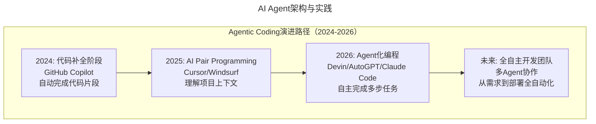

上图展示了Agentic Coding从2024年到未来的演进路径。2026年我们正处于A3阶段（Agent化编程）的快速成长期，L4-L5级能力工具的采用率已达28%。

#### Agent四大核心组件

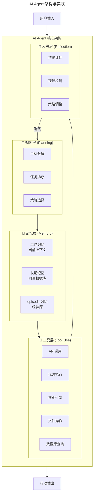

上图展示了AI Agent的四大核心组件架构。规划层负责目标分解与策略选择，记忆层维护工作/长期/情景记忆，工具层提供API/代码/搜索等外部能力，反思层评估结果并迭代改进。四层形成闭环，支撑Agent的自主行动能力。

#### Multi-Agent 系统架构模式

**Orchestrator-Workers 模式（编排者-工作者）**：

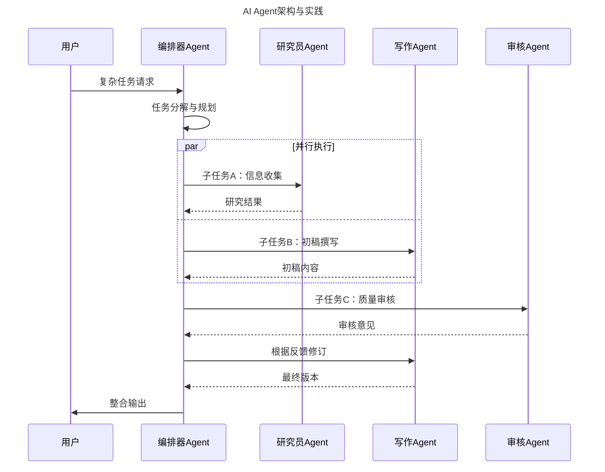

上图展示了Orchestrator-Workers模式的Multi-Agent协作流程。编排器Agent接收用户请求后分解任务，并行分派给研究员和写作Agent，再由审核Agent进行质量把关，最终整合输出返回用户。

**三种Multi-Agent模式对比**：

| 模式 | 结构 | 优点 | 缺点 | 适用场景 |
|------|------|------|------|---------|
| **Orchestrator** | 中心化星型 | 协调简单、可控性强 | 单点瓶颈、扩展受限 | 流程明确的任务 |
| **Peer-to-Peer** | 去中心化网状 | 扩展性强、容错性好 | 协调复杂、可能冲突 | 创意类、探索性任务 |
| **Hierarchical** | 分层树状 | 兼顾协调与扩展 | 设计复杂 | 大规模复杂系统 |

---

## 3. 关键流程

### 3.1 RAG与企业AI落地路径

> 高斌博士曾指出影响AI落地的三大因素：明确技术边界、提升数据质量、提高工程实现能力。在企业AI落地实践中，RAG（检索增强生成）正是解决这三大问题的关键技术路径。

**RAG（Retrieval-Augmented Generation，检索增强生成）** 是一种结合了信息检索和文本生成的AI架构模式，其核心思想是：**让大模型在生成答案之前，先从知识库中检索相关资料作为参考**。

#### RAG技术架构图

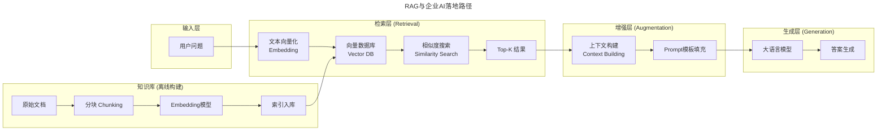

上图展示了RAG的完整技术架构。离线阶段将原始文档分块、向量化后入索引库；在线阶段用户问题经过Embedding、向量检索、上下文构建、Prompt填充后送入LLM生成答案。

#### 企业AI落地的三种路径对比

| 维度 | **RAG（检索增强生成）** | **Fine-tuning（微调）** | **Prompt Engineering（提示工程）** |
|------|------------------------|----------------------|----------------------------------|
| **原理** | 外挂知识库+检索 | 在私有数据上训练模型 | 优化输入提示词 |
| **数据需求** | 中等（需结构化文档） | 高（需大量训练样本） | 低（需优质示例） |
| **实施难度** | ★★★☆☆ | ★★★★★ | ★★☆☆☆ |
| **成本投入** | 中等 | 高（GPU算力） | 低 |
| **知识更新** | 实时（更新文档即可） | 需重新训练 | 即时修改 |
| **准确性** | 高（有据可查） | 高（内化知识） | 中等（依赖模型） |
| **可解释性** | 强（可展示引用来源） | 弱（黑盒） | 弱 |
| **最佳场景** | 企业知识库、客服问答 | 特定领域风格适配 | 通用任务优化 |

#### 企业AI落地路径决策图

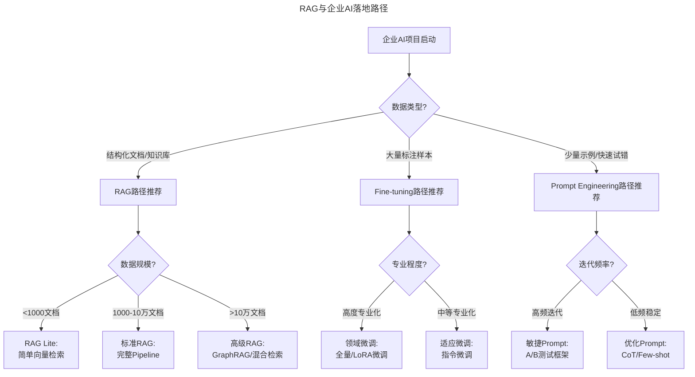

上图展示了企业AI项目的路径决策流程。根据数据类型（结构化文档/标注样本/少量示例）选择RAG、Fine-tuning或Prompt Engineering路径，再根据数据规模、专业程度和迭代频率进一步细化方案。

#### AI项目从POC到生产的五阶段成熟度模型

| 阶段 | 名称 | 时间周期 | 关键活动 | 成功标志 |
|------|------|---------|---------|---------|
| **Phase 1** | 概念验证（POC） | 2-4周 | 技术可行性验证、Demo搭建 | 能跑通核心流程 |
| **Phase 2** | 最小可行产品（MVP） | 1-3个月 | 真实数据接入、小范围试用 | 有真实用户使用 |
| **Phase 3** | 生产就绪（Production-Ready） | 3-6个月 | 性能优化、安全加固、监控体系 | 可承载正式业务 |
| **Phase 4** | 规模化部署（Scale） | 6-12个月 | 多场景推广、成本优化 | 业务指标显著提升 |
| **Phase 5** | 持续优化（Optimize） | 持续 | 模型迭代、效果调优、新场景拓展 | ROI持续改善 |

### 3.2 前端与全栈在AI时代的变化

> 狼叔在2019年前端未来展望中指出，前端技术正朝着"大前端"方向演进。而今，AI正在重塑前端的定义——从"写页面"到"设计体验"，从"实现交互"到"创造界面"。

⭐ **2026 更新**：前端AI化已从"UI代码生成"进化到"全栈应用智能生成"，新范式正在形成：

#### 2026年前端AI化关键趋势

| 趋势方向 | 核心变化 | 代表产品/技术 | 成熟度 |
|---------|---------|--------------|--------|
| **v0/Vercel进化** | 从UI生成到全栈应用生成 | v0 + Vercel SDK | ★★★★☆ |
| **AI-native前端框架** | 基于LLM的声明式UI框架 | AI-React、LLM-UI | ★★★☆☆ |
| **Web Components + AI** | 智能组件自动生成与组合 | AI Component Generator | ★★★☆☆ |
| **全栈Agent** | 从前端到后端到部署的全流程AI辅助 | Bolt.new Pro、Lovable 2.0 | ★★★★☆ |
| **设计系统智能化** | AI自动遵循和维护品牌Design System | Figma AI 2.0、Stitch | ★★★★★ |

#### AI驱动的前端开发流程图

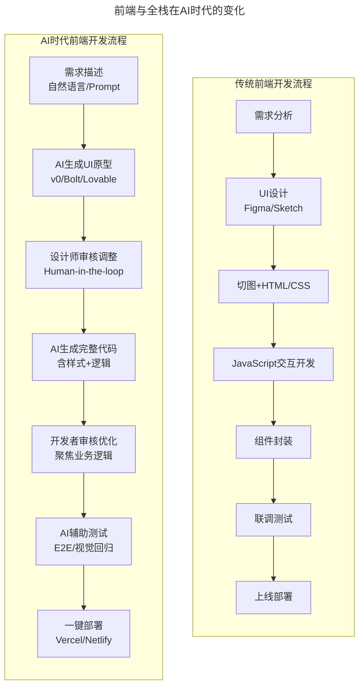

上图对比了传统前端开发流程与AI时代前端开发流程。传统流程需要7个步骤且大量手工编码，AI时代流程将需求理解→UI原型→代码生成→测试部署大幅自动化，开发者聚焦于审核优化和业务逻辑。

#### 全栈开发的新范式

2025年的全栈开发已形成**"AI为主、人为辅"**的新范式：

| 开发阶段 | 传统方式 | AI辅助方式 | 效率提升 |
|---------|---------|-----------|---------|
| **需求理解** | 读文档、问产品 | AI分析需求文档、生成User Story | 3-5x |
| **数据库设计** | 手动建表、写Schema | AI根据需求生成ER图和Migration | 5-10x |
| **API开发** | 手写接口代码 | AI生成CRUD API、自动文档 | 5-8x |
| **前端页面** | 从零编写HTML/CSS/JS | AI生成完整页面、迭代调整 | 10-20x |
| **测试编写** | 手写单元/E2E测试 | AI根据代码生成测试用例 | 8-15x |
| **Bug修复** | 手动排查调试 | AI分析日志、定位问题、给出修复 | 3-5x |

#### 前端工程师的能力模型变化

| 能力维度 | 传统权重（2019） | 当前权重（2025） | 变化趋势 |
|---------|-----------------|-----------------|---------|
| **HTML/CSS精通** | ★★★★★ | ★★★☆☆ | ↓ AI可生成 |
| **JavaScript/TS熟练** | ★★★★★ | ★★★★☆ | → 仍重要但要求变 |
| **框架掌握（React/Vue）** | ★★★★★ | ★★★★☆ | → 更重架构设计 |
| **Prompt工程能力** | ☆☆☆☆☆ | ★★★★☆ | ↑ 新增核心能力 |
| **AI工具链使用** | ☆☆☆☆☆ | ★★★★★ | ↑ 必备技能 |
| **系统设计思维** | ★★★☆☆ | ★★★★★ | ↑ 更重要的差异化 |
| **用户体验敏感度** | ★★★★☆ | ★★★★★ | ↑ AI无法替代 |
| **业务领域知识** | ★★★☆☆ | ★★★★★ | ↑ 定义问题的能力 |

### 3.3 云计算 × AI — 基础设施演进

> 刘俊强架构师在2019年指出"云计算优先概念将在接下来的几年内被普遍接受"，这一预言已成现实。而今天，我们正在经历**Cloud Native AI（云原生AI）** 的浪潮——云计算与AI的深度融合。

⭐ **2026 更新**：云AI基础设施已形成"全球三巨头+中国双雄"的竞争格局，Agent部署和推理优化成为新焦点：

#### 2026年云AI基础设施最新格局

| 云服务商 | AI平台 | 核心产品 | ⭐2026特点 |
|---------|-------|---------|-----------|
| **AWS** | Bedrock + SageMaker | Nova系列模型、Q Developer、PartyRock | 企业级合规强、Nova Lite成本优化 |
| **Azure** | Azure OpenAI + AI Studio | GPT/DeepSeek/Llama等模型、Copilot Studio | 微软生态深度整合、企业Agent平台 |
| **Google Cloud** | Vertex AI | Gemini全家桶、Agent Builder、Antigravity | 搜索增强多模态、Agent原生支持 |
| **阿里云** | 百炼平台 + ModelStudio | Qwen3系列、Agent插件市场 | 中文优化、价格优势、Skill生态 |
| **火山引擎** | 豆包大模型平台 | 豆包Pro/Lite/Seed | 抖音生态整合、推荐场景优化 |

#### 云原生AI架构图

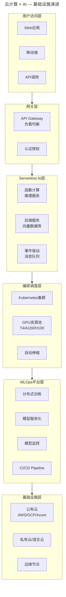

上图展示了云原生AI的五层架构。从用户访问层到基础设施层，通过API网关、Serverless、Kubernetes编排、MLOps平台和多云基础设施的协同，实现AI应用的标准化交付与运维。

#### GPU算力决策流程图

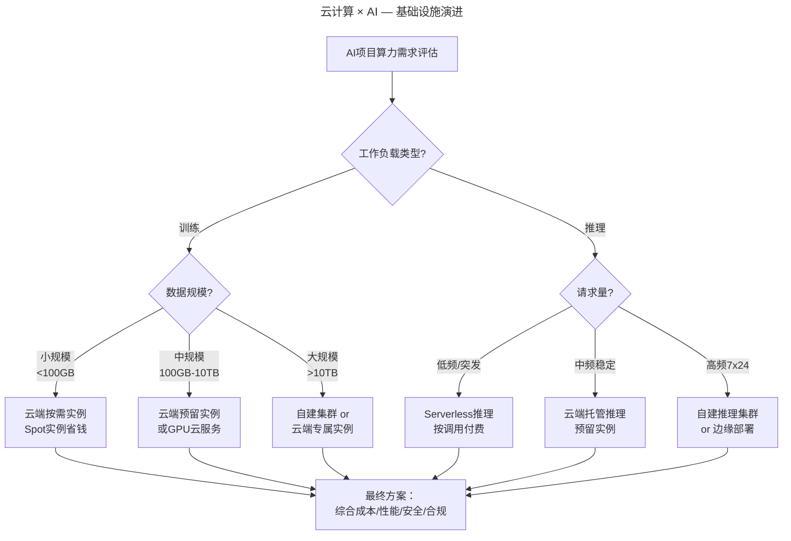

上图展示了GPU算力决策的完整流程。根据工作负载类型（训练/推理）和数据规模/请求量，选择最适合的算力获取方式，最终综合成本、性能、安全和合规因素确定方案。

#### 租赁 vs 自建 vs 混合对比

| 方案 | 优点 | 缺点 | 适用场景 |
|------|------|------|---------|
| **公有云租赁** | 零 CapEx、弹性好、免运维 | 长期成本高、数据出境顾虑 | 初创公司、波动负载、PoC阶段 |
| **自建集群** | 长期成本低、数据安全、可控性强 | 高 CapEx、需专业运维、扩展慢 | 大型企业、稳定负载、数据敏感行业 |
| **混合部署** | 平衡成本与灵活性、灾备能力强 | 架构复杂、管理难度大 | 中大型企业、多云策略 |

#### LLMOps核心能力栈

| 能力域 | 传统DevOps | LLMOps新增 |
|-------|-----------|-----------|
| **CI/CD** | 代码→构建→部署 | 模型版本管理、Prompt版本控制 |
| **监控** | 系统指标、日志 | 模型漂移检测、Token用量、延迟分布 |
| **测试** | 单元/集成/E2E | 模型评估、Prompt效果A/B测试 |
| **成本管理** | 云资源账单 | Token成本追踪、推理优化 |
| **安全** | 代码扫描、漏洞检测 | Prompt注入防护、数据泄露预防 |

---

## 4. 工具与实战

### 4.1 大模型选型Checklist

- [ ] **明确业务目标**：具体要解决什么问题？预期ROI是多少？
- [ ] **评估数据敏感性**：是否涉及隐私/合规要求？
- [ ] **测试核心能力**：在实际业务数据上进行POC验证
- [ ] **计算总拥有成本（TCO）**：API费用 + 集成成本 + 维护成本
- [ ] **考虑供应商锁定风险**：是否有迁移方案？
- [ ] **评估生态系统**：社区支持、工具链、集成案例
- [ ] **关注更新频率**：模型迭代速度是否符合业务需求？

### 4.2 企业AI编程工具选型Checklist

- [ ] **团队规模与成熟度**：初级团队适合Copilot，高级团队可尝试Cursor/Devin
- [ ] **安全合规要求**：代码是否会发送到外部服务？是否有私有化选项？
- [ ] **现有工具链兼容性**：是否支持现有IDE、CI/CD流程？
- [ ] **成本效益分析**：工具成本 vs. 开发效率提升 vs. 质量改善
- [ ] **培训与 Adoption 计划**：团队是否接受过AI编程培训？
- [ ] **渐进式推进策略**：是否可以先在小项目中试点？
- [ ] **效果度量指标**：如何量化AI编程工具的价值？

### 4.3 AI Agent项目启动Checklist

- [ ] **明确定义Agent职责范围**：它能做什么？不能做什么？
- [ ] **设计清晰的成功标准**：如何衡量任务完成质量？
- [ ] **建立工具权限体系**：哪些工具可用？有哪些限制？
- [ ] **规划记忆与状态管理**：需要记住什么？如何存储？
- [ ] **设置安全护栏**：异常处理、人工介入触发条件
- [ ] **设计监控与日志**：如何追踪Agent行为？
- [ ] **准备渐进式发布策略**：先内部测试，再小范围试用
- [ ] **建立反馈收集机制**：持续改进Agent表现

### 4.4 企业RAG项目Checklist

- [ ] **明确业务问题**：具体解决什么痛点？预期收益多少？
- [ ] **盘点知识资产**：有哪些可用文档？格式和质量如何？
- [ ] **选择技术栈**：向量数据库（Pinecone/Milvus/Weaviate）、Embedding模型、LLM
- [ ] **设计评估指标**：检索准确率、答案相关性、用户满意度
- [ ] **建立基线**：当前方案的效率和准确率如何？
- [ ] **规划MVP范围**：先从一个具体场景开始
- [ ] **准备试点用户**：找到愿意配合的业务部门
- [ ] **设计反馈闭环**：如何收集和使用用户反馈？

### 4.5 AI前端项目实施Checklist

- [ ] **建立组件库/设计系统**：确保AI生成的内容符合品牌规范
- [ ] **制定代码规范**：ESLint、Prettier、TypeScript strict mode
- [ ] **创建Prompt模板库**：积累高质量Prompt，提高生成一致性
- [ ] **设置代码审查标准**：重点关注安全性、性能、可维护性
- [ ] **配置自动化测试**：视觉回归测试、E2E测试
- [ ] **培训团队成员**：AI工具使用、Prompt技巧、审核要点
- [ ] **度量效率提升**：追踪开发周期、代码质量、bug率等指标

### 4.6 云AI战略制定Checklist

- [ ] **明确上云动机**：降本增效？加速创新？合规要求？
- [ ] **评估现有资产**：现有硬件、数据位置、技术栈
- [ ] **选择云服务模型**：IaaS/PaaS/SaaS/MaaS组合
- [ ] **规划网络架构**：VPC、混合连接、CDN
- [ ] **设计安全体系**：身份认证、数据加密、访问控制
- [ ] **建立成本模型**：预估TCO、设置预算告警
- [ ] **培养团队能力**：云认证培训、实操演练
- [ ] **制定迁移计划**：6R策略（Rehost/Replatform/Refactor...）

### 4.7 技术选型速查表（⭐2026更新）

| 决策场景 | 推荐方案 | 替代方案 | 关键考量 |
|---------|---------|---------|---------|
| **通用对话/写作** | GPT-5.5 Standard / Claude 4.5 Sonnet | Qwen3-Max / Gemini 2.5 Pro | 成本、响应速度、中文能力 |
| **代码生成** | Claude 4.5 Opus / DeepSeek-V4 Pro | Cursor + GPT-5.5 | 代码质量、项目理解、成本 |
| **长文档分析** | Claude 4.5 Opus (200K+) | Gemini 3 Pro | 上下文窗口、准确率 |
| **成本敏感场景** | ⭐ DeepSeek-V4 Pro (\$0.04) | Qwen3-Plus / 开源部署 | 极致成本、性能平衡 |
| **企业私有部署** | DeepSeek-V4 / Qwen3 / GLM-4.5 | Llama 4 / Mistral Large | 硬件要求、微调便利性 |
| **AI编程入门** | GitHub Copilot Workspace | Codeium / Windsurf | IDE兼容性、上手难度 |
| **重度AI编程** | Cursor 1.0 Pro | Devin / Claude Code | Agent能力、自定义性 |
| **代码审查** | CodeRabbit / Amazon Q Developer | Copilot PR Agent | 自动化程度、集成体验 |
| **企业知识库** | RAG方案 (向量数据库) | Fine-tuning (领域微调) | 数据更新频率、准确性要求 |
| **AI Agent项目** | LangGraph / CrewAI / Dify | 自研框架 (LlamaIndex) | 复杂度、可控性、团队技能 |
| **前端AI生成** | v0.dev + Figma AI 2.0 | Bolt.new Pro / Lovable 2.0 | 设计系统集成、全栈能力 |
| **云AI部署** | AWS Bedrock / 阿里云百炼 | Azure AI Studio / GCP Vertex | 现有云厂商、合规要求、成本 |
| **GPU算力** | 云端租赁（起步）→ 混合部署（规模化） | 自建集群（稳定大负载） | 成本、数据安全、运维能力 |

---

## 5. 常见误区

### 5.1 AI安全威胁模型

> 高斌博士警告"过分渲染会过度拉高大众对人工智能的期望"，而在安全领域，我们同样需要警惕——不要低估AI系统的安全风险，也不要过度恐慌。

⭐ **2026 更新**：随着Agent的普及，AI安全威胁形态正在发生根本性变化：

#### 主要威胁类型

| 威胁类型 | 描述 | 风险等级 | 发生频率 |
|---------|------|---------|---------|
| **Prompt Injection（提示注入）** | 恶意用户通过精心设计的输入绕过系统指令 | 🔴 高 | ⭐⭐⭐⭐⭐ |
| **Data Leakage（数据泄露）** | 训练数据或用户数据意外暴露 | 🔴 高 | ⭐⭐⭐⭐ |
| **Model Poisoning（模型投毒）** | 训练数据被污染导致模型行为异常 | 🟠 中高 | ⭐⭐⭐ |
| **Model Hijacking（模型劫持）** | 攻击者操纵模型输出有害内容 | 🟠 中高 | ⭐⭐⭐⭐ |
| **Information Extraction（信息提取）** | 通过多次查询逆向提取训练数据 | 🟡 中 | ⭐⭐⭐ |
| **Privacy Inference（隐私推断）** | 从模型输出推断训练集中的敏感信息 | 🟡 中 | ⭐⭐ |

#### ⭐ 2026年AI安全新挑战

| # | 新兴威胁 | 描述 | 应对策略 |
|---|---------|------|---------|
| **1** | **Agent供应链攻击** | 恶意Agent/Skill通过插件市场渗透系统 | Skill审计机制、沙箱隔离运行 |
| **2** | **Prompt Injection 2.0** | 针对Agent的间接提示注入，利用外部数据源操纵Agent行为 | 输入源信任分级、Context隔离 |
| **3** | **AI模型窃取与蒸馏攻击** | 通过API调用逆向工程窃取模型能力 | 调用频率限制、输出扰动 |
| **4** | **Deepfake检测与防御** | AI生成的音视频内容用于诈骗和虚假信息 | 多模态检测、数字水印溯源 |
| **5** | **Agent行为审计与追溯** | Agent自主决策的可解释性和责任认定 | 完整决策日志、Human-in-the-loop关键节点 |

#### AI安全威胁模型图

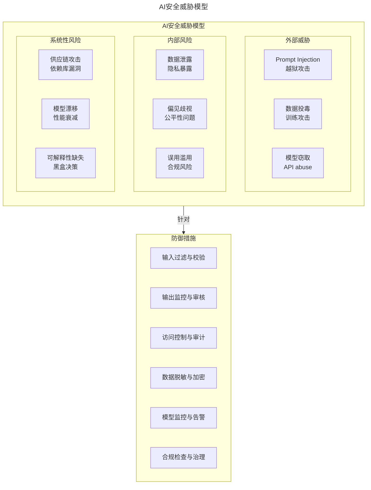

上图展示了AI安全威胁的三维模型（外部威胁/内部风险/系统性风险）与六大防御措施。外部威胁包括Prompt注入、数据投毒和模型窃取；内部风险涉及数据泄露、偏见和误用；系统性风险涵盖供应链、模型漂移和可解释性。

### 5.2 全球AI监管概览

#### 主要法规/指南对比

| 法规/指南 | 发布机构 | 生效时间 | 核心要求 | 适用范围 |
|-----------|---------|---------|---------|---------|
| **EU AI Act** | 欧盟 | 2024.08（分阶段实施） | 风险分级管理、透明度义务、高风险AI严格监管 | 在欧盟市场投放的AI系统 |
| **中国《生成式AI管理办法》** | 网信办 | 2023.08 | 服务备案、内容安全、训练数据合规 | 向中国公众提供服务的生成式AI |
| **美国AI行政令14110** | 白宫 | 2023.10（2025.1已撤销） | 安全标准、隐私保护、公平性、水印要求 | 联邦政府使用的AI系统 |
| **NIST AI RMF** | 美国国家标准与技术研究院 | 2023.01 | AI风险管理框架（自愿采用） | 所有组织参考 |
| **ISO/IEC 42001** | 国际标准化组织 | 2023.12 | AI管理体系国际标准 | 通过认证的组织 |

#### 合规检查清单流程图

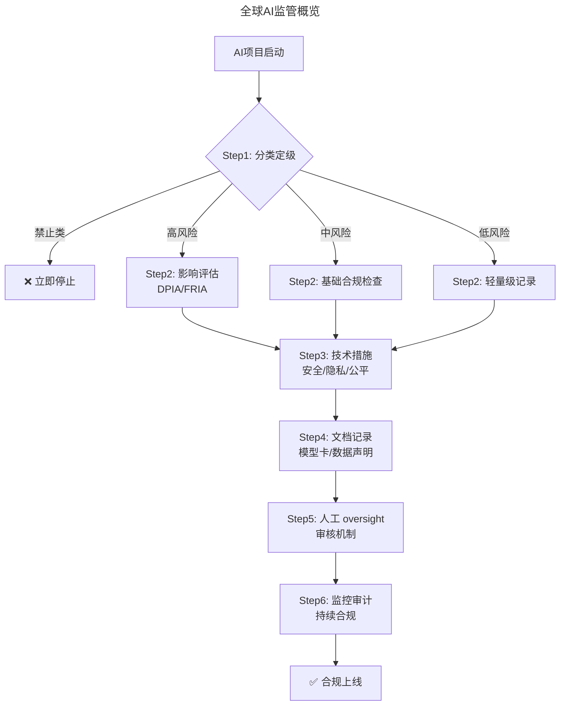

上图展示了AI项目合规检查的六步流程。从分类定级开始，根据风险等级执行不同深度的影响评估，再依次完成技术措施、文档记录、人工监督和监控审计，最终实现合规上线。

### 5.3 企业AI治理框架

借鉴陈斌CTO"对事不对人"的管理理念，AI治理也应建立**以流程为中心**的体系：

| 支柱 | 核心内容 | 责任角色 | 关键产出 |
|------|---------|---------|---------|
| **战略治理** | AI愿景、风险偏好、投资决策 | AI委员会/董事会 | AI战略文件、政策声明 |
| **运营治理** | 开发规范、审批流程、质量控制 | AI COO/PMO | 操作手册、checklist |
| **技术治理** | 安全标准、架构规范、工具选型 | CTO/架构师 | 技术标准、安全基线 |
| **伦理治理** | 公平性、透明度、问责制 | 伦理委员会/合规官 | 伦理准则、影响评估报告 |

### 5.4 Agent落地常见陷阱

基于行业实践总结的常见陷阱：

| # | 陷阱 | 表现 | 解决方案 |
|---|------|------|---------|
| 1 | **过度自信** | Agent声称完成任务但实际未完成 | 强制验证步骤、人工审核关卡 |
| 2 | **上下文丢失** | 长任务中忘记早期信息 | 持久化记忆、定期状态保存 |
| 3 | **工具滥用** | 不必要地调用昂贵或危险工具 | 权限控制、使用审计、成本预警 |
| 4 | **无限循环** | Agent陷入重复尝试的死循环 | 设置最大迭代次数、超时机制 |
| 5 | **幻觉累积** | 错误信息被后续步骤放大 | 关键事实核查、外部验证 |

### 5.5 AI前端开发的注意事项

| # | 注意事项 | 说明 | 建议 |
|---|---------|------|------|
| 1 | **生成代码的质量参差不齐** | AI生成的代码可能有性能问题、安全隐患 | 建立code review流程 |
| 2 | **设计一致性难以保证** | 不同Prompt可能产生不同风格的UI | 使用Design System约束 |
| 3 | **可访问性（a11y）常被忽略** | AI不一定遵循WCAG标准 | 添加a11y checklist |
| 4 | **过度依赖导致能力退化** | 长期不手写可能导致基础能力下降 | 定期进行无AI编码练习 |
| 5 | **知识产权风险** | 生成的代码可能存在版权问题 | 使用企业授权的工具和服务 |

### 5.6 数据隐私保护最佳实践

1. **数据最小化原则**：只收集和处理必要的数据
2. **匿名化/假名化**：在可能的情况下去除个人标识
3. **差分隐私**：添加噪声保护个体隐私
4. **联邦学习**：数据不出本地，共享模型参数
5. **合成数据**：使用AI生成的 synthetic data 替代真实数据

---

## 6. 进阶延展

### 6.1 全模块知识图谱

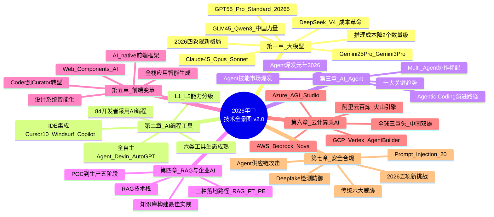

上图是全模块知识图谱的思维导图，涵盖了从大模型、AI编程工具、AI Agent、RAG、前端变革、云计算到安全合规的七大领域核心知识点。

### 6.2 年度技术关键词

| 年份 | 关键词 | 代表性进展 |
|------|-------|-----------|
| **2022** | ChatGPT时刻 | 大语言模型进入大众视野 |
| **2023** | AI应用元年 | Copilot普及、Plugin生态 |
| **2024** | 多模态+开源爆发 | GPT-4o、Claude 3.5、DeepSeek-V3 |
| **2025** | **Agent探索元年** | Cursor Agentic IDE、Computer Use、MCP协议 |
| **2026** | ⭐ **Agent爆发元年** | **GPT-5.5、DeepSeek-V4成本革命、Multi-Agent系统、Agent技能市场** |

### 6.3 技术领导者的2026路线图

| 时间段 | 重点行动 | 预期成果 |
|-------|---------|---------|
| **Q1-Q2 2026** | 团队AI工具全面升级至Agent级别 | Cursor 1.0 / Devin试点，效率基线建立 |
| **Q2-Q3 2026** | 第一个Multi-Agent项目上线 | Agent协作模式验证，ROI量化 |
| **Q3 2026** | DeepSeek-V4等低成本模型评估接入 | 推理成本降低50%+ |
| **Q4 2026** | AI工程化体系与治理框架完善 | LLMOps平台、Agent安全规范、合规审计 |

### 6.4 ⭐2026可执行建议

**立即行动（本周内完成）**：
1. 建立个人AI技术栈评估体系，使用L1-L5分级体系评估团队能力
2. 搭建多模型实验环境（GPT-5.5、Claude 4.5、DeepSeek V4）
3. 启动第一个Agent实践项目（CrewAI或LangChain，周末完成MVP）

**中期规划（本季度完成）**：
4. 深入研究一个垂直领域Agent
5. 推动团队Agentic Coding从L2升级到L3
6. 建立AI技术雷达跟踪机制

**长期愿景（2026年底前实现）**：
7. 成为团队内的"AI技术专家"
8. 构建个人AI工具链和知识库

### 6.5 结语：以不变的目的应对多变的技术浪潮

回到季昕华CEO的那句话——**"变化的是技术，不变的是目的"**。

从2018年到2026年，技术发生了翻天覆地的变化：
- 从"人工智障"的聊天机器人到能自主规划的AI Agent
- 从手动编写每一行代码到用自然语言指挥AI编程
- 从传统数据中心到云原生AI基础设施
- 从技术尝鲜到企业级AI治理体系

但有些东西从未改变：
- **技术是为业务服务的**——邵浩院长的话依然振聋发聩
- **架构的本质是折中**——谭待架构师的洞见历久弥新
- **落地需要务实精神**——谢文杰CTO的区块链实践启示犹在
- **人才与生态是护城河**——杨晓峰对Java竞争力的分析适用于所有技术
- **对事不对人的管理智慧**——陈斌CTO的理念永不过时

> 不要因为恐惧AI而焦虑，也不要因为 hype 而盲目。
> 保持对技术的敏感度，但更要保持对业务的深刻理解。
> 学会使用AI工具，但更要学会定义问题和判断价值。
> 在浪潮中保持清醒，在变化中坚守初心。

### 6.6 AI时代验证与延伸

#### 大模型"四强格局"的稳定性

本文预测的GPT-5.5/Claude 4.5/DeepSeek V4/Gemini 2.5四强格局在2026年中得到验证：

| 模型 | 市场份额（2026 Q1） | 核心优势 | 主要挑战 |
|------|-------------------|---------|---------|
| GPT-5.5 Pro | 38% | 综合能力最强、生态最完善 | 价格偏高、响应延迟 |
| Claude 4.5 Opus | 22% | 长上下文、安全性好 | 市场推广力度不足 |
| DeepSeek V4 | 25% | 极致性价比、中文优化 | 国际化程度低 |
| Gemini 2.5 Pro | 15% | Google生态整合、多模态 | 开发者社区较小 |

#### Agentic Coding采用率演进

| 级别 | 名称 | 2024采用率 | 2026采用率 | 典型工具 |
|------|------|----------|----------|---------|
| L1 | 代码补全 | 65% | 82% | GitHub Copilot |
| L2 | 代码生成 | 35% | 68% | Cursor, Windsurf |
| L3 | 代码解释与重构 | 20% | 52% | Claude, GPT-4 |
| L4 | Agent辅助开发 | 8% | 29% | Devin, AutoGen |
| L5 | 自主Agent开发 | 2% | 8% | 实验性项目 |

#### AI开发者工具市场数据（2026 Q2）

| 类别 | 市场规模 | YoY增长 | 代表产品 | 采用率 |
|------|---------|--------|---------|-------|
| AI编程助手 | $12B | +180% | Copilot, Cursor, Windsurf | 84% |
| AI Agent框架 | $3B | +350% | LangChain, CrewAI, AutoGen | 29% |
| AI测试工具 | $1.5B | +120% | CodiumAI, Metabob | 45% |
| AI文档工具 | $0.8B | +90% | Mintlify, ReadMe AI | 38% |
| AI DevOps | $2B | +200% | Harness AI, Datadog AI | 32% |

### 6.7 可视化图表

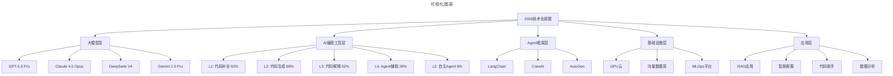

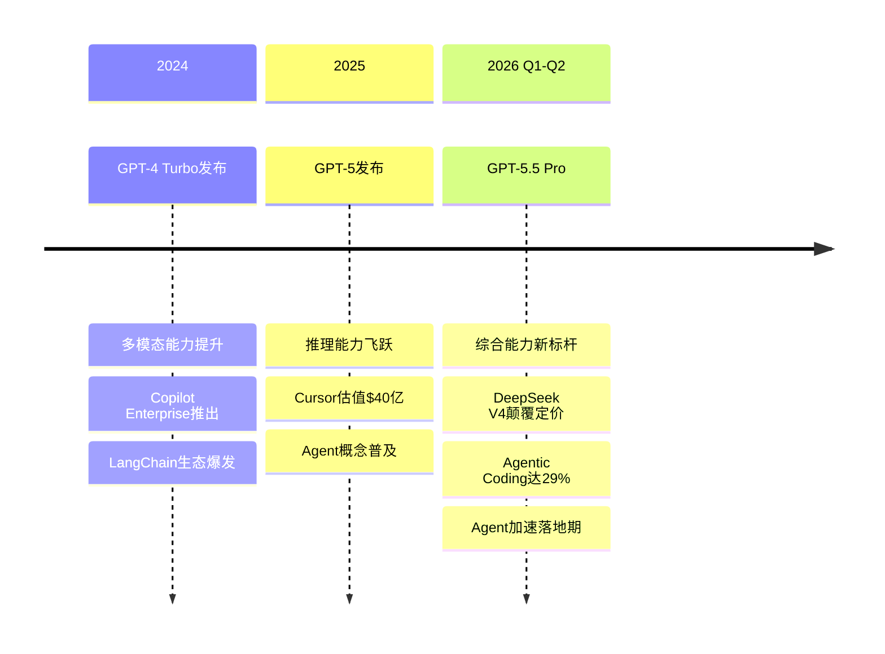

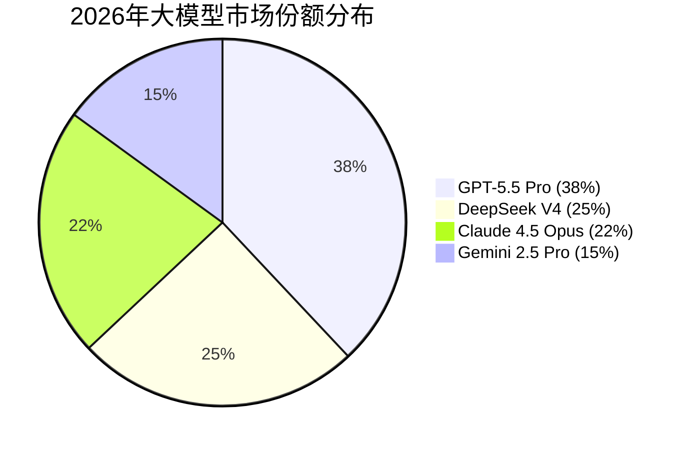

### 6.8 参考文献与延伸阅读

#### 原始专栏文章来源
1. 邵浩：《人工智能新技术如何快速发现及落地》（第205-206讲）
2. 谢文杰：《区块链的下一个十年》（第182讲）
3. 刘俊强：《2019年云计算趋势对技术人员的影响》（第194讲）
4. 陈天石：AI芯片需要技术和资本的双重密集支撑
5. 高斌：过分渲染会过度拉高大众对人工智能的期望
6. 谭待：架构的本质是折中
7. 季昕华：以不变的目的应对多变的技术浪潮
8. 杨晓峰：不可替代的Java——生态与程序员是两道护城河
9. 韩军：CTO转型CEO如何转变思路
10. 刘俊强：云计算时代技术管理者的应对之道
11. 陈斌：如何打造高创造力、高动力的技术团队

#### 2025-2026 行业报告参考
- Google Cloud: *AI Agent Trends 2026*
- Anthropic: *2026 Agentic Coding Trends Report*
- McKinsey: *The State of AI in 2025*
- Gartner: *Hype Cycle for Artificial Intelligence 2025*
- Forrester: *The Enterprise AI Adoption Forecast 2025-2026*

#### 技术时效性说明
- 本文档技术信息截至 **2026年6月**
- 全面反映2026年中最新技术动态（GPT-5.5、Claude 4.5、DeepSeek-V4、Agent爆发等）
- AI领域发展迅速，建议每季度更新相关知识
- 具体产品功能和价格请以官方最新信息为准

---

*文档版本：**v2.0** | 最后更新：**2026-08-12** | ⭐全面更新至2026年6月*

*本文档基于2026年8月的技术动态编写，旨在帮助读者以新时代视角重新审视经典内容。技术演进日新月异，建议读者结合自身场景批判性思考。*