# 政策与宏观环境 — AI时代的顺势而为

> **适用范围**：CTO、技术VP、AI产品负责人及企业合规负责人，尤其是需要将国家战略、全球监管趋势转化为企业技术战略和行动指南的技术领导者；同样适用于制定AI合规体系、算力战略和人才规划的管理者。
>
> **更新摘要（v2 · 2026-08 更新）**：
> - 结构化升级为 6 节骨架（导言 / 核心方法论 / 关键流程 / 工具与实战 / 常见误区 / 进阶延展）
> - 基于极客时间《技术领导力实战笔记》（2018-2019）第207、208、63、7讲及多期大咖对话，全面升级至2026年最新政策资料
> - 涵盖全球AI监管格局、企业合规实务、算力战略、数据安全、AI人才培养、顺势而为六大领域
> - 保留全部Mermaid图、数据表格与行动清单，补充2025-2026年最新法规动态与CTO五大策略

---

## 1. 导言

> **模块定位**：本模块是《技术领导力实战笔记》升级版的核心模块之一，旨在帮助技术领导者在AI时代建立宏观政策视野，将国家战略、全球监管趋势转化为企业技术战略和行动指南。
>
> **原始素材来源**：极客时间专栏《技术领导力实战笔记》（2018-2019）第207讲、第208讲、第63讲、第7讲及多期大咖对话，结合 **2025-2026年最新政策资料** 全面升级至 v2.0。

2019年科创板设立时，许良在专栏中写道："科技的进步和产业化推广都是需要巨大的资金来支持的。"这句话放到今天的AI监管语境下同样适用——**AI的发展不仅需要资金支持，更需要合规框架的保驾护航**。

⭐ **2026 关键判断**：2025年是中国AI治理立法完成从 **"搭框架"到"落地执行"** 的关键转型之年。各类政策法规、规章标准、办法条例密集发布，在AI重塑各行各业、数字化转型进入深水区的背景下，网络安全与数据治理体系全面升级。

正如第7讲郭炜所言："要制定技术战略，先看清局面。"今天这个"局面"，已经从公司内部延伸到全球政策环境。技术领导者理解全球AI监管格局不再是法律部门的专属工作，而是**制定技术战略的前置条件**。

---

## 2. 核心方法论

### 2.1 全球AI监管格局总览

2024年8月，欧盟AI Act正式生效，成为全球首部全面的AI法规。这标志着AI监管从"软法指引"进入"硬法规制"时代。

#### ⭐ 中国AI法规体系 — 2026年全景图

中国采取"**分领域立法 + 综合治理倡议 + 敏捷治理**"的路径：

| 法规名称 | 发布机构 | 发布/修订时间 | 核心内容 | 当前状态 |
|---------|---------|-------------|---------|---------|
| **⭐NEW《人工智能法（草案）》** | 全国人大常委会 | **2025（征求意见）** | 分类分级监管、风险评估、算法备案 | **⭐2026 征求意见中** |
| **《生成式人工智能服务管理暂行办法》** | 网信办等七部门 | 2023.7 | 内容安全、数据合规、标识义务 | 已生效实施 |
| **⭐NEW《数据安全法》实施细则** | 网信办 | **2024-2025** | 数据分类分级、跨境传输、安全评估 | **已生效** |
| **⭐NEW《个人信息保护法》配套规定** | 多部门 | **2024-2025** | 敏感个人信息、自动化决策、知情同意 | **持续完善中** |
| **《科技伦理审查办法（试行）》** | 科技部等多部门 | 2023 | AI伦理审查、风险评估 | 已试行 |
| **⭐NEW《深度合成管理规定》（修订版）** | 网信办 | **2022（2025修订）** | Deepfake标识、内容溯源 | **⭐2026 修订版生效** |
| 《算法推荐管理规定》 | 网信办等四部门 | 2022.3.1 | 算法备案、知情同意、选项关闭 | 已生效 |
| 《数据安全法》 | 全国人大常委会 | 2021.9.1 | 数据分类分级、安全审查、出口管制 | 已生效 |
| 《个人信息保护法》 | 全国人大常委会 | 2021.11.1 | 个人信息处理规则、跨境传输、权利保障 | 已生效 |
| 《全球人工智能治理倡议》 | 中国政府 | 2023.10 | 中国倡导的国际合作框架 | 国际层面 |

#### ⭐ 2025年中国AI治理四大核心领域

**领域一：人工智能治理** — 从原则性规定转向可操作的细则
- 建立 **算法备案制度**（具有舆论属性或社会动员能力的服务必须备案）
- 强化 **AI服务提供者的主体责任**
- 新增 **AI内容标识强制要求**（2025年起全面执行）
- **风险评估机制**纳入产品上线前置条件

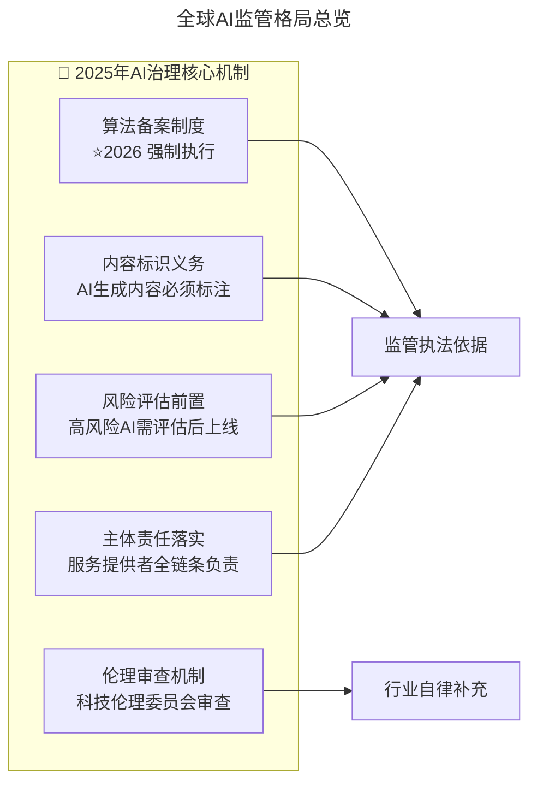

上图展示了2025年AI治理的五大核心机制。算法备案、内容标识、风险评估、主体责任和伦理审查形成完整的治理体系，前三项构成监管执法依据，伦理审查作为行业自律补充。

**领域二：数据保护** — 数据合规体系建设成为企业刚需
- 数据分类分级制度 **全面落地**
- **数据出境安全评估** 常态化
- **个人信息保护** 执法力度加大
- 企业数据合规体系建设成为 **融资/IPO的必查项**

**领域三：网络安全** — AI系统安全被正式纳入网络安全范畴
- **关键信息基础设施** 保护升级（含AI基础设施）
- **AI系统安全** 纳入网络安全等级保护
- 安全事件 **通报和应急处置** 规范化（24小时内上报）

**领域四：数据跨境** — 企业全球化经营的合规复杂度显著上升
- **数据出境** 规则进一步明确（白名单制度探索中）
- 企业全球化经营需构建 **多法域合规矩阵**

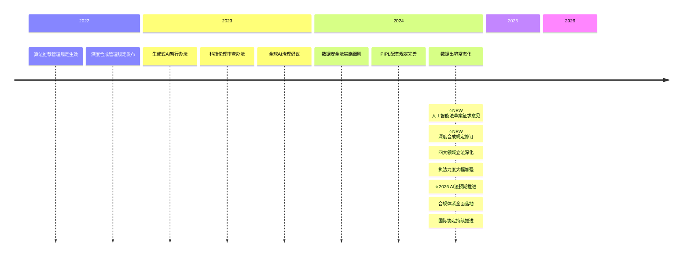

上图展示了中国AI政策法规从2022年到2026年的演进时间线。2025年是关键转折年（人工智能法草案征求意见、四大领域立法深化），2026年进入合规体系全面落地阶段。

#### 欧盟 AI Act（Regulation (EU) 2024/1689）

**生效时间**：2024年8月1日
**⭐2026 最新动态**：2025年11月欧盟委员会发布"数字综合法案"(Digital Omnibus)修正提案；2026年进入全面执行阶段

| 风险等级 | 定义 | 合规要求 | 罚则上限 |
|---------|------|---------|---------|
| **不可接受风险** | 违反基本权利的AI应用（如社会评分、实时远程生物识别） | **禁止使用** | 3500万欧元或全球营收7% |
| **高风险** | 关键基础设施、教育、就业、执法等领域的AI系统 | 严格合规义务（风险管理、数据治理、透明度、人工监督） | 1500万欧元或全球营收3% |
| **有限风险** | 聊天机器人、深度合成内容等 | 透明度义务（标注AI生成内容） | - |
| **最小风险** | 大多数AI应用（如垃圾邮件过滤） | 无强制要求 | - |

#### 美国 AI 治理路径

美国采取"**行政令 + 州立法 + 行业标准**"的多层次治理：
- **联邦层面**：拜登AI行政令(Executive Order 14110, 2023.10)要求高风险AI系统进行安全评估（该行政令已于2025年1月被撤销，此后联邦层面转向创新优先的新行政令，州立法成为监管主力）
- **⭐2026 州立法加速**：截至2025年底，已有 **30+个州** 通过AI相关立法
- **特点**：强调创新优先、分散立法、诉讼驱动

#### 全球AI监管格局对比

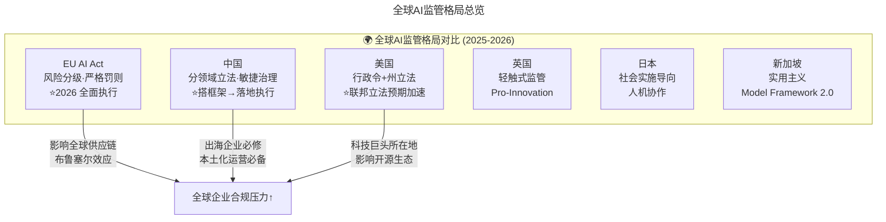

上图对比了全球主要经济体的AI监管模式。欧盟以风险分级和严格罚则为核心（布鲁塞尔效应），中国采取分领域立法与敏捷治理，美国以行政令+州立法为特征，英国和新加坡则偏向轻触式/实用主义监管。

### 2.2 顺势而为 — "三维之势"理论

第7讲郭炜开宗明义："要制定技术战略，先看清局面。"第208讲陈阳更进一步，从百年大局的高度论述了"势"的重要性："人生发财靠康波，每个人一生中发财的机会只有三次，而每一次的机会都出现在时代的转折点上面。"

在AI时代，这个"势"变得更加具象化和可操作化——**AI时代的"三维之势"**：

- **政策之势**（国家战略方向）：国家对AI的战略定位、资金投入方向、监管态度
- **技术之势**（技术突破节奏）：模型能力的跃迁节点、成本曲线的拐点、技术路线的收敛
- **市场之势**（用户需求演变）：用户接受度的临界点、付费意愿的变化、场景落地的时机

**"顺势而为"的本质**：在这三维之势形成共振的时刻，投入资源、布局赛道、抢占身位。

#### 宏观环境四维影响模型

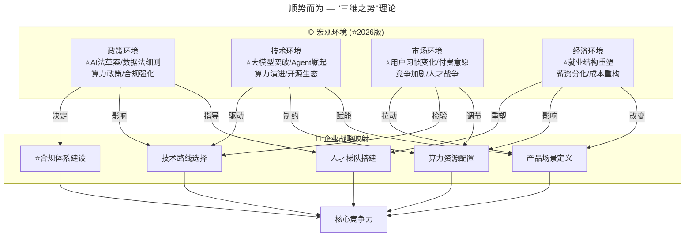

上图展示了宏观环境（政策/技术/市场/经济）对企业战略（技术路线/合规/算力/人才/产品）的影响映射关系。四维环境因素共同作用于企业五大战略维度，最终形成核心竞争力。

### 2.3 2026-2027年全球监管趋势预判

**趋势一：监管趋同化加速**
- 欧盟AI Act的"布鲁塞尔效应"将持续扩散，类似GDPR成为全球事实标准
- G7 Hiroshima AI Process、联合国高级别AI咨询体等国际协调机制发挥作用

**趋势二：垂直领域监管深化**
- 金融AI：巴塞尔委员会AI风险管理指引
- 医疗AI：FDA/EMA/NMPA联合协调
- 自动驾驶：UN R157/WP.29框架下的全球统一认证

**趋势三：开源与大模型专项规制**
- 对开源模型的豁免边界争议持续
- 基础模型(Foundation Model)的特殊监管地位确立

**⭐NEW 趋势四：合规科技(RegTech)爆发**
- AI合规自动化工具市场快速增长
- 企业内部AI治理岗位需求激增（⭐2026 新兴高薪岗位）

---

## 3. 关键流程

### 3.1 企业AI合规实务指南

#### AI系统分类自查

```
□ 你的AI系统是否用于：
  □ 生物识别（人脸识别、声纹识别）
  □ 关键基础设施管理（电力、水务、交通）
  □ 教育和职业培训（评分、推荐）
  □ 就业和工人管理（招聘筛选、绩效评估）
  □ 执法和边境管理
  □ 司法和民主进程（选举、司法辅助）

如果以上任何一项为"是" → 高风险AI系统 → 进入严格合规流程
如果以上全部为"否" → 继续下一步判断
```

#### AI合规检查三阶段流程

**阶段一：产品规划阶段**

| 检查项 | 说明 | 负责人 | 完成时间 |
|-------|------|--------|---------|
| ☐ AI用途界定 | 明确AI系统的具体应用场景和目标用户 | 产品经理 | 产品立项时 |
| ☐ 风险等级预判 | 对照EU AI Act风险分级表进行初步分类 | 法务/合规 | 产品立项后1周内 |
| ☐ 影响评估启动 | 启动DPIA/FIA（数据保护影响评估/基础影响评估） | DPO/隐私团队 | 高风险项目必须 |
| ☐ 合规预算预留 | 将合规成本纳入项目预算（预计占研发成本5-15%） | 项目经理 | 项目规划阶段 |

**阶段二：开发阶段**

| 检查项 | 说明 | 负责人 | 完成时间 |
|-------|------|--------|---------|
| ☐ 训练数据合规审查 | 数据来源合法性、版权状态、个人信息授权 | 数据工程师 | 模型训练前 |
| ☐ 算法偏见检测 | 使用公平性工具包（如AI Fairness 360）检测偏差 | ML工程师 | 模型迭代周期内 |
| ☐ 可解释性设计 | 为高风险决策点准备解释能力 | 架构师 | 设计阶段 |
| ☐ 人工干预机制 | 设计人工审核/覆盖流程 | 产品+运营 | 上线前 |
| ☐ 安全加固 | 对抗攻击防护、模型窃取防护 | 安全团队 | 测试阶段 |

**阶段三：上线运营阶段**

| 检查项 | 说明 | 负责人 | 完成时间 |
|-------|------|--------|---------|
| ☐ 用户告知义务 | 清晰告知用户正在与AI交互 | 产品/UI | 上线时 |
| ☐ 内容标识 | AI生成内容的显著标识 | 前端团队 | 上线时 |
| ☐ 投诉反馈渠道 | 建立用户申诉和纠错机制 | 客服/运营 | 上线时 |
| ☐ 监控日志记录 | 记录AI决策过程以备审计 | 后端团队 | 持续 |
| ☐ 定期审计计划 | 安排年度/季度合规审计 | 合规部门 | 上线后 |

#### 企业AI合规体系建设路径

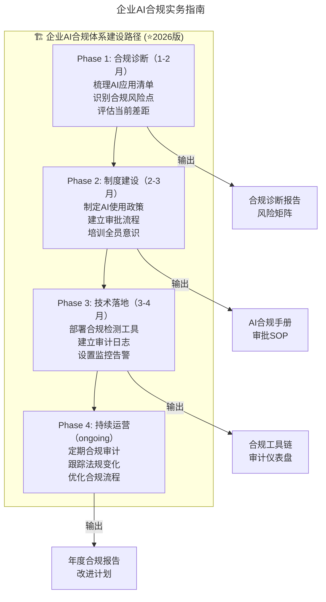

上图展示了企业AI合规体系建设的四阶段路径。从合规诊断到制度建设、技术落地，再到持续运营，每个阶段都有明确的输出物，形成闭环改进。

#### 数据合规的三层架构

**第一层：训练数据合规**

| 数据类型 | 合规要点 | 典型风险 |
|---------|---------|---------|
| 公开网页数据 | robots.txt遵守、版权合理使用 | 版权侵权诉讼（如纽约时报诉OpenAI） |
| 开源数据集 | 许可证兼容性检查 | GPL传染风险 |
| 内部业务数据 | 内部审批流程、脱敏处理 | 商业秘密泄露 |
| 第三方采购数据 | 数据供应商资质审查、合同条款 | 数据来源不合法连带责任 |
| 个人信息 | 单独同意、去标识化/匿名化 | 违反PIPL/GDPR |

**第二层：用户数据处理合规** — 最小化原则、目的限制、存储期限、跨境传输

**第三层：第三方数据使用合规** — 尽职调查清单（数据来源证明、DPA签署、安全认证、泄露应急、返还/销毁条款）

### 3.2 算力战略 — 国家政策与企业应对

⭐ **2026 现实**：**GPU算力短缺已成为制约AI发展的最大瓶颈之一**。NVIDIA H100/B200一卡难求，价格飙升。与此同时，中国"东数西算"工程持续推进，国产AI芯片生态加速成熟。

#### 算力获取的四条路径

**路径一：自建算力集群** — 大型互联网公司、金融机构、科研院所
- 优势：数据主权完全可控、长期成本可控
- 劣势：初始投入巨大（千万级起）、运维复杂度高

**路径二：公有云租赁** — 中小企业、初创公司、弹性需求大的业务
- Spot实例：最高可节省90%成本（适合容错任务）
- 预留实例(RI)：承诺1-3年使用，折扣30-60%

**路径三：混合云模式** — 有数据合规要求但又需要弹性的企业
- 本地：敏感数据存储、推理服务、合规审计
- 云端：大规模训练、弹性扩容、新模型实验

**路径四：国产替代** — 有国产化要求、成本敏感、特定行业

#### 国产AI芯片选型对比

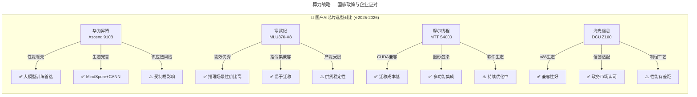

上图对比了四款国产AI芯片的优劣势。华为昇腾在性能和生态方面领先但受制裁影响，寒武纪推理性价比高但产能受限，摩尔线程CUDA兼容迁移成本低，海光信息x86生态兼容性好但制程有差距。

#### "东数西算"工程机遇

国家发改委2022年正式启动"东数西算"工程，在京津冀、长三角、粤港澳大湾区、成渝、内蒙古、贵州、甘肃、宁夏8地建设国家算力枢纽节点。

**对企业意味着什么**：
1. **算力成本下降**：西部绿电丰富，电价仅为东部50-70%
2. **参与机会**：可以参与智算中心建设运营、算力租赁服务
3. **政策红利**：西部数据中心享受税收优惠、土地支持、能耗指标倾斜

### 3.3 数据安全与隐私保护新规

⭐ **2026 现实**：2021年以来，《数据安全法》《个人信息保护法》相继生效，标志着中国数据合规进入"严监管"时代。2024-2025年配套实施细则密集出台，**执法力度空前加大**。

#### 数据安全法核心义务矩阵

| 义务类型 | 具体要求 | 适用主体 | 违规后果 |
|---------|---------|---------|---------|
| **数据分类分级** | 建立数据分类分级制度，识别重要数据和核心数据 | 所有数据处理者 | 警告、罚款（最高1000万元）、停业整顿 |
| **数据安全管理制度** | 建立全流程安全管理制度，明确负责人 | 重要数据处理者 | 同上 |
| **风险评估** | 定期开展数据安全风险评估 | 重要数据处理者 | 责令改正、警告、罚款 |
| **数据出境管理** | 数据出境需通过安全评估、认证或标准合同 | 向境外提供数据的处理者 | 责令停止出境、罚款 |
| **数据交易规范** | 数据交易需提供身份、数据来源、类别等说明 | 数据交易中介服务机构 | 没收违法所得、罚款 |
| **配合执法** | 配合依法进行的调取数据请求 | 所有数据处理者 | 拒绝配合可追究刑事责任 |

#### 数据出境安全评估流程

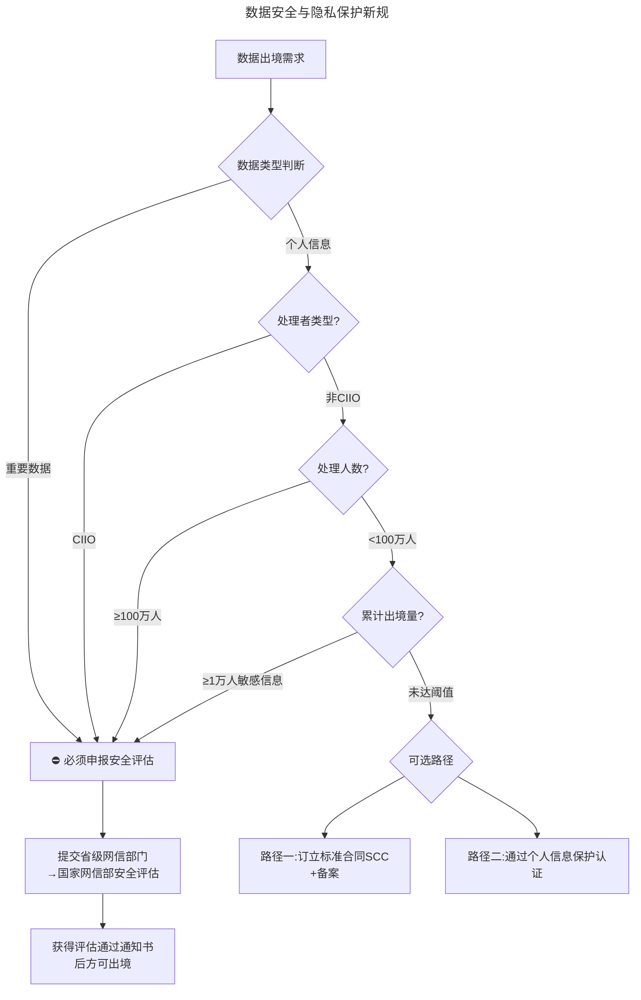

上图展示了数据出境安全评估的完整决策流程。重要数据和大规模个人信息出境必须申报安全评估，小规模个人信息出境可选择标准合同或认证路径。

#### 个人信息保护法对AI应用的特殊约束（2026更新版）

| AI应用场景 | PIPL约束要点 | ⭐2026 合规建议 |
|-----------|-------------|----------------|
| 人脸识别等生物识别 | 需要 **单独同意** | 提供非生物识别替代方案，留存同意记录 |
| 用户画像 | 需说明画像用途、提供 **拒绝选项** | 设置"关闭个性化推荐"按钮，定期清理画像 |
| 自动化决策 | 需保证决策 **透明公正**，提供 **人工介入** | 设计申诉和人工复核流程，决策可解释 |
| 训练数据中的个人信息 | 需符合 **目的限制、最小必要** | 进行去标识化/匿名化处理，避免再识别风险 |
| 跨境AI服务 | 需完成 **出境合规** | 本地化部署或通过认证，关注数据驻留要求 |

---

## 4. 工具与实战

### 4.1 CTO必须关注的合规要点

#### 要点1：算法备案与登记 ⭐NEW
- **哪些算法需要备案？** 具有舆论属性或社会动员能力的服务
- **备案流程**：上线前30日内完成备案，获得备案编号后方可提供服务
- **未备案的法律后果**：责令整改、罚款、下架服务，严重者追究刑事责任

#### 要点2：数据合规全链路 ⭐NEW

| 环节 | 合规要点 | 关键动作 |
|-----|---------|---------|
| **数据采集** | 合法授权、告知同意 | 隐私协议明示、单独同意书 |
| **数据存储** | 分类分级、加密保护 | 建立数据资产目录、加密存储 |
| **数据使用** | 目的限制、最小必要 | 用途审批流程、访问权限管控 |
| **数据共享** | 去标识化、合同约束 | 数据处理协议(DPA)、脱敏处理 |
| **数据销毁** | 安全删除、留痕备查 | 销毁日志、不可恢复验证 |

#### 要点3：AI内容安全 ⭐NEW
- **违禁内容过滤机制**：建立关键词库+模型检测的双重过滤
- **用户输入和输出的审核**：实时监控+人工抽检相结合
- **幻觉问题的应对措施**：事实核查机制、置信度阈值设置
- **投诉举报处理流程**：24小时响应、72小时处理闭环

#### 要点4：用户权益保护 ⭐NEW

| 权益类型 | 法律依据 | 企业应做 |
|---------|---------|---------|
| **知情权** | 告知用户在与AI交互 | 显著标识"AI助手""由AI生成" |
| **选择权** | 提供人工服务的选项 | "转人工"按钮始终可用 |
| **解释权** | AI决策的可解释性 | 推荐理由展示、决策逻辑说明 |
| **投诉权** | 便捷的投诉渠道 | 一键举报、处理进度可追踪 |

### 4.2 AI人才能力模型

基于原始专栏中多位大咖的观点（顾旻曼看重的"充分积累"、程浩强调的"赛道红利"、乔新亮关注的"价值产出"），结合AI时代的新要求，构建以下能力模型：

```
                ┌─────────────────────┐
                │   战略思维与商业洞察   │  ← 能看清"势"
                │  （对应第7讲"看清局面"） │
                └──────────┬──────────┘
                           │
      ┌────────────────────┼────────────────────┐
      │                    │                    │
┌─────▼─────┐      ┌──────▼──────┐     ┌──────▼──────┐
│ 技术深度   │      │  工程能力    │     │  合规意识    │
│ ·模型原理  │      │ ·MLOps     │     │ ·数据合规    │
│ ·前沿跟踪  │      │ ·系统设计   │     │ ·伦理判断    │
│ ·论文复现  │      │ ·性能优化   │     │ ·风险识别    │
└───────────┘      └─────────────┘     └─────────────┘
```

#### ⭐2026 各层级AI人才的差异化培养重点

| 层级 | 角色定位 | 核心能力要求 | 培养方式 |
|-----|---------|-------------|---------|
| **AI科学家** | 前沿研究、算法创新 | 论文发表、学术影响力、数学功底 | 博士后、产学研联合实验室 |
| **AI算法工程师** | 模型开发、优化落地 | 编码能力、框架熟练度、问题解决 | 内部项目历练+外部培训 |
| **⭐NEW Prompt工程师** | 提示词优化、Agent编排 | LLM理解力、提示工程方法论、业务抽象 | 内部认证+社区学习 |
| **⭐NEW Agent架构师** | 智能体系统设计 | 多Agent协作、工具调用、记忆管理 | 项目实践+开源贡献 |
| **MLOps工程师** | 模型生产化、运维监控 | DevOps+ML双栈能力、工具链掌握 | 跨部门轮岗、认证考试 |
| **AI产品经理** | 场景定义、价值转化 | 业务理解、技术边界认知、用户洞察 | 业务与技术双向轮岗 |
| **⭐NEW AI合规专员** | 风险管控、制度建设 | 法律+技术复合背景、政策解读 | 法务培训+技术实习 |

### 4.3 高校-企业-科研机构协作模式

**模式一：联合实验室** — 企业提供资金+数据+算力，高校提供人才+理论
**模式二：定向培养/订单班** — 与高校AI专业共建课程体系，提前锁定优秀毕业生
**模式三：博士后工作站** — 2-3年期间解决企业核心技术难题
**模式四：开源社区参与** — 鼓励员工参与Hugging Face、PyTorch等开源社区

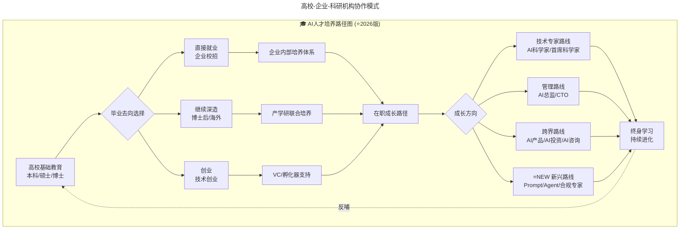

上图展示了AI人才从高校到职场的完整培养路径。毕业生可选择就业、深造或创业，通过企业培养、产学研联合或VC支持进入在职成长路径，最终向技术专家、管理、跨界或新兴路线发展，形成终身学习与反哺的闭环。

### 4.4 内部AI培训体系搭建Checklist

**基础层（全员普及）**：
- [ ] AI基础知识通识课（什么是LLM、Transformer原理简介）
- [ ] AI工具使用培训（ChatGPT/Claude/文心一言等高效使用）
- [ ] AI伦理与合规红线培训（什么不能做）

**进阶层（技术人员）**：
- [ ] 主流框架深入培训（PyTorch/TensorFlow/JAX）
- [ ] MLOps最佳实践（模型版本管理、CI/CD for ML）
- [ ] ⭐NEW Agent开发实战（LangChain、AutoGen等框架）
- [ ] 领域特定培训（NLP/CV/推荐系统根据业务选择）

**高层（管理者/决策者）**：
- [ ] AI战略思维工作坊（如何制定AI战略）
- [ ] AI投资回报分析（ROI计算、成本效益评估）
- [ ] AI风险管理（技术风险、合规风险、声誉风险）
- [ ] ⭐NEW AI治理与合规高管课（CTO必修）

### 4.5 算力战略制定步骤

- [ ] **Step 1**：盘点现有算力资源和使用情况（利用率、瓶颈、成本）
- [ ] **Step 2**：明确未来12-24个月的AI算力需求预测（训练/推理/存储）
- [ ] **Step 3**：评估四条路径的适用性和总拥有成本(TCO)
- [ ] **Step 4**：制定过渡路线图（避免被单一供应商锁定）
- [ ] **Step 5**：建立算力监控和优化机制（持续提升效率）

### 4.6 CTO顺势而为五大策略

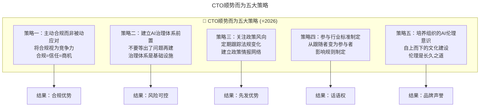

上图展示了CTO顺势而为的五大策略及其预期结果。主动合规赢得信任，治理前置控制风险，政策跟踪获得先发优势，参与标准制定获取话语权，伦理文化建设提升品牌声誉。

| 策略 | 核心行动 | 预期收益 | 时间投入 |
|-----|---------|---------|---------|
| **主动合规** | 设立专职合规岗位、建立合规工具链、通过权威认证 | 降低法律风险、赢得客户信任、获取投标资格 | 中（3-6月见效） |
| **治理前置** | 产品立项即启动合规评估、将合规纳入DevOps流水线 | 避免返工成本、加速上市时间 | 高（一次性投入） |
| **政策跟踪** | 订阅官方渠道、参加行业研讨会、加入政策研究社群 | 提前布局、规避突发风险 | 低（日常习惯） |
| **参与标准** | 加入标准化组织、贡献开源合规工具、发表合规实践论文 | 行业影响力、规则制定话语权 | 高（长期投入） |
| **伦理文化** | 制定AI伦理准则、开展全员培训、建立伦理审查机制 | 品牌差异化、吸引顶尖人才、降低声誉风险 | 中（持续投入） |

---

## 5. 常见误区

### 5.1 将合规视为"成本中心"而非"竞争力"

许多技术领导者将AI合规视为纯粹的成本负担。实际上，**合规体系本身可以成为企业的差异化竞争优势**——在客户选择AI服务时，合规资质是重要的信任因素。

### 5.2 等法规落地才开始合规建设

法规从征求意见到正式生效通常只有6-12个月窗口期。**等法规落地再建设合规体系往往为时已晚**，面临产品下线、罚款等风险。应采取"治理前置"策略，在产品立项阶段即启动合规评估。

### 5.3 忽视数据出境合规

企业全球化经营时，常忽视数据出境合规要求。**违规出境的后果包括责令停止出境、高额罚款**，甚至影响企业融资和上市进程。特别是：
- 处理100万人以上个人信息的处理者向境外提供个人信息 → 必须申报安全评估
- 累计向境外提供1万人以上敏感个人信息 → 必须申报安全评估（10万至100万人非敏感个人信息可订立标准合同或通过认证）

### 5.4 算力战略的单一供应商依赖

过度依赖单一云服务商或单一芯片供应商会导致：
- 议价能力丧失，成本不可控
- 供应中断风险（如制裁、断供）
- 技术锁定，迁移成本极高

**建议**：采用混合策略，至少保持2-3个供应商选项。

### 5.5 AI人才培养的"重引进轻培养"倾向

企业间"挖角大战"愈演愈烈，但纯靠引进外部人才存在以下问题：
- 成本高昂（AI工程师平均跳槽周期缩短至18个月）
- 文化融合困难
- 知识沉淀不足

**建议**：建立"引进+培养+留存"三位一体的人才战略，特别重视内部培训体系建设。

### 5.6 忽视AI对就业市场的结构性冲击

⭐ **2026 最新数据**：AI正在深刻重塑就业市场，技术领导者需要提前布局：

| 影响类型 | 受影响群体 | 影响程度 | 应对策略 |
|---------|-----------|---------|---------|
| **岗位替代** | 重复性脑力工作者（初级程序员、客服、翻译） | ⚠️⚠️⚠️⚠️⚠️ | 技能转型、人机协作 |
| **岗位增强** | 大多数知识工作者 | ⚠️⚠️⚠️⚠️ | 学习AI工具、提升创造力 |
| **岗位创造** | AI工程师、Prompt Engineer、Agent架构师等 | ⚠️⚠️⚠️ | 把握机遇、快速学习 |
| **薪资分化** | 不懂AI vs 懂AI的技术人 | ⚠️⚠️⚠️⚠️⚠️ | AI技能=薪资溢价（预计30-50%） |

### 5.7 合规科技投入不足

⭐2026年合规科技(RegTech)正在爆发，但许多企业仍依赖人工审查。**自动化合规检测工具可以大幅提升效率**：
- 将合规要求嵌入CI/CD流程：代码提交时自动扫描合规风险
- 使用AI辅助合规审查：GPT-5.5 Pro辅助梳理现有AI系统的合规清单
- 目标：实现80%以上合规检查的自动化

---

## 6. 进阶延展

### 6.1 全模块知识图谱

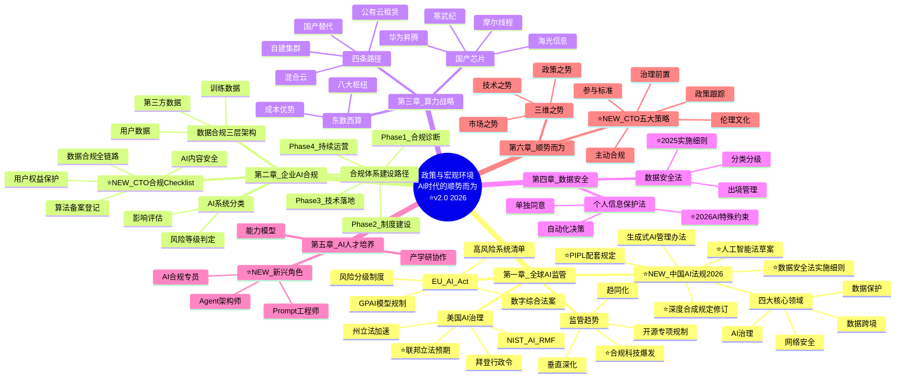

上图是全模块知识图谱的思维导图，涵盖了全球AI监管、企业合规、算力战略、数据安全、AI人才培养和顺势而为六大领域的完整知识体系。

### 6.2 核心要点速查表

| 章节 | 核心观点 | 关键行动 | ⭐2026 重要法规/政策 |
|-----|---------|---------|-------------------|
| **第一章** | ⭐2025是中国AI治理从"搭框架"到"落地执行"的关键转型年 | 建立AI系统风险分级台账，关注《人工智能法》草案进展 | ⭐EU AI Act (2024.8全面执行)、⭐《人工智能法》草案(2025)、生成式AI办法 (2023.8) |
| **第二章** | 合规是AI产品的"前置条件"，CTO必须亲自关注 | ⭐执行四阶段合规体系建设路径，部署合规工具链 | GDPR、PIPL、⭐算法备案制度、⭐内容标识强制要求 |
| **第三章** | 算力是AI时代的"电力"，多元策略降低风险 | 制定算力战略，⭐关注国产替代窗口期，避免单供应商依赖 | 东数西算工程、⭐国产芯片政策加码 |
| **第四章** | ⭐数据合规执法力度空前加大，违规代价高昂 | 完成数据分类分级，⭐2026年前完成出境自评估 | ⭐数据安全法实施细则(2025)、PIPL (2021.11)、⭐出境安全评估常态化 |
| **第五章** | ⭐AI人才市场剧烈分化，新兴岗位涌现 | 搭建分层培训体系，⭐培养Prompt/Agent/合规复合人才 | 国家AI人才政策、⭐高校AI专业扩招 |
| **第六章** | ⭐"顺势而为"=政策×技术×市场×经济的四维共振 | ⭐实施CTO五大策略，⭐每半年开展合规专项审计 | 十五五规划(前瞻)、⭐"人工智能+"行动深化、⭐AI治理体系化 |

### 6.3 ⭐2026 重要法规/政策索引表

| 法规/政策名称 | 发布机构 | 生效/修订时间 | 核心要点 | ⭐2026 对企业的影响 |
|-------------|---------|-------------|---------|-------------------|
| **⭐NEW《人工智能法（草案）》** | 全国人大常委会 | **2025征求意见** | 分类分级监管、风险评估、算法备案 | ⭐所有AI企业必须密切关注，提前准备合规方案 |
| **EU AI Act** | 欧盟议会 | 2024.8.1生效；⭐2025.11修正提案 | 全球首部全面AI法规，风险分级 | 向欧盟提供AI产品/服务的中国企业必须合规 |
| **⭐NEW《数据安全法》实施细则** | 网信办 | **2024-2025** | 数据分类分级细化、跨境传输规范 | ⭐所有数据处理者需按细则完善制度 |
| **⭐NEW《个人信息保护法》配套规定** | 多部门 | **2024-2025持续完善** | 敏感信息、自动化决策、知情同意 | ⭐AI应用需特别关注自动化决策合规 |
| **⭐NEW《深度合成规定》(修订版)** | 网信办 | **2025修订生效** | Deepfake标识升级、内容溯源强化 | ⭐生成式AI、视频生成类产品必须适配 |
| **生成式人工智能服务管理暂行办法** | 网信办等七部门 | 2023.8.15 | 服务提供者责任、内容安全、标识要求 | 所有向公众提供生成式AI服务的企业 |
| **"人工智能+"行动** | 国务院 | 2024 | 推动AI与实体经济深度融合 | ⭐2026年进入深水区，各行业落地加速 |
| **东数西算工程** | 发改委等 | 2022启动 | 八大算力枢纽、算力网络 | 数据中心运营商、算力密集型企业 |

### 6.4 原始专栏精华摘录

#### 来自第207讲《科创板来了，我该怎么办？》（许良）

> "科创板天生就是为科技创新服务的……科创板针对过去交易所的几个问题都做了相应的改进，对于企业确实是大大的好事。"

> "科创板制定了准确的市场化的股权定价规则，从而让股价更加准确，从而让企业家和管理人员能够得到应有的股权激励。"

#### 来自第208讲《科创板投资，未来哪些行业受益最大？》（陈阳）

> "设立科创板，对中国经济发展其实是具有跨时代的战略意义。……科技兴国不是一句空话，也不是一时兴起提出来的口号，而是关乎百年发展大局，关乎民族前途命运的重大转折点。"

> "技术创新推动经济发展的路径已经非常清晰，而技术创新的核心就在于5G网络的普及，在此基础上又会衍生出大量新兴行业。"

#### 来自第7讲《要制定技术战略，先看清局面》（郭炜）

> "什么是技术战略？用通俗的话来讲，就是在现阶段用合适的人、合适的技术架构办合适的事情。"

> "认清楚现阶段很重要。……技术高级管理者要花非常多的时间，结合实际业务反复给其他合伙人沟通你的观点和认知，并把事情'做成'，赢得其他合伙人的信任。"

#### 来自第63讲《未来组织形态带来的领导力挑战》（Tina Jiang）

> "世界已经进入VUCA时代，我们正面临一个易变的、不确定的、复杂的、模糊的世界。"

> "未来的组织形态会大幅度减少人与人之间的关系绑定，部门之间的边界也变得越来越模糊，人才共享成为新常态。"

#### 来自大咖对话（顾旻曼）

> "在投资时，真格会比较偏向于选择优质的、专业的团队进行早期投资。……我们很少追风口，客观上来讲，风口起来了价格也偏高。……我们更多地是在找优秀的团队。"

#### 来自大咖问答（程浩）

> "技术人选赛道的逻辑跟其他人群是一样的，首先要建立在一波大势、一波红利之上。……赛道没选对，你再聪明再努力，都不会发展得很快。"

> "技术很重要，但技术不是目的，而是手段，最终的目的是服务用户。大家要注意不要为了秀技术而使用技术，而是要让你的技术为商业服务。"

### 6.5 AI时代验证与延伸

#### "AI治理成为企业必修课"的验证

2026年这一观点已被充分验证：

| 时间 | 事件 | 影响 |
|------|------|------|
| 2024.08 | EU AI Act正式生效 | 全球最全面AI监管框架 |
| 2025 | 中国《人工智能法》草案征求意见 | 中国版AI基础性法律 |
| 2025.01 | 美国AI行政令更新 | 强调安全与创新的平衡 |
| 2025.06 | G7 Hiroshima AI Process实施指导 | 国际协调机制 |
| 2026.03 | 中国《生成式AI服务管理办法》2.0 | 细化生成式AI合规要求 |

**企业合规现状（McKinsey 2026）**：
- **86%** 企业承认AI转型困难，其中**61%** 将"治理合规"列为主要挑战
- **仅35%** 企业建立了完整的AI治理框架
- **Top 3合规痛点**：数据隐私保护（78%）、算法透明度（65%）、跨境数据流动（52%）

#### 算力战略的多元化选择验证

| 路径 | 适用场景 | 成本优势 | 代表厂商 | 2026采用率 |
|------|---------|---------|---------|----------|
| **自建GPU集群** | 大模型训练、敏感数据 | 长期成本低 | NVIDIA DGX, 华为昇腾 | 15% |
| **云GPU租用** | 弹性需求、快速启动 | 按需付费 | AWS p5, Azure ND, GCP A3 | 45% |
| **混合模式** | 平衡成本与性能 | 最优TCO | 多云管理平台 | 30% |
| **边缘AI推理** | 实时响应、数据本地化 | 延迟低 | NVIDIA Jetson, 边缘网关 | 10% |

#### AI对就业市场的深层影响

**岗位变化趋势（2024-2026）**：

| 类别 | 2024年数量 | 2026年预测 | 变化率 | 主要原因 |
|------|----------|----------|--------|---------|
| 传统编程岗 | 基准 | -12% | ↓ | Agentic Coding替代部分工作 |
| AI工程师 | 基准 | +85% | ↑↑ | 需求爆发式增长 |
| Agent Architect | 极少 | +500% | ↑↑↑ | 新兴角色 |
| 提示词工程师 | 少量 | +120% | ↑↑ | 专业细分 |
| AI产品经理 | 基准 | +60% | ↑ | 跨领域稀缺 |
| AI伦理官 | 极少 | +300% | ↑↑↑ | 合规需求驱动 |
| 数据标注员 | 基准 | -40% | ↓↓ | 自动化工具替代 |

**关键洞察**：
- **不是"AI取代人"，而是"会用AI的人取代不会用AI的人"**
- **新增岗位 > 减少岗位**（净增长约25%）
- **技能重构比岗位消失更重要**

### 6.6 关键数据更新（⭐2026最新）

#### 全球AI监管强度对比（2026年6月）

| 国家/地区 | 监管严格度 | 主要法规 | 合规成本（占AI预算） | 执法力度 |
|----------|----------|---------|-------------------|---------|
| 欧盟 | ⭐⭐⭐⭐⭐ | EU AI Act | 8-12% | 高 |
| 中国 | ⭐⭐⭐⭐ | AI法草案+生成式AI办法 | 5-8% | 中高 |
| 美国 | ⭐⭐⭐ | AI行政令+州级法规 | 3-5% | 中 |
| 英国 | ⭐⭐⭐ | AI监管沙盒 | 2-4% | 低中 |
| 新加坡 | ⭐⭐⭐ | AI治理框架 | 2-3% | 低 |
| 日本 | ⭐⭐ | AI社会原则 | 1-2% | 低 |

#### AI人才供需缺口（2026年Q2）

| 角色 | 需求量 | 供给量 | 缺口比例 | 平均薪资涨幅 |
|------|-------|-------|---------|------------|
| AI工程师 | 100K | 55K | -45% | +22% |
| Agent Architect | 15K | 3K | -80% | +35% |
| AI安全专家 | 8K | 2K | -75% | +28% |
| MLOps工程师 | 25K | 18K | -28% | +18% |
| AI产品经理 | 20K | 14K | -30% | +20% |

### 6.7 可视化图表

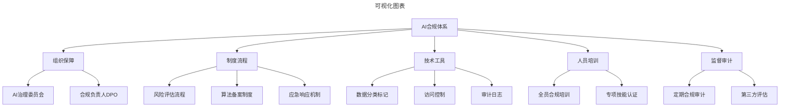

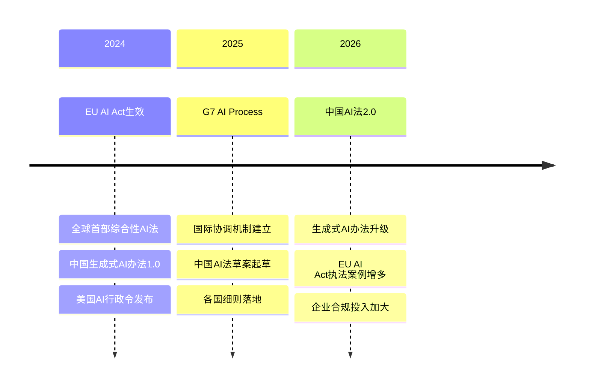

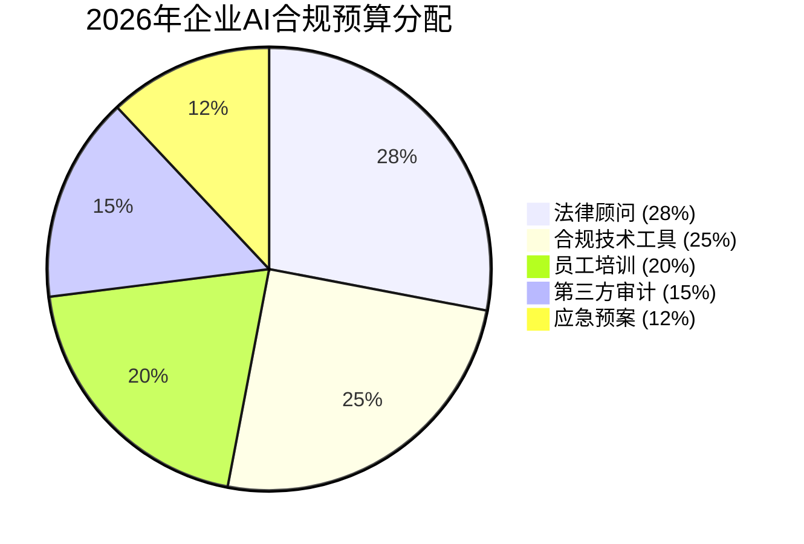

### 6.8 ⭐2026可执行建议

**立即行动（本周内完成）**：
1. ⭐ 进行企业AI合规现状诊断，使用本文框架评估AI治理成熟度
2. ⭐ 建立核心团队AI法规认知，组织学习《人工智能法》草案核心要点
3. ⭐ 梳理现有AI系统的数据流向，识别涉及个人数据或重要数据的系统

**中期规划（本季度完成）**：
4. ⭐ 搭建AI合规管理体系，成立跨部门AI治理委员会
5. ⭐ 制定算力优化策略，评估DeepSeek V4低成本优势
6. ⭐ 启动AI人才培养计划，年底前培养5名内部"AI合规专员"

**长期愿景（2026年底前实现）**：
7. ⭐ 构建"合规即代码"的自动化体系，实现80%以上合规检查自动化
8. ⭐ 建立行业AI合规影响力，参与行业标准制定

### 6.9 建立宏观视野的日常实践

- [ ] **每周**：花30分钟浏览工信部、网信办、发改委官网的政策动态
- [ ] **每月**：参加一次行业研讨会或政策解读会议
- [ ] **每季度**：更新一次技术路线图与政策环境的对齐度评估
- [ ] **每年**：参加1-2次国家级或行业级AI峰会，建立政策人脉网络
- [ ] **持续**：关注3-5家智库或研究机构的AI政策报告（如中国信通院、社科院）
- [ ] **⭐NEW**：每半年组织一次 **AI合规专项审计**，对照最新法规自查

### 6.10 科创板企业的技术战略启示

回顾第207讲许良的分析，科创板上市企业的共性特征：

1. **踩准国家战略节拍**：半导体、生物医药、高端装备——都是"卡脖子"领域
2. **技术壁垒足够高**：不是简单的商业模式创新，而是硬核技术突破
3. **团队配置合理**：技术+产业的复合团队
4. **耐心资本加持**：能够承受前期亏损，追求长期价值

**2026慕安会的启示** — AI作为"结构性主题"：2026年慕尼黑安全会议首次将AI作为贯穿整场会议的结构性主题，主题定为"安全范式的转型"。这意味着：
- **AI安全已上升到地缘政治层面**：不仅是技术问题，更是国家安全问题
- **技术领导者需要具备"安全思维"**：在设计之初就考虑安全属性
- **国际合作与竞争并存**：既要参与全球治理，又要保持技术自主

---

> **文档版本**：**v2.0** ⭐全新升级
> **最后更新**：**2026-08-12**
> **适用对象**：技术领导者（CTO/技术VP/技术总监）、AI产品负责人、企业合规负责人
> **建议学习时长**：10-15小时（含延伸阅读和实践练习）
> **⭐2026 主要更新**：中国AI治理四大核心领域、《人工智能法》草案、合规体系建设路径、CTO五大策略、就业市场影响分析、新兴AI岗位

---

*本文档基于2026年8月的技术动态编写，旨在帮助读者以新时代视角重新审视经典内容。技术演进日新月异，建议读者结合自身场景批判性思考。*