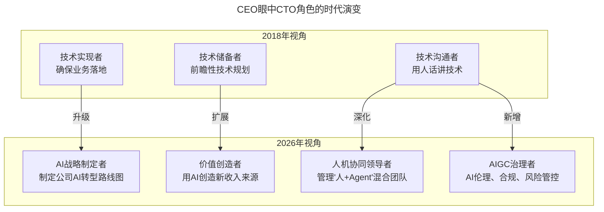
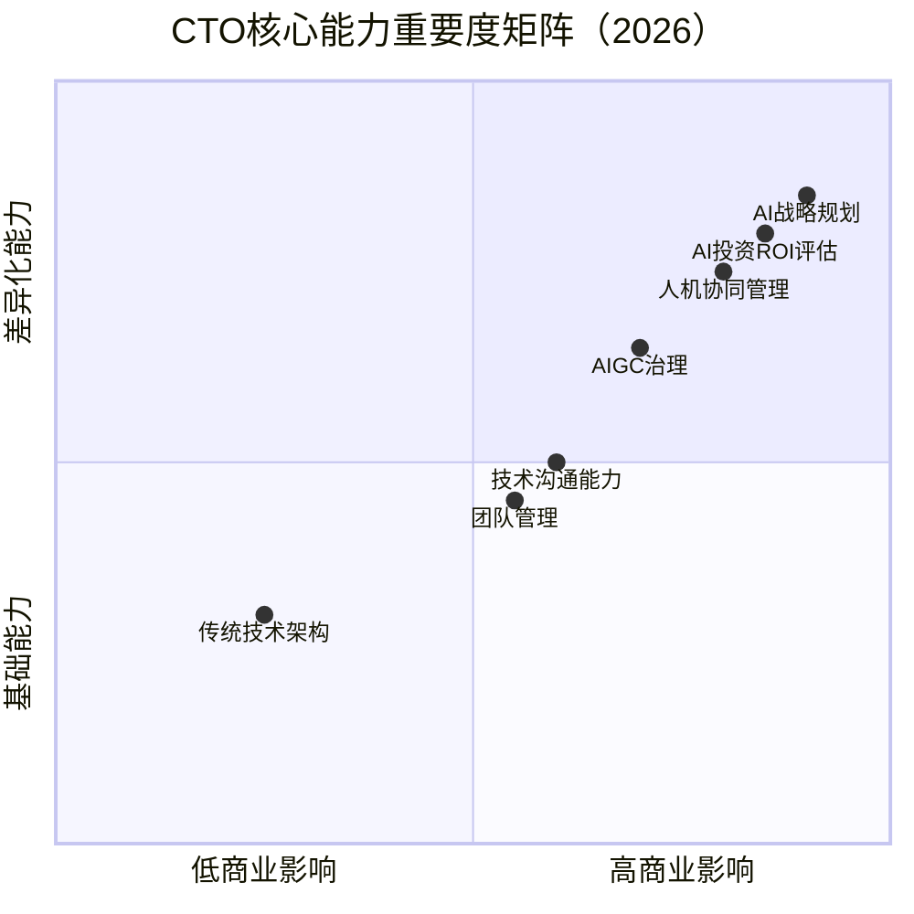

# 第3讲 | CEO实话实说：我需要这样的CTO

> **适用范围**：CTO、技术VP及向CEO汇报的高级技术管理者，尤其是希望理解CEO真实期望、并在AI时代完成角色升级的技术领导者；同样适用于CEO与技术领导者之间的期望对齐场景。
>
> **更新摘要（v2 · 2026-08 更新）**：
> - 结构化升级为 6 节骨架（导言 / 核心方法论 / 关键流程 / 工具与实战 / 常见误区 / 进阶延展）
> - 整合四位CEO对CTO的期望，并补充AI时代（2026）期望的质变
> - 新增CTO核心能力重要度矩阵与AI时代行动建议
> - 保留全部Mermaid图、能力对照表与关键数据

---

## 1. 导言

我们换个角度，看看公司真正的老大——CEO关于CTO这个问题的想法，和CTO们是否存在差异。我们邀请了四位CEO现身说法，阐述他们需要一个什么样的CTO。这四家公司都拥有为人称道的技术水平。

回看2018年这四位CEO的分享，他们眼中的CTO核心定位可以概括为：**技术实现者 + 技术储备者 + 技术沟通者**。但到了2026年，随着GPT-5.5、DeepSeek V4等大模型的爆发式发展，以及84%的开发者已经开始使用AI辅助编程（Stack Overflow 2025开发者调查），CEO对CTO的期望已经发生了根本性的质变。

上图展示了CEO眼中CTO角色的时代演变：从技术实现者升级为AI战略制定者，从技术储备者扩展为价值创造者，从技术沟通者深化为人机协同领导者并新增AIGC治理者角色。

---

## 2. 核心方法论

### 2.1 七牛CEO许式伟：从需求落地到架构治理

CTO的职责就是确保业务正常落地，用户的需求可以被按时按质地满足。CTO同样应该深刻理解客户，以确保产品不止适应当前用户的需求，还要能够适应需求未来的演化。适应需求未来的变化，不仅仅是能够预测未来什么事情会发生，更重要的是预测未来什么不会发生。

业务多元化后，CTO的位置是牵头把公司所有架构师聚集起来，形成技术委员会，定期一起审视整个公司业务的健康状况，并推动全公司范围的基础设施迭代与改进。

**AI时代升级**：2026年的CTO不仅要协调人类架构师，还要协调AI Agent架构师。当团队中有30%的工作由Agentic Coding完成时，需要建立AI Code Review的自动化流程。新增能力要求包括AI投资ROI评估能力和AI技术债务管理。

### 2.2 有赞CEO白鸦：技术储备+人话讲技术

CTO本质上要做好技术储备和技术沉淀，然后用人话把技术讲明白。第一，他要有足够开阔的视野；第二，CTO要具备很强的学习能力——快速迭代自己的能力，才能有前瞻性的理解前端的技术。

**AI时代升级**：2026年的"技术储备"不再是简单的代码库和文档，而是Prompt Engineering最佳实践库、Fine-tuned模型资产、AI工作流模板、AI治理规范。"用人话讲技术"的新难度在于需要向CEO解释"为什么我们要用RAG而不是Fine-tuning"、"Agentic Workflow和传统自动化的区别是什么"、"我们的AI投入什么时候能看到回报"。

### 2.3 沪江CEO阿诺：思维力+团队力+敏捷力

成熟期的企业，CTO需要具备战略的视野、优秀的管理能力和快速反应的能力，也就是三方面的核心能力：思维力、团队力、敏捷力。

**思维力**：制定并推进技术战略，站在行业和公司的战略高度来看待技术发展。**团队力**：建立信任，聚焦企业文化和价值观的传承，建立学习型组织文化。**敏捷力**：敏锐学习力，随着发展不断更新迭代，对新趋势和新技术持续跟踪评估。

**AI时代升级**：

| 能力维度 | 2018定义 | 2026 AI时代定义 |
|---------|---------|----------------|
| **思维力** | 制定技术战略、推动创新 | AI战略思维：判断哪些业务场景适合AI、识别AI带来的颠覆性机会 |
| **团队力** | 建立信任、培养人才 | 人机协同领导力：管理"10个工程师+50个AI Agent"的混合团队 |
| **敏捷力** | 快速学习新技术 | AI学习敏捷性：不仅自己学AI，还要建立团队的AI学习能力 |

### 2.4 乂学教育创始人栗浩洋：背景+进化+黑洞能力

三个方面：第一，要有非常过硬的背景和经历；第二，要有进化能力，持续不断地进化和学习；第三，具备黑洞的能力——衔接里里外外的各种板块，从董事长眼光看整个公司，又把自己放得足够低去虚心倾听。

**AI时代升级**："黑洞能力"的AI版需要衔接更多板块：AI算法团队与传统工程团队的文化融合、数据飞轮的构建、AI合规、AI供应商管理。进化能力从"学习AI"到"引领AI落地"，从"理解技术"到"评估AI商业价值"，从"个人进化"到"组织AI能力建设"。

---

## 3. 关键流程

### 3.1 CTO核心能力重要度矩阵（2026）

上图展示了2026年CTO核心能力的重要度矩阵。AI战略规划、AI投资ROI评估和人机协同管理位于高商业影响、高差异化能力的右上象限，是2026年CTO最需要重点发展的能力。

### 3.2 四位CEO观点的AI时代核心变化

| CEO | 原文核心 | AI时代升级 |
|-----|---------|-----------|
| 许式伟 | 架构师协调者 | AI架构治理者：协调人类架构师+AI Agent架构师 |
| 白鸦 | 技术储备+人话讲技术 | AI资产沉淀：Prompt库+模型资产+AI工作流模板+治理规范 |
| 阿诺 | 思维力+团队力+敏捷力 | AI增强型领导力：AI战略思维+人机协同+AI学习敏捷性 |
| 栗浩洋 | 黑洞能力+进化能力 | AI生态整合能力：衔接AI算法、数据飞轮、AI合规、供应商管理 |

---

## 4. 工具与实战

### 4.1 给CTO的三个行动建议（2026）

**1. 主动进行"AI战略对话"**

不要等CEO来问你AI的事。主动准备一份《公司AI机会地图》，识别出3-5个可以用AI降本增效或创造新收入的场景，用商业语言呈现。

**2. 建立个人的"AI决策框架"**

面对层出不穷的AI工具（GPT-5.5、Claude、DeepSeek V4、Cursor、Windsurf...），建立自己的评估维度：成本、效果、安全性、团队接受度、供应商稳定性。

**3. 成为"人机协同"的实践者**

自己先成为Agentic Coding的重度用户，亲身体验AI如何改变开发流程，然后才能带领团队转型。记住：**你无法领导你没经历过的事情**。

### 4.2 关键数据参考（2026）

- **84%** 的开发者使用AI辅助编程（Stack Overflow 2025）
- **40%** 的代码由AI生成或辅助完成（GitHub Copilot数据）
- **3-5x** 是AI工具带来的典型生产力提升（McKinsey 2025）
- **$150B+** 是全球企业AI投资规模（IDC 2026预测）
- **70%** 的CEO认为AI将重塑其行业（PwC 2025调研）

---

## 5. 常见误区

### 5.1 CTO只是技术实现者

如果CTO只把自己定位为技术实现者，在AI时代价值会急剧下降。2026年纯管理者的价值在下降（因为AI可以处理很多管理工作），但懂AI的技术领导者价值在飙升。CEO更看重的是：你能用AI帮公司省多少钱、赚多少钱。

### 5.2 技术储备停留在传统层面

2026年的"技术储备"不再是简单的代码库和文档。如果CTO的技术储备没有包含Prompt Engineering最佳实践库、Fine-tuned模型资产、AI工作流模板，就无法满足CEO的期望。

### 5.3 用技术语言向CEO汇报

白鸦强调CTO要"用人话把技术讲清楚"。在AI时代这更加困难——需要解释RAG vs Fine-tuning、Agentic Workflow vs 传统自动化等概念。CTO需要成为"AI翻译官"，将技术概念转化为商业语言。

### 5.4 忽视AI技术债务

AI生成的代码可能存在隐性债务，CTO需要建立新的技术债评估体系，包括模型锁定债务、Prompt债务、数据质量债务和可解释性债务。

### 5.5 等CEO来问AI的事

不要被动等待。CTO应该主动进行"AI战略对话"，准备《公司AI机会地图》，用商业语言呈现AI的价值。

---

## 6. 进阶延展

### 6.1 CTO角色的四重定位（2026）

2026年CEO对CTO的期望可以概括为四个角色：
1. **AI战略制定者**：制定公司AI转型路线图
2. **价值创造者**：用AI创造新收入来源
3. **人机协同领导者**：管理"人+Agent"混合团队
4. **AIGC治理者**：AI伦理、合规、风险管控

### 6.2 许式伟关于需求预见能力的洞察

"适应需求未来的变化，不仅仅是能够预测未来什么事情会发生，更重要的是预测未来什么不会发生。"这一洞察在AI时代尤为重要——CTO需要判断哪些AI趋势是真实的，哪些是炒作；哪些AI能力值得投入，哪些只是昙花一现。

### 6.3 栗浩洋的"黑洞能力"与AI生态整合

"他不能把自己定位成一个板块的负责人，首先他要从一个董事长的眼光，从一个宇宙的宏观的眼光去看整个公司和未来的发展。然后，他要把自己放的足够低。"在AI时代，这种能力意味着既要能站在战略高度看AI如何重塑行业，又要能放下身段深入理解AI技术细节。

---

*本文档基于2026年8月的技术动态编写，旨在帮助读者以新时代视角重新审视经典内容。技术演进日新月异，建议读者结合自身场景批判性思考。*
