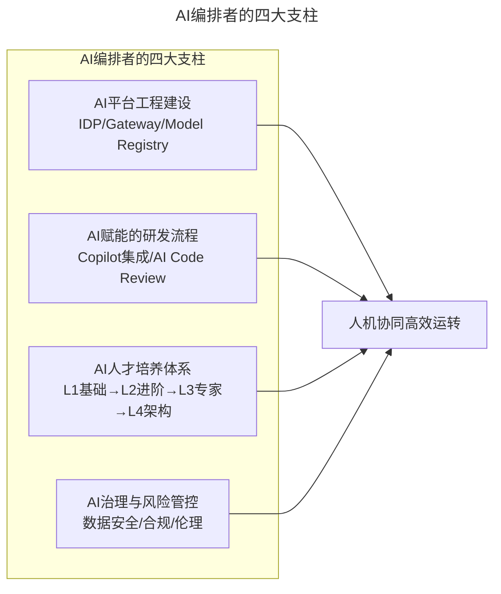

# 第5讲 | CTO的三重境界

> **适用范围**：CTO、技术合伙人及各阶段技术领导者，尤其是需要根据组织发展阶段匹配自身格局、并在AI时代完成境界跃迁的技术管理者；同样适用于希望了解AI-Pioneer / AI-Orchestrator / AI-Visionary演进路径的从业者。
>
> **更新摘要（v2 · 2026-08 更新）**：
> - 结构化升级为 6 节骨架（导言 / 核心方法论 / 关键流程 / 工具与实战 / 常见误区 / 进阶延展）
> - 将三重境界理论升级为AI时代版本：冲锋陷阵型→AI-Pioneer、指挥若定型→AI-Orchestrator、引领方向型→AI-Visionary
> - 补充2026年各境界的新职责、新能力要求与新挑战
> - 保留全部Mermaid图、境界对照表与行动清单

---

## 1. 导言

要谈CTO的格局这个话题有些惶恐，毕竟扶墙老师也不是什么格局的CTO都做过，但CTO的格局不是由个人决定的，而是由组织的成长和所处的阶段决定的。

为了简化模型，我们姑且将不同格局的CTO划分到三个阶段的组织成长过程中去。猛将有猛将的格局和职责，大帅有大帅的格局和职责，领袖有领袖的格局和职责，最主要的是是否与组织现阶段的发展阶段相匹配。合适的才是最好的！

2026年，当我们重新审视扶墙老师的CTO三重境界理论时，会发现其核心逻辑依然成立，但每个境界的能力要求、职责边界和成功标准都已发生深刻变化——从"快速写代码"变为"快速验证AI产品原型"，从"建立管理体系"变为"建立人+AI协同工作体系"，从"定行业标准"变为"预见AI重塑世界并引领方向"。

---

## 2. 核心方法论

### 2.1 第一境界：冲锋陷阵型 → AI-Pioneer（AI先锋）

在组织刚起步到组织还没有成长到相对稳定的阶段，CTO更多要承担的职责是身先士卒，带领团队披荆斩棘，艰苦创业。这个阶段的CTO更多关注的是如何快速使用成熟的技术完成核心产品的原型落地，并快速迭代。务实比什么都重要。

之所以叫冲锋陷阵型CTO，还有一层意思：现阶段的组织里面，作为CTO的你在技术和见识上一般情况下都要比你团队的任何同学都高，所以也意味着你在跳进去做事的同时，还有带人和培养人的职责。

**AI时代升级**：从"代码实现者"变为"AI机会验证者"。2026年AI-Pioneer的核心使命是快速验证AI产品原型的可行性，为组织找到AI时代的切入点。CTO的核心能力从"手速"转向"AI判断力"——知道什么问题适合用AI解决，什么不适合。

关键区别：
- 传统：写代码 → 测试 → 上线
- AI-Pioneer：定义问题 → 找数据 → 选模型 → 验证效果 → 判断是否值得继续

### 2.2 第二境界：指挥若定型 → AI-Orchestrator（AI编排者）

随着组织的成长，团队规模越来越大，依然是冲锋陷阵似的做事方式和格局已经不能满足组织成长的需要了。CTO的格局体现在：要开始抓管理了，要开始抓规范了，要开始向外看了。

CTO不能以过去冲锋陷阵型的思路去做事情，而要学会授权，让专业的人去做专业的事儿。还要关注团队的结构是否健康，通过人才的选用育留来动态调整团队结构，梳理和沉淀日常工作流程。这个阶段的CTO的格局还体现在内外兼修——对内治理清明，对外创造业界影响力。

**AI时代升级**：从"建立管理体系"变为"建立人+AI协同工作体系"。AI-Orchestrator的四大支柱包括AI平台工程建设、AI赋能的研发流程、AI人才培养体系、AI治理与风险管控。最大挑战从"组织惯性"变为"人机协作模式变革"。

### 2.3 第三境界：引领方向型 → AI-Visionary（AI愿景家）

恭喜你，现在的CTO已经站在大平台之上，开始考虑指点江山了。核心抓两个事情：第一是发展自主知识产权的技术和产品，构建属于自己组织和团队特色的技术体系；第二是做业界的方向标，制定行业规范和引领行业方向，塑造和巩固高端技术品牌。

**AI时代升级**：从"定行业标准"变为"预见AI重塑世界并引领方向"。AI-Visionary思考的问题不再是"我们如何用好AI"，而是"AI将把我们带向何方，以及我们希望被带到哪里"。三大核心任务：定义AI愿景、构建AI技术壁垒、建立AI领导力梯队。

### 2.4 三重境界AI版演进对照

| 原始境界 | AI时代升级版 | 核心变化 |
|---------|-------------|---------|
| 冲锋陷阵型 | AI-Pioneer（AI先锋） | 从"快速写代码"变为"快速验证AI产品原型可行性" |
| 指挥若定型 | AI-Orchestrator（AI编排者） | 从"建立管理体系"变为"建立人+AI协同工作体系" |
| 引领方向型 | AI-Visionary（AI愿景家） | 从"定行业标准"变为"预见AI重塑世界并引领方向" |

---

## 3. 关键流程

### 3.1 CTO三重境界AI版演进路径

```mermaid
---
title: CTO三重境界AI版演进路径
---
flowchart LR
    subgraph S1["第一阶段：AI-Pioneer（先锋）"]
        direction TB
        S1_1[组织阶段：初创期/早期]
        S1_2[核心任务：快速验证AI原型]
        S1_3[AI能力：<br/>Prompt Engineering<br/>POC验证<br/>工具使用]
        S1_4[关键特质：<br/>好奇心强<br/>行动迅速<br/>不怕失败]
    end
    
    subgraph S2["第二阶段：AI-Orchestrator（编排者）"]
        direction TB
        S2_1[组织阶段：成长期]
        S2_2[核心任务：构建AI驱动体系]
        S2_3[AI能力：<br/>平台工程<br/>组织变革<br/>治理体系]
        S2_4[关键特质：<br/>系统思维<br/>变革管理<br/>耐心坚韧]
    end
    
    subgraph S3["第三阶段：AI-Visionary（愿景家）"]
        direction TB
        S3_1[组织阶段：成熟期/大型平台]
        S3_2[核心任务：定义AI愿景与方向]
        S3_3[AI能力：<br/>战略规划<br/>行业洞察<br/>思想领导力]
        S3_4[关键特质：<br/>远见卓识<br/>影响力<br/>责任感]
    end
    
    S1 -->|组织成长+个人进化| S2
    S2 -->|组织成长+个人进化| S3
```



上图展示了CTO从AI-Pioneer到AI-Visionary的成长路径。每个阶段都有明确的组织阶段、核心任务、AI能力和关键特质，境界的跃迁需要组织成长与个人进化的双重驱动。

### 3.2 AI-Orchestrator的四大支柱



上图展示了AI-Orchestrator的四大支柱工作：AI平台工程建设提供基础设施，AI赋能的研发流程将AI融入每个环节，AI人才培养体系建立L1-L4能力路径，AI治理与风险管控确保安全合规。四者协同实现人机高效运转。

### 3.3 AI-Visionary的技术壁垒构建

```
数据壁垒 → 模型壁垒 → 系统壁垒 → 生态壁垒

Layer 1: 数据壁垒
  - 独有的数据资产
  - 高质量的数据标注
  - 持续的数据飞轮效应

Layer 2: 模型壁垒
  - 针对业务场景优化的专用模型
  - 持续的模型迭代和优化能力
  - 模型的可解释性和可控性

Layer 3: 系统壁垒
  - AI能力与业务流程的深度整合
  - 人机协同的最佳实践和方法论
  - AI驱动的组织文化和决策机制
```

---

## 4. 工具与实战

### 4.1 AI-Pioneer的AI机会过滤器

AI-Pioneer面临的最大挑战是"AI FOMO"（Fear Of Missing Out，错失恐惧症）。需要建立四道过滤器：

1. **这个问题真的需要AI吗？** — 有时规则引擎、统计分析、甚至Excel就能解决问题
2. **我们有足够的数据吗？** — 没有高质量的数据，再强的模型也是garbage in, garbage out
3. **我们能承受失败吗？** — AI项目的不确定性远高于传统软件项目
4. **我们有持续投入的准备吗？** — AI不是一次性项目，需要持续的维护和优化

### 4.2 ⭐2026行动清单

**如果你是AI-Pioneer（初创期CTO）**：
- [ ] 本周内用GPT-5.5/Claude 4.5完成一个完整功能的POC
- [ ] 建立团队的AI工具使用规范（含数据安全红线）
- [ ] 评估核心业务场景的AI替代可行性
- [ ] 建立"AI POC快速验证机制"：任何新功能先用AI原型72小时内验证可行性

**如果你是AI-Orchestrator（成长期CTO）**：
- [ ] 启动AI平台工程建设（IDP + Model Gateway）
- [ ] 设计AI人才培养路径图（L1-L4）
- [ ] 制定AI投资ROI评估框架
- [ ] 引导团队从"抵触AI"到"主动拥抱AI"的文化转型

**如果你是AI-Visionary（成熟期CTO）**：
- [ ] 发布公司级AI战略白皮书（3-5年规划）
- [ ] 构建至少一项AI技术壁垒（数据/模型/系统）
- [ ] 建立AI战略决策委员会
- [ ] 培养AI领导力梯队（AI技术领导者/业务领导者/战略领导者）

### 4.3 2026行业案例参考

- **DeepSeek V4**的开源策略重塑了AI基础设施竞争格局
- **Agentic Coding**正在改变软件开发范式——从"写代码"到"描述意图"
- **Agent加速落地期**：2026年被业界称为"Enterprise AI Agent元年"

---

## 5. 常见误区

### 5.1 格局滞后于组织发展阶段

CTO的格局是由组织成长和所处阶段决定的，作为CTO的格局可以超前，但不能滞后，否则就会严重制约组织的发展，进而拖累业务发展并让自己的团队沦落到拖组织后腿的境地。

### 5.2 过早追求架构合理

在冲锋陷阵阶段，你来不及去想什么架构合理，什么技术更优，你要做的就是想方设法让业务和产品落地，想得太多，对团队和公司都是危险的。现阶段的CTO，务实比什么都重要。

### 5.3 冲锋陷阵型CTO不能成长

有的人擅长从0到1，有的人擅长从1到N。作为高级技术管理者，要了解自己的认知边界，要么不停挑战自己不停进化，要么急流勇退，为整个公司提供更好的上升空间。

### 5.4 AI时代忽视人机协作模式变革

McKinsey 2026报告显示：86%企业承认AI转型面临组织架构变革困难。传统KPI/OKR体系失效风险：如何衡量"AI辅助产出"vs"人工产出"？这是AI-Orchestrator必须解决的核心难题。

### 5.5 平稳发展阶段放松警惕

打江山难，坐江山更难。平稳发展阶段不要给过多的资源，一直要保持着技术团队"半饥饿"状态，这样在前期积累的狼性才可以持续保持，而不是把一群狼训练成狗；当然，也不要在余粮的时候故意把狼饿死。

---

## 6. 进阶延展

### 6.1 扶墙老师核心观点的AI时代验证

| 原文观点 | AI时代验证 | 备注 |
|---------|-----------|------|
| "格局由组织发展阶段决定" | ✅ 依然成立 | 但每个阶段的AI能力要求大幅提升 |
| "合适才是最好的" | ✅ 但"合适"的定义变了 | 现在包括AI Readiness评估维度 |
| "CTO要带人和培养人" | ✅ 培养内容更新 | 新增：AI素养、人机协作思维、Prompt能力 |
| "中军帐里坐镇指挥" | 🔄 新成员加入 | 中军帐里不仅有将军和士兵，还有AI这位超级参谋 |

### 6.2 真实案例：腾讯CTO张志东关于QQ架构

"当初创业时候的规划是：第一年同时在线人数到达1K，第二年2K，第三年4K，第四年8K，第五年就可以上万了，而实际上第五年的时候腾讯已经做到了500万的同时在线数……如果1998年创业初期，就让他做到支持500万的同时在线人数，可能就不敢创业了。"

**AI-Pioneer的启示**：不要追求完美的AI方案，先做出能用的MVP，然后快速迭代。过度设计是创业公司的大敌。

### 6.3 作者简介

王福强，人称"扶墙老师"，《Spring揭秘》《SpringBoot揭秘》作者，杭州福强科技有限公司创始人，原挖财首席架构师/技术VP，原天猫和阿里巴巴资深架构师和高级技术专家，TGO鲲鹏会杭州分会会员。技术人出身，走过了15+年的技术历程，爱读书，爱武术，爱码字，爱射击，爱老婆……

---

*本文档基于2026年8月的技术动态编写，旨在帮助读者以新时代视角重新审视经典内容。技术演进日新月异，建议读者结合自身场景批判性思考。*
