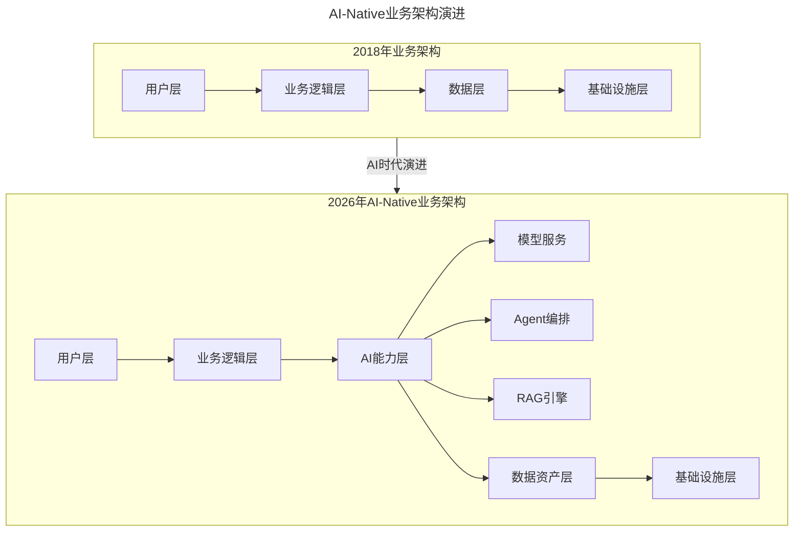
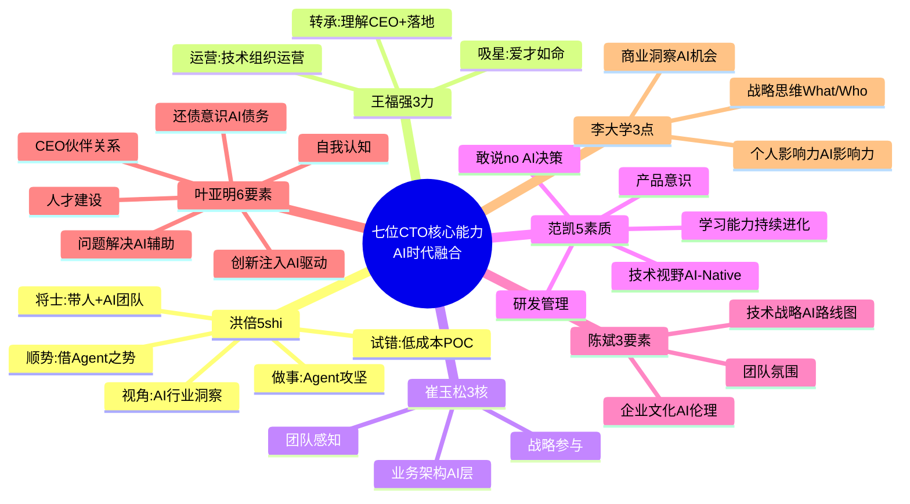
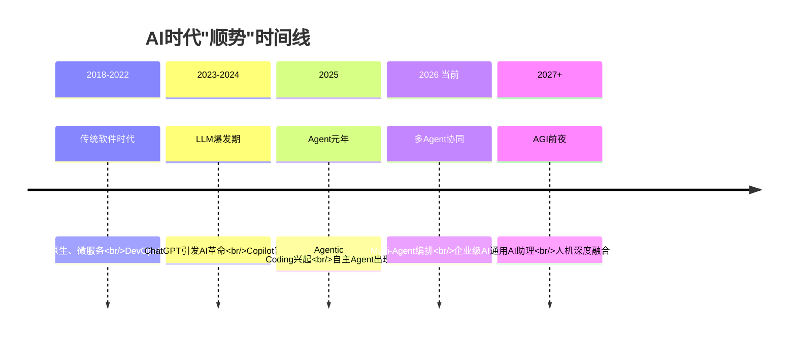

# 第2讲 | 七位CTO纵论技术领导者核心能力

> **适用范围**：CTO、技术VP、技术总监及各层级技术管理者，尤其是希望从多位资深CTO的实战经验中提炼核心能力模型、并在AI时代完成能力升级的技术领导者。
>
> **更新摘要（v2 · 2026-08 更新）**：
> - 结构化升级为 6 节骨架（导言 / 核心方法论 / 关键流程 / 工具与实战 / 常见误区 / 进阶延展）
> - 整合七位CTO的核心能力观点，并补充AI时代（2026）各能力的演进解读
> - 新增AI时代CTO五大核心主题：人机协同、架构升级、战略决策、风险治理、创新驱动
> - 保留全部Mermaid图、能力融合视图与行动清单

---

## 1. 导言

关于技术领导者的具体职责和能力要求，每个企业会给出自己的定义。同样的职位，由于企业文化的区别，以及具体的业务和发展阶段不同，相应的要求也会有所不同。但总体来说，有一些核心的能力，是衡量一位技术领导者是否优秀的通用标准。

CTO这个岗位对技术领导者的能力要求是最全面的，基本上可以覆盖技术管理核心能力的各个方面。我们邀请了七位现任或曾任CTO，请他们根据自己工作中的体会，总结CTO需要具备的核心能力。

2026年，当GPT-5.5已全面商用，DeepSeek V4开源引发全球关注，Agentic Coding成为主流开发模式，Stack Overflow调查显示**84%的开发者已在日常工作中使用AI编程工具**。在这个背景下，七位CTO在2018年分享的核心能力框架不仅没有过时，反而更加重要——但每个能力都需要注入AI时代的新内涵。

---

## 2. 核心方法论

### 2.1 洪倍的5个"shi"

AdMaster联合创始人兼CTO洪倍将CTO能力总结为5个"shi"字：

1. **将士（带兵）**：了解每一个团队成员的特征，关心每一个小伙伴的成长，打造一支能战斗的团队
2. **做事（攻坚）**：身先士卒、迎难而上，CTO没有攻坚平事的能力，愧对"技术"这个词
3. **视角（洞察）**：行业洞察、市场思维、成本视角，多视角观察才能找到更匹配的技术解决方案
4. **试错（创新）**：勇于试错，勇于承担，勤于总结。创新和成功来自于无数次的试错
5. **顺势（趋势）**：预判技术发展趋势，学会顺势而为，借助各方的资源和力量

**AI时代升级**：将士→带"人+AI"混合团队；做事→用AI Agent攻坚，人负责创意和决策；视角→AI如何改变行业格局的洞察力；试错→AI降低试错成本，加速POC验证；顺势→顺势AI浪潮，借Agent生态之力。

### 2.2 王福强的三种能力

杭州福强科技有限公司创始人王福强认为CTO的核心能力：

1. **运营能力**：技术组织的运营，包括日常、组织结构以及技术文化和营销等软硬结合的运营方式
2. **转承能力**：理解CEO和Peer部门的意图和规划，进而推动落地
3. **吸星能力**：爱才如命，当CTO对人的重视略高于对技术的重视时，格局就更上一层楼

**AI时代升级**：运营→运营"人+AI"混合组织；转承→翻译CEO的AI愿景为技术路线图；吸星→同时吸引AI人才和AI工具，建立AI人才梯队。

### 2.3 崔玉松的三个核心

有赞CTO崔玉松认为最重要的是参与战略制订、战略实施和战略分解的能力。其次就是业务架构的能力和对团队感知的能力。

"如果他不是一个业务架构师，不是一个能给团队指明更好方向的人，他最终会沦为一个需求翻译器，产品经理说怎么做就怎么做。"

**AI时代升级**：业务架构能力需要包含全新的AI能力层。AI-Native业务架构在传统四层（用户层、业务逻辑层、数据层、基础设施层）基础上新增AI能力层（模型服务、Agent编排、RAG引擎）。

上图展示了业务架构从2018年传统四层到2026年AI-Native架构的演进。新增的AI能力层包含模型服务、Agent编排和RAG引擎三大组件，成为业务逻辑层与数据资产层之间的关键中间层。

### 2.4 范凯的五种素质

丁香园CTO范凯认为CTO需要具备：技术视野良好、动手能力要强、管理研发团队过硬、具备良好的产品意识、敢于对CEO说"不"。

**AI时代升级**："敢于对CEO说不"有了全新的应用场景：

| CEO的AI相关决策 | CTO应该怎么说"不" | 理由和替代方案 |
|---------------|------------------|--------------|
| "全面引入AI替代所有XX岗位" | "不，这不现实" | 给出人机协同最优方案：AI承担60%重复工作，人类专注30%创意+10%决策 |
| "买最贵的AI工具" | "不，性价比不高" | 基于场景匹配度建议：核心场景用高级版，一般场景用开源方案 |
| "让AI帮我们写所有代码" | "不，风险太大" | 建立分级策略：非核心模块可用AI，核心业务逻辑必须人工把关 |
| "3个月内完成全面AI化" | "不，这不可能" | 给出渐进式路线图：Q3试点→Q4推广→明年Q1全面铺开 |

### 2.5 陈斌的三要素

易宝支付CTO陈斌认为CTO需要具备：技术战略、企业文化、团队氛围。CTO可以不写代码，但意味着有更重要的事情要做。企业文化是能够帮你把整个企业的研发人员、氛围、管理过程组织起来的有效手段。

**AI时代升级**：技术战略→AI技术路线图制定；企业文化→塑造"人机协作"文化；团队氛围→理解员工的AI焦虑。

### 2.6 叶亚明的六大要素

携程首席科学家叶亚明提出合格CTO的六大要素：技术问题的解决能力、强烈"还债"意识、构建与CEO的良好伙伴关系、清晰的自我认识、团队人才建设、给工作注入新的东西。

**AI时代升级**：新增"AI技术债务"概念——模型锁定债务、Prompt债务、数据质量债务、可解释性债务。"还债意识"比以往任何时候都更重要。

### 2.7 李大学的三点

磁云科技创始人及CEO、京东终身荣誉技术顾问李大学认为好的CTO具有商业敏感性：商业洞察能力、战略思维、个人影响力。

"很多CTO都是从技术人员做起来的，技术人员往往会想一个问题怎么做（How），但在研究战略问题时，我们更多研究的是What和Who的问题。"

**AI时代升级**：商业洞察→识别AI带来的商业机会（效率革命、体验革命、新模式创新）；战略思维→AI时代的What/Who；个人影响力→成为公司内部的"AI布道者"。

---

## 3. 关键流程

### 3.1 七位CTO核心能力的AI时代融合视图

上图以思维导图形式展示了七位CTO核心能力在AI时代的融合。每位CTO的观点都注入了AI时代的新内涵，共同构成AI时代CTO的完整能力图谱。

### 3.2 AI时代CTO的五大核心主题

透过七位CTO的观点，可以提炼出AI时代CTO的五大核心主题：

| 主题 | 对应CTO | 核心要求 |
|-----|--------|---------|
| **人机协同** | 洪倍、王福强、陈斌 | 管理"人+AI"混合团队和工作流 |
| **架构升级** | 崔玉松、范凯、叶亚明 | 设计AI-Native的业务和技术架构 |
| **战略决策** | 范凯、李大学、崔玉松 | 制定AI战略，管理CEO期望 |
| **风险治理** | 范凯、叶亚明、陈斌 | 管理AI技术债务、伦理、安全风险 |
| **创新驱动** | 洪倍、叶亚明、李大学 | 利用AI驱动业务创新和效率提升 |

### 3.3 AI时代"顺势"时间线

上图展示了AI时代技术发展趋势的时间线。从传统软件时代到LLM爆发期，再到Agent元年和多Agent协同，CTO需要顺势而为，预判AI技术发展路线图。

---

## 4. 工具与实战

### 4.1 2026年最大的商业机会（基于李大学的商业洞察框架）

**效率革命机会**：
- 用AI降低30-50%的研发成本
- 用AI提升客户服务的响应速度和质量
- 用AI自动化运维和测试流程

**体验革命机会**：
- AI个性化的用户体验（千人千面的推荐、客服、内容）
- AI增强的产品功能（智能写作、智能分析、智能创作）
- AI驱动的全新交互方式（自然语言交互、多模态交互）

**新模式创新机会**：
- AI Native产品（完全基于AI构建的新产品）
- AI Platform化（将AI能力开放给生态伙伴）
- AI+行业解决方案（AI与垂直行业的深度结合）

### 4.2 AI技术债务的四种类型

叶亚明强调的"还债意识"在AI时代有了新概念：

- **模型锁定债务**：过度依赖某个AI厂商的API，迁移成本极高
- **Prompt债务**：大量硬编码的Prompt难以维护和优化
- **数据质量债务**：用于训练/微调的数据质量不佳，导致模型效果差
- **可解释性债务**：AI决策过程不透明，难以调试和审计

### 4.3 给2026年技术领导者的行动清单

**本周行动（Immediate Actions）**：
- [ ] 评估自己和团队的AI成熟度（使用AI工具的频率、深度、效果）
- [ ] 与CEO进行一次关于AI期望管理的对话
- [ ] 识别团队中可以通过AI提效的3个具体场景

**本季度目标（Quarterly Goals）**：
- [ ] 输出一份《团队AI能力建设路线图》
- [ ] 完成至少一个AI Pilot项目（POC验证）
- [ ] 建立AI代码审查标准和流程
- [ ] 组织一次团队内部的AI技术分享会

**年度规划（Annual Plan）**：
- [ ] 制定公司/部门的AI战略白皮书
- [ ] 搭建或选型企业级AI开发平台
- [ ] 培养2-3名AI Champion（AI技术推广者）
- [ ] 建立AI治理框架（数据安全、模型选择、伦理准则）

---

## 5. 常见误区

### 5.1 CTO沦为需求翻译器

崔玉松警告："如果他不是一个业务架构师，不是一个能给团队指明更好方向的人，他最终会沦为一个需求翻译器，产品经理说怎么做就怎么做。"在AI时代，如果CTO不具备AI架构能力，就会沦为翻译AI能做什么、不能做什么现实边界的人。

### 5.2 不敢对CEO说"不"

范凯强调：只要不是技术出身的CEO，必然对研发是门外汉。CEO不是每个想法都靠谱的，CTO有责任站在更加专业的角度去帮助CEO纠正，推演，完善想法。一个不敢对CEO说不的CTO，这个公司肯定要走很长很长的弯路。AI hype泛滥时代，这一点尤为重要。

### 5.3 忽视商业敏感性

李大学指出：很多CTO都是从技术人员做起来的，技术人员往往会想一个问题怎么做（How），但在研究战略问题时，我们更多研究的是What和Who的问题。不能识别AI机会的公司会被淘汰。

### 5.4 技术视野停留在传统领域

范凯强调CTO要有良好的技术视野，不需要各种技术都样样精通，但必须有所涉猎有所了解。2026年技术视野必须扩展到AI技术栈：LLM、RAG、Agent、Vector DB、Embedding等。

### 5.5 忽视AI技术债务

叶亚明的"还债意识"在AI时代更加重要。AI技术债务比传统技术债务更隐蔽、更危险——过度依赖AI模型会导致供应商锁定，AI生成代码的质量问题会在后期爆发。

---

## 6. 进阶延展

### 6.1 为什么这些观点在AI时代更加重要？

1. **洪倍的"带兵"更重要了**：AI时代，"兵"不仅是人，还有AI Agent，管理"人+AI"混合团队比纯人类团队更复杂
2. **王福强的"转承"更重要了**：CEO对AI的期望往往不切实际，CTO需要充当"AI现实翻译器"
3. **崔玉松的"业务架构"更重要了**：AI不是简单的工具叠加，而是架构层面的变革
4. **范凯的"敢于说不"更重要了**：AI hype泛滥，CEO容易做出冲动决策，CTO需要用专业判断力保护公司
5. **陈斌的"企业文化"更重要了**：AI会引起员工的焦虑和抵触，需要塑造积极的"人机协作"文化
6. **叶亚明的"还债意识"更重要了**：AI技术债务比传统技术债务更隐蔽、更危险
7. **李大学的"商业洞察"更重要了**：AI正在重塑所有行业的商业模式

### 6.2 七位CTO共同的核心主题

透过七位CTO的观点，可以提炼出AI时代CTO的五大核心主题：人机协同（管理"人+AI"混合团队）、架构升级（设计AI-Native架构）、战略决策（制定AI战略，管理CEO期望）、风险治理（管理AI技术债务、伦理、安全风险）、创新驱动（利用AI驱动业务创新和效率提升）。

### 6.3 结语

七位CTO在2018年分享的智慧，经过AI时代的洗礼，不仅没有褪色，反而焕发出新的光芒。真正的经典之所以是经典，是因为它抓住了本质——而CTO的本质，无论在哪个时代，都是**整合资源、引领方向、创造价值**。只是在AI时代，"资源"中加入了AI能力，"方向"中加入了AI战略，"价值"中加入了AI驱动的效率和体验提升。

正如洪倍所说，CTO要"顺势而为"。2026年的"势"，就是AI之势。愿每一位技术领导者都能在这股浪潮中，找到自己的定位，带领团队和人+AI的混合舰队，驶向更广阔的未来。

---

*本文档基于2026年8月的技术动态编写，旨在帮助读者以新时代视角重新审视经典内容。技术演进日新月异，建议读者结合自身场景批判性思考。*
