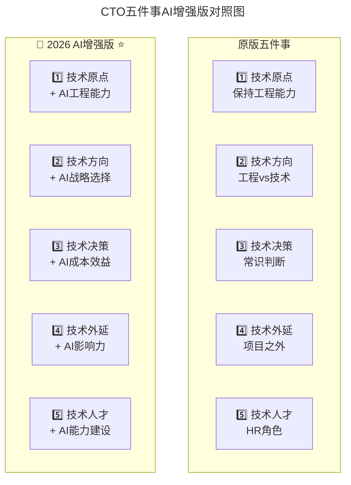

# 第166讲 | 俞圆圆：合格CTO应该做好的5件事

> **适用范围**：CTO、技术VP/总监及各阶段技术领导者，尤其是需要在AI时代重新审视自身技术原点、技术方向与技术决策能力的管理者；同样适用于希望了解"五件事"AI增强版（AI-Augmented Five Things）的从业者。
>
> **更新摘要（v2 · 2026-08 更新）**：
> - 结构化升级为 6 节骨架（导言 / 核心方法论 / 关键流程 / 工具与实战 / 常见误区 / 进阶延展）
> - 将"五件事"全面升级为AI时代版本：技术原点+AI工程能力、技术方向+AI战略选择、技术决策+AI ROI分析、技术外延+AI影响力、技术人才+AI能力建设
> - 补充2026年各维度的新要求、新常识与新挑战
> - 保留全部Mermaid图、对照表与行动清单

---

## 1. 导言

今天聊聊CTO的素质与战略这个话题，因为是命题作文，所以在正文开始前还是需要说明一下：CTO的素质和战略虽然有关联，但其实是两个不同的主题。做一个小小的类比吧：

> 两匹狼来到一个草原。
>
> 第一匹狼感到很沮丧，因为他没有看到肉。这是视力。
>
> 第二匹狼感到很兴奋，因为他知道有草就一定会有羊。这是视野。

素质当然会影响你的战略决策能力，就像视力会影响你的视野一样，但一名合格的CTO不能局限于必须看见了羊，才能判断出一定有肉吃。

2026年，GPT-5.5多模态大模型成熟商用、DeepSeek V4开源模型性能比肩闭源方案、Stack Overflow调查84%开发者日常使用AI编程工具、Agent智能体进入加速落地期。俞圆圆老师提出的"CTO五件事"在AI时代需要重新定义——每件事都要加入"AI增强"的新维度。以下想分5个点来和大家具体聊一聊：

1. 技术原点（Technical Origin）：At the end of the day, 你还是一个工程师
2. 技术方向（Technical Direction）：工程（Engineering）和技术（Technology），何者优先
3. 技术决策（Technical Decision-making）：通过"常识"来做判断，做正确的事
4. 技术外延（Technical Extension）：项目做好了，但还有其他的事
5. 技术人才（Technical Talent）：CTO是技术团队最重要的HR

---

## 2. 核心方法论

### 2.1 技术原点：你的原点应该还是一个工程师

CTO这个角色容易进入2个误区：

1. 认为管理能力的重要性要远重于技术能力。
2. 认为管人（people management）的重要性要远重于管事（project management）

有人总喜欢用军事指挥官的例子来做类比，声称好的将军不需要自己上前线冲锋陷阵。这样的类比中的逻辑漏洞稍微仔细思考一下就不难发现，但这里我想强调的是：诚然，出色的管理能力是CTO/技术VP/技术总监这样的领导岗位上必备的能力，但"学而优则仕"的逻辑不能僵化引申到技术职场上来变成"码而优则管"。不要盲目地鼓励或同意优秀的程序员转到管理岗，不然你可能收获一个三流的管理者而失去一个一流的工程师。

与此同时，我们不能轻视技术能力对于技术领导岗位的绝对必要性。我自己认识和了解的范围内，没有一家成功企业的CTO是一个管理学上的大师但却是技术上的弱鸡。我所认识的优秀的技术管理者几乎都是同时在技术专业领域持续不懈地坚持与时俱进的人。

总之，CTO绝对不能放下技术，而技术能力的养成没有什么捷径，只有不断学习与时俱进，才能不至于"不知有汉，何论魏晋"。

**AI时代升级**：从"工程师"变为"工程师 + AI工程师"。

| 维度 | 2018要求 | 2026新增要求 |
|-----|---------|-----------------|
| **学习内容** | 每年学一门新语言/领域 | +每年深入学习一个AI应用领域 |
| **学习方式** | 读书、实践 | +用AI辅助学习、构建AI项目 |
| **技术深度** | 能写高质量代码 | +能审核和优化AI生成的代码 |
| **技术广度** | 了解多领域 | +了解AI在各领域的应用可能 |

### 2.2 技术方向：工程（Engineering）和技术（Technology），一体两面

对于技术团队来说，实现业务大体上就是指团队工程（Engineering）能力，但追求业务项目的落地实现和追求技术能力（Technology）的迭代演进，不应该成为两个互相矛盾的事。这两者本来就是互相促进螺旋上升的。

同样的业务场景，在不同的性能要求下，对团队就会不断提出更高的技术要求。而另一方面，没有解决实际问题的技术方案，即使听起来很酷炫，它的价值也十分有限。

总结一下：

1. 业务，或者说工程（Engineering），一点也不low，在不同时空复杂度的要求下，它会不断演变出新的技术（Technology）挑战来。
2. 警惕过度追逐没有实际问题可解决的技术热点，对于团队中类似"一直在做业务，技术没有进步"这样的困惑能胸有成竹地回答。

**AI时代升级**：新增第三维度——AI Capability（AI能力建设）。

三角平衡模型：好的技术方向应该同时满足——能解决实际业务问题（Engineering）、有技术挑战性和成长空间（Technology）、能借助AI放大效能（AI Capability）。

### 2.3 技术决策：依赖"常识"做判断，做正确的事

即使再勤奋努力，我们也不可能做到对每个技术领域都有足够的学习和了解，所以作为技术领导者，很重要的一个素质就是在没有充分了解一个领域的情况下，如何还能有效地帮助团队做出正确的判断。

面对知之不深的领域，"常识"也许是能够帮助我们做出正确判断的最有效的方法。关键常识原则包括：

1. 评估候选人的能力（责任心、抗压力、创造力），而不是知识
2. 做任何决策，先问问评估成败的核心指标是什么
3. 核心指标宜少不宜多
4. 指标要尽量可量化
5. 先抗住再优化，边重构边生活
6. 持续迭代，而不是过度设计
7. 化繁为简
8. 其他人听不懂的一定不是好的技术方案
9. 让懂的人和不懂的人都能坦然地表达自己的"有知"和"无知"
10. 有违价值观底线的方案坚决不采纳
11. 先统一思想，再约束行动

**AI时代新增"AI决策常识"**：

| # | AI时代的常识原则 | 说明 |
|---|-----------------|------|
| 1 | 不要为了AI而AI | 如果传统方法能以更低成本达到90%效果，先用传统方法 |
| 2 | AI成本要算总账 | 不只是API费用，还有审核时间、集成成本、维护成本 |
| 3 | AI能力边界要清楚 | 明确告诉团队什么AI能做、什么不能做 |
| 4 | AI输出必须审核 | 关键业务场景绝不直接使用AI输出 |
| 5 | AI工具要统一 | 避免团队使用过多不同工具导致的知识孤岛 |

### 2.4 技术外延：项目之外，还有你需要关心的

作为团队的技术负责人，确保业务及时安全稳定的交付是我们的本分，但除此之外还有很多其他重要的工作：

1. 专利申请
2. 外部的技术影响力和技术形象
3. 内部的技术氛围
4. 企业基础IT建设
5. 成本管控（人力成本，运维成本等）

**AI时代新增优先级最高的AI外延工作**：

| 优先级 | 外延工作 | 具体行动 | 投入产出比 |
|-------|---------|---------|----------|
| ⭐⭐⭐ | AI成本监控与优化 | 建立AI工具/API支出看板 | 极高（可能节省30%+预算） |
| ⭐⭐⭐ | AI能力基线建设 | 定义各角色必备的AI技能 | 高（影响招聘和培训） |
| ⭐⭐ | AI安全与合规规范 | 制定数据使用和审核流程 | 高（规避法律风险） |
| ⭐⭐ | AI最佳实践沉淀 | 建立团队Prompt库和工作流模板 | 中（提升效率） |
| ⭐ | AI社区影响力 | 技术分享、开源贡献 | 中（长期品牌建设） |

### 2.5 技术人才：你就是团队最重要的HR主官

作为技术领导者，你最重要的工作职责之一就是为团队培养和选拔人才。HR关于人才体系的各个环节，不论是招聘，培训，还是绩效等等，我们千万不能认为"交给HR就好了嘛"。我们自己才是团队最重要的HR主管。

人才体系的四个阶段：招聘阶段、培训阶段、绩效阶段、汰换阶段。

**AI时代新增HR职责**：

| 阶段 | 传统HR职责 | 2026新增AI职责 |
|-----|----------|-------------------|
| **招聘** | JD编写、面试、评估 | +AI工具使用测试、AI协作风格评估 |
| **培训** | 技术培训计划 | +AI技能培训体系、Prompt Engineering训练 |
| **绩效** | KPI/OKR制定 | +AI效能指标（如AI使用率、人机协作效率） |
| **汰换** | PIP、末位淘汰 | +评估是否是"AI适应性问题"而非能力问题 |

### 2.6 五件事的AI时代重构



上图展示了CTO五件事从原版到AI增强版的升级对照。每件事在保持原有核心理念的基础上，都新增了AI维度的能力要求，形成"传统能力 + AI能力"的双重胜任力模型。

---

## 3. 关键流程

### 3.1 技术方向的三角平衡模型

```
三角平衡模型：
     Technology（技术前沿）
          /           \
         /             \
Engineering（业务）  AI Capability（AI能力）
```

⭐2026判断标准：一个好的技术方向应该同时满足：
- 能解决实际业务问题（Engineering）
- 有技术挑战性和成长空间（Technology）
- 能借助AI放大效能（AI Capability）

### 3.2 技术决策的AI时代升级维度

| 决策场景 | 传统考虑因素 | 2026新增因素 |
|---------|------------|-----------------|
| **技术选型** | 成熟度、生态、团队熟悉度 | +AI工具链支持程度、AI代码生成质量 |
| **架构设计** | 可扩展性、性能、可靠性 | +AI集成便利性、Agent编排支持 |
| **外包vs自研** | 成本、控制权、安全 | +AI能替代多少工作量、AI工具的成熟度 |
| **人才招聘** | 技术能力、文化匹配 | +AI协作能力、AI学习能力 |

### 3.3 绩效指标的新常识

**原文观点**：绩效目标越少越好（≤5个，甚至≤3个）

**AI时代新增效能指标建议**：
- 团队AI工具使用率（目标：>80%）
- 人机协作效率提升率（目标：>30%）
- AI辅助代码占比（目标：>40%）
- AI相关Bug率（目标：<5%）

---

## 4. 工具与实战

### 4.1 技术原点的自律标准

原文提出的自律要求：
- 每年学习一种新的编程语言
- 每年深入关注一个新的技术领域

**2026新自律标准**：
- 每年学习一种新的编程语言或AI框架
- 每年深入关注一个新的技术领域（含AI相关）
- 每周至少用10小时进行"人机协作编码"

### 4.2 技术人才管理的AI时代清单

#### 招聘阶段
- [ ] 我们的JD是否包含了AI技能要求？
- [ ] 面试中是否有AI工具使用测试环节？
- [ ] 我们能否识别候选人的"AI协作风格"？

#### 培训阶段
- [ ] 我们是否有系统的AI技能培训计划？
- [ ] 新人Onboarding中是否包含AI工具使用指导？
- [ ] 是否有内部的AI最佳实践分享机制？

#### 绩效阶段
- [ ] 绩效评估中是否包含AI效能指标？
- [ ] 目标设定是否考虑了AI工具对产能的影响？

#### 汰换阶段
- [ ] 绩效问题是"能力问题"还是"AI适应性问题"？
- [ ] 是否尝试过配备AI工具后再评估？

### 4.3 ⭐2026行动清单

**本周立即行动**：
1. 评估自己在"五件事"每个维度上的AI成熟度
2. 选择最薄弱的1-2个维度制定改进计划
3. 与团队成员讨论AI工具的使用现状和痛点
4. 梳理当前团队的AI工具使用情况，建立基线数据

**第一个月目标**：
- [ ] 个人AI工具使用率达到日常工作60%以上
- [ ] 为团队引入或优化至少1个AI工作流
- [ ] 完成一次"AI技术方向"的战略讨论
- [ ] 发布团队的"AI使用规范V1.0"
- [ ] 完成首轮"AI技能摸底"评估
- [ ] 建立AI工具支出的监控机制

---

## 5. 常见误区

### 5.1 "码而优则管"的僵化引申

不要盲目地鼓励或同意优秀的程序员转到管理岗，不然你可能收获一个三流的管理者而失去一个一流的工程师。

### 5.2 管理能力重于技术能力的误区

没有一家成功企业的CTO是一个管理学上的大师但却是技术上的弱鸡。优秀的技术管理者几乎都是同时在技术专业领域持续不懈地坚持与时俱进的人。

### 5.3 过度追逐没有实际问题的技术热点

区块链在2017/2018年时的无脑狂欢就是典型案例。技术底层并没有发明太多新内容，核心还是由一系列经典的基础模块重新组成的算法逻辑。也许在某一个时间会有适合区块链技术场景的实际问题出现，但显然不是当时无脑狂欢的形式。

### 5.4 绩效指标过于繁复

如果一个员工将一个季度的绩效目标划分为7-8个小项来评估，每个小项占10%-15%的权重，说明团队管理或自我管理出现了问题：工作没有重点、任务拆分混乱、指导浮于表面、对结果导向缺乏信心。

### 5.5 技术外延工作全部交给HR

如果招聘、培训、绩效、汰换等工作，你作为团队的技术负责人没有想过而是全部交由HR部门来处理的话，也许那并不是最好的安排。

### 5.6 AI时代"为了AI而AI"

如果传统方法能以更低成本达到90%效果，先用传统方法。AI成本要算总账——不只是API费用，还有审核时间、集成成本、维护成本。

---

## 6. 进阶延展

### 6.1 技术预研的战略眼光

作为团队的技术领导者，要有能力识别一类问题，这类问题是需要技术预研先行的，我们不能等着产品需求提出来了才去做技术预研或储备，这样被倒逼往往会十分被动。

案例：2017年了解Apache Flink时只是作为流式计算框架调研，但了解到阿里巴巴将"流处理"和"批处理"统一在Flink框架下（Blink）后，虽然当时还没有业务场景需要使用，但感到不久的将来很可能出现这样的业务场景，因此一直密切关注并积累实践经验，最终基于真实业务场景落地了Blink的使用。

技术部门主管做出技术预研决策时会受到很多挑战——业务部门希望把研发力量更多配置到当前业务项目，财务部门可能对前瞻性投入提出投入产出比质疑。面对这些挑战，技术领导者能否有审慎的判断和足够的自信去推进正确的工作，这就是战略眼光。

### 6.2 技术外延的长期价值

很多"技术外沿"的工作经常是没有短期直接回报的，但作为技术团队的领导者，应该有战略眼光，在合适的时间为了一些长期的价值坚持去做相应的投入。积一时之跬步，臻千里之遥程。

案例：VPGAME作为创业公司，在没有完整市场商务部门的情况下，CTO直接拉上HR招聘部门一起做技术市场推广和对外技术影响力建设。即使做一整年这样的工作就换来一个优秀研发人员的加入，都是值得的。

### 6.3 作者简介

俞圆圆，VPGame CTO，TGO鲲鹏会会员，前UCloud 基础云计算研发中心总监。曾经分别供职于 Microsoft Windows Azure 和 Amazon AWS EC2，历任研发工程师，高级研发主管，首席软件开发经理。经常深入第一线为客户提供技术支持，全面参与日常运维和现网问题排查，并组建和带领过实战能力极强的研发团队。在大规模、企业级分布式系统、面向服务架构、TCP/IP 协议栈、数据中心网络、云计算平台服务的研发和运维等方向积累了大量的实战经验。

---

*本文档基于2026年8月的技术动态编写，旨在帮助读者以新时代视角重新审视经典内容。技术演进日新月异，建议读者结合自身场景批判性思考。*
