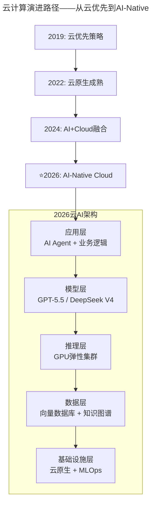
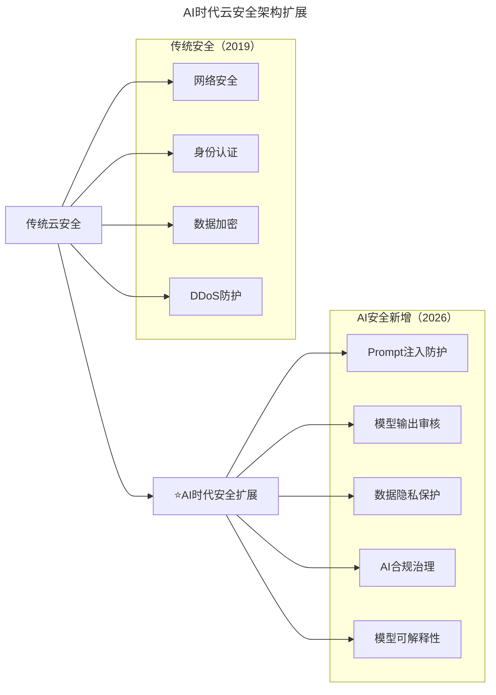

# 第194讲 | 刘俊强：2019年云计算趋势对技术人员的影响

> **适用范围**：CTO、技术架构师及云平台负责人，尤其是需要从"会用云"升级为"善用AI云"的技术管理者；同样适用于关注云计算→AI基础设施演进、MLOps/LLMOps能力建设的技术人员。
>
> **更新摘要（v2 · 2026-08 更新）**：
> - 结构化升级为 6 节骨架（导言 / 核心方法论 / 关键流程 / 工具与实战 / 常见误区 / 进阶延展）
> - 将2019年"云技能栈"理论全面升级为2026年AI-Native Cloud版本
> - 补充2019 vs 2026云计算演进对比、AI驱动云基础设施革命、技术管理者新十件事
> - 保留全部Mermaid图、对照表与行动建议

---

## 1. 导言

一个普遍的共识是，云计算优先概念将在接下来的几年内被普遍接受，云计算也将被各大企业以及独立开发者所选择采用，而对于 IT 从业人员或技术人员来讲，面临的主要影响是自身云技能栈的建立。

目前，各大企业都加大了在云计算上的投入，那么如何将云计算使用好，追求最大的投入回报便成为关键问题。云计算和传统 IDC 有着诸多区别，如果仅仅将云计算当做传统 IDC 来进行使用便达不到上云的目的。简化来看，企业上云的期望主要在于成本优化和效率提升，而技术人员需要通过技能来帮助企业达到这样的目标。

**2026年技术背景**：2019年的核心议题是"企业如何上云"，而2026年的核心议题已经转变为"企业如何利用云端AI能力"。大模型即服务（LLMaaS）、AI推理基础设施、Serverless AI等新模式彻底改变了云计算的内涵。

### 2019 vs 2026 云计算演进对比

| 维度 | 2019年认知 | ⭐2026年现实 |
|------|-----------|-------------|
| **核心价值** | 成本优化+效率提升 | AI基础设施即服务（AIaaS） |
| **弹性能力** | Auto Scaling、Serverless | GPU弹性集群、AI推理自动扩缩容 |
| **安全模型** | 责任共担模型 | AI安全+数据隐私+模型合规治理 |
| **网络架构** | VPC、多云互联 | 云边协同+AI推理就近部署 |
| **开发范式** | 云原生、微服务 | AI-Native、Model-as-a-Service |
| **技能要求** | 云网络、安全架构 | MLOps、LLMOps、Prompt Engineering |

---

## 2. 核心方法论

### 2.1 云计算三类服务

在开始讨论云技能栈的挑战前，先回顾下云计算的三类服务：IaaS（Infrastructure as a Service，基础设施即服务）、PaaS（Platform as a Service，平台即服务）以及 SaaS（Software as a Service，软件即服务）。

云厂商和客户的责任分配根据服务类型不同而不同，可以根据自身业务的情况来进行灵活的选用，例如类似 GitHub 的 SaaS类代码托管服务、消息队列 Kafka 这样的 PaaS 类服务以及云服务器这样的 IaaS 类服务。

### 2.2 云计算弹性能力的掌握

上云之所以能够有效帮助企业进行成本优化和效率提升，主要是依赖云计算的弹性能力，弹性能力包括资源的快速分配以及资源类型多样性等诸多方面。

**如何使用好云计算弹性能力的要点**：

1. 业务架构需要采用云优先策略，尽量做云原生（Cloud-Native）架构，拥抱微服务架构设计风格，使用容器服务来简化运行环境依赖等。
2. 云计算弹性能力的熟悉，例如弹性伸缩（Auto Scaling）、批量计算（Batch Compute）以及无服务函数计算（Serverless Cloud Function）等。
3. 熟悉公有云物理地域和可用区来进行高可用架构设计，充分利用公有云物理地域间内部网络互通的能力。

**⭐2026升级——AI弹性能力掌握**：
- GPU/TPU实例选型：A100/H100/B200等不同算力场景选择
- 模型推理优化：量化、剪枝、蒸馏、动态批处理
- 成本控制：Spot实例使用、预留容量、推理缓存策略
- 多模型编排：根据任务复杂度自动路由到不同规模模型

### 2.3 云网络与安全架构能力

在传统 IDC 模式下，IT 环境更像基于边界的城堡模式，而云计算环境更像是一座现代化的酒店，客户可以通过房卡进入特定的楼层和房间。这两种模式下的安全模型是不一样的。

**网络相关能力**：
1. 掌握私有网络（Virtual Private Cloud，VPC）下的产品，例如子网划分、ACL设置以及NAT网关等
2. 了解公网网络计费模型并根据业务特点选用最为适合的计费模型
3. 熟悉公有云特有的网络产品来帮助提高业务效率，例如对等链接、云联网等

**云安全架构指引**：
1. 基础设施安全：VPC设计网络隔离方案、WAF、安全组、VPN和专线等
2. 身份与访问控制：访问管理系统、多因子认证等
3. DDoS防护：云解析、DDoS防护、安全CDN、高防IP等
4. 数据加密：块存储及对象存储加密、密钥管理系统、数据库中间件安全连接等
5. 日志与监控：网络流日志、云审计服务、日志服务、云监控等

**⭐2026升级——AI安全与合规架构**：
- 数据隐私保护：PII识别、数据脱敏、联邦学习
- 模型安全防护：Prompt注入防御、输出内容审核、模型水印
- 合规性框架：欧盟AI Act、中国生成式AI管理办法
- AI治理体系：模型版本控制、审计日志、偏见检测

### 2.4 从"上云"到"上AI"

2019年的核心议题是"企业如何上云"，而2026年的核心议题已经转变为"企业如何利用云端AI能力"：

- **大模型即服务（LLMaaS）**：GPT-5.5、DeepSeek V4等模型通过API直接调用，84%的开发者已在日常编程中使用AI
- **AI推理基础设施**：云厂商提供专用GPU/TPU实例，支持大规模模型推理
- **Serverless AI**：函数计算与AI模型结合，按调用次数计费

### 2.5 MLOps / LLMOps 工程能力

- **模型生命周期管理**：训练→评估→部署→监控→迭代
- **特征工程平台**：自动化特征提取、特征存储
- **A/B测试框架**：模型效果对比、灰度发布
- **可观测性**：模型漂移检测、性能指标追踪

---

## 3. 关键流程

### 3.1 云计算演进路径



上图展示了云计算从2019年云优先策略到2026年AI-Native Cloud的演进路径。2026年云AI架构分为五层：应用层（AI Agent + 业务逻辑）、模型层（GPT-5.5/DeepSeek V4）、推理层（GPU弹性集群）、数据层（向量数据库 + 知识图谱）、基础设施层（云原生 + MLOps），层层支撑形成完整的AI云服务栈。

### 3.2 AI时代安全扩展



上图展示了云安全从2019年到2026年的扩展。传统安全涵盖网络安全、身份认证、数据加密和DDoS防护四个方面；AI时代新增了Prompt注入防护、模型输出审核、数据隐私保护、AI合规治理和模型可解释性五大维度，形成更全面的安全治理体系。

### 3.3 2026年云计算五大新趋势

| 趋势 | 2019年 | 2026年升级版 | 技术管理者应对 |
|------|--------|--------------|---------------|
| **市场增长** | 云服务增长强劲 | AI云服务爆发式增长（CAGR>40%） | 建立AI预算专项 |
| **部署模式** | 混合云/多云 | 混合云+边缘AI+端侧推理 | 设计分布式AI架构 |
| **自动化** | DevOps自动化 | AIOps+AutoML+自主Agent | 引入AI运维工具 |
| **安全性** | 合规性受重视 | AI安全+伦理+法规三重约束 | 建立AI治理委员会 |
| **新技术试验地** | 云端创新 | Agent生态+多模态AI+具身智能 | 设立AI创新实验室 |

### 3.4 2026年云端AI架构演进示例

**场景**：电商平台智能客服系统

```
2019年架构：
用户 → Nginx → API网关 → 微服务(Java) → MySQL/Redis

2026年AI增强架构：
用户 → CDN/WAF → API网关 
       ↓
   [意图识别] → GPT-4o-mini (轻量级)
       ↓
   [复杂问答] → DeepSeek V4 (深度推理) + 企业知识库(RAG)
       ↓
   [订单处理] → 传统微服务 + AI辅助决策
       ↓
   [实时分析] → 流式处理 + 异常检测模型
```

**关键变化**：
- 新增AI推理层，占整体延迟的60%
- GPU成本占云账单的35%（需重点优化）
- 需要专门的MLOps团队维护模型

---

## 4. 工具与实战

### 4.1 ⭐2026年技术管理者必知必会的新十件事（云计算篇）

1. **理解大模型的成本结构和优化策略** — Token计费模型、上下文窗口管理、缓存机制，预计节省20-40%的API调用成本
2. **掌握AI工具链的选型和集成方法** — LangChain、LlamaIndex、Dify等框架对比，RAG架构设计与向量数据库选型
3. **建立AI项目的ROI评估体系** — 效率提升指标（人时节省率、代码生成质量）、业务价值指标（转化率提升、客服成本降低）
4. **设计人机协作的组织架构和工作流** — AI辅助编码流程（Cursor/Copilot集成规范）、Code Review中AI角色定义
5. **构建AI治理和合规框架** — 数据使用政策、模型审计流程、输出内容责任界定
6. **培养团队的AI协作能力** — Prompt Engineering培训、AI工具最佳实践分享会
7. **管理AI相关的技术债务和风险** — 模型版本兼容性、供应商锁定风险、过度依赖AI的质量风险管控
8. **跟踪AI技术的快速演进并做出合理的技术决策** — 开源vs闭源模型选择策略、自建微调vs直接调用API决策树
9. **平衡AI创新与业务稳定性的关系** — 渐进式AI功能上线策略、回退机制和人工接管预案
10. **在AI时代保持技术领导者的核心竞争力** — 从"技术专家"转型为"AI战略家"、建立个人AI知识体系和实践案例库

### 4.2 ⭐2026给技术管理者的行动建议

**立即行动（0-3个月）**：
1. ✅ 盘点现有云资源中的AI使用情况 — 统计各部门API调用量、Token消耗，识别潜在的AI优化机会
2. ✅ 建立AI成本分摊机制 — 按项目/部门核算AI资源使用费用，设定预算上限和审批流程
3. ✅ 组织AI工具链培训 — Cursor/Copilot使用最佳实践、Prompt Engineering基础课程

**中期规划（3-6个月）**：
4. 📋 设计AI-Native技术架构 — 评估现有系统AI改造可行性，制定渐进式迁移路线图
5. 📋 建立AI治理委员会 — 制定AI使用政策和规范，定期评审AI项目ROI
6. 📋 引入AIOps工具 — 智能告警、异常检测、根因分析，预计减少30%的故障排查时间

**长期战略（6-12个月）**：
7. 🎯 构建企业AI能力中心(CoE) — 汇聚AI人才、工具、最佳实践，对外输出AI解决方案
8. 🎯 探索Agent生态建设 — 内部业务Agent开发，与外部Agent平台对接
9. 🎯 制定AI人才培养计划 — AI工程师晋升通道，跨部门AI轮岗机制

### 4.3 关键数据参考（2026年）

| 指标 | 数据 | 来源 |
|------|------|------|
| 使用AI编程的开发者比例 | 84% | Stack Overflow 2025 |
| 企业AI采用率 | 72% | McKinsey Global Survey |
| AI带来的生产力提升 | 30-50% | Harvard Business Review |
| AI项目平均ROI周期 | 6-12个月 | Gartner Report |
| 云AI市场规模 | $180B | IDC Forecast |

---

## 5. 常见误区

### 5.1 将云计算当做传统IDC来使用

如果仅仅将云计算当做传统 IDC 来进行使用便达不到上云的目的。企业上云的期望主要在于成本优化和效率提升，而这两者依赖于云计算的弹性能力。

### 5.2 业务架构不支持弹性扩展

业务应用程序架构本身不支持弹性扩展，将应用迁移上云后，如果业务架构不做出调整，还是无法使用到云计算的弹性能力来帮助优化成本和提升效率。

### 5.3 安全模型平行迁移

如果企业直接将传统 IDC 模式下的安全模型平行迁移到云上，可能会对安全产生不利影响。传统IDC是基于边界的城堡模式，而云计算是现代化酒店模式，两种模式下的安全模型是不一样的。

### 5.4 公网计费模型选择不当

公有云的公网网络计费有多种模型，适应不同的业务场景。例如，公网计费常见的计费模式有按带宽计费、按流量计费等，如果业务类型每日只有很短时间的流量高峰，采用按带宽计费就会有成本的浪费。一般实践而言，当带宽利用率高于 10% 时，建议优先选择按带宽计费。

### 5.5 AI时代忽视AI成本优化

GPU成本占云账单的35%（需重点优化）。不建立AI资源使用监控看板、不实施模型分层策略（简单任务用小模型，复杂任务用大模型），会导致AI推理成本失控。

---

## 6. 进阶延展

### 6.1 核心观点总结

刘俊强老师在2019年提出的"云技能栈建立"理念在2026年依然适用，但内涵已发生质变：

- **从"会用云"到"善用AI云"**：技术管理者不仅要掌握IaaS/PaaS/SaaS，更要精通MLOps/LLMOps/AIOps
- **从"成本优化"到"AI投资回报"**：云计算的价值衡量标准从资源利用率转向AI业务价值创造
- **从"安全合规"到"AI治理"**：安全边界从数据和系统扩展到模型、算法和AI伦理
- **从"弹性能力"到"智能弹性"**：自动扩缩容从基于CPU/内存指标进化到基于AI推理负载预测

### 6.2 ⭐2026年技术领导者的使命

不再仅仅是"帮助企业用好云计算"，而是"引领企业在AI时代通过云基础设施构建持续竞争优势"。

### 6.3 作者简介

刘俊强（微信公众号：程序员精进）腾讯云资深架构师、TGO鲲鹏会会员，曾任迅雷技术总监、某互联网公司技术副总裁，10+年以上互联网开发经验，8年以上技术管理经验。

---

> **最后提醒**：AI技术日新月异，本文提到的具体工具和模型名称可能在您阅读时已有更新。重要的是建立"持续学习+快速验证+迭代优化"的思维模式，这才是穿越AI浪潮的根本能力。

*本文档基于2026年8月的技术动态编写，旨在帮助读者以新时代视角重新审视经典内容。技术演进日新月异，建议读者结合自身场景批判性思考。*
