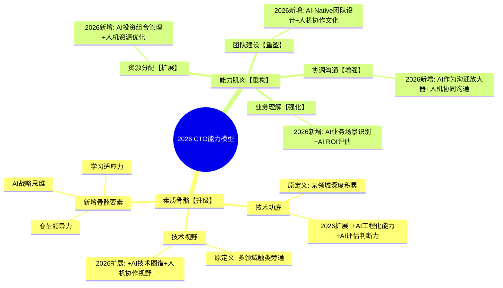
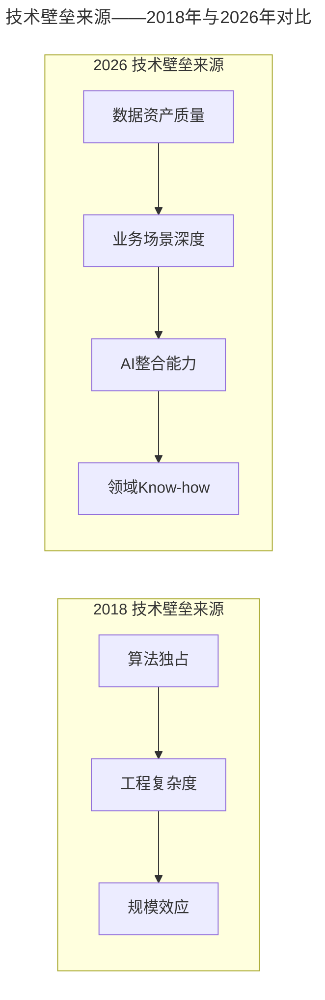
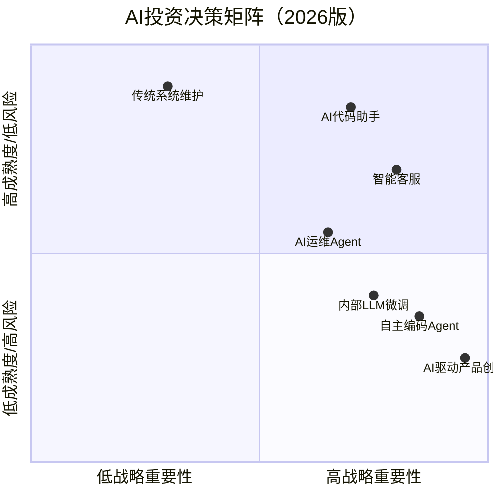

# 大咖对话 | 余沛：进阶CTO必备的素质与能力

> **适用范围**：技术总监、架构师及CTO进阶者，尤其是需要系统化构建"一骨骼四肌肉"能力模型并在AI时代完成能力升级的技术管理者；同样适用于关注AI时代CTO能力模型演进（AI-Augmented One-Bone-Four-Muscles）的从业者。
>
> **更新摘要（v2 · 2026-08 更新）**：
> - 结构化升级为 6 节骨架（导言 / 核心方法论 / 关键流程 / 工具与实战 / 常见误区 / 进阶延展）
> - 将"一骨骼四肌肉"模型全面升级为AI时代版本：骨骼新增AI基因，四肌肉注入AI能力
> - 补充2026年AI治理与伦理能力（第五种能力）、AI投资决策矩阵、AI-Native组织设计
> - 保留全部Mermaid图、对照表与行动清单

---

## 1. 导言

本周作客大咖对话的是同程艺龙副总裁、研发中心负责人余沛，其在2012年加入艺龙旅行网后，先后担任技术总监、首席架构师、CTO，除了直接负责过一线的基础架构相关系统、分布式计算、OTA垂直搜索引擎等工作外，同时推动了公司在技术方向上的全面转型、技术委员会体系的建立、技管分离等管理类工作。

余沛老师系统阐述了CTO进阶的**"一骨骼四肌肉"**模型：素质维度（骨骼）+ 能力维度（四肌肉）。

**2026年技术背景**：站在2026年回看余沛老师2018年的观点，惊人地具有前瞻性。AI技术以月为单位迭代，高端技术平民化越来越快（DeepSeek V4开源使顶级AI能力免费可得），余沛的"一骨骼四肌肉"模型不仅没有过时，反而更加重要——只是"骨骼"需要增加AI基因，"四肌肉"需要注入AI能力。

### 2018年观点的2026年验证

| 余沛2018年观点 | 2026年现实 | 验证结果 |
|--------------|-----------|---------|
| "技术领域更新变化很快" | AI技术以月为单位迭代（GPT-3→4→5→5.5） | ✅ 完全验证，且加速10倍 |
| "高端技术平民化越来越快" | DeepSeek V4开源使顶级AI能力免费可得 | ✅ 超预期验证 |
| "真正的难点在于业务独特性" | AI通用能力强，但行业Know-how仍是壁垒 | ✅ 核心洞察依然成立 |
| "CTO不应是最强技术者" | AI时代更需要"战略家"而非"最强程序员" | ✅ 更加重要 |
| "资源分配是核心能力" | AI投资决策成为CTO最重要的新职责 | ✅ 内涵大幅扩展 |

---

## 2. 核心方法论

### 2.1 素质维度（骨骼）——技术功底与技术视野

作为技术Leader，肯定是要先具备比较扎实的技术功底、以及相当广阔的技术视野。技术领域还是要先有内功，再谈管理。

虽然技术到了一定深度之后能够更好的触类旁通，但先决条件是：你首先要在某个领域有过较深投入与研究，具备扎实的技术功底，才能更好的对宏观领域、多个技术方向有比较靠谱的辨识及判断能力。这有点类似于武侠小说中，只有自身先拥有一定功力，成为某个领域的高手，才能对其他门派的武功有速成，或者对好坏轻重的判断能力。

**⭐2026升级——技术功底的AI时代重新定义**：

| 维度 | 2018年内功 | 2026年内功 |
|-----|----------|----------|
| **深度** | 精通某一语言/框架 | 精通某一领域 + 能用AI增强该领域 |
| **广度** | 了解多技术方向 | 了解多技术方向 + AI在各方向的应用边界 |
| **判断力** | 能判断技术方案优劣 | 能判断何时用AI、何时不该用AI |
| **学习力** | 能快速学习新技术 | 能快速学习如何让AI学习新技术 |

### 2.2 能力维度一：对业务的理解能力

在任何的商业公司中，技术的本质也是要为生产服务。互联网公司面临的技术难点往往衍生于其自身的业务独特性。以前经常讲的高可用、高并发、自动化运维、分布式等，在通用解决方案上已经没有什么新鲜的难以解决的困扰。真正的难点在于业务场景中存在的那些独特场景，以及为了解决这些特性需要的技术方案。

**⭐2026升级**：技术壁垒来源发生变化——不再是纯算法优势和通用工程能力，新的壁垒是高质量训练数据、深度业务理解、AI与业务的有机整合、领域Know-how。

### 2.3 能力维度二：资源分配及收益的判断能力

无论何种规模大小的技术管理者，都要不断做资源分配和收益判断。当你站在技术Leader的位置时，这种差异就像是战场上，从一名武功高强的战士，变成在战场后方的指挥所里指挥战术的将军。如何把资源的配置发挥到极致，帮助业务以尽可能小的成本获得尽可能大的收益？

**⭐2026升级——AI投资组合管理**：

| 资源类型 | 2018年 | 2026年新增 | 决策复杂性 |
|---------|-------|----------|----------|
| **人力资源** | 工程师招聘/调配 | +AI Agent配置、人机配比优化 | ⭐⭐⭐ |
| **技术资源** | 服务器/数据库 | +GPU/TPU算力、API调用额度、模型服务 | ⭐⭐⭐⭐ |
| **数据资源** | 业务数据存储 | +高质量训练数据、Prompt库、知识图谱 | ⭐⭐⭐⭐⭐ |
| **工具资源** | 开发工具License | +企业版AI工具、Agent平台、AIOps平台 | ⭐⭐⭐ |
| **时间资源** | 项目排期 | +AI模型训练/微调时间、Agent优化迭代周期 | ⭐⭐ |

### 2.4 能力维度三：对团队的建设能力

团队与人才是一个公司的灵魂。如何解决团队的建设问题？先做好两件事：一是对内和工程师们一起创建良好的技术文化及氛围；二是对外打造良好的公司技术品牌影响力。

**⭐2026升级——AI-Native组织设计三大新课题**：
1. **人才标准的重构**：传统标准+AI协作能力、Prompt Engineering、AI输出评判力
2. **岗位结构的调整**：减少初级开发（被Agent替代30-50%）、新增AI Platform Engineer、Agent Orchestrator
3. **文化的重塑**：从"工程师文化"到"AI-Augmented文化"，建立AI使用规范、质量责任机制

### 2.5 能力维度四：协调与沟通能力

在公司发展过程中，各个部门对资源的需求是不断增加的，而公司的资源总量在一定的阶段是有限的。如何有效的沟通，或者为有效的沟通创建良好的条件与规则，非常考验技术Leader。

**⭐2026升级——AI作为"沟通超级放大器"**：

| 沟通场景 | 传统方式 | AI增强方式 | 效果提升 |
|---------|---------|-----------|---------|
| **技术→业务翻译** | 手写文档/口头解释 | AI自动生成多版本汇报材料 | 3x |
| **会议效率** | 人工纪要+行动项追踪 | AI实时转录+自动提取Action Item | 5x |
| **向上管理** | 手工准备材料 | AI辅助数据支撑+方案对比+风险评估 | 4x |
| **向下传达** | 统一培训 | AI个性化拆解+针对性内容生成 | 2x |
| **跨部门争议** | 反复会议协商 | AI模拟不同方案的影响，提供数据支撑 | 更理性 |

### 2.6 ⭐2026新增第五种能力：AI治理与伦理能力

- **技术层面**：AI输出质量控制（准确性评估、幻觉检测）、AI安全防护（Prompt Injection防御、数据泄露防护）、AI成本控制（Token用量优化、模型选型策略）
- **组织层面**：AI使用政策制定（合规性审查、数据隐私保护）、AI风险管理（故障应急预案、责任归属明确）、AI变革管理（员工沟通与安抚、角色转型支持）

---

## 3. 关键流程

### 3.1 "一骨骼四肌肉"模型的AI时代演进

上图以思维导图展示2026年CTO能力模型的演进。素质骨骼在原有技术功底和技术视野基础上新增AI战略思维、变革领导力和学习适应力；四肌肉分别强化、扩展、重塑和增强，全面注入AI能力。

### 3.2 技术壁垒来源变迁

上图对比了2018年与2026年技术壁垒来源的变化。2018年壁垒主要来自算法独占、工程复杂度和规模效应；2026年壁垒转移至数据资产质量、业务场景深度、AI整合能力和领域Know-how。

### 3.3 AI投资决策矩阵

上图以四象限矩阵展示2026年AI投资决策框架。第一象限（高重要+低风险）如AI代码助手应全面推广；第二象限（高重要+高风险）如自主编码Agent应试点验证；第三象限（低重要+低风险）如传统系统维护按需维持；第四象限（低重要+高风险）应暂缓或外包。

---

## 4. 工具与实战

### 4.1 ⭐2026 CTO技术自检清单（升级版）

- [ ] 是否在某个技术领域有深厚积累？（基础要求不变）
- [ ] 是否亲自使用AI工具完成过完整项目？（新增）
- [ ] 是否能评估不同LLM在特定业务场景下的适用性？（新增）
- [ ] 是否了解Agent架构的基本设计模式？（新增）
- [ ] 是否参与过AI系统的上线决策和风险评估？（新增）
- [ ] 是否能识别团队中的AI能力短板并制定提升计划？（管理视角）

### 4.2 基于余沛模型的个人成长清单

#### 素质维度（骨骼）强化

1. **技术功底升级（本月完成）**：选择一个AI工具（推荐Cursor），在真实项目中达到熟练水平，目标：日常开发60%+代码由AI辅助生成
2. **技术视野扩展（本季度完成）**：系统学习一个AI应用领域（如RAG、Agent、AIOps），输出"AI在所在业务领域的应用机会分析"

#### 能力维度（四肌肉）训练

3. **业务理解能力（持续实践）**：每周花半天时间深入了解一个业务环节，思考如何通过AI实现10x效率提升
4. **资源分配能力（本月启动）**：梳理当前团队的AI相关投入，使用"AI投资决策矩阵"评估ROI
5. **团队建设能力（本季度推进）**：进行团队AI能力摸底调研，识别Top 3 AI Champion，启动一项AI Pilot项目
6. **协调沟通能力（立即应用）**：在下次跨部门会议中使用AI辅助准备材料

#### 新增能力维度

7. **AI治理意识培养**：学习AI伦理基本准则，制定团队AI使用规范草案
8. **变革领导力锻炼**：主动承担AI工具推广责任，处理团队成员对AI的抵触情绪

### 4.3 对"CTO不是最强技术者"的新阐释

**余沛原话**："技术团队中单项能力的最强者未必是CTO"

**2026年版**：
> "CTO不应该是团队中最会用AI写代码的人，而应该是最能判断什么时候该用AI、什么时候不该用AI、以及如何让整个团队的AI生产力最大化的人。"

---

## 5. 常见误区

### 5.1 专业方向不见长却能管好技术团队

我们很难看到一个人在专业方向上不见长、却还能够把技术团队管理得漂亮的。先有内功再谈管理，这是基础。

### 5.2 纯粹为技术而技术

不存在纯粹为技术而技术的商业公司。技术要为生产服务，帮助业务及产品完成对应的价值实现。

### 5.3 技术完美主义

当你是一名一线研发人员时，总是对于技术实现怀有很大的热情，期望技术架构趋近完美。但当你站在技术Leader的位置时，需要从成本与收益的角度判断投入。

### 5.4 对新技术操之过急或反应迟钝

有些公司对新技术操之过急，耗费巨大人力财力，导致消耗过度而死。也有对新技术的反应迟钝的公司，等别人应用落地后才进入，又发现为时已晚。"慢"并不是0和1的差别，而是分阶段合理计算投入产出比的问题。

### 5.5 AI时代"CTO是最强技术者"

如果CTO是公司中技术最牛的人，离开他运维也不行、安全也不行、架构也不行了，那才是最危险的。AI时代CTO应是"AI战略家"而非"AI程序员"。

---

## 6. 进阶延展

### 6.1 CTO职能定位

CTO的职能，一是把控好技术方向，清楚认知公司业务在哪些方向需要用到什么样的技术；二是帮助公司培养具体领域的技术者；如果还有第三项，那就是在年会抽奖时还能review一下抽奖程序的代码。

### 6.2 深入业务一线的建议

一定要更加深入、更加广泛地参与并了解公司的核心业务，跟随公司的核心业务一起成长。最好亲身到一线核心业务里走一趟，站在外面看跟亲身体验一遍是完全不同的感受。尽快将自己的目标从较为单一的技术类目标转变为公司的业务目标，力争把技术与业务这两条线聚合到一起。

### 6.3 原文精华的AI时代传承

| 原文核心观点 | AI时代传承 | 2026年新内涵 |
|------------|----------|------------|
| 先有技术内功再谈管理 | ✅ 永远成立 | 内功定义扩展，加入AI维度 |
| 技术为业务服务 | ✅ 永恒真理 | AI创造新业务场景，也改变竞争格局 |
| 资源配置发挥到极致 | ✅ 核心能力 | 资源类型增多，决策复杂度上升 |
| 人才是灵魂 | ✅ 更加重要 | 人才标准变化，培养方式革新 |
| 有效沟通创造价值 | ✅ 不可或缺 | AI增强沟通，但不能替代人际连接 |
| CTO不必是最强技术者 | ✅ 至关重要 | CTO应是"AI战略家"而非"AI程序员" |

### 6.4 作者简介

余沛，同程艺龙副总裁、研发中心负责人。2012年加入艺龙旅行网后先后担任技术总监、首席架构师、CTO。负责过一线基础架构相关系统、分布式计算、OTA垂直搜索引擎等工作，推动了公司在技术方向上的全面转型、技术委员会体系的建立、技管分离等管理类工作。在加入艺龙之前，曾就职于百度，负责自动化运维相关系统建设。

---

*本文档基于2026年8月的技术动态编写，是对余沛老师2018年经典访谈的致敬与延展。技术演进日新月异，建议读者结合自身场景批判性思考。*
