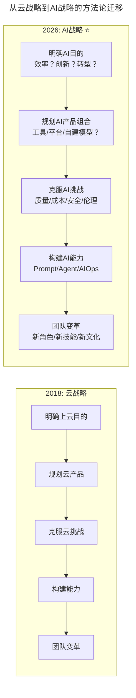

# 大咖对话 | 刘俊强：云计算时代技术管理者的应对之道

> **适用范围**：CTO、技术总监及云战略负责人，尤其是需要从"云战略"升级为"AI战略"的技术管理者；同样适用于关注云团队成熟度模型、组织变革和人机协作工作流设计的从业者。
>
> **更新摘要（v2 · 2026-08 更新）**：
> - 结构化升级为 6 节骨架（导言 / 核心方法论 / 关键流程 / 工具与实战 / 常见误区 / 进阶延展）
> - 将"云战略五步法"全面升级为"AI战略五步法"——只需将"云"替换为"AI"
> - 补充2026年AI战略行动对照表与团队成熟度AI版演进
> - 保留全部Mermaid图、对照表与行动清单

---

## 1. 导言

本周大咖对话的嘉宾是腾讯云资深架构师刘俊强，曾任迅雷技术总监、某互联网公司技术副总裁，有着10年以上互联网开发经验和8年以上技术管理经验。

2019年云计算的趋势主要体现在五大方面：云服务市场将继续增长强劲；混合云和多云（Poly-Cloud）将逐渐成为主流；自动化将不可或缺；合规性和安全性将受到重视；云服务将依然是新技术的最佳试验地。

作为技术管理者，一般会负责技术团队组建与培养、技术规划与选型、成本优化以及前瞻技术调研等。云计算趋势对技术管理者的影响主要在两方面：如何制定公司的云战略；云服务的深入使用对团队的影响。

**2026年技术背景**：刘俊强的方法论在AI时代完全适用——只需将"云"替换为"AI"。2026年的核心议题已从"如何上云"变为"如何利用云端AI能力"，但系统化战略规划的底层逻辑不变。

---

## 2. 核心方法论

### 2.1 企业选择上公有云的原因

- 1.减少基础设施投资
- 2.资源扩展速度快
- 3.降低 TCO（Total Cost of Ownership，总体拥有成本）
- 4.提高IT服务交付速度
- 5.更灵活地应对不断变化的市场
- 6.同业内已有典型应用案例
- 7.提升客户服务品质
- 8.政府或主管机构要求

### 2.2 云战略五步法

使用云是一种手段而不是目的，我们的目的是实现IT现代化。所谓云战略是定义了使用云的动机与目标的文档或手册。

- **步骤一：明确用云目的** — 确定使用云的动机和目的，一般仅需满足两到三项作为主要目标
- **步骤二：规划云产品组合** — 混合云、全公有云或多云策略选择，以及IaaS、PaaS、SaaS服务对应企业业务模块的规划
- **步骤三：克服常见云挑战** — 云管理控制（资产、运维、财务）、成本管理、IT文化变革
- **步骤四：构建云战略成功的能力** — 云端安全加固、云计算资源选型及计费模型、云原生架构能力、云端数据隔离
- **步骤五：做好团队变革准备** — 新角色出现、流程改变、组织架构改变

**⭐2026升级——从"云战略"到"AI战略"**：刘俊强的方法论在AI时代完全适用，只需将"云"替换为"AI"。

### 2.3 团队使用云的四阶段

1. **观察者阶段**：企业正在开发云战略和实施计划，尚未将应用部署到云上
2. **初级用户阶段**：企业正处于PoC（概念验证）阶段或初始上云阶段
3. **中级用户阶段**：企业已在云上部署了多个项目或应用，希望扩大和改进云计算资源的使用
4. **高级用户阶段**：企业已大量使用云基础设施，并正在寻求优化云运营和云成本

不同阶段的技术管理者面临的挑战不同：观察者和初级用户阶段需要明确上云策略、帮助团队学习新技能；中级和高级用户阶段需要处理更多团队和角色参与云管理控制（安全团队、财务团队等），甚至产生类似云战略委员会的组织。

### 2.4 团队成员角色转型

原先的架构师、安全专家及运维工程师等角色都需要进行云端技能补全，使其转变为云架构师、云安全专家和DevOps工程师。

**⭐2026升级**：角色转型进一步演化为AI Platform Engineer、AI Security Specialist、AIOps Engineer、Agent Orchestrator等新角色。

---

## 3. 关键流程

### 3.1 从"云战略"到"AI战略"

上图展示了从2018年云战略到2026年AI战略的方法论迁移。五个步骤完全对应：明确目的、规划产品组合、克服挑战、构建能力、团队变革。底层框架不变，只是将"云"替换为"AI"，但每一步的具体内涵都发生了深刻变化。

### 3.2 云战略实施三角色

1. **筹备组**：负责整体云战略的规划与实施节奏把控，一般由各关联职能与业务线负责人组成
2. **技术实施组**：负责整体云战略的具体实施，包括上云资源评估、应用系统架构改造、资源管理系统适配以及应用迁移上云等
3. **支持组**：负责云战略规划和实施中的支持性工作，包括IT资源采买模式变更、云安全审计等

### 3.3 云战略实施四阶段

1. **筹划与PoC验证阶段**：明确云战略目标和计划，进行概念验证，输出云战略实施计划
2. **云服务商评估阶段**：根据业务特点对云服务商提供的产品进行测试与选型试验
3. **云战略实施阶段**：评估安全风险、架构调整风险点，进行系统架构调整、运维管理系统修改、数据迁移方案落实
4. **总结阶段**：对云战略实施最终结果进行总结复盘，制定下一阶段云战略

### 3.4 AI战略行动对照表

| 云战略步骤 | AI战略对应 | 具体行动 |
|----------|-----------|---------|
| 明确目的 | 明确AI目的 | AI是为了提效？创新？还是转型？ |
| 产品组合 | AI工具选型 | Copilot/Cursor/Agent平台如何选择？ |
| 克服挑战 | AI风险管理 | 质量把控、成本控制、安全合规 |
| 构建能力 | 团队AI能力建设 | 培训体系、工具标准化 |
| 团队变革 | 组织适配 | 新角色（AI Platform Engineer等） |

---

## 4. 工具与实战

### 4.1 ⭐2026 AI战略制定行动清单

**明确AI目的**：
- [ ] 评估AI在提效、创新、转型三个维度的优先级
- [ ] 确定未来1年的AI核心目标（不超过3项）

**AI工具选型**：
- [ ] 评估Copilot/Cursor/Claude等AI编程工具
- [ ] 评估是否需要自建模型或微调
- [ ] 设计Multi-Model策略，避免供应商锁定

**AI风险管理**：
- [ ] 建立AI输出质量审核机制
- [ ] 制定AI工具使用安全规范
- [ ] 设计AI失败降级方案

**团队AI能力建设**：
- [ ] 建立L1-L4 AI能力培养路径
- [ ] 组织Prompt Engineering培训
- [ ] 建立AI最佳实践知识库

**组织适配**：
- [ ] 识别需要新增的AI相关岗位
- [ ] 制定现有员工AI转型计划
- [ ] 建立AI战略委员会

### 4.2 团队成熟度AI版演进

| 云阶段 | AI对应阶段 | 技术管理者挑战 |
|-------|----------|-------------|
| 观察者 | AI观察者 | 评估AI适用性，制定AI战略 |
| 初级用户 | AI初级用户 | PoC验证，积累AI使用经验 |
| 中级用户 | AI中级用户 | 扩大AI应用范围，多角色参与 |
| 高级用户 | AI高级用户 | 优化AI运营和成本，建立AI战略委员会 |

---

## 5. 常见误区

### 5.1 使用云是目的而非手段

使用云是一种手段而不是目的，我们的目的是实现IT现代化。如果仅仅将云计算当做传统IDC来进行使用便达不到上云的目的。

### 5.2 简单的Lift-and-shift（平行迁移）

云战略制定不只是简单的平行迁移，需要根据业务特点选择合适的部署模式和服务模型。

### 5.3 忽视云管理控制

云管理控制包括多个维度——资产、运维以及财务等。云产品不同于传统的基础设施架构，需要专门制定云安全架构和IT操作规范。

### 5.4 云计算自动降低成本

云计算可以减少基础设施成本是主要优势之一，但是使用云计算需要更为精细地管理资源使用，才能够将成本优化最大化。

### 5.5 AI时代忽视组织变革

云的深入使用会带来组织上新角色的出现、流程的改变，甚至组织架构的改变。AI时代这种变革更加剧烈，需要提前做好团队变革准备。

---

## 6. 进阶延展

### 6.1 核心观点总结

刘俊强老师的系统化思维框架在AI时代依然强大。从"云战略"到"AI战略"的方法论迁移，体现了技术管理底层逻辑的稳定性和适用性。

### 6.2 上云的好处汇总

1. 降低基础设施成本：通过云端各类计算资源和弹性来降低TCO
2. 提高IT效率：将IT团队从基础设施硬件管理中解放
3. 新市场开拓：通过云服务商全球基础设施方便部署到新市场
4. 加速应用交付：近即时的计算资源访问服务
5. 增加自动化：云服务商提供众多自动化工具和系统

### 6.3 作者简介

刘俊强（微信公众号：程序员精进）腾讯云资深架构师、TGO鲲鹏会会员，曾任迅雷技术总监、某互联网公司技术副总裁，10+年以上互联网开发经验，8年以上技术管理经验。

---

*本文档基于2026年8月的技术动态编写，刘俊强老师的系统化思维框架在AI时代依然强大。技术演进日新月异，建议读者结合自身场景批判性思考。*
