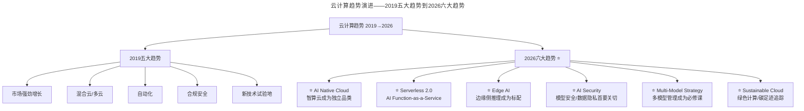

# 大咖对话 | 刘俊强：谈谈我对2019年云计算趋势的看法

> **适用范围**：CTO、技术架构师及云平台决策者，尤其是需要理解云计算五大趋势在AI时代的演进与升级的技术管理者；同样适用于关注"Cloud + AI Model"双多云策略、Serverless AI、Edge AI等2026新趋势的从业者。
>
> **更新摘要（v2 · 2026-08 更新）**：
> - 结构化升级为 6 节骨架（导言 / 核心方法论 / 关键流程 / 工具与实战 / 常见误区 / 进阶延展）
> - 将2019年云计算五大趋势全面升级为2026年六大新趋势
> - 补充从"云服务"到"AI能力即服务"的服务层级演进、AI治理新挑战、Agent自主运维
> - 保留全部Mermaid图、对照表与行动清单

---

## 1. 导言

云计算经过最近五年产品能力的不断完善、云产品的持续新增和稳定性的逐步增强，使得大家已经能够广泛接受云计算的理念。根据Gartner给出的数据，2018年全球公有云市场规模为1758亿美金，中国公有云市场规模为382.5亿人民币。

**2019年云计算五大趋势**：
1. 云服务市场将继续强劲增长
2. 混合云和多云（Poly-Cloud）将逐渐成为主流
3. 自动化将不可或缺
4. 合规性和安全性将受到重视
5. 云服务将依然是新技术的最佳试验地

**2026年技术背景**：2018年全球市场1758亿美金，2026年已突破8000亿美金。企业的云支出中，AI相关占比从2019年的<5%跃升至2026年的40%+。刘俊强老师的五大趋势预判全部被验证且深化。

### 观点验证

| 原始观点 | 2026年验证结果 |
|---------|---------------|
| 云市场持续增长 | ⭐ 超预期验证。2026年全球市场突破8000亿美金 |
| 混合云/多云成主流 | ⭐ 完全成立且深化。演变为"Cloud + AI Model"双多云策略 |
| 容器化+自动化 | ⭐ 已成基础设施。K8s市占率超93%，新增AI Workload Orchestration |
| 云是新技术试验场 | ⭐ 完全成立。大模型训练99%在云端完成，AI Cloud成为独立赛道 |

---

## 2. 核心方法论

### 2.1 云服务市场持续增长

全球公有云市场每年保持约20%以上的增长，中国公有云市场的增长则每年为30%以上。据预测，2019年全球公有云收入将增长17.3%，总额达到2062亿美元，其中IaaS是市场增长最快的部分，达到了27.6%。

73%的企业已使用云服务，另有17%的企业将在1年内使用。到2019年预计90%的企业会将应用放在云上，这一数据到2021年预计将为100%。中国企业54.7%已使用云服务。

### 2.2 混合云和多云（Poly-Cloud）成为主流

公有云并不是银弹。混合云将现有的本地基础设施与公有云服务混合在一起，企业能够以自己的节奏来过渡到公有云，同时还能够保持灵活性与实施效率。

多云意指企业不将全部业务放置在一个云服务提供商身上，根据策略将不同种类的业务分配给不同的云服务提供商。好处有两点：能避免单一供应商绑定；供应商故障和灾难发生后，能最大程度保证业务可用性。

**⭐2026升级**：2026年的"多云"已演变为"Cloud + AI Model"双多云策略——企业同时使用多个云厂商 + 多个大模型服务商。

### 2.3 自动化不可或缺

随着微服务、Service Mesh等架构设计风格被普遍接受，容器服务逐步成为主流，Docker及K8s已经成为了容器和编排的实际标准。容器化改造不光是部署环节的改进，实际上是软件或应用全生命周期的改造。

**⭐2026升级——自动化进入"Agent Autonomy"阶段**：

| 自动化阶段 | 时间 | 特征 |
|-----------|------|------|
| 脚本自动化 | 2010前 | Shell脚本、CI/CD流水线 |
| 容器编排 | 2015-2020 | K8s、Helm Charts |
| IaC成熟期 | 2020-2023 | Terraform、Pulumi |
| **Agent自主运维** | **2024-2026** | **AI Agent自动检测异常→诊断→修复→验证** |

### 2.4 合规性和安全性受重视

欧盟推出了GDPR（General Data Protection Regulation，一般数据保护条例），不遵守规定的企业可能面临严厉惩罚。云安全解决方案需要IT和安全团队采用新的操作模型。

**⭐2026升级——AI治理新挑战**：GDPR只是开始，2026年企业面临EU AI Act（欧盟人工智能法案）、中国《生成式AI服务管理办法》持续迭代、数据主权问题等更复杂的合规环境。

### 2.5 云服务是新技术最佳试验地

5G技术的到来可以给物联网提供更多应用场景；边缘计算能够很好适应5G技术普及后的大容量数据回传和计算需求；无服务函数计算服务可以帮助企业在没有任何基础设施的情况下构建和运行应用程序服务。

**⭐2026升级——从"云服务"到"AI能力即服务"**：

2026年的云服务层级：
```
AI SaaS（如ChatGPT Enterprise）
  ↓
Model-as-a-Service（GPT-5.5 API, DeepSeek V4 API）
  ↓
AI PaaS（向量数据库、RAG平台、Agent框架）
  ↓
GPU/IaaS（NVIDIA Cloud, AWS Trainium）
```

---

## 3. 关键流程

### 3.1 云计算趋势演进——2019→2026



上图展示了云计算趋势从2019年五大趋势到2026年六大趋势的演进。2019年关注市场增长、混合云、自动化、合规安全和新技术试验；2026年新增AI Native Cloud、Serverless 2.0、Edge AI、AI Security、Multi-Model Strategy和Sustainable Cloud六大新趋势。

### 3.2 2026云计算新趋势详解

| 趋势 | 2019年 | 2026年升级版 | 技术管理者应对 |
|------|--------|--------------|---------------|
| **市场增长** | 云服务增长强劲 | AI云服务爆发式增长（CAGR>40%） | 建立AI预算专项 |
| **部署模式** | 混合云/多云 | 混合云+边缘AI+端侧推理 | 设计分布式AI架构 |
| **自动化** | DevOps自动化 | AIOps+AutoML+自主Agent | 引入AI运维工具 |
| **安全性** | 合规性受重视 | AI安全+伦理+法规三重约束 | 建立AI治理委员会 |
| **新技术试验地** | 云端创新 | Agent生态+多模态AI+具身智能 | 设立AI创新实验室 |
| **可持续性** 🆕 | - | 绿色计算/碳足迹追踪 | 选择低功耗区域部署 |

---

## 4. 工具与实战

### 4.1 ⭐2026行动清单

**对于技术决策者**：
- [ ] 评估AI Cloud支出占比：目标将非AI云成本控制在60%以内
- [ ] 建立Multi-Model Strategy：设计灵活的模型切换架构（Adapter Pattern）
- [ ] 实施Edge AI试点：选择延迟敏感场景将推理下沉到边缘节点
- [ ] 启动AI Security审计：模型输出审核、Prompt注入防护、数据脱敏

**对于开发者**：
- [ ] 掌握Serverless AI开发模式：AWS Lambda + Bedrock、Azure Functions + OpenAI
- [ ] 熟悉MLOps/LLMOps工具链：MLflow、Weights & Biases、LangChain、LlamaIndex
- [ ] 理解Carbon-Aware Computing：在代码中嵌入碳排放考量

**对于创业者**：
- [ ] 利用AI Cloud降低启动成本：2026年创业基础设施成本比2019年降低70%
- [ ] 设计Cloud-Native + AI-Native架构：第一天就考虑多模型兼容和数据可移植性
- [ ] 关注垂直领域AI PaaS机会：医疗AI PaaS、法律AI PaaS、教育AI PaaS

### 4.2 核心金句（2026版）

> "2019年我们说'云像水电一样便捷'，2026年我们要说'AI像搜索一样自然'——而这一切都建立在云之上。"

> "未来的企业不再选择'用不用云'，而是选择'用哪个模型的云'。"

> "自动化终局不是'无人运维'，而是'人类定义规则，AI Agent执行运维'。"

---

## 5. 常见误区

### 5.1 公有云是银弹

公有云并不是一种适用于所有类型需求的解决方案，不是全部企业都能够像Netflix那样将全部基础设施放在公有云上。

### 5.2 多云全是好处

多云部署策略的选用并非全是好处，需要企业技术决策者根据企业的长短期目标来进行云产品组合的规划。

### 5.3 上云后不需要安全规划

选用公有云解决方案后并不代表就不会有云安全漏洞了。企业业务在上云之前做好云安全规划是非常重要的事情。

### 5.4 容器化只是部署环节改进

容器化改造不光是在部署环节的改进，实际上是软件或应用全生命周期的改造，在架构设计、开发、测试及部署环节上都会有相应的改变。

### 5.5 AI时代忽视成本控制

企业的云支出中AI相关占比从2019年的<5%跃升至2026年的40%+。不建立Multi-Model Strategy、不评估AI Cloud支出占比，会导致云成本失控。

---

## 6. 进阶延展

### 6.1 5G与边缘计算的协同

5G技术提供了更快和更大带宽的移动网络服务，使得物联网设备或无人驾驶汽车产生更大容量的数据回传到云服务进行处理。边缘计算在网络边缘进行数据处理以优化云计算，能够很好适应5G技术普及后的大容量数据回传和计算需求。

### 6.2 无服务函数计算的价值

通过无服务函数计算服务，可以不用虚拟机或容器就能够进行计算任务。当数据存储或数据连接在云端时，无服务函数计算允许开发人员在没有任何基础设施的情况下构建和运行应用程序服务。

### 6.3 作者简介

刘俊强（微信公众号：程序员精进）腾讯云资深架构师、TGO鲲鹏会会员，曾任迅雷技术总监、某互联网公司技术副总裁，10+年以上互联网开发经验，8年以上技术管理经验。

---

*本文档基于2026年8月的技术动态编写，旨在帮助读者以新时代视角重新审视经典内容。技术演进日新月异，建议读者结合自身场景批判性思考。*
