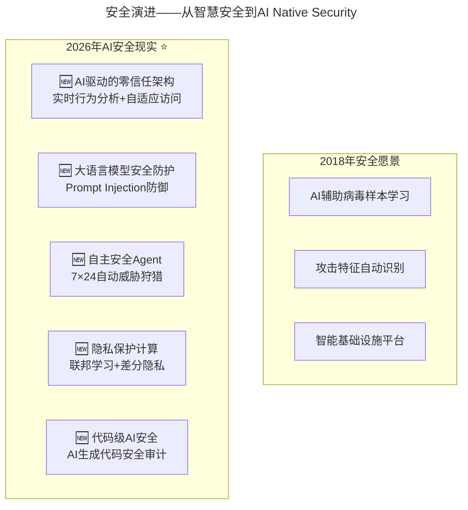

# 大咖对话 | 杨育斌：技术领导者要打造技术团队的最大化价值

> **适用范围**：CTO、技术VP及团队管理者，尤其是需要从"发挥个体潜力"升级为"发挥人+AI协同体潜力"的技术领导者；同样适用于关注AI安全（AI Native Security）、团队效能AI进化和社会责任的技术管理者。
>
> **更新摘要（v2 · 2026-08 更新）**：
> - 结构化升级为 6 节骨架（导言 / 核心方法论 / 关键流程 / 工具与实战 / 常见误区 / 进阶延展）
> - 将"三大效率秘诀"全面升级为AI时代版本：发挥"人+AI"协同潜力、实时数据驱动沟通、AI生成代码组件复用
> - 补充2026年AI安全新挑战、人才潜力评估新维度、业务价值新计算公式
> - 保留全部Mermaid图、对照表与行动清单

---

## 1. 导言

本周作客大咖对话的是蓝盾CTO、信息安全专家杨育斌，目前主要从事信息安全、云计算、网络应急体系等领域的技术创新、开发管理与战略规划工作。先后承担国家级、省部级、市级科研课题40余项，获得国际发明专利1项，国家发明专利20余项。

杨育斌的管理哲学核心是**"发挥潜力、业务导向、教练式领导、社会责任"**。研发技术团队六百人左右，去年（2017年）在国内市场的利润达到了四亿人民币，人均利润超过国内很多技术团队。

**2026年技术背景**：杨育斌2018年的"智慧安全"预判完全准确——AI已成为安全领域的核心技术，安全服务模式超越硬件/软件。但2026年新增挑战：AI本身成为攻击面（Deepfake、Prompt注入、模型窃取）。团队效率三要素在AI时代全面进化。

---

## 2. 核心方法论

### 2.1 智慧安全方向

利用人工智能技术改变传统信息安全被动的局面。人工智能强大的学习能力，在越来越多的数据面前显得游刃有余。利用人工智能技术，能更好地进行病毒样本学习、攻击特征学习，以提供智能的基础设施平台。

**⭐2026升级——从"智慧安全"到"AI Native Security"**：

| 2018年安全愿景 | 2026年AI安全现实 |
|-------------|---------------|
| AI辅助病毒样本学习 | 🆕 AI驱动的零信任架构：实时行为分析+自适应访问 |
| 攻击特征自动识别 | 🆕 大语言模型安全防护：Prompt Injection防御 |
| 智能基础设施平台 | 🆕 自主安全Agent：7×24自动威胁狩猎 |
| - | 🆕 隐私保护计算：联邦学习+差分隐私 |
| - | 🆕 代码级AI安全：AI生成代码安全审计 |

### 2.2 团队高效率三大原因

1. **发挥团队成员的个体潜力** — 激发团队成员的潜力，并最大程度地将它发挥出来。不以招聘岗位的工作内容评判应聘者是否合适，而是发掘他的优点
2. **定时与业务单元高效沟通** — 每两周一次沟通会议，保证业务与技术的定期对接，小步快跑
3. **团队协同与组织优化** — 打破藩篱，共同协作，灵活利用资源。共建组件库，提高效率

**⭐2026升级——团队效率三要素的AI进化**：

| 2018年方法 | 2026年AI增强版 |
|-----------|---------------|
| 发挥个体潜力 | 发挥"人+AI"协同体的潜力——人均产出提升3-5倍 |
| 两周一次业务沟通 | 实时数据驱动 + AI预测性分析——问题提前预警 |
| 共建组件库复用 | AI生成代码组件 + 智能推荐复用——复用率从30%→70% |

### 2.3 技术领导力认知

1. **技术必须与业务配合**：片面强调技术领先，脱离业务实际，不是技术领导者应该去提倡的做法
2. **领导力 = 教练 + 鼓动者**：必须不断地鼓动团队战斗力，推动公司业务发展
3. **两个基础能力**：勤于思考保持敏感；拥有危机意识

**⭐2026升级——CTO能力的AI时代扩展**：新增AI治理能力（安全/伦理/合规框架）和数据领导力（数据资产化战略）。

### 2.4 业务价值新计算公式

```
传统业务价值 = 收入 - 成本

2026业务价值 = (收入_人工 + 收入_AI) - (成本_人力 + 成本_AI工具 + 成本_API调用)

ROI计算示例：
传统5人团队：产出 $500K/年，成本 $400K/年 → ROI 25%
AI增强5人团队：产出 $1.5M/年，成本 $450K/年 → ROI 233%
```

---

## 3. 关键流程

### 3.1 从"智慧安全"到"AI Native Security"



上图展示了安全领域从2018年"智慧安全"愿景到2026年AI Native Security现实的演进。2018年主要关注AI辅助病毒样本学习和攻击特征识别；2026年新增了零信任架构、LLM安全防护、自主安全Agent、隐私保护计算和代码级AI安全五大新维度。

### 3.2 人才潜力评估的新维度

**2026新增潜力维度**：
- AI协作能力（能否高效使用AI工具）
- AI判断力（知道什么该用AI、什么不该用）
- Prompt设计能力（能否精准描述需求）
- 人机协同设计能力（能否设计高效的AI工作流）
- AI伦理意识（负责任地使用AI）

**人才重新定位案例**：
- 候选人A：代码能力一般，但Prompt设计极强 → 培养"AI架构师"
- 候选人B：技术深厚，但抗拒使用AI → 需重点关注（可能成为效率瓶颈）
- 候选人C：普通开发者，但善于整合AI工具链 → 培养"AI效能专家"

### 3.3 2026年三层协同机制

```
传统：每两周业务-技术对接会
2026：三层协同机制

Layer 1: 实时数据层（每日）
  - AI效能仪表盘公开透明
  - 关键指标异常自动告警
  - 资源使用情况实时可见

Layer 2: 敏捷同步层（每周）
  - AI使用经验分享（30分钟）
  - 跨团队AI协作问题协调
  - 最佳实践沉淀到共享库

Layer 3: 战略对齐层（双周）
  - 业务目标 ↔ AI能力匹配度评估
  - 新AI机会识别和优先级排序
  - 中长期AI技术规划
```

---

## 4. 工具与实战

### 4.1 打造AI时代"最大化价值"团队（6个月行动指南）

**Month 1: 诊断与规划**
- [ ] 评估团队AI成熟度
- [ ] 识别Top 20%的AI先锋者（种子用户）
- [ ] 制定AI转型路线图（6个月计划）
- [ ] 预算申请：AI工具 $50-100/人/月

**Month 2-3: 试点与验证**
- [ ] 选择2个试点项目，全程AI辅助
- [ ] 建立"AI增效指标追踪"
- [ ] 每周收集反馈，快速迭代工作流
- [ ] 记录成功案例和最佳实践

**Month 4-5: 全面推广**
- [ ] 全员AI工具配置和培训
- [ ] 建立"共享Prompt库"（新时代的组件库）
- [ ] 重构代码Review流程（加入AI审查维度）
- [ ] 启动"AI创新奖励计划"

**Month 6: 优化与固化**
- [ ] 量化ROI（投入产出比）
- [ ] 固化最佳实践为团队标准
- [ ] 规划下一阶段AI能力提升
- [ ] 向上汇报成果和数据

### 4.2 个人开发者成为"高潜力的AI协作者"

**本周**：安装AI编程助手，完成1个小任务，记录哪些场景AI效果好/不好

**本月**：建立10个高质量Prompt模板，在团队内做1次AI使用分享，识别3个可优化工作流

**本季度**：日常开发效率提升50%+，成为小组内AI Go-to Person，贡献3+个Prompt到共享库

**半年**：能独立设计复杂人机协作方案，具备AI项目管理能力，开始培养他人AI能力

---

## 5. 常见误区

### 5.1 以岗位内容评判应聘者

不以招聘岗位的工作内容评判应聘者是否合适，而是发掘他的优点。应聘者来面试技术岗位可能没达到要求，但口才很好，可以尝试培养成销售工程师。

### 5.2 片面强调技术领先

技术领导者不能光想着怎么烧钱，烧出一个技术领先来，也要想着怎样为公司创造价值，在最少成本的情况下为公司创造最大价值。

### 5.3 安于现状

当公司解决温饱问题进入下一阶段时，可能安于现状，满足于过往成就。技术领导者需要保持对技术变革的敏感，思考下一步方向。

### 5.4 将技术神化

不要将技术神化，给公众制造焦虑与恐惧。遇到信息安全事件，有些公司为了显示自己的技术高深会将事件夸大，这违背了技术推动社会进步的意义。

### 5.5 AI时代"神话AI"或"妖魔化AI"

既不神话AI（它不是万能的），也不妖魔化AI（它不是失业元凶），理性看待，充分利用。AI是工具，业务价值是目的。

---

## 6. 进阶延展

### 6.1 大安全生态

安全是一种能力，它会渗透并有机融合到云计算、移动互联网、物联网中，形成必须的技术能力与服务体系，最终嫁接到更大的IT生态体系上。

对比国内外：国内以硬件和软件产品为主，安全服务占比低；国外（如美国）安全服务市场远大于安全硬件和软件市场。

### 6.2 共建组件库实践

有一个专门负责技术资源整合的团队，整合所有研发团队能够公用的组件。如果小团队需要爬虫组件，可以直接在共享组件库中寻找，只需做一些修正、优化工作就可以实现运用。优化后的组件还需重新上传至共享组件库中，方便别人再次取用。

### 6.3 核心理念升级

> 2018: 发挥团队成员的个体潜力
> **2026: 发挥"人+AI"混合体的协同潜力，重新定义什么是"高潜力人才"**

> 2018: 技术必须与业务配合
> **2026: 技术+AI必须指数级放大业务价值，ROI从25%提升到200%+**

> 2018: 不将技术神化，不制造焦虑
> **2026: 既不神话AI，也不妖魔化AI，理性看待，充分利用**

### 6.4 作者简介

杨育斌，蓝盾CTO、信息安全专家，目前主要从事信息安全、云计算、网络应急体系等领域的技术创新、开发管理与战略规划工作。先后承担国家级、省部级、市级科研课题40余项，获得国际发明专利1项，国家发明专利20余项。

---

*本文档基于2026年8月的技术动态编写，旨在帮助读者以新时代视角重新审视经典内容。技术演进日新月异，建议读者结合自身场景批判性思考。*
