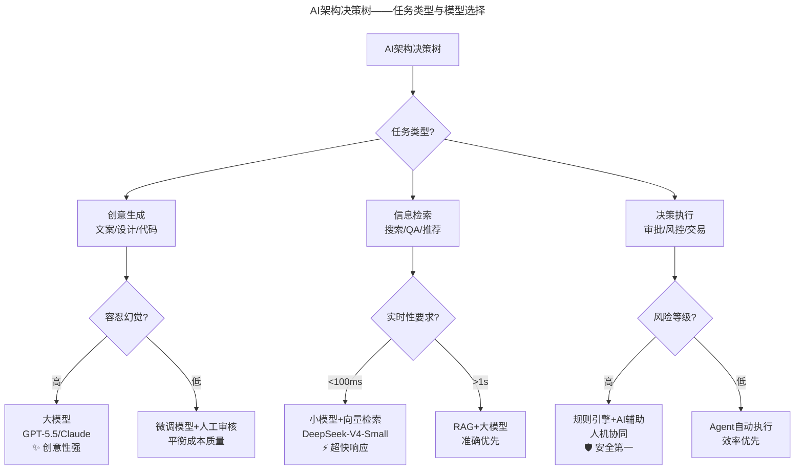
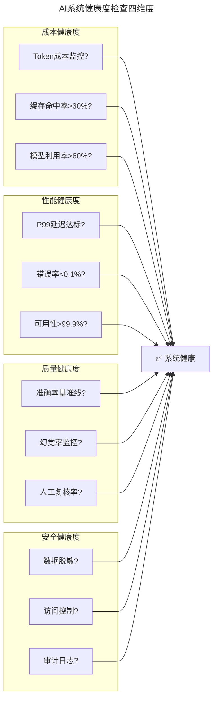
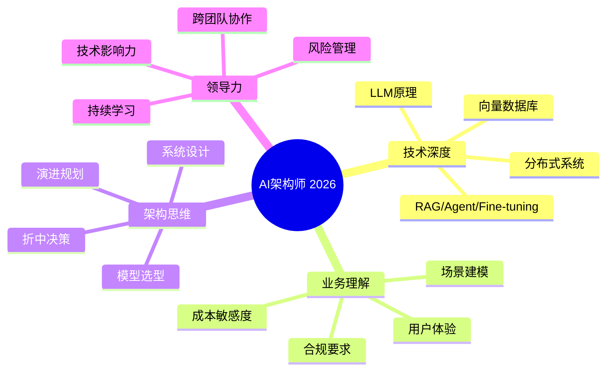

# 大咖对话 | 谭待：架构的本质是折中

> **适用范围**：架构师、技术总监及CTO，尤其是需要在AI时代处理新增折中维度（Token成本、模型选择、AI质量把控、人机协同设计）的技术决策者；同样适用于关注AI-Native架构设计原则和AI架构师能力模型的从业者。
>
> **更新摘要（v2 · 2026-08 更新）**：
> - 结构化升级为 6 节骨架（导言 / 核心方法论 / 关键流程 / 工具与实战 / 常见误区 / 进阶延展）
> - 将"架构的本质是折中"全面升级为AI时代版本：新增Token经济学、AI架构决策树、6大设计原则
> - 补充2026年AI架构师能力模型、Token成本计算器、AI系统健康度检查清单
> - 保留全部Mermaid图、对照表与行动清单

---

## 1. 导言

本周作客"大咖对话"的嘉宾是百度搜索首席架构师兼区块链实验室主任谭待。他的主要研究领域在分布式系统、搜索引擎和区块链，是百度BVC代理计算和Matrix私有云的主要设计者，两获百度最高奖。主持设计了百度新一代搜索架构，在时效性和计算规模上实现了大幅提升。

**核心金句**："架构的本质是折中，作为架构师，你拥有的是有限的资源，但你面对的是没有上限的需求。"

**2026年技术背景**：这句话在2026年不仅成立，而且变得更加复杂——因为需要折中的维度大幅增加了！Token成本成为新变量、AI生成代码的质量把控、模型选择（大模型通用vs小模型专用）、闭源vs开源模型、数据隐私vs云端便利等新维度涌现。

---

## 2. 核心方法论

### 2.1 架构的本质是折中

作为架构师，你拥有的是有限的资源（如人力资源、机器资源等），但你面对的是没有上限的需求（如工期的需求、稳定性的需求等），所以需要在不同的层面做出折中的选择。

你不可能做出一个完美的解决方案，必然要牺牲一些东西来达成另一些需求。从宏观的整体架构设计和安排，到最终每个功能点的实现，都是折中的。

### 2.2 技术要结合业务步调

技术要结合业务和产品的发展，但知易行难。很多技术人在执行过程中，会不自觉的追求最前沿的技术，会很自然的从自己的角度出发思考问题，而忘了考虑产品的需求与步调，最终导致两者脱节。

谭待的切身教训：2007年加入百度云计算团队，项目有最优秀的团队和公司支持，但最终失败了。最大原因是它没有吻合产品的发展步调——项目在设计之初就和产品的步调脱节了。

### 2.3 预判未来3年

在百度，设计系统的时候一般会去看业务三年以后的情况，这样做出来的系统至少在三年内能比较好的支撑业务发展。另外，硬件基础设施一直在迭代，三年后很可能就发展到一个新的阶段。

### 2.4 找到关键点——成为"划线的人"

折中不是平庸，而是为了更好的在某些关键点上突出，为此可以在别的地方做出牺牲。

斯坦门茨的故事：福特公司电机故障，很多人花了两三个月都修不好。斯坦门茨在电机旁边观察计算了两天后，用粉笔在电机外壳上画了一条线，说"打开电机，在这条线往里的线圈减少16圈"。问题果真出在这里。

作为架构师，你一定要成为那个划线的人。

### 2.5 空间换时间的智慧

极速搜索项目案例：目标是把搜索平均速度提高两倍。方法不是看哪个地方慢就优化哪个地方，而是系统提前预测用户的搜索目标并实时抓取，当用户点击搜索时就把搜索结果瞬时展现出来。这么做必然会消耗更多的资源，但能极大提升搜索速度，基本可以把搜索请求时间缩短至原来的10%。

**⭐2026升级——架构折中维度对比**：

| 折中维度 | 2018年关注点 | 2026年新增考量 |
|---------|------------|--------------|
| **性能 vs 成本** | 服务器成本、带宽成本 | ⭐ Token成本成为新变量 |
| **开发速度 vs 质量** | 快速迭代 vs 稳定性 | ⭐ AI生成代码的质量把控 |
| **通用性 vs 专用性** | 可复用性 vs 针对性优化 | ⭐ 模型选择：大模型通用 vs 小模型专用 |
| **集中式 vs 分布式** | 单体 vs 微服务 | ⭐ 云端API vs 本地部署 vs 混合模式 |
| **自主可控 vs 开源生态** | 自研 vs 开源框架 | ⭐ 闭源大模型 vs 开源模型 |
| **数据隐私 vs 云端便利** | 数据本地化程度 | ⭐ RAG方案：数据不出域 vs 全量上云 |

---

## 3. 关键流程

### 3.1 AI架构决策树



上图展示了AI架构决策树。根据任务类型（创意生成/信息检索/决策执行）、容忍幻觉程度、实时性要求和风险等级，选择不同的模型和架构方案，实现任务与技术的最优匹配。

### 3.2 Token经济学——成本对比案例

```
场景：100万DAU的内容审核系统

传统方案：
- 服务器成本：$50,000/月
- 人工审核团队：$200,000/月
- 总计：$250,000/月

AI方案（GPT-4级别）：
- API调用成本：$180,000/月
- 服务器成本：$10,000/月
- 人工复核（10%）：$20,000/月
- 总计：$210,000/月

AI方案（DeepSeek V4级别）：
- API调用成本：$25,000/月（成本降低700倍后）
- 服务器成本：$10,000/月
- 人工复核（5%）：$10,000/月
- 总计：$45,000/月 ← 胜出！
```

**架构启示**：模型选择本身就是最重要的架构决策之一！

### 3.3 AI-Native架构分层设计

```
┌─────────────────────────────────────┐
│         应用层 (Application)        │
│  用户界面、业务逻辑、工作流编排      │
├─────────────────────────────────────┤
│       Agent层 (Orchestration)       │
│  Multi-Agent协作、任务分解、路由     │
├─────────────────────────────────────┤
│        模型层 (Model Selection)      │
│  动态模型选择、负载均衡、缓存策略   │
├─────────────────────────────────────┤
│      基础设施层 (Infrastructure)     │
│  GPU/NPU集群、向量数据库、RAG管道   │
└─────────────────────────────────────┘
```

### 3.4 AI系统健康度检查



上图展示了AI系统健康度检查的四个维度：成本健康度（Token监控、缓存命中、模型利用率）、性能健康度（延迟、错误率、可用性）、质量健康度（准确率、幻觉率、人工复核率）和安全健康度（数据脱敏、访问控制、审计日志），四维度全部达标才能确认系统健康。

---

## 4. 工具与实战

### 4.1 AI-Native架构6大设计原则（⭐2026）

**原则1：模型分层架构** — 应用层/Agent层/模型层/基础设施层四层分离

**原则2：成本感知设计** — 每个API调用都要考虑Token成本，实现智能缓存和去重机制，根据用户价值动态调整模型选择

**原则3：可观测性优先** — 监控Token消耗、延迟、准确率，A/B测试不同模型效果，建立模型性能基线和回归测试

**原则4：人机协同设计** — 关键决策点保留人工审核，设计平滑的人工接管机制，建立"人在回路"（Human-in-the-loop）流程

**原则5：弹性与容错** — 多供应商模型备份，降级策略（大模型→小模型→规则引擎），幂等设计和重试机制

**原则6：数据飞轮效应** — 收集用户反馈持续优化，构建领域特定知识库，支持模型在线学习和微调

### 4.2 AI架构决策记录（ADR）模板

```markdown
# ADR-001: 内容审核系统的模型选型

## 背景
我们需要为UGC平台构建内容审核系统，日处理量1000万条。

## 决策
采用三层模型架构：
- 第一层：规则引擎（过滤明显违规，成本≈0）
- 第二层：DeepSeek V4-Medium（处理模糊case，成本=$0.001/次）
- 第三层：GPT-5.5（争议内容人工复核前的高精度判断，成本=$0.01/次）

## 折中分析
- ✅ 准确率：95%+（满足合规要求）
- ✅ 成本：比全量GPT降低80%
- ❌ 复杂度增加：需要维护三层逻辑
- ⚠️ 延迟：P99 <500ms（可接受）
```

### 4.3 避坑指南

1. **不要忽视Token成本** — 它会成为你最大的运营支出项
2. **不要过度依赖单一模型** — 供应商可能会涨价或服务中断
3. **不要忘记人工兜底** — AI不是万能的，关键场景必须有人工
4. **不要轻视数据质量** — Garbage In, Garbage Out在AI时代更加严重
5. **不要停止迭代** — 模型在进化，你的架构也要跟着进化

---

## 5. 常见误区

### 5.1 追求完美解决方案

你不可能做出一个完美的解决方案，必然要牺牲一些东西来达成另一些需求。折中是架构设计的本质。

### 5.2 技术与产品步调脱节

技术项目在设计之初就和产品的步调脱节，虽然技术很出色，但产品等不了它出成果、出方案，最终就是失败。

### 5.3 折中等于平庸

折中不是平庸，而是为了更好的在某些关键点上突出，为此可以在别的地方做出牺牲。架构师要找到那条关键的"线"。

### 5.4 管理者过多参与技术细节

作为业务管理者，需要主动克制自己对技术的感觉，不要过多的参与到一些非常细节的技术讨论和判断中。一方面对整个技术团队的成长不是好事；另一方面需要将更多时间和精力分配到整体业务和战略上。

### 5.5 AI时代忽视Token成本

Token成本已经成为架构决策的核心因素。不实现智能缓存和去重机制、不根据用户价值动态调整模型选择，会导致运营成本失控。

---

## 6. 进阶延展

### 6.1 2026年AI架构师能力模型



上图以思维导图展示2026年AI架构师的四大能力域：技术深度（LLM原理、RAG/Agent/Fine-tuning、向量数据库、分布式系统）、业务理解（场景建模、成本敏感度、合规要求、用户体验）、架构思维（折中决策、模型选型、系统设计、演进规划）和领导力（技术影响力、跨团队协作、风险管理、持续学习）。

### 6.2 IC角色与管理角色的切换

谭待在百度同时担任首席架构师（IC角色）和区块链实验室主任（管理角色）。作为IC，依靠技术人自身的影响力推进项目；作为管理者，变成了那个兜底的人，需要处理人员、预算等琐碎但对部门发展关键的事情。

### 6.3 核心思想总结

> **AI时代的架构师，不仅要在技术维度上做折中，还要在成本、伦理、安全、用户体验等更多维度上寻找平衡点。**

但有一点没有变——**找到那条关键的"线"，然后勇敢地画下去。**

在2026年，这条"线"可能是：选择哪个模型？在哪里设置人工审核点？如何平衡成本和质量？如何设计降级策略？找到它，解决它，这就是架构师的价值。

### 6.4 作者简介

谭待，百度搜索首席架构师兼区块链实验室主任。主要研究领域在分布式系统、搜索引擎和区块链，是百度BVC代理计算和Matrix私有云的主要设计者，两获百度最高奖。主持设计了百度新一代搜索架构，在时效性和计算规模上实现了大幅提升；同时也主导了极速搜索、全站HTTPS等百度搜索的一系列重大革新。

---

*本文档基于2026年8月的AI架构实践编写，包括GPT-5.5、DeepSeek V4、Agent架构等最新范式。建议结合实际项目场景灵活应用。*
