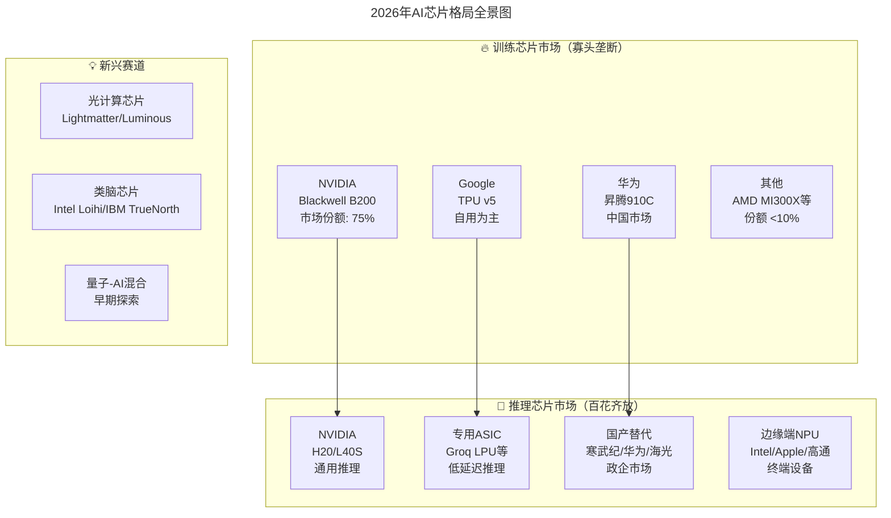
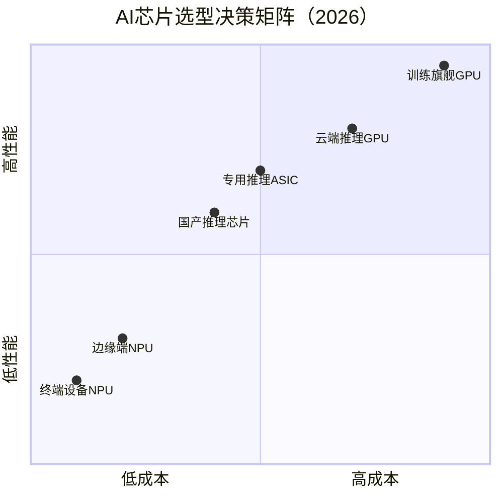
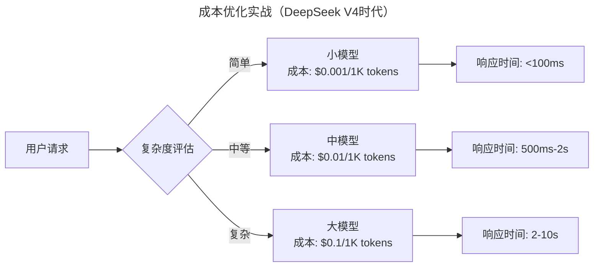
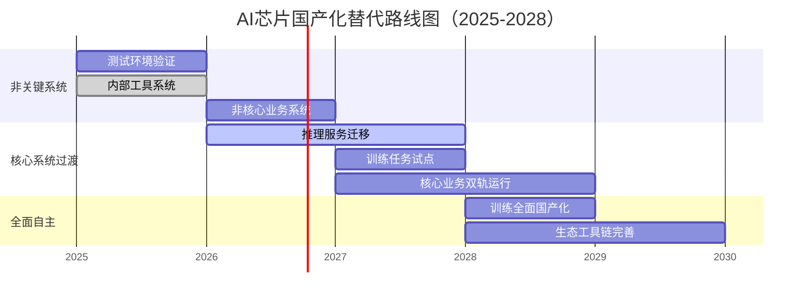

# 大咖对话 | 陈天石：AI 芯片需要技术和资本的双重密集支撑

> **适用范围**：AI基础设施决策者、CTO、技术VP及需要制定芯片选型与算力战略的管理者；同样适用于关注国产AI芯片生态与硬件选型的从业者。
>
> **更新摘要（v2 · 2026-08 更新）**：
> - 结构化升级为 6 节骨架（导言 / 核心方法论 / 关键流程 / 工具与实战 / 常见误区 / 进阶延展）
> - 将陈天石博士2018年的AI芯片行业判断与2026年市场格局验证整合为统一方法论
> - 补充2026年AI芯片选型决策矩阵、国产化替代路线图与成本优化策略
> - 保留全部Mermaid图、芯片对比表与避坑指南

---

## 1. 导言

本周大咖对话的嘉宾是寒武纪创始人兼CEO陈天石博士。近年来，AI成为科技领域内最受关注的话题，芯片行业也开始高频率地出现在大众的视野之中。而寒武纪作为国产AI芯片创业领域的头部独角兽，如何在巨头涌入芯片赛道后继续保持"独立"？我国芯片产业的前景何在？芯片产业当下的挑战和未来的发展趋势又是什么？在采访中，陈天石博士与我们分享了他的观点。

寒武纪拥有终端智能处理器和云端智能芯片两条产品线。针对终端应用，在2016年推出了世界首款终端人工智能专用处理器——寒武纪1A处理器（Cambricon-1A），面向智能手机、智能视觉、可穿戴设备、无人机、机器人和智能驾驶等各类终端设备，早于国外同类型产品两年以上。2017年开始先后发布了第二代多核智能处理器寒武纪1H及第三代高性能智能处理器寒武纪1M。1A、1H分别应用于麒麟970与麒麟980芯片中，迄今已累计服务了千万台智能手机终端。2018年5月发布了云端人工智能芯片MLU100，开始从云到端全面的人工智能计算力生态布局。

陈天石博士在2018年提出的几个关键判断——AI芯片需要专用化设计、技术和资本双重密集支撑、中国AI芯片有机会弯道超车——在2026年基本全部应验。本节将系统梳理这些判断及其在2026年的验证与延伸。

---

## 2. 核心方法论

### 2.1 AI芯片专用化设计的必要性

陈天石博士指出，深度学习是目前AI领域机器学习方法中最为有效的算法，深度学习模型需要大量的数据训练，这就要求处理器有极高的运算速度作为支撑。

**传统CPU的局限**：基于低延时的设计，拥有复杂的内部结构，优点是拥有针对各种不同类型数据的计算能力以及逻辑判断能力，适合进行复杂逻辑的问题处理和计算设备内的管理调度。但深度学习模型所需的运算能力极高，传统架构处理器无法做到功耗与速度上的平衡——通常需要成百上千条指令才能完成对一个神经元的处理。

**GPU的不足**：GPU是专门进行图像运算工作的处理器，因为它在浮点运算、并行计算等方面的性能优势与人工智能的需求不谋而合，于是在人工智能爆发的关键期被广泛使用。但作为图像处理器，GPU在推理阶段无法充分发挥并行优势，另外由于GPU的计算方式不是为深度学习算法专门设计，性能峰值无法被完全利用。

**专用AI芯片的优势**：寒武纪芯片是专门针对深度神经网络计算而设计的AI处理器。通过硬件神经元虚拟化、稀疏神经网络处理器架构等技术以及深度学习指令集，使得芯片在执行AI计算任务时能效可以实现最大程度的优化。

### 2.2 技术和资本双重密集支撑

芯片从设计、制造到封装是一条几乎没有捷径的漫长链条，尤其是芯片的设计，需要技术和资本双重密集支撑。能对计算基础架构进行布局的AI公司不多，能真正打造出高性能、可商用的量产AI芯片又是一件更不容易的事。

**2026年门槛验证**：
- ⭐ 先进制程成本：3nm工艺单次流片成本超过10亿美元
- ⭐ 研发投入：头部公司年研发投入超过50亿美元
- ⭐ 人才竞争：顶级芯片架构师年薪500万-1000万人民币
- ⭐ 生态壁垒：CUDA生态的护城河越来越深

### 2.3 AI芯片发展的三大挑战

陈天石博士指出，AI芯片发展需要持续完善以下三个方面：

1. **算力资源储备**：网络规模变大之后，如何用足够的计算能力来支持庞大复杂的深度学习模型
2. **功耗与成本**：如何在超大规模并行计算中更好地兼顾性能与功耗，同时成本可接受
3. **性能与灵活度**：如何能在拥有更适合AI计算特点的丰富算力的同时，让算力适用于尽量多的行业与应用场景

### 2.4 独立芯片设计公司的价值

寒武纪的定位一直以来很明确——做独立的芯片设计公司。为下游厂商提供不同尺寸、面向不同应用场景的终端AI处理器IP，提供从前端训练到后端推理的多品类云端AI芯片，帮助大家解决"AI闭环路上最后一公里"的事情。

---

## 3. 关键流程

### 3.1 2026年AI芯片格局全景图



### 3.2 推理革命：DeepSeek V4改变游戏规则

⭐ **2026年最大的变量：推理成本下降700倍**

```
2024年：训练成本 > 推理成本（训练一次模型需要数百万美元）
2026年：推理成本 >> 训练成本（模型可以反复使用，推理调用呈指数增长）
```

**对芯片行业的影响**：
- 训练芯片需求增速放缓——大模型训练趋于集中化
- 推理芯片需求爆发式增长——每个应用都需要推理能力
- 从追求峰值算力到追求能效比——推理更关注延迟和功耗
- 专用推理芯片机会巨大——ASIC/FPGA在特定场景更有优势

### 3.3 芯片类型演进验证

| 芯片类型 | 2018年地位 | 2026年地位 | 代表产品 |
|---------|-----------|-----------|---------|
| GPU（NVIDIA） | 主流选择 | 训练霸主，推理份额下降 | H100/B100/Blackwell |
| 专用AI芯片 | 新兴赛道 | 推理主流，快速增长 | 寒武纪MLU、华为昇腾、Google TPU |
| CPU+AI加速器 | 辅助方案 | 边缘端主流 | Intel Meteor Lake、AMD Ryzen AI |
| NPU | 概念阶段 | 终端设备标配 | Apple Neural Engine、高通Hexagon |

---

## 4. 工具与实战

### 4.1 CTO必须关注的硬件选型变化

| 应用场景 | 推荐方案 | 成本考量 | 关键指标 |
|---------|---------|---------|---------|
| 大模型训练 | NVIDIA B200/H100 | $30,000+/张 | TFLOPS、显存带宽 |
| 通用推理服务 | NVIDIA L40S/H20 | $10,000-15,000/张 | Token/s、延迟 |
| 高并发低延迟API | Groq LPU / 自研ASIC | 按用量计费 | P99延迟 <50ms |
| 私有化部署(政企) | 华为昇腾/寒武纪MLU | 国产化要求 | 自主可控、生态完善度 |
| 边缘端推理 | Intel NPU / 端侧NPU | 集成在CPU中 | 功耗 <25W、TOPS/W |
| 终端设备 | Apple NE / 高通Hexagon | SoC集成 | 能效比、隐私保护 |

### 4.2 AI芯片选型决策矩阵



### 4.3 成本优化实战（DeepSeek V4时代）

**模型分层策略**：
```
复杂任务 → GPT-5.5/Claude Opus（高精度但贵）
一般任务 → DeepSeek V4/Qwen3（性价比高）
简单任务 → 小模型/微调模型（极低成本）
```

**动态路由**：


### 4.4 国产化替代路线图



---

## 5. 常见误区

### 5.1 硬件选型避坑指南

1. **不要盲目追求最新硬件**——软件生态成熟度更重要
2. **不要忽视总拥有成本（TCO）**——不只是采购价格，还包括运维、能耗、人员成本
3. **不要低估迁移成本**——从CUDA迁移到其他平台需要大量工作
4. **不要忽视数据安全和合规**——特别是金融、医疗、政府等行业
5. **不要单点依赖**——保持多云、多芯片的灵活性

### 5.2 异构计算已成标配

陈天石博士预言的异构计算趋势在2026年已成为标配：
- 数据中心：CPU + GPU + DPU + NPU 协同工作
- 边缘端：CPU + NPU + DSP 混合架构
- 终端设备：SoC集成NPU成为标准配置

### 5.3 中国AI芯片发展的现实

| 方面 | 进展 | 挑战 |
|------|------|------|
| 华为昇腾系列 | ✅ 已形成完整生态，国内市场份额持续提升 | ⚠️ 受制裁影响 |
| 寒武纪 | ✅ 保持独立芯片设计公司定位，特定场景有优势 | ⚠️ 产能受限 |
| 壁仞科技、摩尔线程等 | ✅ 新势力崛起 | ⚠️ 软件生态待完善 |
| 高端市场 | ⚠️ 仍依赖NVIDIA | 先进制程受限 |

---

## 6. 进阶延展

### 6.1 异构计算与物联网的协同

陈天石博士指出，在未来时代，物联网和AI相辅相成，密不可分。物联网让各类的设备和终端有了生命，而AI让它们有了智商。物联网连接的物理对象多样且应用场景丰富，将来更需要通过云计算、边缘计算、智能终端计算的协同发展、有机部署来实现万物互联的智能世界。

### 6.2 AI基础设施战略选型策略

**核心原则**：多云、多芯片、多模型

| 层级 | 策略 | 关注点 |
|------|------|--------|
| **训练层** | 集中化、专业化 | TCO、训练速度、数据安全 |
| **推理层** | 分布式、场景化 | 延迟、成本、可用性 |
| **边缘层** | 本地化、实时化 | 功耗、实时性、离线能力 |

### 6.3 核心启示

> **技术的竞争从未停止，只是战场从"能不能造出来"变成了"能不能用好"。对于技术领导者来说，2026年的关键问题是如何在多元化的芯片选择中做出最优决策，如何平衡性能、成本、安全、合规等多重目标。答案不是简单的"选最贵的"或"选国产的"，而是基于业务场景的系统性思考。**

陈天石博士在2018年说："AI芯片这个领域，中国和其他国家相比不存在太多历史积累上的差距。"这句话在2026年得到了部分验证——中国确实在AI芯片领域取得了长足进步，但同时也面临着新的挑战。

### 6.4 延伸阅读

- NVIDIA Blackwell架构白皮书
- DeepSeek V4技术报告（推理成本革命）
- 华为昇腾910C生态指南
- 中国信通院《AI芯片产业发展白皮书（2026）》

---

*本注解基于2026年6月的AI芯片市场动态生成，包括NVIDIA Blackwell、DeepSeek V4、华为昇腾910C等最新信息。建议每半年更新一次硬件选型策略。*