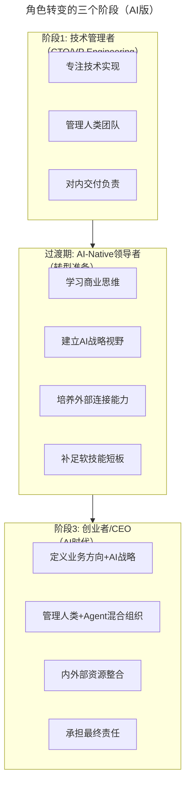
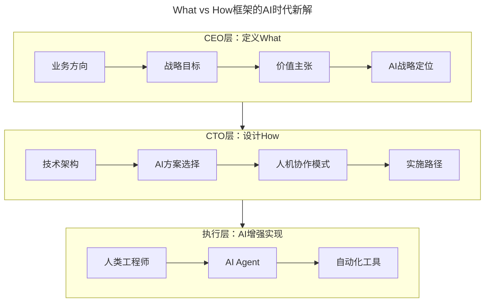

# 大咖对话 | 韩军：CTO转型CEO如何转变思路

> **适用范围**：计划从CTO转型CEO的技术领导者、技术背景的创业者，以及需要在AI时代完成"What vs How"思维跃迁的管理者；同样适用于希望理解AI时代人机协作组织形态的从业者。
>
> **更新摘要（v2 · 2026-08 更新）**：
> - 结构化升级为 6 节骨架（导言 / 核心方法论 / 关键流程 / 工具与实战 / 常见误区 / 进阶延展）
> - 将韩军老师的"What vs How"框架升级为AI时代版本，补充AI-Native领导者转型路径
> - 补充2026年从"管理人类团队"到"管理人类+Agent混合组织"的新挑战
> - 保留全部Mermaid图、能力差距对照表与行动建议

---

## 1. 导言

本周作客"大咖对话"的嘉宾是欧电云创始人兼CEO韩军。创立欧电云之前，韩军曾担任1号店CTO，从零开始打造了1号店技术系统，支持1号店业务每年数倍的业绩增长。

欧电云致力于为企业量身打造专业的新零售、新流通、全渠道数字化解决方案，提供全品类的电商产品、全渠道的流通管理、全终端的用户触点。在后ERP时代，以大中台，小前台，轻后台为核心的理念指引下，以强大的技术实力为驱动，为企业产业转型升级提供技术支撑和战略咨询。

技术的价值不完全由技术本身来决定的。因此，韩军希望做一家商业型的技术公司，把技术作为生产力直接输出，让技术能以一种直接的方式来生产价值。从这个想法出发，他选择了创业这条路。

韩军老师从1号店CTO到欧电云CEO的转型经历，提供了**技术人向创业者转变**的深刻洞察。在2026年的AI时代，这些洞察不仅成立，而且更加重要——AI极大地增强了我们的"How"能力，但"What"的定义依然是人类（特别是CEO）不可替代的核心职责。

---

## 2. 核心方法论

### 2.1 技术与业务的关系：What vs How

韩军认为，任何技术最后都要跟业务相结合，当今世界上是没有纯技术的概念的。哪怕你研究的是导弹技术，也需要跟导弹的设计成本、最终目标相关联，这其实也是业务的范畴了。所以，CEO一定要对业务有绝对的把控能力。

**核心框架**：
- 技术解决的是How的问题，而业务解决的是What的问题
- 两者的重要程度很难区分，但从哲学角度来讲，肯定是先有What再有How
- 次序是先有业务再有技术
- 技术领导力的核心是能够将业务与技术结合，能用技术的手段把问题解决

**2026年AI时代延伸**：AI是强大的How工具，但What依然需要人类判断。CEO需要额外定义的What包括AI战略定位、人机协作愿景、AI伦理边界、数据资产策略。

### 2.2 CTO与CEO的本质差异

| 维度 | CTO | CEO |
|-----|-----|-----|
| **关注点** | 技术实现 | 方向与目标 |
| **解决问题类型** | How（如何做） | What（做什么） |
| **支撑体系** | 背后有CEO支撑 | 最后一道防线 |
| **时间分配** | 90%内部 | 40%内部+60%外部 |
| **核心能力** | 解决问题 | 让别人解决问题 |
| **2026新增** | AI方案选择、人机配比优化 | AI战略定位、AI伦理边界 |

### 2.3 创业的关键能力转变

韩军指出，技术人创业需要完成以下转变：

1. 从**解决问题**到**让别人解决问题**
2. 从**执行者**到**命题提出者**
3. 从**CEO给命题我来解决**到**自己提出命题让团队解决**
4. 补足软技能：沟通能力、商业认知能力、获取外界帮助的能力

**2026年版延伸**：从"自己写代码或自己用AI写代码"进化为"设计一个让人类和AI Agent都能高效解决问题的系统"。

---

## 3. 关键流程

### 3.1 角色转变的三个阶段（AI版）

### 3.2 "What vs How"框架的AI时代新解

**CEO的"What"在AI时代的扩展**：
- AI战略定位：我们是AI驱动型公司还是AI赋能型公司？
- 人机协作愿景：未来团队的理想形态是什么？
- AI伦理边界：什么AI应用我们坚决不做？
- 数据资产策略：我们的数据如何成为竞争优势？

**CTO的"How"在AI时代的进化**：
- AI技术栈选择：自建还是采购？开源还是闭源？
- Agent架构设计：哪些任务交给Agent？如何编排？
- 人机配比优化：多少人类工程师？多少Agent？
- AI治理机制：如何确保AI输出质量？如何控制成本？

### 3.3 能力差距分析

| 能力维度 | CTO阶段要求 | CEO阶段要求 | 差距等级 |
|---------|------------|------------|---------|
| **技术深度** | ⭐⭐⭐⭐⭐ | ⭐⭐⭐ | 需要降低 |
| **技术广度** | ⭐⭐⭐⭐ | ⭐⭐⭐⭐⭐ | 需要扩展至AI战略 |
| **商业敏感度** | ⭐⭐ | ⭐⭐⭐⭐⭐ | 急需提升 |
| **资源整合** | ⭐⭐⭐ | ⭐⭐⭐⭐⭐ | 急需提升 |
| **对外沟通** | ⭐⭐ | ⭐⭐⭐⭐⭐ | 急需提升 |
| **决策担当** | ⭐⭐⭐ | ⭐⭐⭐⭐⭐ | 心态转变 |
| **AI治理能力** | ⭐⭐ | ⭐⭐⭐⭐ | 新增要求 |

---

## 4. 工具与实战

### 4.1 创业准备的AI时代清单

| 准备类别 | 具体内容 | 重要度 |
|---------|---------|--------|
| **🆕 AI认知准备** | 理解AI的能力边界，不神话也不轻视 | ⭐⭐⭐⭐⭐ |
| **🆕 AI技能准备** | 至少精通一个AI工具的使用 | ⭐⭐⭐⭐ |
| **🆕 AI资源准备** | 了解AI服务的成本结构（API调用、算力等） | ⭐⭐⭐⭐ |
| **经济准备** | 12-18个月的runway | ⭐⭐⭐⭐⭐ |
| **精神准备** | 接受失败的可能性，保持热爱 | ⭐⭐⭐⭐⭐ |
| **团队准备** | 找到互补的合伙人（技术+商业） | ⭐⭐⭐⭐ |

### 4.2 "让别人解决问题"的AI时代新内涵

韩军原话："关键能力不再是如何解决问题，而是能让别人解决问题"

**2026年版具体能力**：
1. **任务分解能力**：将复杂问题拆解为"适合人类"和"适合AI"的子任务
2. **Agent编排能力**：设计和优化多Agent协作工作流
3. **质量控制能力**：建立AI输出的审核和反馈机制
4. **团队能力建设**：培养团队成员的AI协作能力

### 4.3 给想从CTO转型CEO的技术人的行动建议

1. **✅ 建立商业思维（立即开始）**
   - 每周阅读一份行业研究报告（不只是技术报告）
   - 尝试从CEO视角分析所在公司的商业模式
   - 学习基本的财务知识（P&L、Cash Flow、Unit Economics）

2. **✅ 培养"向外看"的习惯（本月启动）**
   - 参加非技术类的行业会议和活动
   - 与客户/用户直接交流（不只通过产品经理）
   - 建立跨界的人脉网络

3. **✅ 补足软技能短板（持续进行）**
   - 练习"讲故事"的能力（融资、招聘都需要）
   - 提升公开演讲和表达能力
   - 学习谈判技巧和影响力建设

4. **📋 制定个人转型路线图（本季度完成）**
   - 明确目标：什么时候转？转到什么角色？
   - 识别差距：对照能力矩阵，找出短板
   - 制定计划：每天/每周的具体行动项

### 4.4 给正在创业的技术人的建议

5. **🆕 正确定位AI在业务中的角色**
   - 问自己：AI是我的**核心产品**还是**效率工具**？
   - 如果是核心产品：需要强大的AI团队和数据壁垒
   - 如果是效率工具：专注于业务本身，AI辅助提效

6. **🆕 建立"技术+商业"双轮驱动**
   - 找一个懂商业的联合创始人（如果你是技术背景）
   - 或者强迫自己每周花固定时间学习商业知识
   - 定期请非技术背景的朋友"挑战"你的商业假设

---

## 5. 常见误区

### 5.1 技术人创业的三道思维坎

| 思维坎 | 表现 | 如何跨越 |
|-------|------|---------|
| **坎1：技术至上主义** | "我的技术这么牛，产品一定能成" | 认识到AI降低了技术门槛，真正的壁垒是业务洞察 |
| **坎2：AI万能论** | "AI能解决所有问题" | 理解AI擅长规则性任务，但不擅长创造性、情感性工作 |
| **坎3：快速成功幻想** | "有了AI就能快速做出独角兽" | 认识到垂直行业需要深耕，AI只是加速器不是魔法棒 |

### 5.2 AI创业陷阱

- ❌ 不要因为"有AI概念"就认为有护城河
- ❌ 不要过度投入技术研发而忽视市场验证
- ✅ 用MVP快速验证AI是否真的解决了用户痛点
- ✅ 关注AI的**实际效果**而不是技术先进性

### 5.3 预期验证对照

| 韩军2018年观点 | 2026年AI时代现实 | 验证结果 |
|--------------|----------------|---------|
| "没有纯技术的概念" | AI技术必须与场景结合才能产生价值 | ✅ 完全验证 |
| "技术解决How，业务解决What" | AI是强大的How工具，但What依然需要人类判断 | ✅ 更加重要 |
| "CEO花60%时间在外部" | AI时代CEO需更多关注AI战略、生态合作 | ✅ 内涵扩展 |
| "从解决问题到让别人解决" | 从写代码到管理AI Agent团队 | ✅ 新的诠释 |

---

## 6. 进阶延展

### 6.1 创业压力的应对哲学

韩军老师分享了应对创业压力的核心心法：创业的初心一定要是做你真正喜欢的、热爱的事情，而不是为了赚钱。赚钱是创业成功之后必然会获得的回报，但它不应该成为你创业的初衷。

因为热爱，你才会全情投入，就不会计较一时的得失，也就不会被压力压垮。即使遇到困难也会是痛并快乐着，因为你证明了自己，你解决了很多用户的痛苦，你为社会创造了价值。

### 6.2 原文精华的AI时代传承

| 原文核心观点 | AI时代价值 | 2026年实践建议 |
|------------|----------|---------------|
| 没有纯技术的概念 | ✅ AI必须与场景结合 | 先找场景，再选AI技术 |
| What优先于How | ✅ 更重要的原则 | 花80%精力想清楚What，20%精力优化How |
| CEO是最后一道防线 | ✅ 决策责任更重 | AI时代决策更复杂，需要更强判断力 |
| 从解决问题到让别人解决 | ✅ 范围扩展到AI Agent | 设计人机协作系统而非亲力亲为 |
| 初心是热爱而非赚钱 | ✅ 永恒真理 | AI创业同样需要热情和坚持 |

### 6.3 核心启示

> **韩军老师的"What vs How"框架在AI时代获得了新的生命力——AI极大地增强了我们的"How"能力，但"What"的定义依然是人类（特别是CEO）不可替代的核心职责。技术人转型CEO，本质上是从"优秀的How执行者"进化为"智慧的What定义者"。**

如果韩军老师在2026年重写，可能会补充：
> "以前我们说技术人要跨过'重技术轻业务'的坎。现在我要加一条：还要跨过'迷信AI'的坎——AI很强大，但它不能替代你对行业的深入理解，不能替代你与客户的真诚沟通，不能替代你在困境中的坚持和勇气。"

---

*本注解基于2026年6月的创业环境生成，是对韩军老师2018年经验的致敬与延展。*