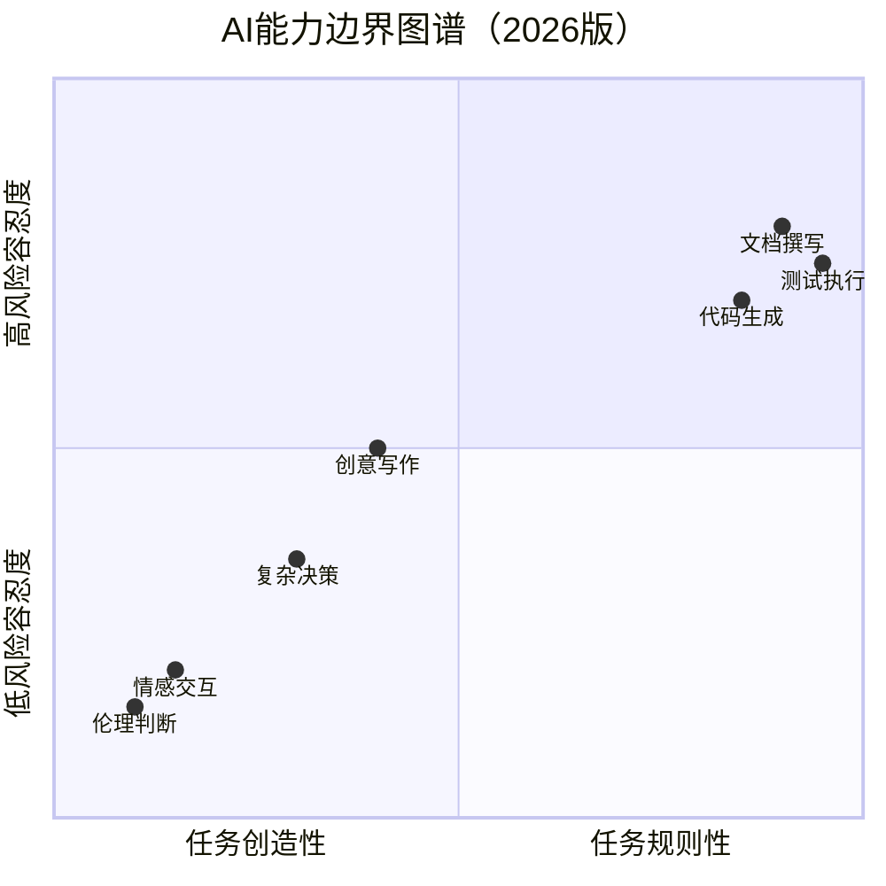

# 大咖对话 | 高斌：过分渲染会过度拉高大众对人工智能的期望

> **适用范围**：AI产品负责人、技术领导者及需要向业务方、用户管理AI预期的从业者；同样适用于希望在AI落地过程中避免"过度渲染—期望破灭"循环的管理者。
>
> **更新摘要（v2 · 2026-08 更新）**：
> - 结构化升级为 6 节骨架（导言 / 核心方法论 / 关键流程 / 工具与实战 / 常见误区 / 进阶延展）
> - 将高斌博士2018年的AI落地三因素与认知偏差分析整合为统一方法论体系
> - 补充2026年AI能力边界图谱与理性AI观的实践建议
> - 保留全部Mermaid图、对照表与可执行建议

---

## 1. 导言

本周大咖对话的嘉宾是高斌，现任微软总部必应搜索广告部门首席机器学习科学家（Chief Machine Learning Scientist），此前曾担任微软亚洲研究院机器学习研究组主任研究员，主要从事机器学习（Machine Learning）、信息检索（Information Retrieval）、数据挖掘（Data Mining）和计算广告（Computational Advertising）等领域的研究，在国际顶级期刊和会议上发表相关论文 40 余篇，持有 30 余项美国专利，其指导的论文曾获得国际信息检索大会（SIGIR）最佳学生论文奖。

在做研究的同时，高斌博士十分重视和产品部门的合作，将十多项技术转化到了必应搜索、必应搜索广告、微软小冰等产品中。也是在这个过程中，高斌博士对应用型研究产生浓厚兴趣，因此申请转到产品部门，成为了微软总部必应搜索广告部门的首席机器学习科学家，将前沿的机器学习技术应用到产品中，同时针对具体应用研发新的算法模型，改进产品性能。

高斌博士在2018年发出的理性之声——"过分渲染会过度拉高大众对人工智能的期望"——在当时是少数派观点，而到2026年已成为行业共识。本节将以高斌博士的对话为基础，结合2026年AI实践，系统梳理AI落地的关键因素与预期管理方法论。

---

## 2. 核心方法论

### 2.1 AI落地的三大关键因素

高斌博士认为，影响人工智能落地的因素主要有以下三个方面：

**因素一：明确技术应用的边界和程度（Define Technical Boundaries）**

虽然人工智能技术发展日新月异，但是目前能够解决的问题还是有限的。我们要弄清楚在一个应用场景中哪些部分是人工智能技术可以解决的，可以解决到什么程度，哪些部分不能解决。然后针对应用场景的需求期望来决定哪些部分使用人工智能技术以及使用何种人工智能技术。这样才能最大的发挥技术功效，并且避免因为一些不切实际的幻想破灭而造成的负面影响。

**因素二：提升数据质量（Improve Data Quality）**

人工智能技术尤其是深度学习（Deep Learning）技术需要依托海量数据来进行模型训练。我们需要针对具体的应用问题来对数据进行选择和处理，包括对数据量的积累、对多种类型的数据进行取舍、对数据进行降噪（Denoising）、对数据内在关联进行分析和利用等。在这个基础上，才能更好的建立模型并提升模型学习质量。

**因素三：提高工程实现能力（Enhance Engineering Capability）**

虽然近年来高性能计算硬件的发展和普及非常迅猛，高水平的工程实现能力依然是影响人工智能落地的重要因素。一般来说，数据量、模型尺度的增长速度还是大于硬件发展的速度的，高水平的工程实现能力可以最高效地在硬件计算资源、数据量和算法模型之间找到平衡点，实现人工智能技术的落地。

### 2.2 认知偏差的双重影响

高斌博士指出，大众对人工智能的认知偏差普遍比较大，出现这种偏差有多方面的原因：艺术作品的先入为主、对大众的人工智能知识科普的不足、媒体的过度渲染、部分从业人员的炒作等等。

| 偏差类型 | 表现 | 对行业的影响 |
|---------|------|-------------|
| **恐慌影响** | AI取代人类、失业率升高的恐惧导致盲目反对 | 社会阻力增加，影响行业发展节奏 |
| **失望影响** | 过度渲染拉高期望，实际表现落差导致质疑 | 产品被抛弃、技术改进推广受阻 |

### 2.3 AI的未来定位

高斌博士认为，人工智能在未来会回归它原本的位置，成为人们比较关注的几个前沿技术领域，并会不断地带来改变人们生活的新技术。这一判断在2026年得到了完美验证——AI经历了2022-2023年的过度炒作期、2024年的泡沫回归期，最终在2026年进入"务实落地期"。

---

## 3. 关键流程

### 3.1 AI能力边界管理流程

基于高斌博士"明确技术边界"的核心观点，2026年版AI能力边界图谱如下：



**边界管理三原则**：
- ✅ **适合AI**：高频、规则明确、质量标准清晰的任务（代码生成、文档撰写、测试执行）
- ⚠️ **人机协作**：需要领域知识+AI能力的混合任务（创意写作、复杂决策）
- ❌ **不适合纯AI**：涉及情感、伦理、高度创造性的决策（情感交互、伦理判断）

### 3.2 从"过度渲染"到"理性成熟"的演进路径

```
2018: 高斌提出警告
  ↓
2022-2023: ChatGPT爆发，过度渲染达到顶峰
  ↓
2024: AI泡沫破裂，期望回归理性
  ↓
2026: AI进入"务实落地期"——这正是高斌预言的状态
```

### 3.3 预期验证对照表

| 高斌2018年预测 | 2026年现实 | 验证结果 |
|--------------|----------|---------|
| "明确技术边界很重要" | Agent时代更需要边界意识 | ✅ 完全验证 |
| "过度渲染拉高期望" | 2023-2024年AI泡沫后回归理性 | ✅ 精准预测 |
| "AI会创造新职业" | AI Engineer、Prompt Engineer等新岗位涌现 | ✅ 完全验证 |
| "数据质量是关键" | 高质量训练数据成为核心壁垒 | ✅ 更加重要 |
| "工程实现能力重要" | MLOps/LLMOps成为关键能力 | ✅ 范围扩展 |

---

## 4. 工具与实战

### 4.1 适合发展AI技术的企业类型

高斌博士指出，与数据相关的企业都可以发展人工智能技术，只是不同企业的发力点可能不一样：

| 企业类型 | 发力方向 | 典型场景 |
|---------|---------|---------|
| **技术升级型** | AI技术与传统行业结合 | 制造业智能化、金融风控 |
| **技术突破型** | AI关键技术的本质突破 | 大模型研发、芯片设计 |
| **应用创新型** | AI在具体场景的创新 | 智能客服、个性化推荐 |

### 4.2 AI人才团队构建

高斌博士分享了微软必应搜索广告部门技术团队的三种角色配置：

| 角色类型 | 英文名称 | 主要职责 |
|---------|---------|---------|
| 软件开发工程师 | Software Development Engineer | 产品系统构建、模块开发、技术维护 |
| 数据科学家 | Data Scientist | 数据处理、分析、挖掘、预测、决策 |
| 应用科学家 | Applied Scientist | 问题建模、算法实现并嵌入产品系统 |

**人才吸引的三种方式**：
1. 对外宣传：在学术会议、产业会议等活动中展现技术实力
2. 实习生项目：从在读硕博研究生中筛选高水平技术人才
3. 前沿项目吸引：通过有挑战性的项目吸引内部人才流动

### 4.3 AI学习者成长建议

高斌博士对刚开始学习人工智能的技术人提出以下建议：
1. **打好基础**：数学基础、计算机基础、编程基础都要扎实
2. **选择方向**：结合自身条件、个人兴趣和行业发展选择适合的方向
3. **紧跟技术**：人工智能领域技术更新迭代速度很快，稍不留神就会被落在后面

### 4.4 观点不一致的处理方法论

高斌博士分享了工作中处理观点不一致的协商方法：

| 情况 | 处理方式 |
|------|---------|
| 项目目标不一致 | 看是否可以分阶段完成，双方妥协取舍 |
| 目标一致但执行方案不同 | 论证每个方案可行性，按衡量标准做出认可选择 |
| 通用原则 | 具体问题具体分析，本着解决问题的态度协商互相妥协 |

---

## 5. 常见误区

### 5.1 AI炒作陷阱

**高斌的核心警示**："过分渲染会过度拉高大众对人工智能的期望"

2026年的理性AI观应避免以下误区：

| 误区 | 表现 | 正确做法 |
|------|------|---------|
| **AI万能论** | 认为AI能解决所有问题 | 理解AI擅长规则性任务，不擅长创造性、情感性工作 |
| **概念堆砌** | 用AI概念包装产品而非解决痛点 | 用数据和案例说话，不用概念堆砌 |
| **忽视ROI** | 因为"有AI"就认为有价值 | ROI > 1才是成功的AI项目 |
| **期望失控** | 对AI产品效果过度承诺 | 设定合理的AI项目成功标准 |

### 5.2 80/20法则在AI中的体现

高斌博士的观点在2026年延伸为：**80%的价值来自20%的高价值场景**。技术领导者需要避免在不适合AI的场景强行引入AI，而应聚焦于真正能产生价值的领域。

---

## 6. 进阶延展

### 6.1 金融领域的AI应用前景

高斌博士在对话中提到，人工智能在金融领域可应用于收益预测、投资组合构建（Portfolio Construction）、风险管理、金融产品推荐等方面，其中他最期待的应用场景是投资组合构建。

### 6.2 ⭐2026可执行建议

**建立团队的"AI边界意识"**：
- 制定AI使用规范：何时用、何时不该用
- 定期复盘AI项目的实际效果vs预期

**避免"AI炒作陷阱"**：
- 用数据和案例说话，不用概念堆砌
- 设定合理的AI项目成功标准

### 6.3 核心启示

> **高斌博士的理性声音在2018年是少数派，如今已成为行业共识。技术领导者的核心职责不是追逐AI热点，而是在明确技术边界的前提下，务实地将AI能力转化为真实的业务价值。**

高斌博士2018年观点的AI时代价值传承：

| 原文核心观点 | AI时代价值 | 2026年实践建议 |
|------------|----------|---------------|
| 明确技术边界 | ✅ Agent时代更需要边界意识 | 用能力边界图谱指导AI选型 |
| 提升数据质量 | ✅ 高质量数据成为核心壁垒 | 建立数据质量评分机制 |
| 提高工程能力 | ✅ MLOps成为关键能力 | 培养LLMOps工程团队 |
| 避免过度渲染 | ✅ 永恒真理 | 用ROI而非概念评估AI项目 |

---

*本注解基于2026年6月生成，高斌博士的理性声音在当时是少数派，如今已成为行业共识。*