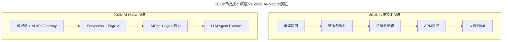
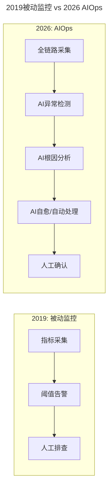

# 第99讲 | 徐裕键：业务高速增长过程中的技术演进

> **适用范围**：CTO、技术总监、架构师，以及正在经历业务高速增长、面临技术体系演进决策的创业公司技术负责人。

> **更新摘要（v2 · 2026-08 更新）**：
> - 结构化升级为 6 节骨架（导言 / 核心方法论 / 关键流程 / 工具与实战 / 常见误区 / 进阶延展）
> - 保留徐裕键原文完整内容及贝贝网技术演进实践
> - 将2019年技术栈（微服务/私有云/APM/CI-CD/大数据）升级为2026年AI-Native技术栈
> - 新增AI辅助架构设计、AIOps替代传统监控、AI-Native CI/CD三大加速器
> - 整合原文独立的AI时代注解内容到对应章节

---

## 1. 导言

然而，在业务高速增长的过程中，来自技术的挑战也不可忽视。贝贝网从一个电商新秀到行业独角兽，只用了短短两三年的时间，看似顺利，但其中的酸甜苦辣只有我们自己知道。所以今天就想扒扒皮，和你分享一下我们业务扩张过程中在技术上踩过的那些坑，以及我们是如何应对的。

本文原发布于2019年，徐裕键分享了贝贝网在业务高速增长过程中的技术演进经验：**系统解耦、服务化、私有云、APM监控、CI/CD、大数据/ML**。7年后的今天，这些实践已成为行业标准，但**AI正在重塑每一个环节**——84%开发者使用AI工具，AIOps替代传统监控，Agent参与运维决策。本文在保留原文实践精华的基础上，从2026年的视角补充AI时代的技术演进新路径。

---

## 2. 核心方法论

### 2.1 业务规模和复杂度快速增长带来的挑战

其实，创业最初，我们曾怀疑过贝贝网这个平台的可能性，因为在早期的电商淡季时期，我们连三个九的业绩都达不到。后来，在双十一流量压力的作用下，我们把业绩做到了四个九以上，才打消了我们的疑虑。

另外，最开始我们是移动电商，APP版本的迭代速度非常慢，早期可能一个月更新一个版本都非常困难。后来，经过技术的不断演进、团队的不断迭代，我们能够做到每周更新一个版本，而且新版本的缺陷率从原先的50%降低到5%。50%意味着，在早期，我们上线的100个需求里面，有50个需求是有缺陷的，需要返工的。

版本更新速度的提升与相应错误率的下降，这背后起支撑的是一个团队的持续迭代。一个人可以走得很快，但唯有一个团队，才能走得更远。

再来看来自于技术的挑战。公司在快速发展过程中，相应的业务量也是快速增长的，最初可能只有一个单一的产品、一个简单的业务，到后面，随着业务、产品的成熟，逐渐将它铺开后，可能会出现多个产品，甚至数十条业务线，都需要并行迭代的情况。此时便会衍生出更多的问题，具体可以分为三点：

**第一个问题**，原先我们习惯于在一个工程或一个系统应用上进行开发，长期以往，代码会越堆越多，导致这个系统越来越腐化，架构越来越不稳定，出现越来越多的耦合。

这时就会发现，团队的新成员进来后不敢写代码，团队中的老人也不敢对这个存在复杂耦合性的系统轻举妄动。因为，极有可能你动了某个地方，就会导致整个系统出现更大的问题。

**第二个问题**，当大家都在一个工程、一个应用上进行开发，并且有多条业务线并行迭代的时候，每个团队直接的步伐并不一致，互相之间可能会有诸多争论。这样就会导致版本更新的效率大大降低，也加大了需求上线的难度。

**第三个问题**，由于系统太过耦合，可能某个新功能上线后对于全站业绩增长的影响非常有限，但因为系统扛不住新功能带来的流量，结果导致核心链路交易服务都不可用了。

### 2.2 核心原则：保证生存是首要目的

首先，我们要明确一个观点：**保证生存是首要目的，永远没有非常完美的产品方案，我们必须要不停地进行开发和迭代。** 所以，我们必须具备一种快速试错、低成本试错的能力，使产品和业务完成快速迭代。并且，当这个模式成熟后，能够帮助产品和业务快速进行规模化，再通过这种规模化的能力，实现公司商业价值最大化。

### 2.3 ⭐ 2019 vs 2026：技术栈演进对比

| 技术领域 | 2019年实践 | 2026年AI增强版 |
|----------|-----------|---------------|
| 应用拆分 | 服务框架/微服务 | **微服务 + AI Gateway + Agent Platform** |
| 系统解耦 | 异步消息队列 | **事件驱动 + AI智能路由** |
| 数据层 | 分布式数据访问 | **向量数据库 + RAG + 实时分析** |
| 部署方式 | 私有云/容器化 | **Serverless + Edge Computing + AI推理** |
| 监控告警 | APM全链路监控 | **AIOps + AI根因分析 + 预测性告警** |
| CI/CD | 持续集成/灰度发布 | **AI测试生成 + 自动化部署 + 智能回滚** |
| 大数据/ML | 机器客服/自动化排期 | **LLM Agent + 智能客服 + 自动化运营2.0** |



上图对比了2019年与2026年的技术演进路径：2019年的演进从单体应用到微服务、私有云、APM监控、大数据/ML，是线性的能力叠加；2026年的AI-Native演进则在每个环节都融入了AI能力——AI API Gateway、Edge AI、AIOps自治、LLM Agent Platform，形成了质变式的技术范式升级。

---

## 3. 关键流程

### 3.1 业务系统解耦合及平台化推进

回到具体的技术挑战，公司规模上来后，我们在每个技术领域都有非常大的技术演进，是基于全栈的技术演进，从APP端组件化动态化，到业务层组件化，到服务化，一直到底层数据库拆分、运维自动化、持续集成能力的提升等，我们都做了很多布局，而且很多都被证明是非常有效的。同时，整个系统的基础架构设施也在不断完善和配套。最有力的表现就是，后台研发同学的交付能力，直接是翻倍的提升。

其实，归纳起来就是通过服务框架对应用进行拆分解耦、采用异步消息来对系统进行解耦、使用分布式数据访问实现数据层的无限扩容。

在APM应用性能管理方面，我们自研了一套从客户端到后端的全链路应用市场监控，便于我们对性能进行优化。其监控管理对象也从最初的单应用演进为多应用。

在应用拆分、服务化之后，我们还自研了一套私有云系统，改进了系统的部署方式，从原来的集中式部署，到分布式部署，再演进到单元化部署。这样一来，原本交付一个资源至少需要一天以上，现在只需要几分钟就能进行扩容，效果立竿见影。

在监控告警方面，我们从原来的单机房部署，一路演进到异地多机房部署，基于这样的监控告警体系，当我们的业务指标发生变化时，能够做到一分钟之内告警，特别是核心业务指标发生变化时，我们可以及时进行处理。

在持续集成方面，我们也从最初的单系统优化做到后面的结构型优化，能够提供非常灵活的灰度发布机制、非常快捷的回滚机制，确保即使出现问题，它的影响也能控制到最小。

在大数据方面，我们很早就开始布局，并组建大数据团队，目前已经演进到机器学习阶段。比方说在客服上，机器客服能够帮助节省一半的客服人员，减少人力资源消耗。另外，对运营也有非常大的帮助，比如通过自动化排期，基本能做到减少1/3运营人员的投入。

### 3.2 流程保证快速迭代

当然，在技术之外，流程是保证快速迭代的关键，对此，我们定了两点原则：一是每个阶段都实行准入制度，明确需求；二是每个环节都检查输出，包括质量和时间两个维度。在具体执行中，我们推行短项目迭代制，正如之前提到的，没有完美的产品方案，我们要先求有，再求优，小步快跑、快速迭代，而所有的技术与系统都要能支撑我们能够迅速验证产品。

### 3.3 ⭐ AI辅助架构设计

**原文痛点：**
> 代码越堆越多，系统腐化，新人不敢写代码

**⭐ 2026 解决方案：**

```
传统做法：
□ 人工Code Review
□ 定期重构
□ 架构师经验驱动

2026增强：
✅ AI Code Review（覆盖100%代码）
✅ AI自动识别技术债务
✅ AI生成重构建议
✅ AI架构文档自动同步
```

### 3.4 ⭐ AIOps替代传统监控

**原文实践：**
> 自研全链路APM，一分钟内告警

**⭐ 2026 升级：**



上图对比了2019年被动监控与2026年AIOps的差异：传统被动监控从指标采集到阈值告警再到人工排查，是线性的人工流程；AIOps则增加了AI异常检测、AI根因分析、AI自愈/自动处理环节，将人工介入推迟到最后的确认环节。

**关键能力提升：**
- 告警准确率：60% → **95%+**（减少误报）
- MTTR（平均恢复时间）：小时级 → **分钟级**
- 根因定位：人工数小时 → **AI分钟级**

### 3.5 ⭐ AI-Native CI/CD

**原文实践：**
> 灰度发布、快捷回滚

**⭐ 2026 新范式：**

```
2019 Pipeline:
Git Push → Build → Test → Deploy → Monitor

2026 AI-Native Pipeline:
Git Push → AI Code Review → AI Test Gen → 
AI Security Scan → Auto Deploy → AI Monitor → 
AI Incident Response
```

---

## 4. 工具与实战

### 4.1 贝贝网技术演进实践总结

贝贝网在业务高速增长过程中的技术演进，归纳起来包括：

- **服务框架拆分解耦**：通过微服务化解决系统腐化和耦合问题
- **异步消息系统解耦**：降低业务线之间的步伐不一致问题
- **分布式数据访问**：实现数据层的无限扩容
- **APM全链路监控**：从客户端到后端的全链路性能管理
- **私有云系统**：从集中式部署到分布式部署再到单元化部署
- **监控告警体系**：一分钟内告警，核心业务指标及时处理
- **持续集成优化**：灵活灰度发布、快捷回滚机制
- **大数据/ML应用**：机器客服节省一半客服人员，自动化排期减少1/3运营人员

### 4.2 ⭐ 2026创业公司技术选型优先级

**原文核心观点：**
> 保证生存是首要目的...学会克制自己的技术洁癖

**⭐ 2026 补充：**

```
2026创业公司技术选型优先级：

P0（必须做）：
□ 选择支持AI的基础设施（Vercel/Cloudflare Workers）
□ 引入AI编码工具（Cursor/Copilot）提升交付效率
□ 建立AI安全规范（数据隐私、API密钥管理）

P1（尽快做）：
□ 搭建AI Gateway（统一AI接口层）
□ 实施AI Code Review
□ 探索AI在核心业务中的应用

P2（规划中）：
□ 构建内部AI知识库
□ 培养AI人才梯队
□ 评估Agent应用的可行性
```

---

## 5. 常见误区

### 5.1 传统技术演进的常见误区

- **误区1：追求完美方案**——原文强调"永远没有非常完美的产品方案"，要学会克制技术洁癖，适合的才是最好的
- **误区2：系统耦合不重视**——新功能上线扛不住流量，导致核心链路交易服务不可用
- **误区3：忽视流程保障**——技术之外，流程是保证快速迭代的关键，需实行准入制度和输出检查

### 5.2 AI时代技术演进的常见误区

- **误区1：盲目追新AI技术**——不顾业务实际需求，追求最新AI架构，导致过度工程
- **误区2：忽视AI安全规范**——将公司代码直接喂给公开AI模型，造成数据隐私泄露
- **误区3：AI工具覆盖率低下**——仍用传统方式完成可由AI加速的工作，交付效率低下
- **误区4：过度依赖AIOps**——完全信任AI自愈能力，忽视人工确认环节

---

## 6. 进阶延展

### 6.1 总结

技术上的挑战，来自于业务高速增长形成规模化之后，带来的系统复杂度的上涨，而解决的重点在于，通过服务框架对应用进行拆分解耦、采用异步消息来对系统进行解耦、使用分布式数据访问实现数据层的无限扩容。

然而需要注意的是，对创业团队来说，如果想要把握住机会，就必须做到快，因此，在技术演进的时候，也要学会克制自己的技术洁癖，不要追求完美，适合的才是最好的。

### 6.2 作者简介

徐裕键，贝贝网合伙人兼研发副总裁。负责贝贝技术团队管理，从0到1搭建贝贝移动电商产品和技术架构，推动集团各个技术领域快速演进，完善技术团队的梯队搭建和文化建设。（本文整理自徐裕键在ArchSummit全球架构师峰会上的分享，有删减。）

### 6.3 参考与延伸

- 贝贝网技术演进全栈实践：APP端组件化动态化→业务层组件化→服务化→数据库拆分→运维自动化→持续集成
- 三大解耦手段：服务框架拆分、异步消息解耦、分布式数据访问扩容
- 2019→2026技术栈演进：微服务→AI Gateway、APM→AIOps、CI/CD→AI-Native Pipeline
- 创业公司技术选型优先级：P0（AI基础设施+编码工具+安全规范）→P1（AI Gateway+Code Review+业务应用）→P2（AI知识库+人才梯队+Agent应用）

---

**注解完成时间**：2026年6月  
**适用读者**：CTO、技术总监、创业者  
**核心价值**：将高速增长期的技术演进经验与AI时代结合
