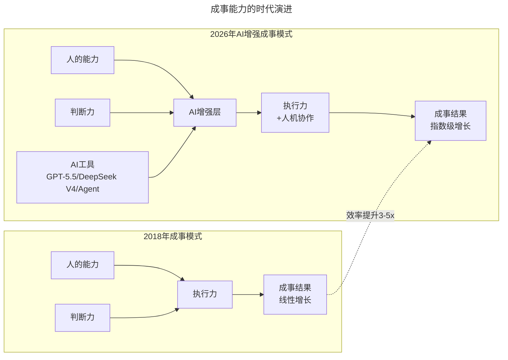
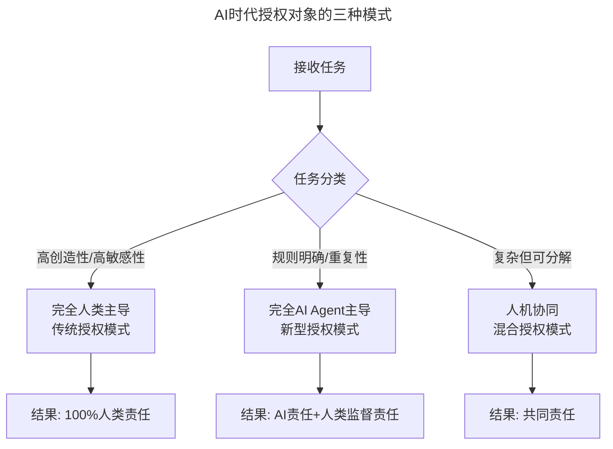

# 第8讲 | 技术领导力就是"成事"的能力

> **适用范围**：技术团队的CTO、技术VP、技术总监及高级技术管理者，尤其是需要培养领导力、推动事情从0到1落地的技术一把手；同样适用于在AI时代希望用"人+AI"协同模式提升"成事"能力的从业者。
>
> **更新摘要（v2 · 2026-08 更新）**：
> - 结构化升级为 6 节骨架（导言 / 核心方法论 / 关键流程 / 工具与实战 / 常见误区 / 进阶延展）
> - 将"成事"能力拆解为六大核心能力，并补充AI时代（2026）各能力的演进解读
> - 新增AI时代"成事"公式：(人的能力 + AI增强) × 执行力 × 判断力 × AI协同系数
> - 保留全部Mermaid图、数据表与作者案例

---

## 1. 导言

人，是一个创新企业最重要的要素，在确定方向上能否在市场上胜出，在于这个企业招聘和管理了什么样的人才。越是高端的人才越难招聘和管理，而如何和各层级人员有效的合作，领导力是一个技术管理者的重要能力。在技术管理核心能力模型中：领导力、人员管理能力、文化构建能力、体系搭建能力、技术实力，领导力是排在第一位的。

那么什么是技术人员的领导力呢？经常有人这样定义技术管理者的领导力：领导力就是让人服你，所以技术管理者的领导力就是技术要比大家都强；还有人认为领导力就是权力，赋予你权力自然就有领导力。这都不是正确的理解。

领导力，管理大师德鲁克的定义是"领导力能将一个人的愿景提升到更高的目标，将一个人的业绩提高到更高的标准，使一个人能超越自我界限获得更大成就"。另一个领导力大师John Maxwell(约翰·麦克斯威尔)定义是：领导者是知道方向、指明方向，并沿着这个方向前进的人。

而我对领导力的定义很简单：**"成事"的能力**，职位不是别人授予你的，而是你自己挣出来的。领导力就是用各种各样的方法、人员、影响力、号召力、决策力将一个事情从0到1的能力，如果把事情做成0.99，都不是领导力的体现。"成事"，对最终结果负责，这是最高级领导力的体现。

进入2026年，当GPT-5.5可以辅助编写80%的代码，当DeepSeek V4让AI成本降低700倍，当Agentic Coding让一个工程师的产出提升3-5倍时，"成事"的方式、速度和质量已经发生了革命性变化：

- **2018版**：成事 = 人的能力 × 执行力 × 判断力
- **2026版**：成事 = (人的能力 + AI增强) × 执行力 × 判断力 × AI协同系数

上图展示了"成事"能力从2018年的线性模式到2026年AI增强模式的演进。AI增强层将人的能力与判断力放大，并通过人机协作的执行力带来指数级的成事结果增长。

---

## 2. 核心方法论

"成事"需要以下几种能力和素质的培养，每一项在AI时代都有了新的内涵。

### 2.1 决策力：迅速拍板并为结果负责的能力

大家所理解的决策，经常是给老板三个方案，老板从三个方案里拍板一个最好的，然后让大家去执行。其实实际情况并不是这样的，作为一个高级管理者，经常能看到下属遇到一些困难的球（问题），大家想尽一切办法去接着这个球，好接的球基层、中层管理者都搞定了，出现在你面前的球都一定是"仙人球"了。

所以，技术管理者看到的情况，经常不是"两好选其优"，而是"两害取其轻"。每一个决策者其实都是痛苦的，他要在信息不完全明确的情况下，面对痛苦和更痛苦的事情上，迅速决定用哪个方案，并为结果负责，同时为了激励士气还不能表露出任何痛苦。果断敏锐地选择当前可行的方案并为之负责，这就是决策力。

**AI时代升级**：决策力演进为"数据+AI洞察"驱动的决策力。不再凭直觉拍板，而是让AI分析历史数据、预测不同方案的结果概率；用AI快速生成3-5个方案的优劣势分析；AI提前识别决策中的潜在风险点。关键原则是：AI提供数据和洞察，人负责价值观判断和最终拍板——**AI是副驾驶，你是机长**。

### 2.2 沟通力：倾听与准确反馈的能力

沟通是普通管理者最重要的工作，高级管理岗位除了日常的沟通之外，还要倾听中层管理者和员工的声音并准确的反馈，其中难得是"准确"二字。在对直接下属沟通时，根据员工的性格和成熟程度，准确告诉他的管理问题和对事情的目标、方法以及异常的处理情况。初级熟练员工需要手把手完整的指导如何去做，高级员工需要使命式沟通，如果沟通方式相反，反而会让初级员工不知所措，高级员工觉得无法成长。

在批评员工时更要准确，批评不是发泄自己的压力，对事不对人，有效的批评是帮助员工成长。沟通力，就是在合适的时间对合适的人用合适方法说合适的事情。

**AI时代升级**：AI可分析员工的性格类型、工作风格、当前情绪状态，建议最佳的沟通方式和时机；AI自动生成会议纪要、行动项跟踪；AI实时翻译让全球化团队协作更顺畅。新挑战在于如何在AI辅助下保持"真诚"，避免过度依赖AI导致沟通能力退化。

### 2.3 影响力：号召管理层和员工一致行动的能力

"职位不是别人给的，而是自己挣出来的"，这句话就是影响力的真实表现。影响力包括对外对内两部分。对外影响力的目标是作用在对内影响力上，通过对于业界的影响力以及方案判断和决策不断的验证，建立管理层对于技术整体团队的信任。对于员工的影响力，是员工发自心底的一呼百应，通过准确的技术判断、正确的管理决策、合适的领导方法让员工信服决策者。

**AI时代升级**：影响力的新来源包括AI落地成功案例（你带领团队用AI解决了什么难题）、AI前瞻性判断（在AI浪潮中做了哪些正确的技术选择）、AI知识输出（公司内外分享的AI实践经验）。

### 2.4 识人&授权：通过人员管理人员，通过别人完成使命的能力

一个超过百人的高级技术管理者一定不是亲自再做细节的工作，而是通过更多的合适的人员来完成任务。首先，知人善用是高级管理者重要基本素养。其次，要充分的授权。高层管理者的授权不是说只是布置事情让大家去看，然后自己再去指挥，要和自己的直接下属建立信任，"疑人不用，用人不疑"。

什么是授权，我用个极端的例子，哪怕是下属去犯错，你也要眼睁睁的看别人犯错，而自己来承担所有的后果。除非你判断问题超过你的职权范围或者挽回范围，否则你不能直言相告。"看着下属犯错，自己却不能说"这点是最难的。因为你说了，这些经验就永远是你自己的，下属不在错误中成长，管理者就是永远的瓶颈。"允许犯错，但不允许同样的地方持续犯错"。是否做到识人&授权，是管理者是否可以管理超过100人团队的门槛。

**AI时代升级**：授权对象扩展——传统授权把任务授权给人；2026年新增授权给AI Agent（代码生成、测试用例编写、文档撰写）以及授权给"人+AI"组合（架构设计、Code Review）。新的授权难点包括AI授权边界、AI犯错容忍度、人机责任划分。

上图展示了AI时代授权对象的三种模式：完全人类主导、完全AI Agent主导、人机协同混合模式，分别对应不同的任务类型和责任划分机制。

### 2.5 坦诚&开放：营造透明和开放的氛围

一个技术管理者不一定是公司技术最强的人。在公司小的时候往往是技术最强的人，随着技术团队的壮大，如果他还是各方面技术能力最强的人，那么他一定是这个公司的技术瓶颈。但是作为技术一把手，他一定是公司里对技术人员最坦诚、最开放的人。

坦诚承认自己的不足，在会上可以开诚布公的就事论事，没有谁是权威，只是坦诚、开放的讲对的事情。这样才可以容纳更牛的人，让事实带领全公司的团队走向正确的方向。坦诚&开放是一个团队走向持续增长的必要条件。

**AI时代升级**：开放的新维度包括对AI保持开放（不排斥也不盲目崇拜）、坦诚AI使用情况（透明哪些工作是AI辅助完成的）、开放接受AI的建议（当AI给出更好方案时坦然接受）。AI伦理的坦诚同样重要：告知用户哪些内容是AI生成的、不夸大AI的能力、承认AI决策中的偏见和局限性。

### 2.6 悟性&个人魅力：管理者的必备软技能

没有一个人是天生的管理者，所有的管理经验都是通过不同的管理实践和反馈中积累起来的。对于同样的一个人或事情，管理者从中参悟到什么，理解到什么程度，是一个管理者是否可以持续提高的关键。所以作为高级管理者，至少留给自己20%的时间在思考，而不是具体做事情。

个人魅力是和管理风格息息相关的，做到高层管理者的人，去掉这个管理者的title，在其他领域的普通沟通当中，依然有特殊的人格魅力让他闪光，让他身上具有一种"领袖气质"。一个人能做到什么样规模的高级管理者，和他对于自己、对于业务、对于管理甚至对于世界的参悟程度有关系，最终管理的瓶颈是对于自己对于世界的认知瓶颈，而不是技能瓶颈。

**AI时代升级**：悟性的新内涵包括AI悟性（快速理解新技术的能力）、商业悟性（识别AI商业机会的能力）、组织悟性（理解AI如何改变组织形态的能力）。个人魅力的AI时代要素包括技术前瞻性、人文关怀、学习榜样。

---

## 3. 关键流程

### 3.1 AI时代"成事"公式拆解

**成事 = (人的能力 + AI增强) × 执行力 × 判断力 × AI协同系数**

| 因子 | 2018年含义 | 2026年含义 | 提升路径 |
|------|-----------|-----------|---------|
| **人的能力** | 技术能力、管理能力、软技能 | AI素养 + 传统能力 | 学习Prompt Engineering、掌握Agentic Coding |
| **AI增强** | 不存在 | GPT-5.5、DeepSeek V4、Agent工具链 | 建立个人AI工具箱，持续尝试新工具 |
| **执行力** | 推进项目落地的能力 | 推动"人+AI"项目落地 | 设计人机协作流程，建立AI项目管理规范 |
| **判断力** | 商业判断、技术判断、人性判断 | +AI伦理判断 + ROI评估能力 | 学习AI治理框架，建立AI投资评估模型 |
| **AI协同系数** | 1.0（无增强） | 1.5x - 5x（取决于AI应用深度） | 从单个工具使用→工作流整合→组织级AI能力 |

### 3.2 决策力在AI时代的执行流程

传统方式：CTO花3天做技术选型对比，最后还是拍脑袋决定。

AI增强方式：
1. 定义选型标准和约束条件
2. 让AI收集候选方案的资料和对比数据
3. AI生成初步分析报告（优劣势、风险评估、成本估算）
4. CTO结合业务上下文和团队实际情况做最终决策
5. 记录决策依据，形成可追溯的决策文档

关键原则：AI提供数据和洞察，人负责价值观判断和最终拍板。

---

## 4. 工具与实战

### 4.1 三个"成事"加速器（2026）

**加速器一：建立"AI优先"的思维习惯**

遇到任何问题时，先问自己三个问题：
1. 这个问题可以用AI解决吗？如果可以，用什么AI工具？
2. 这个问题适合"人+AI"协同解决吗？如果适合，如何分工？
3. 如果不用AI，我会错过什么效率提升机会？

**加速器二：打造团队的"AI武器库"**

不要让AI成为你个人的秘密武器，而是要建立团队共享的AI能力：
- **Prompt Library**：团队共享的高质量提示词库
- **AI Workflow Templates**：常见任务的AI工作流模板（如：需求分析→AI辅助设计→AI编码→AI测试）
- **Best Practices文档**：记录团队在使用AI过程中的经验教训

**加速器三：量化"成事"的AI贡献度**

建立度量体系，追踪AI对"成事"的贡献：
- **效率指标**：AI帮助节省了多少工时？
- **质量指标**：AI辅助后Bug率降低了多少？
- **创新指标**：AI催生了多少新的产品特性或业务想法？
- **满意度指标**：团队成员对AI工具的使用体验如何？

### 4.2 2026年"成事"能力的关键数据

- **3-5x** 是AI工具带来的典型生产力提升（McKinsey 2025）
- **40%** 的代码由AI生成或辅助完成（GitHub Copilot 2025数据）
- **67%** 的技术领导者认为"AI协同能力"是未来最关键的"成事"能力（Gartner 2025）
- **2周 vs 3个月** 是AI辅助下新员工上手时间的对比（某互联网公司案例）
- **$150B+** 是全球企业AI投资规模（IDC 2026预测）

---

## 5. 常见误区

### 5.1 领导力=技术最强

经常有人这样定义技术管理者的领导力：领导力就是让人服你，所以技术管理者的领导力就是技术要比大家都强。这是错误的理解。在公司小的时候往往是技术最强的人，随着技术团队的壮大，如果他还是各方面技术能力最强的人，那么他一定是这个公司的技术瓶颈。

### 5.2 领导力=权力

还有人认为领导力就是权力，赋予你权力自然就有领导力。实际上，"职位不是别人授予你的，而是你自己挣出来的"，影响力包括对外对内两部分，是员工发自心底的一呼百应，而非职位高低带来的服从。

### 5.3 不做决策是最糟的决策

每一个决策者都是痛苦的，要在信息不完全明确的情况下迅速决定。最糟的决策就是不做决策。所有产生的问题和压力都要独立承担，而不能给下属，这是一个管理者决策力的表现。

### 5.4 AI时代过度依赖或盲目排斥AI

两种极端都不可取：
- **过度依赖AI**：导致技能退化、判断力下降、责任模糊
- **盲目排斥AI**：错失3-5倍的生产力提升机会

正确做法：AI是用来增强人的，而不是替代人的。AI是副驾驶，你是机长。

### 5.5 授权不等于放任

授权不是布置事情让大家去看然后自己再去指挥，而是要和直接下属建立信任。"看着下属犯错自己却不能说"是最难的，但只有让下属在错误中成长，管理者才不会成为永远的瓶颈。"允许犯错，但不允许同样的地方持续犯错"。

---

## 6. 进阶延展

### 6.1 六大核心能力的AI时代升级对照

| 能力 | 传统定义 | AI时代新内涵 |
|------|---------|-------------|
| **决策力** | 迅速拍板并为结果负责 | "数据+AI洞察"驱动决策；AI是副驾驶，你是机长 |
| **沟通力** | 倾听与准确反馈 | 个性化沟通策略；AI辅助会议纪要与跨文化协作 |
| **影响力** | 对外业界影响，对内员工信服 | 新增AI落地成功案例、AI前瞻性判断、AI知识输出 |
| **识人&授权** | 知人善用，充分授权 | 扩展为"识人+识AI"双轨授权：人、AI Agent、人+AI组合 |
| **坦诚&开放** | 营造透明开放氛围 | 对AI保持开放、坦诚AI使用情况、AI伦理的坦诚 |
| **悟性&个人魅力** | 反思提高，领袖气质 | AI悟性、商业悟性、组织悟性；技术前瞻性+人文关怀 |

### 6.2 推荐书单

- 《成为技术领导者》（杰拉尔德·温伯格）
- 《原则》（瑞·达利欧）
- 《Co-Intelligence: Living and Working with AI》（Ethan Mollick）— 人机协作思维
- 《技术领导力300讲》系列（极客时间）

### 6.3 作者简介

郭炜，易观 CTO，中国软件行业协会智能应用服务分会副主任委员，TGO鲲鹏会北京分会董事会会长。负责构建易观技术团队、完成易观大数据采集、平台、数据挖掘等技术架构与体系；从无到有完成易观混合云的搭建、以及易观 SDK 的升级，并发布易观秒算实时计算平台。目前易观大数据平台日处理数据量 30T，272 亿条，月活用户5.5亿。

### 6.4 结语

郭炜说得好："职位不是别人授予你的，而是你自己挣出来的。"在2026年，这句话有了新的含义：你的职位不是靠传统的管理能力挣出来的，而是靠你带领团队用AI"更快更好成事"的能力挣出来的。那些能够在AI时代持续"成事"的技术领导者，将是未来最稀缺、最有价值的人才。

---

*本文档基于2026年8月的技术动态编写，旨在帮助读者以新时代视角重新审视经典内容。技术演进日新月异，建议读者结合自身场景批判性思考。*
