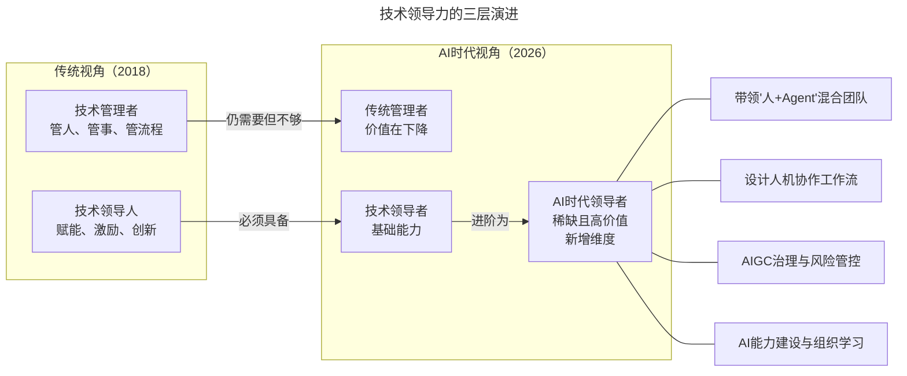
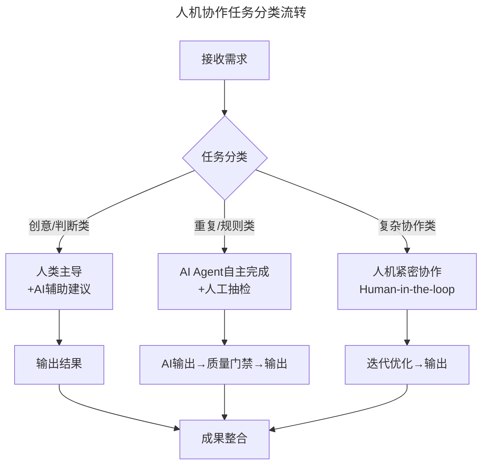

# 第4讲 | 技术领导者不等于技术管理者

> **适用范围**：技术团队的中高级管理者、架构师及有志于走向技术领导岗位的工程师，尤其是需要区分"管理"与"领导"、并希望在AI时代完成角色跃迁的技术从业者。
>
> **更新摘要（v2 · 2026-08 更新）**：
> - 结构化升级为 6 节骨架（导言 / 核心方法论 / 关键流程 / 工具与实战 / 常见误区 / 进阶延展）
> - 将"领导≠管理"扩展为"技术管理者≠技术领导者≠AI时代领导者"的三维框架
> - 补充AI时代（2026）人机协作工作模式设计与组织AI学习能力建设
> - 保留全部Mermaid图、能力对比表与行动清单

---

## 1. 导言

在成为领导者的道路上，很多人会陷入一个误区，就是把"领导"等同于"管理"。事实上，"领导"比"管理"难度更大，因为管理很多时候是在解决重复问题，有章可循，而领导经常要面对新问题、新形势，而且没有现成的规章可以遵循。

怎样成为好的技术领导者？著名软件专家、美国计算机名人堂代表人物杰拉尔德·温伯格在《成为技术领导者》（曾译名《技术领导之路》）一书中给出了一系列答案。

到了2026年，这个不等式需要进一步扩展为：**技术领导者 ≠ 技术管理者 ≠ AI时代领导者**。因为2026年的技术团队已经不再是纯人类团队了。当84%的开发者使用AI编程工具（Stack Overflow 2025），当Agentic Coding让一个工程师可以完成以前3个人的工作量时，"领导力"的定义必须进化。

上图展示了技术领导力的三层演进：从传统管理者到技术领导者，再到AI时代领导者。AI时代领导者的稀缺性最高，需要带领"人+Agent"混合团队、设计人机协作工作流、管控AIGC风险并建设组织AI能力。

---

## 2. 核心方法论

### 2.1 好的领导者可以"赋能"其他人

《成为技术领导者》这本书里，能记起来的现在还受用的主要有这么几点：

**领导对团队的作用**：优秀的领导者加入团队之后，人还是那些人，资源还是那些资源，但是做事的效率和质量都提高了很多。换用流行的说法，好的领导者可以"赋能"其他人，做成这些人之前做不成的事情。

**勇于面对自己**：如果一件事是"要做的"，但你迟迟没有做，那么坦白承认吧，你根本不想做。真正要动起来，需要极大的勇气和毅力。

**认清真实的自己**：我们并不是自己以为的样子，很可能完全不同。领导者尤其要注意自我认知的偏差。

**AI时代解读**：2026年的"赋能"有了全新含义——赋能人类（帮助工程师掌握AI工具）、赋能AI（为AI Agent配置合适的上下文和质量标准）、赋能协作（设计高效的人机协作流程）。

### 2.2 "领导"和"管理"不应割裂

技术管理不等于技术领导，技术管理者应该如何判断自己需要加管理能力还是领导力呢？这个问题没有不变的答案，好的技术管理者一定会根据具体的形势来调配"管理"和"领导"的分配，静态地、割裂地谈"领导"和"管理"都是不对的。

如果你面对的团队还没有进入稳定的"轨道"（没有形成良好的习惯），甚至其中还有南郭先生和害群之马，那多半得加强管理。如果你面对的团队已经有良好的习惯，可以在目前的轨道上运行得很好了，那可能适合加强领导。

**AI时代解读**：2026年的调配三角变为管理、领导和AI治理三者融合。当团队大量使用AI时，需要同时关注管理维度（AI工具使用规范）、领导维度（团队成员对AI的态度引导）和AIGC治理维度（数据隐私、模型偏见、输出合规性）。

### 2.3 领导力可以换算为管理力

一个管理能力不是很强的人，有可能成为好的领导者。精英型团队自驱力和凝聚力都很强，不需要太多的管理手段。当然，领导力有时候也可以"换算"为管理能力。假如公司开不起那么高工资，又需要保持团队稳定性，有不少人单纯是"愿意"跟着某些人而选择留下的。这就是领导力换算为管理力的例子。

**AI时代解读**：换算公式变了——2018版是线性关系（领导力→团队凝聚力→降低管理成本）；2026版是指数关系（AI领导力→团队AI能力→生产力指数级增长）。

### 2.4 优秀技术领导者的五大特质

| 特质 | 传统定义 | AI时代新内涵 |
|------|---------|-------------|
| **正直** | 不玩弄权术，价值观朴素 | 在AI决策中坚持伦理底线；保护用户数据隐私；透明告知AI生成内容 |
| **体谅** | 理解他人的难处 | 理解团队成员的"AI焦虑"；因人而异制定AI转型路径 |
| **谦虚** | 承认不足，鼓励团队 | 承认AI比你强的地方；这不是威胁，而是工具 |
| **眼光** | 从复杂问题中找到关键点 | 识别AI机会窗口；判断哪个业务场景适合引入AI |
| **宣传意识** | 让他人知道你在做重要的事 | 传播AI成功案例；消除恐惧，建立信心 |

---

## 3. 关键流程

### 3.1 三维对比：技术管理者 vs 技术领导者 vs AI时代领导者

| 维度 | 技术管理者 | 技术领导者 | AI时代领导者 |
|------|-----------|-----------|-------------|
| **核心职责** | 管理团队、分配任务、跟踪进度 | 赋能团队、激发创新、引领方向 | 设计人机协同模式、制定AI战略、构建AI文化 |
| **管理对象** | 人（工程师） | 人（工程师） | 人 + AI Agent + 自动化工作流 |
| **决策依据** | 经验、流程、KPI | 愿景、价值观、直觉 | 数据 + AI洞察 + 人的判断 + 伦理考量 |
| **价值来源** | 效率提升、成本控制 | 创新驱动、团队能力成长 | AI生产力释放 + 新业务可能 + 组织AI成熟度 |
| **2026年稀缺度** | ⭐⭐ （可被AI辅助） | ⭐⭐⭐⭐ （仍重要） | ⭐⭐⭐⭐⭐⭐⭐⭐⭐ （极度稀缺） |
| **典型场景** | 安排Sprint任务、做绩效评估 | 定义技术愿景、培养T型人才 | 决定引入DeepSeek V4还是GPT-5.5；设计Agent工作流 |

### 3.2 设计"人机协作"的工作模式

不再是简单地"分配任务给人"，而是要设计三类任务流转：

上图展示了人机协作的三种任务分类流转模式：创意判断类由人类主导配AI辅助建议，重复规则类由AI Agent自主完成配人工抽检，复杂协作类采用人机紧密协作的Human-in-the-loop模式。

---

## 4. 工具与实战

### 4.1 建立组织的"AI学习能力"

个人学会AI不够，要让整个组织都能持续学习AI：
- 建立**AI实践社区**（定期分享AI使用心得）
- 创建**Prompt Library**（团队共享的高质量提示词）
- 设立**AI Champion制度**（每个小组有一个AI推广大使）
- 引入**AI技能评估**（将AI能力纳入晋升考核）

### 4.2 平衡"AI效率"与"人文关怀"

这是2026年技术领导者最难但也最重要的能力：
- 一方面要用AI提升效率（这是CEO期望的）
- 另一方面要照顾团队成员的感受（这是人性需要的）
- **关键原则**：AI是用来增强人的，而不是替代人的

### 4.3 给技术领导者的行动清单（2026）

- [ ] **本周做**：统计你团队中AI工具的使用率，识别出"AI洼地"（还没用起来的人或场景）
- [ ] **本月做**：和每个1:1聊一次"AI对你的工作的影响"，了解他们的真实想法
- [ ] **本季度做**：设计一个"AI Pilot项目"，在小范围内试验新的工作方式
- [ ] **持续做**：自己成为Agentic Coding的重度用户，保持对AI前沿的敏感度

---

## 5. 常见误区

### 5.1 把"领导"等同于"管理"

"领导"比"管理"难度更大，因为管理很多时候是在解决重复问题，有章可循，而领导经常要面对新问题、新形势，而且没有现成的规章可以遵循。好的技术管理者一定会根据具体的形势来调配"管理"和"领导"的分配。

### 5.2 管理能力强就能胜任需要领导力的团队

作为反例，如果你的管理能力很强，但去了一个已经稳定运行、很需要领导力的团队，没准只会添乱。精英型团队自驱力和凝聚力都很强，不需要太多的管理手段。

### 5.3 技术领导者必须是技术最强的人

如果发现领导者善于玩弄权术，技术人员多半不会佩服，而是觉得不舒服。技术很强大，但把技术当成自己的护身符，就会很可怕。衡量领导者业绩的落脚点是团队的产出，而不是个人的表现。

### 5.4 技术团队默默无闻地付出就够了

约翰·洛克菲勒说过"除了做重要的事，也别忘了让其他人知道你在做最重要的事"。技术团队习惯默默无闻地付出，"耐心等待"上级有一个公正客观的判断，最后事与愿违。良好的宣传意识，对技术团队来说尤其重要。

### 5.5 AI时代的身份危机

2026年技术领导者面临的新心理挑战："我是否会被AI取代？"的焦虑、"我的技术积累还有价值吗？"的自我怀疑、"我应该学AI还是专注管理？"的方向迷茫。

- ❌ 错误思维："我要和AI竞争"
- ✅ 正确思维："我要成为最会用AI的人"

---

## 6. 进阶延展

### 6.1 2026年技术领导力市场数据

- **67%** 的技术管理者表示"不知道如何带领AI增强型团队"（Gartner 2025）
- **3x** 是懂AI的技术领导者薪资溢价（LinkedIn 2025数据）
- **78%** 的CTO认为"AI领导力"是未来3年最稀缺的能力（IDC 2026调研）
- **只有12%** 的公司有系统的"AI领导力培训"（McKinsey 2025）

### 6.2 推荐书单

- 《成为技术领导者》（杰拉尔德·温伯格）
- 《最后期限》《凤凰项目》《告别失控》
- 《中途岛奇迹》《午夜将至》— 跨行业领导力借鉴
- 《技术领导力300讲》专栏

### 6.3 温伯格的全面组织观

按照温伯格的意见，好的组织应当是"全面的（Organic，也可以翻译为'有机的'）"，也就是可以互相取长补短，形成一股合力。组织的全面，还体现在它是自组织的，各级的情况和任务可以在对应的级别自动自发地完成。"在全面的组织中每个人都能解决问题，做出决策，执行这些决策。而领导不需要对各种问题亲自出面，亲自做决策，亲自执行"。

### 6.4 作者简介

余晟，曾在传媒、电商行业工作，在互联网教育行业从事架构和研发管理的工作；业余翻译、审校过一些技术书籍，也撰写过专门讲解正则表达式的书籍；业余时间在个人公众号"余晟以为"（yurii-says）分享技术和管理话题。

---

*本文档基于2026年8月的技术动态编写，旨在帮助读者以新时代视角重新审视经典内容。技术演进日新月异，建议读者结合自身场景批判性思考。*
