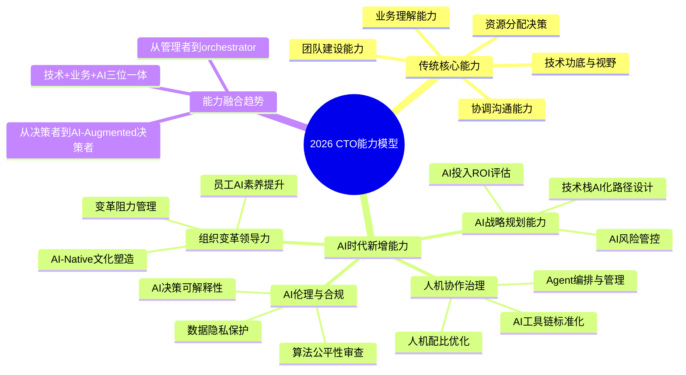
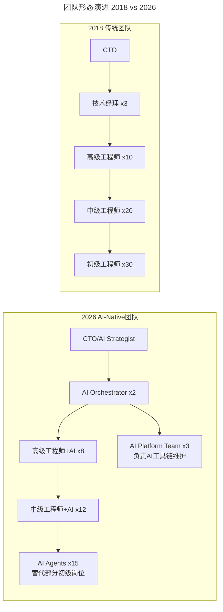
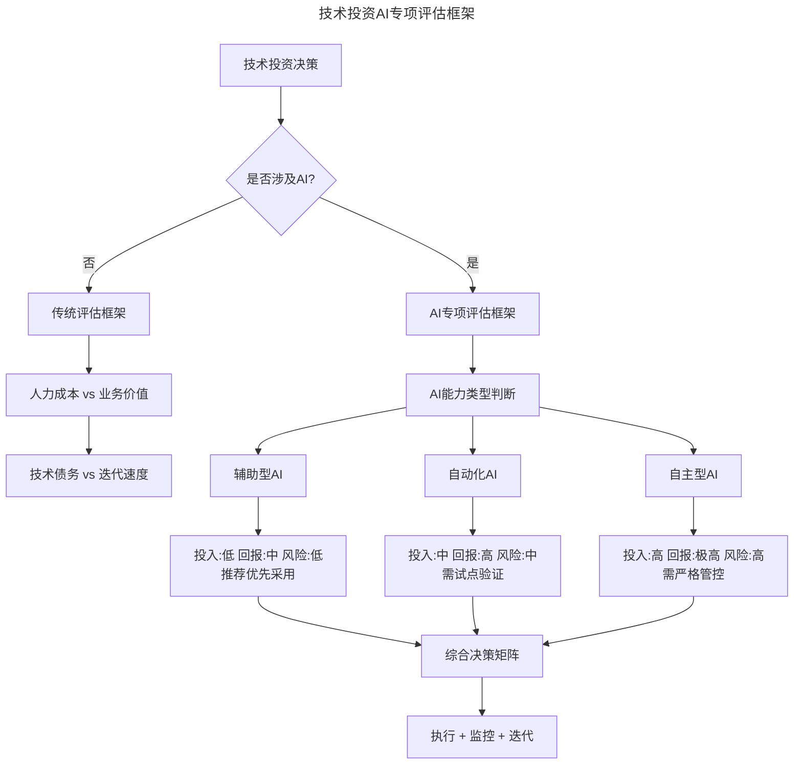

# 新春特辑1 | 卓越CTO必备的能力与素质

> **适用范围**：CTO、技术VP、技术总监及有志于成为技术领导者的资深工程师，尤其是在AI时代需要全面升级能力模型的技术管理者。
>
> **更新摘要（v2 · 2026-08 更新）**：
> - 结构化升级为 6 节骨架（导言 / 核心方法论 / 关键流程 / 工具与实战 / 常见误区 / 进阶延展）
> - 将CTO四大能力（技术功底、业务理解、资源分配、团队建设）升级为AI时代版本
> - 新增AI投资分层策略、人机混合团队转型路径与AI-Native文化建设框架
> - 保留全部Mermaid图、AI能力模型思维导图与关键数据表

---

## 1. 导言

从2018年4月16号，《技术领导力实战笔记》专栏更新第一篇文章开始，我们邀请到了近百位CEO、CTO、技术VP等技术领导者来分享他们的实践与经验，话题涉及技术领导者的核心能力、高效技术团队的打造、高效研发流程的建设、技术团队的考核与激励、技术团队文化的建设、技术人才的选育用留等多个方向。

本文作为"卓越CTO必备的能力与素质"主题专辑，汇集了多位技术领导者关于CTO核心能力的深度分享。原文核心观点包括：技术功底是基础、业务理解能力至关重要、资源分配与收益判断、团队建设能力、协调沟通能力。

站在2026年回望，技术领导力领域发生了颠覆性变革：GPT-5.5与DeepSeek V4已成为企业标配AI能力，84%的开发者日常使用AI辅助编程，Agent加速落地期到来，AI-Native组织涌现。传统技术管理能力需叠加AI战略规划、人机协作治理、AI伦理等新维度。

---

## 2. 核心方法论

### 2.1 CTO能力模型的AI时代演进

上图以思维导图形式展示了2026年CTO能力模型的完整结构：传统核心能力（技术功底、业务理解、资源分配、团队建设、协调沟通）与AI时代新增能力（AI战略规划、人机协作治理、AI伦理合规、组织变革领导力）的融合。

### 2.2 技术功底的重新定义

2026年的技术功底不再仅指编程能力或架构设计，而是包含：
- **AI工程化能力**：Prompt Engineering、RAG架构设计、Agent工作流编排
- **AI评估能力**：能够判断何时使用AI、何种AI方案适合当前业务场景
- **AI治理能力**：理解AI系统的局限性、偏见风险、安全边界

### 2.3 业务理解能力的AI增强

AI创造新业务场景：智能客服、代码生成、自动化测试等AI原生应用已成为标准业务组件。CTO需要识别哪些业务环节可以通过AI实现10x效率提升，理解AI产品的商业模式。

AI改变竞争格局：技术壁垒从"算法独占"转向"数据+场景+AI整合能力"，中小公司通过AI可以快速缩小与大厂的技术差距。

### 2.4 资源分配的AI投资分层策略

| AI应用层级 | 典型场景 | 投入规模 | 预期ROI | 风险等级 | 建议 |
|-----------|---------|---------|---------|---------|------|
| **L1 辅助型** | 代码补全、文档生成、会议纪要 | 低（工具订阅） | 20-50%效率提升 | 低 | 全面推广 |
| **L2 自动化型** | 自动测试、CI/CD优化、智能运维 | 中（平台搭建） | 2-5x效率提升 | 中 | 试点后推广 |
| **L3 自主型** | 自主编码Agent、自主运维Agent | 高（定制开发） | 5-10x潜力 | 高 | 小范围实验 |
| **L4 战略型** | AI驱动的产品创新、商业模式变革 | 极高 | 不确定 | 极高 | 战略级决策 |

**关键洞察**：2026年最佳实践是从L1开始快速见效，逐步向L2/L3演进。建立AI投资组合：70%资源用于L1/L2（确定性收益），20%用于L3（探索性），10%用于L4（前瞻性）。

### 2.5 从"纯人类团队"到"人机混合团队"

上图展示了团队形态从2018年传统团队到2026年AI-Native团队的演进。初级工程师岗位减少30-50%（被AI Agent替代），新增"AI编排者"和"AI平台团队"角色，同样产出下团队人数可减少20-30%，但人均产出要求提升3-5倍。

---

## 3. 关键流程

### 3.1 AI投资决策流程

上图展示了技术投资的AI专项评估框架：根据AI能力类型（辅助型/自动化型/自主型）评估投入、回报和风险，形成综合决策矩阵。

### 3.2 技术债务的AI化重构

**AI降低重构成本**：传统需要3个月的重构任务，AI辅助下可能缩短到3周。

**AI创造新型技术债务**：
- Prompt Debt：大量硬编码的低质量Prompt
- Model Coupling：过度依赖特定AI模型版本的代码
- Data Pipeline Debt：为AI训练而搭建的临时数据处理管道

**重构优先级的AI时代排序**：
1. 影响AI能力的遗留系统（阻碍AI集成）
2. 可被AI大幅优化的高频人工流程
3. 传统技术债务（按原有优先级）
4. 纯粹的代码风格/规范问题（AI可自动修复）

### 3.3 技术文化与AI文化的融合

| 文化维度 | 传统做法 | AI时代升级 |
|---------|---------|-----------|
| **学习文化** | 技术分享会、读书会 | + AI工具使用经验分享、Prompt Engineering工作坊 |
| **创新文化** | Hackathon、技术创新奖 | + AI应用创新大赛、Agent效能竞赛 |
| **质量文化** | Code Review、技术评审 | + AI Code Review规范、AI生成代码质量标准 |
| **协作文化** | 敏捷站会、跨组协作 | + 人机协作协议、AI Agent交接规范 |
| **开放文化** | 开源贡献、技术博客 | + Prompt开源、AI Workflow共享 |

---

## 4. 工具与实战

### 4.1 CTO技术自检清单（2026）

- [ ] 是否亲自使用AI编程工具完成过完整功能开发？
- [ ] 是否能评估不同LLM在特定场景下的适用性？
- [ ] 是否了解Agent架构的基本设计模式？
- [ ] 是否参与过AI系统的上线决策和风险评估？

### 4.2 可执行建议

**立即行动（本周内）**：
1. 完成个人AI能力自评——使用GPT-5.5/Cursor完成一个真实项目模块开发
2. 梳理团队的AI工具使用现状——统计团队成员使用AI编程工具的比例
3. 启动一项AI Pilot项目——选择低风险的内部项目，2周内出MVP

**短期规划（1-3个月）**：
4. 制定团队AI能力提升计划——为不同级别工程师设定AI技能要求
5. 优化技术决策流程——在技术方案评审中增加"AI可行性"评估维度
6. 重构团队绩效考核——增加"AI生产力贡献"指标

**中期战略（3-12个月）**：
7. 推动AI-Native团队转型——设计新的组织架构
8. 建设AI治理体系——制定AI使用政策、模型评估标准、风险管理流程
9. 打造技术品牌的AI标签——分享AI实践经验，参加AI技术大会

### 4.3 关键数据参考（2026年）

| 指标 | 数据 | 来源 | 启示 |
|-----|------|------|------|
| 开发者AI使用率 | 84% | Stack Overflow Survey 2025 | AI已是标配，不是可选 |
| AI编程效率提升 | 3-5x | GitHub Copilot报告 | 显著提升，但需质量管理 |
| 企业AI adoption | 67% | McKinsey 2026 | 过半数企业已在用AI |
| AI替代岗位预估 | 初级开发30-50% | Goldman Sachs 2025 | 团队结构调整不可避免 |
| AI投资ROI中位数 | 250% | Gartner 2026 | 投资AI有正回报，但差异大 |
| Agent落地率 | 35%的企业试点 | Forrester 2026 | Agent仍处早期，机会窗口 |

---

## 5. 常见误区

### 5.1 CTO是单项能力的最强者

"技术团队中单项能力的最强者未必是CTO"。在AI时代更是如此——CTO的价值不在于自己写最好的代码或用最溜的AI，而在于构建一个让AI和人类都能发挥最大价值的系统。

### 5.2 AI大跃进

不要一开始就追求L4级别的AI转型。最佳实践是从L1开始快速见效，逐步向L2/L3演进。避免"AI大跃进"式的一步到位。

### 5.3 忽视AI新型技术债务

只关注传统技术债而忽视Prompt Debt、Model Coupling、Data Pipeline Debt等AI新型技术债务，这些问题会在后期集中爆发。

### 5.4 团队绩效考核未更新

仍然用代码量、Bug数量等传统KPI考核团队，没有增加"AI生产力贡献"指标，导致团队为了KPI而拒绝使用AI工具。

### 5.5 忽视AI文化建设

只引入AI工具而不建设AI文化。如果没有AI使用规范、AI Champion角色、AI知识库和定期AI效能复盘，AI工具很难在团队中真正落地。

---

## 6. 进阶延展

### 6.1 核心启示

> **"2026年的卓越CTO，不再是单纯的技术专家或管理者，而是'AI战略家+人机协作指挥官+组织变革领导者'的三位一体角色。"**

原文中的四大能力（技术功底、业务理解、资源分配、团队建设）依然重要，但在AI时代需要全面升级：

1. **技术功底** → AI工程化能力 + 技术判断力
2. **业务理解** → AI业务场景识别 + AI ROI评估
3. **资源分配** → AI投资组合管理 + 人机资源优化
4. **团队建设** → AI-Native组织设计 + 人机协作文化

### 6.2 AI文化建设实施建议

1. **建立AI使用规范**：明确什么场景必须/禁止使用AI，如何标注AI生成内容
2. **设立AI Champion角色**：每个团队指定1-2人负责AI工具推广和问题解答
3. **创建AI知识库**：沉淀团队内部的优质Prompt、Agent配置、最佳实践
4. **定期AI效能复盘**：度量AI工具的使用率、效果、问题，持续优化

### 6.3 资源争夺的新战场

2026年新增资源类型：
- **AI算力资源**：GPU/TPU配额、API调用额度、模型训练预算
- **AI人才资源**：懂AI的工程师稀缺且昂贵
- **数据资源**：高质量训练数据成为新的战略资产
- **AI工具授权**：企业版AI工具的License数量限制

CTO的资源争取策略：量化AI投入产出、建立AI卓越中心、推动AI资源共享机制、培养内部AI能力。

---

*本文档基于2026年8月的技术环境生成，结合GPT-5.5、DeepSeek V4、Agent加速落地等最新动态。建议每季度回顾更新一次。*
