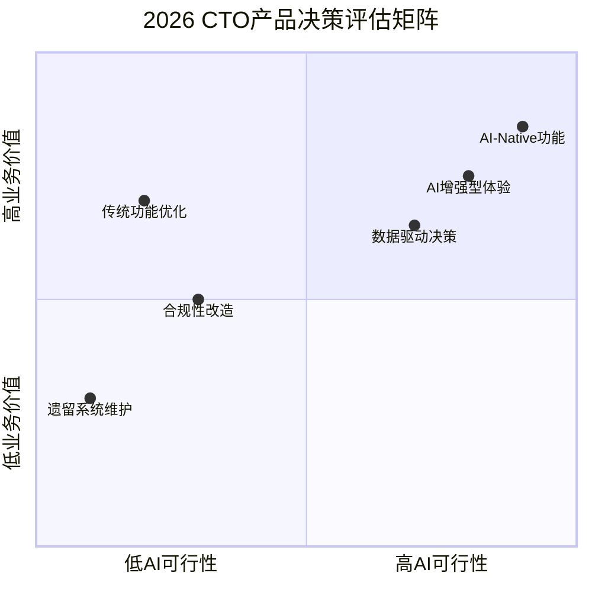
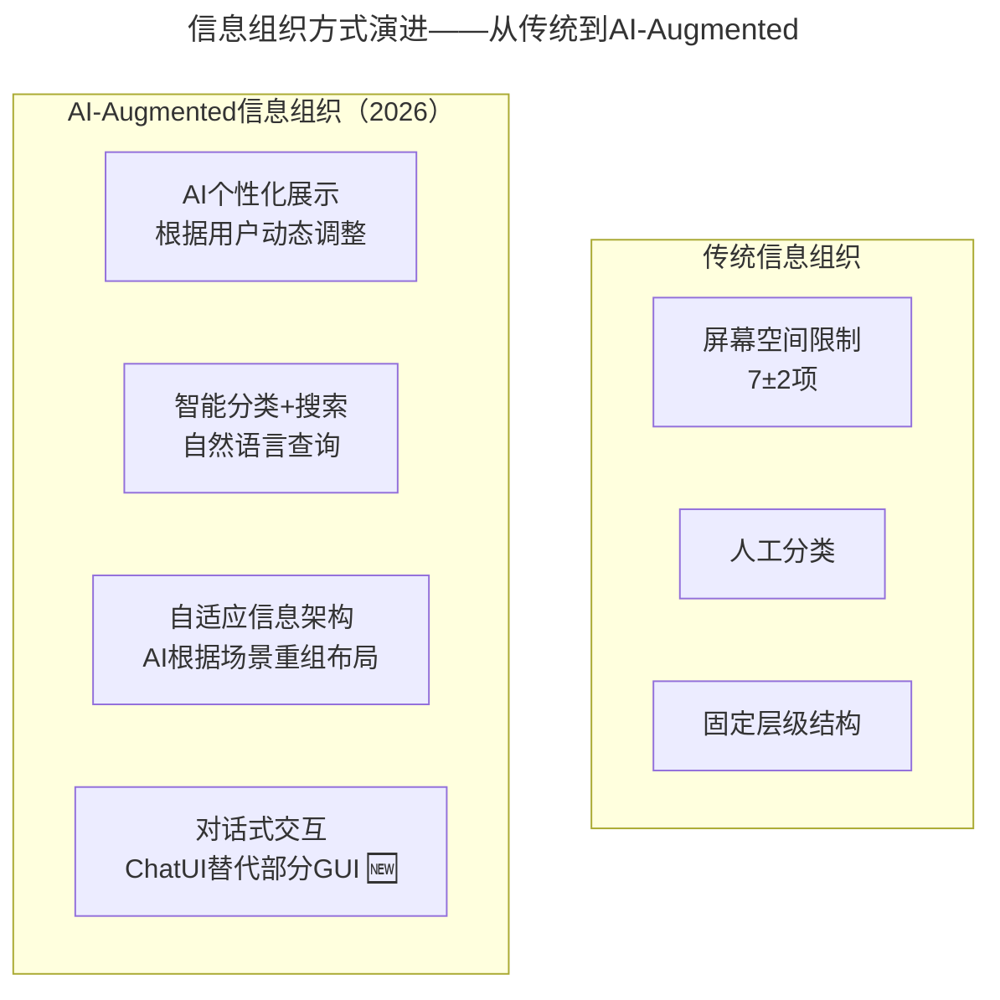
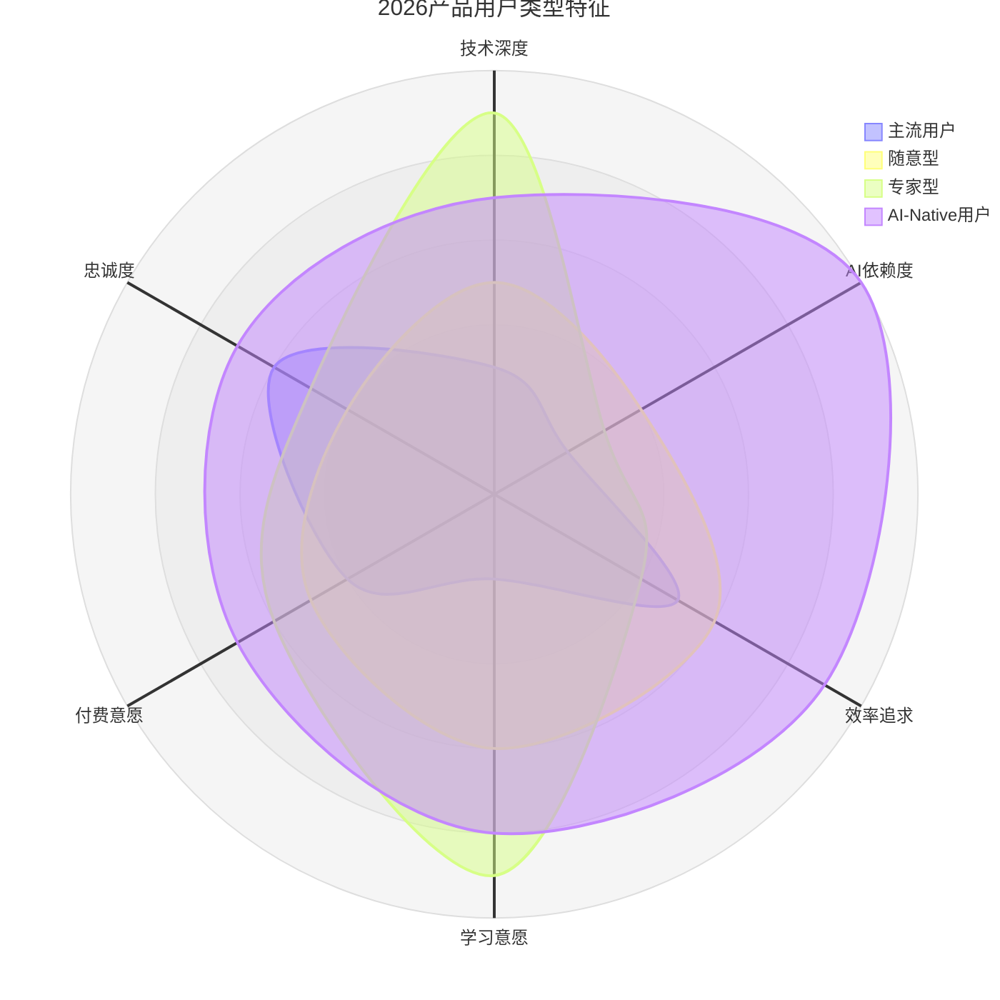
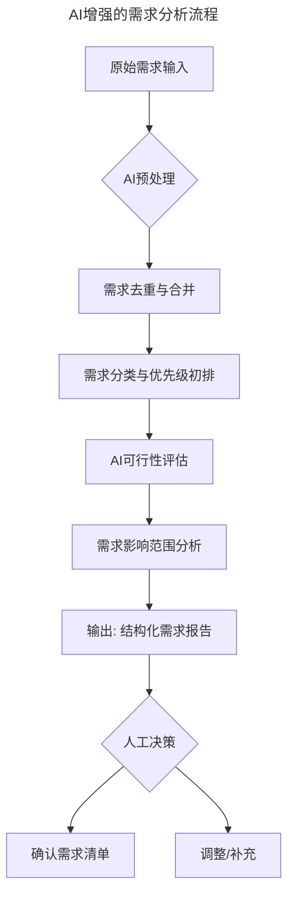
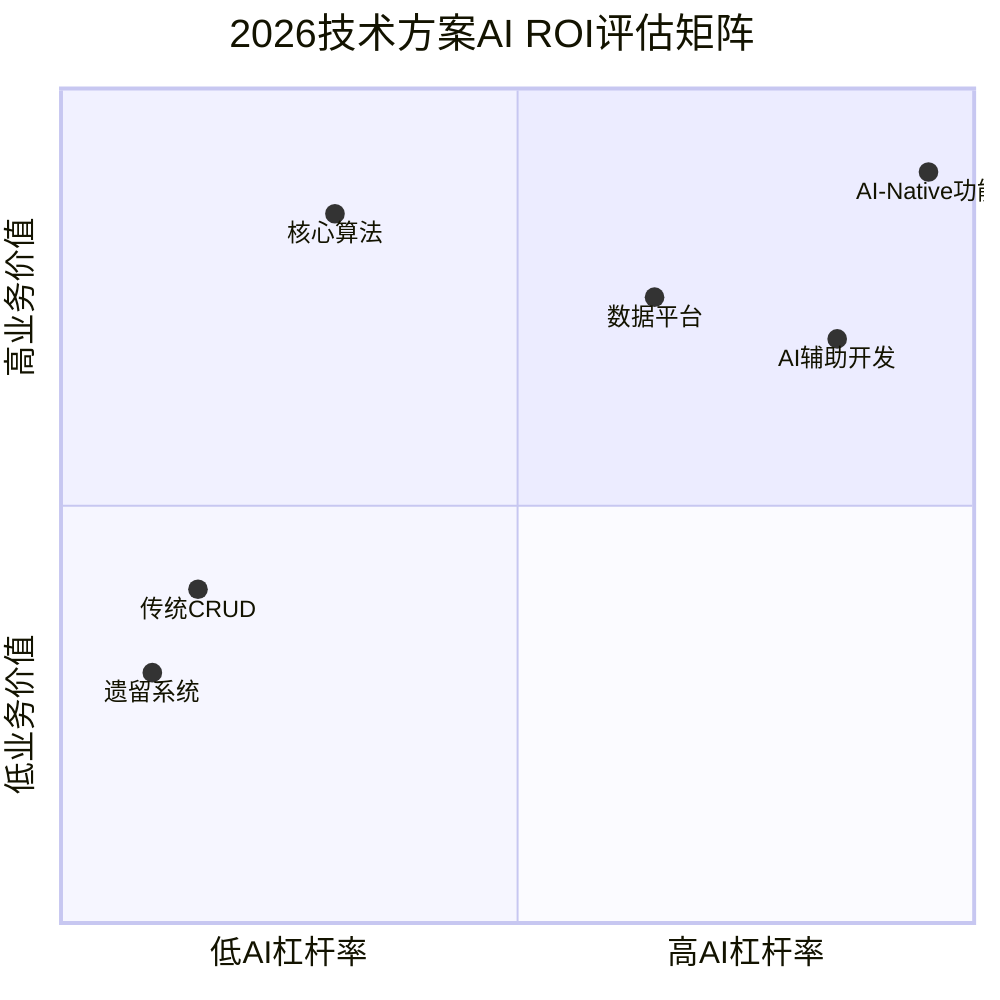

# 第119讲 | 汤力嘉：CTO如何进行产品决策

> **适用范围**：CTO、产品技术负责人及需要做产品决策的技术管理者，尤其是在AI时代需要重新审视"简单四策略"、用户分类模型和需求验证方法的管理者；同样适用于关注AI增强产品决策流程（AI-Augmented Product Decision）的从业者。
>
> **更新摘要（v2 · 2026-08 更新）**：
> - 结构化升级为 6 节骨架（导言 / 核心方法论 / 关键流程 / 工具与实战 / 常见误区 / 进阶延展）
> - 将"简单四策略"全面升级为AI时代版本：删除→AI辅助价值判断、组织→AI驱动信息架构、隐藏→AI预测性呈现、转移→AI作为新转移目标
> - 补充2026 CTO产品决策五维模型、AI-Native用户类型、需求/方案/执行/复盘四阶段AI增强流程
> - 保留全部Mermaid图、对照表与行动清单

---

## 1. 导言

做一款产品前，首先需要做产品决策。引用乔布斯的一段话，"一个问题看上去很简单，是因为你并没有理解其复杂性；当你把问题搞清楚之后，又会发现其实很复杂，然后拿出了一套复杂的方案来，实际上你只实现了一半，大多数人也都会到此为止；但真正伟大的人会继续前进，找到问题的关键和内在的深层次原因，再拿出优雅的、堪称完美的解决方案"。

正如乔布斯喜欢的另一位伟人达·芬奇曾说过的一句话："简单，是终极的复杂。"

对于这句话所表达的观点，我非常认同。产品决策最重要的是简单，但简单不意味最少化，简单是具有个性的朴素设计。

**2026年技术背景**：2026年，原文核心方法论"简单四策略（删除、组织、隐藏、转移）"在AI时代需要全面升级——AI不仅是实现简单的工具，更是重塑产品决策逻辑的新维度。CTO做产品决策时必须考虑三个新增维度：AI可行性、AI用户体验（AI UX）、AI合规性。84%开发者使用AI编程意味着产品本身可能就是AI驱动的或AI增强的。

---

## 2. 核心方法论

### 2.1 决策方法论：简单是终极的复杂

举一个耳熟能详的例子，某肥皂生产厂，在肥皂出厂时，会为肥皂装上塑料泡沫盒。但在生产线上，难免出现泡沫盒装空的情况。于是厂商请来高科技团队，研究如何分拣这些空盒。高科技团队耗费大半年时间，开发出一套高精度摄影设备，可以检测空盒位置，再用灵活的机器手把它们捡出来。同样的问题，另外一位民间科学家，买了一台大功率风扇放在生产线旁边，然后将风力开到最大，把空盒吹走，成功解决了问题。

从这个案例中可以看到，有时最简单的设计，往往效率最高，它不仅能够解决眼下的问题，还相对便宜，不会引起争议，更容易被接受，而复杂是不可持续的。

**检验简单的方法**：
1. 能用一句话表述功能
2. 思考你的用户希望有什么样的体验

### 2.2 用户分类：三类→四类

**原文三类用户**：

1. **专家型用户**：愿意使用你的产品，并且愿意花费时间探索和研究产品，并不断提出意见。这类用户的数量最少。
2. **随意型用户**：对一些新功能比较感兴趣，但是，新功能必须足够简单，最好是在原有功能基础上扩展、衍生的。
3. **主流用户**：一点都不想学习新功能，他们使用产品的目的只是为了解决某些固有的问题。大多数人属于这一类用户。

**原文结论**：为主流用户设计，解决主流用户的问题。

**⭐2026新增第四类：AI-Native用户**：

| 特征 | 描述 | 产品设计启示 |
|-----|------|------------|
| 期望AI优先交互 | 更喜欢ChatUI而非复杂表单 | 提供"Ask AI"入口 |
| 接受AI的不完美 | 能容忍AI幻觉和错误 | 设计优雅的降级方案 |
| 愿意为AI能力付费 | 订阅AI增强功能 | AI功能可作为增值服务 |
| 快速迭代预期 | 期望产品每周都有AI改进 | 建立AI功能更新节奏 |

### 2.3 简单四策略——AI时代演绎

#### 策略一：删除 → AI辅助的价值判断

**原文**：保留核心功能，删除不必要的

**⭐2026升级**：用AI分析用户行为数据，科学决定删什么

| 传统做法 | AI增强做法 |
|---------|-----------|
| 产品经理凭直觉砍功能 | AI分析用户行为漏斗，识别无人使用的功能 |
| 争论"这个功能有人用" | AI给出数据：该功能日活<1%，且用户反馈为负 |
| 担心删错 | A/B Test + AI预测删除后的影响范围 |

#### 策略二：组织 → AI驱动的信息架构

**原文**：感知分层（如价格标红）、记忆7±2原则

**⭐2026升级**：AI重新定义信息组织的边界

- 从"7±2限制"到"AI按需展示"——用户看到的是AI判断最相关的信息
- 从"固定分类"到"语义搜索"——用户用自然语言找到想要的内容
- 新增第四种组织方式：对话式交互（ChatUI）

#### 策略三：隐藏 → AI预测性呈现

**原文**：隐藏不常用但必需的功能

**⭐2026升级**：AI让隐藏的功能在需要时自动浮现

| 场景 | 传统隐藏方式 | AI增强隐藏方式 |
|-----|------------|--------------|
| 高级设置 | 放入"更多"菜单 | AI检测用户意图，主动提示高级选项 |
| 帮助文档 | 放入帮助中心 | AI Chatbot内嵌，随时回答上下文相关问题 |
| 专业知识 | 需要用户自己学习 | AI解释器：实时解释专业术语和概念 |

#### 策略四：转移 → AI作为新的转移目标

**原文**：设备间转移（PC vs Mobile）、开放式体验

**⭐2026升级**：从设备间转移到人机间

| 转移类型 | 传统 | AI时代新增 |
|---------|------|----------|
| 设备间 | PC ↔ Mobile | ↔ 语音/AI助手/AR眼镜 |
| 人与人 | 客服 ← 用户 | ← AI Agent（7×24服务） |
| 人与系统 | 用户操作系统 | → AI Co-pilot（人机协同操作）🆕 |
| 系统与系统 | API调用 | → Agent间协作（Agent-to-Agent）🆕 |

### 2.4 需求验证四因素

1. **调查的局限性**：调查结果本身有很多局限性，不可以完全相信（可口可乐新口味案例、内地茶饮料案例）
2. **决策情感**：用户是否购买产品，很大一部分取决于心理因素（可口可乐与百事可乐的核磁共振研究案例）
3. **眼见不为实**：应该从多个角度出发思考问题（英国脱欧后谷歌搜索数据案例）
4. **先入为主**：人们容易先入为主，戴着有色眼镜去看待，结果就会误导事实

**判断想法是否靠谱的五个方面**：产品价值、目标市场、市场规模、市场格局、竞争优势

**判断想法是否可行的四个方面**：切入时机、运营推广、量化指标、风险应对

### 2.5 CTO产品决策的AI时代Checklist

| 决策阶段 | 必问问题 |
|---------|---------|
| **需求阶段** | 这个需求可以用LLM/AI来实现吗？效果会如何？ |
| **设计阶段** | 用户会与AI有直接交互吗？UX如何设计？ |
| **开发阶段** | 开发过程中可以使用哪些AI工具提效？ |
| **测试阶段** | 如何用AI保证质量（特别是AI生成部分的测试）？ |
| **发布阶段** | AI模型的版本管理和灰度策略是什么？ |
| **运营阶段** | AI是否需要持续学习和优化？数据如何收集？ |
| **合规阶段** | AI使用是否符合EU AI Act等法规要求？ |

---

## 3. 关键流程

### 3.1 ⭐2026 CTO产品决策五维模型



上图以四象限矩阵展示2026年CTO产品决策的评估维度。AI-Native功能和AI增强型体验位于高AI可行性、高业务价值区域，是优先投入方向；遗留系统维护位于低AI可行性、低业务价值区域，需控制投入。

### 3.2 新增三维度详解

| 新维度 | 定义 | 2026关键问题 | 决策影响 |
|-------|------|------------|---------|
| **AI可行性** | 该功能/产品是否适合用AI实现？ | LLM能否理解需求？是否有足够训练数据？模型成本是否可接受？ | 决定技术路线 |
| **AI UX** | 用户与AI交互的体验如何设计？ | AI输出是否可控？用户是否信任AI建议？失败时如何降级？ | 决定产品设计 |
| **AI合规性** | AI使用是否符合法规？ | 数据隐私（PII）、模型偏见、输出责任、EU AI Act合规？ | 决定是否上线 |

### 3.3 AI-Augmented信息组织演进



上图对比了传统信息组织与AI-Augmented信息组织的差异。传统方式受限于屏幕空间（7±2项）、人工分类和固定层级；AI-Augmented方式实现了AI个性化展示、智能分类+搜索、自适应信息架构，并新增了对话式交互（ChatUI）这一第四种组织方式。

### 3.4 2026产品用户类型特征



上图以雷达图展示2026年四类产品用户的特征差异。AI-Native用户在AI依赖度和效率追求上远超其他类型，技术深度和学习意愿也较高，是AI时代产品设计需要重点关注的新用户群体。

### 3.5 AI增强的需求分析流程



上图展示了AI增强的需求分析流程。原始需求经过AI预处理（去重、分类、优先级初排、AI可行性评估、影响范围分析），输出结构化需求报告，最终由人工决策确认或调整，实现AI辅助+人类决策的协作模式。

### 3.6 技术方案AI ROI评估



上图以四象限矩阵展示2026年技术方案的AI ROI评估。AI-Native功能和AI辅助开发位于高AI杠杆率、高业务价值区域，是优先投资方向；传统CRUD和遗留系统位于低杠杆率、低价值区域，应最小化投入。

**AI ROI 计算公式（2026版）**：

```
AI ROI = (AI节省的人力成本 + AI带来的收入增长) / (AI工具订阅费 + API调用费 + 学习成本)

其中：
- AI节省的人力成本 = (1 - AI加速比) × 原始工时 × 人均时薪
- AI带来的收入增长 = 因AI提升的用户体验/效率带来的增量收入估算
```

### 3.7 AI-Enhanced执行管理

| 管理域 | 传统方式 | AI增强方式 | 关键工具 |
|-------|---------|-----------|---------|
| **进度管理** | 每日站会、甘特图 | AI基于Git/Jira数据预测延期风险 | Linear AI / Notion AI |
| **质量管理** | Code Review、手动测试 | AI Code Review + Agent自动化测试 | CodeRabbit / Qodo |
| **风险管理** | 定期风险会议 | AI实时监控指标异常并预警 | 自定义监控Agent |
| **沟通协作** | IM工具、文档 | AI Meeting Assistant + 自动同步 | Otter.ai / Fireflies |
| **资源调度** | 人工分配任务 | AI建议最优人员-任务匹配 | 内部AI调度系统 |

---

## 4. 工具与实战

### 4.1 删除决策Checklist（2026版）

- [ ] 该功能的AI杠杆率高吗？（如果高，考虑AI化而非删除）
- [ ] 删除后是否影响AI推荐算法的效果？
- [ ] 用户数据是否可以用于训练更好的AI模型？

### 4.2 方案评审Checklist（含AI维度）

- [ ] 该方案的AI可行性评分是多少？（1-10）
- [ ] 是否考虑了AI替代方案？（如用LLM替代规则引擎）
- [ ] 方案中的AI成本模型是否合理？（工具费、API费、推理成本）
- [ ] 是否有AI失败降级方案？（当AI不可用时如何保证服务可用）
- [ ] AI合规性风险有哪些？如何规避？

### 4.3 程序员思维特征与AI时代管理

**原文程序员思维特征**：
- 一切都有标准，都可以量化，都可以实现
- 认为管理者应该是理性的机器，公平的处理每件事
- 以自我为中心，文人相轻，认为自己最牛
- 情绪化，高兴就给你加班做，不高兴才不管你呢
- 首要需求是被人欣赏，其次是有参与感以及被认同

**管理方法**：把所有任务拆解成一个个工单，每个工单会有相应的积分，如果工单延误会扣掉相应积分，如果出bug也会扣掉相应的积分，最后汇总成总分榜，排名靠前的同学就会特别有成就感和荣誉感。

### 4.4 ⭐2026行动清单

- [ ] 梳理当前负责的产品/功能，标注每个的"AI可行性评分"（1-10）
- [ ] 识别出至少1个适合"AI-Native"重构的功能点
- [ ] 在下一次产品评审中，使用上述"AI时代五维模型"进行评估
- [ ] 使用AI增强需求分析流程处理下一个需求
- [ ] 在方案评审中加入AI维度Checklist

### 4.5 想法落地的四大障碍

确定了产品策略靠谱，又可执行，但为什么还是无法落地呢？主要原因有以下四点：

1. **想不清**：想法落地的过程中可能会发生改变，这是最伤筋动骨的
2. **推不动**：包括人员、招聘、推广等等，都有可能推不动
3. **没价值**：行动后发现，全量的客户有限，根本没有增量空间
4. **时机不对**：比如手机配置还不足以支撑某个功能的时候

---

## 5. 常见误区

### 5.1 沉没成本误区

不想浪费已经做完的功能，干脆将它一起上线。这在经济学中被称为沉没成本，功能做出来后，成本已经没办法收回了，但如果选择将功能保留，它会产生更多额外成本。所以当我们考虑是否保留某个功能时，要考虑的不是为什么要删除它，而是为什么要留下它。

### 5.2 功能越多越好

Replay播放软件案例：21项功能版 vs 7项功能版。用户在使用前有2/3倾向于功能多的版本，但使用后2/3更喜欢7个功能版。

### 5.3 为专家型用户服务

多数公司都在为专家型用户服务，并在听取专家型用户的意见方面花费了太多时间。但专家型用户反映的问题究竟是不是产品应该解决的是需要思考的。以Excel为例，专家型用户可能会试试分类汇总、邮件合并等高级功能，但99%的用户只希望能解决金额求和这个简单问题。

### 5.4 选择越多用户越喜欢

果酱铺实验：提供二十多种口味时只有2%的人购买，只留六种口味时购买率提升到12%，且顾客愉悦度大大提升。有时给用户提供有限的选择，用户反而更开心。

### 5.5 调查结果完全可信

调查结果本身有很多局限性。可口可乐新口味调查显示多半用户喜欢，但忠于旧口味的用户上街游行；内地茶饮料调查显示人们要喝泡好的热茶，但台湾厂商直接把茶当饮料卖并占据市场。

### 5.6 AI时代"为了AI而AI"

在AI时代，"简单"的定义变了——最好的简单可能是"对用户来说一个自然语言请求就能搞定的事情"。但如果传统方法能以更低成本达到同样效果，就不应该为了AI而AI。

---

## 6. 进阶延展

### 6.1 渐进三部曲与转移

我将删除、组织、隐藏这三个策略称为渐进三部曲：首先删除不必要的，其次组织必须提供的，然后隐藏非核心的。如果这三个策略都不行，还有第四个策略，即转移。

转移有两种方法：
1. **设备间转移**：比如电商网站的产品，通常会在手机端页面展示较少内容，而在PC端页面展现更多内容
2. **创造开放式体验**：让某些功能具有多种用途，比如大众汽车后备厢上的Logo既是打开后备厢的拉环，又是隐藏倒车雷达摄像头的地方

### 6.2 简单四策略记忆7±2原则

通常，一个人的短时记忆容量为7个事物，记忆力好的可以达到9个，记忆力差的可以记忆5个。在构想产品时，要确保一个页面只能保留7个事物。如果无法只容纳7个事物，可以利用感知分层技术——把相关事物用同样的颜色标记起来。

### 6.3 屁股理论

一个公司就像人体，CEO就是人的大脑，产品人员就是人体的胃，程序员就是屁股。程序员产出产品并交给运营。如果屁股不工作，人就会中毒死亡，但一切正常的时候，你又会忽略屁股的存在。同样，程序员不工作就没有产品，而产品质量也取决于程序员。

### 6.4 复盘阶段的AI驱动数据洞察

| 环节 | 传统做法 | AI增强做法 | 效率提升 |
|-----|---------|-----------|---------|
| **数据收集** | 人工导出报表 | AI自动聚合多源数据 | 时间↓80% |
| **效果评估** | 对比目标vs实际 | AI多维归因分析 | 洞察深度↑3x |
| **经验总结** | 人工写复盘文档 | AI生成结构化复盘报告 | 时间↓70% |
| **行动建议** | 团队讨论决定 | AI基于历史数据推荐 | 决策质量↑ |

### 6.5 作者简介

汤力嘉，一下科技CTO，负责旗下秒拍、小咖秀、一直播等产品的研发及团队管理工作。历任酷6、暴风技术总监，在直播、p2p、视频特效等领域拥具有丰富的行业经验。

### 6.6 核心思想总结

简单的去做一件事情，并将这件事做到极致，是这两期内容想表达的主要思想，也是做产品的关键思路。服务是全世界最贵的产品，任何产品都离不开其背后各个团队的付出。作为CTO，我们要在人、钱、事等方面深思熟虑。唯一不变的就是变化。

---

*本文档基于2026年8月的技术动态编写，旨在帮助读者以新时代视角重新审视经典内容。技术演进日新月异，建议读者结合自身场景批判性思考。*
